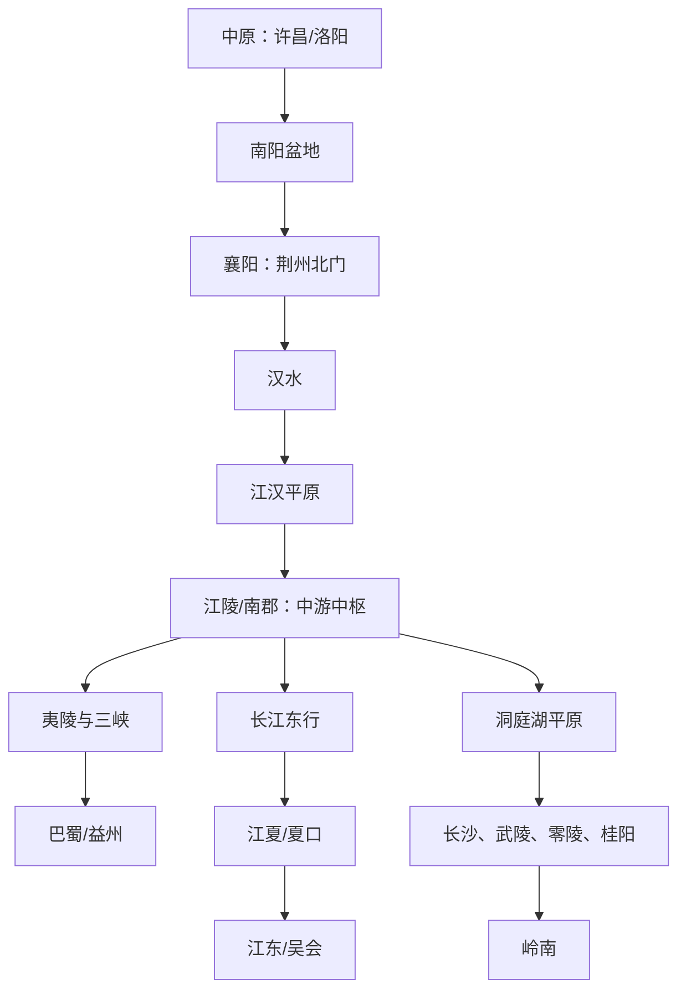

# 第一章　三国古战场：荆州在哪里

- **创建日期**：2026-07-19
- **状态**：初版，后续可补充专题地图与考古资料
- **关键词**：荆州、襄阳、江陵、汉水、长江、赤壁、南郡、关羽、夷陵、三国
- **章节性质**：原创历史地理学习指南，不是原书逐段复述

## 摘要

三国时代的“荆州”不是今天湖北省荆州市这一座城市，而是一个范围广阔、边界随年代变化的州级区域。它的核心大致覆盖长江中游、汉水流域、江汉平原和洞庭湖平原，并通过南阳—襄阳走廊连接中原，通过三峡连接巴蜀，顺长江连接江东，向南连接湘江流域和岭南。正因为它位于多个区域系统的交会处，荆州既是进攻四方的战略平台，也是四面受压、难以完整防守的“高价值脆弱区”。

赤壁之战、南郡争夺、孙刘分荆州、关羽北伐与失守、夷陵之战看似是不同人物的不同选择，实际上都围绕同一个问题展开：**谁能控制长江中游的交通节点、粮食区和水陆转换口，谁就能改变天下力量的连接方式。**

本章的核心结论不是“地理决定历史”，而是：

> 地理决定可选路线、行动成本和风险结构；人物、组织与制度决定在这些约束下做出什么选择。

---

## 一、先纠正一个最常见的误解：古代荆州不等于今天荆州市

今天的荆州市是湖北省的一座地级市，历史上常与江陵相联系。三国时代史书里的“荆州”，却通常指东汉的州级监察区和后来逐渐军事行政化的区域，其尺度接近一个大型省区，而不是一座城。

理解“荆州”时，至少要区分三层含义：

| 层次 | 含义 | 阅读三国史时的作用 |
|---|---|---|
| 传统地理概念 | 古代“九州”之一，边界带有文化地理性质 | 解释“荆楚”“荆蛮”等古老称呼 |
| 汉代州级区域 | 东汉十三州之一，下辖多个郡 | 三国史书中最常见的含义 |
| 城市名称 | 后世荆州、江陵一带的城市称呼 | 容易与州级荆州混淆 |

东汉时期的荆州大体包括今天湖北、湖南的大部分地区，并延伸到河南南部及周边若干区域；具体边界和所辖郡数并非固定不变。战争期间，曹操、孙权和刘备又不断拆分、占领和重组郡县，因此看到“荆州七郡”“荆州九郡”或“荆州数郡”时，必须先问：**说的是哪一年、哪一方控制下的行政区？**

这是一条重要的历史阅读方法：古代地名往往有“同名不同级”“同名不同地”“同地不同时”的问题。若不先确定年代和行政层级，就很容易把现代地图直接套在古代史上。

---

## 二、荆州的地理骨架：不是一块平面，而是一套交通网络

如果把三国时代的荆州只看成地图上的一大片颜色，就无法理解它的战略价值。真正重要的是其中几个相互连接的节点。

### 1. 北门：南阳—襄阳—汉水

襄阳位于汉水中游，是北方陆路与南方水路的转换点。向北经过南阳盆地，可以进入中原；沿汉水向西北，可接近关中、汉中方向；顺汉水向南东，则进入江汉平原并汇入长江。

这使襄阳具有“双重门槛”性质：从北方看，它是进入长江中游的门；从南方看，它是北上宛城、洛阳的出发台。刘表把荆州治所放在襄阳，不只是因为城市坚固，更因为这里能够监控来自中原的压力，并连接荆州内部的水陆交通。

### 2. 中枢：江汉平原与江陵

汉水和长江共同塑造江汉平原。平原、湖泊和河网既提供农业与人口基础，也形成庞大的水运体系。江陵所在的南郡接近长江中游，是西进三峡、东下江东、北联襄阳、南接洞庭的重要节点。

在古代，陆路运输成本高，规模化运粮尤其困难。水路能够用较低成本运输粮草、军械和人员，因此控制江陵并不只是占有一座城，而是控制一座大型“物流交换站”。曹操在建安十三年迅速追向江陵，刘备撤退时也试图向江陵靠拢，背后正是对这里军资、船只和人口资源的争夺。

### 3. 东门：江夏、夏口与长江—汉水交汇区

荆州东部通向孙权控制的江东。江夏郡和夏口一带靠近长江、汉水的汇合区域，是中游与下游之间的接口。这里既可阻止上游势力顺流东下，也可作为江东军队逆流西进的前进基地。

赤壁之战前后，夏口、樊口、乌林、赤壁等地频繁出现在记载中，因为双方真正争夺的是长江中游的通行权和舰队展开空间，而不是孤立的一座山。

### 4. 西门：夷陵与三峡出口

从江陵向西进入宜昌、夷陵一线，再通过三峡可达益州。三峡是一条极重要但受地形强烈约束的走廊，行军、航运和补给都集中在有限通道内。

谁控制夷陵—江陵轴线，谁就可能切断或打开巴蜀与长江中游之间的联系。后来刘备东征孙吴，战场集中在秭归、夷陵、猇亭一线，并不是偶然：这里正是蜀汉从四川盆地走向荆州的必经前沿。

### 5. 南部腹地：洞庭湖平原与湘江流域

荆州南部的长沙、武陵、零陵、桂阳等郡连接洞庭湖、湘江流域和岭南通道。对刘备而言，这些地区可以提供人口、粮食和战略纵深；对孙权而言，它们关系到江东西侧安全以及向岭南扩展的联系。

因此，所谓“争荆州”并不只是争江陵，也包括争夺南部郡县的税粮、兵员与交通线。

### 6. 一张简化的地理结构图

这张图揭示了荆州真正的价值：它不是单一方向的边疆，而是连接中原、巴蜀、江东和岭南的网络中心。

---

## 三、荆州的战略悖论：越重要，越难完整占有

人们常说荆州“得之可争天下”，但这句话只说对了一半。荆州确实能提供多方向机动能力，可它也存在严重的防御问题。

### 优势：中央位置带来行动选择

控制荆州者可以北出宛洛、西通巴蜀、东下江东、南取岭南。诸葛亮在《隆中对》中概括荆州“北据汉、沔，东连吴会，西通巴、蜀”，正是在描述它的网络中心性。

### 弱点：多个入口意味着多个威胁方向

荆州北面面对曹魏，东面紧邻孙吴，西面连接益州，南部郡县距离核心较远。一个政权若要完整守住荆州，必须同时维护：

- 襄阳—江陵之间的南北联系；
- 江陵—夷陵之间的西部通道；
- 江陵—夏口之间的长江航线；
- 南部各郡的行政和后勤网络；
- 与盟友之间脆弱的政治关系。

这意味着荆州是典型的“高收益、高维护成本”地区。它可以成为跳板，却很难成为没有后顾之忧的稳固基地。

### 河流既是道路，也是边界

长江和汉水可以快速运输舰队和粮食，但敌人同样可以利用。水军优势、沿江据点、船只数量、季节水位和风向都会改变局部力量。河流不是天然属于防守方的“城墙”，而是一条双方都可能争夺的高速通道。

---

## 四、历史背景：为什么建安十三年的所有力量都涌向荆州

### 1. 刘表时期：相对稳定的避难区

东汉末年北方长期战乱，大量士人和人口南迁荆州。刘表自初平元年起经营荆州，并以襄阳为政治中心。与中原相比，荆州较长时间维持了相对稳定，形成一定的人口、文化和经济积累。

但刘表政权存在结构性弱点：统治依赖地方豪族和军政集团，继承问题严重，对外战略偏向保境自守。稳定让荆州积累资源，也让它在曹操统一北方后成为最显眼的下一目标。

### 2. 刘备寄居新野：拥有名望，没有稳定基地

刘备依附刘表，驻扎在荆州北部的新野一带。这个位置靠近对曹操前线，却远离荆州核心资源。诸葛亮提出跨有荆、益的构想，本质上是为刘备设计两块互补基地：益州提供安全纵深，荆州提供通向中原的前沿和第二进攻方向。

这一方案的地理逻辑很清楚：只占益州，容易被困在四川盆地；只占荆州，则四面受敌、缺少安全后方。荆益结合，才可能同时拥有纵深与机动性。

### 3. 曹操统一北方后南下

官渡之战后，曹操逐步消灭袁氏势力，并在建安十三年转向南方。刘表恰在此时去世，继承人刘琮选择投降。曹操几乎没有经历长期攻城，就获得襄阳及荆州北部的政治控制，并接收部分水军和资源。

这次快速崩溃说明：险要地理只有在政治组织有效时才能转化为防御力。刘表集团内部缺乏统一意志，再好的山川形势也无法自动作战。

---

## 五、关键事件时间轴：从刘表入荆到夷陵之战

| 时间 | 事件 | 地理意义 |
|---|---|---|
| 190年前后 | 刘表进入荆州，后来以襄阳为治所 | 以北部门户控制州内政局 |
| 约207年 | 诸葛亮提出《隆中对》 | 把荆州定位为北伐前沿和四方交通中心 |
| 208年 | 刘表去世，刘琮向曹操投降 | 荆州北部防线因政治瓦解而迅速失效 |
| 208年 | 刘备南撤，曹操追至当阳一线 | 双方争夺江陵资源和长江通道 |
| 208年冬 | 孙刘联军在赤壁—乌林一带击败曹操 | 曹操未能控制长江中下游，三方割据出现条件 |
| 208—210年 | 周瑜等与曹仁争夺南郡 | 江陵成为战后最关键的区域节点 |
| 约210年后 | 刘备取得荆州南部和南郡部分控制权 | 刘备获得进入益州及北望襄阳的基地 |
| 215年 | 孙刘再次争夺荆州，后以湘水附近为界调整辖区 | 联盟内部的地缘矛盾公开化 |
| 219年 | 关羽北攻襄樊，吕蒙袭取荆州后方 | 荆州前后两线无法兼顾，蜀汉失去长江中游基地 |
| 221—222年 | 刘备东征，陆逊在夷陵一线获胜 | 蜀汉未能重返荆州，三国边界基本稳定 |

---

## 六、曹操为什么急追江陵，而不是满足于襄阳

刘琮投降后，曹操已经获得襄阳，理论上可以停下来整顿。但刘备向南撤退时，曹操派精锐快速追击，其重要目标之一就是防止刘备取得江陵。

原因可以从四个层面理解：

### 1. 江陵拥有军用物资与船只

刘备一旦先到江陵，就可能获得武器、粮食、船舶和守军，从流动作战集团变成拥有基地的地方政权。曹操若先控制江陵，则可把北方陆军转化为沿长江作战的水陆联军。

### 2. 江陵连接荆州南部

从江陵向南可联系武陵、长沙等地，向西可通益州，向东可接江夏。刘备取得江陵，就有机会号召荆州旧部并整合南部郡县。

### 3. 江陵是进入长江主航道的跳板

控制襄阳只解决了汉水入口问题，控制江陵才真正接近长江干线。曹操若想继续进攻孙权，必须取得能够集结水军和后勤物资的长江中游基地。

### 4. 追击速度本身就是战略

曹操利用刘琮投降造成的突然性，希望在孙权、刘备形成联盟前完成荆州接管。长途追击虽然带来疲劳和队形脱节，却可能用速度换取政治崩溃。这种选择最终使曹操迅速占领大片区域，也让其军队在继续东进时面临整合不足、疾病和水战经验不足等问题。

---

## 七、为什么赤壁之战发生在长江中游

赤壁之战的精确地点存在不同考证，不能把现代旅游景区的标识简单当作唯一结论。但从宏观历史地理看，战役发生在长江中游的逻辑十分明确。

### 1. 曹操必须顺江向东

曹操取得襄阳、江陵后，若要迫使孙权臣服，就必须沿长江东进。北方骑兵和步兵在平原作战有优势，但进入湖沼密布、河道纵横的长江中游后，水军和船队的重要性显著上升。

### 2. 孙权不能把战场放到江东核心区

若任由曹军继续东下，战线将逼近孙权经营多年的江东腹地。周瑜、程普等率军逆江西进，是要在中游拦截曹操，把战场推离本方核心区。

### 3. 刘备需要孙权，孙权也需要刘备

刘备熟悉荆州情况，并拥有一定陆军与政治号召力；孙权拥有更成熟的长江水军。双方不是出于永久信任，而是在共同威胁下形成互补联盟。

### 4. 疾病、适应与补给改变了名义兵力

史书对曹军数量有夸张成分，不能把文学叙述中的“八十万”当成可靠统计。更重要的是，有效战斗力不等于名册人数。远征疲劳、军队来源复杂、疫病、水战训练不足以及补给线延长，都会降低曹军的真实作战能力。

### 5. 火攻是条件组合的结果

火攻成功不仅依赖计谋，还依赖船只相对集中、风势、水面空间、敌军组织状态等条件。把胜负全部归因于某位人物“借来东风”，会遮蔽更重要的地理与组织因素。

赤壁之战的历史意义在于：曹操失去了一次利用北方统一优势迅速席卷南方的机会，孙权保住江东，刘备获得重新建立基地的空间。三国不是在赤壁一夜之间正式形成，但赤壁使三方长期并存从一种小概率可能，变成可持续的政治格局。

---

## 八、战后为什么还要打南郡：赤壁胜利不等于控制荆州

曹操撤退后，曹仁仍守江陵一带。周瑜、程普等继续围攻南郡，说明赤壁主要解决了曹军东进问题，却没有自动决定荆州归属。

南郡的重要性在于：

- 控制长江中游航线；
- 控制进入三峡和益州的东口；
- 连接荆州北部和南部；
- 为进攻或防守提供船队、粮食与城池体系。

周瑜在南郡作战，甘宁前出夷陵，正是围绕江陵—夷陵交通轴展开。只有把曹军从这些节点逐出，孙刘一方才可能真正利用赤壁胜利。

这也说明古代战争的一个规律：**大会战决定主动权，交通节点决定成果能否兑现。**

---

## 九、“刘备借荆州”到底借了什么

民间说法常把“借荆州”想象成孙权把整个荆州一次性借给刘备，刘备拒不归还。真实情况要复杂得多。

赤壁后，刘备陆续取得荆州南部若干郡的支持；南郡则是周瑜等经过长期作战从曹军手中夺得。后来孙刘之间对南郡及相关地区作出安排，使刘备能够以公安、江陵一带为支点扩展势力。此后双方又多次谈判、争夺和重新划分辖区。

因此，“借荆州”至少包含三层混合关系：

1. **联盟安排**：孙权需要刘备在长江上游方向分担曹操压力。
2. **实际占领**：刘备自己控制了部分南部郡县，并非全部由孙权转让。
3. **主权争议**：孙权认为部分关键地区应当归还或重新分配，刘备则把这些地区视为生存和发展的必要基地。

争执的根源不是简单的个人信用问题，而是联盟中双方的地缘目标不可兼容。孙权若让刘备长期控制江陵，就要面对上游政权顺江而下的潜在威胁；刘备若失去江陵，又会被压缩到益州，失去《隆中对》中的东部支点。

换句话说，双方可以共同反曹，却很难共同拥有同一个长江中游枢纽。

---

## 十、关羽北伐为什么一度成功，又为什么迅速崩溃

建安二十四年，关羽从荆州北攻襄阳、樊城，取得巨大声势。这个行动正好体现《隆中对》设想的荆州北伐路线：从江陵沿汉水方向北上，攻击宛洛外围。

### 北伐初期的地理优势

- 关羽熟悉汉水与荆州水军作战；
- 襄樊位于汉水两岸，是曹魏南部防线的关键节点；
- 水势变化帮助关羽打击曹军增援；
- 曹魏多处受到威胁，关羽声势扩大。

### 后方的结构性危险

但关羽的主力越向北集中，江陵、公安和长江沿线的防守就越薄弱。孙权控制江东和荆州东部，拥有沿江逆流而上的能力；蜀汉主力远在益州，无法快速越过三峡提供援助。

吕蒙袭取后方后，关羽面临的不是一座城失守，而是整个后勤网络被切断：家属、仓库、渡口、通讯和退路同时落入对方控制。前线军队即使仍有战斗力，也失去了持续作战的组织基础。

关羽失败常被概括为“大意失荆州”，但单纯归因于性格会过度简化。更深层的问题包括：

- 孙刘联盟已经失去稳定的共同利益；
- 荆州驻军需要同时面对曹魏和孙吴；
- 益州与荆州之间距离长、通道狭窄；
- 北伐需要抽空后方，防守后方又难以形成足够攻势；
- 外交、情报与军事行动没有形成一体化风险控制。

个人判断失误会触发失败，但地理结构决定了这种失误的代价极大。

---

## 十一、夷陵之战：刘备为什么必须经过这条狭窄通道

关羽败亡后，刘备建立蜀汉并东征孙吴。无论其动机包含复仇、重夺荆州还是重建战略平衡，军队都必须从四川盆地沿长江向东，经过三峡和夷陵地区。

这条路线的问题是：

- 山地和峡谷限制部队展开；
- 补给线被拉成长条形；
- 水陆部队需要协同；
- 前锋推进越远，后方越难及时支持；
- 炎热季节、林地和营地分散增加组织风险。

陆逊避免过早决战，等待蜀军深入、战线延长和锐气下降，再选择反击。其胜利不是“忍耐”这一种品格的简单结果，而是把地形、距离、季节和敌军部署共同转化为战场优势。

刘备在夷陵失败后，蜀汉再也没有恢复对荆州核心区的控制。《隆中对》中从荆州、益州两路进攻中原的构想失去一翼，蜀汉此后北伐主要只能从汉中方向出发。

---

## 十二、三方眼中的荆州：同一片土地，三种战略逻辑

| 政权 | 为什么需要荆州 | 最害怕什么 |
|---|---|---|
| 曹魏 | 越过长江防线、压迫江东、阻止蜀吴联合北伐 | 荆州成为南方联军进攻宛洛的基地 |
| 孙吴 | 保卫江东上游、取得长江中游纵深、控制全长江航线 | 上游政权占据江陵后顺流东下 |
| 蜀汉 | 获得北伐第二通道、突破四川盆地封闭、维持与江东平衡 | 被压缩在益州，仅剩汉中一条北伐方向 |

这张表说明，三方争荆州并非都在追求同一种利益。曹魏把它看作南下通道，孙吴把它看作上游安全屏障，蜀汉把它看作摆脱地理封闭的外部支点。三种逻辑同时成立，因此冲突很难通过一次谈判永久解决。

---

## 十三、荆州怎样改变了三国的长期格局

### 1. 赤壁阻止了快速统一

曹操未能把北方优势迅速转化为对长江流域的控制，南方政权得到整合时间。此后统一成本显著上升，中国进入长期分裂局面。

### 2. 荆州帮助刘备完成从流亡者到建国者的转变

没有荆州南部的兵员、粮食、人才和进入益州的通道，刘备很难建立稳定政权。荆州是蜀汉形成过程中的过渡基地和人才来源地。

### 3. 荆州失守改变蜀汉国家结构

蜀汉从“荆益双中心”变为以益州为绝对核心的内陆政权。安全性提高的同时，战略方向减少，对外运输与兵力投送成本上升。

### 4. 孙吴取得更完整的长江防线

孙权控制长江中下游更多关键节点后，江东核心区的上游压力减轻。吴国得以凭借水军、江河和沿江城镇体系维持较长时间。

### 5. 三国边界逐渐从政治联盟问题变成地理防线问题

赤壁前，孙刘关系主要围绕共同敌人；荆州失守和夷陵战后，三国边界更明确地依托秦岭、汉水、长江和三峡等地理结构。地理从“争夺对象”转化为“稳定边界的基础”。

---

## 十四、不要把历史简化成“地理决定论”

本章强调地理，但不能得出“谁占据荆州谁必得天下”的结论。荆州历史恰好说明，拥有好位置不等于能够长期利用好位置。

### 地理提供的是条件，不是自动结果

- 刘表拥有相对完整的荆州，却因继承和组织问题迅速瓦解；
- 曹操快速取得襄阳、江陵，却未能完成水军与后勤体系整合；
- 孙刘联合能够击退曹操，却因长期利益冲突而分裂；
- 关羽拥有北伐出发点，却无法同时稳定后方；
- 刘备拥有益州纵深，却难以穿过三峡恢复荆州。

### 技术和组织会改变地理价值

同一条河，对有成熟舰队的一方是道路，对缺乏水战能力的一方是障碍；同一座山城，对团结的守军是堡垒，对内部瓦解的政权只是地图符号。

更准确的表达应是：

> 地理规定问题的形状，组织能力决定答案的质量。

---

## 十五、现代视角：从荆州理解交通枢纽、供应链与战略纵深

### 1. 枢纽价值来自“连接”，不只是本地资源

一个地区可能并非全国最富裕，却因连接多个经济区而具有超出自身规模的重要性。古代荆州连接中原、巴蜀、江东和岭南，现代长江中游城市群仍然受益于水运、铁路和公路网络的交会。

### 2. 中心位置也会制造脆弱性

供应链中心、数据中心、港口和交通枢纽一旦中断，会影响多个方向。网络中心性越高，越需要冗余路线、分布式储备和多层防护。关羽失荆州的深层教训，不只是“不能大意”，而是关键后勤节点不能只有单一防线。

### 3. 战略纵深与市场接近度往往冲突

益州安全但相对封闭，荆州开放但暴露。现代选址也有类似权衡：靠近市场和交通节点能提高效率，却可能提高地缘、灾害或供应链风险；远离核心区域更安全，却增加运输与协调成本。

### 4. 联盟必须处理结构性利益冲突

孙刘联盟能够共同对抗曹操，却没有解决荆州最终归属。现代合作也一样：共同威胁可以形成短期联盟，但若不设计权责、收益分配、退出机制和争端处理，合作会在外部压力下降后迅速恶化。

### 5. 地图要与时间结合

任何战略地图都不是静态的。道路、技术、行政边界、人口和政治关系会改变同一地点的价值。学习历史地理不能只看“在哪里”，还要问“在什么时候、由谁控制、通过什么技术连接”。

---

## 十六、本章思维模型

### 模型一：节点—通道—腹地

分析一个战略区域时，依次寻找：

1. **节点**：城池、港口、渡口、关隘、仓库；
2. **通道**：河流、山谷、驿道、海峡；
3. **腹地**：提供人口、粮食、税收和兵员的区域。

荆州的节点是襄阳、江陵、夏口、夷陵；通道是汉水、长江、三峡和南阳走廊；腹地是江汉平原、洞庭湖平原及南部郡县。

### 模型二：进攻价值与防守成本

一个区域的战略价值不能只看它能攻击多少方向，还要看它需要防守多少方向。荆州拥有四向扩展能力，也承担四向防御压力。

### 模型三：名义控制与有效控制

地图上染成某种颜色，不等于真正控制。有效控制需要行政命令、驻军、税粮、交通、情报和地方合作同时存在。刘琮投降后曹操获得名义控制，但整合不足；关羽北伐时仍控制前线军队，却失去了后方网络。

---

## 十七、五分钟复习

1. 三国时代的荆州是大型州级区域，不等于今天的荆州市。
2. 它的战略核心是长江、汉水、江汉平原以及襄阳、江陵、夏口、夷陵等节点。
3. 襄阳控制北方入口，江陵控制中游物流，夏口连接江东，夷陵连接巴蜀。
4. 荆州的优势是四方交通，弱点也是四面受敌。
5. 曹操急追江陵，是为了阻止刘备取得物资和长江基地。
6. 赤壁之战发生在长江中游，是北方陆军南下与江东水军西进的必然交会。
7. “借荆州”是联盟安排、实际占领和主权争议叠加的复杂过程。
8. 关羽失败不仅是个人大意，更是前线北进与后方防守无法同时满足的结构性危机。
9. 夷陵之战反映三峡通道对蜀汉兵力展开和补给的限制。
10. 地理不直接决定胜负，但会放大组织能力和决策质量的差异。

---

## 十八、思考题

1. 如果刘表没有去世，曹操在208年还能否如此迅速取得荆州北部？地理与政治因素各占多大作用？
2. 刘备取得益州以后，荆州对他究竟是必要基地，还是超过其国力的战略负担？
3. 孙权将部分南郡控制权交给刘备，是战略失误，还是当时对抗曹操的理性选择？
4. 关羽北伐时，有没有可能既保持攻势，又避免孙吴袭取后方？需要哪些外交或兵力条件？
5. 赤壁之战若由曹操获胜，长江是否仍可能成为长期抵抗线？
6. 现代哪些交通枢纽具有类似荆州的“连接价值高、防护成本高”特征？

---

## 十九、参考资料与延伸阅读

### 原始史料

1. 陈寿：《三国志·蜀书·诸葛亮传》，《隆中对》原文可参见[维基文库](https://zh.wikisource.org/zh-hans/%E9%9A%86%E4%B8%AD%E5%B0%8D)。
2. 陈寿：《三国志·魏书·刘表传》，可参见[中国哲学书电子化计划](https://ctext.org/text.pl?if=gb&node=602253&remap=gb)。
3. 陈寿：《三国志·吴书·周瑜传》，可参见[中国哲学书电子化计划](https://ctext.org/text.pl?if=gb&node=604193&remap=gb)。
4. 陈寿：《三国志·吴书·吕蒙传》。
5. 郦道元：《水经注·江水》。

### 历史地理与地图

1. 谭其骧主编：《中国历史地图集》第三册。
2. 邹逸麟：《中国历史地理概述》。
3. 湖北省人民政府相关介绍：[荆州](https://www.fohb.gov.cn/info/2022-08/20220810155800_189.html)、[襄阳](https://www.fohb.gov.cn/info/2022-08/20220810155800_190.html)。
4. 湖北文明网：[这里是襄阳](https://www.hbwmw.gov.cn/c/2024/06/57946.shtml)。
5. 武汉经开区：[赤壁之战与军山](https://www.whkfq.gov.cn/xwzx/yw/kfqyw/qnxw/202206/t20220618_1989688.html)。该文也展示了赤壁具体地点仍存在不同考证，阅读时应区分确定的宏观战区与有争议的精确位置。

### 下一步可补充

- 三国时期荆州郡县分层地图；
- 208年曹操南征路线图；
- 208—210年南郡争夺图；
- 219年关羽北伐与吕蒙袭取后方的双线图；
- 221—222年夷陵之战补给线示意图；
- “正史记载与《三国演义》叙事差异”专题。

---

## 本章结语

荆州的重要，不在于它是一块神奇的“帝王之地”，而在于它控制了一组难以替代的连接关系。襄阳把南北连在一起，江陵把长江中游的资源与航运连在一起，夏口把中游与江东连在一起，夷陵把荆州与巴蜀连在一起。

曹操、孙权、刘备、周瑜、关羽、吕蒙和陆逊的行动看似充满个人色彩，但他们反复出现在同一组河流、城池和走廊上，是因为这些地点决定了军队从哪里来、粮食怎样运、退路在哪里、盟友能否及时支援。

所以，本章最值得保留的一句话是：

> 不是地理替人物做出决定，而是地理让某些决定代价极高，让另一些决定成为不得不走的道路。
