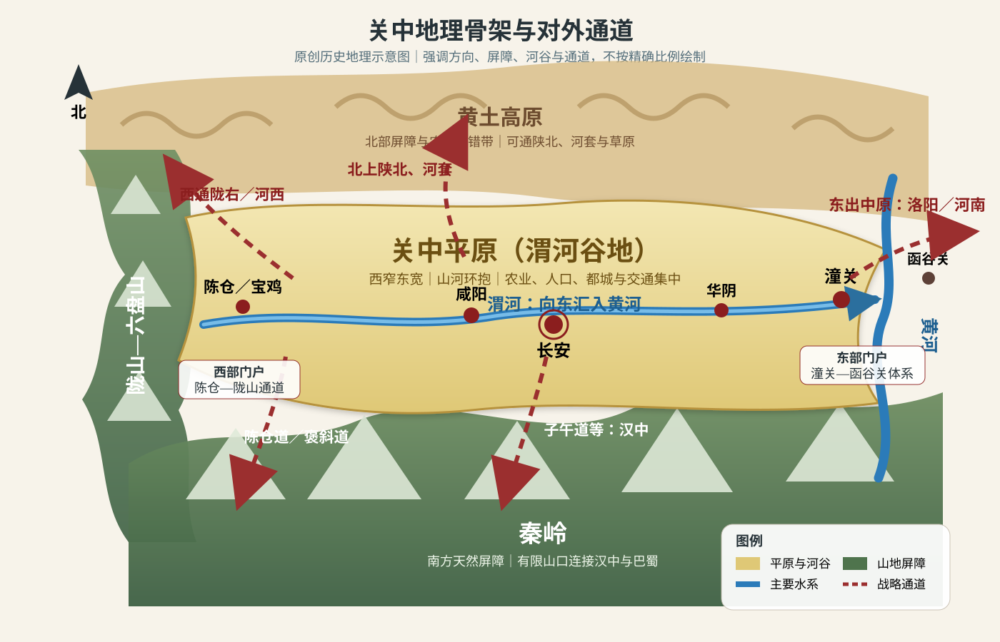
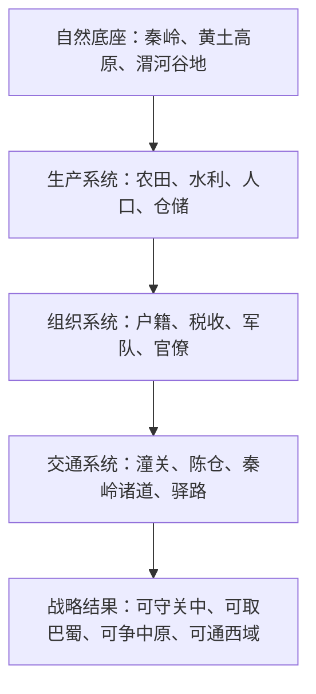

# 第二章　关中大地：王者之气

- **创建日期**：2026-07-20
- **状态**：初版，已配原创历史地理示意图
- **关键词**：关中、渭河平原、秦岭、陇山、函谷关、潼关、咸阳、长安、秦国、汉唐、都城、粮运
- **章节性质**：原创历史地理学习指南，不是原书逐段复述

## 摘要

“关中有王者之气”并不是神秘的风水判断，而是一种古代政治地理经验：关中位于渭河谷地，南有秦岭，北接黄土高原，西受陇山一线约束，东面通过潼关—函谷关方向连接中原。内部有可供耕作、聚居和建都的平原，外围又有山河关隘形成战略纵深；向东可以进入人口与财富更密集的中原，向西可以控制陇右和河西通道，向北可以接触河套与草原，向南则可越秦岭进入汉中、巴蜀。

周、秦、西汉、隋、唐先后在关中建立政治中心，并不意味着关中天然保证统一。它真正提供的是一组有利条件：**较低的核心区防御成本、相对集中的农业与人口、可向多个方向投射力量的交通网络，以及在遭遇东方压力时可以退守整顿的战略纵深。**只有当这些条件被有效的制度、军队、粮运和政治组织利用时，所谓“王者之气”才会转化为国家能力。

本章的核心结论是：

> 关中最强的地方，不是完全封闭，而是“可守、可出、可退、可整合”；它既像一座堡垒，也像一座面向全国的发射台。

---

## 一、先纠正三个常见误解

### 1. 关中不是今天某一个行政区

“关中”是一种历史地理概念，核心是渭河中下游平原及其周边区域，大体位于今天陕西省中部。它不是固定不变的省界，也不等于现代西安市。不同朝代对关中的理解范围会略有差异，但咸阳、长安、渭南、宝鸡一线通常构成其主要骨架。

### 2. “关中”不只是“四座关之间的一块地”

古人常用“四关”解释“关中”，但不同时期所指关隘并不完全一致。东部的函谷关、潼关最为重要；西部常联系陇关、散关或大震关方向；南部与秦岭诸道有关；北部则与萧关及通往陕北、宁夏的道路相连。

因此，与其死记某一个版本的“四关”，不如理解它背后的结构：

- 东面有黄河与关隘，控制出入中原的主要门户；
- 南面有秦岭，只有若干山谷道路能够通向汉中；
- 西面有陇山及其通道，连接陇右；
- 北面由高原、河谷和边塞道路通向草原地带。

“关中”真正强调的是：**一个被山河与关隘部分包围、但仍保留若干战略出口的核心区。**

### 3. “王者之气”不是地理宿命

关中可以帮助一个政权降低防御成本，却不会自动产生优秀统治者。秦国用了数百年扩张，并通过变法、郡县行政、军功制度、水利工程和长期战争，才把地理优势转化成统一能力。唐朝后期同样拥有长安和关中，却仍会因藩镇、财政、运输和军事组织问题而衰落。

地理能够提供优势，却不能替代治理。

---

## 二、关中的地理骨架：山河围合中的渭河走廊

### 1. 南部屏障：秦岭

秦岭横亘在关中南侧，是中国重要的自然地理分界。对古代关中政权而言，它首先是一道巨大的军事与交通屏障。大军若想从关中进入汉中，不能随意翻越山岭，只能选择有限的河谷和栈道，例如陈仓道、褒斜道、傥骆道、子午道等。

有限通道具有两面性：

- 对防守者而言，容易预判敌军方向，并在谷口设防；
- 对进攻者而言，路线集中，补给困难，容易被切断；
- 对关中政权而言，越过秦岭又可以进入汉中，并进一步联系巴蜀。

这使汉中成为关中的“南部外堡”。谁控制汉中，谁就能影响秦岭山口的安全；谁失去汉中，关中南侧就会承受更直接的压力。

### 2. 北部台地：黄土高原

关中北面不是一道整齐的城墙，而是黄土台塬、沟壑和高原地带。这里既能形成防御纵深，也能通向陕北、河套和草原。农业区与游牧区在更北方交会，使关中政权长期需要处理边防、马匹、贸易和族群互动问题。

关中不是远离草原的纯农业盆地，而是接近农牧交错带的帝国核心。这种位置让周、秦、汉、唐都能吸收来自西北的马匹、军事技术和人口，也让它们必须持续经营北部与西北边疆。

### 3. 西部门户：陇山与陈仓方向

关中西部较为收束，宝鸡古称陈仓，是渭河谷地西端的重要节点。从这里越过陇山，可进入陇右，再向河西走廊和西域延伸。

因此，陈仓—陇右方向同时承担三种功能：

1. 防止西部力量直接进入关中；
2. 作为关中政权向西扩展的前进通道；
3. 连接丝绸之路东端与长安政治中心。

秦人的早期发展与西部边疆密切相关。其长期与西戎交往和战争，使秦国形成较强的军事组织；当秦国逐步控制关中后，这种西部边疆经验便转化为向东竞争的能力。

### 4. 东部门户：潼关—函谷关方向

关中真正面向天下的主要出口在东面。渭河向东汇入黄河，沿河谷及崤函通道可进入洛阳盆地与中原。函谷关、潼关并非同一时代始终承担完全相同的作用，但它们共同代表关中东部的战略门槛。

从关中向东进攻，必须经过相对狭窄的通道；从东方进入关中，也往往要突破这些门槛。于是形成一种极重要的战略不对称：

- 关中政权可以依托关隘阻止多个东方势力同时进入；
- 一旦东方诸国彼此分裂，关中政权便可选择时机逐个出击；
- 但若潼关体系被突破，关中平原的核心城市也可能迅速暴露。

关隘不是绝对安全的城门，而是让守方有机会集中兵力、争取时间的“压力调节器”。

### 5. 内部主轴：渭河与关中平原

渭河从西向东穿过关中，是黄河最大的支流之一。河谷两侧形成较适合农业、城市和交通发展的平原。宝鸡、咸阳、长安、渭南等重要城市，都与这条东西向轴线密切相关。

古代大规模政权需要粮食、人口、牲畜、木材、兵器和运输。关中平原能够支持都城和军队，但它并非无限富庶。人口过度集中或战争破坏后，本地粮食可能不足，中央便需要从巴蜀、河南、江淮甚至江南调粮。关中作为都城区的成败，因此取决于“本地生产＋外部运输”的组合。

### 6. 水利为何重要

关中农业不能只靠自然降水。战国时期秦国修建郑国渠，利用泾水灌溉关中北部地区，通常被视为秦国增强农业与财政基础的重要工程之一。水利的战略意义不仅是“多收粮食”，还包括：

- 让国家能够供养更多人口和常备军；
- 提高战争持续时间；
- 增强中央对地方劳动力和土地的组织能力；
- 把水资源管理转化为国家治理能力。

所以，关中的“王者之气”不是山川外形，而是山川、水利、人口和制度共同形成的生产体系。

### 7. 原创地理示意图

> 下图强调方位、屏障、节点与通道，不是精确测绘地图。与第一章不同，Mermaid 不再承担“地图”功能；Mermaid 只用于时间轴或逻辑关系。

从图中可以看到，关中并非完全封闭：它的安全来自“入口有限”，它的扩张能力则来自“出口仍然存在”。

---

## 三、为什么关中能够反复成为帝国核心

把关中的优势拆开，可以得到一个“帝国核心区模型”。

### 1. 核心区防御成本较低

山地、黄河和关隘迫使敌人集中到若干通道。守方不需要平均防守全部边界，而可以把军队部署到关键节点。这种结构有利于弱势时期保存政权，也有利于强势时期把更多兵力用于外线进攻。

### 2. 内部存在可持续的农业区

渭河平原与灌溉体系能够提供粮食和人口。相比纯山地盆地，关中拥有较大的平原；相比完全开放的大平原，关中又有外围屏障。这种“平原在内、山河在外”的结构非常适合建立早期中央政权。

### 3. 面向东方最富庶地区

关中自身资源有限，却紧邻中原。一个占据关中的政权可以先在相对安全的基地整顿军政，再穿过东部通道争夺河南、河北和山东等人口密集区。

这正是关中最重要的价值：**安全基地与扩张方向同时存在。**

### 4. 可以连接西北、草原和西域

关中靠近陇右和北方边疆，使其能够获得马匹、边疆军人和跨区域贸易资源。汉唐以长安为中心经营西域，并不只是文化理想，也与关中向西的交通结构有关。

### 5. 可以借助汉中与巴蜀形成第二后方

秦岭虽然阻隔南北，却不是不可穿越。控制汉中之后，关中政权可以进一步连接四川盆地。巴蜀水土资源丰富、地形封闭，常能成为粮源、兵源和战略后方。

秦统一六国之前先控制巴蜀，后来楚汉战争中刘邦也以汉中、巴蜀为基础反攻三秦。这说明关中与巴蜀不是两个孤立区域，而是通过有限山道构成互补系统：

- 关中是政治与军事发射台；
- 汉中是山间转换区；
- 巴蜀是纵深和资源后方。

---

## 四、历史背景：从周原到长安

### 1. 周人的兴起：先占据西部农业与边疆结合地带

周人的早期活动与关中西部、渭水流域密切相关。周原及丰、镐一带既能发展农业，又靠近西部边疆。周灭商之后建立分封秩序，政治中心仍在关中地区。

西周选择关中，不代表它可以忽略东方。为了控制广阔领土，周王朝必须依赖分封诸侯、交通网络和礼制关系。关中提供安全核心，但东方治理仍需要制度连接。西周后期，当王室政治能力下降、边疆压力增加时，地理优势并未阻止镐京陷落，王室最终东迁洛邑。

这一转折提醒我们：**安全的首都不等于有效控制全国。**

### 2. 秦人的崛起：从边疆集团到关中强国

秦国最初处于周王朝西部边缘，长期承担与西戎竞争的任务。秦逐渐东进并控制关中后，获得了更稳定的农业区和人口基础。

秦国的强大不是突然发生。其关键过程包括：

- 逐步占据关中核心土地；
- 在边疆战争中形成军事传统；
- 商鞅变法强化户籍、土地、军功和行政组织；
- 通过县制与中央官僚体系提高动员效率；
- 建设道路、水利和粮运体系；
- 向南控制巴蜀，扩大资源后方；
- 利用函谷关方向的地理门槛抵御东方合纵。

关中给了秦国一个良好平台，但平台之所以有效，是因为秦国不断提高“把土地变成税粮、把人口变成军队、把胜利变成行政控制”的能力。

### 3. 秦统一：从关中逐次向东推进

战国后期，东方六国彼此竞争，很难长期维持统一联盟。秦国依托关中和巴蜀，既能守住东部门户，又能选择主要进攻方向。秦军并非简单地从一条路横扫天下，而是在外交、间谍、军事、行政和资源动员配合下，逐步压缩东方国家的战略空间。

关中的意义在于：秦国失败一次，仍可能退回关内整顿；东方国家若单独遭受重创，则更难获得同样安全的恢复基地。这种“恢复能力差异”会在长期竞争中不断累积。

### 4. 楚汉战争：先入关中为何如此重要

秦亡之后，关中仍然是争夺天下的关键。项羽进入关中后没有长期以此为核心，而是分封三名秦降将统治当地，刘邦则被封往汉中。后来刘邦从汉中返回，夺取三秦，重新控制关中，并以此作为与项羽长期竞争的后方。

民间常用“明修栈道，暗度陈仓”概括这一过程，但这句话的文学化程度很高。学习历史时更重要的是理解“还定三秦”的地理逻辑：刘邦若长期被困汉中，就难以进入全国竞争；一旦控制陈仓、咸阳和渭河平原，便获得了可供整顿和出击的关中基地。

楚汉战争最终并不是由一座关隘决定，而是由政治联盟、人才使用、后勤组织、战场选择和持续动员共同决定。关中使刘邦拥有较稳定后方，但韩信、萧何等人的组织与军事能力才把这一优势转化为胜利。

### 5. 西汉建都长安：安全与控制之间的选择

刘邦建立汉朝后，最终以长安为都。相较洛阳，长安更接近汉朝起家的关中基地，外围防御条件更好，也便于依托秦朝留下的宫殿、道路和行政基础。

但长安位于帝国西部，距离山东、江淮等经济区较远。西汉因此必须经营关中粮食、水运和通往东方的交通。建都长安不是选择“全国几何中心”，而是选择一个政治安全性高、王朝控制力强的核心区。

### 6. 隋唐长安：关中优势的第二次高峰

隋统一后营建大兴城，唐沿用并发展为长安。唐代长安不仅是政治首都，也是国际性城市。它向西连接河西走廊和中亚，向东连接洛阳与中原，向南可通汉中、巴蜀，向北面对草原世界。

联合国教科文组织关于“长安—天山廊道路网”的资料，把长安和洛阳视为汉唐时期丝绸之路东端的重要中心。这说明长安的价值不只在防御，更在于它能够把帝国首都与跨欧亚交流网络连接起来。

然而，唐代关中本地已经难以单独供养庞大首都。东南财赋经运河、黄河和陆路转运至关中，成为王朝生命线。洛阳有时承担东都和粮运转换中心的作用，反映出帝国经济重心与政治中心之间的距离正在扩大。

---

## 五、关键事件时间轴

| 时间 | 事件 | 地理意义 |
|---|---|---|
| 约公元前11世纪 | 周灭商，丰镐成为西周政治中心 | 关中成为早期王朝核心，但控制东方依赖分封网络 |
| 公元前771年 | 犬戎攻破镐京，周平王东迁 | 说明关中屏障并非绝对，政治和边防崩溃会使都城失守 |
| 春秋战国时期 | 秦逐步控制关中并向东扩张 | 从西部边疆国家转为拥有安全农业核心的强国 |
| 公元前356年起 | 商鞅变法 | 把关中的土地和人口转化为高效率国家动员体系 |
| 战国后期 | 郑国渠等水利工程建设 | 提升关中农业、财政和长期战争能力 |
| 公元前316年 | 秦并巴、蜀 | 建立关中—汉中—巴蜀的战略资源组合 |
| 公元前230—221年 | 秦陆续灭六国 | 以关中为基地向东逐步推进，完成统一 |
| 公元前206年前后 | 刘邦由汉中还定三秦 | 重新取得关中基地，获得与项羽争天下的后方 |
| 公元前202年后 | 西汉定都长安 | 以安全性和政权根基优先于全国几何中心 |
| 581—618年 | 隋建大兴城并统一全国 | 关中再次成为统一王朝首都区 |
| 618—907年 | 唐以长安为主要首都 | 关中连接全国政治、东南财赋与欧亚交通 |
| 755年以后 | 安史之乱及后续动荡 | 长安多次受威胁，王朝对外部粮运和军政体系依赖加深 |
| 10世纪以后 | 全国首都重心逐渐东移、北移 | 经济重心、运河物流和军事格局改变关中的相对优势 |

这张 Mermaid 图表达的是历史演化关系，不承担地图功能。

---

## 六、秦为什么能从关中统一六国

### 1. 关隘使秦国能够“以少守险”

战国时期，东方诸侯多次合纵攻秦。秦国依托函谷关等东部通道，可以把防守兵力集中在狭窄方向。即使东方联军人数众多，也面临指挥不统一、补给线长和内部利益冲突。

地理没有替秦打赢战争，却提高了东方联军进攻秦国核心区的成本。

### 2. 关中让秦拥有稳定恢复基地

长期战争不仅比谁能赢一场，也比谁能在失败后恢复。关中内部相对集中，秦国中央政府能够直接管理土地、人口和赋税。经过变法后，秦的征兵和奖励体系更能把地方资源持续转化为军力。

### 3. 巴蜀使秦的资源空间突然扩大

控制巴蜀后，秦获得四川盆地的粮食、人口和南部战略纵深。秦军可以从关中向东，也可以利用长江上游方向威胁楚国。于是秦不再只是“函谷关内的国家”，而成为同时拥有黄河与长江上游资源的跨流域强国。

### 4. 东方分裂使关中的东向出口更有价值

如果东方六国能够长期形成高度统一的军事和财政同盟，秦的地理优势会被削弱。但六国战略目标不同，经常相互战争。秦可以利用外交分化，选择最有利时间出关作战。

因此，秦统一是四个因素的乘积：

> 关中地理 × 巴蜀资源 × 制度动员 × 东方分裂

缺少其中任何一项，统一都不会如此顺利。

---

## 七、为什么长安适合建都，却不一定永远适合建都

### 1. 长安的优势：政治安全与王朝根基

长安位于关中中部偏东，接近渭河交通轴，又有秦岭和东部关隘保护。对西汉、隋唐这样的王朝而言，长安可以容纳宫城、官署、军队和大量人口，并与西北边疆保持较紧密联系。

### 2. 长安的困难：距离东南财富区较远

随着中国经济重心逐渐向长江流域和东南地区移动，关中与主要财政来源的距离越来越远。粮食从江淮、江南运到长安，需要经过运河、黄河、陆路和山地通道，成本高、环节多。

唐代皇帝有时前往洛阳，其中一个重要背景就是关中粮食供应紧张与东部运输条件。不能把这种现象简单解释为某位皇帝喜爱洛阳；它反映的是政治中心与经济中心分离带来的结构压力。

### 3. 关隘防御会被技术和政治变化削弱

关隘只能在军队愿意作战、指挥有效、后勤稳定时发挥作用。如果守军崩溃、内部叛乱或敌军从其他路线迂回，再险要的地形也可能失效。

从周幽王到唐末长安多次陷落，都说明“有险可守”与“真正守得住”是两回事。

### 4. 帝国规模越大，首都选址越复杂

早期王朝可能优先考虑安全基地；成熟帝国还必须考虑全国交通、税粮、边防和官僚沟通。长安适合西北导向、陆路导向和关中根基强的王朝，却不一定适合经济重心高度东南化的时代。

首都不是风水比赛，而是一个多目标优化问题：

- 安全性；
- 粮食供应；
- 交通成本；
- 边疆方向；
- 王朝政治根基；
- 对主要人口和财政区的控制；
- 灾害与环境承载能力。

---

## 八、关中与其他都城区域比较

| 区域 | 主要优势 | 主要弱点 | 更适合的历史条件 |
|---|---|---|---|
| 关中／长安 | 山河屏障、战略纵深、连接西北与巴蜀 | 距东南经济区远，外部粮运成本高 | 王朝根基在西北、重视陆路与边疆扩张 |
| 洛阳盆地 | 接近中原中心，东西交通便利 | 四面通道较多，防守压力较大 | 需要协调全国东西交通、经济重心仍偏北 |
| 开封 | 大运河和黄河交通便利，接近东部财富区 | 平原开阔，军事防御弱，水患风险高 | 财政和商业网络高度依赖运河的时代 |
| 南京 | 长江屏障、江南经济雄厚 | 对北方控制成本较高 | 南方政权或经济重心明显南移时期 |
| 北京 | 接近北方边疆，连接华北平原与东北 | 距传统江南财赋区较远 | 北方边防、东北与草原方向重要，运河海运成熟 |
| 成都 | 四川盆地安全、农业条件较好 | 对全国主要地区投射力量困难 | 割据、避乱或需要战略后方的时期 |

这张表说明，没有永恒完美的首都。一个地点的优势会随着交通技术、经济重心、边疆方向和国家规模变化而改变。

---

## 九、关中的战略悖论

### 1. 越安全，越可能远离财富中心

关中的山河屏障提高安全性，却也增加与东方和东南地区之间的运输成本。安全和物流往往不能同时达到最大值。

### 2. 越依赖关隘，越怕节点突然失守

当大量防御能力集中在潼关等节点时，节点一旦因战败、叛变或指挥失误而失守，后方可能迅速暴露。这类似现代网络中的“关键单点故障”。

### 3. 越适合作为军事基地，越需要强大行政体系

关中可以帮助政权向四方出兵，但多方向行动也会消耗大量粮食和组织资源。没有稳定税制、仓储、道路和官僚体系，地理机动性只会变成战略分散。

### 4. 越能控制西北，越必须承担边疆成本

靠近草原与西域使关中获得马匹和贸易机会，也使王朝必须投入军队、堡垒、驿站和外交资源。汉唐的开放与强盛，背后是高昂的边疆治理成本。

---

## 十、长期影响：关中如何塑造中国政治传统

### 1. “先据关中，再争天下”成为经典战略想象

秦统一和刘邦成功，使关中在后世政治文化中被视为创业基地。许多战略家判断天下形势时，会把关中视为能够积蓄力量、东向争夺中原的区域。

### 2. 长安成为统一与开放的象征

西汉和唐朝的影响，使长安不仅代表帝国政治中心，也代表丝绸之路、人口交流、宗教传播和国际城市文化。长安的历史形象因此超越了一般都城。

### 3. 关中强化了西北在中国统一史中的作用

中国历史并不只是黄河中下游或长江流域的故事。周、秦、汉、隋、唐的兴起都显示，西北边疆与农业核心之间的互动，能够形成强大的政治与军事力量。

### 4. 政治中心与经济中心分离成为长期议题

汉唐以后，经济重心逐渐向东南移动，但政治与军事安全仍可能要求首都位于北方或西北。这种分离推动了运河、仓储、漕运和多都城体系的发展，也影响后来王朝的首都选择。

### 5. “地理优势必须制度化”成为最重要经验

秦能利用关中，与其说因为山河险固，不如说它建立了把山河、土地、人口和道路纳入国家管理的制度。相反，当中央组织瓦解时，关隘和都城都可能迅速失去作用。

---

## 十一、现代启示：从关中理解枢纽、供应链与组织能力

### 1. 好位置不是“中心点”，而是网络中的高价值节点

关中并不处于中国东部人口区的几何中心，却能连接中原、西北、草原、汉中和巴蜀。现代选址同样不能只看地图距离，还要看交通走廊、资源来源、替代路线和安全边界。

### 2. 关键通道会降低日常成本，也会制造集中风险

潼关、陈仓和秦岭栈道类似现代供应链中的港口、铁路枢纽、海峡或数据中心。平时集中运输效率高，发生战争、灾害或故障时，却可能形成瓶颈。

现代系统设计需要同时考虑：

- 主干路线效率；
- 备用通道；
- 库存和缓冲；
- 节点失效后的恢复能力；
- 对单一地区的依赖程度。

### 3. 安全与效率需要平衡

长安安全，却离东南粮源较远；开封运输便利，却防御薄弱。企业总部、云计算区域、仓库和制造基地也面临类似选择：最安全的位置未必最经济，最低成本的位置也未必最有韧性。

### 4. 地理资源只有通过组织才能产生价值

郑国渠、道路、仓储、户籍、军队和行政体系，都是把自然条件转化为国家能力的“中间层”。现代社会同样如此：资源、港口、人口和技术不会自动形成竞争力，必须由制度、教育、基础设施和组织协同完成转化。

### 5. 成功的核心区必须拥有外部连接

完全封闭的地区难以形成长期帝国。关中的优势不是与世隔绝，而是可控制地开放：平时通过关口、河谷和驿道连接外部，战争时则提高进入成本。

这可以概括为：

> 真正强大的系统，不是没有入口，而是能够管理入口。

---

## 十二、一个“关中帝国模型”

可以把关中政权的运行理解为五层结构：

若任何一层失效，地理优势都会打折：

- 水利失效，粮食不足；
- 财政失效，军队难以维持；
- 交通失效，外部粮食无法进入；
- 关隘失守，核心区暴露；
- 政治失效，地方与边军不再服从中央。

因此，所谓“王者之气”更准确的表达是：

> 关中提供了建设强大国家的优良底座，但国家仍需完成从自然地理到组织能力的全部转换。

---

## 十三、人物与决策：站在当时统治者的位置思考

### 情境一：我是战国时期的秦王

最优先任务不应只是立即出关决战，而是：

1. 稳定关中土地和户籍；
2. 扩建水利，提高粮食供给；
3. 控制巴蜀，获得第二资源区；
4. 守住函谷关方向，等待东方联盟分裂；
5. 通过外交与军事逐个削弱对手；
6. 占领新地区后立即建立行政管理，防止胜利变成短期掠夺。

关键不是“勇敢东进”，而是让每次东进都建立在可持续补给与行政接管之上。

### 情境二：我是西汉初年的皇帝

选择长安可以提高政治安全，但必须同步解决：

- 关中人口和土地承载能力；
- 东方粮食向西运输；
- 北部边防；
- 诸侯王与中央的关系；
- 巴蜀和汉中的交通；
- 都城规模不能无限膨胀。

首都安全不等于国家稳定，国家仍要控制东方人口和财政区。

### 情境三：我是唐朝中后期皇帝

真正风险不只是敌军能否攻破潼关，而是：

- 东南财赋能否持续运到关中；
- 运河、黄河和陆路节点是否可靠；
- 边军是否服从中央；
- 长安附近军队是否有独立作战能力；
- 洛阳和其他区域中心能否成为备用行政节点。

这时最重要的不是继续强调“关中形胜”，而是修复财政、运输与军政控制。

---

## 十四、古今地名与区域对照

| 历史名称 | 大致现代位置 | 历史作用 |
|---|---|---|
| 关中 | 陕西中部渭河平原及周边 | 王朝核心区和东西交通走廊 |
| 咸阳 | 陕西咸阳一带 | 秦都及关中中部重要节点 |
| 长安 | 今陕西西安一带 | 西汉、隋唐主要都城 |
| 陈仓 | 今陕西宝鸡附近 | 关中西部门户，通陇右与汉中道路 |
| 函谷关 | 主要指今河南灵宝附近的古关体系 | 关中东出中原的重要门槛之一 |
| 潼关 | 今陕西潼关附近 | 黄河、渭河与山地交会的东部门户 |
| 汉中 | 今陕西汉中盆地 | 关中南部外堡，连接巴蜀 |
| 巴蜀 | 今四川盆地及重庆部分区域 | 资源后方与长江上游战略区 |
| 陇右 | 大致今甘肃东部及周边 | 通向河西走廊、西域的重要区域 |
| 洛阳 | 今河南洛阳 | 中原交通中心，常作为东都或另一首都选择 |

---

## 十五、学习检查：你是否真正理解了本章

### 基础问题

1. 为什么不能把关中简单理解成今天的西安市？
2. 秦岭对关中既是屏障又是通道，这句话怎样理解？
3. 渭河为什么是关中内部最重要的地理轴线？
4. 函谷关和潼关对关中政权有什么意义？
5. 为什么关中政权往往需要控制汉中和巴蜀？

### 分析问题

1. 如果只有险要关隘，没有稳定农业和行政制度，关中还能成为帝国基地吗？
2. 秦统一六国应当归因于地理、制度还是外交？为什么不能只选一个答案？
3. 西汉和唐朝建都长安时，分别面临哪些相似与不同的物流问题？
4. 为什么中国经济重心南移后，关中的首都优势相对下降？
5. 潼关这样的节点，如何类比现代港口、芯片供应链或云计算区域？

### 推演问题

假设你控制关中，但尚未控制巴蜀和中原。你拥有三种选择：

- 立即东出与强敌决战；
- 先南取汉中、巴蜀；
- 先向西北扩张并积累骑兵资源。

请分别分析三种方案的收益、成本、补给难度和长期风险。没有唯一答案，重点是能否把地理、时间和组织能力结合起来。

---

## 十六、本章知识卡片

### 一句话结论

关中是一座拥有农业腹地的山河堡垒，也是一座连接中原、西北、草原和巴蜀的战略发射台。

### 三个必须记住的地点

- **长安／咸阳**：政治与人口核心；
- **潼关／函谷关方向**：东出中原的主要门户；
- **陈仓—汉中通道**：连接西部与巴蜀的转换区。

### 四个决定王朝成败的变量

- 粮食与水利；
- 关隘与道路；
- 行政与军队；
- 外部经济区的运输连接。

### 最容易犯的错误

- 把“王者之气”理解成风水神秘主义；
- 认为有山有关就绝不会陷落；
- 忽视巴蜀对秦汉关中政权的资源补充；
- 只看都城防御，不看供养都城的粮运网络；
- 把秦统一完全归因于地理，忽略制度和外交。

---

## 十七、与后续章节的知识连接

本章建立的几个概念，会在后续章节反复出现：

- **中原逐鹿**：关中为什么必须东出，而中原为什么难以长期保持统一防御；
- **巴山蜀水**：四川盆地为何既能独立割据，又能成为关中的战略后方；
- **河套**：关中北部安全与草原力量之间的关系；
- **河西走廊与西域**：长安怎样通过陇右连接欧亚交通；
- **两次北伐**：从南方进攻关中为什么常被秦岭道路和补给制约；
- **江南富庶**：经济重心南移为何改变长安作为首都的成本结构。

阅读后续章节时，可以不断回到一个问题：

> 一个区域的价值，究竟来自它自身拥有多少资源，还是来自它能够连接和控制哪些区域？

关中的答案是：两者都重要，但在不同历史阶段权重不同。

---

## 十八、结论：把“王者之气”还原成可分析的历史机制

关中反复成为王朝核心，并非因为它具有不可解释的神秘力量，而是因为它同时拥有：

- 被山河关隘部分围合的安全核心；
- 渭河平原提供的农业和人口基础；
- 向东进入中原的主要出口；
- 向西北连接陇右、河西和草原的道路；
- 越秦岭进入汉中、巴蜀的战略纵深；
- 长安、咸阳等能够承载国家组织的城市节点。

但关中也有明显限制：本地资源不能无限供养巨大首都，东南经济崛起后粮运距离增加，关键关隘可能形成单点风险，复杂帝国也不能只靠西北基地控制全国。

因此，本章最重要的历史地理判断是：

> 关中不是自动产生帝王的土地，而是一个能让优秀组织扩大优势、也会让衰败组织暴露弱点的战略平台。

---

## 参考资料与延伸阅读

### 传统史料

1. 《史记·周本纪》《秦本纪》《秦始皇本纪》《项羽本纪》《高祖本纪》。
2. 《汉书·高帝纪》《地理志》《食货志》。
3. 《资治通鉴》中战国、秦汉、隋唐相关卷次。
4. 《水经注》渭水、泾水及相关河流记载。

### 现代研究与地图

1. 谭其骧主编：《中国历史地图集》。
2. 史念海：中国古都、关中历史地理及河山集相关研究。
3. 邹逸麟：《中国历史地理概述》。
4. 葛剑雄：《统一与分裂：中国历史的启示》。

### 在线资料

1. [UNESCO：丝绸之路——长安—天山廊道路网](https://whc.unesco.org/en/list/1442/)
2. [陕西地理概况：秦岭、黄土高原与渭河谷地](https://china-world.china.org.cn/info/2025-04/15/content_117825075.shtml)
3. [关中平原及周边过渡地带的考古景观研究](https://www.mdpi.com/2073-445X/11/8/1269)
4. [渭河流域地形、水文与气候概况](https://www.mdpi.com/2072-4292/14/20/5097)

> 使用在线资料时，应把自然地理数据、考古研究和传统史料相互印证；不要用现代行政边界直接替代古代历史区域，也不要把旅游宣传中的“千古形胜”当作完整历史解释。
