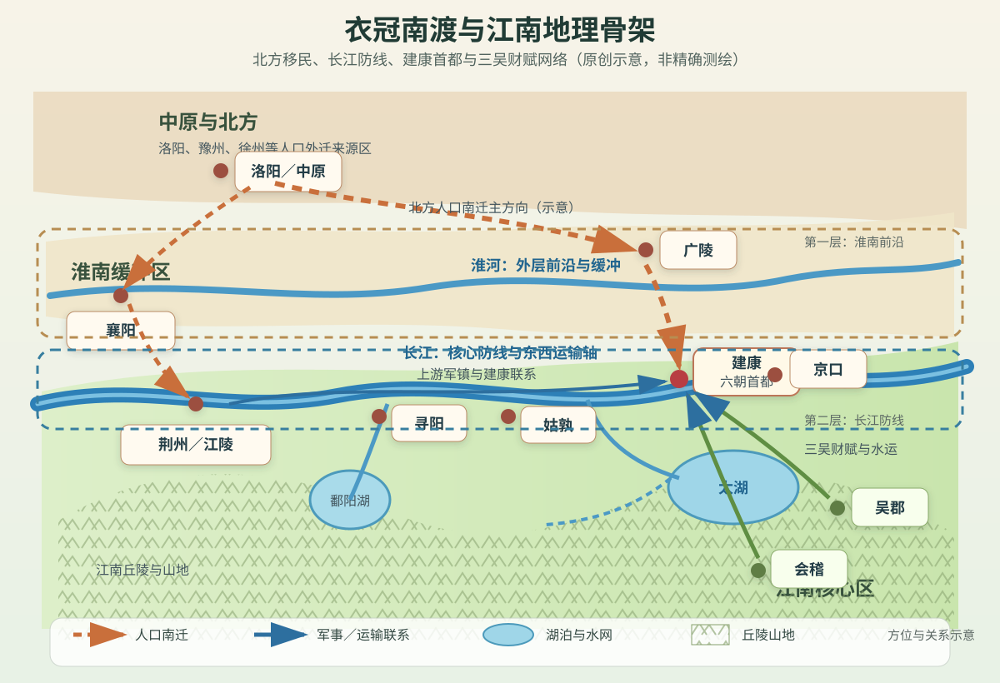
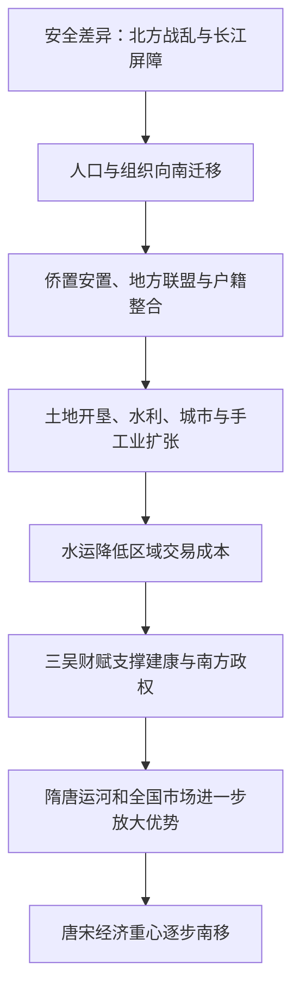

# 第三章　江南富庶：衣冠南渡

- **创建日期**：2026-07-21
- **状态**：初版，已配原创历史地理示意图
- **关键词**：江南、长江下游、建康、衣冠南渡、永嘉之乱、东晋、侨州郡县、门阀士族、太湖平原、经济重心南移
- **章节性质**：原创历史地理学习指南，不是原书逐段复述

## 摘要

“江南富庶”是中国中古以后逐渐形成的历史印象，“衣冠南渡”则是这一长期转型中的关键节点。西晋末年，北方经历八王之乱、政权崩解与持续战争，大批宗室、官僚、士族、军人、工匠和普通民众向长江流域迁徙。司马睿在建康建立东晋，北方移民集团与江东本地士族经过竞争、妥协与合作，共同维持了一个以长江为防线、以建康为首都、以三吴和太湖流域为重要财赋区的南方政权。

但必须避免一个过度简化的故事：江南并不是在北方人到来之前毫无开发，经济重心也不是在公元四世纪突然完成南移。孙吴时期的建业、江东水网、会稽和三吴地区已经拥有城市、农业、手工业、航运和地方豪族基础。南渡带来的真正变化，是在既有基础上大幅增加人口、技术、组织经验与政治需求，并促使国家更系统地开发土地、建设水利、整合水陆交通、设立侨州郡县和经营长江防线。六朝时期奠定基础，隋唐大运河加强南北联结，唐后期与南宋时期的进一步人口迁移和制度变化，才使全国经济重心逐步稳定地转向东南。

本章的核心结论是：

> 衣冠南渡不是一次简单的“人口搬家”，而是一次把人口、制度、技术、文化和政治中心重新嵌入长江下游地理网络的系统迁移。

---

## 一、先纠正四个常见误解

### 1. “江南”不是固定不变的行政区

“江南”首先是相对于长江和北方而言的历史地理概念，不同朝代、不同语境中的范围并不完全相同。广义上，它可以指长江以南相当广阔的地区；狭义上，常指长江下游南岸、太湖流域以及今天苏南、浙江北部、皖南部分地区。

讨论东晋和六朝时，本章重点关注的“江南”包括：

- 建康及丹阳地区；
- 吴郡、吴兴、会稽等三吴区域；
- 太湖平原与钱塘江下游；
- 长江下游沿岸的京口、广陵、姑孰等节点；
- 与建康安全密切相关的淮南、江西和荆州方向。

因此，江南不是一条清晰边界内的单一地区，而是一组由河流、湖泊、平原、丘陵、城市和航道连接起来的区域网络。

### 2. “衣冠南渡”不只指贵族逃难

“衣冠”常被用来指代官僚、士族和礼制文化，因此“衣冠南渡”容易让人产生一种画面：少数北方名门带着书籍和礼器渡过长江。事实上，迁徙者远不止上层士族，还包括：

- 宗室与官僚集团；
- 士族家族及其依附人口；
- 军队、部曲和流民武装；
- 农民、工匠、商人和僧侣；
- 携带地方网络、生产技术和文化传统的普通家庭。

上层精英在史书中留下的名字最多，但真正改变江南人口、土地利用和市场规模的，是多层次、分批次、持续数十年的迁徙。

### 3. 江南不是“等待北方人开发的荒地”

长江下游在先秦时期已经形成吴、越等区域文明。秦汉以来，郡县制度、农业、盐业、冶铸、航运和城市继续发展。东汉末年孙权经营江东，建业成为政治中心，长江水军、山越治理、屯田和地方豪族网络都为后来的东晋提供了重要基础。

北方移民带来新的增量，但不是从零开始。更准确的表述应是：

> 北方移民、江东本地社会与南方自然环境相互作用，使江南进入更高密度、更强组织化的发展阶段。

### 4. 经济重心南移不是四世纪一次完成

东晋南朝时期，江南经济明显发展，但北方仍长期拥有广阔耕地、人口和政治军事资源。隋唐统一后，南北经济重新连接；安史之乱后，东南财赋的重要性进一步上升；北宋时期南方人口和商业继续增长；南宋定都临安后，江南作为全国经济核心的地位才更加稳固。

因此，“衣冠南渡”是经济重心南移的重要加速器和制度起点之一，而不是唯一原因，也不是终点。

---

## 二、江南的地理骨架：水网中的平原与门户

### 1. 长江：既是防线，也是交通大动脉

长江下游河面宽阔，支流和洲滩复杂，对缺乏水军、船只和渡运组织的北方军队构成巨大障碍。东晋和南朝能够长期立足江南，长江防线是重要条件。

但把长江只理解成“天然城墙”会忽视另一半功能：它还是一条横贯东西的运输走廊。沿江向西，可以联系江西、荆州和巴蜀；向东，可以进入江口和海上航路；通过支流和运河，可以把建康与太湖、会稽、广陵等地连接起来。

对南方政权而言，长江同时承担四种功能：

1. 阻滞北方大军南下；
2. 快速调动水军和物资；
3. 串联上游军镇与下游首都；
4. 将内陆经济区连接到沿海贸易。

### 2. 淮河：真正的前沿缓冲带

建康虽然位于长江南岸，但一个只守长江南岸的政权通常过于被动。东晋南朝若能控制淮南，就可以把防线前推到淮河一带，在长江北面形成缓冲区；一旦失去淮南，北方军队便可更接近长江渡口，建康的安全压力急剧增加。

因此，南朝军事地理常出现三层结构：

- **淮河及淮南**：外层前沿与预警区；
- **长江沿岸军镇**：核心防线与机动走廊；
- **建康—三吴**：政治中心和财赋后方。

长江是最后的大屏障，淮南则决定南方政权是否拥有战略纵深。

### 3. 太湖平原：低平水乡与财赋核心

太湖流域地势低平，河港密布，降水充足，适合水稻农业，但也容易发生洪涝、湖沼积水和河道淤塞。它的富庶并非自然自动赠予，而依赖长期的人力投入：

- 疏浚河道；
- 修筑堤防；
- 排水与灌溉；
- 开垦低湿地；
- 维护圩田和塘浦体系；
- 建立仓储、集市和水运网络。

当人口、技术和国家组织投入增加后，水网不再只是阻碍，而转化为低成本运输系统。粮食、丝织品、木材、瓷器和人员可以通过河道进入区域市场，再汇集到建康等城市。

### 4. 江南丘陵：屏障、资源地与开发边界

太湖平原以南、西南分布大量丘陵和山地。山地降低了大规模陆军快速推进的能力，也提供木材、矿产、茶桑和多样农业资源。与此同时，丘陵地区长期存在国家控制较弱、地方族群与豪强势力活跃的空间。

东吴和东晋南朝不断处理山越、流民、地方豪族与郡县行政之间的关系。所谓“开发江南”，不仅是开垦土地，也是把山区人口、资源和交通逐步纳入国家税收、军役和市场体系。

### 5. 建康：山、水、江、湖交会的都城节点

建康位于长江下游南岸，北临长江，周边有钟山、石头山、秦淮河和多条水道。它不是处在江南最富庶平原的正中心，却具有更强的政治军事平衡：

- 面向长江，可控制重要渡口和沿江交通；
- 向东南可连接三吴财赋区；
- 向西可联系姑孰、寻阳、荆州；
- 向北可经广陵、淮南观察中原动向；
- 周边山地和城防可增加首都防御层次。

建康的优势不是“位置最安全”或“土地最肥沃”，而是同时接近防线、航道和财赋区。

### 6. 原创历史地理示意图

> 下图强调江南的水系、区域节点、北方移民方向和南朝防御层次，不是精确测绘地图。Mermaid 在本章只用于时间轴和逻辑关系，不承担地图功能。

地图中最重要的关系不是城市之间的直线距离，而是三组网络：

- 北方经淮南、广陵渡江进入建康和三吴的迁徙网络；
- 建康沿长江向西连接寻阳、荆州的军事网络；
- 太湖、吴郡、会稽与建康之间的财赋和水运网络。

---

## 三、江南并非突然富庶：从吴越到孙吴

### 1. 吴越文明提供早期区域基础

先秦时期，长江下游已经存在吴、越等政治实体。它们依靠河湖、海岸和山地环境，形成与中原不同但并不落后的区域文化。水上交通、舟船制造、稻作农业和金属技术都有长期积累。

秦汉统一后，郡县行政将江南更紧密地纳入帝国体系，北方政治文化和南方地方传统持续融合。江南人口密度总体仍低于黄河中下游，但并不等于没有城市与生产。

### 2. 东汉末年江东集团的形成

东汉末年天下分裂，孙策、孙权依靠江东本地豪族、北来军事集团和长江水军建立政权。孙吴的存在具有承前启后的意义：

- 建业成为成熟的南方都城；
- 长江防御和水军作战得到系统经营；
- 三吴地区成为政权财赋腹地；
- 山越地区被军事征服、招抚和编户；
- 荆州与江东的上下游关系成为国家战略核心；
- 海上交通连接辽东、朝鲜半岛、东南沿海和南海方向。

西晋灭吴后，江南短暂纳入统一帝国，但孙吴留下的城市、军镇、航道和地方政治网络并未消失。司马睿后来选择建业，不是在陌生荒地重新建国，而是在一套现成的南方政治地理基础上重组权力。

### 3. 本地士族是东晋能否立足的关键

顾、陆、朱、张等江东大族拥有土地、声望、门生故吏和地方影响。北方宗室若只把江南当作占领区，很难获得税收、兵员和社会秩序。司马睿初到建业时影响有限，王导推动他礼遇顾荣、贺循等江东名望人物，正说明南方政权必须与本地精英合作。

东晋的建立不是单向征服，而是一个复杂联盟：

> 北方宗室提供晋朝正统名义，北来士族提供政治组织和人才网络，江东士族提供地方社会基础，长江与三吴提供安全和财赋。

---

## 四、历史背景：西晋为什么会失去北方

### 1. 短暂统一掩盖结构性问题

西晋在280年灭吴，实现短暂统一，但统一并未解决宗室权力、门阀政治、土地兼并、边疆治理和军队控制等问题。中央为了巩固司马氏政权，大量分封宗室并授予军权，结果在皇位继承危机中形成多个拥有军队和地盘的政治中心。

### 2. 八王之乱消耗中央能力

291年至306年前后的八王之乱，不只是宫廷内部争斗。宗室诸王不断调动地方军队进入洛阳，战争破坏粮食运输、行政秩序和首都安全。中央军政力量被反复消耗，地方势力与流民武装迅速扩大。

地理上，洛阳位于中原交通枢纽，和平时期有利于控制全国；内战时期却也意味着各路军队容易向首都汇集。开放的中原缺乏关中或江南那样的大型自然屏障，一旦中央失去组织优势，首都会直接暴露在多方向竞争之中。

### 3. 永嘉之乱与洛阳陷落

西晋内战后，北方出现多个军事政权。311年洛阳陷落，晋怀帝被俘；316年长安又陷，西晋灭亡。对北方士民而言，这不是一次单独战败，而是连续多年的政权崩溃、战争、饥荒和迁徙压力。

迁徙目的地并不只有江南。部分人口进入辽西、河西、关中、巴蜀和其他相对安全地区。但长江下游具备三个特殊条件：

- 已有晋朝宗室司马睿和行政班底；
- 有孙吴以来的建业城市与江东社会基础；
- 长江提供相对可靠的军事屏障。

这使建康成为重建晋朝政治中心的最有力候选。

### 4. 司马睿提前移镇建业

司马睿在西晋完全覆亡前已经移镇建业。这个时间差非常重要：南方政权不是等洛阳、长安全部失守后才仓促出现，而是在北方局势恶化过程中逐步建立行政、军事和地方联盟。

307年前后，司马睿在王导等人协助下经营江左；317年称晋王，318年称帝，史称晋元帝。东晋由此建立，以建康为首都，延续至420年。

---

## 五、“衣冠南渡”究竟如何发生

### 1. 不是一条统一路线，而是多条迁徙走廊

北方人口进入江南，大致可能沿多种路线移动：

- 从中原、徐州方向进入淮南，经广陵等渡口过江；
- 沿汉水、襄阳、荆州进入长江中游，再向下游迁徙；
- 从山东、徐州沿海或运河水系进入江淮；
- 先进入江西、荆州等地区，再转往建康和三吴；
- 随军队、官府或家族网络集体迁移。

路线选择取决于战争前线、河道、渡口、地方政权、家族关系和运输能力。地理让迁徙成为“沿节点跳跃”的过程，而不是在地图上画一条直线。

### 2. 家族网络降低迁徙成本

士族迁徙通常不是孤立个人行动。先行者在南方获得官职、土地或军权后，会吸引同宗、姻亲、门生和依附人口继续南下。家族网络提供信息、保护、就业和婚姻关系，相当于古代迁徙中的社会基础设施。

这也解释了为什么北来士族能够在江南快速重建影响力：他们带来的不是单个人才，而是成套的组织网络。

### 3. 侨州郡县：把故乡行政名称带到南方

东晋为了安置北方流民、维持政治认同并组织户籍税役，在南方设置大量侨州、侨郡、侨县。移民即使居住在江南，也可能在名义上隶属原籍州郡的“侨置”行政单位。

这一制度具有多重作用：

- 保存北方郡望和身份认同；
- 便于移民集团由原有领袖组织；
- 为东晋宣称恢复中原保留政治象征；
- 在短期内减少重新编户带来的冲突；
- 让中央能够逐步掌握人口和土地。

但长期看，侨置体系也造成行政重叠、户籍复杂和税役不均。随着移民在南方定居，南朝不断推进“土断”，要求侨民按实际居住地重新编户，把临时避难制度转变为稳定地方治理。

### 4. 移民带来的不仅是劳动力

北方移民增加江南人口，也带来多种可复制能力：

- 农业经验与畜力使用；
- 冶铁、纺织、造纸等手工业技术；
- 书写、教育、礼法和官僚行政经验；
- 军事组织和部曲体系；
- 市场、信用和家族合作网络；
- 佛教经典、学术传统与艺术风格。

但这些能力只有与江南的水田环境、水运条件和本地知识结合，才能真正落地。北方旱作经验不能原封不动地搬到太湖低湿地，迁移过程本身也包含学习和适应。

---

## 六、东晋政权的政治工程：北人与南人的联盟

### 1. 司马睿需要本地社会承认

司马睿具有晋朝宗室身份，但在江东缺乏深厚根基。北方政治名分可以吸引流亡士族，却不能自动让江南豪族交出资源。东晋初年的首要任务，是让江东社会相信新政权既有合法性，也有维持秩序的能力。

王导推动礼遇顾荣、贺循等本地名士，是一种政治信号：新政权不是完全排斥江东精英，而是愿意共享职位和荣誉。

### 2. “王与马”的权力结构

琅琊王氏在东晋初年拥有巨大影响。王导掌握朝廷协调，王敦控制上游军队，形成文武两端的重要支柱。传统说法用“王与马，共天下”概括这种局面，反映皇权必须依赖高门士族。

但门阀合作也带来风险：

- 强大家族拥有独立军政资源；
- 中央皇权难以直接控制所有地方；
- 上游军镇可能顺江而下威胁建康；
- 官职和社会地位容易被少数家族垄断；
- 本地士族与北来士族之间存在长期竞争。

王敦之乱、苏峻之乱等事件说明，长江不仅能挡住北方敌人，也能让控制上游或附近军镇的内部势力迅速威胁首都。

### 3. 荆州为何成为“第二权力中心”

荆州位于长江中游，控制从巴蜀、汉水和湘江进入下游的通道。东晋若失去荆州，建康会面临上游顺流而下的军事压力；掌握荆州的将领又可能凭借兵力和地理优势干预中央。

因此，东晋政治经常呈现“建康朝廷—荆州军府”之间的张力。桓温等权臣以荆州为基地北伐，也以此积累威望和军权。荆州既是北伐前进基地，也是建康内部安全的潜在威胁。

这与第一章的结论相互呼应：荆州不是边缘地区，而是控制长江全局的中游枢纽。

### 4. 地理不能替代政治整合

长江可以阻挡外敌，却不能解决朝廷内部的权力分配。东晋能够延续一百多年，依靠的是不断调整：

- 皇室与高门士族的关系；
- 北来士族与江东士族的关系；
- 中央与荆州等军镇的关系；
- 流民军队与正规行政的关系；
- 恢复中原理想与保守江南现实之间的关系。

南渡成功不是因为过江后就安全，而是因为新政权不断把不同集团纳入一个脆弱但可运作的联盟。

---

## 七、关键事件时间轴

| 时间 | 事件 | 地理意义 |
|---|---|---|
| 229年 | 孙权在建业称帝 | 建业成为成熟的南方政治和长江防御中心 |
| 280年 | 西晋灭吴 | 南北短暂统一，孙吴留下的城市和水军基础被晋继承 |
| 291—306年前后 | 八王之乱 | 中原核心区军政秩序崩解，人口迁徙压力上升 |
| 307年前后 | 司马睿移镇建业 | 在西晋完全灭亡前提前建设江南政治中心 |
| 311年 | 洛阳陷落 | 北方中央失守，南迁规模和紧迫性增加 |
| 316年 | 长安陷落，西晋灭亡 | 建康成为晋朝正统延续的主要中心 |
| 317—318年 | 司马睿称晋王、称帝 | 东晋建立，建康成为首都 |
| 322—324年 | 王敦之乱 | 上游军镇可利用长江通道威胁建康 |
| 327—329年 | 苏峻之乱 | 首都附近军力失控暴露建康内部防御弱点 |
| 347年 | 东晋灭成汉 | 长江上游和巴蜀重新纳入南方战略体系 |
| 383年 | 淝水之战 | 淮南前沿与长江纵深共同阻止前秦南下 |
| 4世纪后期至5世纪初 | 多次北伐与土断 | 政权尝试恢复中原，同时整合南方侨民户籍 |
| 420年 | 刘裕代晋，建立刘宋 | 北府军与寒门军事力量改变门阀政治格局 |
| 隋唐时期 | 大运河体系逐步形成并强化 | 江南财赋与北方政治中心连接加深 |
| 唐后期至南宋 | 多轮南迁与东南城市化 | 全国经济重心进一步向江南稳定转移 |

这张 Mermaid 图表达历史演化链条，不是地理地图。

---

## 八、建康为什么能够成为六朝首都

### 1. 首都必须靠近防线，但不能贴在最前线

建康位于长江南岸，可以直接组织水军和渡江防御，又与淮南前线保持一定距离。若首都远离长江，中央难以及时控制防线；若首都就在暴露的北岸，则容易被北方骑兵和陆军直接威胁。

建康处在一种相对平衡的位置：足够靠近前线以指挥战争，又在大江南侧获得基本安全。

### 2. 三吴财赋区可以通过水路供养首都

都城不是只需要城墙，还需要持续输入粮食、木材、布帛、燃料和人口。建康通过秦淮河、江南运河和区域水网连接太湖平原及吴郡、会稽。水运单位成本通常低于陆运，特别适合大宗粮食和建筑材料。

因此，建康的都城能力来自“长江防线＋三吴后方”的组合，而不是城市自身土地能够供养全部人口。

### 3. 上游与下游都必须控制

建康面向长江，意味着它的安全取决于整条河流：

- 上游荆州、寻阳若失控，敌军可顺流而下；
- 下游京口、江口若失控，首都的海运和东部通道受威胁；
- 北岸广陵、淮南若失守，渡江压力增加；
- 三吴若发生叛乱或财赋中断，首都难以维持。

建康不是一座独立堡垒，而是长江网络中的中央节点。

### 4. 都城具有路径依赖

孙吴已经在建业建设宫城、道路、仓储和政治象征。东晋继承后继续扩建，宋、齐、梁、陈又反复以此为都。每一代投入都会提高下一代迁都的成本，从而形成路径依赖。

即使建康遭受叛乱和战争破坏，朝廷往往仍选择修复而不是轻易迁都，因为替代城市很难同时复制其政治名望、官僚网络、运输体系和防御位置。

---

## 九、江南经济如何被重新组织

### 1. 人口密度提高，市场规模扩大

人口增加首先意味着更多劳动力和消费需求。新移民需要土地、房屋、工具、粮食和衣物，推动开垦、建筑和市场活动。城市人口增长又扩大对农村产品的需求，促使生产更专业化。

但人口增长也可能带来土地冲突、粮价上涨和生态压力。经济发展不是移民数量自动转化的结果，而取决于土地制度、水利和治安能否跟上。

### 2. 水田农业需要集体工程

江南水稻农业的核心难题不是简单“雨水多”，而是如何管理水位。低地过湿会淹，旱季又需要蓄水，河湖相通还会造成洪水传播。高产水田依赖堤、塘、渠、闸和长期维护。

这类工程具有明显的组织特征：

- 单个家庭难以独立完成大规模治水；
- 豪族、寺院和官府可组织劳动力；
- 水利收益会提高土地价值；
- 控水权也可能转化为社会权力；
- 工程维护不足会迅速损失产能。

江南富庶不是只靠气候，而是“自然水网＋工程治理”的产物。

### 3. 水运降低区域分工成本

河港密布使村庄、城镇和都城可以通过船运连接。水运让不同地区逐渐形成分工：

- 太湖平原生产粮食、丝织原料；
- 丘陵地区提供木材、矿产和特色作物；
- 城市集中手工业、行政与消费；
- 长江沿线军镇提供安全和转运；
- 沿海港口连接更远贸易。

当运输成本下降，生产者不必只为本村自给，可以面向更大市场。区域网络越密，城市和专业化生产越容易增长。

### 4. 手工业与城市文化扩张

六朝江南在纺织、造纸、冶铸、造船、制瓷和建筑等方面不断发展。建康作为大城市，聚集皇室、官僚、军队、僧侣和商人，对高品质商品与文化产品形成稳定需求。

佛教寺院、士族庄园和宫廷工程也成为资源组织者。宗教传播、雕塑绘画、书法文学与物质生产并非分离，它们共同依赖城市人口、工匠、运输和赞助网络。

### 5. 豪族庄园既促进开发，也加剧不平等

大族拥有资本、劳动力和政治关系，能够组织开垦、水利和治安，短期内有助于扩大生产。但大地产和依附人口也会削弱国家直接税源，并限制普通农户的流动和权利。

东晋南朝财政经常面临一个矛盾：

- 政权需要士族帮助稳定地方；
- 士族势力过强又会侵蚀中央税收和兵役基础。

因此，经济增长并不必然带来国家财政同步增强。

### 6. 侨民免税与“土断”的制度转换

早期南迁人口可能获得一定税役优惠，以鼓励安置并维持政治支持。随着时间推移，越来越多人口长期脱离实际居住地户籍，会造成财政不公平和行政混乱。

“土断”的基本逻辑，是按现居土地重新确认户籍，使临时侨居者转变为正式地方居民。它标志着南渡从应急安置进入长期国家建设：

> 只有当迁移人口被纳入稳定户籍、税收、司法和地方公共工程，人口红利才会真正转化为国家能力。

---

## 十、淝水之战：为什么南方政权不只靠长江

### 1. 战场在淮南，而不是建康城下

383年前秦大举南下，决定性战役发生在淝水一带。东晋能够在淮南迎战，说明其防御并非消极退守长江。把战场推到北岸，可以保护建康和三吴免受直接破坏，也给南方军队更大的回旋空间。

### 2. 北府兵与江淮人口

东晋在京口、广陵等长江下游北缘地区组织北府兵，其中包含大量北方流民和江淮军事人口。这些人熟悉北方作战方式，又与南方政权利益相连，是南北地理和人口融合的产物。

北府兵的出现说明，南渡不只是文化精英迁移，也重塑了南方军事人力结构。

### 3. 前秦的规模优势为何没有自动转化为胜利

前秦统一北方后迅速南征，但庞大军队需要跨越长距离、协调多族群部队并维持补给。东晋军队数量较少，却靠近自身基地，指挥更集中，且能利用淮河水系和地方节点。

淝水之战不能简单归因于河流、兵力或某个战术。它体现了地理与组织能力的共同作用：

- 进攻方距离长、协调成本高；
- 防守方拥有区域水运和情报优势；
- 淮南提供前沿纵深；
- 长江与建康构成第二层安全保障；
- 前秦内部整合不足，使战场失利迅速放大为政治崩解。

### 4. 胜利的长期影响

淝水之战后，东晋避免被北方统一政权吞并，江南获得继续发展的时间。大量人口、城市和水利系统没有遭受全面战争破坏，南北分立格局延续。

历史上，安全本身就是一种经济资源。一个地区若能在较长时期避免核心区反复毁坏，就更容易积累人口、基础设施和技术。

---

## 十一、为什么“有长江”仍然可能亡国

### 1. 渡江并非不可能

冬季水位、特定渡口、船只征集、内应和水军能力都可能改变渡江难度。长江只提高进攻成本，不会形成绝对屏障。若南方水军衰弱、沿江军镇失守或内部叛乱，敌军仍可渡江。

### 2. 上游失控会绕开正面防线

控制荆州、襄阳或巴蜀的力量，可以沿长江上游和中游施压。若南方只重视建康正面渡口而忽视上游，敌军可能先夺取关键军镇，再顺江东下。

### 3. 内乱会主动打开地理屏障

王敦、苏峻等内部叛乱表明，最危险的敌人有时已经位于长江防线以内。内部军队熟悉道路、拥有船只和地方支持，天然屏障对其作用较小。

### 4. 财赋后方中断，首都无法久守

建康依赖三吴粮食和水运。如果地方豪族拒绝合作、河道受阻、农田被毁或财政崩溃，即使城墙仍在，中央也难以维持军队和官僚。

### 5. 技术与组织会改变地理价值

北方政权若建立强大水军、造船能力和跨流域运输体系，长江防线的相对优势就会下降。隋灭陈正说明，统一北方的政权经过长期准备，可以把人口和工业能力转化为大规模渡江力量。

因此：

> 天险不是静态资产。它的价值取决于双方技术、组织、情报、后勤和政治稳定性的比较。

---

## 十二、江南富庶的长期形成：四个阶段

### 第一阶段：孙吴与六朝奠定区域核心

孙吴至东晋南朝，建业／建康成为长期首都，北方移民增加人口和制度资源，三吴水利、农业、手工业和城市网络持续扩张。江南从帝国边缘逐渐成为能够独立支撑大型政权的核心区。

### 第二阶段：隋唐大运河连接政治中心与东南财赋

隋唐统一后，江南不再只是南方政权后方，而成为全国财政和粮运体系的重要组成。大运河把江淮、江南与洛阳、关中、华北连接起来，降低跨区域运输成本。

这时出现一个重要结构：政治中心可能仍在北方，但越来越依赖东南财富。第二章所讲的关中首都成本上升，与江南财赋重要性增强是同一历史过程的两面。

### 第三阶段：唐后期战争进一步推动人口和财政南移

安史之乱及其后续动荡重创北方部分地区，东南相对稳定，人口、税收和商业比重继续提高。国家财政更加依赖江淮转运与东南赋税。

### 第四阶段：南宋使江南成为全国级经济核心

北宋末年再次发生大规模南迁，南宋定都临安。长江下游的农业、手工业、海运、市场和城市体系进一步整合。此时江南富庶已不只是区域印象，而成为全国经济格局的中心事实之一。

这四个阶段说明：

> 地理潜力需要人口、工程、制度和市场长期叠加，经济重心转移通常以数百年为尺度，而不是由单一事件瞬间完成。

---

## 十三、地理机制模型：江南如何把迁移转化为繁荣

这个模型包含七个相互依赖的环节：

1. **安全差异**决定人口为什么迁移；
2. **迁移网络**决定哪些能力能够被带走；
3. **政治联盟**决定移民能否获得土地和秩序；
4. **户籍制度**决定人口能否转化为税收和兵员；
5. **水利工程**决定低湿平原能否稳定高产；
6. **水运市场**决定区域分工能否扩大；
7. **长期和平**决定基础设施和知识能否累积。

任何一环失效，江南的地理潜力都可能无法兑现。

---

## 十四、南渡的代价与被忽略的人群

### 1. 移民与本地居民之间的资源竞争

新移民需要土地、职位和粮食，本地社会担心利益被重新分配。北来高门凭借政治名望占据重要官职，江东士族则依靠地方土地和社会关系维护地位。两者合作并不意味着没有冲突。

普通移民与本地农民也可能围绕耕地、水利和税役发生竞争。宏观叙事中的“文化融合”，在基层常伴随真实成本。

### 2. 山区人口被纳入国家体系

江南开发往往意味着国家和豪族进一步进入丘陵、河谷和边缘地区。山越等群体可能被征服、迁移、编户或吸纳入军队。对中央政权而言，这是扩大税源；对当地人口而言，则可能意味着失去自主空间。

### 3. 大族政治限制社会流动

衣冠南渡保存了大量文化和行政传统，也强化门第。高门士族通过婚姻、官职和谱系维持优势，寒门进入高层政治的机会有限。江南繁荣与社会不平等可以同时存在。

### 4. 生态改造存在长期风险

围垦、筑堤和排水扩大农田，却也改变湖泊蓄洪和湿地生态。若开发超过水系承载能力，洪涝风险可能向其他地区转移。历史上的富庶地区往往也是高度人工化、需要持续维护的脆弱系统。

---

## 十五、现代启示：从衣冠南渡理解区域发展

### 1. 人口迁移真正搬运的是“能力网络”

现代城市争夺人才时，常把注意力放在个人学历和数量上。衣冠南渡说明，迁移带来的价值还包括：

- 团队协作关系；
- 行业知识和技术传统；
- 教育与家庭投资；
- 商业信用；
- 制度经验；
- 与其他地区保持联系的网络。

一个地区若只能吸引人口，却不能让新旧居民形成稳定合作，迁移红利就会打折。

### 2. 基础设施把自然条件变成经济优势

江南雨水和河流很多，但没有堤防、河渠、船运和市场，水也可能只是灾害。现代区域发展同样不能把港口、河流或区位当作自动财富。自然优势必须经过：

- 工程建设；
- 维护制度；
- 标准化运输；
- 公共安全；
- 产权和税收安排；
- 跨区域协调。

地理是底座，基础设施和治理才是转换器。

### 3. 首都或总部必须依赖网络，而非单点

建康看似是一座都城，实际上依赖淮南预警、长江军镇、荆州上游和三吴财赋。现代企业总部、云计算区域或国家首都也同样依赖能源、数据、物流、人才和备用节点。

评估一个核心节点时，不应只问“这里是否安全”，还要问：

- 上游供应是否可靠？
- 关键通道是否有替代路线？
- 主要资源是否过度集中？
- 边缘节点失效会不会快速传导到中心？
- 是否存在灾难恢复和区域冗余？

### 4. 安全稳定可以形成累积优势

江南在部分历史时期相对少受北方大规模战争直接破坏，基础设施和人口得以持续累积。现代经济中，稳定的法律、能源、网络和公共服务同样会产生复利效应。

短期补贴可以吸引企业，长期可预期性才能让企业不断追加投资。

### 5. 区域融合需要处理身份与公平

侨州郡县帮助移民保留身份，却也造成长期行政复杂；土断提高治理效率，却可能触动既得利益。现代移民城市也需要在文化认同、公共服务、税收公平和社会融合之间寻找平衡。

临时安置制度若长期不调整，就可能固化差异；过快取消特殊安排，又可能增加冲突。制度必须随人口从“流动”转向“定居”而演变。

---

## 十六、如果我是当时的决策者

### 情境一：我是刚到建业的司马睿

我的首要任务不是立即宣布恢复全国，而是建立可信的江南政权：

1. 礼遇顾荣、贺循等江东名望人物；
2. 保留北来士族的组织能力，但避免其完全垄断权力；
3. 整顿建康城防和长江水军；
4. 控制京口、广陵和姑孰等关键节点；
5. 与荆州军府保持合作，同时防止上游军权过度集中；
6. 安置流民，建立临时侨置体系；
7. 保护三吴农业和水运，确保首都粮食；
8. 不轻率发动超出财政能力的北伐。

核心目标是先让政权“活下来并可持续”，再讨论恢复中原。

### 情境二：我是东晋财政官

我面临的难题是移民、士族与税收之间的冲突。可采取分阶段方案：

- 初期给予新移民有限安置优惠；
- 登记实际居住地、土地与家庭人口；
- 规定优惠期限，防止永久逃避税役；
- 推动水利工程，以新增产出缓解分配冲突；
- 逐步土断，把侨户纳入常规行政；
- 限制豪族隐匿人口；
- 保持税负可承受，避免农民逃亡。

财政的目标不是短期榨取最多税收，而是扩大长期、稳定、可核验的税基。

### 情境三：我是建康的军事统帅

不能只在长江南岸排列守军。我会建立分层防御：

- 在淮南维持前沿侦察与军镇；
- 经营广陵、京口等渡口；
- 训练可沿江快速机动的水军；
- 确保建康周边城防和仓储；
- 维持寻阳、荆州上游联系；
- 建立三吴粮运备用路线；
- 防止单一将领同时控制过多上游兵力；
- 准备首都受压时的替代指挥节点。

最佳防御不是依赖一条江，而是建立一整套有纵深、有机动、有补给的网络。

### 情境四：我是江东本地士族

面对北来政权，完全拒绝合作可能引来军事压制，完全交出资源又会失去地方地位。较合理策略是：

- 以支持政权换取正式官职和地方发言权；
- 参与水利、赈济和地方治安，强化社会合法性；
- 与北来家族建立婚姻和学术联系；
- 保留地方土地网络，但避免公开挑战中央；
- 推动政权承认本地文化和人才；
- 在建康与乡里之间保持双重影响。

这说明地方精英的选择不是简单“忠诚或反抗”，而是在新政治秩序中谈判位置。

---

## 十七、古今地名与区域对照

| 历史名称 | 大致现代位置 | 本章中的作用 |
|---|---|---|
| 建业／建康 | 今江苏南京 | 孙吴、东晋及南朝主要都城，长江下游政治军事节点 |
| 江左 | 通常指长江下游以南地区 | 东晋南朝政权核心区域的常见称呼 |
| 丹阳 | 今南京及皖南、苏南部分地区，历代范围有变化 | 建康周边首都地区 |
| 三吴 | 通常涉及吴郡、吴兴、会稽等，具体说法有差异 | 太湖与浙江北部财赋、人口和文化核心 |
| 吴郡 | 今苏州及周边 | 太湖平原重要农业与士族地区 |
| 会稽 | 今绍兴、宁波及浙江东部部分地区，历代范围有变化 | 江南东南部人口、农业和海上联系区域 |
| 京口 | 今江苏镇江 | 长江下游军镇、北府兵基地和渡江节点 |
| 广陵 | 今江苏扬州附近 | 长江北岸与淮南交通节点 |
| 姑孰 | 今安徽马鞍山当涂附近 | 建康上游屏障和沿江军镇 |
| 寻阳 | 今江西九江附近，古治所位置历代有变化 | 长江中下游转换节点，联系江西与荆州 |
| 荆州 | 长江中游，以今湖北为核心的历史区域 | 上游军事重镇，影响建康安全与北伐 |
| 襄阳 | 今湖北襄阳 | 汉水与南阳盆地之间的南北通道 |
| 淮南 | 淮河以南、长江以北的广阔地区 | 南朝外层防线和战略缓冲 |
| 太湖 | 今江苏、浙江交界 | 江南农业、水运和城市网络核心 |
| 临安 | 今浙江杭州 | 南宋首都，江南经济重心成熟阶段的重要城市 |

---

## 十八、学习检查：你是否真正理解本章

### 基础问题

1. 为什么“江南”不能被简单等同于今天某个省？
2. 衣冠南渡为什么不仅是士族迁徙？
3. 长江对东晋既是防线又是交通线，怎样理解？
4. 为什么淮南比长江南岸更适合作为第一道防线？
5. 建康为什么需要三吴地区供养？
6. 侨州郡县解决了什么问题，又制造了什么问题？

### 分析问题

1. 如果没有孙吴留下的建业和江东政治基础，东晋建立会困难多少？
2. 北方移民与江东士族之间，为什么既竞争又必须合作？
3. 江南水多雨多，为什么仍需要大规模水利工程？
4. 为什么不能把江南经济发展完全归功于北方移民？
5. 东晋拥有长江天险，为何仍多次发生首都危机？
6. 六朝江南发展与唐宋经济重心南移之间是什么关系？

### 推演问题

假设公元四世纪初你负责安置十万名新移民，可以选择三个区域：

- 建康附近；
- 太湖平原；
- 淮南前线。

请分别分析：

- 土地和粮食承载能力；
- 军事安全；
- 水利建设成本；
- 与本地居民的冲突；
- 对中央财政的贡献；
- 长期是否适合定居。

没有唯一答案，重点是能否同时考虑安全、生产、治理和社会融合。

---

## 十九、本章知识卡片

### 一句话结论

衣冠南渡把北方人口与制度网络嵌入长江下游既有社会，使江南从重要区域逐步成长为能够支撑王朝并最终影响全国经济重心的核心地带。

### 三个必须记住的地理节点

- **建康**：政治中心、长江防御指挥节点；
- **淮南—广陵—京口**：北方进入江南的前沿与渡江体系；
- **太湖—三吴**：粮食、人口、手工业和水运后方。

### 四个转型机制

- 人口和技能迁移；
- 本地士族与北来集团结盟；
- 水利、开垦和水运网络扩张；
- 侨置安置逐步转向正式户籍治理。

### 最容易犯的错误

- 把江南想象成南渡前的无人荒地；
- 把“衣冠”只理解成少数贵族；
- 认为长江天然不可跨越；
- 认为四世纪已经完成全国经济重心南移；
- 只赞美繁荣，不看土地兼并、身份差异和生态成本；
- 把地理影响历史误解成地理自动决定结果。

---

## 二十、与前后章节的知识连接

### 与第一章“荆州”的连接

荆州控制长江中游，是建康上游安全和北伐路线的关键。东晋内部掌握荆州的军府常能影响朝廷，说明江南政权不能只经营下游。

### 与第二章“关中”的连接

关中是传统政治军事核心，江南逐渐成为经济财赋核心。隋唐以后，国家必须解决“北方首都—东南财富”之间的远距离运输问题，大运河因此具有帝国级意义。

### 与第四章“山西”的连接

江南的成长与北方边疆压力相互关联。山西及其周边是农耕与草原力量交会的重要地带，北方政治变化常通过中原动荡推动人口南迁。

### 与第六章“中原逐鹿”的连接

中原开放、交通便利，统一时期是控制全国的中心，分裂时期却容易成为多方争夺战场。江南因长江屏障获得相对安全，正是对中原高暴露度的一种地理回应。

### 与第十六章“两次北伐”的连接

南方政权北伐必须跨越长江、淮河、汉水和秦岭等多层地理区。每向北推进一步，补给距离和占领治理成本都会增加。

---

## 二十一、结论：江南富庶是被长期“组织”出来的

衣冠南渡之所以成为中国历史的重要转折，不是因为一群名士换了居住地，而是因为它同时改变了人口、政权、城市、土地和文化的空间分布。

江南提供了有利条件：

- 长江形成大型军事屏障和东西交通轴；
- 太湖及三吴拥有发展水稻农业的潜力；
- 水网适合低成本运输和区域分工；
- 建康能够连接防线、上游和财赋后方；
- 丘陵、河湖和海岸提供多样资源与发展空间。

但这些条件只有经过长期组织才变成富庶：

- 孙吴奠定城市、水军和江东政权基础；
- 北方移民带来人口、技术和组织网络；
- 北来士族与江东士族形成政治联盟；
- 侨州郡县解决初期安置，土断推进长期整合；
- 水利、开垦和水运把低湿环境转化为高产农业区；
- 建康的城市需求推动手工业和市场；
- 隋唐运河把江南纳入全国物流；
- 唐宋时期的持续迁移和商业化放大既有优势。

因此，本章最重要的历史地理判断是：

> 江南的富庶不是气候的礼物，也不是一次迁徙的奇迹，而是安全、人口、工程、制度和市场在数百年中共同累积的结果。

---

## 参考资料与延伸阅读

### 传统史料

1. 《晋书·元帝纪》。
2. 《晋书·王导传》。
3. 《晋书·顾荣传》《贺循传》《纪瞻传》。
4. 《宋书·州郡志》及相关列传。
5. 《南齐书》《梁书》《陈书》中建康、州郡与南朝政治相关记载。
6. 《资治通鉴》西晋末年至东晋、南北朝相关卷次。
7. 《水经注》长江、秦淮河、淮河及江南水系相关记载。

### 现代研究与地图

1. 谭其骧主编：《中国历史地图集》。
2. 周一良：《魏晋南北朝史论集》。
3. 唐长孺：《魏晋南北朝史论丛》。
4. 田余庆：《东晋门阀政治》。
5. 胡阿祥：六朝建康、历史地理与地名研究。
6. 邹逸麟：《中国历史地理概述》。
7. 刘淑芬：六朝南方经济与社会研究。
8. Richard von Glahn, *The Economic History of China: From Antiquity to the Nineteenth Century*。

### 在线资料

1. [《晋书》卷六十五：王导传（维基文库，公共领域史料）](https://zh.wikisource.org/zh/晉書/卷065)
2. [《晋书》卷六十八：顾荣、纪瞻、贺循等传（维基文库，公共领域史料）](https://zh.wikisource.org/wiki/晉書/卷068)
3. [The Cambridge History of China: The Southern Economy](https://www.cambridge.org/core/books/abs/cambridge-history-of-china/southern-economy/196507A89BD152FA22A450B7C1961CF3)
4. [The Cambridge History of China: Southern Material Culture](https://www.cambridge.org/core/books/abs/cambridge-history-of-china/southern-material-culture/5905199A0B6838179957134E89709E8B)
5. [The Economic History of China: The Heyday of the Jiangnan Economy](https://www.cambridge.org/core/books/abs/economic-history-of-china/heyday-of-the-jiangnan-economy-1127-to-1550/98F7DE2BDBB85B989C20392F42D49192)

---

## 阅读建议

第一次阅读时，先掌握三条主线：

1. **安全线**：淮南—长江—建康；
2. **经济线**：太湖—三吴—建康；
3. **政治线**：北来宗室与士族—江东士族—上游军府。

第二次阅读时，再观察一个更长周期的问题：

> 为什么中国政治中心长期仍可位于北方，而经济和财政中心却逐步转向东南？

这个问题会把本章与关中、中原、运河、两淮和后来的南宋历史连接起来。
