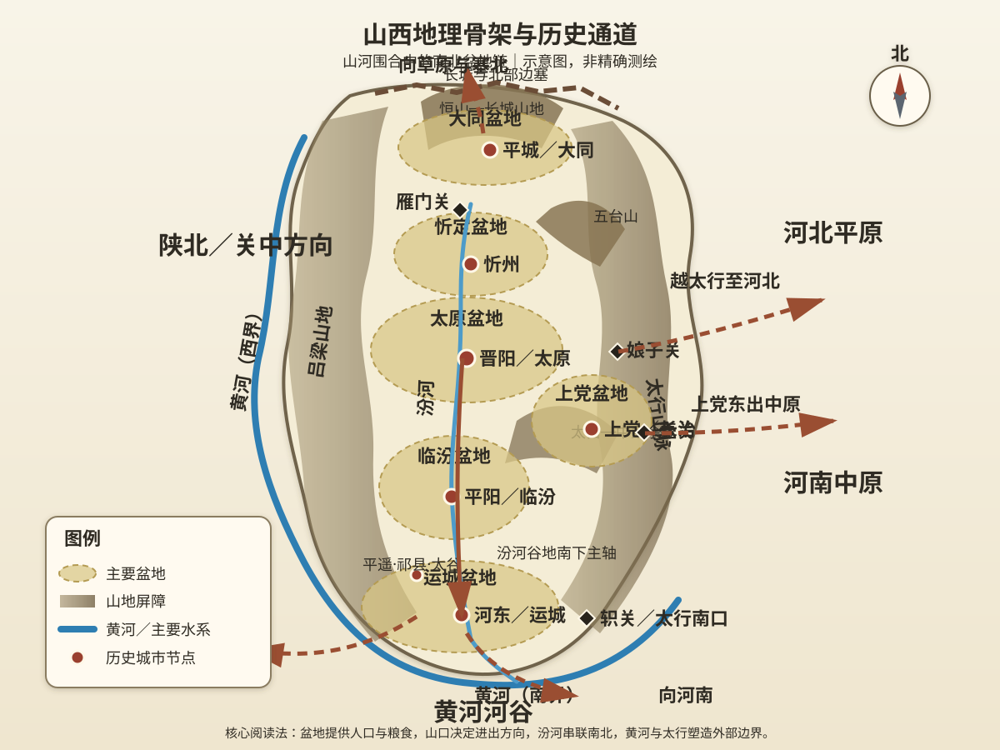
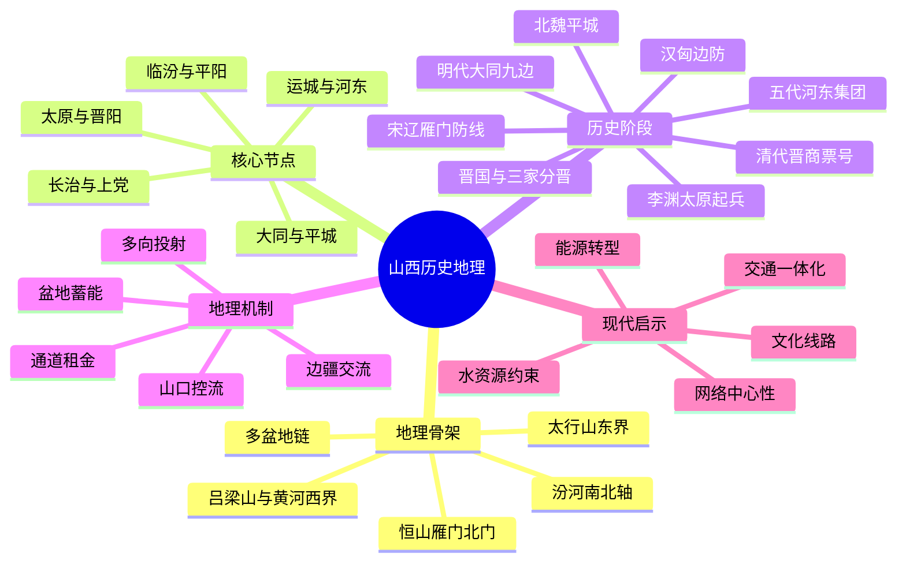

# 第四章　人说山西好风光

- **创建日期**：2026-07-22
- **状态**：初版，已配原创历史地理示意图与独立时间轴
- **关键词**：山西、河东、并州、太原、晋阳、大同、平城、上党、汾河、太行山、吕梁山、雁门关、北魏、唐朝、五代、晋商
- **章节性质**：原创历史地理学习指南，不是原书逐段复述

## 摘要

“人说山西好风光”如果只理解为自然景色，就会错过山西在中国历史中的真正分量。山西位于黄土高原东部，东有太行山，西临黄河与吕梁山，北接长城和草原南缘，南面经黄河河谷联系关中与中原。省域内部并不是一块连续大平原，而是一串由山地分隔、又由汾河和山口连接的盆地：大同盆地、忻定盆地、太原盆地、临汾盆地、运城盆地，以及东南部的上党盆地。

这种“山地围合＋盆地链＋有限出口”的结构，使山西同时拥有两种看似矛盾的角色：它可以作为易守难攻的内陆根据地，也可以成为草原、河北、中原和关中之间的军事走廊。晋国从晋南兴起，赵氏经营晋阳；汉高祖在白登一带遭遇匈奴；北魏以平城为首都统一北方；李渊从太原起兵建立唐朝；五代时期多个政权由河东军事集团而来；宋辽金长期争夺雁门、代州和大同方向；明代大同成为九边重镇，边防供应又推动山西商人走向全国。

本章的核心结论是：

> 山西不是一座封闭堡垒，而是一套由盆地储存力量、由山口控制流动、由南北河谷释放力量的历史机器。

---

## 一、先纠正五个常见误解

### 1. “山西”不等于一个自古固定不变的行政省份

今天的山西省边界是长期行政演变的结果。古代讨论这一地区时，常出现“河东”“并州”“晋”“代”“上党”等不同名称，它们指向的范围、层级和时代并不相同。

“山西”字面上常被理解为“太行山以西”；“河东”则通常指黄河大转弯以东的一片区域，尤其与晋南联系密切；“并州”是汉以后常见的州级地名；“晋”来自周代晋国，但晋国疆域后来远远超出今天山西省。

因此，阅读山西历史必须先问三个问题：

1. 这是哪个朝代？
2. 地名是自然区域、行政区、军镇，还是城市？
3. 所说范围是否与现代山西省一致？

### 2. 山西不是一整块高原

从宏观地形看，山西属于黄土高原东部，但内部差异很大。真正支撑人口、农业、城市和政权的，往往不是山顶，而是山间盆地、河谷与台地。

大同、太原、临汾、运城和长治等重要城市都位于盆地或河谷。山地提供屏障，盆地提供人口和粮食，山口提供交通。三者结合，才形成历史上的山西。

### 3. “表里山河”不等于绝对安全

山西常被概括为“表里山河”，意思是内有山川形胜、外有天然屏障。但任何屏障都需要军队、道路、仓储、情报和政治组织才能发挥作用。

太行山可以阻挡大军，也存在井陉、娘子关、壶关等可通行方向；黄河可以构成边界，也有渡口、冰期与河谷道路；雁门山地可以控制北方入口，但一旦守军薄弱或后方失序，关隘并不会自动阻止敌人。

地理降低防守成本，却不能替代防守能力。

### 4. 山西不只是“北方边疆”

山西北部的大同、朔州、代州长期接近草原南缘，确实具有边疆属性；但山西南部的运城、临汾又深度参与黄河中游农业文明，靠近关中和中原；太原则处于南北系统之间，是全省最重要的枢纽之一；上党通过太行山口连接河北和河南。

因此，山西至少包含三套不同但相互关联的区域：

- **晋北边塞区**：大同、朔州、雁门、代州；
- **晋中枢纽区**：忻州、太原、晋中；
- **晋南河东区**：临汾、运城及黄河沿岸；
- **晋东南上党区**：长治、晋城及太行南部通道。

### 5. 晋商兴起不只是“山西人会做生意”

山西商人的成功不能简单归结为性格。长期边防、军需运输、盐业制度、跨区域路线、人口压力、土地资源限制和信用网络，共同塑造了商业传统。

明代边镇需要粮食、布匹、马匹和军械，国家通过盐引等制度吸引商人运输军粮；清代全国市场扩大，平遥、祁县、太谷等地的商帮和票号进一步发展。商业能力是制度机会、交通经验和组织信用长期积累的结果。

---

## 二、山西的地理骨架：山地围合中的盆地链

### 1. 东部屏障：太行山

太行山沿山西东缘延伸，把山西高地与河北平原、河南北部大体分开。它不是一堵完全连续、无法穿越的墙，而是一条被河谷和山口切开的巨大门槛。

历史上重要的东出方向包括：

- 北部通向河北北部和幽燕；
- 井陉—娘子关方向连接太原盆地与河北平原；
- 滏口、壶关等方向连接上党与河北、河南；
- 太行南端可进入河内、洛阳外围和中原腹地。

对山西政权来说，太行山带来明显优势：东方敌军必须经过有限通道，守方可以集中兵力；山西军队一旦控制出口，又能突然进入人口密集的河北或河南平原。

这就是太行山的“双向门槛”作用：既能挡住外人，也能帮助内部力量选择时机出击。

### 2. 西部边界：吕梁山与黄河

吕梁山纵贯山西西部，山地以西是黄河峡谷和陕北、关中方向。黄河在山西西侧和南侧形成巨大的弯曲边界，使山西与陕西、河南之间既被水系分隔，又通过渡口相连。

西部地理具有三层意义：

1. 黄河与山地共同增加西侧入侵成本；
2. 渡口控制跨河贸易、移民和军事行动；
3. 晋南可沿黄河转向关中或河南，成为秦晋豫交界的活动区。

黄河不是单纯的省界。它更像一条可被季节、技术和组织能力改变的战略通道：水位、船只、浮桥、冰封和渡口守备都会影响两岸联系。

### 3. 北部门户：大同盆地、恒山与长城

山西北部地势较高，大同盆地位于农耕区与草原南缘之间。这里既适合一定规模的农业和城市发展，又便于接触北方骑兵、马匹和草原交通。

北部主要地理层次可以理解为：

- 长城和塞外通道构成外层接触区；
- 大同盆地提供驻军、城市和物资集结空间；
- 恒山、雁门一线形成向山西腹地的第二道门槛；
- 忻定盆地连接晋北与太原。

因此，大同不是孤立边城，而是一个“边疆盆地中心”。北魏选择平城为首都、明代把大同建设为重镇，都与这一结构有关。

### 4. 中部核心：太原盆地与晋阳

太原盆地位于山西南北轴线中段，汾河穿过其中。晋阳位于盆地西侧山地与河流附近，既可利用盆地农业，又能依托山地和水系防守。

太原的重要性来自四个方向：

- 向北经忻州、雁门进入晋北；
- 向南沿汾河谷地进入临汾、运城；
- 向东越太行进入河北；
- 向西可接吕梁山区和黄河渡口。

它不是全国最富庶的地区，却是山西内部最适合整合南北资源的节点。历史上许多割据者和起兵者选择太原，并不是因为这里能够独自供养无限军队，而是因为它能把盆地资源、边疆骑兵和多方向通道组织起来。

### 5. 南部腹地：临汾盆地、运城盆地与河东盐池

山西南部气候相对温和，临汾和运城盆地是较重要的农业区，也是早期华夏文明活动密集的地区之一。运城一带靠近黄河转弯处，连接关中、洛阳和晋中。

河东地区的价值包括：

- 农业条件相对较好；
- 靠近黄河渡口和东西交通；
- 盐池等资源具有财政价值；
- 可向西进入关中，向南东进入河南；
- 是从太原南下争夺长安或洛阳的重要中继区。

李渊从太原起兵后能够迅速南下，正是因为汾河谷地和河东道路提供了一条由北向南逐级推进的通道。

### 6. 东南高地：上党盆地

上党大体位于今天长治盆地及周边高地。它处在太行山内部，地势较高，东可下河北，南可趋河南，西可联系临汾和太原方向。

上党的战略价值不只在于本地资源，而在于它控制太行南部多个出口。战国时期韩、赵、秦围绕上党展开竞争，长平之战的背景也与这一地区的归属和通道有关。

谁控制上党，谁就能影响山西高地与中原北部之间的连接；但上党本身被山地包围，补给与撤退又高度依赖有限道路，因此它既是战略高地，也可能成为高成本战区。

### 7. 内部主轴：汾河与南北盆地链

汾河从山西北中部向南流，经太原、临汾附近，最后汇入黄河。它把多个盆地连接成一条南北轴线。

但不能把汾河谷地想象为毫无阻碍的宽阔高速路。盆地之间仍有山地、峡谷和狭窄地段，大军需要维护道路、渡口和仓储。其真正价值是：在复杂山地中，汾河提供了相对连续、方向明确的交通骨架。

山西历史上的许多行动都沿这条轴线展开：

- 北部骑兵和边军南下太原；
- 太原政权向河东推进；
- 晋南资源北运；
- 商旅和移民沿盆地城市逐站移动。

### 8. 原创历史地理示意图

> 下图强调山脉、河流、盆地、城市、关隘和对外通道，不是精确测绘地图。

阅读地图时，应重点观察四种关系：

1. 太行山和吕梁山如何限定东西进出；
2. 大同—忻州—太原—临汾—运城盆地如何组成南北链条；
3. 雁门关、娘子关、壶关等山口如何控制跨区域流动；
4. 太原为什么比单一盆地更像全省网络的中心。

---

## 三、历史背景：山西为什么反复产生强大区域力量

山西能够反复成为军事和政治中心，不是因为它永远富裕，而是因为它拥有一种特殊组合：

- 内部盆地可供养一定人口和军队；
- 山地降低核心区被快速突破的概率；
- 北部接近草原，可以获得马匹、骑兵和边疆人才；
- 东部出口通向河北平原；
- 南部道路可进入关中和洛阳；
- 太原居中，可以整合晋北、晋中和晋南。

这一组合特别适合在中央政权衰弱时产生区域军事集团。和平时期，山西不一定是全国经济中心；乱世中，它却能够保存兵力、吸收边疆军事资源，并利用有限出口发动突然进攻。

可以把这种优势称为“盆地蓄能效应”：

> 盆地和山地帮助地区保存组织，山口和河谷帮助组织在合适时机向外释放力量。

---

## 四、作者观点：所谓“好风光”，其实是山河结构

本学习指南不逐段复述原书。按照本书“透过地理看历史”的总体方法，本章主题可以概括为：山西的历史不应只由人物和朝代串联，而应由山脉、河流、盆地、关口和交通方向重新组织。

“好风光”在历史地理意义上包括：

- 太行山的高峻，意味着东西交通集中于少数山口；
- 黄河的回环，意味着山西与陕西、河南既分隔又相连；
- 汾河的纵贯，意味着南北盆地能够组成内部交通轴；
- 大同与雁门的边塞景观，意味着农耕与草原长期接触；
- 晋南平原和盐池，意味着山西并非只有贫瘠山地；
- 古城、寺院、关隘和商号，记录了军事、宗教、移民与商业网络。

因此，“风光”不是静态背景，而是历史行动的成本结构。

---

## 五、先秦：晋国为什么从山西南部崛起

### 1. 晋南是早期政治发展的有利区域

周代晋国早期活动中心位于山西南部。这里靠近汾河下游和黄河，农业条件相对较好，能够联系关中、洛阳和太原方向。

与完全开放的中原平原相比，晋南拥有一定山河屏障；与封闭山地相比，又保留对外扩展通道。它适合一个诸侯国先在区域内部整合，再向外争夺。

### 2. 晋国扩张依赖多盆地和多通道

晋国后来成为春秋强国，并不只是依靠今天山西一省。它通过兼并和政治整合，控制更广阔地区。山西内部的盆地和山口为它提供起点，但真正的强国形成还需要制度、贵族联盟、军事组织和对外扩张。

这说明地理优势有两个阶段：

1. 帮助早期政权生存和积累；
2. 必须通过政治组织把多个区域连接成更大国家。

### 3. 晋分三家与区域重组

战国初期，韩、赵、魏瓜分晋国政治遗产。三家各自选择不同方向：赵氏与晋阳、河北联系密切；魏国重心逐渐向河东和中原发展；韩国则围绕上党、河洛等区域展开。

同一个晋国空间被重新拆分，说明山西内部并非天然统一。太原、上党、晋南面向不同外部区域，政治力量可以沿不同通道发展。

---

## 六、秦汉：北部边疆如何成为帝国安全问题

### 1. 统一帝国必须同时处理南北两种山西

秦汉统一以后，山西不再只是地方诸侯的基地，而成为帝国北部防务体系的一部分。晋南靠近关中和洛阳，是内地交通区域；晋北则面对匈奴等草原力量。

中央政府需要同时完成两项任务：

- 保持太原、河东等内地郡县的税粮和交通；
- 在雁门、代郡、云中等北部地区建设边防、移民和军镇体系。

### 2. 白登之围说明北部盆地不是天然安全区

西汉初年，汉高祖在平城、白登山一带与匈奴发生严重冲突。这个事件说明，大同盆地虽然能够容纳城市和军队，但它处于草原骑兵可快速接近的方向。

从中原政权角度看，大同盆地有双重性质：

- 控制它，可以把防线推向北方；
- 深入它，也可能让军队远离内地补给，并遭遇更机动的草原力量。

边疆盆地既是前进基地，也是风险暴露区。

### 3. 汉代边防依赖的不只是长城

长城和关隘只是边防体系的一部分。真正有效的防御还需要：

- 骑兵和马匹；
- 边郡人口；
- 粮食运输；
- 烽燧和情报；
- 与草原政权之间的战争、和亲、贸易和外交；
- 对地方官员与军队的持续管理。

地理规定前线在哪里，国家能力决定前线能否维持。

---

## 七、北魏平城：为什么草原政权选择大同盆地

### 1. 平城连接草原与华北

北魏前期定都平城，即今天大同一带。平城靠近拓跋鲜卑早期活动区域，又能沿道路南下太原和华北，是草原政治传统与中原统治需求之间的连接点。

它的优势包括：

- 接近北方军事和族群基础；
- 大同盆地可容纳首都、人口和农业；
- 南有恒山、雁门等通向山西腹地的道路；
- 东可联系幽州和河北；
- 西可接河套及北方交通。

### 2. 首都也改变了边疆地理

北魏把平城变为首都后，大量人口、工匠、僧侣、官员和物资向这里集中。云冈石窟等文化遗产，正是帝国资源汇聚和多文化交流的结果。

这说明城市地位并非由自然条件单独决定。政治权力会反过来改造地理：修路、建城、迁民、开窟和建立行政体系，使一个边疆盆地成为帝国中心。

### 3. 迁都洛阳说明平城也有局限

北魏后来迁都洛阳，反映平城距离中原核心区较远、气候和粮运条件有限，也反映统治重心南移。平城适合依托北方军事基础建立政权，却未必最适合长期管理人口更密集的中原。

因此，同一地点的优势会随国家目标改变：创业阶段需要接近军事根基，治理全国阶段则更重视人口、财政和行政距离。

---

## 八、隋唐：李渊为什么从太原起兵

### 1. 太原是隋朝北部重要军政节点

隋末天下动荡时，李渊任职太原。这里有军队、城池、地方资源，也接近北方突厥势力和边疆军事网络。

太原不是远离全国政治的偏僻城市，而是连接北部边防、河东和关中的关键节点。

### 2. 起兵路线体现汾河谷地优势

李渊从太原南下，经过晋中、临汾、河东，再向关中推进。这个方向具有明显地理逻辑：

- 汾河谷地提供相对连续的南下道路；
- 沿途盆地能够补充粮食、兵员和马匹；
- 河东接近黄河渡口；
- 渡河后可威胁长安；
- 山西后方相对受山地保护。

太原起兵不是从封闭堡垒直接跳到长安，而是沿盆地链逐步把区域力量转化为全国力量。

### 3. 唐朝为什么重视太原

唐朝建立后，太原具有“王业所基”的政治象征，也继续承担北方军政功能。它可以支援河东、河北与边疆，还是长安—洛阳核心区北侧的重要战略支点。

但唐朝真正维持全国统治，仍依赖关中、河南、河北、江淮和江南等广阔区域。太原是重要基地，不是可以替代全国财政的单一中心。

---

## 九、五代：为什么河东军事集团左右天下

### 1. 唐末边军和地方军镇强化

唐朝后期，中央控制减弱，各地节度使和军事集团坐大。河东地区拥有坚固基地、边疆骑兵传统和多族群军事力量，尤其适合形成相对独立的军政集团。

### 2. 沙陀集团利用太原基地进入中原

李克用及其后继者以河东为重要基地。李存勖后来建立后唐。此后石敬瑭建立后晋、刘知远建立后汉，也都与河东军事网络密切相关。

这种现象不是“山西人特别喜欢割据”，而是特定时代条件下的结构结果：

- 中央衰弱；
- 太原容易防守；
- 北方骑兵和边军资源丰富；
- 山西可向河北、洛阳和关中多个方向投射力量；
- 地方军镇拥有财政和行政体系。

### 3. 燕云十六州改变北方力量平衡

石敬瑭借助契丹力量建立后晋，并割让燕云十六州。相关区域包括长城内外和今北京、河北北部、山西北部部分战略地带。

其影响不应只理解为“失去一片土地”，而是中原王朝失去了一组北方山口、城镇、长城和前沿盆地。此后北方政权可以更直接接近华北平原，中原王朝的防御纵深受到削弱。

### 4. 北汉长期存在说明太原防御力强

五代结束后，北汉仍以太原为核心维持政权，直到北宋灭北汉。太原盆地、城防和北方外援使其能够在强敌压力下长期存在。

但防守优势也有边界：当外援、财政和军事组织无法持续时，再险要的基地也会被攻破。

---

## 十、宋辽金：雁门关为何成为历史符号

### 1. 失去北部前沿后，山口价值上升

宋辽对峙时期，北方边界和控制区发生变化。雁门、代州、大同及太行山口成为军队、使节、商旅和情报活动的重要空间。

雁门关之所以著名，不是因为一座关门本身，而是因为它控制晋北盆地通向太原方向的道路。关外与关内分别联系不同军事系统，谁控制山口，谁就能影响山西腹地的安全。

### 2. 民间英雄故事反映边防记忆

杨家将等故事在文学和民间传说中不断发展，真实史事与后世叙事并不完全相同。但这些故事长期围绕雁门、代州和宋辽战争展开，说明边防地理深刻进入集体记忆。

学习时应区分：

- 正史中的人物和战役；
- 戏曲小说的艺术加工；
- 地方景观与后世纪念；
- 真正决定战场的道路、山口和补给。

### 3. 金元时期山西仍是南北控制轴

金朝由北方向华北扩展，山西是连接北部基地与中原的重要区域；元朝统一后，山西的军事边界作用有所变化，但南北交通、驿站、农业和城市网络继续重要。

边疆线会移动，地理节点却常被新政权重新利用。

---

## 十一、明清：从边镇供应到晋商网络

### 1. 大同成为九边重镇

明朝面对北方草原力量，在长城沿线建立多层军镇体系，大同是最重要的边镇之一。这里需要大量粮食、布匹、马匹、武器和日用品。

边防不仅消耗军费，也创造市场。国家若只依靠中央直接运输，成本极高，因此需要商人和地方社会参与。

### 2. 开中法如何推动商业

明代曾通过制度安排，鼓励商人向边镇输送粮食，再取得经营食盐等权益。山西靠近北部边镇，商人熟悉山路、仓储、牲畜运输和地方关系，因而获得发展机会。

这种商业成长包含四个环节：

1. 军事需求产生稳定市场；
2. 制度把运输贡献转化为商业权利；
3. 商人建立跨地区组织和信用；
4. 经营范围从军需、盐业扩展到更多商品。

### 3. 平遥、祁县、太谷为什么成为商业中心

这些城市位于晋中盆地和南北交通轴附近，既能联系太原，也能南下晋南、北上边镇。当地商帮依靠宗族、同乡、号规、学徒和分号制度，在全国建立网络。

清代中后期，票号把异地汇兑和信用服务推向更高水平。山西虽不是沿海地区，却通过组织和信用参与全国市场。

### 4. 商业繁荣也有脆弱性

晋商网络依赖国家制度、市场秩序、交通方式和信用结构。当盐业政策改变、现代银行兴起、铁路和沿海贸易重塑全国经济时，传统票号和商帮面临挑战。

这再次说明：地理优势不是永久租金。技术和制度变化会重新定义“中心”和“通道”。

---

## 十二、关键事件时间轴

本章的完整独立时间轴见：

> [第四章配套：山西历史地理时间轴](../Timeline/Chapter04_山西历史地理时间轴.md)

简表如下：

| 时间 | 事件 | 地理意义 |
|---|---|---|
| 西周—春秋 | 晋国在晋南形成并扩张 | 依托盆地、黄河和对外通道建立区域强国 |
| 战国 | 韩赵魏分晋，赵氏经营晋阳 | 山西不同盆地分别面向河北、中原与关中 |
| 前200年 | 汉高祖白登之围 | 大同盆地暴露农耕帝国深入草原前缘的风险 |
| 398年 | 北魏定都平城 | 晋北边疆盆地成为统一北方的首都 |
| 494年 | 北魏迁都洛阳 | 国家治理重心由军事根基转向中原人口区 |
| 617年 | 李渊太原起兵 | 汾河谷地成为从北方基地南取关中的通道 |
| 五代时期 | 河东军事集团建立多个政权 | 太原的防守、边军和多向出口放大区域力量 |
| 936年 | 燕云十六州割让 | 北方关隘和防御纵深发生重大变化 |
| 979年 | 北宋灭北汉 | 太原长期割据结束，山西纳入宋朝体系 |
| 明代 | 大同九边、边镇贸易 | 军需市场和制度推动山西商帮成长 |
| 清代中后期 | 晋商与票号兴盛 | 内陆交通与信用网络连接全国市场 |

---

## 十三、地理为什么重要：五个机制

### 机制一：盆地保存人口和组织

山地内部的盆地能够提供耕地、城市和仓储，又比开放平原更容易防守。在天下大乱时，区域政权可在盆地内恢复秩序、训练军队和积累物资。

### 机制二：山口把广阔边界压缩为少数节点

太行山、恒山和吕梁山使大军无法任意穿行。防守者可以把有限兵力集中于雁门、娘子关、壶关等方向，从而提高防御效率。

### 机制三：汾河谷地形成内部主轴

若没有汾河和盆地链，大同、太原、临汾、运城可能只是彼此隔绝的地区。南北谷地把它们连接起来，使山西能够形成更大的区域系统。

### 机制四：边疆接触带提供军事与商业资源

接近草原意味着战争风险，也意味着马匹、骑兵、贸易、移民和文化交流。许多山西军事集团具有边疆色彩，晋商也从边镇供应中获得机会。

### 机制五：多方向出口提高战略选择，也增加防务复杂度

山西可以东出河北、南下河南、西渡黄河、北接草原。多方向选择有利于扩张，但也要求政权同时维护多个关口。一个只控制太原、却失去晋北或晋南的政权，很难长期发挥山西整体优势。

---

## 十四、深度解析：山西的三个历史模型

### 模型一：盆地链国家

山西不是围绕一块单一大平原形成，而是由多个盆地串联。这样的区域整合需要控制“节点之间的连接”，而不只是占领每个城市。

分析盆地链时，应关注：

- 哪个盆地提供粮食；
- 哪个盆地接近边疆军事资源；
- 哪个狭口连接上下游；
- 哪座城市能协调全局；
- 运输是否受到季节和道路限制。

太原的重要性就在于它处于盆地链中部，能够协调南北。

### 模型二：边疆—腹地转换器

大同和晋北吸收草原与边疆资源，晋南接近关中和中原，太原负责把两者连接。山西因此像一台转换器：把北方军事能量转化为进入中原的力量，把中原财政和商品转化为边疆供应。

北魏、唐初、五代军镇和明代晋商，分别以不同方式使用了这台“转换器”。

### 模型三：通道租金与通道风险

控制关口、渡口和商路可以获得税收、军需和市场机会，这就是通道租金。但依赖通道也会产生风险：

- 战争可立即切断贸易；
- 新道路和铁路可能绕过旧城市；
- 政策改变会取消盐引等特权；
- 资源型运输可能挤压其他产业；
- 单一通道一旦中断，整个网络受损。

所以，通道价值必须转化为教育、金融、技术和多元产业，才能长期保留。

---

## 十五、长期历史影响

### 1. “晋”成为山西最持久的文化符号

晋国的历史使“晋”成为山西简称，也让春秋晋国、三家分晋和法家政治传统长期进入中国历史叙述。

### 2. 山西塑造北方王朝的军事结构

从汉代边郡到北魏平城，从唐代河东到五代军镇，山西持续为北方政权提供军队、马匹、将领和战略基地。

### 3. 太原反复成为创业与割据中心

太原具有良好防御、区域资源和多向交通，特别适合中央衰弱时期建立军事政权。但它距离全国最主要人口财赋区仍有距离，因此从太原出发者若想统一天下，必须尽快取得河北、河南、关中或江淮资源。

### 4. 晋北成为民族交流与文化融合区域

平城、云冈和长城沿线见证不同族群、宗教和艺术传统的交流。边疆不是文明尽头，而是多种政治与文化相遇的空间。

### 5. 边防经济推动跨区域商业

明清晋商说明，军事地理可以转化为商业地理。长期运输、边贸和信用组织，使内陆山地省份建立全国性网络。

### 6. 资源开发重新定义近现代山西

近现代煤炭工业使山西成为重要能源基地。铁路和现代工业强化部分旧有南北走廊，同时使经济更依赖资源开采、重工业和外运体系。

---

## 十六、古今地名对照

> 古地名范围随朝代变化，以下仅提供阅读时的近似对应，不能视为完全重合。

| 古代名称 | 大致现代对应 | 历史作用 |
|---|---|---|
| 晋阳 | 太原市西南一带 | 晋中政治军事核心，唐朝起兵与五代河东基地 |
| 太原 | 今太原及周边，不同时期范围不同 | 山西南北交通枢纽 |
| 平城 | 今大同市一带 | 北魏前期首都、晋北盆地中心 |
| 云中 | 今大同、内蒙古南部相关区域，时代范围有变 | 北方边郡与草原接触区 |
| 雁门 | 今忻州北部、代县一带 | 晋北进入太原方向的重要山口系统 |
| 代州 | 今代县及周边 | 宋辽边防与雁门通道节点 |
| 河东 | 广义指黄河以东，常重点指晋南 | 农业、盐业及关中—中原交通区域 |
| 平阳 | 今临汾一带 | 临汾盆地中心、晋南重要城市 |
| 蒲州 | 今永济一带 | 黄河渡口与关中交通节点 |
| 解州 | 今运城市盐湖区附近 | 河东盐池和晋南经济节点 |
| 上党 | 今长治盆地及周边 | 太行高地、连接晋冀豫的重要战略区 |
| 泽州 | 今晋城一带 | 太行南部通向河南的区域节点 |
| 并州 | 汉以后州级区域，治所和范围多变 | 常与太原、山西中北部政治地理联系 |

---

## 十七、现代启示

### 1. 山地地区的发展关键是“连接质量”

山西城市分布在多个盆地，现代发展不能只看城市自身规模，还要看盆地之间的铁路、公路、数据网络和物流效率。山地会增加基础设施成本，但高质量通道也能显著扩大区域市场。

### 2. 枢纽不能只做资源通道

煤炭外运使山西成为重要能源通道，但只依赖资源运输容易形成路径依赖。真正长期的枢纽价值，应包括能源技术、装备制造、储能、电网服务、材料、数据中心和专业人才。

### 3. 边缘地区也可能成为网络中心

古代大同位于帝国边缘，却能成为北魏首都和明代重镇；晋商来自内陆，却建立全国网络。地理位置的“中心”不是只由地图中心决定，而由网络连接和组织能力决定。

### 4. 文化遗产应按线路而非孤立景点理解

云冈石窟、五台山、平遥古城、晋祠、雁门关和晋商大院不是彼此无关的景点。它们分别对应北魏首都、佛教交通、晋中商业、太原政治、边防体系和信用网络。按历史路线串联，才能理解其整体价值。

### 5. 水资源是现代山西的重要约束

盆地城市、农业、煤炭和工业都需要水。历史上河谷决定聚落，今天水资源、生态修复和产业结构同样影响长期承载力。资源优势若超出环境容量，就会转化为发展成本。

### 6. 交通技术会重新定义旧关隘

古代娘子关、雁门关控制山路，现代铁路、高速公路和隧道降低山地阻隔。旧关隘的军事价值下降，但相同方向仍可能是重要交通走廊。技术不会消灭地理，只会改变地理发挥作用的方式。

---

## 十八、思维导图

---

## 十九、五分钟复习

1. 山西不是一整块高原，而是山地围合下的多个盆地和河谷。
2. 太行山控制东西交通，吕梁山和黄河构成西部屏障，恒山—雁门控制北部入口。
3. 汾河把太原、临汾、运城等盆地连接成南北主轴。
4. 太原的优势是处于盆地链中部，能够整合晋北军事资源和晋南农业交通。
5. 大同盆地既是北方前线，也是草原政权南下和中原政权北进的基地。
6. 北魏定都平城，说明边疆盆地可在政治权力投入下变成帝国中心。
7. 李渊从太原南下，利用汾河谷地和河东道路进入关中。
8. 五代河东集团崛起，是中央衰弱、边军资源和山西地理共同作用的结果。
9. 明代边镇供应和盐业制度推动晋商成长，商业传统不是单纯性格产物。
10. 地理提供通道和屏障，组织能力决定能否把它们转化为国家、商业或文化优势。

---

## 二十、思考题

1. 如果没有汾河谷地，太原能否长期整合晋北和晋南？
2. 北魏选择平城和后来迁都洛阳，分别反映了哪些不同国家目标？
3. 李渊从太原起兵的优势是什么？他若长期停留山西而不夺取关中，会面临什么限制？
4. 五代时期山西为什么容易产生强大军事集团，却不一定能长期供养统一帝国？
5. 燕云十六州的价值主要是土地、人口，还是关隘、长城和战略纵深？
6. 晋商的成功更依赖地理位置、国家制度，还是组织信用？三者如何结合？
7. 现代隧道、高铁和高速公路是否已经消除了太行山的地理影响？
8. 山西应如何把能源通道优势转化为更持久的技术和产业优势？

---

## 二十一、参考资料与延伸阅读

### 原始史料

1. 《左传》：晋国早期、晋楚争霸及春秋政治地理相关记载。
2. 司马迁：《史记·晋世家》《史记·赵世家》《史记·高祖本纪》。
3. 班固：《汉书·高帝纪》《汉书·匈奴传》。
4. 魏收：《魏书·太祖纪》《魏书·高祖纪》，用于平城定都与迁洛背景。
5. 刘昫等：《旧唐书·高祖本纪》。
6. 欧阳修：《新五代史》，用于河东集团与五代政权关系。
7. 脱脱等：《宋史》《辽史》《金史》。
8. 《明史·兵志》《明史·食货志》，用于九边、军需与盐政背景。

### 历史地理与专题研究

1. 谭其骧主编：《中国历史地图集》。
2. 邹逸麟：《中国历史地理概述》。
3. 侯仁之：《历史地理学的理论与实践》。
4. 山西省地方志相关资料：山川、府州县沿革、交通与物产。
5. 北魏平城、云冈石窟与民族融合研究。
6. 唐代河东道、太原府与北方军政研究。
7. 燕云十六州及宋辽边疆地理研究。
8. 晋商、开中法、盐业制度和票号史研究。

### 延伸参观与地图阅读

- 大同—云冈—恒山：观察北魏首都与晋北边塞；
- 代县—雁门关—忻州：理解山口和盆地之间的关系；
- 太原—晋祠—晋中：观察太原盆地与晋商网络；
- 临汾—运城—永济：理解晋南农业、盐池和黄河渡口；
- 长治—晋城：理解上党高地与太行南部通道。

---

## 本章总结

山西历史的真正主角，不只是晋文公、汉高祖、拓跋氏、李渊、李克用、石敬瑭或晋商。更深层的主角是一套长期存在的空间结构：太行山限制东西交通，吕梁山和黄河塑造西部边界，恒山与雁门控制北部入口，汾河串联南北盆地，太原位于全省网络中枢，大同连接草原，晋南连接关中与中原，上党控制太行南部出口。

这套结构没有预先决定谁必然胜利，却反复提出同样的问题：谁能守住山口，谁能维持盆地间运输，谁能把边疆军事资源与农业财政结合，谁能把通道机会转化为长期组织能力？

因此，本章最值得记住的一句话是：

> 山西的力量不来自“藏在山里”，而来自能够在山里保存力量、沿河谷组织力量，再通过少数关口把力量投向天下。
