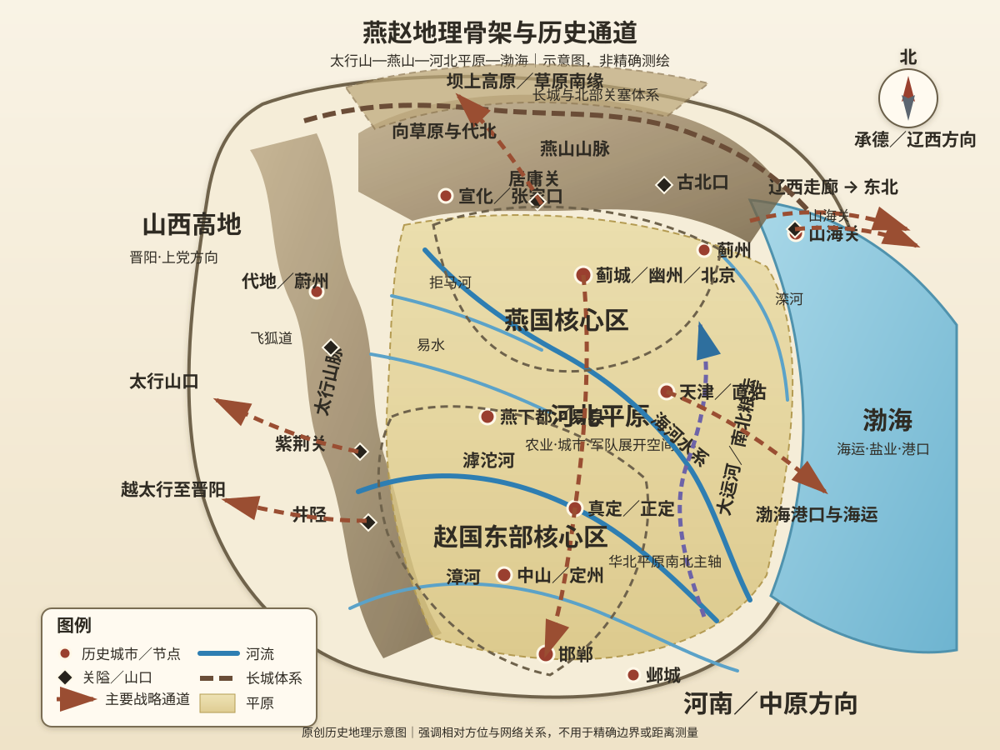
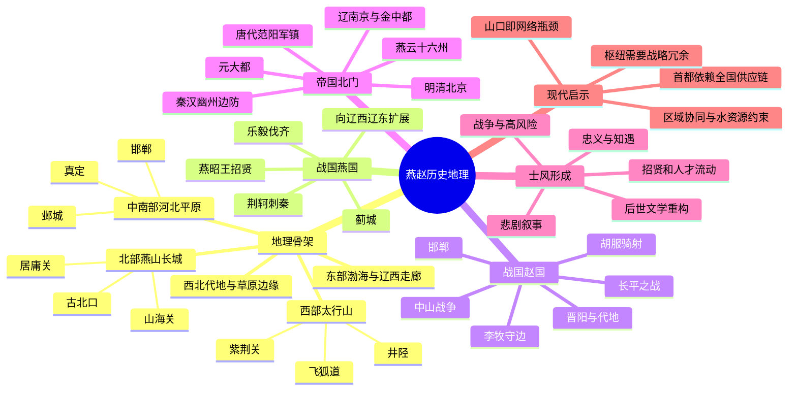

# 第五章　燕赵多慷慨悲歌之士

- **创建日期**：2026-07-23
- **状态**：初版，已配原创历史地理示意图与独立时间轴
- **关键词**：燕赵、河北、幽燕、蓟城、邯郸、太行山、燕山、华北平原、渤海、长城、居庸关、山海关、胡服骑射、荆轲、李牧、燕云十六州、北京
- **章节性质**：原创历史地理学习指南，不是原书逐段复述

## 摘要

“燕赵多慷慨悲歌之士”常被理解成一种北方人格赞美：豪爽、重义、敢于赴难。但如果只把它解释为“河北人天生如此”，就会把历史文化误读成先天性格。燕赵地区长期处在多套地理系统的交界处：西面是太行山及其有限山口，北面是燕山—长城与草原南缘，中南部是开放的华北平原，东面通向渤海和辽西走廊，西北又可经代地、张家口方向进入草原。

这种“山口守边、平原受冲、南北交会、海陆相接”的结构，使燕赵既容易形成强大的区域政权，也经常成为大国战争的前线。燕国需要同时面对齐、赵、中原与东胡、辽西；赵国既要防秦、韩、魏，又要经营代郡、雁门和北方骑兵区。后来幽州、范阳、燕云十六州、北京、山海关反复成为历史关键词，背后仍是同一组地理问题：谁控制山口，谁就能影响华北平原；谁控制平原北缘，谁就能连接草原、东北与中原；谁能把运河、道路、港口和边防组织成一体，谁就可能把边疆城市变成全国中心。

本章的核心结论是：

> 燕赵士风不是地理直接制造的性格，而是边疆压力、战争频率、人才流动、政治动员与后世记忆共同塑造的文化形象；地理提供了反复产生这种形象的历史场景。

---

## 一、先纠正五个常见误解

### 1. “燕赵”不等于今天河北省

“燕”和“赵”首先是先秦诸侯国名称，其疆域随时代变化。燕国核心在蓟城及河北北部、北京一带，强盛时向辽西、辽东扩展；赵国早期与晋阳、代地、上党有关，后来以邯郸为都，疆域跨越今天山西、河北、河南、内蒙古部分区域。

因此，历史上的燕赵大体与今天北京、天津、河北及周边若干地区有关，却不能直接画上现代省界等号。阅读史书时，至少要区分：

- **战国燕国与赵国**：政治实体；
- **秦汉幽州、冀州、代郡、赵国等行政区**：时代不同、范围不同；
- **唐代河北道、幽州、范阳**：行政区与军镇体系；
- **燕云十六州**：五代以后具有特殊战略意义的一组州；
- **现代京津冀**：当代行政和经济区域。

### 2. 原句是“感慨悲歌”，不宜只当作地域标签

唐代韩愈《送董邵南序》开头写：“燕赵古称多感慨悲歌之士。”后世常改说成“慷慨悲歌之士”。两种说法都指向豪杰之气，但原文并不是一篇简单赞美河北民风的文章。

韩愈写作时，唐代河北藩镇与中央关系复杂。他一方面借古代燕赵士风鼓励董邵南，另一方面又提醒“风俗与化移易”，实际上包含对现实政治的试探和劝诫。理解这句话，不能脱离唐代藩镇背景，也不能把文学形象当成对所有居民的永久描述。

### 3. 河北不是一望无际的平原

现代河北省拥有高原、山地、丘陵、盆地、平原、湖泊和海滨等多种地貌。宏观上可分为：

- 西北坝上高原；
- 北部燕山山地；
- 西部太行山地；
- 中部和东南部河北平原；
- 东部渤海沿岸。

燕赵历史的关键，不只是“平原适合骑兵”，而是山地、山口、平原、河流、海岸和高原如何连接。

### 4. 长城不是一条永远有效的绝对边界

长城必须与关隘、城堡、烽燧、驻军、道路、粮运、情报和外交共同工作。居庸关、古北口、喜峰口、山海关等节点的重要性，往往大于某一段连续墙体。

敌军不需要平均突破整条长城，只需要寻找薄弱关口、绕行通道或利用内部政治失序；守军也不能只站在墙上，而要维护前后方补给和机动兵力。因此，长城更像一套“边疆交通控制系统”，而不是单纯的高墙。

### 5. 北京成为首都不是自古注定

蓟城、幽州、燕京、南京、中都、大都、北平、北京的地位不断变化。北京的优势在不同历史阶段才逐步叠加：

- 位于华北平原北缘，靠近燕山山口；
- 可连接草原、东北和中原；
- 元明以后大运河与全国粮运体系强化其南北联系；
- 政权的军事根基和统治范围向北、向东北扩展；
- 城市建设、行政体系和人口迁入反过来提升中心性。

没有运河、仓储、军队、道路和统一国家的组织能力，北京的地理位置并不会自动转化为全国首都优势。

---

## 二、燕赵的地理骨架：一块被山口切开的北方前沿

### 1. 西部边界：太行山与多重山口

太行山沿今天河北西部延伸，把山西高地与河北平原大体分开。它是一道巨大门槛，却不是不可穿越的墙。井陉、飞狐陉、蒲阴陉、紫荆关及太行南端诸通道，使山西与河北之间形成一组“有限但关键”的东西走廊。

这些通道具有三重意义：

1. 山西力量可以越太行进入河北平原；
2. 平原政权可以经山口进攻太原、上党和代地；
3. 守方可在狭窄通道集中兵力，降低正面防御成本。

战国时期赵国横跨太行内外，既经营晋阳、代地，也控制邯郸和河北平原，因此它必须把山地基地、平原都城和北方边疆组织成一个整体。后世井陉之战、娘子关防务以及太行抗战等事件，也反复说明这些出口的长期价值。

### 2. 北部屏障：燕山、长城与关口体系

燕山大体横亘在华北平原北缘，西接张家口方向，东至山海关附近，南侧是北京—唐山—秦皇岛一线及河北平原。山脉使南北交通集中于若干谷口：

- **居庸关—南口**：连接北京平原与宣化、张家口方向；
- **古北口**：连接北京东北与承德、蒙古高原东南缘；
- **喜峰口等燕山东段通道**：联系蓟州、遵化与北方山地；
- **山海关**：位于燕山东端与渤海之间，控制辽西走廊西口。

燕山并不只是防线。它也把北京塑造成“山前节点”：向南进入华北平原，向北穿越山口接触草原，向东北沿辽西走廊通往辽东。

### 3. 西北过渡区：代地、坝上与张家口走廊

代地和坝上并非纯粹的中原内地，也不是完全独立的草原。这里处于农牧交错和高原—盆地转换地带，适合骑兵活动，也需要依赖河谷、城塞和季节性资源。

赵国经营代地、赵武灵王推行胡服骑射、李牧长期驻守雁门和代北，都与这一地理环境密切相关。对中原政权来说，这里是边防前沿；对草原力量来说，这里是南下华北的通道；对地方军事集团来说，这里又可能成为获得马匹、骑兵和边疆人才的基地。

### 4. 中部与南部：河北平原的开放性

河北平原属于华北平原的重要组成部分，地势低平，适合农业、人口聚居和大规模军队展开。邯郸、邺城、信都、真定等城市的兴起，都与平原交通和农业基础有关。

但开放性意味着双重结果：

- 和平时期，平原有利于粮食生产、城市和交通网络；
- 战争时期，缺少连续天然屏障，大军可以快速推进，城池和河流成为主要防御节点。

因此，河北历史上常出现“城市坚守、平原决战、河道阻击、山口退守”几种模式。一个政权若只控制平原而失去北部山口，可能被骑兵快速南压；若只占山地而缺少平原粮源，又难以维持大型国家。

### 5. 河流：道路、障碍与不断移动的边界

燕赵地区的重要河流包括滹沱河、漳河、易水、拒马河、滦河及海河水系诸河。黄河在历史时期也多次改道，影响河北南部的行政、农业和交通。

北方河流具有明显季节性：丰水、枯水、结冰和决口都会改变军事条件。河流可以为城镇提供水源和运输，也可能造成洪灾；可以暂时阻挡军队，也可能在枯水或冰封时期失去屏障作用。

荆轲易水送别之所以成为文化象征，是因为易水既是一条真实河流，也是燕国南部边界和出发线的象征：越过它，就从燕国政治空间进入通向强秦的危险道路。

### 6. 东部接口：渤海、天津与辽西走廊

燕赵东部并非封闭内陆。渤海沿岸提供盐业、渔业、港口和海上联系；天津地区后来成为大运河与海河水系的交会节点；山海关—辽西走廊则把华北与东北连接起来。

对古代政权来说，东北方向常兼具边疆和扩张意义：燕国曾向辽西、辽东发展；秦汉以后辽东与幽州体系联系紧密；明清之际山海关成为影响全国政局的关键门槛。

### 7. 两大核心城市：蓟城与邯郸

**蓟城／幽州／北京**位于华北平原北缘，靠近燕山山口，适合控制北方入口并联系辽西。它的价值偏向“边疆枢纽与全国北门”。

**邯郸**位于河北南部，连接太行山东麓、黄河以北平原以及齐、魏、秦方向。它的价值偏向“战国中原竞争与南北交通节点”。

燕与赵并非共享一个单一中心，而是分别代表燕山南麓与河北南部两套地缘结构。后世北京成为全国中心，也不等于邯郸、邺城、真定等南部节点失去历史意义。

### 8. 原创历史地理示意图

> 下图强调山脉、平原、河流、关口、城市和战略通道，不是精确测绘地图。



阅读地图时，应重点观察：

1. 太行山如何把山西高地与河北平原分开，又被若干山口连接；
2. 燕山如何把北京平原与草原南缘分隔，并在居庸关、古北口形成入口；
3. 山海关为什么能控制华北与东北之间的狭窄走廊；
4. 邯郸与蓟城为何分别成为赵、燕的重要中心；
5. 平原、山口、海岸和运河如何共同推动北京后来成为全国首都。

---

## 三、历史背景：边疆与中原之间的“双向压力”

燕赵地区最突出的历史条件，是同时面对北方边疆与中原竞争。

燕国向南要处理齐、赵等强国，向北和东北要面对东胡及辽西诸部；赵国向西南要面对秦、韩、魏，向北又要经营代、雁门和草原边缘。一个政权若只发展中原步兵和城邑体系，可能无法应对北方骑兵；若只依赖边疆骑兵，又难以稳定治理人口密集的农业区。

这种结构逼迫燕赵政权反复进行组织适应：

- 建设边墙与关塞；
- 发展骑兵和侦察；
- 招募游士、将领与移民；
- 在山地、平原和边疆之间调配粮食；
- 通过外交、战争、互市和人质处理多方关系；
- 在中央权威不足时依靠地方军事集团。

可以把这种压力称为“边疆—平原双系统”：

> 平原提供人口、农业和城市，边疆提供马匹、军事经验和战略纵深；两者若能整合，区域政权就可能强大，若彼此割裂，国家就容易在两线压力下崩溃。

---

## 四、作者观点：从“士风”进入地理，而不是从地理推导性格

围绕本书“透过地理看历史”的方法，本章最重要的不是证明燕赵人“天生勇敢”，而是追问：为什么后世文化记忆会不断从燕赵历史中选择荆轲、高渐离、廉颇、蔺相如、赵武灵王、李牧等人物？

地理与士风之间不是简单因果关系，而是一条较长的链条：

```text
边疆与战争频繁
→ 国家需要骑士、将领、说客、刺客和游士
→ 人才流动和政治招募增加
→ 高风险行动更容易进入史书
→ 文学反复讲述忠义、勇决与悲剧
→ “燕赵慷慨悲歌”成为稳定文化意象
```

这种解释保留了人的主动性。相同地理条件下，不同制度和政治选择会产生不同结果：燕昭王纳贤使燕一度强盛，燕王喜和太子丹的刺秦计划却无法弥补国家实力差距；赵武灵王主动改革增强军力，赵国后期又因内部政治杀害李牧而加速灭亡。

所以，士风不是地理宿命，而是历史选择被文学长期记忆后的结果。

---

## 五、战国燕国：偏远并不等于封闭

### 1. 燕国为何常被视为“北方弱国”

燕国核心远离战国中原的主要竞争中心，北部和东北部又承担边疆压力。与齐、魏、赵相比，燕国人口和经济基础并非始终占优，内部权力斗争还曾导致严重动荡。

但偏远也带来一定生存空间：

- 山地与距离提高其他国家长期占领成本；
- 可向辽西、辽东和北方扩展；
- 蓟城能够连接华北平原、草原边缘和东北；
- 在中原大国互相牵制时，燕国可以保存或重建力量。

### 2. 燕昭王招贤：人才政策怎样改变地缘弱势

燕国遭齐国重创后，燕昭王重建国家并招揽人才，乐毅等人进入燕国。后世常用“黄金台”象征其求贤，具体建筑和传说需要谨慎辨别，但招贤兴国的政治记忆具有真实历史基础。

燕国缺乏压倒性人口和资源优势，因此更需要通过人才、联盟和组织能力弥补。乐毅率多国联军攻齐，使燕国一度达到强盛顶点。这一案例说明：

> 边缘国家若能把开放的人才政策、联盟网络和集中军事行动结合起来，可能在短期内突破地理与资源限制。

但燕国未能把战果稳定转化为长期制度优势。燕昭王去世后，内部信任与指挥体系变化，齐国得以复国。人才可以改变战略窗口，却不能替代持续治理。

### 3. 向辽西、辽东扩展：燕国的东北方向

燕将秦开活动于北方和东北边疆，燕国势力曾向辽西、辽东扩展，并建设边塞体系。其意义不只是“占领更多土地”，而是把燕国从单纯的华北北缘国家，变成连接中原、草原和东北的区域政权。

这种东北方向后来被秦汉继承。幽州、辽西、辽东之间的联系，也成为此后两千年北方政治地理的重要轴线。

### 4. 荆轲刺秦：悲壮行动为何产生于实力差距

荆轲刺秦常被视为燕赵士风的最高象征。易水送别、地图藏匕、图穷匕见，形成极强的文学画面。

但从国家战略看，刺杀计划本身反映燕国已难以通过常规军事方式抵抗秦国。太子丹试图用高风险个人行动改变国家力量对比，是弱国面对系统性压力时的非常手段。

荆轲的勇气值得理解，却不能替代对战略结构的分析：

- 秦国已逐步击败其他六国，资源和组织优势巨大；
- 燕国距离秦国遥远，难以持续投送大军；
- 赵国衰败后，燕国失去重要缓冲；
- 刺杀即使成功，也未必能摧毁秦国制度与军队；
- 个人英雄行动无法自动弥补联盟失败和国家能力差距。

“悲歌”之所以悲，正因为人物的勇决与国家的结构性弱势同时存在。

---

## 六、战国赵国：跨越太行的改革型国家

### 1. 赵国为何比燕国更具多方向压力

赵国继承晋国部分空间，早期核心与晋阳、代地、上党相关，后来把都城迁到邯郸。它横跨太行山内外，拥有山地、平原和北部边疆，却也面对更多敌人：

- 西面和西南面对秦、韩、魏；
- 东面面对齐；
- 北面面对燕、东胡、林胡、楼烦等力量；
- 内部还需处理中山国及山地通道。

赵国的战略优势与负担来自同一件事：疆域跨越多个地理系统。

### 2. 胡服骑射：不是服装改革，而是军事系统改革

赵武灵王推行胡服骑射，核心目标是适应北部和西北边疆的骑兵战争。传统宽大服饰和以战车为核心的作战方式，不适合复杂山地、长距离机动和骑射环境。

改革至少涉及：

- 服装与装备便利化；
- 骑兵训练；
- 马匹与边疆资源；
- 贵族礼制观念调整；
- 军队组织和将领选拔；
- 对代地、中山和北方诸部的战略。

《史记·赵世家》借赵武灵王之口明确把改革与“燕、三胡、秦、韩之边”联系起来，说明改革是对多方向地理压力的制度回应。

### 3. 消灭中山：打通赵国内部空间

中山国位于赵国东西、南北联系的重要区域，对赵国形成空间阻隔。赵国多次进攻中山，并最终将其兼并，目的不仅是扩大领土，也是改善内部交通和战略连续性。

一个跨太行的国家若内部被另一政权切割，就难以快速调动军队和税粮。赵武灵王的北方扩展与中山战争，可以理解为对国家空间的重新整合。

### 4. 邯郸：平原都城的繁华与暴露

邯郸位于太行山东麓和平原交通线上，适合商业、人口聚集和对中原诸国交往。它使赵国更深地参与战国核心竞争，也使都城更接近秦国东进方向。

邯郸的优势是开放，弱点也是开放。赵国必须依靠西部山口、上党防线、南部城邑和野战军共同保护首都。一旦外部防线崩溃，平原都城会迅速承受巨大压力。

### 5. 长平之战：上党归属与赵国国力的极限

长平之战发生在上党地区，其背景与上党归属、秦赵竞争和太行南部通道有关。它虽然不在今天河北省核心，但直接决定赵国和邯郸的安全。

赵国需要阻止秦国控制上党并越过山地向华北平原推进；秦国则希望突破这一高地，打开向赵都方向的道路。长期对峙把粮食、兵员和国家财政推向极限。

战役说明：

- 战略高地可能迫使国家投入超过承受能力的资源；
- 人口众多不等于补给无限；
- 山地前线距离本国核心较近，也可能因道路集中而形成后勤瓶颈；
- 一次巨大失败会改变整国人口、军队和政治信心。

### 6. 李牧：边疆防御是一套系统，不是一次决战

李牧长期驻守代、雁门防备匈奴。他重视烽火、侦察、训练、物资和士卒待遇，在条件不利时避免轻率出战，待敌军暴露后再集中反击。

这套方法揭示成熟边防的基本逻辑：

1. 建立可靠预警；
2. 保护人口和物资；
3. 不让敌人决定交战时间；
4. 用训练和纪律维持长期战备；
5. 在优势条件形成后实施决战。

李牧后来又抵抗秦军，却因赵国内部反间和政治猜疑被杀。赵国失去最能整合边疆经验与主力战争的将领后，很快灭亡。

因此，赵国失败不是“没有勇士”，而是政治组织无法长期保护和信任最重要的军事人才。

---

## 七、从秦汉到隋唐：燕赵怎样成为帝国北门

### 1. 秦汉：从诸侯边疆转为统一帝国边防

秦统一后，原燕赵空间被纳入郡县体系。汉代幽州、代郡、渔阳、上谷、右北平等地成为北部边防和东北交通的一部分；河北南部则与冀州、赵国、常山等行政区相联系。

统一帝国改变了地理功能：过去燕赵彼此竞争，后来中央政府需要把它们连接成华北防线。国家必须维持：

- 长城、关塞和烽燧；
- 边郡骑兵与屯戍；
- 平原粮食向北运输；
- 对匈奴、乌桓、鲜卑等力量的战争与外交；
- 通往辽西、辽东的道路。

### 2. 河北平原成为南北政权争夺走廊

东汉末年至魏晋南北朝，河北因人口、农业和交通而成为北方政权的重要基础。袁绍以冀州为核心与曹操竞争；邺城一度成为重要政治中心；北方统一战争多次沿太行山东麓和平原展开。

平原能够支持大规模政权，却很难长期与周边政治隔绝。谁控制山西出口、黄河渡口、幽州和中原北部，谁就能不断向河北施加压力。

### 3. 唐代幽州与范阳：边防军镇怎样反过来威胁中央

唐代东北边防压力上升，幽州、范阳一带驻军和军事资源不断增强。边镇必须面对契丹、奚等力量，也控制河北北部交通。

当中央对地方军队、财政和官员任免的控制减弱时，边防资源可能转化为割据资本。安禄山以范阳等地军力发动叛乱，说明一个为了保护帝国边疆而强化的军事节点，也可能沿华北平原迅速南下，攻击帝国中心。

地理并未改变方向，只是控制者改变了：

> 同一条南北走廊，在中央强盛时输送边防军需，在中央衰弱时也能输送叛军。

### 4. 韩愈为什么在唐代重新谈“燕赵士风”

中唐以后河北藩镇长期具有较强独立性。韩愈送董邵南前往河北时，既想到古代燕昭王求贤、屠狗豪杰和慷慨之士，也不得不面对当时藩镇政治。

因此，《送董邵南序》的真正张力是：古代英雄传统是否仍然存在？有才能的人应当投身地方藩镇，还是服务中央秩序？“燕赵士风”在这里不是纯粹赞歌，而是历史记忆与现实政治之间的对话。

---

## 八、燕云十六州：为什么一片山前地区影响宋辽百年格局

### 1. 燕云十六州的战略价值

五代时期，石敬瑭将燕云十六州割让给契丹。其范围包括燕山南北及山西北部若干关键州，并非完整等同于今天某一行政区。

这片地区的重要性在于：

- 包含燕山、太行北部及长城沿线关口；
- 控制华北平原北缘；
- 连接山西北部、北京地区与辽西；
- 能为骑兵提供穿越山地进入平原的通道；
- 拥有城市、人口和农业，不只是荒凉边塞。

### 2. 北宋为何感到长期不安全

北宋核心位于开封及中原。失去燕云后，北方防线难以完全依托燕山和长城，只能更多利用河北平原上的河流、城寨和人工防御。

平原防线需要持续驻军和后勤，敌方骑兵又有较大机动空间。宋辽之间并非每天都在战争，澶渊之盟后也形成较长和平，但燕云问题始终影响双方战略心理。

### 3. 辽南京与金中都：北京从边城走向王朝中心

辽把幽州地区建设为南京，作为管理南部农业区和联系草原政权的重要中心；金朝迁都中都后，北京的全国性政治地位进一步提高。

这一步非常关键：北京不再只是中原王朝的北部边防城市，也成为北方民族政权治理农耕区的南部中心。其“连接草原与华北”的地理属性，被政治建设放大为首都功能。

---

## 九、元明清：北京为什么最终成为长期首都

### 1. 元大都：统一草原、东北与中原的中心

元朝统治范围横跨欧亚内陆和中国各区域。大都靠近蒙古高原南缘，又能控制华北平原，比传统关中或洛阳首都更接近元朝政治军事根基。

但北方首都面临粮食问题。大运河、海运、仓储和全国税粮调度成为维持大都的关键。北京的首都地理不是“本地自给”，而是“战略位置＋全国运输网络”。

### 2. 明代迁都北京：北边防与全国治理合并

明成祖迁都北京，与其北方军事基础、蒙古边防和国家战略方向密切相关。北京靠近北部前线，皇帝和中央军政体系可以更直接经营长城防务；同时必须依赖大运河把江南粮食运往北方。

由此形成一种高成本但高控制力的首都模式：

- 政治中心接近战略前线；
- 财政和粮食中心远在东南；
- 大运河成为国家生命线；
- 居庸关、宣府、大同、蓟镇、山海关共同构成多层防线。

### 3. 山海关：狭窄通道怎样成为王朝转换节点

山海关位于燕山东端与渤海之间，西连北京和华北，东接辽西走廊。它不是全国唯一可以通行的路径，却是大规模军队和交通最重要的节点之一。

明清之际，东北军事力量、关内农民军、明朝边军和政治选择在这里交汇。山海关的重要性不是一座关门本身，而是它背后连接的北京、辽西、渤海和长城体系。

### 4. 清代北京：从前线首都转为多区域帝国中心

清朝入关后，北京继续作为首都。对于清廷，北京既能连接东北根基和蒙古地区，也能通过运河与中原、江南相连。随着全国行政、驿站、粮运和文化机构集中，北京的中心地位不断自我强化。

这说明首都形成具有“路径依赖”：一旦大量宫殿、官署、人口、道路、教育和商业资源集中，迁都成本会越来越高，地理优势会与制度投资结合成长期稳定性。

---

## 十、“慷慨悲歌”怎样成为一种历史记忆

### 1. 高风险环境提高了英雄叙事的可见度

边疆和战区需要大量承担风险的人：将领、骑士、侦察者、使者、游说之士和地方豪强。史书更容易记录那些在危急时刻作出极端选择的人，普通人的农业、贸易和家庭生活则较少进入宏大叙事。

因此，“燕赵多勇士”部分来自史料选择偏差：被反复传颂的人物，并不代表所有人的日常性格。

### 2. 招贤与游士流动塑造政治文化

战国时代各国竞争人才。燕昭王招贤、赵国任用廉颇蔺相如和李牧，都强化了“国士知遇”的叙事。人才从各地而来，并不一定出生于燕赵，却可能在燕赵政治舞台上成名。

所谓地域文化，常常是本地制度吸引外来人才后共同创造的结果。

### 3. 悲剧比成功更容易被文学记忆

荆轲失败、赵国杀李牧、廉颇老去不得用、燕赵最终被秦灭，都带有“有勇有才而时势不济”的悲剧结构。后世文学尤其偏爱这种冲突：个人品格越高，结构性失败越令人感慨。

### 4. 士风可以被不同政治力量重新解释

“慷慨”可以被解释为忠于国家、忠于君主、反抗强权、保卫地方或报答知己。不同朝代会选择其中不同含义。

因此，文化传统不是固定遗产，而是一套不断被重新讲述的符号资源。

---

## 十一、关键事件时间轴

完整独立时间轴参见：

- [第五章配套：燕赵历史地理时间轴](../Timeline/Chapter05_燕赵历史地理时间轴.md)

简表如下：

| 时间 | 事件 | 地理意义 |
|---|---|---|
| 西周初 | 召公受封于北燕 | 周王朝在华北北缘建立政治据点 |
| 战国前期 | 赵氏由晋阳、代地发展，后都邯郸 | 赵国跨越太行山内外，形成山地—平原国家 |
| 前307年前后 | 赵武灵王推行胡服骑射 | 以制度改革适应北方骑兵和多方向边疆 |
| 战国中期 | 燕昭王招贤，乐毅伐齐 | 边缘国家利用人才与联盟突破资源限制 |
| 战国后期 | 李牧守代雁门、后抗秦 | 边疆预警、训练与后勤形成系统防御 |
| 前227年 | 荆轲刺秦 | 弱国试图以个人高风险行动改变国家力量差距 |
| 秦汉 | 幽州、代郡、渔阳等纳入帝国边防 | 燕赵由诸侯空间转为华北北部防线 |
| 755年 | 安禄山自范阳起兵 | 边镇军事资源沿河北平原快速南下 |
| 936年 | 石敬瑭割让燕云十六州 | 北方山口与长城防线控制权改变 |
| 辽金时期 | 辽南京、金中都建设 | 北京由边防中心逐步转为王朝政治中心 |
| 1267年后 | 元营建大都 | 北方中心通过运河与全国财政连接 |
| 1421年 | 明正式迁都北京 | 首都、北边防和运河粮运合为一体 |
| 1644年 | 山海关局势影响明清鼎革 | 辽西走廊西口成为多方力量交会节点 |
| 近现代 | 铁路、港口和城市群发展 | 旧山口和河谷通道被现代综合交通网络重构 |

---

## 十二、古今地名对照

| 历史地名 | 大致现代位置 | 说明 |
|---|---|---|
| 蓟、蓟城 | 北京城区西南部一带 | 燕国后期都城，后为幽州重要城市；精确城址与范围随时期变化 |
| 燕下都 | 河北易县附近 | 战国燕国重要都城遗址，与蓟城共同体现燕国多中心结构 |
| 邯郸 | 河北邯郸 | 战国赵国都城，位于太行山东麓与河北南部平原接口 |
| 晋阳 | 山西太原附近 | 赵氏早期重要基地，不在现代河北，但属于赵国形成史核心 |
| 代 | 河北蔚县、山西北部及周边 | 历代“代”范围变化较大，常与北方边疆和山地盆地有关 |
| 雁门 | 山西北部雁门关、代县一带 | 李牧等经营的北部防线，与赵国代地战略相连 |
| 中山 | 河北中部定州、平山等区域 | 战国中山国范围随时期变化，曾阻隔赵国内部交通 |
| 易水 | 河北保定北部易县一带水系 | 荆轲送别文化记忆所在地，古今河道和具体地点需谨慎对应 |
| 幽州 | 北京及河北北部的历史行政中心 | 不同朝代辖区变化显著，不能等同现代北京市 |
| 范阳 | 北京西南、河北涿州一带及相关军镇概念 | 唐代范阳节度使辖区远大于一座城市 |
| 燕京／辽南京 | 北京 | 辽代五京之一，承担管理南部农业区的重要功能 |
| 中都 | 北京 | 金朝首都，城市范围与后来的元大都不完全相同 |
| 大都 | 北京 | 元代首都，建立全国性行政与运输网络 |
| 北平／北京 | 北京 | 明初称北平，后改北京并成为首都 |
| 直沽／天津卫 | 天津 | 运河、海河和海运接口，明清以后战略与商业地位上升 |
| 榆关／山海关 | 河北秦皇岛山海关区 | 燕山东端与渤海之间的重要关口，连接华北和辽西 |
| 真定 | 河北正定 | 华北平原中部的重要城镇和交通节点 |
| 邺 | 河北临漳、河南安阳北部附近 | 历史时期重要政治中心，古城遗址跨现代省界理解更合适 |

---

## 十三、思维导图



---

## 十四、长期影响

### 1. 华北政治中心逐步北移

早期全国政治中心多在关中、洛阳和中原。随着北方边疆、东北和草原在帝国战略中的重要性上升，北京地区从边城变成陪都，再成为长期首都。

这种北移不是简单直线过程，而是辽、金、元、明、清不同政权利用同一地理节点的结果。

### 2. 中国北方防线长期围绕“山口—平原”展开

从战国边墙到秦汉边郡、唐代军镇、燕云十六州、明长城，核心问题始终是：如何把山地关口与平原后勤结合。

只守山口而没有粮运，防线无法持久；只拥有平原而失去山口，核心区容易暴露。

### 3. 东北与中原被纳入同一政治轴线

燕国向辽西、辽东扩展，秦汉建立东北郡县，辽金元清以北京连接东北和中原。山海关—辽西走廊逐步成为全国政治地理的关键轴线。

### 4. 大运河改变北京的资源约束

北京附近农业条件无法轻松支撑超大规模首都和驻军。大运河、海运和全国财政使江南粮食能够持续北运，技术和制度因此改变了自然地理的限制。

### 5. 燕赵英雄叙事进入全国文化

荆轲、廉颇、蔺相如、赵武灵王、李牧等人物超越地方历史，成为忠义、改革、勇气、知遇和悲剧的全国性符号。“燕赵士风”也成为中国文学描述北方豪杰的重要语言。

---

## 十五、现代启示：从燕赵看首都圈、供应链与网络安全

### 1. 山口就是现实世界的网络瓶颈

居庸关、山海关、井陉等地的价值，类似现代网络中的网关、交换节点和单点通道。大量流量集中于少数节点时，效率提高，但中断风险也上升。

现代交通规划应建立替代路线、分级枢纽和应急能力，不能只追求一条最快主干线。

### 2. 首都安全依赖远距离供应链

元明北京依赖运河和海运，说明政治中心可以位于战略位置，却未必位于资源最丰富地区。现代大城市同样依赖外部水源、能源、食品、数据和物流。

评估城市安全不能只看城市内部设施，还要看整个供应网络的弹性。

### 3. 中心位置既带来资源，也带来暴露

京津冀连接东北、华北、西北和沿海，拥有巨大市场和交通优势；同时也面临人口密集、交通拥堵、水资源压力、环境承载和关键基础设施集中等风险。

“枢纽价值”必须与“枢纽脆弱性”同时管理。

### 4. 行政边界不应遮蔽自然地理系统

太行山、燕山、海河流域、渤海沿岸和草原过渡带跨越多个现代行政区。水资源、生态、交通、污染和灾害治理都需要跨区域协调。

历史上各政权若不能协调山地前线与平原后方，防务就会失衡；现代治理若只按行政区各自处理，也容易忽略系统联系。

### 5. 文化标签应转化为可检验的历史问题

“燕赵慷慨”可以作为进入历史的入口，但不能作为解释终点。更好的问题是：

- 哪些时期战争最频繁？
- 哪些制度鼓励游士和将领流动？
- 哪些史书和文学作品塑造了英雄形象？
- 普通人的生活是否与英雄叙事不同？
- 同一地区在和平时代呈现怎样的商业和城市文化？

这样才能避免把复杂社会简化成地域性格。

---

## 十六、本章思维模型

### 模型一：山口—平原—后勤

分析北方战略区域时，依次寻找：

1. **山口**：控制跨越山脉的入口；
2. **平原**：支持人口、农业和军队展开；
3. **后勤**：决定防线能否长期维持。

燕山和太行山提供门槛，河北平原提供资源与机动空间，大运河、河流、道路和港口提供后勤连接。

### 模型二：边疆军事资源的双刃剑

边疆军镇越强，越能保护国家；中央控制越弱，军镇也越可能成为割据或叛乱基础。唐代范阳是典型案例。

因此，组织设计必须同时解决“前线自主性”和“中央可控性”。

### 模型三：英雄行动与系统能力

个人勇气可以改变局部事件，却很难独自改变国家力量结构。评价荆轲、李牧或廉颇时，应同时观察：

- 个人能力；
- 国家制度；
- 资源和后勤；
- 联盟关系；
- 决策者是否信任专业人才。

### 模型四：节点价值的路径依赖

一个城市成为中心后，政治、道路、仓储、人口和文化会继续向它集中，使其价值不断增强。北京的长期首都地位，就是自然位置与数百年制度投资共同形成的结果。

---

## 十七、五分钟复习

1. 历史上的燕赵不等于现代河北省，而是多时代、多层级的政治地理概念。
2. 韩愈原文是“燕赵古称多感慨悲歌之士”，并含有中唐藩镇政治背景。
3. 燕赵地理由太行山、燕山、河北平原、坝上高原、渤海和辽西走廊共同组成。
4. 山口控制跨区域流动，平原提供农业和军队展开空间，海岸与走廊连接东北。
5. 燕国的强盛依赖招贤、联盟和组织能力，不是地理自动产生。
6. 荆轲刺秦体现个人勇气，也反映弱国无法用常规战争改变力量差距。
7. 赵武灵王胡服骑射是适应北方边疆的军事制度改革，不只是服装变化。
8. 李牧边防强调预警、训练、后勤和选择交战时机；其被杀反映政治组织失败。
9. 燕云十六州改变宋辽防线，使华北平原北缘长期缺少完整山地屏障。
10. 北京成为首都依赖燕山山口、东北—中原连接、大运河粮运和长期制度投资。
11. “燕赵士风”是战争、人才流动、政治动员和文学记忆共同塑造的文化形象。
12. 地理规定战略问题的结构，国家能力决定能否利用山川与通道。

---

## 十八、思考题

1. 燕国如果没有燕昭王的招贤政策，能否仅凭地理位置恢复国力？
2. 赵国将都城放在邯郸而不是晋阳，获得了哪些利益，又增加了哪些风险？
3. 胡服骑射的成功主要来自技术、制度、领导力，还是边疆压力？
4. 荆轲刺秦应被评价为勇气、战略冒险，还是弱国外交失败后的无奈选择？
5. 李牧的边防方法与现代风险管理、零信任安全或事件响应有哪些相似之处？
6. 如果北宋控制燕云十六州，宋辽关系和北宋防务是否一定会根本改变？
7. 北京成为首都后，全国资源为何必须通过运河和财政网络重新组织？
8. “燕赵慷慨”这一文化标签遮蔽了哪些普通人的历史？
9. 现代京津冀最需要避免哪些“单一关口”式基础设施风险？
10. 当一个边疆军镇需要高度自主时，中央应怎样设计监督与激励，既保持战斗力又避免割据？

---

## 十九、参考资料与延伸阅读

### 原始史料

1. 韩愈：《送董邵南序》，原句“燕赵古称多感慨悲歌之士”，可参见[维基文库](https://zh.wikisource.org/zh-hans/%E9%80%81%E8%91%A3%E9%82%B5%E5%8D%97%E5%BA%8F)。
2. 司马迁：《史记·燕召公世家》，可参见[中国哲学书电子化计划](https://ctext.org/shiji/yan-zhao-gong-shi-jia/zhs)。
3. 司马迁：《史记·赵世家》，其中包含赵武灵王胡服骑射的相关记载，可参见[中国哲学书电子化计划](https://ctext.org/shiji/zhao-shi-jia/zhs)。
4. 司马迁：《史记·刺客列传》，包含荆轲易水送别与刺秦记载，可参见[中国哲学书电子化计划](https://ctext.org/shiji/ci-ke-lie-zhuan/zhs)。
5. 司马迁：《史记·廉颇蔺相如列传》，附李牧守边与抗秦事迹，可参见[中国哲学书电子化计划](https://ctext.org/shiji/lian-po-lin-xiang-ru-lie-zhuan/zhs)。
6. 司马光：《资治通鉴》，可结合战国、唐代安史之乱、五代燕云十六州及辽宋相关卷次阅读。
7. 脱脱等：《辽史·地理志》《宋史·地理志》；张廷玉等：《明史·地理志》《明史·兵志》。

### 历史地理与地图

1. 谭其骧主编：《中国历史地图集》第二至第八册，可用于核对战国、秦汉、隋唐、辽宋金元与明代行政区。
2. 邹逸麟：《中国历史地理概述》。
3. 侯仁之：《北京城市历史地理》。
4. 河北省生态环境厅：《河北省生物多样性保护与利用规划（2021—2030年）》“自然环境”部分，对河北高原、燕山、太行山和河北平原地貌有概括性说明。
5. 阅读古代长城时，应区分战国燕赵长城、秦汉长城、北朝长城和明长城，避免把不同时代的墙体画成同一条固定边界。

### 延伸专题

- 燕昭王招贤与乐毅伐齐：人才政策、联盟和占领治理；
- 赵武灵王改革：服饰、骑兵、礼制与国家空间整合；
- 长平之战后勤：上党高地与赵国人口财政损失；
- 李牧边防体系：烽火、情报、训练和战机控制；
- 燕云十六州：宋辽防线与北方山口控制；
- 北京建都：燕山山前位置、大运河和全国供应链；
- 山海关：辽西走廊的长期战略价值；
- “燕赵士风”的文学建构：史书、唐文、诗歌与近现代地域认同。

---

## 本章结语

燕赵历史最值得理解的，不是“这里的人为什么天生豪迈”，而是为什么太行山、燕山、河北平原、草原边缘和渤海走廊反复把这一地区推到战争、改革、招贤和国家转型的前线。

燕国的荆轲和乐毅、赵国的赵武灵王与李牧、唐代的范阳军镇、宋辽之间的燕云十六州、元明清的北京，都发生在同一套地理骨架上，却产生完全不同的政治结果。地理没有命令人必须悲歌，也没有保证勇士必然胜利。它只是不断制造高风险选择，而制度、组织和人物决定如何回应。

所以，本章最值得保留的一句话是：

> 山河塑造舞台，时代选择角色，制度决定英雄的勇气能否转化为国家的长期能力。