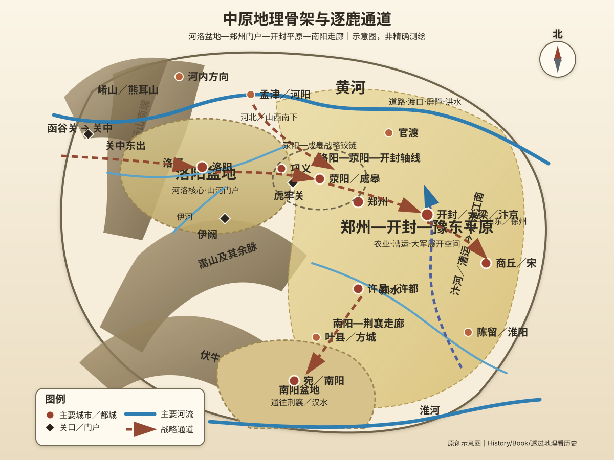
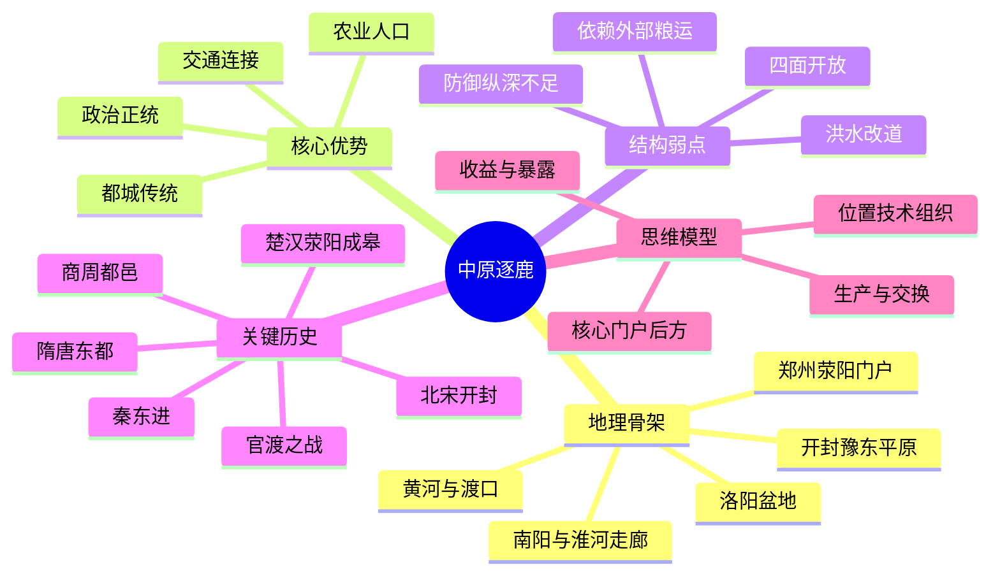

# 第六章　中原逐鹿，谁主沉浮

- **创建日期**：2026-07-24
- **状态**：初版，已配原创历史地理示意图与独立时间轴
- **关键词**：中原、河南、黄河、洛阳盆地、开封、郑州、嵩山、伏牛山、太行山、虎牢关、函谷关、荥阳、成皋、官渡、楚汉战争、北宋、漕运、黄河改道
- **章节性质**：原创历史地理学习指南，不是原书逐段复述

## 摘要

“中原逐鹿”常被理解为群雄争夺天下的文学表达，但它首先是一种政治地理现实。历史上的中原并不等于今天河南省，也不是边界永远固定的行政区。它的核心通常围绕黄河中下游、洛阳盆地、郑州—开封平原、豫北与豫东展开，并向关中、河北、山东、淮河流域和南阳盆地延伸。这里位于中国早期农业、城市和交通网络的交会处，能够汇集人口、粮食、道路与政治象征，因此常成为建立全国政权必须争夺的核心区。

然而，中原的优势与弱点来自同一套地理结构：平原广阔、道路四通八达，方便集结、运输和扩张，也让敌军容易进入；河流提供灌溉、航运和防线，也可能改道、决口并摧毁城市；洛阳较有山河屏障，却受盆地容量和外部粮运限制；开封贴近漕运与财富流动，却缺少足够天然防御。谁占据中原，并不等于谁必然统一天下；只有把核心区、外围关口、粮运网络和政治组织连接起来，地理优势才会转化为国家能力。

本章的核心结论是：

> 中原不是一块自动产生帝王的土地，而是一座高连接度、高收益、高暴露度的国家级枢纽；它能放大强者的组织能力，也会迅速放大弱者的制度缺陷。

---

## 一、先纠正六个常见误解

### 1. 中原不等于现代河南省

“中原”是一种随时代、语境和政治中心变化的历史地理概念。狭义上，它多指今天河南中北部及黄河、洛河、颍河沿线；广义上，则可能包括关中以东、太行山以南、淮河以北、山东以西的大片区域。现代河南是理解中原的核心入口，但不能把今天省界直接套到夏商周、秦汉或唐宋地图上。

阅读史书时，应区分至少四种含义：

| 含义 | 主要内容 | 阅读作用 |
|---|---|---|
| 自然地理 | 黄河中下游平原、洛阳盆地及周边山地河谷 | 解释农业、交通、洪水与军事路线 |
| 政治地理 | 王朝都城和中央政权控制的核心区 | 解释“入主中原”“问鼎中原” |
| 文化地理 | 礼制、文字、经典和正统叙事的中心 | 解释华夏认同如何扩展 |
| 战略概念 | 连接关中、河北、山东、江淮和荆襄的交通枢纽 | 解释群雄为何反复在此决战 |

### 2. “逐鹿”不是说真的追逐一头鹿

“鹿”在古代政治语言中可象征天下或帝位。“秦失其鹿，天下共逐之”所表达的是中央权力崩溃后，各方争夺最高政治权威。后世说“逐鹿中原”，强调的是：中原长期拥有政权合法性、人口资源、交通节点和都城传统，控制这里往往是争天下的重要阶段。

但象征不能取代分析。真正被争夺的不是抽象的“正统”，而是城市、仓储、渡口、粮道、关隘、人口与行政网络。

### 3. 中原不是毫无地形的平坦棋盘

中原核心区确有大面积平原，但其周围和内部仍有显著地形差异：

- 西部是崤山、熊耳山与伏牛山，连接函谷关、潼关和南阳盆地；
- 西北有太行山南端与黄河峡谷，控制山西高地进入河洛地区的道路；
- 中部嵩山及其余脉，把洛阳、郑州、许昌等方向分隔成若干走廊；
- 北面黄河既是屏障，也是渡河通道；
- 南面通过方城、叶县、南阳盆地连接荆襄；
- 东面地势逐渐开阔，通往开封、商丘、徐州、山东和淮北。

因此，中原战争不是单纯在平原上正面冲锋，而是围绕山口、河渡、城市、运河和粮道展开。

### 4. 黄河不是永远固定在同一条河道

黄河含沙量高，下游河床抬升，历史上频繁决口与改道。它既滋养农业，也不断改变聚落、道路、行政边界和军事环境。某一时代的黄河防线、渡口和城市位置，不能直接用今天河道解释。

在中原，治河本身就是国家能力的一部分。能否组织堤防、疏浚、赈灾、迁民和恢复生产，往往决定一个王朝能否把人口密集区长期维持为财政核心。

### 5. 占领洛阳或开封不等于已经控制中原

都城只是网络中的超级节点。真正的有效控制还需要：

- 稳定黄河渡口与东西道路；
- 掌握荥阳—成皋、虎牢关、函谷关等门户；
- 控制许昌、陈留、商丘、南阳等区域节点；
- 维持粮仓、漕运、驿站和地方行政；
- 阻止河北、关中、山东或荆襄方向的敌军切断外援。

历史上许多军队能够进入洛阳或开封，却无法长期维持统治，原因通常不在“是否进城”，而在“能否维持整个网络”。

### 6. 中原文明并不是封闭自生的单一文化

中原之所以成为早期文明核心，不是因为它与外界隔绝，而是因为它处于交流密集区。关中、晋南、山东、江汉、淮河、北方草原与东方海岱文化长期在此交会。人口迁徙、战争、婚姻、贸易与技术传播共同塑造了所谓“中原文化”。

“中心”不意味着纯粹；很多时候，中心恰恰是最频繁吸收外部资源与人口的地方。

---

## 二、中原的地理骨架：黄河、河洛与四向通道

### 1. 西部核心：洛阳盆地与河洛交会

洛阳位于伊河、洛河流域，北临黄河，周围有邙山、崤山、熊耳山和嵩山等地形。它不是完全封闭的盆地，却比开封平原拥有更多天然门槛。向西可经崤函通道进入关中，向东通过偃师、巩义、荥阳进入郑州—开封平原，向北可渡黄河联系河内与山西，向南经伊阙、汝州方向联系南阳和淮河上游。

洛阳的优势在于“居中而有门”：

1. 接近黄河与洛河水系，能够连接东西交通；
2. 周边山口使敌军路线相对集中；
3. 距关中、中原东部、河北和南阳都不算遥远；
4. 周、汉、魏晋、北魏、隋唐反复经营，使其积累了都城设施与政治象征。

它的弱点同样明显：盆地本地粮食和承载能力有限，大型都城必须依赖更广阔区域供给；一旦东方粮道或黄河渡口中断，防御优势可能转化为封闭压力。

### 2. 中部门户：郑州、荥阳、成皋与虎牢

洛阳向东进入广阔平原，并不是毫无门槛。嵩山北麓、黄河南岸与丘陵之间形成一条重要走廊，荥阳、成皋、虎牢关一线控制河洛盆地与开封平原之间的交通。

这一区域反复成为战场，是因为它同时承担三种功能：

- **洛阳东门**：东方军队若要进入河洛，通常要通过这一带；
- **关中东出的中继区**：从潼关、函谷关方向而来的军队，要在此进入大平原；
- **黄河渡运与粮仓区**：沿河仓储、渡口和道路可支持大军长期对峙。

楚汉战争中的荥阳—成皋争夺，不只是刘邦与项羽反复攻城，而是双方争夺关中粮源、黄河交通和东方战场之间的转换器。谁控制这里，谁就能决定关中的资源能否持续送到中原前线。

### 3. 东部平原：开封、陈留、商丘与四通八达的道路

郑州以东地势更加开阔，开封、陈留、商丘一线通向山东、徐州、淮北和江淮。平原有利于农业、道路、城市和大军展开；在运河体系成熟后，开封还能直接接收江淮和江南物资。

开封成为五代与北宋首都，关键不在它拥有强大山川屏障，而在它位于全国物流重组后的高连接节点：

- 向西联系洛阳、关中；
- 向北连接河北与边防；
- 向东联系山东和海岱；
- 向南沿汴河、蔡河等水运联系淮河、长江和江南。

这是一种“以运输代替险阻”的都城模式。它能降低财富进入首都的成本，却把国家安全高度依赖于军队、城防、黄河堤防和外线防御。一旦北方防线崩溃，开封周边平原缺少足够战略纵深，敌军可快速逼近都城。

### 4. 北部门槛：黄河、河内与太行山南口

黄河北岸的河内地区，大致对应今天河南北部和山西东南缘之间的联系地带。这里既是洛阳、郑州北面的屏障，也是河北、上党和晋南力量南下的跳板。

黄河并非不可逾越。孟津、河阳等渡口，以及季节性水位变化，使南北军队可以在特定节点集中渡河。守方若失去渡口与北岸桥头堡，黄河防线就可能迅速失效；进攻方若渡河后无法获得补给，也容易被压回河道。

因此，黄河的军事价值不是“有河就安全”，而是由渡口、桥梁、舟船、岸防、上游水势和周边城镇共同决定。

### 5. 南方走廊：许昌、颍川、方城与南阳盆地

中原南部并非直接进入江汉平原。伏牛山、桐柏山和大别山北缘把交通压缩到若干走廊，其中南阳盆地尤其关键。洛阳、许昌方向可经叶县、方城进入南阳，再沿汉水方向到襄阳；豫东和淮河流域则可沿颍水、汝水、淮河连接寿春、合肥和江淮。

这条南北轴线解释了许多历史事件：

- 曹操以许昌为政治中心，既可控制中原，又能面向荆州；
- 宛城、南阳常成为北方政权与荆襄势力的前线；
- 南北朝时期，淮河—颍水—南阳一线构成多层争夺带；
- 后世北方军队南下，往往必须在荆襄或淮河方向选择主要突破口。

### 6. 东南接口：淮河、颍水与江淮粮运

黄河流域与淮河流域并非彼此分离。颍河、汝河、涡河等水系把中原东南与淮北、寿春、徐州相连。随着经济重心南移，谁能把江淮和江南粮食运往中原，谁就更有能力维持大城市与常备军。

隋唐以后，中原的政治价值越来越依赖外部供给。洛阳和开封的兴盛，都与运河和漕运有关；中原不再只是“本地粮食养天下”，而是成为“全国资源在此汇流和再分配”的中心。

### 7. 原创地理示意图

> 下图强调方位、山河、城市、关口和交通轴线，是原创历史地理示意图，不是精确测绘地图。

从图中可以看到，中原不是孤立的中心圆点，而是一组由洛阳、郑州、开封、许昌、商丘、南阳及黄河渡口构成的交通网络。它的中心性来自连接，风险也来自连接。

---

## 三、为什么中原会成为早期国家与王朝竞争的核心

### 1. 农业、人口与城市可以在较近距离内集中

黄河、洛河、伊河、颍河等河流及其冲积平原，为粟、黍、小麦等农业提供条件。农业剩余能够支持手工业者、贵族、军队和行政人员，城市与政治权力因此更容易集中。

但必须避免一种过度简化：早期国家并不是只在最肥沃的地方出现。政治中心还需要交通、联盟、军事动员、礼仪和资源交换。中原的重要性来自多种条件叠加，而不是单一土壤优势。

### 2. 早期都邑形成了强大的路径依赖

偃师、二里头、郑州商城、安阳殷墟、洛阳周王城等遗址与都邑，说明这一地区长期积累政治中心、礼制、工匠和交通网络。关于二里头文化与夏王朝的对应关系，学界仍有讨论，不能把考古文化与文献王朝简单画等号；但可以确定的是，河洛—豫西地区在青铜时代已是高度复杂社会的重要中心。

一旦都邑形成，后续政权可以继承道路、聚落、手工业和象征资源。于是“中心”会通过历史积累进一步强化，而不只是自然地理的直接结果。

### 3. 中原连接多个竞争性区域

关中、晋南、河北、山东、江汉、淮河流域都可能形成独立力量。中原位于这些区域之间，既可吸收四方资源，也会成为它们冲突的交汇点。一个地方政权若想扩大为全国政权，通常需要解决两道问题：

1. 能否控制中原核心网络；
2. 能否继续控制一个安全后方，为中原前线提供兵员与粮食。

只有第一项而没有第二项，容易成为“占据中心却无纵深”的脆弱政权；只有第二项而不进入中原，则可能长期停留在区域割据。

### 4. 政治正统与地理中心相互强化

周王室经营洛邑后，河洛地区获得“天下之中”的政治象征。后世政权进入洛阳、举行礼仪、控制旧都，往往借此宣示正统。文化记忆提高了中原的政治价值，而政权反复建设又继续强化文化记忆。

这不是单纯的精神因素。正统叙事可以帮助政权吸引士人、整合官僚、说服地方势力和降低统治成本，因此也是一种现实政治资源。

---

## 四、历史背景：从“天下之中”到全国性枢纽

### 1. 商周时期：都邑沿黄河与河洛网络移动

商代政治中心多次迁移，晚期都城在殷，即今天安阳附近。安阳位于太行山东麓与华北平原交界，可联系河北、山西、山东和河南。西周建立后，以关中为核心，同时经营成周洛邑，使王朝拥有东西两套中心：关中提供相对安全的军事根基，洛邑更接近东方诸侯与交通网络。

公元前770年周平王东迁洛邑，标志政治中心进一步东移。东周王室实力逐渐下降，但洛阳的礼制与正统象征长期存在，各诸侯国争夺的已不只是土地，还包括对“天下秩序”的解释权。

### 2. 春秋战国：中原从王畿变成多国竞争场

郑、宋、卫、韩、魏等诸侯国分布在中原及其周边。它们所处位置交通便利，却缺少强大纵深，经常受到多方向压力。魏国早期在河东和中原之间崛起，迁都大梁后更靠近东方平原与水运，但也更暴露于秦、齐、楚等多方攻击。

战国后期，秦国依托关中安全核心逐步向东推进。函谷关—洛阳—荥阳—大梁构成秦东进的主要轴线。秦统一说明：争夺中原最有效的方式，往往不是一开始就把都城放在中原，而是先拥有一个可长期动员的外围基地，再逐步夺取中心网络。

### 3. 秦末楚汉：荥阳—成皋成为天下的铰链

秦朝崩溃后，项羽拥有强大战场威望和东方资源，刘邦则占有关中。楚汉战争长期在荥阳、成皋、广武等地反复拉锯，因为这里是关中粮运进入中原的出口，也是东方军队阻止刘邦扩张的门槛。

刘邦能够最终取胜，不只是某场战役的结果，而是几套地理与组织优势叠加：

- 关中提供稳定后方和粮食；
- 萧何维持行政与补给；
- 荥阳—成皋前线牵制项羽；
- 韩信在河北、山东开辟侧翼；
- 彭越在梁地破坏楚军后勤；
- 多方向战场使项羽难以集中优势。

“逐鹿中原”的胜负，最终取决于谁能把中原与更广阔的后方和盟友网络连接起来。

### 4. 东汉末年：许昌、官渡与中原再统一

东汉末年，洛阳、长安先后遭受战乱，曹操迎汉献帝都许，使许昌获得政治中心地位。许昌位于颍川地区，向北可联系黄河和河北，向东通兖州、徐州，向南面向南阳与荆州，既便于控制中原，又较适合曹操当时的军事格局。

官渡之战发生在黄河南岸、中原与河北连接处。曹操战胜袁绍，关键不仅是奇袭乌巢，还包括后勤、情报、内部组织和战场位置。袁绍拥有河北人口与资源，却必须跨越黄河向南投送；曹操兵力相对较少，但在本方核心区附近作战，并能利用据点、粮道和集中决策。官渡之后，曹操逐步控制河北，为北方统一奠定基础。

### 5. 魏晋南北朝：洛阳的象征与现实反复分离

曹魏、西晋以洛阳为都，继续利用河洛的中心位置。永嘉之乱后，北方长期分裂，洛阳多次遭受战争破坏。北魏孝文帝迁都洛阳，则体现另一个机制：一个起源于北方边疆的政权，通过进入中原旧都、采用汉地制度和礼仪，加强对广大农业区的统治。

但迁都也增加了政治集团内部矛盾，并使北魏更深地卷入中原土地、豪强和财政体系。都城改变可以重塑国家，却不能自动解决军事与社会问题。

### 6. 隋唐：洛阳成为东都与漕运枢纽

隋唐政治根基仍与关中密切相关，但关中难以单独供养庞大都城。洛阳靠近人口和粮食更丰富的东方，并通过大运河连接江淮。隋炀帝经营东都洛阳与运河，唐代皇帝也多次驻跸洛阳，背后是粮运和全国控制的现实需要。

长安与洛阳形成东西双中心：长安拥有政治传统和西北战略优势，洛阳则更接近东方财政与漕运。王朝越庞大，首都选择越不能只看防御，还必须看粮食如何进入。

### 7. 五代北宋：开封成为运输型首都

唐末以后，政治与军事中心进一步东移。五代多朝以开封为都，北宋继续定都东京开封。开封处于大平原，没有洛阳那样的山河围护，却通过汴河等水道连接江淮、江南和全国商业网络。

北宋选择开封，是对经济重心东南移动的适应。它降低了漕粮运输成本，也使首都接近商业和人口中心；代价是北方边防一旦失守，敌军可以较快抵达都城。1127年靖康之变说明，开放型首都需要强大外线防御、常备军和政治决策能力。城墙可以延缓进攻，却不能替代整个国防体系。

### 8. 黄河改道与经济重心南移：中原地位改变但没有消失

宋以后，中国经济核心更多转向江南和东南沿海，中原不再拥有早期那种压倒性经济地位。黄河长期决口、改道和战争破坏，也削弱部分地区的农业与城市稳定。

然而，中原仍然控制全国南北、东西交通。现代铁路和公路进一步强化郑州等城市的枢纽地位，说明交通技术会改变节点，却不会完全消除地理位置的价值。古代的渡口、驿道和运河，转化为铁路、高速公路、航空和物流中心。

---

## 五、关键事件时间轴

完整时间轴见：[中原历史地理时间轴](../Timeline/Chapter06_中原历史地理时间轴.md)。

| 时间 | 事件 | 地理意义 |
|---|---|---|
| 约公元前二千纪 | 河洛与郑州、安阳一带出现大型都邑和复杂社会 | 中原形成早期政治、手工业和交通中心 |
| 约公元前1300年后 | 商晚期都城位于殷 | 太行山东麓—华北平原交界成为王朝核心 |
| 西周时期 | 周经营成周洛邑 | 建立关中—洛阳东西双中心 |
| 前770年 | 周平王东迁洛邑 | 河洛政治象征进一步加强 |
| 战国时期 | 魏迁都大梁，秦持续东进 | 中原平原与崤函通道成为多国竞争轴线 |
| 前206—前202年 | 楚汉战争，荥阳—成皋长期争夺 | 关中粮运与东方战场的铰链决定战争持续力 |
| 196年 | 曹操迎汉献帝都许 | 许昌成为控制中原并面向四方的政治节点 |
| 200年 | 官渡之战 | 黄河南北资源体系在中原门户决战 |
| 494年 | 北魏迁都洛阳 | 边疆政权通过中原旧都整合农业帝国 |
| 605年前后 | 隋营建东都并发展运河体系 | 洛阳与江淮粮运联系显著加强 |
| 907—960年 | 五代多以开封为都 | 全国政治中心向大平原和运输网络东移 |
| 960年 | 北宋定都东京开封 | 运输效率压过天然险阻，形成开放型首都 |
| 1127年 | 靖康之变 | 外线防御崩溃后，平原首都暴露性集中显现 |
| 1194年后 | 黄河长期南徙并影响淮河水系 | 河道变化重塑农业、交通和地方治理 |
| 1855年 | 黄河在铜瓦厢决口后改走北道 | 近代中原水系、聚落与治理再次重组 |
| 20世纪初 | 京汉、陇海铁路在郑州交会 | 古代道路中心转化为现代铁路枢纽 |

---

## 六、本章主题所要引导的作者视角

围绕“中原逐鹿，谁主沉浮”这一章题，可以提炼出三个主要观察角度。这里是对主题的结构化解读，不是对原书段落的逐字转述。

### 1. 中国历史上的中心，是地理网络中的中心

中原之所以被称为“中”，不是因为古人完成了现代测绘后找到几何中心，而是因为这里连接多个重要区域，并长期聚集政治、人口、交通与文化资源。所谓中心，是关系网络中的中心。

### 2. 争天下必须争中原，但只争中原仍然不够

中原可以带来政治象征和交通优势，却缺少足够安全边界。成功的统一者通常另有稳固后方：周、秦依靠关中，刘邦依靠关中与多战区联盟，曹操先稳定兖豫再夺河北，北魏依靠北方军政基础，北宋则依靠全国漕运和中央军队。

### 3. 地理优势会随技术和经济重心变化

早期中原依靠本地农业和道路成为中心；隋唐以后，运河与江南粮食提高洛阳、开封的价值；近代铁路使郑州成为新枢纽。地点没有移动，但“为什么重要”不断变化。

---

## 七、五组关键历史案例：地理怎样改变胜负

### 案例一：秦为什么从关中夺取中原，而不是把首都先迁到中原

关中外围关隘较多，适合长期积累；中原人口和财富更密集，却四面开放。秦的策略是把关中作为安全核心，通过函谷关不断向东推进，逐步夺取河东、河洛和东方平原。

这说明一个常见战略规律：**争夺高价值中心之前，需要先有能够承受失败和持续补给的后方。**若一开始就把全部资源暴露在中原多向战场，政权很难长期承受联盟围攻。

### 案例二：楚汉战争为什么反复围绕荥阳、成皋

项羽的优势是战场冲击力与东方威望，刘邦的优势是关中后方与组织体系。荥阳—成皋位于两套系统之间：向西接关中，向东进入梁楚，北临黄河，附近有粮仓和道路。

刘邦即使多次战败，只要关中粮运与人员补充未被彻底切断，就能恢复战线；项羽即使多次取胜，若无法摧毁刘邦后方，又要应对韩信、彭越等侧翼，就难以把局部胜利转化为战争终局。

### 案例三：官渡为何是河北与中原的系统对决

袁绍从河北南下，必须跨越黄河并维持长距离补给；曹操在中原北缘防守，兵力较少，却有较短内部线路。乌巢被袭是战役转折点，但之所以具有决定性，是因为大军集中在黄河南岸后，对粮食高度依赖。

这说明：**决定战役的“关键点”往往是整个系统最脆弱的连接点。**没有跨河投送与仓储压力，乌巢不会拥有同样价值。

### 案例四：洛阳与开封代表两种不同的首都模型

| 模型 | 洛阳 | 开封 |
|---|---|---|
| 地形 | 盆地与山河门槛较多 | 大平原，天然屏障较少 |
| 交通 | 东西交通与黄河渡口枢纽 | 运河、河道与平原道路枢纽 |
| 供给 | 本地有限，依赖东方和运河 | 接近漕运主轴，供给效率较高 |
| 防御 | 可依托关口争取时间 | 高度依赖外线军队和城防 |
| 政治意义 | 周汉魏晋隋唐旧都象征强 | 五代北宋商业与行政中心 |

洛阳强调“居中而有险”，开封强调“居中而易运”。两者没有绝对优劣，选择取决于国家的经济重心、敌人方向、运输技术和军队结构。

### 案例五：郑州为何在近代重新成为超级枢纽

古代郑州—荥阳地区本就是河洛与东部平原的过渡节点。近代京汉铁路南北贯通，陇海铁路东西延伸，两线在郑州交会，使传统地理中心被铁路技术重新激活。

现代枢纽不再依赖驿马和河渡，而依赖铁路编组、高速公路、航空、仓储和数据系统。技术改变了运输速度，却延续了“连接四方”的结构优势。

---

## 八、中原的战略悖论：得之重要，守之艰难

### 1. 中心性提高资源获取，也提高受攻击概率

网络中心能够获得更多人口、市场和信息，但每条连接也可能成为敌人进入的路线。中原西接关中、北连河北、东通山东、南达荆襄与江淮，多方向机动能力强，也必须同时面对多方向威胁。

### 2. 平原适合国家扩张，也适合敌军快速推进

大型农业平原能供养军队，并提供宽阔道路；同样的条件也让骑兵、步兵和车辆更容易行动。缺乏山地门槛时，防御必须依赖城池群、河流、野战军和快速通信。

### 3. 河流降低运输成本，也制造灾害和治理负担

黄河、汴河和淮河水系能运输粮食，却需要持续疏浚、修堤和管理。水利失效可能同时引发饥荒、财政危机、人口迁移和军事防线崩溃。

### 4. 都城越大，对外部系统依赖越深

大型都城无法只靠城郊供养。洛阳依赖关东和江淮，开封依赖漕运，现代大城市依赖全国乃至全球供应链。首都繁荣本身会提高系统复杂度，也会创造新的脆弱点。

---

## 九、中原怎样影响中国历史的长期结构

### 1. 塑造了“统一必须控制核心区”的政治想象

从周秦到汉唐，进入中原、控制洛阳或开封往往被视为建立全国政权的重要标志。这种历史经验形成强大政治语言：“问鼎”“入主”“逐鹿”都把天下权力与中心地区连接起来。

### 2. 推动中国形成多中心互补的统一模式

长期稳定的王朝很少只依赖中原一地。关中提供西部安全核心，河北提供北方人口与边防，山东和江淮提供农业与交通，江南后来成为财政重心。统一帝国的本质，不是让一个地区替代所有地区，而是把多个区域系统连接起来。

### 3. 促成首都从防御型向运输型转变

早期都城更重视山河与近距离农业；隋唐以后，人口规模和经济重心变化使漕运越来越重要；北宋开封把这种趋势推到高峰。首都选择由“哪里最容易守”转向“哪里最容易组织全国资源”，但安全代价也随之上升。

### 4. 黄河治理成为中央政府合法性与能力的试金石

黄河决口会影响数省人口和财政。治河需要跨地区征调、工程知识、长期预算与地方协调，任何一项不足都可能使灾害扩大。中原的水患因此不只是自然问题，而是国家治理问题。

### 5. 战乱与人口迁移推动经济文化重心变化

中原频繁战争促使人口多次南迁。魏晋南北朝、唐末五代、两宋之际的迁徙，把人口、技术和文化带向江南。中原的开放性既帮助其成为文明中心，也使它在战争中更容易遭受破坏，从而间接推动全国区域格局变化。

---

## 十、古今地名对照

古代地名的范围和位置随时代变化，下表用于建立大致对应关系，不可替代专业历史地图。

| 历史名称 | 大致现代位置 | 历史作用 |
|---|---|---|
| 洛邑、雒阳、洛阳 | 河南洛阳 | 周王城及多朝都城，河洛核心 |
| 成周 | 洛阳及周边，具体范围依时代而异 | 西周经营东方的政治中心 |
| 虎牢、成皋 | 河南荥阳、汜水一带 | 洛阳东部门户与楚汉争夺区 |
| 荥阳 | 河南郑州西部荥阳 | 黄河南岸交通与仓储节点 |
| 广武 | 河南荥阳黄河附近 | 楚汉长期对峙地带 |
| 大梁、东京、汴京 | 河南开封 | 魏都、五代及北宋首都 |
| 陈留 | 河南开封东南一带 | 豫东交通和军政节点 |
| 商丘、宋国都城区域 | 河南商丘及周边 | 连接山东、徐州与淮北 |
| 许、许都 | 河南许昌 | 东汉末曹操政治中心 |
| 颍川 | 河南中部，以许昌、禹州等地为核心 | 人口、士族与南北交通区 |
| 官渡 | 河南中牟东北附近，具体战区范围较广 | 曹袁决战及黄河门户 |
| 河内 | 黄河北岸今河南北部一带，范围随时代变化 | 洛阳北部屏障与山西通道 |
| 孟津 | 河南洛阳北部黄河沿岸 | 重要渡口与军事节点 |
| 伊阙 | 河南洛阳南部龙门一带 | 洛阳南部门户 |
| 宛、南阳 | 河南南阳 | 中原通向荆襄的重要盆地 |
| 寿春 | 安徽寿县 | 中原东南与江淮之间的战略节点 |
| 邺 | 河北临漳、河南安阳北部附近 | 中原—河北交界的重要都城与军镇 |

---

## 十一、现代启示：从中原理解网络中心、基础设施与系统风险

### 1. 地理中心不如网络中心重要

现代企业或城市的价值，不一定来自几何位置，而来自能连接多少市场、人才、运输线路和信息流。郑州、芝加哥、新加坡等枢纽的共同点，是在网络中承担交换和转运功能。

### 2. 高连接系统必须设计冗余

中原历史反复显示，中心节点一旦被切断，影响会迅速扩散。现代铁路枢纽、云计算区域、支付清算中心和大型仓储网络，都需要备用路线、异地容灾、分布式库存和明确的故障隔离。

### 3. 供应链效率与安全存在张力

开封靠近漕运，效率高但防御弱；洛阳相对易守，却有供给压力。现代选址同样要平衡：靠近客户和交通中心可以降低成本，但也可能增加灾害、地缘或单点故障风险。

### 4. 基础设施维护比一次性建设更重要

黄河堤防、运河和粮仓都不是建成后永久有效。软件平台、桥梁、电网和数据中心同样需要持续维护。系统崩溃往往不是没有建设，而是长期忽视维护、监测和责任边界。

### 5. 文化中心需要开放吸收，而不是制造纯粹神话

中原文明是在交流与迁徙中形成的。现代组织若把“核心文化”理解为拒绝外部影响，容易失去创新；真正有生命力的中心，通常能够吸收不同人才与方法，同时维持基本制度秩序。

### 6. 政治或商业上的“抢中心”不能替代基本能力

占领流量入口、购买热门品牌、进入首都市场，类似古代“进入洛阳”。它能提高可见度，却不能替代产品、现金流、组织和供应链。中心位置只会放大已有能力，不会自动创造能力。

---

## 十二、本章思维模型

### 模型一：核心—门户—后方

分析一个政权能否控制中原，应同时检查：

1. **核心**：洛阳、郑州、开封、许昌等城市和人口区；
2. **门户**：函谷关、虎牢、黄河渡口、官渡、南阳走廊；
3. **后方**：关中、河北、山东、江淮或荆襄等持续供给区。

只占核心而没有门户与后方，统治通常难以持久。

### 模型二：生产中心与交换中心

中原早期更多依靠本地农业与人口，唐宋以后越来越依靠全国资源交换。判断一个地区的重要性时，要问：它是自己生产最多，还是最能组织别人生产的资源？

### 模型三：中心性收益与暴露成本

连接越多，机会越多；连接越多，攻击面也越大。现代网络安全、平台经济和供应链都适用这一模型。

### 模型四：地理价值＝位置 × 技术 × 组织

同一地点在不同时代价值不同：

- 渡口时代看河道与驿路；
- 运河时代看水运与粮仓；
- 铁路时代看交会站与编组能力；
- 数字时代还要看通信、算力和数据网络。

位置是基础，技术改变连接方式，组织决定能否利用连接。

---

## 十三、Mermaid 思维导图

---

## 十四、如果我是当时的统治者：怎样经营中原

### 情境一：我拥有中原，但没有稳固后方

首要任务不是立即四面扩张，而是选择一个方向建立可靠供给区，并控制黄河渡口、荥阳—虎牢与南阳等门户。中原军队应保留机动预备队，避免兵力平均分散到所有方向。

### 情境二：我从关中向东争天下

应先稳住崤函通道和河东侧翼，再争洛阳、荥阳与黄河渡口；进入大平原后，必须建立仓储和地方行政，不能只依赖快速追击。楚汉战争说明，关中粮运能否持续比一次大会战更重要。

### 情境三：我以开封为首都

需要构建多层外线防御：河北前线、黄河渡口、京畿城防与快速增援缺一不可；同时应建立备用漕运和粮仓，防止河道、战争或灾害造成单点中断。

### 情境四：我面对黄河长期水患

不能只在决口后临时征发。需要常设河务机构、跨地区预算、测量与巡查、分洪空间、灾民安置和责任追踪。治河是长期系统工程，而非一次性英雄项目。

---

## 十五、五分钟复习

1. 中原是历史地理与政治文化概念，不等于现代河南省。
2. 核心区域围绕黄河中下游、洛阳盆地、郑州—开封平原及周边展开。
3. 洛阳代表“居中而有门”的盆地型都城，开封代表“居中而易运”的平原运输型都城。
4. 荥阳—成皋—虎牢是关中、洛阳与东方平原之间的战略铰链。
5. 黄河既是农业和交通资源，也是频繁改道的治理风险。
6. 秦、刘邦等成功者通常先拥有稳固后方，再进入中原争天下。
7. 楚汉战争说明持续补给和多战区协同比单次胜负更重要。
8. 官渡之战是河北资源体系与中原防御体系的对决，粮道是关键脆弱点。
9. 隋唐洛阳与北宋开封的兴盛，反映经济重心南移和漕运价值上升。
10. 中原的本质是高连接、高收益、高暴露的国家级枢纽。

---

## 十六、思考题

1. 如果秦国没有关中这个安全后方，仅控制洛阳和郑州一带，是否仍有可能统一六国？
2. 刘邦在荥阳多次失利却能恢复，项羽多次取胜却无法结束战争，说明“战斗力”和“战争能力”有什么区别？
3. 洛阳与开封哪一个更适合作为统一王朝首都？答案如何随时代变化？
4. 北宋定都开封是错误选择，还是在当时经济与政治条件下的合理权衡？
5. 黄河改道如何改变城市、行政边界、军事路线和地方社会？
6. 郑州的现代枢纽地位，是古代中原优势的延续，还是铁路时代创造的新现象？
7. 今天哪些数字平台、物流中心或金融系统具有类似中原的“高连接、高暴露”特征？

---

## 十七、参考资料与延伸阅读

### 原始史料

1. 司马迁：《史记·周本纪》《项羽本纪》《高祖本纪》《魏世家》。
2. 班固：《汉书·地理志》《高帝纪》。
3. 陈寿：《三国志·魏书·武帝纪》《袁绍传》。
4. 司马光：《资治通鉴》，秦汉、汉末、隋唐、五代相关卷。
5. 郦道元：《水经注·河水》《洛水》《汴水》。
6. 《尚书》《左传》《战国策》中关于洛邑、河洛及诸侯战争的相关记载。

### 历史地理与考古

1. 谭其骧主编：《中国历史地图集》。
2. 邹逸麟：《中国历史地理概述》。
3. 史念海：《中国历史地理纲要》及相关论文。
4. 李伯重等关于中国经济重心南移、运河与区域经济的研究。
5. 中国社会科学院考古研究所关于二里头、郑州商城、殷墟和汉魏洛阳城的考古报告与普及资料。
6. 河南省文物考古研究院及洛阳、郑州、开封相关博物馆资料。

### 阅读提示

- 二里头文化与夏王朝的对应关系应区分“考古事实”与“文献解释”。
- 古代黄河河道变化巨大，研究具体战役时必须使用对应年代的历史地图。
- “中原文化”是长期交流与政治建构的结果，不宜当作静态、单一或排他的文化实体。
- 战役数字和路线在不同史料中可能存在差异，学习时应优先把握宏观地理结构，再比较具体记载。

---

## 本章结语

中原之所以被天下争夺，并不是因为它拥有一种神秘的“帝王气”，而是因为它把黄河、河洛盆地、华北平原、关中出口、河北门户、山东道路、南阳走廊和江淮水运连接成一个高密度网络。这里能够集中人口、粮食、城市、交通与政治象征，使控制者拥有向四方扩张的机会。

但中原从来不是安全的奖杯。平原让资源流入，也让敌军进入；黄河提供生命，也带来灾害；都城带来正统，也成为攻击目标。真正的胜者不是最先进入中心的人，而是能把中心、门户、后方、粮运和行政长期组织在一起的人。

所以，本章最值得保留的一句话是：

> 天下之中不是一张王座，而是一套必须持续维护的连接系统；谁能组织这套系统，谁才可能决定沉浮。