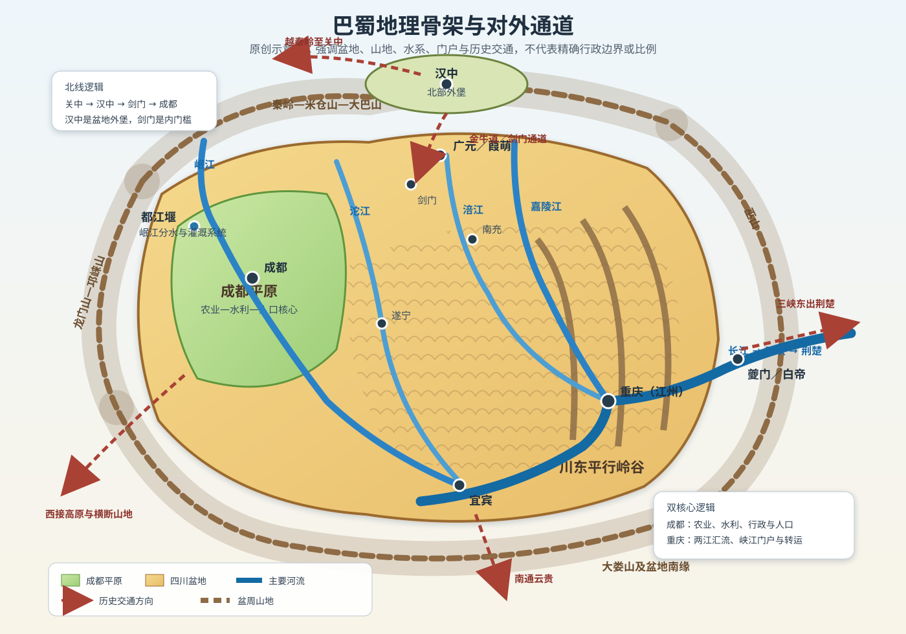
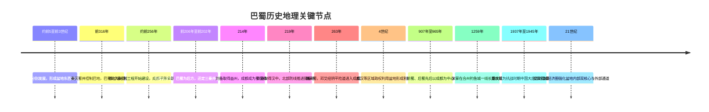
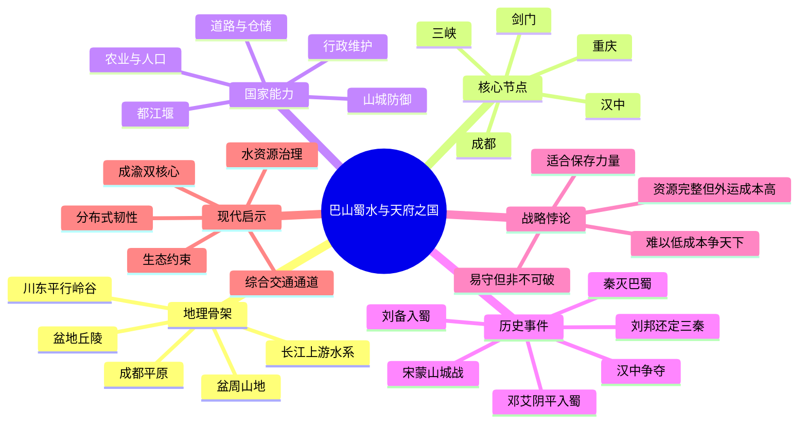

# 第七章　巴山蜀水，天府之国

- **创建日期**：2026-07-25
- **状态**：初版，已配原创历史地理示意图与独立时间轴
- **关键词**：巴蜀、四川盆地、成都平原、重庆、岷江、嘉陵江、长江、都江堰、剑门关、汉中、三峡、秦灭巴蜀、蜀汉、阴平道、钓鱼城、成渝双城经济圈
- **章节性质**：围绕原书章节主题展开的原创历史地理学习指南，不逐段复述原书

## 摘要

“天府之国”常被理解为四川盆地天然富饶、易守难攻，仿佛只要进入盆地便可长期安定。真实历史更复杂。四川盆地确实拥有山地环绕、气候温暖湿润、水系密集、农业潜力较高和内部纵深较大的优势，但这些条件不会自动转化为粮食、财政与军事能力。成都平原之所以成为稳定的农业核心，与岷江冲积地貌、长期水利建设、行政组织和人口开发密切相关；川东丘陵与平行岭谷则形成另一套以河流、峡谷、盐业、交通和重庆为中心的区域结构。

巴蜀既能成为乱世中的避难所和割据基地，也能成为全国性政权的资源后方。秦取得巴蜀后，获得粮食、兵员与向楚国上游施压的通道；刘备进入益州后，得到建立蜀汉的核心腹地；然而蜀汉也因北面依赖汉中、东面受三峡约束、对外通道有限而承受高昂的战略投送成本。邓艾由阴平险道突入成都平原，更说明“山河之险”必须由情报、守军、道路控制和政治组织共同维护。

本章的核心结论是：

> 巴蜀的优势不是简单的“封闭”，而是内部资源较完整、外部入口较集中；它适合保存力量，却不容易低成本地向全国持续投射力量。

---

## 一、先纠正七个常见误解

### 1. 巴和蜀不是同一个古国

“巴蜀”今天常作为四川、重庆及其文化区域的合称，但先秦时期的巴与蜀具有不同的政治中心、地理基础和文化传统。

- **蜀**的核心更偏向成都平原和盆地西部，依托岷江水系与平原农业；
- **巴**的活动范围更偏向盆地东部、嘉陵江—长江沿线及峡江地区，政治中心曾多次移动；
- 两者之间既有贸易与文化交流，也长期存在竞争和战争。

秦在前316年先后灭蜀、巴之后，才把两个区域纳入同一帝国体系。阅读“巴蜀史”时，不能把后世四川省或重庆市的边界倒推到先秦。

### 2. 四川盆地不等于四川省

现代四川省西部包括川西高原、高山峡谷和横断山地，地貌与东部盆地差异很大。历史上所谓“蜀地”“益州”或“巴蜀”，范围也会随行政区划和军事形势变化。

本章重点讨论的是：

1. 四川盆地及其盆周山地；
2. 成都平原与盆地中部丘陵；
3. 川东平行岭谷和长江上游峡江；
4. 与汉中、关中、荆楚、云贵相连的主要通道。

### 3. “天府”不是说这里完全不缺粮

四川盆地农业条件较好，但大型政权仍可能遭遇水旱灾害、战争破坏、人口失衡、运输不畅和财政紧张。成都平原的高产能力尤其依赖水利系统维护，而不是仅靠自然降水。

“天府”更准确的含义是：在有效治理条件下，这里能形成相对完整的农业、人口、手工业和城市体系，并在外部战乱时保持较强恢复能力。

### 4. “蜀道难”不等于任何军队都进不来

北面秦岭、大巴山和米仓山确实限制大军行动，剑门、金牛道、褒斜道、陈仓道、子午道、阴平道等通道也各有险阻。但险要只能提高进攻成本，不能让入口消失。

历史上巴蜀多次被攻入，常见原因包括：

- 守方把兵力集中在传统大道，却忽略次要路线；
- 外围屏障如汉中、剑阁先失守；
- 内部政治分裂，地方守军缺乏统一指挥；
- 进攻者通过水路、山路或内部响应突破防线；
- 都城与边关之间信息和增援速度不足。

### 5. 成都不是整个巴蜀唯一的战略中心

成都代表盆地西部的农业、人口与政治核心；重庆及古代江州、渝州一带，则控制嘉陵江汇入长江的水陆转换和三峡西口方向。两者长期承担不同功能：

| 区域中心 | 主要优势 | 主要功能 |
|---|---|---|
| 成都平原 | 平原农业、水利、人口、行政空间 | 盆地内部政治与财政核心 |
| 重庆—江州 | 山城、两江汇流、峡江门户 | 东向交通、军事防御、商业转运 |
| 汉中 | 汉水谷地、秦岭南侧 | 北部门户与盆地外堡 |
| 剑阁—广元 | 山谷收束、蜀道节点 | 从汉中进入成都平原的门槛 |

### 6. 汉中不是成都平原的一部分，却常决定成都安全

汉中位于秦岭与大巴山之间，地理上更接近一个独立盆地。它向北可通过秦岭诸道联系关中，向南可经金牛道、米仓道进入四川盆地。

因此，汉中常是巴蜀的“北部外堡”：

- 巴蜀政权控制汉中，可把防线推到秦岭；
- 北方政权控制汉中，则能在盆地北门集结物资和兵力；
- 汉中失守后，剑门与蜀道压力会显著上升。

### 7. 盆地封闭不等于文化封闭

巴蜀通过长江、嘉陵江、岷江、汉中道路、南方山谷和茶马交通长期联系外部。三星堆、金沙等考古发现也提醒我们，古蜀文明有自身传统，同时吸收了多方向文化影响。

山地降低交流速度，却没有阻止人口、技术、宗教、商品和制度传播。巴蜀文化的特点不是“与世隔绝”，而是在相对独立的内部空间中不断重组外来因素。

---

## 二、巴蜀的地理骨架：盆地、平原、丘陵、峡江与四面山口

### 1. 盆地外缘：一道不完整但强大的山地环带

四川盆地周围由多组山地围合：北面有秦岭南缘、米仓山和大巴山，东面有巫山，南面有大娄山等山地，西北和西面连接龙门山、邛崃山及青藏高原东缘。

这些山地的战略意义不是形成一堵连续城墙，而是把大规模交通压缩到少数河谷和山口。守方可在节点集中兵力，进攻方则必须处理狭窄道路、季节气候、粮食运输和前后队伍脱节。

但山地环带并不均匀。东部有长江三峡水道，北部存在多条蜀道，南部可通云贵，西部也有通向高原和横断山区的走廊。巴蜀是“入口有限”，不是“没有入口”。

### 2. 成都平原：岷江冲积扇上的核心腹地

成都平原位于盆地西部，接近青藏高原向盆地下降的地形转换带。岷江从高山进入平原后，河流坡度、泥沙与水量发生变化，既带来灌溉条件，也带来洪水和河道摆动风险。

都江堰水利系统通过分水、排沙、泄洪和引水，把不稳定的山地河流转化为可持续利用的灌溉网络。它最重要的意义不是一项孤立工程，而是形成了“工程—渠道—农田—聚落—行政维护”的长期系统。

因此，成都平原的富庶可写成一个公式：

> 冲积平原潜力 ＋ 岷江水源 ＋ 水利工程 ＋ 长期维护 ＋ 稳定人口 = 高生产能力

任何一项失效，都可能削弱“天府”优势。

### 3. 盆地中部：紫色丘陵不是空白地带

四川盆地中部广泛分布丘陵。这里不像成都平原那样平坦连片，陆路往往绕行，聚落和耕地较分散，但并非边缘区域。

丘陵区连接成都、资中、内江、遂宁、南充等方向，河谷与驿路共同构成盆地内部交通网。它能够提供农业、盐业、手工业和人口，也能在战争中成为迟滞区：军队可前进，却难以像在大平原上快速展开和集中补给。

### 4. 川东平行岭谷：重庆周边的“褶皱走廊”

盆地东部并非开阔平原，而是由多条东北—西南走向的山岭和谷地组成。华蓥山、铜锣山、明月山等平行岭谷，使陆路交通呈现明显的通道化特征。

重庆位于长江与嘉陵江交汇区域，周边地势起伏，城市空间与码头、山脊和河谷紧密相连。它不以大片平原见长，却能够控制：

- 嘉陵江进入长江的节点；
- 成都方向与三峡方向的中继；
- 川东、川北、黔北之间的交通；
- 长江上游水运与军事船队集结。

这解释了为什么重庆在历史上常成为军事重镇和区域交通中心，而成都更常成为盆地政权的行政首都。

### 5. 向心水系：内部连接与东向出口

四川盆地内多条河流大体从北部、西部流向盆地南部和东部，汇入长江：

- 岷江联系成都平原和宜宾方向；
- 沱江穿过盆地中部；
- 涪江、嘉陵江连接川北与重庆；
- 长江干流把宜宾、泸州、重庆、涪陵、万州和三峡串联起来。

水运在古代比陆路更适合运输大宗粮食和物资，但上游河道滩险、季节水位和峡谷同样增加风险。河流既是低成本通道，也是需要船只、码头、纤道、仓储和水军配合的复杂基础设施。

### 6. 北向通道：汉中—剑门—成都

从关中向南，通常需要先跨越秦岭进入汉中，再越过大巴山或米仓山进入四川盆地。广元、剑门关、葭萌一线是传统北部通道的重要节点。

剑门之险来自山岭收束道路，使大军难以展开。但真正的防御体系不只是剑门一关，还包括：

1. 汉中的前沿屏障；
2. 蜀道沿线驿站、栈道和粮仓；
3. 广元—剑阁—绵阳之间的纵深；
4. 成都方向的机动预备力量。

只守一座关而失去整个网络，仍可能被绕过或孤立。

### 7. 东向通道：重庆—夔门—三峡—荆楚

长江穿过巫山形成三峡，连接四川盆地与长江中游。峡江道路狭窄、水流复杂，但它是巴蜀最重要的东向水路。

控制三峡西口、夔门、白帝城和沿江城镇，可影响巴蜀与荆州之间的联系。刘备东征必须沿这一轴线推进；历代中央政权进入四川，也常同时考虑峡江水路与北方蜀道。

### 8. 南向与西向：不是主轴，却影响资源和边疆

南部道路可联系黔北、滇东北和长江上游；西部则通往高原、藏羌地区与横断山地。盐、茶、马匹、药材、金属和人口流动，使巴蜀从来不是只面向中原的单向区域。

这些方向不一定适合大规模中央军队快速行动，却长期影响边疆治理、民族互动和区域贸易。

### 9. 原创地理示意图

> 下图强调地形、河流、节点和通道，是原创历史地理示意图，不是精确测绘地图。

---

## 三、从巴蜀到“天府”：自然潜力如何变成国家资源

### 1. 巴蜀原本是两个区域系统

古巴更依赖峡江、嘉陵江和盆地东部山地河谷；古蜀更依赖成都平原、岷江和盆地西部。两者物产、交通方向和政治中心不同。

秦统一巴蜀后，通过郡县、道路、移民、水利和军事驻防，把多个区域逐步连接成帝国西南后方。这种整合并非一次完成，而是持续数代。

### 2. 秦为什么选择先取巴蜀

战国时期，秦内部曾讨论向东争夺韩地还是先取蜀地。取巴蜀的战略收益包括：

- 扩大土地、人口和农业资源；
- 消除西南侧潜在威胁；
- 获得长江上游位置，可从上游压迫楚国；
- 为关中提供第二资源区和战略纵深。

秦灭巴蜀后，关中与成都平原形成互补：关中面向中原，巴蜀提供后方资源；秦国由单一西部强国进一步转向跨流域帝国。

### 3. 都江堰：工程改变区域承载能力

都江堰并不是“修好以后永远自动运行”的机器。渠道清理、河道调整、堤岸维护和地方协作都需要持续投入。它说明地理优势往往来自制度化维护：自然提供水和坡度，工程改变水流，组织保证工程长期有效。

“天府”因此不是纯自然概念，而是自然与治理共同生产的结果。

---

## 四、关键事件一：秦灭巴蜀与帝国后方的形成

前316年，秦利用巴蜀内部冲突出兵。司马错主张取得蜀地，可以扩张土地、增加民众和资源，并在长江上游形成对楚国的战略优势。秦军进入蜀地后，又控制巴地，设置郡县并逐步经营。

这场征服的长期意义超过一次兼并战争：

1. **关中获得安全的西南后方**：秦不再只依赖渭河平原；
2. **秦进入长江体系**：其战略空间从黄河流域延伸到长江上游；
3. **农业与水利被纳入国家工程**：成都平原生产能力持续提高；
4. **对楚国形成上游压力**：顺江东下成为可能；
5. **统一战争获得资源支撑**：巴蜀成为秦继续东进的重要后方之一。

这里可以看出：一个盆地的价值不仅由内部产出决定，还由它能否与更大帝国的道路、河流和财政网络连接决定。

---

## 五、关键事件二：刘邦据汉中与“从盆地边缘反攻关中”

秦亡以后，项羽把刘邦封到汉中、巴蜀方向。表面看，这是把刘邦排挤到偏远地区；但汉中和巴蜀仍提供了人口、粮食与安全纵深。

刘邦最终能够“还定三秦”，说明汉中具有双向战略价值：

- 对关中而言，它是南侧威胁；
- 对巴蜀而言，它是北向跳板；
- 对被排挤的政治集团而言，它可作为整顿、积蓄和反攻基地。

但反攻成功需要道路控制、将领组织和关中政治响应。地理提供出发台，不会自动完成战争。

---

## 六、关键事件三：刘备入蜀与蜀汉的建立

刘备在荆州缺乏稳定纵深，进入益州后才获得较完整的国家基础。成都平原、盆地人口、盐铁与农业资源，使其能够从流动军事集团转变为区域政权。

刘备入蜀的路线和过程揭示几个地理问题：

1. 从荆州西进通常要沿长江或经过川东进入盆地；
2. 葭萌、涪城、雒城、成都等节点构成从北部入口向成都推进的层级；
3. 刘璋政权并非没有险要，而是内部组织、用人和战略判断不足；
4. 外来军队一旦获得本地盟友与补给，山地屏障的效果会显著下降。

蜀汉建立后，益州提供安全后方，但其全国战略必须依赖两个外部支点：东面的荆州和北面的汉中。失去荆州后，蜀汉更依赖汉中一线，北伐方向和补给选择明显减少。

---

## 七、关键事件四：汉中争夺与巴蜀北门

曹操控制汉中后，成都方向承受直接压力。刘备夺取汉中，不只是获得一块土地，而是把防御线从盆地北缘推到秦岭南侧，并取得北伐出发地。

汉中对蜀汉的意义可概括为：

- **预警区**：敌军需先进入汉中，成都才会承受更直接威胁；
- **缓冲区**：可在秦岭诸道消耗北方军队；
- **进攻台**：蜀汉可由此攻击关中；
- **粮运挑战**：山地道路同样限制蜀军北上，后勤成本极高。

所以，汉中既保护成都，也不断吸收蜀汉的财政和兵力。

---

## 八、关键事件五：邓艾偷渡阴平与“险地失效”

263年魏军攻蜀，主力在剑阁方向受阻。邓艾选择穿越阴平险道，进入守备薄弱区域，继而逼近成都。这个行动常被描述为军事奇迹，但其成功不仅来自冒险，还来自蜀汉防御体系的结构性问题：

- 主力集中于剑阁正面；
- 次要路线缺乏足够监视和纵深守军；
- 成都方向没有及时形成有效防线；
- 政权长期战争后资源和组织能力下降；
- 前线与中央之间的风险判断失衡。

这件事最重要的教训是：

> 险要地形会引导守方形成固定预期，而固定预期本身可能成为进攻方利用的弱点。

真正可靠的山地防御需要多层侦察、机动预备队、地方堡垒和应急指挥，而不是把安全全部寄托在一条主关隘上。

---

## 九、巴蜀为何反复出现割据政权

从东汉末年的公孙述，到成汉、前蜀、后蜀等政权，四川盆地在全国分裂时期多次形成相对独立的政治中心。

### 1. 外部进入成本较高

山地和峡江使中央军队难以快速投入，割据者获得整合内部的时间。

### 2. 内部资源较完整

农业、盐业、手工业、人口与城市网络可以支持区域政权，不必每天依赖外部输入。

### 3. 成都适合行政集中

成都平原空间较开阔，便于建立都城、仓储与官僚体系。

### 4. 但割据政权外扩成本也高

从四川向关中、荆楚或云贵出兵，都要穿越山口、峡谷和漫长补给线。盆地能保护弱者，却也可能限制其成长为全国政权。

### 5. 内部稳定比外部山险更关键

不少巴蜀政权最终并非被正面强攻立即摧毁，而是在内部腐化、继承危机、军事组织衰退或外围防线丧失后迅速崩溃。山河只能争取时间，不能代替治理。

---

## 十、唐宋以后：避乱后方、峡江防线与山城体系

### 1. 唐代入蜀：盆地作为帝国避难后方

安史之乱中，唐玄宗进入四川；唐末动荡时，成都地区也成为重要政治避难空间。这说明巴蜀距中原足够远、入口相对有限、内部供给较强，适合作为王朝危机时的后方。

但“避难”也反映中央失去外部核心区后的被动。巴蜀可以保存政权，却不能自动恢复全国控制。

### 2. 宋蒙战争：防御重心从平原城市转向山城

蒙古军队进入四川后，南宋逐步利用山地、江河和堡寨建立防御体系。合州钓鱼城等山城依托高地、江流和区域支援，能够提高攻城成本。

山城防御的价值在于把盆地“外围山险”进一步转化为内部多节点抵抗，使进攻者即使进入四川，也不能只占领一座平原城市便结束战争。

这比单纯依赖剑门或三峡更有韧性，因为它建立了分布式防御网络。

---

## 十一、成都与重庆：两种地理逻辑形成的双核心

### 成都逻辑：把水和土地转化为稳定产出

成都的优势来自平原、水利、人口和行政集中。它适合作为长期治理中心、文化中心和财政腹地。

### 重庆逻辑：把河流和山地转化为连接能力

重庆的优势来自长江与嘉陵江交汇、峡江门户和山地防御。它适合作为军事、航运、商业和外向交通中心。

### 二者并非替代，而是互补

历史上的巴蜀内部始终存在“西部平原核心—东部峡江门户”的分工。现代成渝双城经济圈，可以看作这一地理分工在铁路、公路、航空、数字网络和现代产业条件下的重新组合。

---

## 十二、作者观点与本章深度解析

围绕“巴山蜀水，天府之国”这一主题，可以提炼出五层历史地理逻辑。

### 观点一：天府是治理成果，不是自然赠品

肥沃土地只是潜力。都江堰、渠道、堤防、道路、仓储、地方行政和人口组织，才把潜力转化为稳定产出。

### 观点二：封闭性同时制造安全与局限

入口集中降低防御成本，却提高对外扩张和跨区域补给成本。巴蜀政权往往“守成有余、争天下困难”，除非同时控制汉中、荆州或其他外部支点。

### 观点三：真正的战略单位不是成都，而是“成都—汉中—重庆—三峡”网络

只看成都，会忽略北部门户和东向水路；只看剑门，会忽略川东和内部河网。巴蜀安全依赖多个节点协同。

### 观点四：河流比山脉更能解释巴蜀内部结构

山脉解释外部进入成本，河流解释内部人口、城市和贸易如何连接。岷江塑造成都平原，嘉陵江联系川北与重庆，长江把整个盆地接入全国水运体系。

### 观点五：政治失败会让地理优势突然贬值

刘璋、蜀汉后期和若干割据政权都说明：当情报、组织、财政和领导系统失效时，山关可能从屏障变成孤立据点，富庶腹地也可能无法转化为有效战斗力。

---

## 十三、长期影响

### 1. 巴蜀成为中国统一战争中的关键后方

秦统一、楚汉战争和历代南北对抗都证明，控制巴蜀可获得一块相对安全且资源较完整的后方。

### 2. 长江上游被纳入全国政治与经济体系

秦汉以后，巴蜀不再只是西南区域，而成为连接关中、荆楚、云贵和高原的重要板块。

### 3. 水利塑造了成都长期城市地位

都江堰及其灌溉网络支持成都平原持续开发，使成都在两千多年间反复成为区域政治中心。

### 4. 汉中与三峡长期决定四川的外部安全

北方压力往往集中到汉中—剑门轴线，东方联系则依赖重庆—三峡轴线。这两条轴线影响了无数战争与行政安排。

### 5. 巴蜀形成“内陆但不闭塞”的文化结构

区域内部稳定让本地文化持续发展，多方向通道又带来人口和思想交流，形成鲜明而非孤立的地方文化。

---

## 十四、古今地名对照

| 历史名称 | 大致现代位置 | 历史作用 |
|---|---|---|
| 蜀 | 四川盆地西部，以成都平原为核心 | 古蜀国及后世蜀地核心 |
| 巴 | 重庆、川东北及长江—嘉陵江沿线的广泛区域 | 古巴国及峡江、山地交通区 |
| 成都 | 四川成都 | 盆地行政与农业核心 |
| 江州 | 重庆主城区一带 | 嘉陵江与长江交汇节点 |
| 益州 | 不同时期范围变化，常以成都为州治 | 汉晋时期西南重要行政区 |
| 汉中 | 陕西汉中盆地 | 巴蜀北部外堡、秦岭南侧通道 |
| 葭萌 | 四川广元昭化一带 | 北部蜀道节点 |
| 剑阁、剑门 | 四川广元市剑阁县一带 | 金牛道关键关口 |
| 涪城 | 四川绵阳一带 | 北部道路进入成都平原的中继 |
| 雒城 | 四川广汉一带 | 成都北部防御节点 |
| 白帝、鱼复 | 重庆奉节一带 | 三峡西口与夔门门户 |
| 夔州 | 重庆奉节及周边 | 峡江军事与行政中心 |
| 合州 | 重庆合川 | 嘉陵江、涪江、渠江区域节点 |
| 钓鱼城 | 重庆合川钓鱼山 | 宋蒙战争山城防御节点 |
| 阴平 | 甘肃文县、四川平武北部相关区域 | 魏灭蜀时非常规山地路线 |

---

## 十五、关键事件时间轴

详细版参见：[第七章独立时间轴](../Timeline/Chapter07_巴蜀历史地理时间轴.md)。

---

## 十六、思维导图

---

## 十七、现代启示

### 1. 基础设施会重写“内陆”的含义

古代巴蜀对外依赖蜀道与三峡，现代铁路、公路、航空和数字网络大幅降低了山地阻隔，但地形仍影响建设成本、城市布局和灾害风险。技术可以改变地理价值，却不能消除地理。

### 2. 成渝双核心比单中心更有韧性

成都擅长组织平原腹地与高端服务，重庆擅长长江航运、山地城市网络和东向、南向通道。双核心若能分工并互联，可降低单一枢纽故障的系统风险。

### 3. 水利系统需要持续维护，而不是一次投资

都江堰的长期价值来自代际维护。现代数据中心、电网、云平台、城市排水和供应链也一样：建设完成只是开始，监测、清淤、冗余和应急机制决定其寿命。

### 4. 关键关口不能成为单点故障

剑门失守或被绕行、荆州后方被切断、峡江节点被封锁，都说明单一门户风险。现代系统需要多通道运输、多区域部署、备用能源和分层防御。

### 5. 安全后方也可能形成路径依赖

盆地安全会鼓励守成，但长期依赖内部市场可能降低外向竞争力。个人和组织也可能因舒适区资源充足而减少创新。战略纵深应当用于积蓄和升级，而不是永久回避外部竞争。

### 6. 生态环境是长期承载力的一部分

巴蜀的河流、山地和盆地气候支持人口与产业，也带来洪水、地震、滑坡、大气扩散和水资源协调等挑战。现代“天府”必须同时计算经济产出、生态成本和灾害韧性。

---

## 十八、如果我是当时的统治者

### 情境一：我控制成都，但没有汉中

优先任务不应是立即北伐，而是：

1. 在剑门、广元建立多层防线；
2. 加强川北道路侦察和粮仓；
3. 争取汉中地方力量或建立缓冲；
4. 保留成都平原机动预备队；
5. 维持重庆—三峡方向的外部贸易和外交。

### 情境二：我控制汉中，准备进攻蜀地

不能只追求攻破剑门。更合理的方案是：

1. 同时研究金牛道、米仓道、阴平道等路线；
2. 控制沿途粮运和栈道修复能力；
3. 分化盆地内部政治集团；
4. 避免主力深入后被切断；
5. 争取东面峡江方向形成牵制。

### 情境三：我经营一个现代成渝企业网络

历史模型可转化为：

- 成都承担研发、人才和管理中心；
- 重庆承担制造、物流和外向通道；
- 在绵阳、遂宁、内江、南充等建立分布式节点；
- 关键数据、供应商和能源不集中于单一区域；
- 把高铁、公路、航空和长江航运视为互补网络。

---

## 十九、五分钟复习

1. 巴与蜀原本是不同的古国和区域系统，不能简单等同。
2. 四川盆地只是现代四川省的一部分，西部高原山地与盆地差异巨大。
3. 成都平原的富庶来自自然潜力与都江堰等长期治理共同作用。
4. 盆地周围山地把交通压缩到有限通道，但并未使巴蜀不可攻入。
5. 汉中是巴蜀北部外堡，三峡是最重要的东向水路。
6. 成都代表农业与行政核心，重庆代表峡江交通与军事门户。
7. 秦灭巴蜀，使关中政权获得长江上游资源区和战略后方。
8. 蜀汉的安全依赖汉中，外向能力又受到蜀道补给成本限制。
9. 邓艾经阴平入蜀说明固定防线、次要路线与政治组织必须共同考虑。
10. 巴蜀适合保存力量，但从盆地争夺全国需要额外的外部支点和通道。

---

## 二十、思考题

1. 如果秦没有取得巴蜀，统一六国的进程会受到哪些资源和战略限制？
2. 都江堰更应被理解为水利技术、公共制度，还是国家能力？为什么？
3. 刘备取得益州后，是否应优先巩固汉中，而不是长期维持荆州？
4. 蜀汉灭亡主要是地理封闭、国力差距，还是组织与决策问题？
5. 为什么成都和重庆能够长期形成互补，而不是一方完全取代另一方？
6. 现代哪些数据中心、港口或供应链枢纽具有“入口集中、内部资源完整”的盆地型结构？
7. 当技术降低山地阻隔后，四川盆地的哪些传统优势会减弱，哪些优势反而会增强？

---

## 二十一、参考资料与延伸阅读

### 原始史料

1. 常璩：《华阳国志·巴志》，中国哲学书电子化计划：<https://ctext.org/wiki.pl?chapter=288254&if=gb>
2. 常璩：《华阳国志·蜀志》，中国哲学书电子化计划：<https://ctext.org/wiki.pl?chapter=913817&if=gb>
3. 《战国策·秦策一·司马错论伐蜀》，中国哲学书电子化计划：<https://ctext.org/wiki.pl?chapter=13863&if=gb>
4. 陈寿：《三国志·蜀书·先主传》，维基文库：<https://zh.wikisource.org/zh-hans/三國志/卷32>
5. 陈寿：《三国志·魏书·邓艾钟会传》，维基文库：<https://zh.wikisource.org/zh-hans/三國志/卷28>
6. 李吉甫：《元和郡县志·山南道》，中国哲学书电子化计划：<https://ctext.org/wiki.pl?chapter=509715&if=gb>

### 地理、水利与现代规划

1. 四川省人民政府：《四川概况·自然地理特点》：<https://www.sc.gov.cn/10462/10462/wza2012/scgk/scgk.shtml>
2. 四川省人民政府：《成都地理位置与地形地貌》：<https://www.sc.gov.cn/10462/10778/10876/2020/5/20/13530b70307642878839479be7c0a62e.shtml>
3. UNESCO World Heritage Centre, *Mount Qingcheng and the Dujiangyan Irrigation System*: <https://whc.unesco.org/en/list/1001/>
4. 国家发展和改革委员会：《成渝地区双城经济圈建设规划纲要》：<https://www.ndrc.gov.cn/fggz/fzzlgh/gjjzxgh/202112/t20211201_1306578_ext.html>
5. 生态环境部：《成渝地区双城经济圈生态环境保护规划》答记者问：<https://www.mee.gov.cn/ywdt/zbft/202203/t20220309_971044.shtml>

### 推荐书目

1. 谭其骧主编：《中国历史地图集》。
2. 邹逸麟：《中国历史地理概述》。
3. 任乃强：《华阳国志校补图注》。
4. 刘琳：《华阳国志校注》。
5. 蓝勇：《四川历史地理与区域文化》。

---

## 本章结语

巴蜀最迷人的地方，不是它拥有一圈神奇山脉，也不是“天府”二字自动保证富足，而是这里展示了地理潜力如何经过工程、制度和长期维护变成文明能力。

成都平原说明水利可以把山地河流转化为稳定农业；汉中和剑门说明外围屏障必须组成多层网络；重庆和三峡说明峡谷并非只有阻隔，也能成为连接全国的水路；邓艾入蜀和历代政权更替则说明，再险的地形也无法替代情报、组织和政治判断。

所以，本章最值得保留的一句话是：

> 天府不是躲在山里的财富，而是一个社会把水、土地、道路、城市与制度长期连接起来的成果。