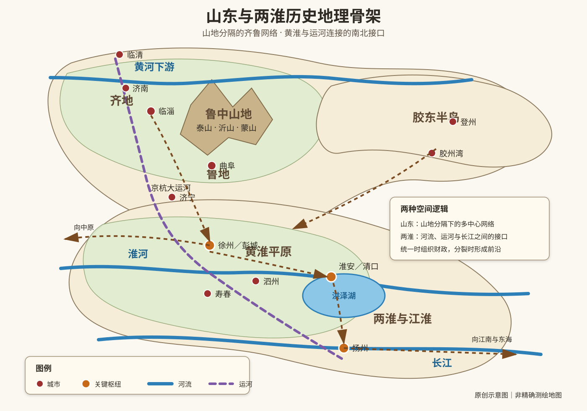
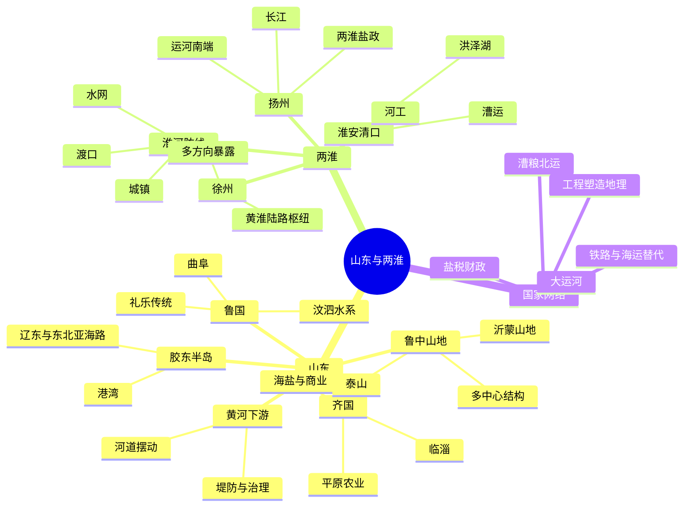

# 第八章　山东与两淮

- **创建日期**：2026-07-26
- **状态**：初版，已配原创历史地理示意图与独立时间轴
- **关键词**：山东、齐鲁、泰山、临淄、曲阜、胶东半岛、黄河、淮河、徐州、淮安、扬州、大运河、漕运、盐业、洪泽湖
- **章节性质**：围绕原书章节主题展开的原创历史地理学习指南，不逐段复述原书

## 摘要

“山东与两淮”不是两个边界清楚、始终不变的行政区，而是两组随时代变化的历史地理概念。古代“山东”有时泛指崤山、华山或太行山以东的东方地区，现代山东省则以齐鲁故地、鲁中山地、黄河下游平原和胶东半岛为主体；“两淮”有时指淮河南北，有时指宋代淮南东路、淮南西路，也常与明清盐政、漕运和江淮防线联系在一起。

山东的空间骨架，是鲁中山地把北部齐地、南部鲁地和东部胶东半岛分隔又连接起来。齐国依靠临淄、平原农业、沿海盐业、手工业和东方交通成长为强国；鲁国则在较小而相对内聚的空间中形成礼乐传统。两淮的战略价值来自“南北转换”：徐州连接中原、齐鲁和江淮，淮安控制河流与运河，扬州连接运河、长江和盐业。统一时期，这里是漕粮、盐税和商业流通的枢纽；分裂时期，它又常成为北方陆战体系与南方水网体系之间的前沿。

本章的核心结论是：

> 山东的力量来自山海之间的多中心网络；两淮的价值来自黄河、淮河、运河和长江之间的转换能力。前者有利于积累区域实力，后者决定南北资源能否被国家机器重新组织。

---

## 一、先纠正七个常见误解

### 1. 古代“山东”不总是今天的山东省

“山东”最初是相对方位词。战国秦汉文献中的“山东六国”，通常泛指秦国以东诸国，范围远超现代山东省。阅读史料时必须先判断，它说的是广义东方，还是齐鲁为核心的现代省域前身。

### 2. 齐与鲁不是同一个文化和地理单元

后世常用“齐鲁”合称山东，但先秦的齐、鲁差异明显：

- **齐国**核心在临淄及鲁中山地以北、以东，接近渤海和胶东资源区；
- **鲁国**核心在曲阜、汶水、泗水一带，空间较小，承袭周礼传统；
- 齐国更容易发展盐业、商业和大规模国家动员；
- 鲁国的政治扩张有限，却形成影响深远的礼乐和儒家传统。

### 3. 靠海不等于自动拥有海权

山东半岛三面近海，拥有登州、莱州和胶州湾等港湾，但海上力量仍取决于造船技术、财政、港口管理、航海知识和国家目标。多数时期，山东海路主要服务沿岸运输、渔盐、辽东往来和朝鲜半岛交通。

### 4. “两淮”没有唯一固定范围

“两淮”可指淮河南北的广义江淮地区，也可指宋代淮南东路与淮南西路，还可指明清淮南、淮北盐区及其盐运体系。理解“两淮盐商”或“两淮防线”时，必须结合具体时代。

### 5. 淮河不是一条稳定不变的国界

淮河多次成为南北政权之间的边界，但真正的防御体系还包括城池、渡口、堤坝、支流、湖泊、粮仓和水军。河流既能阻挡，也能运输，不能把它简单理解成天然城墙。

### 6. 黄河并非一直从山东北部入海

黄河历史上多次改道。1194年前后黄河大规模南徙并逐渐夺淮入海，长期影响苏北和淮安水系；1855年黄河又改向东北，经山东入渤海。河道变化会重新安排城市、农田、漕运和防洪成本。

### 7. 大运河不是从古至今完全相同的一条直线

隋唐运河与元明清京杭大运河的河道组合、枢纽和水源配置并不相同。山东段地势较高，元明以后通过会通河、南旺分水等工程，才把华北与江南漕运稳定连接起来。

---

## 二、山东的地理骨架：山地、平原、半岛与黄河下游

### 1. 鲁中山地：山东内部的分水岭

泰山、沂山、蒙山及周边丘陵构成山东中部的地形骨架。它们不是无法穿越的高墙，却会影响河流方向、道路选择和区域联系：山地以北通向济南、淄博和黄河下游平原；以南通过汶水、泗水、沂河和沭河联系徐州与淮河；向东则连接胶莱平原和胶东半岛。

这使山东天然形成齐地、鲁地、鲁南和胶东等多个区域中心，而不是一块均匀平原。

### 2. 齐地：临淄、平原与海盐

临淄位于鲁中山地北缘，既能利用农业腹地，又可联系渤海沿岸和胶东资源。齐国的优势包括平原农业、海滨盐业、渔业、手工业、城市市场和向西进入华北平原的道路。

齐桓公时期的霸业，不应只归因于管仲个人才能。更完整的解释是：制度改革把农业、盐业、市场、人才和军事组织整合成国家能力。盐是生活必需品，价值密度高于粮食，更适合征税和远距离交换，为齐国提供了重要财政来源。

### 3. 鲁地：曲阜、汶泗水系与礼制传统

曲阜位于鲁中山地西南侧，靠近汶水和泗水交通。鲁国承袭周公封国传统，礼制资源和宗法合法性突出，但国土较小，周边又有齐、宋、卫、楚等多方压力。

较小而内聚的政治空间有利于保存礼仪、典章和贵族文化，却不利于战国时代的大规模扩张。这说明文化影响力与领土、军事能力并不总是一致。

### 4. 胶东半岛：海路与区域纵深

胶东半岛多丘陵，陆路较狭长，容易形成相对独立的地方单元。登州、莱州、胶州湾等地可连接辽东、朝鲜半岛和渤海沿岸。它既是山东向海洋伸出的前沿，也是中原政权经营东北海路的重要节点。

### 5. 黄河下游：资源走廊也是风险走廊

黄河进入下游平原后，泥沙沉积、河床抬高和堤防约束会制造长期风险。黄河能够提供灌溉、渡口和东西联系，也会造成决口、淤积和人口迁移。国家修堤、分洪和赈灾的能力，直接影响山东北部的稳定。

---

## 三、两淮的地理骨架：淮河、徐州、洪泽湖、运河与扬州

### 1. 淮河：南北自然与军事体系的过渡带

淮河大致位于秦岭—淮河自然分界线上。北侧更接近华北平原农业和陆路交通，南侧逐渐进入江淮丘陵、湖泊与长江水网。统一时期，它是南北物资交换的中间带；分裂时期，它常成为两种军事和运输体系的接触区。

### 2. 徐州：多方向陆路门户

徐州位于山东丘陵、黄淮平原和江淮水系交会处，向北通齐鲁，向西连中原，向南接淮河，向东通苏北沿海。其优势是连接方向多，弱点也是连接方向多：适合作为进军和调度中心，却需要同时防守多条路线，很难仅凭一城形成安全后方。

### 3. 淮安—清口：河流与运河的总开关

淮安及清口附近长期处于淮河、运河、黄河故道和洪泽湖相互作用的位置。明清时期，这里承担漕粮中继、河道水位管理、仓储、修船、征验和河工协调。它的价值不在本地生产多少，而在于能否让整个国家运输网络继续运转。

### 4. 洪泽湖：自然过程与国家工程共同塑造

洪泽湖的形成和扩张与淮河水系、黄河夺淮及历代筑堤密切相关。它能够蓄水、调节运河，也可能在堤防失效时造成大范围灾害。为保障漕运和防洪而修建的工程会重塑自然地理，而新的地理又会反过来约束财政和治理。

### 5. 扬州：运河、长江与盐政交点

扬州位于大运河南端、长江北岸，既可承接江南财富，又能连接淮盐产区和北方市场。明清两淮盐商的财富，建立在盐引制度、政府专卖、运输组织和全国消费市场之上。扬州的繁荣是地理与制度共同创造的结果。

### 6. 原创历史地理示意图

> 下图强调区域、节点、通道和水系关系，不是精确测绘地图。

---

## 四、为什么山东与两淮必须放在一起理解

两地由三条长期网络连接：

1. **黄淮平原网络**：山东西部、徐州和淮北之间缺少绝对屏障，人口和军队可南北移动；
2. **汶泗—运河网络**：山东内陆河道与运河把济宁、临清、徐州、淮安串联起来；
3. **海岸与盐业网络**：渤海、黄海沿岸盐场和港口形成财政与商业联系。

先秦时，齐鲁与吴越、楚地通过陆路和海路互动；帝国时期，山东粮食、华北军需与江南漕粮通过两淮重新组织；南北分裂时期，两淮成为保护江南的前沿，山东则常是北方政权经营东部的重要腹地。

---

## 五、关键事件时间轴

| 时间 | 事件 | 地理意义 |
|---|---|---|
| 西周初年 | 齐、鲁受封 | 鲁中山地两侧形成不同国家与文化中心 |
| 前7世纪 | 齐桓公称霸 | 临淄、海盐、平原农业和制度改革共同支撑齐国实力 |
| 前284年 | 燕军进入齐地 | 齐国大部迅速失守，显示开放平原和多线防御的风险 |
| 前205年 | 楚汉在彭城交锋 | 徐州—彭城成为东方交通的关键节点 |
| 3世纪 | 徐州、淮南多次易手 | 黄淮之间成为南北势力接触区 |
| 605年后 | 隋代运河工程展开 | 江淮、黄河和华北运输被纳入大型水运体系 |
| 1127年后 | 宋金长期对峙 | 淮河沿线成为南宋北部防线和拉锯地区 |
| 1194年前后 | 黄河南徙夺淮 | 苏北水系、洪泽湖和漕运风险重组 |
| 元代 | 会通河等工程完善 | 山东段成为大都与江南漕运的关键高地段 |
| 明清时期 | 漕运与两淮盐政繁盛 | 临清、济宁、淮安、扬州成为国家财政链节点 |
| 1855年 | 黄河北徙入渤海 | 山东北部及黄淮水系重新调整 |
| 近现代 | 港口与铁路兴起 | 青岛、济南、徐州等新节点改变传统运河格局 |

完整版本参见：[山东与两淮历史地理时间轴](../Timeline/Chapter08_山东与两淮历史地理时间轴.md)。

---

## 六、齐国为什么能在东方崛起

### 1. 临淄是一座区域网络中心

临淄能够吸收粮食、盐、鱼、手工业产品和人口，并向华北平原输出商品与政治影响。城市规模、财政供养和交通便利，也为稷下学宫一类人才聚集提供了物质基础。

### 2. 盐业把海滨资源转化为国家收入

粮食体积大、运输成本高；盐则是生活必需品，适合征税和远距离贸易。齐国重视盐业与市场管理，使自然资源转化为可持续财政能力。

### 3. 开放地形有利扩张，也增加风险

齐地向西进入华北平原较便利，因此容易参与中原政治；但一旦政治中心和主力体系失效，外部力量也能较快进入。地理提供机会，并不保证安全。

---

## 七、徐州为什么重要，却难成为安全后方

徐州控制黄淮之间的陆路转换，从中原向东南、从山东向江淮的多条路线在附近交会。但它缺少像关中秦岭或四川盆周山地那样的连续外围屏障。

因此徐州适合做交通枢纽、前进基地和区域中心，却需要更大的中原、山东或江淮腹地支持。占领城市并不等于有效控制；有效控制还需要粮仓、河道、地方合作和稳定退路。

---

## 八、宋金为什么反复争夺淮河线

南宋的主要财赋位于江南。如果防线直接退到长江，建康、镇江和临安将缺少战略纵深，因此需要尽量经营淮南和江北城镇。

淮河提供的是一条防御带，而不是绝对城墙。有效防守需要寿春、楚州、扬州等城镇，以及渡口、支流、堤坝和水军配合。北方军队越向南，越受湖泊水网和补给约束；南方军队越向北，也会逐渐离开水运支撑。于是淮河地区常形成弹性边疆，而不是永久不变的国界。

---

## 九、黄河夺淮怎样改变国家治理

黄河南徙后，大量泥沙进入泗水、淮河和苏北河道，造成淤塞、决口和湖泊扩张。国家必须同时处理三个可能冲突的目标：

1. 保障黄河泄洪；
2. 保护淮河地区农田与城市；
3. 维持运河漕运水位与航道。

一道堤可能保护一地，却把压力转移到另一地；为了漕运蓄水，也可能增加洪泽湖周边风险。治河因此不仅是工程问题，也是财政、行政和跨区域利益协调问题。

---

## 十、漕运与两淮盐业：国家怎样利用地理网络

明清首都位于北京，主要财赋区却在江南。京杭大运河把江南漕粮经扬州、淮安、济宁、临清运往北方，山东和两淮成为帝国运输链的中段。

沿线城市不仅供船只停泊，还集中了仓储、修船、征验、换船、治河和官署。任何关键段中断，都可能影响首都供应。

盐业则通过盐引、专卖和指定销售区，把沿海盐场转化为财政收入。商人承担运输与销售，国家获得税收和许可收益。这套制度能够快速组织资源，也容易形成垄断、寻租和对政策的高度依赖。

---

## 十一、古今地名对照

| 历史名称 | 大致现代对应 | 历史功能 |
|---|---|---|
| 临淄 | 山东淄博临淄区 | 齐国都城、东方商业与手工业中心 |
| 曲阜 | 山东济宁曲阜市 | 鲁国都城、礼乐与儒家文化中心 |
| 泰山 | 山东泰安一带 | 鲁中地理核心和政治礼仪象征 |
| 登州 | 山东蓬莱、烟台一带 | 渤海海峡与辽东海路节点 |
| 彭城 | 江苏徐州 | 黄淮陆路枢纽 |
| 下邳 | 江苏睢宁、邳州附近 | 泗水交通和徐州东南门户 |
| 寿春 | 安徽寿县 | 淮河中游重镇 |
| 楚州／山阳 | 江苏淮安 | 漕运、河工和淮河—运河枢纽 |
| 清口 | 江苏淮安附近 | 黄河、淮河与运河关系的控制点 |
| 广陵／江都 | 江苏扬州 | 长江北岸、运河南端和盐运中心 |
| 两淮 | 苏北、皖北及江淮相关区域，范围随时代变化 | 防线、盐区、漕运和行政概念 |

---

## 十二、作者观点与深度分析

本章主题强调齐鲁差异和两淮的交通、军事价值。进一步可以形成四个通用模型。

### 模型一：山地分隔下的多中心区域

鲁中山地把齐、鲁、胶东和鲁南分成若干单元。多中心结构带来文化和经济多样性，也增加统一行政与调动成本。

### 模型二：边界河流的双向性

淮河既是障碍，也是通道。其战略价值取决于谁控制渡口、船只、沿岸城镇和支流水网，而不是河流名称本身。

### 模型三：交通枢纽的国家化

徐州、淮安、扬州、济宁和临清的重要性，来自国家把漕粮、盐税、军队和行政信息压缩到这些节点。节点越重要，维护成本和系统性风险也越高。

### 模型四：工程会创造新的地理

运河、堤坝、分水工程和盐场管理改变水流、聚落与商业路线。国家能够重塑地理，却必须长期承担维护成本和意外后果。

---

## 十三、长期影响

1. **齐鲁成为文化与国家传统的双重来源**：齐地体现商业、法术、海盐和开放城市传统，鲁地则代表礼乐、经典和儒家正统。
2. **徐州—淮安—扬州轴线长期决定南北连接**：中国政治中心在北方、财政中心在东南时，这条轴线尤其重要。
3. **黄河改道塑造苏北和山东区域差异**：河患、淤积和海岸变化影响城市兴衰、土地质量和人口迁移。
4. **运河城市的兴衰反映交通技术变化**：铁路和海运兴起后，传统漕运城市的全国地位发生调整。
5. **山东半岛持续连接华北与东北亚**：近现代港口、铁路和工业进一步放大胶东半岛的海洋位置。

---

## 十四、现代启示

### 1. 港口必须与腹地交通结合

港湾不会自动产生繁荣。港口价值来自铁路、公路、产业、制度和内陆市场共同支撑，古代登州海路与现代青岛港都符合这一规律。

### 2. 全国级枢纽必须保留冗余

漕运过度依赖清口和山东运河段时，洪水、淤积或冲突会造成系统性中断。现代物流、能源和数据网络同样不能只依赖单一路径。

### 3. 自然灾害会放大治理差异

洪水无法完全消除，但损失取决于堤防维护、预警、土地使用、财政储备和跨区域协调。自然风险与组织能力共同决定结果。

### 4. 区域性格不能替代结构分析

“齐人善商”“鲁人重礼”等说法有历史记忆价值，却容易把资源、制度和交通造成的差异解释成固定性格。更可靠的方法是先分析生产方式、城市网络和政治环境。

### 5. 专卖制度既能融资，也会积累扭曲

两淮盐政帮助国家获得稳定收入，但垄断、许可证和官商结合也可能降低效率。现代监管行业同样需要平衡公共利益、竞争与寻租风险。

---

## 十五、思维导图

---

## 十六、五分钟复习

1. 古代“山东”常是方位概念，不一定等于现代山东省。
2. 齐国和鲁国分别位于鲁中山地不同侧翼，经济结构和国家能力不同。
3. 齐国崛起依靠临淄、农业、海盐、商业和制度整合。
4. 靠海不等于自动拥有海权，仍需技术、财政和组织。
5. “两淮”范围随时代变化，可指淮河南北、宋代两路或明清盐区。
6. 徐州是黄淮陆路枢纽，进攻价值高，防守压力也高。
7. 淮安—清口是明清漕运和河工关键节点。
8. 扬州繁荣来自长江、运河、盐政和江南市场共同作用。
9. 黄河夺淮把防洪、漕运和生态风险叠加在苏北两淮。
10. 山东与两淮共同构成中国东部南北交通和财政网络的中段。

---

## 十七、思考题

1. 齐国若缺少海盐和临淄商业网络，仅凭农业能否长期称霸？
2. 鲁国的文化影响为何远超其领土和军事规模？
3. 徐州是否适合作为独立政权的长期首都？它缺少什么条件？
4. 南宋若放弃淮南而直接守长江，会产生哪些战略后果？
5. 明清坚持漕运而未更早全面改用海运，包含哪些技术与政治考虑？
6. 两淮盐商的财富应理解为企业能力、制度红利，还是两者结合？
7. 黄河治理中，为什么保护一个区域可能增加另一区域的风险？
8. 现代哪些港口或物流中心具有类似淮安、扬州的接口型价值？

---

## 十八、参考资料与延伸阅读

### 原始史料

1. 司马迁：《史记·齐太公世家》《史记·鲁周公世家》《史记·河渠书》。
2. 班固：《汉书·地理志》《汉书·沟洫志》。
3. 郦道元：《水经注·淮水》《水经注·泗水》。
4. 魏征等：《隋书·食货志》《隋书·炀帝纪》。
5. 脱脱等：《宋史·河渠志》《宋史·地理志》。
6. 张廷玉等：《明史·河渠志》《明史·食货志》。
7. 赵尔巽等：《清史稿·河渠志》《清史稿·食货志》。

### 历史地理与专题研究

1. 谭其骧主编：《中国历史地图集》。
2. 邹逸麟：《中国历史地理概述》。
3. 史念海：《河山集》。
4. 陈桥驿：《水经注研究》。
5. 中国大运河、黄河水利史、淮河治理史和两淮盐业史相关研究。

### 配套资料

- [原创地图：山东与两淮地理骨架](../Maps/Chapter08_山东与两淮地理骨架.svg)
- [独立时间轴：山东与两淮历史地理时间轴](../Timeline/Chapter08_山东与两淮历史地理时间轴.md)

---

## 本章结语

山东与两淮最值得注意的，不是某种固定地域性格，而是两种不同的空间组织方式。山东由山地、平原和半岛构成多中心网络，齐国善于把海盐、农业、城市和人才转化为国家能力；鲁国则在较小空间中保存并放大礼乐文化。两淮是一组南北接口：徐州控制陆路，淮安控制河运，扬州连接长江和盐业，淮河承担边界与通道的双重角色。

当国家统一时，这些节点把江南财富、北方政治中心、沿海资源和内陆市场连接起来；当国家分裂时，同样的网络又成为最重要的前沿。黄河改道、运河兴衰和盐政变迁进一步说明，历史地理不是静态背景，而是自然过程、国家工程和制度选择共同塑造的结果。

所以，本章最值得保留的一句话是：

> 强国不仅要占有土地，更要掌握不同地理系统之间的接口；而接口越重要，越需要持续的工程、制度与组织维护。