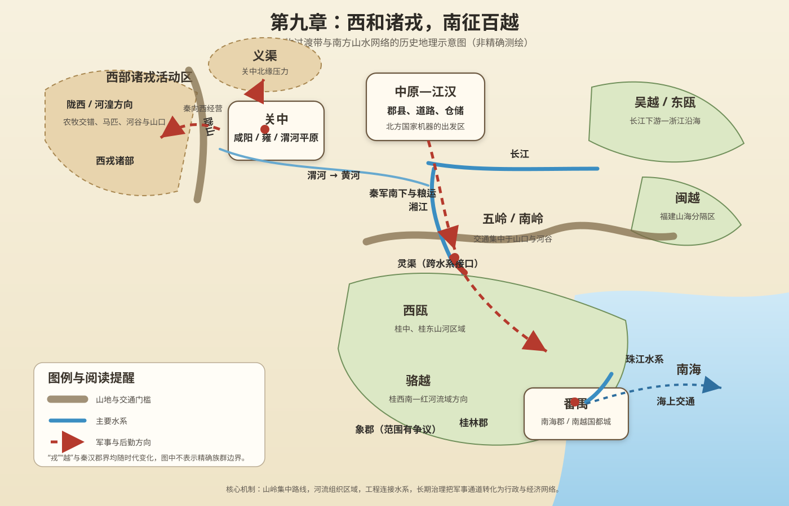
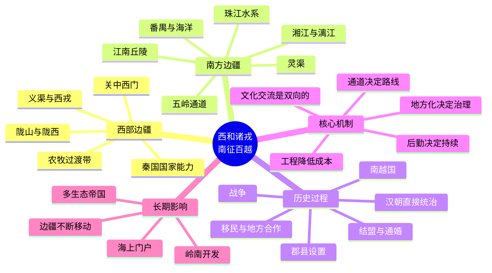

# 第九章　西和诸戎，南征百越

- **创建日期**：2026-07-27
- **状态**：初版，已配原创历史地理示意图与独立时间轴
- **关键词**：诸戎、西戎、义渠、秦国、陇山、陇西、百越、吴越、闽越、南越、西瓯、骆越、岭南、南岭、灵渠、番禺、南海郡、桂林郡、象郡
- **章节性质**：围绕原书章节主题展开的原创历史地理学习指南，不逐段复述原书

## 摘要

“西和诸戎，南征百越”表面上描述两个方向的扩张，实际上揭示了古代中国国家形成过程中两种不同的边疆地理：西部是黄土高原、河谷、草原与山地交错的农牧过渡带，南部则是山岭密集、河网纵横、气候湿热、海岸漫长的亚热带与热带区域。

“诸戎”与“百越”都不是边界固定、内部统一的单一民族名称，而是中原文献对许多不同地方集团的概括。西部诸戎与周、秦长期战争、通婚、贸易和结盟，秦国本身也在这种边疆互动中成长；南方各越人集团分布于长江下游、东南沿海、福建、岭南及更广阔区域，拥有不同的政治组织、生计方式和海河交通网络。

秦朝统一以后试图把北方形成的郡县、道路、军队和赋役体系迅速推向岭南。真正决定南征能否持续的，不只是战场胜负，而是如何越过南岭、建立粮道、适应湿热环境并连接长江与珠江水系。灵渠的重要性正在于此：它把湘江与漓江连接起来，使军事占领获得了后勤基础。秦亡以后，赵佗建立南越国，说明边疆一旦远离中央，仅有行政名称并不等于有效控制；地方政权、区域贸易和本地社会仍会按照地理条件重新组织。

本章的核心结论是：

> 国家疆域的扩大，往往从军事突破开始，却只能靠交通、移民、地方合作、制度适应与长期治理完成。西部边疆塑造了秦的国家能力，南部边疆则检验了这种能力能否跨越完全不同的生态与社会环境。

---

## 一、先纠正八个常见误解

### 1. “戎”不是一个内部完全一致的民族

先秦文献中的“戎”常指周、秦以西或西北方向的多种地方集团，例如犬戎、义渠、大荔、绵诸等。它是一种带有方位、政治关系和文化区分的统称，不等于现代民族分类。

同一个集团在不同时期可能是敌人、盟友、婚姻对象、贸易伙伴或王朝属民。若把“华夏”和“戎狄”理解成两条永不变化的血缘边界，就无法解释秦人与西戎之间长期而复杂的互动。

### 2. 秦国不是站在边疆之外征服边疆

秦的早期发展本身就在关中西部与陇山周边的边疆环境中完成。秦人既保护周王室、经营农业城邑，也吸收西部军事经验、马匹资源和地方人口。秦国后来能够向东方六国扩张，与其长期处理多方向边疆压力密切相关。

换句话说，秦不是一个成熟的“中原国家”突然向西扩展，而是一个在西部边疆竞争中逐步形成强大国家能力的政权。

### 3. “和”不等于单纯和平

“西和诸戎”中的“和”可以包含安抚、结盟、通婚、封赏、贸易、分化、迁徙和军事威慑。边疆治理往往不是“战争”与“和平”二选一，而是多种手段交替使用。

### 4. “百越”不是一个统一王国

“百越”是对南方许多越人集团的总称。“百”强调众多，不是精确数量。吴越、东瓯、闽越、南越、西瓯、骆越等名称所指区域、政治组织和历史阶段并不相同。

### 5. 南征不是一路从中原直线走到广州

秦军进入岭南需要经过湘江流域、五岭山口、桂东北河谷或赣江—北江等多条通道。山地使大军难以横向展开，河流又分属不同水系。行军路线、粮道与水运转换比地图上的直线距离更重要。

### 6. 修成灵渠不等于岭南立即被完全控制

灵渠解决了部分跨水系运输问题，却不能自动消除疾病、气候、地方抵抗、行政距离和语言文化差异。秦在岭南设置郡县后不久便全国崩溃，地方控制迅速重新组合。

### 7. 郡县名称不等于每一个角落都受到同等治理

古代地图常把南海、桂林、象郡涂成统一颜色，但实际控制通常集中在城邑、河谷、交通线和驻军据点。山区、森林、海岛和偏远流域的地方社会可能长期保有较强自主性。

### 8. 边疆纳入不是单向“文明输入”

中原制度、文字、铁器、农业技术和移民影响南方；南方的稻作、舟船、海产、香料、金属资源、医药知识和海上交通也不断影响北方王朝。长期统一来自双向适应，而不是一方原样复制另一方。

---

## 二、西部边疆的地理骨架：关中、陇山、陇西与农牧过渡带

### 1. 关中西门：陇山不是终点，而是一道转换带

关中平原向西逐渐收束到陈仓、陇山与渭河上游。越过陇山后，地形进入陇西高原、河谷与山地相间的区域。这里连接关中、河湟、河西走廊和四川北缘，是农业、畜牧与跨区域交通的交会带。

陇山的意义不是把两边完全隔开，而是把交通压缩到有限河谷和山口。谁能控制这些通道，谁就能影响马匹、人口、军队和物资进入关中。

### 2. 泾河—渭河—黄河上游：边疆并非荒地

西部边疆拥有可耕河谷、草场、盐池、牧畜和金属资源。地方集团往往同时利用农业与畜牧，不应被简单想象成只会游牧的“外部人群”。

对周、秦而言，控制河谷意味着获得粮食和城邑，控制高原与草场意味着获得马匹和机动力。农牧资源的组合，是西部政权军事化的重要基础。

### 3. 义渠：关中北部的长期压力

义渠活动于关中北部和陇东一带，长期与秦国战争、通婚并存。其位置接近泾水、洛水上游及黄土高原通道，能够从北侧威胁关中，也能连接更广阔的草原与高原网络。

秦最终消灭义渠，不只是消除一个敌国，更意味着关中北部防线向外推进，秦可以减少后方压力，把更多资源用于东进。

### 4. 西部经验如何塑造秦国

秦国长期面对有限通道、分散地方集团和农牧混合社会，因此发展出几种能力：

- 在边疆设置县、道和军事据点；
- 通过封赏、迁徙和编户整合人口；
- 重视骑兵、马政与快速机动；
- 以道路、仓储和河谷城邑支撑远征；
- 在战争之外使用结盟、通婚与分化策略。

这些能力后来被扩大到统一六国和经营全国，但在岭南这种完全不同的环境中，又必须重新调整。

---

## 三、南方边疆的地理骨架：长江以南、五岭与珠江水系

### 1. 江南不是岭南，岭南也不是一个均匀平面

从长江流域向南，首先经过江南丘陵、赣江和湘江流域，再越过南岭进入广东、广西。南岭由越城岭、都庞岭、萌渚岭、骑田岭、大庾岭等山地组成，并非一道连续不可逾越的高墙，却会把大规模交通集中到少数山口和河谷。

### 2. 湘江与漓江：相距很近，分属两大水系

湘江向北汇入洞庭湖和长江，漓江则向南进入桂江、西江与珠江水系。两河上游在广西兴安附近距离很近，却被分水岭隔开。

灵渠通过人工渠道和分水工程连接两套水系，使北方船运可以从湘江系统转换到漓江—西江系统。它不是简单“挖一条沟”，而是跨越分水岭、调节水位并组织长期维护的系统工程。

### 3. 西江与珠江三角洲：进入岭南腹地的水上主轴

漓江向南连接桂江，再进入西江。西江汇合多条支流后流向珠江三角洲。对古代大军和官府而言，水路可以运输远多于山路的人粮物资；对本地社会而言，河网也是村落、市场和政治中心的组织轴线。

番禺位于珠江三角洲北缘，是南海郡的重要中心。它既连接西江、北江、东江，又能通向南海，因而兼具内河枢纽与海上门户功能。

### 4. 东南沿海：吴越、东瓯与闽越

长江下游和浙江沿海较早形成吴、越等国家。福建山地密集，沿海平原狭窄，河流短促，闽越地区因此具有明显的山海分隔特征。中央政权若只控制沿海港口或河谷，不等于能够深入控制所有山地。

### 5. 湿热气候与疾病成本

岭南高温多雨，植被茂密，北方士兵需要面对陌生的季节节律、疾病环境、食物和饮水问题。古代缺乏现代医学时，非战斗减员可能严重削弱远征军。

这说明“距离”不能只用里程衡量。相同的一百公里，在平原、峡谷、雨林和河网中的运输成本完全不同。

### 6. 原创历史地理示意图

> 下图强调西部与南部边疆的区域、节点、通道和水系关系，不是精确测绘地图；古代族群与政区边界具有流动性，图中仅作学习示意。

---

## 四、“诸戎”与“百越”：名称背后的历史阅读方法

### 1. 先问“谁在命名”

“戎”“夷”“蛮”“狄”“越”等称呼主要来自中原文献。它们反映书写者的地理视角、政治秩序和文化分类，不一定等于被称呼者的自我认同。

### 2. 再问“哪一个时代”

同一名称在几百年间可能改变含义。例如“越”既可指春秋战国的越国，也可作为南方众多群体的概括，还可出现在南越、闽越、东越等政权名称中。

### 3. 最后问“实际社会如何组织”

判断一个边疆集团，不能只看标签，还要观察：

- 是否拥有固定城邑和首领体系；
- 主要依靠农业、畜牧、渔业还是海上贸易；
- 能否组织大规模战争；
- 与周边政权是否存在婚姻、贸易和朝贡；
- 是否控制山口、河谷、盐铁或港口；
- 中央政权的命令能否真正到达基层。

这种方法能避免把古代复杂社会压缩成“文明—野蛮”的二元叙事。

---

## 五、历史背景：统一之前，边疆已经长期互动

### 1. 西周与犬戎：王朝中心也会因边疆关系改变

西周晚期，关中西北压力加剧。公元前771年前后，犬戎攻入镐京，西周灭亡，周平王随后东迁洛邑。这个事件说明：关中虽然有山河屏障，却不是完全封闭；一旦内部政治危机与外部力量结合，边疆通道可以直达王朝核心。

### 2. 秦襄公到秦穆公：从护送周室到经营西戎

秦襄公因护送周平王东迁并承担西部防务而获得政治地位。到秦穆公时期，秦向西扩展，通过战争与结盟控制更多西戎集团。传统史书用“霸西戎”概括这一过程。

其意义不是秦突然取得一大片空白土地，而是秦逐渐掌握关中西侧的通道、人口与资源，并减少两面作战压力。

### 3. 义渠与秦：战争和通婚同时存在

义渠与秦长期对抗，也曾与秦王室形成复杂关系。秦昭襄王时期，秦最终吞并义渠，进一步控制陇东和关中北缘。边疆整合由此转化为郡县、道路和军事部署问题。

### 4. 吴、越、楚向南方的早期扩展

秦统一前，长江中下游并非中央王朝从未接触的“未知南方”。吴、越和楚已经通过战争、迁徙和政治联盟不断重组江南。楚国尤其沿汉水、长江和湘水向南扩展，为后来秦汉进入岭南提供了部分交通与行政基础。

---

## 六、关键事件时间轴

| 时间 | 事件 | 地理意义 |
|---|---|---|
| 前771年前后 | 犬戎攻入镐京，西周结束 | 关中西北边疆压力与内部政治危机共同改变王朝中心 |
| 前770年 | 周平王东迁，秦襄公地位上升 | 秦承担关中西部防务，获得向西经营的政治起点 |
| 前7世纪 | 秦穆公时期“霸西戎” | 秦控制更多西部通道与地方集团，后方空间扩大 |
| 前4—3世纪 | 秦持续经营陇西、北地等区域 | 边疆逐步转化为郡县、道路和军事基地 |
| 前272年前后 | 秦消灭义渠 | 关中北部威胁降低，秦可集中力量东进 |
| 前334—前306年间 | 越国衰亡，越人集团分散 | 东南沿海出现多个地方政权与文化区域 |
| 前221年 | 秦统一六国 | 北方形成的国家机器开始向南方大规模延伸 |
| 前219—前214年间 | 秦多路进军岭南，开凿灵渠 | 南征成败取决于跨越南岭和建立稳定粮道 |
| 前214年 | 岭南设置南海、桂林、象等郡 | 行政版图向珠江流域扩展，但有效控制程度并不均一 |
| 秦汉之际 | 赵佗据岭南，建立南越国 | 远离中央的郡县体系在帝国崩溃时重新地方化 |
| 前196年前后 | 汉廷遣陆贾与南越建立册封关系 | 汉初以外交和名义秩序降低直接战争成本 |
| 前111年 | 汉武帝灭南越 | 中央重新控制珠江流域主要节点和海上门户 |
| 前110年前后 | 汉处理闽越、东越政权 | 东南沿海进一步纳入郡县与人口迁徙体系 |
| 汉以后 | 岭南郡县、移民和海贸持续发展 | 军事边疆逐步转化为行政区、经济区与文化交融区 |

---

## 七、秦为什么能从西部边疆崛起

### 1. 边疆压力迫使国家提高组织能力

处在开放平原上的小国可以依靠邻国平衡暂时生存，处在多方向边疆的秦却必须同时解决城防、马政、粮运、人口编制和快速动员问题。长期压力使秦更重视可量化、可执行的制度。

### 2. 西部提供安全纵深

秦控制关中西部和陇东后，核心区背后不再紧贴敌对力量。东方六国彼此竞争时，秦可以在较安全的基地内积蓄资源，再通过函谷关方向选择出击时机。

### 3. 人口迁徙把边疆变成国家内部

军事胜利之后，秦通过设置县邑、迁入人口、编户征税和修筑道路，把原本相对独立的地方集团逐步纳入国家。真正的“占领”不是地图变色，而是人、地、税、兵和司法都能被持续管理。

### 4. 但西部经验不能原样复制到南方

西部的骑兵、旱地运输和河谷城邑经验，在岭南湿热山地中会遇到限制。国家制度可以复制，后勤技术与治理方式却必须本地化。

---

## 八、秦南征百越：胜负首先是后勤问题

### 1. 大规模兵力数字需要谨慎阅读

传统文献常记秦军数十万南征。古代数字可能包含夸张、合计或文学表达，不能直接当作现代统计。即使实际兵力较少，其补给压力仍然巨大：人每天需要粮食，牲畜需要草料，兵器和疾病损耗也必须补充。

### 2. 南岭把运输压缩到少数通道

北方粮食先进入湘江或赣江流域，再翻越分水岭、转入岭南河流。任何一个山口、仓库或渡口失守，都可能使前线军队断粮。

### 3. 灵渠把“翻山运粮”改造成“跨水系转运”

灵渠连接湘江与漓江，使长江水系和珠江水系之间形成一条可管理的水运转换线。它的军事价值可以用三个层次理解：

1. **降低单位运输成本**：船运比人背畜驮更适合大宗粮食；
2. **提高补给连续性**：水路便于建立仓储和固定运输节奏；
3. **把临时远征路线变成长期交通基础设施**：战争结束后仍可服务移民、行政、贸易和灌溉。

### 4. 工程本身也需要制度

修渠不是一次性劳动。水位、淤积、堤坝、闸口和洪水都需要维护。若没有地方官吏、劳役组织和沿线社会合作，工程很快会失效。

### 5. 本地抵抗利用的是地理熟悉度

西瓯等地方集团熟悉山林、河谷和季节环境，可以避开正面大会战，攻击粮道并拖长战争。远征军越强大，每日消耗越大；战争越持久，后勤弱点越容易被放大。

---

## 九、南越国：为什么秦朝灭亡后岭南没有立即回到北方控制

### 1. 距离使地方官员拥有更大自主空间

秦末中原战乱时，南海郡与北方政治中心之间交通漫长。赵佗控制番禺及主要河道后，可以依靠岭南本地资源建立区域政权。

### 2. 山岭既阻挡北军，也保护地方政权

南岭通道有限，使北方大军进入成本高。地方政权只要控制山口、灵渠南端和珠江水系节点，就能获得战略纵深。

### 3. 南越的生存依靠融合，而不只是驻军

赵佗政权若只依靠少量北方军人，很难长期统治广阔岭南。它必须吸收本地首领、尊重部分地方习俗、发展农业与贸易，并让秦代移民与越人社会形成新的利益结构。

### 4. 南越既是独立力量，也是汉朝的缓冲区

汉初国力有限，直接远征成本高，因此一度通过册封、使节和贸易维持关系。南越名义上进入汉帝国秩序，同时保持相当程度自主。这是一种以较低成本管理远方边疆的方式。

---

## 十、汉武帝灭南越：从外交缓冲转向直接郡县

### 1. 为什么汉朝后来选择直接控制

随着汉朝中央财政、军队和南方交通能力增强，南越控制珠江流域、海上门户与南方贸易的价值更高。南越内部继承与政治冲突，又为汉军介入提供机会。

### 2. 军事胜利仍依赖多路协同

汉军可从湖南、江西等方向越岭南下，并利用水路进入珠江流域。多路进军可以分散地方防守，却也增加协调、补给和通信难度。

### 3. 灭国之后的难题更大

汉朝需要重新设置郡县、任命官员、安排驻军、处理地方首领、维持道路和征收赋税。若行政成本高于当地可提供的资源，直接统治就难以持续。

### 4. 沿海与河谷先成为治理骨架

岭南的有效控制首先集中在番禺、苍梧、合浦等城邑与主要河流沿线。山区社会被纳入中央体系往往需要更长时间，并通过羁縻、地方首领合作和逐步设县完成。

---

## 十一、为什么地理如此重要

### 1. 西部与南部要求两种不同军队

- 西部更重视骑兵、马匹、旱地机动和高原河谷据点；
- 南部更重视水军、舟船、山地步兵、疾病适应和跨水系后勤。

强国若只擅长一种战场，就难以稳定控制多生态疆域。

### 2. 山脉不是绝对边界，而是“成本放大器”

陇山、南岭都可以穿越，但通道有限。山脉的作用是迫使交通集中，使少数山口、河谷和仓库拥有远超自身规模的战略价值。

### 3. 河流既能分割，也能整合

湘江与漓江分属不同水系，原本形成运输断点；灵渠把断点变成接口。珠江水系内部的西江、北江、东江又把分散地区连接到番禺和海岸。

### 4. 气候改变军事效率

在湿热环境中，北方军队的名义人数可能很大，但疾病、疲劳和补给损耗会降低有效战斗力。地理通过影响健康、运输和季节，改变纸面兵力的真实价值。

### 5. 海洋让岭南不是帝国尽头

珠江口、合浦和东南沿海连接南海贸易。岭南不仅是南方边疆，也逐渐成为面向东南亚与印度洋交通的门户。控制这里的意义会随着海上贸易发展不断上升。

---

## 十二、围绕本章标题可以提炼出的作者视角

在不逐段复述原书的前提下，本章标题可以提炼为四个历史地理判断：

1. **中原王朝不是在完成内部统一后才接触边疆**：周、秦的形成过程本身就与西部集团互动密切。
2. **扩张方向由通道决定**：西进依靠河谷与山口，南下依靠湘赣水系、五岭通道和珠江河网。
3. **工程可以改变地理成本**：灵渠没有消灭南岭，却显著降低跨水系运输难度。
4. **军事征服与国家整合不是同一件事**：设置郡县只是开始，有效治理需要几代人的交通、人口与制度建设。

本指南进一步强调：与其把这段历史写成单线的“中心征服边疆”，不如把它理解为多种区域社会通过战争、贸易、迁徙与制度逐步形成更大政治共同体的过程。

---

## 十三、深度分析：从“扩张史”转向“国家能力史”

### 1. 领土扩张包含五个层级

一个地区真正进入国家体系，通常经历：

1. **侦察与结盟**：了解道路、水源、地方首领和资源；
2. **军事突破**：控制山口、城邑、渡口和粮道；
3. **行政命名**：设置郡县、任命官员；
4. **社会嵌入**：建立税收、司法、市场、婚姻与地方合作；
5. **身份重组**：地方人群逐渐把更大国家视为自身政治生活的一部分。

秦在岭南完成了前几个层级，但全国迅速崩溃，社会嵌入尚未稳固；汉代及其后王朝才长期推进后续过程。

### 2. 基础设施具有“双重用途”

灵渠首先服务军事粮运，后来也服务交通、灌溉、移民和贸易。道路、港口、运河和仓库往往同时是军事设施与经济基础设施。

基础设施一旦建立，会改变人口流向和城市位置，从而使原本临时的战略路线变成长期区域骨架。

### 3. 地方合作不是软弱，而是降低治理成本

中央不可能派足够官员和军队管理每个山谷。与地方首领合作、承认部分习俗、逐步推行法律，通常比立即彻底改造更可持续。

但地方合作也有风险：地方精英可能利用中央名义扩大自身权力。因此需要监督、轮换、交通和多层行政形成制衡。

### 4. 统一会创造新的边疆

当西戎地区逐渐成为秦国腹地后，新的边疆继续向陇西、河湟和河西移动；当岭南主要河谷纳入郡县后，新的边疆又出现在更深的山区、海岛和西南方向。

边疆不是地图上固定的一条线，而是国家有效治理能力的移动边缘。

### 5. 文化融合并不意味着差异消失

统一文字、行政和市场可以增加共同性，但地方语言、宗教、饮食、亲族和生态知识仍会延续。稳定国家不需要所有地区完全相同，而需要差异能够在共同制度内协商和流动。

---

## 十四、古今地名与概念对照

| 古代名称 | 大致现代范围或位置 | 阅读提醒 |
|---|---|---|
| 关中 | 陕西中部渭河平原 | 秦国核心区，不等于整个陕西 |
| 陇山 | 陕西西部—甘肃东部山地 | 关中与陇西之间的重要转换带 |
| 陇西 | 甘肃东南、中部部分地区，范围随时代变化 | 既是郡名也是广义区域概念 |
| 北地 | 宁夏南部、甘肃东部、陕西北部部分地区 | 秦汉郡域多次调整 |
| 义渠 | 主要活动于陇东、宁南及关中北缘 | 不是固定现代行政区 |
| 西戎 | 对多种西方集团的统称 | 不应视为单一民族 |
| 百越 | 长江下游以南、东南沿海至岭南多种集团 | “百”表示众多 |
| 吴越 | 江苏南部、浙江及周边 | 可指吴国、越国，也可泛指区域文化 |
| 东瓯 | 浙江南部温州一带及周边 | 政权与人口范围随时期变化 |
| 闽越 | 福建及邻近地区 | 山地与沿海分隔明显 |
| 南越 | 广东、广西及越南北部部分地区的历史政权 | 不等同现代越南 |
| 西瓯 | 广西中东部等地的越人集团 | 与壮侗语族先民关系常被讨论 |
| 骆越 | 广西西南、越南北部等区域的古代集团 | 具体范围存在学术争议 |
| 五岭／南岭 | 湖南、江西南部与广东、广西北部山地 | 不是单一山脉或一条整齐边界 |
| 灵渠 | 广西桂林兴安县 | 连接湘江与漓江水系 |
| 番禺 | 今广州核心区域及周边 | 南海郡治与南越国都城 |
| 南海郡 | 以今广东中部、东部部分地区为主 | 郡界随时代变化 |
| 桂林郡 | 今广西部分地区 | 不等于今天桂林市 |
| 象郡 | 秦代岭南南部郡，范围存在争议 | 不宜用唯一现代边界套入 |
| 合浦 | 今广西北海、合浦一带 | 汉代海上交通重要门户 |

---

## 十五、长期影响

### 1. 秦的西部边疆经验帮助形成统一帝国

秦在西部发展出的县制、军功、道路、迁徙与人口管理能力，后来成为全国统治的重要工具。边疆不是帝国的附属问题，而是帝国制度的实验场。

### 2. 岭南从军事前线转变为经济区域

灵渠、珠江水运、番禺和合浦等节点，使岭南逐渐连接长江流域与海上贸易。随着人口增长和农业开发，岭南不再只是需要驻军的远方，而成为具有财政和商业价值的区域。

### 3. 南越国留下地方整合的中间层

南越国承接秦代郡县与移民，又吸收越人社会。它既不是秦制的简单延续，也不是完全恢复到秦以前，而是边疆社会重新组合的结果。

### 4. 中国政治空间向多生态帝国转型

从黄河流域扩展到长江、东南沿海和岭南以后，国家必须同时管理旱地、稻作区、山地、草原边缘和海岸。制度统一与地方差异之间的平衡，成为后世王朝长期课题。

### 5. 南方人口与经济重心逐步上升

秦汉时期南方人口密度总体仍低于北方，但交通、移民和行政整合为后来江南、岭南开发奠定基础。这个过程持续数百年，不能归因于一次南征。

### 6. 海上方向逐渐进入国家战略

岭南和福建沿海的港口，使中国政治经济网络从内陆河流进一步延伸到南海。后世海上丝绸之路的发展，与早期沿海郡县和地方航海传统都有联系。

---

## 十六、现代启示

### 1. 基础设施不是装饰，而是战略能力

一条短运河可以改变跨区域运输成本。现代铁路、港口、电网、数据中心和通信光缆同样会把“远方”变成可持续连接的区域。

### 2. 进入新市场不能照搬原有模式

秦在北方有效的军事与行政经验，进入岭南后必须适应水网、气候和地方社会。企业、政府或技术平台进入新地区，也需要本地化，而不是把总部制度原样复制。

### 3. 地图上的覆盖率不等于真实服务能力

行政区已经设立，不代表每个地方都能获得司法、医疗、教育或交通。现代治理也应区分“名义覆盖”与“有效覆盖”。

### 4. 供应链最脆弱的地方常是转换接口

灵渠的价值来自连接两套水系。现代供应链中的港口、铁路换装站、芯片封装、云服务网关和支付清算，也属于关键接口。接口规模可能不大，却能决定整个网络是否连通。

### 5. 多样性需要共同规则，也需要地方空间

长期稳定不是消灭差异，而是让不同地区在共同法律和市场中保持可表达、可协商的地方传统。过度强求一致会提高治理摩擦，完全缺乏共同规则又会增加分裂成本。

### 6. 远征思维必须转化为运营思维

完成一个项目、并购一家企业或进入一个国家，类似军事突破；真正创造长期价值的是后续运营、维护、人才培养和地方合作。夺取节点容易，维持网络困难。

---

## 十七、思维导图

---

## 十八、五分钟复习

1. “诸戎”和“百越”都是对多个地方集团的概括，不是单一民族或统一国家。
2. 秦国本身在西部边疆互动中成长，边疆经验塑造了它的军事和行政能力。
3. 陇山、南岭都不是不可穿越的墙，而是把交通集中到少数通道的成本放大器。
4. 秦南征岭南的核心难题是粮运、疾病、山地和跨水系运输。
5. 灵渠连接湘江与漓江，把长江水系和珠江水系接通，显著降低后勤成本。
6. 秦设置岭南郡县不等于立即实现全面有效控制。
7. 秦亡后赵佗建立南越国，体现距离、地形与地方社会对中央权力的重新塑造。
8. 汉初先用册封和外交降低成本，国力增强后才直接灭南越设郡。
9. 军事占领只是国家整合的第一步，长期治理依赖交通、移民、地方合作和制度适应。
10. 边疆不是固定线，而是有效治理能力不断移动的边缘。

---

## 十九、思考题

1. 秦国的强大有多少来自关中地理，又有多少来自长期西部边疆竞争形成的制度能力？
2. 若没有灵渠，秦朝是否仍可能控制岭南？可能需要付出怎样的时间与运输成本？
3. 赵佗建立南越国，是秦帝国失败的证据，还是秦代岭南建设已经产生地方国家能力的证据？
4. 汉初对南越采取册封关系，与直接郡县统治相比，各有什么成本和风险？
5. 古代“戎”“越”等外部命名会怎样影响后世对地方社会的理解？
6. 为什么沿河城邑往往比山区更早纳入中央行政？
7. 现代哪些基础设施具有类似灵渠的“网络转换接口”作用？
8. 一个组织进入文化和生态差异很大的新市场时，怎样区分应统一的规则与应本地化的做法？

---

## 二十、参考资料与延伸阅读

### 原始史料

1. 司马迁：《史记·秦本纪》。
2. 司马迁：《史记·秦始皇本纪》。
3. 司马迁：《史记·南越列传》。
4. 司马迁：《史记·东越列传》。
5. 班固：《汉书·地理志》。
6. 班固：《汉书·西南夷两粤朝鲜传》。
7. 刘安等：《淮南子·人间训》。其中关于秦军南征的兵力与战争叙述应结合文献性质谨慎使用。

### 历史地理与专题研究

1. 谭其骧主编：《中国历史地图集》第一、二册。
2. 周振鹤：《西汉政区地理》。
3. 葛剑雄：《统一与分裂：中国历史的启示》。
4. 王子今：《秦汉交通史稿》。
5. 马大正主编：《中国边疆经略史》。
6. 何光岳：《百越源流史》。

### 在线资料

1. [UNESCO World Heritage Centre：Lingqu Canal](https://whc.unesco.org/en/tentativelists/5814/)：介绍灵渠连接湘江与漓江、沟通长江与珠江水系及其工程结构。
2. [南越王博物院](https://www.nywmuseum.org.cn/)：南越国历史、考古遗址与出土文物资料。
3. [中国哲学书电子化计划](https://ctext.org/zh)：可检索《史记》《汉书》《淮南子》等古籍。
4. [维基文库《史记》](https://zh.wikisource.org/zh-hans/%E5%8F%B2%E8%A8%98)：便于对照公共领域古籍文本。
5. [复旦大学中国历史地理研究所](https://yugong.fudan.edu.cn/)：历史疆域、政区、人口迁移与历史地图研究资讯。

### 阅读提醒

关于“百越”内部分类、象郡范围、秦军兵力、南越建国具体年份等问题，史料与现代研究存在不同解释。学习时应区分确定性较高的宏观地理结构与仍有争议的精确边界、数字和年代。

---

## 本章结语

秦在西部边疆成长，学会了如何把战争、道路、人口和行政组织成国家能力；当这种能力向南推进时，南岭、湿热气候和珠江水系迫使它重新学习。灵渠证明，人类工程可以改变地理成本，却不能取消地理和社会本身。

真正的统一不是军队走到哪里，地图就永远属于哪里。它需要让道路有人维护，让城邑能够交换，让地方精英愿意合作，让普通人口在新的制度中获得可预期的生活。西戎地区逐渐成为秦的后方，岭南又从军事前线变成海上门户，说明“中心”与“边疆”会随着交通、人口和治理能力不断转换。

本章最值得保留的一句话是：

> 武力可以打开通道，工程可以降低距离，只有长期治理与双向融合，才能把边疆变成共同生活的内部空间。
