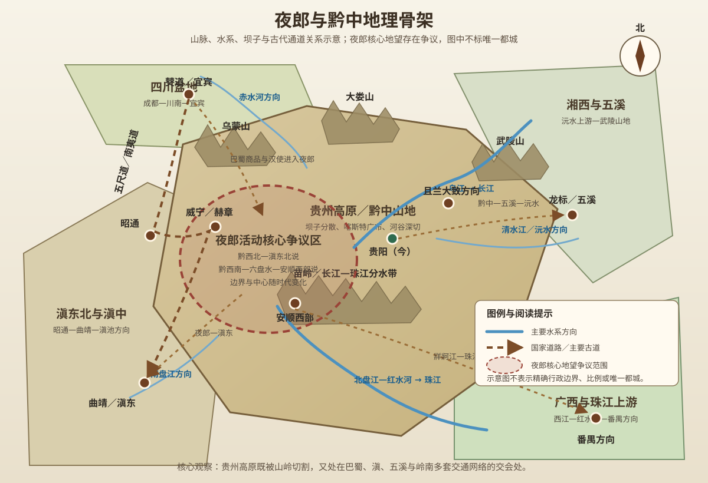
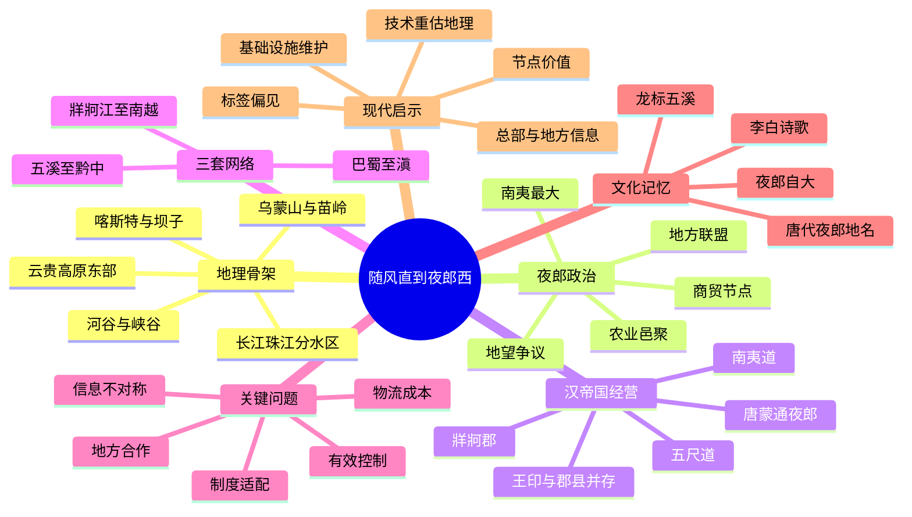

# 第十章　随风直到夜郎西

- **创建日期**：2026-07-28
- **状态**：初版，已配原创历史地理示意图与独立时间轴
- **关键词**：夜郎、西南夷、牂牁江、贵州高原、喀斯特、五尺道、南夷道、唐蒙、张骞、且兰、牂牁郡、五溪、龙标、李白
- **章节性质**：围绕原书章节主题展开的原创历史地理学习指南，不逐段复述原书

## 摘要

“夜郎”在大众记忆中常被压缩成一个成语：夜郎自大。但从历史地理看，夜郎真正值得研究的并不是一则嘲讽故事，而是中国西南高原如何被道路、河流、贸易、军事与行政逐步连接起来。

战国至西汉时期，夜郎是西南夷诸多地方政治集团中较有影响力的一支。它所处的区域大致位于四川盆地、云贵高原、五溪地区与珠江上游之间。这里山岭密集、喀斯特广布、河谷深切，适合形成许多相对独立的地方中心，却又同时控制从巴蜀通往滇东、从黔中通往岭南、从沅水流域进入高原的多条通道。夜郎的力量不是建立在一个辽阔、边界清晰、行政高度统一的国家之上，而更可能来自对河谷、坝子、渡口、山口、贸易节点和周边部落联盟的组织能力。

汉武帝经营西南，并非单纯为了扩大地图颜色。唐蒙从南越见到蜀地蒟酱，意识到巴蜀商品已经通过夜郎与牂牁江进入岭南；张骞在大夏见到蜀布、邛竹杖，又使汉廷设想从西南寻找通往身毒的道路。于是夜郎同时进入三套战略构想：它可以成为从巴蜀南下的交通中继站，可以成为绕道攻击南越的水路入口，也可能成为通往滇与更远西南地区的门户。

但道路开通、郡县设置和王印册封，都不等于中央权力已经深入每一条山谷。西南交通建设成本极高，军队会因饥饿、疾病与运输困难大量减员，地方首领也会根据自身安全重新选择结盟或反抗。西汉最终设置牂牁郡，夜郎王国后来消失，可“夜郎”并未从历史中消失：它继续作为郡县名、地域记忆与文学意象存在。李白笔下“随风直到夜郎西”的夜郎，已不应简单等同于汉代夜郎国的都城，而是唐人心中遥远西南边地的文化坐标。

本章的核心结论是：

> 夜郎不是一个因无知而可笑的孤立小国，而是西南高原交通网络中的区域性政治中心；汉帝国真正争夺的不是一句臣服，而是道路、河流、节点、信息与持续治理能力。

---

## 一、先纠正十个常见误解

### 1. 夜郎不等于今天整个贵州省

汉代以前没有现代贵州省的边界。夜郎的活动范围、中心地望和政治影响会随时代变化，学界对其核心区域仍有黔西北—滇东北、黔西南—六盘水—安顺西部等不同观点。

因此，不能把现代贵州省完整涂成“夜郎国”，也不能因某地保留“夜郎”地名，就直接认定那里是古夜郎唯一都城。

### 2. 夜郎不是一个现代意义上的统一民族国家

《史记》《汉书》把夜郎列为“南夷君长”中最大的政治集团之一，但同时也记载其周围有许多君长、小邑和地方势力。夜郎更可能是由核心首领、附属邑落、联盟伙伴和贸易网络构成的区域性政治共同体，而不是拥有固定国界、统一户籍和常备官僚体系的现代国家。

### 3. “汉孰与我大”不等于愚蠢

史书记载，滇王与夜郎侯曾询问汉朝和自己谁更大。后世把这句话概括成“夜郎自大”，并把夜郎塑造成无知而傲慢的笑话。

但在道路不通、信息传播缓慢的时代，一个地方首领只能根据自己控制的河谷、人口和周边关系判断世界规模。询问来访使者的国家有多大，也可能是一种外交试探：对方能投入多少兵力、承诺是否可信、臣服后会失去多少自主权。真正值得研究的是**信息不对称**，而不是简单嘲笑。

### 4. 汉代夜郎国不等于唐代夜郎县或夜郎郡

“夜郎”在汉以后多次被用作郡县名称，地点并不完全相同。唐代贵州北部、湘西等地都曾出现与夜郎有关的行政地名。

所以，李白诗中的“夜郎西”首先是唐代地理和文学语境中的边地意象，不能不加区分地直接套回两汉夜郎国。

### 5. 贵州高原不是完全封闭的“孤岛”

贵州山地众多，却位于四川、重庆、湖南、广西和云南之间。这里不是没有道路，而是道路被压缩到少数河谷、山口和坝子；不是没有交流，而是交流成本高、路线选择性强。

正因如此，控制有限通道的地方政权，可能拥有超过其人口规模的战略影响力。

### 6. 河流不一定天然适合航运

贵州河网密布，但许多河流落差大、峡谷深、急滩多，常出现伏流、地下河和季节性水位变化。河流可以指示方向、连接流域，却不一定能让大船连续通航。

“牂牁江可行船”的战略设想，必须结合河段、季节、转运点和下游水系理解，不能把现代地图上的蓝线自动视为古代高速水道。

### 7. 喀斯特不是只有美景

峰丛、溶洞、洼地和地下河构成贵州独特景观，也会造成耕地零碎、地表水保存困难、道路绕行和村落分散。对古代国家而言，喀斯特地形意味着基层治理、粮食征集、军事追击和信息传递都更困难。

### 8. 修路不等于完成统治

秦开五尺道，汉修南夷道、设置邮亭和郡县，确实提高了中央进入西南的能力。但道路沿线得到控制，不代表远离道路的山地社会也接受同等程度的行政管理。

有效统治还需要驻军、粮仓、地方合作、翻译、税制、司法和长期维护。

### 9. 郡县设置不等于地方社会被原样改造

中央王朝可以任命官吏、设置牂牁郡，却往往仍需借助本地首领和大姓治理。地方社会会吸收文字、铁器、农业、市场与行政制度，也会保留自己的语言、组织和文化传统。

西南整合不是单向替代，而是长期互动和重组。

### 10. 夜郎的消失不等于当地历史中断

夜郎王国在西汉后期消失，但区域人口、交通线路、地方家族与文化并未消失。“夜郎”从政治实体转化为行政地名、历史记忆、文学象征和地方认同，说明地名的生命有时比政权更长。

---

## 二、贵州高原的地理骨架：高原不是平面，而是被河流切开的山地网络

### 1. 云贵高原东部斜坡

贵州位于云贵高原东部，整体西高东低。西部接近乌蒙山和滇东北高地，中部由苗岭横贯，北部有大娄山，东部连接武陵山与湘西丘陵。

如果只看平均海拔，会误以为贵州是一整块高而平的台地。实际上，河流长期下切，使高原内部形成峡谷、峰丛、盆地、洼地与狭窄坝子相互交错的地貌。

### 2. 山多地少，坝子成为人口与政治节点

古代大规模聚落需要稳定水源和可耕土地。贵州平坦开阔地有限，人口与城邑往往集中在河谷盆地和坝子中。每个坝子可以形成相对独立的农业和市场中心，山岭又提高了不同坝子之间的交通成本。

这有利于形成多个地方君长，却不利于单一中心快速、低成本地控制整个高原。

### 3. 喀斯特造成“近在地图，远在路上”

两个地点的直线距离可能很近，但中间若隔着峰丛、峡谷、溶沟和地下河，实际道路会大幅绕行。古代旅行者需要寻找山脊、河谷、渡口和水源，运输效率远低于平原。

所以研究夜郎不能只量地图距离，还要估算：

- 每日可行里程；
- 粮食和牲畜负担；
- 雨季道路状况；
- 急流和渡口风险；
- 沿线是否存在补给聚落；
- 地方势力是否允许通行。

### 4. 长江与珠江两大水系的分水区

贵州北部和中东部河流多汇入长江水系，其中乌江是重要主轴；南部和西南部的南盘江、北盘江等进入珠江水系。苗岭及周边高地构成两大水系的重要分水区域。

这种位置使贵州具有双向性：向北可以联系巴蜀与长江上游，向南可进入西江—珠江系统，向东通过沅水、清水江等连接五溪与洞庭湖，向西则通往滇东北和滇中。

### 5. 河流既连接，也切割

乌江、北盘江等河流可以成为区域交通轴，但深切峡谷也可能成为横向交通障碍。沿河顺流和横跨河谷是两种完全不同的工程问题。

对于地方政权而言，控制渡口和河谷入口非常重要；对于中央军队而言，若无法掌握桥梁、船只和本地向导，河流会把军队分割在不同高地上。

### 6. 四个主要对外方向

| 方向 | 主要联系区域 | 地理特征 | 历史意义 |
|---|---|---|---|
| 北—西北 | 川南、宜宾、四川盆地 | 山道连接僰道、五尺道和南夷道 | 巴蜀商品、汉军与行政进入西南的重要入口 |
| 东—东北 | 湘西、沅水、五溪、黔中东部 | 武陵山与河谷交错 | 楚文化、五溪交通和唐代贬谪路线的重要方向 |
| 南—东南 | 广西、西江、珠江三角洲 | 珠江上游河流与山岭通道 | 夜郎—南越关系及汉攻南越战略设想 |
| 西—西南 | 滇东北、曲靖、滇池区域 | 乌蒙高地与坝子链 | 连接夜郎、滇和更远西南贸易网络 |

### 7. 原创历史地理示意图

> 下图强调山脉、水系、交通方向与争议性区域，不是精确测绘地图；古夜郎核心地望尚有争论，因此采用范围示意而不标出唯一都城。

---

## 三、夜郎为何能成为“南夷最大”：它控制的是网络，而不只是土地

### 1. 农业邑聚提供稳定基础

《史记》《汉书》描述夜郎、滇、邛都等部分西南夷集团“耕田，有邑聚”。这说明夜郎并非纯粹游动集团，而拥有一定农业、固定聚落和政治组织。

稳定聚落能够积累粮食、手工业产品和人口，也能支持首领、武装和祭祀体系。

### 2. 坝子与河谷形成多节点结构

在高原山地中，人口很难像华北平原那样形成大片连续密集区。夜郎的政治影响可能通过若干坝子和河谷节点向外延伸，并与周边小邑形成朝贡、婚姻、贸易或军事关系。

这种结构的优点是适应分散地形，缺点是中央首领对远方邑落的控制可能随距离迅速下降。

### 3. 商品流动证明夜郎并不封闭

唐蒙在南越吃到蜀地蒟酱，询问后得知商品经夜郎、牂牁江方向运来。这条记载至少说明：巴蜀商人、夜郎市场与岭南之间存在跨区域商品流动。

贸易路线未必由一个政权全程控制，但沿途地方首领可以通过保护、抽税、交换和提供船只获得收益。

### 4. 牂牁江是一条战略概念，也是一项地理难题

古籍中的牂牁江具体对应现代哪一条或哪一组河流，历来存在不同解释。研究时不宜只争一条现代河名，更应抓住它在汉代战略中的功能：它代表一套从西南高原进入珠江流域、最终接近番禺的水陆联运构想。

汉廷看重的不是“江名”，而是能否利用夜郎兵力和船运，从南越西北侧发动出其不意的进攻。

### 5. 夜郎的“大”是区域尺度上的大

史书说“夜郎最大”，比较对象是周边南夷君长，并不是说夜郎比汉帝国更大。它可能是本区域人口较多、联盟较强、控制通道较关键的政治中心。

把区域性强国放进帝国尺度，自然显得小；但若回到当时西南交通网络，夜郎并非无足轻重。

---

## 四、历史背景：在汉军到来之前，西南已经存在长期互动

### 1. 楚势力曾向黔中与滇池方向扩展

《史记》记载庄蹻率楚军沿江进入西南，后来因秦夺取巴、黔中，道路被切断，庄蹻留在滇地并“变服从俗”。这段记载的细节仍有讨论，但它反映了战国时期楚、西南高原与滇池区域之间已经存在军事和交通联系。

### 2. 秦开五尺道，尝试把蜀地与西南连接

秦在巴蜀建立统治后，向南修筑五尺道，并在部分西南地区设置官吏。五尺道不是一条现代公路，而是由栈道、山路、河谷道和驿站组成的交通系统。

秦朝寿命短，无法完成深度整合；但道路为汉代重新经营西南提供了基础。

### 3. 汉初收缩边疆，民间贸易仍在继续

汉初国力有限，官方一度放弃秦在西南的部分据点，退守巴蜀旧边界。然而巴蜀商人继续进入西南，交换马匹、牦牛、奴婢和地方物产。

这说明国家边界收缩不等于社会联系停止。很多时候，商路先于官道，市场先于郡县。

---

## 五、唐蒙通夜郎：一瓶蒟酱背后的国家级路线设计

### 1. 从商品追踪交通网络

建元六年前后，唐蒙奉命处理南越相关事务，在番禺见到蜀地蒟酱。他没有把它只当作食物，而是追问产地和运输路线。

这是一种重要的历史地理方法：异地商品出现在哪里，就说明背后可能存在一条商路、若干中转市场和一套跨区域关系。

### 2. 唐蒙的战略设想

唐蒙向汉武帝提出：若打通巴蜀—夜郎道路，并利用牂牁江水路，可以征调夜郎兵力，从西北方向威胁南越。

这套方案试图避开从长沙、豫章直接南下时遇到的山岭和水路中断问题，把夜郎从边缘地区转化为战略跳板。

### 3. 犍为郡与南夷道

汉廷派唐蒙率人员进入夜郎，与夜郎侯多同及周边小邑建立关系，并设置官吏、修筑道路。犍为郡的设立和南夷道的建设，意味着中央开始把川南—黔西北—滇东北方向纳入行政和运输体系。

但新郡最初的有效控制主要依赖道路、据点和地方合作，远不能等同于对整个区域的均匀统治。

### 4. 修路的代价

史书记载，巴蜀为经营西南长期承担戍守和转运，士卒出现疲劳、饥饿、疾病和死亡，道路也多次不通。汉廷一度减少西南投入，把主要资源转向北方匈奴战争。

这说明帝国不是看到战略价值就一定能立刻兑现。国家同时面对多条边疆时，必须在不同战场之间分配财政、兵力和运输能力。

### 5. 道路带来的双向变化

南夷道不仅运送军队和官员，也带来商人、移民、铁器、文字与市场；西南的马匹、牲畜、药材、矿产和地方产品则进入巴蜀。

道路既是统治工具，也是社会重组工具。

---

## 六、张骞的发现：夜郎进入“西南通身毒”的全球路线想象

### 1. 蜀地商品为何出现在大夏

张骞出使西域到达大夏时，发现当地有蜀布和邛竹杖。询问后得知，这些商品可能经身毒等地辗转而来。

这使汉廷意识到：巴蜀民间商路也许已经绕过匈奴控制区域，向西南连接印度次大陆及更远市场。

### 2. 寻找西南通道

汉武帝派使者从西南多路寻找通往身毒的路线。使者抵达滇等地，却受到昆明等地方力量阻挡，未能顺利贯通。

地理上的“可能路线”与政治上的“可用路线”不同。只要某个山口、坝子或地方集团不合作，整条跨区域通道就可能中断。

### 3. “汉孰与我大”的信息背景

滇王和夜郎侯长期处在各自区域网络中，对汉帝国的真实规模缺乏可靠信息；汉使也未必准确了解西南各政权的边界和人口。

双方会谈不是现代地图面前的知识问答，而是两个信息体系相遇。地方首领需要判断汉使究竟代表遥远而虚弱的名义宗主，还是能够持续投入军队和资源的超级政权。

### 4. 夜郎从南越侧翼变成多重门户

到此时，夜郎对汉廷具有三重价值：

1. **南向价值**：经牂牁江接近南越；
2. **西向价值**：连接滇和寻找身毒路线；
3. **内部价值**：把巴蜀的南部边界向高原推进，扩大市场和行政网络。

这种多重价值使夜郎成为汉武帝时期西南战略的关键节点。

---

## 七、从联盟到郡县：汉帝国如何逐步改变西南政治结构

### 1. 先利用地方首领，而不是立即全部替换

唐蒙与夜郎侯约定设置官吏，并让其子担任县令。这种安排体现了早期边疆治理的现实：中央需要借助本地权威，地方首领则借汉朝封赏增强自身地位。

王印、官职和缯帛不是纯粹礼仪，而是重新排列地方政治等级的工具。

### 2. 对南越战争触发西南重组

汉武帝攻南越时，计划征调西南兵力。且兰君担心本国青壮远征后，邻国会掳掠老弱，于是反抗并杀死汉使和官员。

这说明地方首领判断战争的尺度与中央不同。汉朝关心帝国战略，且兰更关心本地人口和邻国安全。双方冲突来自利益结构，而不只是“服从”与“叛乱”的道德问题。

### 3. 牂牁郡的设置

汉军平定且兰等地后设置牂牁郡，把夜郎及周边更明确地纳入郡县体系。郡县建立使税收、司法、军役和交通管理获得制度框架，但实际治理仍需依赖县城、道路和地方大姓。

### 4. 册封夜郎王

南越灭亡后，夜郎失去可借重的外部力量，更愿意进入汉朝秩序。汉廷保留夜郎王号，是用较低治理成本换取地方合作。

这是一种“双层结构”：郡县代表中央行政，王号保留地方政治传统。两者可以暂时并存，但也可能因权力边界模糊产生冲突。

### 5. 地图变色之后，治理才真正开始

郡县体系要长期运转，需要解决：

- 官员如何抵达和轮换；
- 粮食如何运输；
- 不同语言如何沟通；
- 本地首领如何纳入官僚秩序；
- 税赋是否超过地方承受能力；
- 山区发生冲突时军队如何快速集结。

军事胜利只是第一步，行政持续性才决定边疆是否真正成为国家内部。

---

## 八、夜郎王国为何消失：地方联盟与帝国行政发生正面冲突

### 1. 夜郎仍处在地方竞争网络中

西汉成帝时期，夜郎王兴与钩町王、漏卧侯等地方势力互相攻伐。汉廷派官员调解，说明西南政治并未因设置郡县而停止自身竞争。

### 2. 王权与郡守权力发生冲突

夜郎王拒绝服从调解，并公开挑战汉官权威。牂牁太守陈立随后诛杀夜郎王兴，夜郎余部继续反抗，最终被镇压。

从中央视角看，这是恢复行政秩序；从地方视角看，则是传统王权与新郡县权力边界的最终冲突。

### 3. 政权消失，网络继续

夜郎王国消失后，原有聚落、商路、族群与地方家族并未消失。中央治理仍需借助当地大姓和基层组织。

这提醒我们：历史上的“灭国”通常意味着最高政治结构改变，不等于人口和文化被清空。

---

## 九、从历史夜郎到诗歌夜郎：李白为什么写“直到夜郎西”

### 1. 诗句与版本

李白《闻王昌龄左迁龙标遥有此寄》写道：“杨花落尽子规啼，闻道龙标过五溪。我寄愁心与明月，随风直到夜郎西。”末句也流传有“随君”的异文。

无论采用哪个版本，诗的核心都是把明月、友情和遥远空间连接起来。

### 2. 龙标与五溪

王昌龄被贬为龙标尉。唐代龙标大致在沅水上游、今湖南怀化一带，具体今地对应也有不同考证。“五溪”通常指沅水流域多条支流及其周边地区，是唐人熟悉的西南边地概念。

从中原和江南文人的视角看，越过五溪意味着进入山深路远、文化陌生的边地。

### 3. 唐代夜郎地名已经多次迁移

汉代以后，夜郎曾被用作不同郡县名称。唐代夜郎县、夜郎郡的具体位置与汉代夜郎国核心并不完全重合。

因此，诗中的“夜郎西”更适合理解为龙标附近更西侧的遥远边地标志，而不是精确指向汉代夜郎王都。

### 4. 文学把复杂历史压缩成一个方向词

对李白而言，“夜郎”兼具三种效果：

- 地理上遥远；
- 政治上带有贬谪和边地色彩；
- 文化上积累了汉代夜郎的古老记忆。

诗歌不负责绘制行政地图，却能保存一个时代对空间远近的情感感受。

### 5. 需要区分三种夜郎

| 层次 | 含义 | 阅读方法 |
|---|---|---|
| 战国—西汉夜郎 | 西南夷中的区域性政治集团 | 研究政治网络、交通和汉代边疆治理 |
| 汉以后夜郎郡县 | 不同时期设置的行政地名 | 必须核对朝代和具体位置 |
| 文学夜郎 | 遥远西南、贬谪边地和情感距离的象征 | 不宜当作精确历史地图 |

---

## 十、关键事件时间轴

| 时间 | 事件 | 地理意义 |
|---|---|---|
| 战国时期 | 夜郎等西南地方政权发展 | 高原坝子、河谷与跨区域贸易支撑多中心政治网络 |
| 战国中后期 | 楚势力沿长江、黔中方向进入西南 | 五溪、黔中、滇池之间已有军事与交通联系 |
| 秦代 | 开通五尺道，在部分西南地区置吏 | 巴蜀向滇东北和西南高原的制度化通道初步形成 |
| 汉初 | 官方退守巴蜀旧边，民间商贸继续 | 国家收缩并未中断巴蜀—夜郎—岭南商品流动 |
| 前135年前后 | 唐蒙从南越蒟酱发现夜郎商路 | 商品线索转化为汉朝绕道制越的战略方案 |
| 前135年后 | 唐蒙通夜郎、修南夷道、设犍为郡 | 川南与西南高原开始进入道路、邮亭和郡县网络 |
| 前126年前后 | 汉廷因成本高一度缩减西南经营 | 山地运输、疾病与多线战争限制帝国扩张能力 |
| 前122年前后 | 张骞报告大夏有蜀布、邛竹杖 | 汉廷尝试从西南寻找通往身毒的贸易和外交路线 |
| 前112—前111年 | 汉攻南越，征发西南兵引发且兰反抗 | 帝国战略与地方安全发生冲突，交通线成为战争目标 |
| 前111年前后 | 汉平南夷，设置牂牁郡 | 夜郎及周边被更明确纳入郡县行政体系 |
| 前111—前109年间 | 夜郎、滇先后接受王号或王印 | 中央行政与地方王权并存，以册封降低治理成本 |
| 前28—前25年间 | 夜郎王兴与周边势力争战，陈立诛兴 | 传统王权与郡县权力冲突，夜郎王国最终消失 |
| 汉以后 | 夜郎成为多次迁移的郡县地名 | 政治实体消失后，名称继续塑造区域记忆 |
| 8世纪中叶 | 李白写《闻王昌龄左迁龙标遥有此寄》 | “夜郎西”成为唐代文学中的遥远西南空间意象 |
| 1413年 | 明朝设置贵州承宣布政使司 | 连接湖广、四川与云南的通道治理推动贵州成为省级区域 |
| 近现代 | 铁路、高速公路和高桥穿越高原峡谷 | 工程技术显著降低古代地形造成的交通摩擦 |

完整时间轴见：[夜郎与西南夷历史地理时间轴](../Timeline/Chapter10_夜郎与西南夷历史地理时间轴.md)。

---

## 十一、为什么地理如此重要：夜郎历史中的五个机制

### 1. 地形破碎促成多中心政治

坝子和河谷能够供养聚落，山岭又把聚落分隔开。地方首领容易在自己的小区域内保持权威，却难以建立覆盖整个高原的低成本官僚体系。

因此史书反复出现“君长以十数”“旁小邑”等描述。

### 2. 节点控制比连续领土更重要

在山地社会中，控制一条山口、一个渡口或一座市场，可能比控制大片低人口山区更有价值。夜郎的影响力很可能来自对若干关键节点和附属邑落的组织，而不是现代式连续边界。

### 3. 通道具有双重价值

道路可以让帝国进入夜郎，也可以让夜郎商人进入巴蜀和南越；水路可以运送汉军，也可以让地方政权获得外部商品和盟友。

基础设施从来不是单向服从工具，它会同时增强沿线社会的流动能力。

### 4. 外部核心决定西南战略方向

夜郎本地政治不只由内部地理决定，还受到三个外部核心牵引：

- 北方的巴蜀与汉帝国；
- 西方的滇与更远西南贸易网络；
- 南方的南越和珠江三角洲。

当其中一个外部力量变化，夜郎的外交选择也会改变。

### 5. 信息传播速度决定政治判断

地方首领无法及时了解长安战争、汉朝人口和全国财政；汉廷同样不熟悉每条西南山路和每个地方集团。双方决策都建立在不完整信息之上。

“夜郎自大”的真正历史启示，是组织必须识别自己处于怎样的信息边界中。

---

## 十二、三套战略网络：夜郎不是终点，而是中继站

### 网络一：巴蜀—僰道—夜郎—滇

这条网络主要沿川南、滇东北和黔西北山地展开。巴蜀提供人口、铁器、商品和国家资源，夜郎与沿线地方集团控制中转节点，滇则连接滇池区域及更远西南。

五尺道和南夷道试图把民间商路改造成国家可管理的交通线。

### 网络二：黔中—五溪—楚地

贵州东部与湘西通过清水江、舞水、沅水支流和武陵山谷相联系。楚势力、汉代黔中治理以及唐代龙标、五溪文化，都反映这一东西向网络。

它让贵州不仅面向巴蜀和云南，也长期与湖南西部和长江中游互动。

### 网络三：夜郎—牂牁江—西江—番禺

这套网络是唐蒙战略的核心。高原河流与珠江上游相接，理论上可以顺水进入岭南。但现实中需要处理急滩、转运、季节水位和地方控制问题。

它说明古代战争路线不是一条箭头，而是由道路、船运、仓储和政治许可组成的系统。

---

## 十三、作者观点与深度解析：不要让一个成语遮蔽整个区域史

### 1. “夜郎自大”是一种胜利者叙事

汉帝国拥有更大的疆域和更强的文字记录能力，后世主要通过汉代史书认识夜郎。地方首领的一句询问被不断重复，最终成为评价自负者的成语；夜郎自身如何理解世界，却几乎没有直接文本留下。

历史阅读应当同时看到事实和叙事权力：谁有能力记录，谁就更容易定义后世印象。

### 2. 夜郎并非文明边缘，而是网络交界

从商品、道路和军事计划看，夜郎连接巴蜀、南越、滇与五溪。它不处在“什么都没有”的边缘，而处在多套区域网络重叠的位置。

中心与边缘取决于观察尺度。对长安而言夜郎遥远，对西南高原商路而言夜郎可能正是中心。

### 3. 帝国扩张是物流问题，也是制度翻译问题

汉朝可以把郡县名称带入西南，却不能假设当地社会自动按关中或中原方式运行。中央制度必须翻译成地方可以执行的税收、官职和权力安排。

若制度只停留在文书上，地图上的统一会与基层现实脱节。

### 4. 地理决定成本，不决定结果

贵州山地提高统一成本，却没有阻止长期整合；道路和郡县促进交流，却没有让地方冲突立即消失。不同政权能否利用地理条件，取决于财政、技术、组织与地方合作。

更准确的表达是：

> 地理塑造网络的结构，制度决定网络能否稳定运行，人物选择决定危机在何时爆发。

---

## 十四、长期影响：从夜郎网络到贵州通道

### 1. 西南从“若干君长”逐步转为郡县网络

牂牁郡的设置把地方政治纳入更大的行政层级。此后中央王朝对西南的控制时强时弱，但县城、道路和市场逐渐积累，区域联系不再完全依赖单一地方王国。

### 2. 巴蜀与岭南之间出现更稳定的中间区域

夜郎地区的道路建设，使四川盆地与珠江流域之间多了一套内陆联系。虽然古代运输仍困难，但这条方向持续影响后世军事、移民和贸易。

### 3. 多民族互动成为贵州历史的基本结构

不同地方群体、移民、军户、商人和官吏长期共处，使贵州形成高度多样的文化地理。不能把这种多样性理解成“尚未统一的残余”，它本身就是长期交通与地方适应的历史结果。

### 4. 明代省区形成与“通云南”密切相关

明朝经营云南，需要稳定湖广、四川通往西南的交通和军政体系。贵州作为山地通道的重要性上升，最终形成省级行政区。

这延续了夜郎时代已经存在的核心问题：谁能管理高原上的有限通道，谁就能影响整个西南连接方式。

### 5. 现代工程重新定义高原距离

隧道、高速公路、高速铁路和峡谷大桥显著降低了古代山地交通成本。过去需要多日绕行的峡谷，如今可能数小时跨越。

但工程仍需面对喀斯特地基、滑坡、生态保护和维护成本。技术改变地理约束，却不会让约束完全消失。

---

## 十五、古今地名与概念对照

| 古代名称 | 大致现代对应或理解 | 说明 |
|---|---|---|
| 夜郎国 | 贵州西部、西南部、黔西北—滇东北等不同范围说 | 核心地望仍有争议，不宜指定唯一都城 |
| 南夷 | 汉代巴蜀以南多种地方政治集团的统称 | 不是单一民族或固定行政区 |
| 西南夷 | 夜郎、滇、邛都、昆明等许多集团的总称 | 各地生计、组织和文化差异很大 |
| 牂牁江 | 西南高原通向珠江流域的一套古代水路概念 | 对应现代河流存在多种解释，应关注路线功能 |
| 牂牁郡 | 主要覆盖今贵州大部及周边部分地区 | 郡界和属县随时期变化 |
| 且兰 | 常与今贵州中东部、黄平—福泉一带联系 | 精确地望仍需结合文献与考古 |
| 犍为郡 | 川南及通往西南的前沿郡 | 初设范围较大，后不断调整 |
| 僰道 | 今四川宜宾及其南部通道区域 | 巴蜀进入西南的重要起点 |
| 五尺道 | 川南—滇东北方向的古代山地道路系统 | 路线历代修整，不能理解为一条完全固定道路 |
| 南夷道 | 汉代在秦道基础上经营的西南交通线 | 连接邮亭、县邑、军粮和商贸 |
| 滇 | 以滇池及云南中部为核心的古代政权 | 与夜郎并列为西南重要地方政治集团 |
| 南越 | 以番禺为中心、控制岭南主要区域的政权 | 唐蒙设想从夜郎水路侧击南越 |
| 五溪 | 沅水流域多条支流及湘西周边的文化地理概念 | 唐诗中代表遥远西南边地 |
| 龙标 | 唐代沅水上游县名，今湖南怀化一带 | 王昌龄被贬为龙标尉，具体今地有考证差异 |
| 唐代夜郎县、夜郎郡 | 贵州北部、湘西等不同时期行政地名 | 不等于汉代夜郎国唯一中心 |

---

## 十六、现代启示：从夜郎理解基础设施、信息与组织边界

### 1. 交通瓶颈会创造战略节点

一个地区本身未必拥有最多资源，但若控制几个不可替代的山口、桥梁、港口或数据接口，就可能获得巨大影响力。

夜郎的价值类似现代网络中的交换节点：重要性来自连接关系，而不只是自身规模。

### 2. 基础设施必须与维护体系一起建设

修一条路或建一座桥只是项目完成，保持长期可用还需要巡检、维修、应急和沿线服务。汉代道路因战争、疾病和补给不足而反复中断，说明“建成”不等于“形成能力”。

### 3. 组织不能用自己的信息尺度嘲笑别人

总部常拥有全局数据，地方团队却掌握现场细节；地方团队熟悉具体环境，却可能不了解整体资源。双方都容易把自己的视角误认为完整世界。

“汉孰与我大”的现代教训不是不要提问，而是要建立可靠的信息交换机制。

### 4. 行政统一不等于执行一致

公司发布统一制度后，各地区因市场、人才和基础设施不同，实际执行会出现差异。有效治理需要允许地方适配，同时保留核心标准和问责机制。

### 5. 标签会遮蔽真实能力

“夜郎自大”让夜郎长期以负面形象存在，却遮蔽其农业、贸易和区域组织能力。现代分析企业、地区或群体时，也应避免让一个流行标签替代数据和结构研究。

### 6. 技术改变可达性，也改变中心与边缘

高速铁路和数字网络可以把过去的边远地区接入全国市场。原本因山地而分散的区域，可能因新通道而成为物流、能源、旅游或数据节点。

地理价值不是永久固定，它会随着技术变化重新定价。

---

## 十七、本章思维导图

---

## 十八、五分钟复习

1. 夜郎是战国至西汉西南夷中的区域性政治集团，不等于现代贵州全省。
2. 夜郎的核心地望仍有争议，不宜把某个现代“夜郎”地名直接认定为唯一国都。
3. 贵州高原山地、喀斯特、坝子和深切河谷促进多中心政治，也提高统一治理成本。
4. 夜郎并不封闭，巴蜀商品可经夜郎进入岭南，说明跨区域贸易早已存在。
5. 唐蒙从蒟酱追踪出商路，提出利用夜郎和牂牁江侧击南越。
6. 五尺道和南夷道把民间路线逐步改造成国家道路，但修路不等于全面控制。
7. 张骞发现蜀地商品出现在大夏，使汉廷尝试从西南寻找通往身毒的路线。
8. “汉孰与我大”反映的是信息不对称和外交试探，不应只解释成愚昧自大。
9. 牂牁郡、王印和地方首领并存，体现中央行政与地方权威的混合治理。
10. 夜郎王国消失后，夜郎仍作为郡县名、文化记忆和文学意象延续。
11. 李白诗中的“夜郎西”属于唐代文化地理，不能简单等同汉代夜郎王都。
12. 夜郎历史最重要的主题是：节点、道路、物流、信息和制度如何把高原社会连接进更大政治网络。

---

## 十九、思考题

1. 如果没有唐蒙在南越发现蜀地蒟酱，汉廷是否还会如此早地重视夜郎路线？
2. 夜郎侯询问“汉孰与我大”，可能有哪些外交和安全考虑？
3. 在山地多中心环境中，册封地方王与直接设置郡县，哪一种治理成本更低？
4. 牂牁江路线为何在战略上具有吸引力，却难以成为稳定的大规模航运线？
5. 汉朝经营西南时，北方匈奴战争如何影响资源分配？
6. 为什么同一个“夜郎”名称会在不同时代迁移到不同郡县？
7. 文学中的空间意象和行政地图有什么不同？李白为什么选择“夜郎”而不是普通地名？
8. 现代哪些交通、能源或数字节点具有类似夜郎的“本地规模有限、网络价值很高”特征？
9. 当总部与地方团队拥有不同信息时，如何避免双方都陷入“只看到自己的世界”？
10. 高速交通是否会彻底消除贵州山地的地理约束，还是只会改变约束形式？

---

## 二十、参考资料与延伸阅读

### 原始史料

1. 司马迁：《史记·西南夷列传》，参见[维基文库《史记三家注》卷一百一十六](https://zh.wikisource.org/zh-hans/%E5%8F%B2%E8%A8%98%E4%B8%89%E5%AE%B6%E8%A8%BB/%E5%8D%B7116)。
2. 班固：《汉书·西南夷两粤朝鲜传》，参见[维基文库《汉书》卷九十五](https://zh.wikisource.org/zh-hans/%E6%BC%A2%E6%9B%B8/%E5%8D%B7095)。
3. 常璩：《华阳国志·南中志》。
4. 范晔：《后汉书·南蛮西南夷列传》。
5. 李白：《闻王昌龄左迁龙标遥有此寄》，参见[维基文库《全唐诗》卷一百七十二](https://zh.wikisource.org/zh-hans/%E5%85%A8%E5%94%90%E8%A9%A9/%E5%8D%B7172)。

### 历史地理与考古

1. 谭其骧主编：《中国历史地图集》第二、三、五册。
2. 邹逸麟：《中国历史地理概述》。
3. 史念海：《中国的运河》。
4. 贵州省人大常委会网站：[梁太鹤：夜郎与夜郎考古](https://www.gzrd.gov.cn/gzwh/201908/t20190829_77669446.html)。该文概述夜郎核心地望的不同观点。
5. 贵州省人大常委会网站：[通道贵州的历史与今天](https://www.gzrd.gov.cn/gzwh/202302/t20230210_78182961.html)。
6. 贵州省政协文史资料：[从庄蹻开滇到夜郎与滇双封王](https://www.gzszx.gov.cn/wstd/rwgz/33382.shtml)。
7. 贵州省自然资源和生态环境相关资料，可用于理解贵州高原、喀斯特和长江—珠江两大水系。

### 阅读提示

- 夜郎地望、牂牁江对应现代河流、龙标今地等问题均存在不同考证。学习时应区分“确定的宏观结构”和“有争议的精确地点”。
- 地方文化文章可以提供线索，但若涉及“唯一都城”“王印真伪”等结论，应进一步核对考古报告和学术研究。
- 史书中的人口、兵力与距离数字不能直接视为现代统计，应结合叙事目的和运输能力判断。

---

## 本章结语

夜郎的历史，不应只剩下一句“自大”。它坐落在巴蜀、滇、五溪和岭南之间，面对的是高原山地中如何组织人口、控制节点、维护商路和处理周边关系的问题。汉帝国进入西南以后，同样必须面对这些问题，只是规模更大、资源更多，也更依赖道路、郡县和文书制度。

唐蒙看到一瓶来自蜀地的蒟酱，便看见了一条隐藏在山岭背后的贸易网络；张骞在遥远大夏看到蜀布和邛竹杖，又把西南放进连接亚洲的路线想象。夜郎从地方强国变成帝国通道，再从政治实体变成地名和诗歌意象，说明地理空间会被不同政权和时代不断重新解释。

所以，本章最值得保留的一句话是：

> 所谓边远，往往只是相对于某个中心；当我们把道路、河流和交换网络重新画出来，昔日的边缘也可能正是另一套世界的中心。