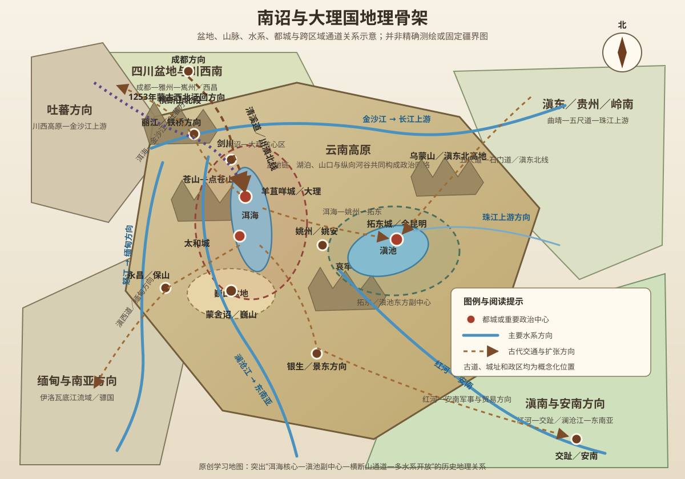
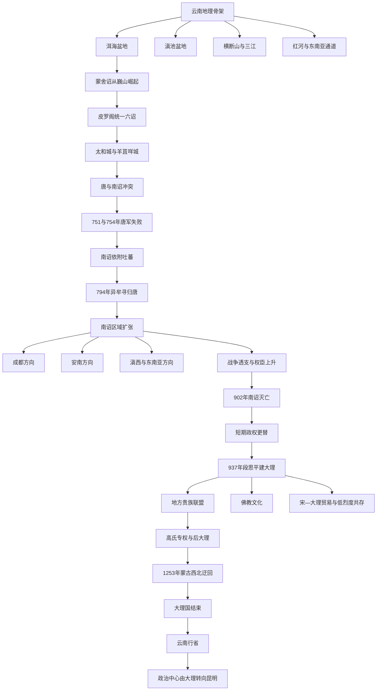

# 第十一章　从南诏到大理

- **创建日期**：2026-07-29
- **状态**：初版，已配原创历史地理示意图与独立时间轴
- **关键词**：南诏、大理国、六诏、洱海、苍山、巍山、太和城、羊苴咩城、拓东城、唐朝、吐蕃、天宝战争、段思平、茶马古道、南方丝绸之路、蒙古征大理
- **章节性质**：围绕原书章节主题展开的原创历史地理学习指南，不逐段复述原书

## 章节概览

唐宋时期的云南并不是一个与外界隔绝的山地角落。它位于青藏高原东南缘、四川盆地西南侧、东南亚大陆北部与珠江—红河—澜沧江—怒江多条水系之间，是东亚内陆、藏区、南亚和东南亚交通网络的交会地。南诏与大理国能够先后维持五百余年的区域性政权，关键不只是某位君主的军事才能，而是它们把洱海盆地、滇池盆地、滇西河谷和通往周边世界的交通节点组织成了一个多层网络。

南诏最初从洱海以南的蒙舍诏崛起，在唐朝支持及自身扩张下统一六诏，随后以太和城、羊苴咩城为政治中心。它既接受唐朝册封，也在唐与吐蕃之间调整联盟；既依赖高原盆地的农业和马匹，又通过山口、河谷和驿路连接成都、安南、藏区与缅甸方向。天宝年间唐军两次大败，说明强大的平原帝国进入西南高原后，仍会受到距离、瘴疫、道路和补给的严格限制。

南诏于902年灭亡后，云南经历大长和、大天兴、大义宁等短期政权，段思平于937年建立大理国。大理国延续洱海中心格局，却比晚期南诏更重视内部联盟、地方贵族合作、佛教文化和对宋朝的谨慎交往。1253年蒙古军从西北方向进入云南，绕开传统的川滇正面路线，突破金沙江与滇西北山地，大理国失去独立政权地位。元代设置云南行省后，政治中心逐渐由大理转向更便于连接中原和滇东的昆明。

本章的核心结论是：

> 南诏与大理国的长期存在，不是“山高皇帝远”这一句话就能解释，而是洱海盆地的中心性、山地通道的可控性、跨区域贸易的收益，以及在唐、吐蕃、宋、蒙古等强大力量之间进行战略平衡共同作用的结果。

---

## 一、地理环境：云南不是一块高原，而是一串被山河连接的盆地与走廊

### 1. 青藏高原东南缘的阶梯地形

云南整体位于中国地势第二级阶梯的西南部，西北高、东南低。西北部接近青藏高原，横断山脉把地表切割成多条南北向高山和深谷；中部、东部则分布着许多高原盆地与湖泊；南部地势逐步下降，连接红河、澜沧江和伊洛瓦底江流域。

这种地理结构带来两个相反效果：山脉提高了外部军队进入的成本，却也把人口、农田和城镇压缩到少数盆地与河谷中。谁能控制这些节点，谁就不必均匀占领所有山地，也可能支配大范围交通和政治关系。

### 2. 洱海盆地为何成为五百年政治中心

洱海东有山地，西有苍山，湖泊与山麓之间形成狭长而连续的农业、聚落与交通带。这里海拔适中，水源较稳定，盆地可提供稻作、麦作、畜牧和人口基础；苍山与洱海又形成天然屏障，使敌军难以从多个方向同时展开。

洱海盆地的优势不在于面积最大，而在于位置居中：

- 向南可达巍山、红河上游和滇南；
- 向东可经祥云、姚安进入滇池盆地；
- 向北可经剑川、丽江联系金沙江与吐蕃方向；
- 向西可经漾濞、永昌进入怒江、伊洛瓦底江和缅甸方向。

因此，洱海既是农业盆地，也是一个区域交换平台。南诏与大理国长期在此建都，是对交通中心性、粮食基础和防御条件的综合选择。

### 3. 巍山盆地：南诏从边缘起家

蒙舍诏大致兴起于今巍山一带，位于洱海盆地南侧。巍山盆地规模不大，却处在洱海、滇西南、红河源区和哀牢山北段之间。对早期蒙舍诏而言，这里既能积累农业与人口，又能利用山地阻隔避免被北部其他诏迅速吞并。

“蒙舍”位于六诏之南，因而被称为“南诏”。它从相对边缘的盆地出发，逐步向北进入洱海核心区，体现了一个常见的政治地理过程：边缘势力先在安全空间内完成组织，再夺取更高连接度的中心。

### 4. 滇池盆地与拓东城：东方副中心

滇池盆地比洱海盆地更接近滇东、贵州和通往中原的道路。南诏经营拓东城，大理国继续重视这一地区，使今昆明一带逐渐成为云南东方的军事、行政和交通中心。

但在南诏、大理国时期，滇池盆地尚未完全取代洱海。原因在于洱海更接近政权发源地、滇西贵族网络和西南国际通道；滇池则更适合作为面向东部的前沿与副中心。直到元代把云南纳入全国行省网络后，昆明的区位优势才被更充分放大。

### 5. 横断山脉与三江并流：天然屏障也是纵向通道

怒江、澜沧江和金沙江在滇西北大体平行南流，河谷深切，横向跨越极难。对从四川或西藏进入云南的军队而言，跨越一条江并不意味着道路已经打通，后面往往还有新的山岭、峡谷和渡口。

然而，这些河谷也提供南北方向的迁徙和贸易走廊。地方政权若能控制渡口、桥梁、峡谷口和沿线补给点，就能把看似破碎的山地组织成通道网络。南诏与吐蕃争夺“铁桥”及滇西北要地，实质上是在争夺金沙江沿线的交通门锁。

### 6. 四大水系与多方向开放

云南并非只向中原开放，而是同时面向多个水系世界：

| 水系或方向 | 主要通往区域 | 历史意义 |
|---|---|---|
| 金沙江—长江上游 | 四川盆地、成都 | 唐朝册封、战争、人员与技术输入的主要方向 |
| 珠江上游 | 贵州、广西、岭南 | 连接滇东与华南，影响滇池盆地的重要性 |
| 红河 | 滇南、安南北部 | 南诏向交趾扩张、贸易与军事南进的重要轴线 |
| 澜沧江、怒江及滇西山道 | 缅甸、南亚与东南亚内陆 | 马匹、金属、盐、香料、宝石和宗教文化交流网络 |

所谓“南方丝绸之路”或“茶马古道”，不应理解为一条固定笔直的道路，而应理解为由山道、河谷、驿站、市场、渡口和地方势力共同组成的多线路系统。

### 7. 海拔差异创造复合经济

云南在较短距离内存在巨大的海拔和气候差异。高寒地区适合畜牧和马匹，中部盆地适合稻麦农业，温暖河谷可生产热带、亚热带物产。盐井、金银铜矿、马匹、药材、茶叶和森林产品，使区域交换具有持续动力。

这种垂直生态并不自动产生统一国家，但会推动不同地区相互依赖。政权可以通过市场、贡赋、道路保护和军事控制，把生态差异转化为财政与政治资源。

### 8. 原创历史地理示意图

> 下图为学习用途的原创示意图，强调盆地、山脉、水系、政治中心和交通方向的关系，不是精确测绘地图；古代道路、政区与民族分布均会随时代变化。

---

## 二、历史背景：南诏崛起前的云南已经存在多层政治与交通网络

### 1. 汉帝国进入西南，但控制并不均匀

西汉经营西南夷，设置益州郡等政区；东汉进一步设置永昌郡，说明中原王朝已注意到滇西通往更远西南地区的价值。但郡县主要依赖盆地、道路和地方首领维持，山地社会并未因此被均匀改造。

汉晋之后，中原王朝在云南的直接控制反复变化。中央政权的名称可能出现在地图上，但实际治理常由地方大姓、部落首领和区域联盟承担。

### 2. 爨氏长期经营滇东与滇中

魏晋南北朝至隋唐之际，爨氏在滇东、滇中拥有强大影响。其力量建立在滇池盆地、曲靖盆地、地方部众和通向四川、贵州的道路上。爨氏并不是南诏的简单前身，却构成南诏统一云南过程中必须面对的重要区域力量。

滇东与洱海地区长期保持不同政治中心，说明云南统一不是自然形成，而是需要通过军事、婚姻、册封、迁徙和行政重组不断完成。

### 3. 唐朝设置姚州都督府，试图控制川滇通道

唐朝建立后，在今姚安等地设置姚州都督府及羁縻州县，利用地方首领治理西南。姚州位于四川进入洱海、滇池之间的重要节点，既是行政据点，也是唐朝防止吐蕃向东南扩张的前沿。

但唐朝的直接控制仍受距离限制。成都至洱海路途遥远，山岭、河流、雨季、疾病和沿线地方关系都会影响军政命令的执行。

### 4. 唐与吐蕃竞争为地方势力提供上升空间

7—8世纪，吐蕃从青藏高原向东南扩张，唐朝则希望稳定四川西南边疆。洱海地区的地方政权不只是被动对象，它们可以利用两大强权之间的竞争争取封号、军援、贸易和自治空间。

南诏的崛起因此不是孤立事件，而是三种力量互动的结果：地方政权的内部整合、唐朝的边疆战略、吐蕃的高原扩张。

---

## 三、关键事件之一：统一六诏，南诏从巍山走向洱海中心

### 1. “六诏”不是六个边界固定的小国家

唐代文献所说的六诏，通常包括蒙舍诏、蒙巂诏、越析诏、浪穹诏、邆赕诏、施浪诏等，具体名称、位置和势力范围在不同文献中存在差异。“诏”大致指君长或以君长为中心的政治集团。

六诏更像围绕盆地、村落、部众和山道形成的区域势力，并非现代意义上拥有精确国界、统一户籍和固定官僚体系的六个国家。

### 2. 细奴逻奠定蒙舍诏基础

7世纪中叶，细奴逻时期的蒙舍诏逐渐强大，并与唐朝建立朝贡和册封关系。接受唐朝名号可以提高其在地方政治中的合法性，也有利于获得贸易、武器、礼物和外交支持。

但册封并不意味着南诏只是唐朝命令下的普通州县。双方关系更接近不对称联盟：唐朝提供名义秩序，地方君长保留高度自主，并根据区域形势调整行动。

### 3. 皮罗阁统一六诏

8世纪上半叶，皮罗阁逐步兼并或控制其他五诏。唐朝出于制衡吐蕃和稳定洱海地区的考虑，对这一整合给予支持，并于738年前后册封皮罗阁为云南王。

唐朝的策略在短期内降低了管理成本，却也帮助一个地方盟友成长为能够独立影响西南格局的区域强权。这是帝国边疆政策的典型悖论：扶植代理人可以解决眼前问题，也可能创造未来的竞争者。

### 4. 从巍山迁向太和城

南诏统一六诏后，把政治中心北移至洱海西岸的太和城一带。这个迁移具有明确的地理逻辑：巍山适合起家，洱海更适合统治。

太和城位于苍山与洱海之间，能够控制南北狭长通道，也便于联系各盆地。政权从地方山间盆地进入区域交通中心，标志着南诏由部落联盟型势力向更成熟的国家组织转变。

---

## 四、关键事件之二：天宝战争——唐朝为何在云南遭遇惨败

### 1. 冲突并非突然发生

皮罗阁去世后，阁罗凤继位。南诏与姚州地方官员之间因礼仪、征求、边界和权力关系不断恶化。750年前后，阁罗凤攻杀云南太守张虔陀，唐与南诏关系彻底破裂。

如果只把冲突解释为个人侮辱，就会忽略结构性矛盾：南诏已经完成区域整合，不再愿意接受地方官吏以早期弱小盟友的方式对待；唐朝则仍希望维持册封体系中的上下秩序。

### 2. 751年鲜于仲通进军失败

剑南节度使鲜于仲通率大军从四川进入云南。唐军必须穿越山地和河谷，补给线漫长，士兵不适应高原与湿热环境。阁罗凤曾试图解释或议和，但唐军继续进逼太和城，最终遭到惨败。

南诏的优势并非单纯兵力更多，而是：

- 熟悉道路、渡口与水源；
- 可以集中力量守卫狭窄通道；
- 唐军离开四川基地越远，运输效率越低；
- 疾病、气候和粮食消耗持续削弱外来军队；
- 南诏可以借助吐蕃牵制唐朝。

### 3. 754年李宓再次失败

唐廷再次征集大军，由李宓进攻南诏。军队深入洱海地区后，仍面临补给不足、瘴疫、地形不利和情报失真等问题，再次在太和城附近失败。

两次战争说明，地图上的直线距离不能代表军事成本。成都拥有庞大人口和物资，并不等于这些资源能无损运到洱海。运输路上的每一道山口、每一条河流和每一天行军，都会消耗兵力。

### 4. 南诏转向吐蕃

唐军进攻使阁罗凤转而臣属于吐蕃，接受吐蕃封号和金印。南诏并非在文化上突然“变成吐蕃”，而是在生存压力下改变联盟。

对夹在强国之间的区域政权而言，外交忠诚往往具有条件性。只要外部安全环境改变，联盟就可能重新调整。

### 5. 战争对唐朝西南战略的影响

天宝战争消耗大量兵力和财政，边疆社会承受征发与运输压力。它不是安史之乱的单一原因，却暴露出唐朝后期边疆扩张中的资源透支、信息失真和地方官治理失败。

地理限制本可以通过谨慎外交降低，却因决策层低估运输成本、夸大军事能力而转化为灾难。

---

## 五、关键事件之三：在唐与吐蕃之间重新平衡

### 1. 吐蕃保护也带来负担

南诏依附吐蕃后，获得北方军事支持，但也承担兵役、赋税和人质等压力。吐蕃在滇西北设置据点、控制交通，会压缩南诏的自主空间。

这说明弱国投靠强国并不等于获得免费安全。保护关系往往伴随资源征取和战略服从。

### 2. 异牟寻推动归唐

异牟寻时期，南诏在清平官郑回等人的建议及唐朝西川节度使韦皋的招抚下，逐步谋求脱离吐蕃。794年前后，双方在点苍山一带盟誓，南诏重新接受唐朝册封。

这次“归唐”不是回到早期状态。经历天宝战争后，南诏已成为更成熟的区域政权，唐朝也更清楚直接征服的高昂成本。双方合作以共同对付吐蕃为现实基础。

### 3. 铁桥与滇西北要地

南诏攻击吐蕃控制的铁桥及周边城堡，切断或削弱其进入云南的通道。铁桥具体位置和古今对应仍有讨论，但其战略功能十分清楚：谁控制金沙江渡口和滇西北道路，谁就能决定高原势力是否顺利进入洱海地区。

地理节点的价值常常高于大片无人山地。一座桥、一个渡口或一个峡谷口，可能影响数百里边疆。

### 4. 联盟不是永久和平

南诏归唐后仍保持独立行动能力。到9世纪，南诏势力扩张，多次进攻唐朝边地，甚至于829年攻入成都外郭，掠走人口、工匠和财物；又在9世纪中叶与唐争夺安南。

这说明册封、朝贡和文化交流不能简单等同于现代主权归属。唐与南诏之间同时存在礼仪关系、贸易往来、军事合作和边界竞争。

---

## 六、国家形成：南诏如何把多民族山地组织成区域政权

### 1. 以盆地为核心，而非均匀控制山地

南诏的有效统治首先集中在洱海、滇池、姚安、永昌等盆地和主要道路。远离交通线的山地部落可能通过贡赋、军事协助、首领册封或松散联盟与中央联系。

因此，南诏版图应理解为控制强度不同的层级网络：都城和核心盆地控制最强，节度和城镇次之，边远部落与交通末端更具自主性。

### 2. 迁都羊苴咩城

异牟寻时期，南诏政治中心进一步转向羊苴咩城，即今大理古城及其周边区域。这里位于苍山山麓、洱海西岸，北接剑川，南通巍山，东可越洱海联系滇中，西可进入漾濞和永昌。

从太和城到羊苴咩城，并不是离开洱海核心，而是在同一地理走廊中优化都城位置和城市规模。

### 3. 多层行政与军事节点

南诏设置节度、都督、赕等不同层级的军政单位，并在拓东、永昌、银生、剑川等地建立区域中心。制度名称受到唐朝影响，但实际运作结合了本地首领、部族关系和军事组织。

国家能力不是把唐制原样复制到云南，而是把外来制度语言与本地社会结构结合。

### 4. 人口迁徙与工匠吸收

南诏在战争中掳掠或迁徙人口，也吸收汉地工匠、文士、僧侣和技术。成都等地的手工业者进入云南，有助于纺织、建筑、冶金和城市文化发展。

这类迁徙具有强制性和战争伤害，不能浪漫化；但从长期历史看，它也改变了区域技术和文化结构。

### 5. 佛教、文字与政治合法性

佛教在南诏后期和大理国时期不断发展，成为连接王权、贵族、寺院和跨区域文化的重要力量。汉字用于碑刻、外交和行政，梵文及佛教艺术又把云南连接到印度、东南亚和藏传佛教世界。

南诏德化碑等材料显示，政权会利用文字解释战争、盟约和王权，把政治选择转化为可传承的历史叙事。

---

## 七、从南诏灭亡到大理国建立

### 1. 长期战争削弱南诏

9世纪后期，南诏持续对唐、安南和周边地区发动战争，财政、人口和地方社会承受沉重压力。王权内部斗争加剧，权臣势力上升，中央对各地区的整合能力下降。

山地政权一旦失去对道路、军队和地方贵族的协调，地理屏障不会自动保护王朝，反而会加速地方割裂。

### 2. 902年郑买嗣取代蒙氏

902年，权臣郑买嗣结束蒙氏南诏，建立大长和国。此后云南又经历大天兴、大义宁等短期政权。政权更迭频繁，说明旧王朝的合法性与联盟结构已经崩解，但洱海—滇中这一政治空间仍然延续。

王朝名称改变，并不等于城市、道路、人口和区域经济重新开始。真正持续的是地理骨架与地方社会。

### 3. 段思平依靠滇东三十七部

937年，通海节度使段思平联合滇东等地势力，推翻大义宁，建立大理国。部分研究因纪年换算采用938年，本章按照较常见的937年记法。

段思平的成功说明，仅控制洱海都城不足以建立稳定王朝，还需要获得滇东、滇中和地方部族集团支持。大理国从建立之初就更明显地表现出联盟型政治特征。

### 4. “大理”名称的政治含义

“大理”既是国号，也逐渐成为区域名称。常见解释把它与“理”联系到治理、整顿或礼义秩序，但确切词源仍有讨论。无论名称如何解释，段氏需要用新国号与南诏末期连续政变和战争相区分，重建政治正当性。

---

## 八、大理国：为何能在宋代相对稳定三百余年

### 1. 宋朝的战略重心不在云南

北宋面临辽、西夏等北方压力，南宋又与金对峙，缺乏大规模远征云南的动力。四川至大理的道路成本很高，而大理国对宋朝并未形成必须立即消灭的威胁。

后世常用“宋太祖玉斧划大渡河”为界解释宋朝不取云南，但这一故事的形成和细节存在争议。更可靠的解释是：宋朝基于北方战略、四川安全和远征成本，选择以贸易、册封和边境管理代替直接征服。

### 2. 大理国更依赖地方贵族合作

大理国沿用南诏部分制度，又通过段氏王族、高氏权臣、地方部族和寺院共同维持秩序。中央权力并非绝对集中，地方势力拥有较大空间。

这种结构的缺点是容易形成权臣政治，优点是降低了中央强行控制复杂山地社会的成本。只要利益分配和交通网络能够维持，松散结构也可能长期稳定。

### 3. 高氏专权与“大中国”插曲

11世纪后期，高氏权力上升。1094年，高升泰取代段氏，建立“大中国”；1096年其死后，段氏复国，史学上常把之后阶段称为“后大理国”。

这次政权替换时间很短，却反映大理国的真实权力并不完全掌握在国王手中。段氏王权、高氏行政军事力量和地方联盟相互制衡。

### 4. 佛教王国不等于全民出家

大理国佛教兴盛，多位国王晚年出家，寺院拥有重要文化与政治地位，因此后世有“妙香佛国”之称。但这不意味着社会只围绕宗教运行。

农业、盐业、畜牧、手工业、马匹贸易和地方赋役仍是国家基础。佛教的作用在于提供跨地区共同语言、王权合法性、教育与艺术网络，并帮助不同族群建立共享文化空间。

### 5. 与宋朝的贸易和外交

大理国与宋朝保持使节、册封和边境贸易关系。云南马匹、药材和地方产品进入四川，汉地的书籍、器物、技术和佛教文本进入云南。

宋朝需要西南马匹，却又担心边境势力和交通风险，因此关系常表现为有限开放而非完全自由。边境贸易既是经济行为，也是安全政策。

### 6. 大理国的稳定来自“低烈度平衡”

与晚期南诏频繁远征相比，大理国总体上较少主动挑战宋朝，也较少卷入持续的大规模对外战争。它把资源更多用于维持内部联盟和区域贸易。

这并不意味着大理国没有冲突，而是其国家战略更符合地理承载力：在高运输成本环境中，维持节点和关系往往比追求无限扩张更可持续。

---

## 九、为什么地理如此重要：六个决定性机制

### 1. 盆地链决定国家必须采用节点式治理

云南缺少连续大平原，人口和粮食分布在洱海、滇池、曲靖、姚安、保山等盆地。中央无法像在华北平原那样沿连续耕地推进，只能控制盆地、城镇和连接道路。

因此，南诏、大理国的统治更像网络，而不是均匀覆盖的平面。

### 2. 洱海让防御、农业与交通三者结合

都城既需要粮食，也需要安全和道路。洱海盆地同时具备这三项条件，使其比单纯险峻的山城更适合长期建都。

真正可持续的首都通常不是最难攻的地方，而是防御成本、供养能力和外部联系之间最平衡的地方。

### 3. 唐、吐蕃之间的位置创造外交选择

南诏可以从唐朝获得册封、技术和贸易，也可以借吐蕃抵抗唐军；之后又能利用唐朝反制吐蕃。这种“夹缝生存”并不轻松，却增加了谈判空间。

但平衡外交只有在自身具有军队、交通节点和资源基础时才有效。没有内部能力，地缘位置只会带来反复入侵。

### 4. 山地提高入侵成本，也提高内部治理成本

外军难以进入，中央官员同样难以深入。山地既保护南诏、大理国免受快速吞并，也使地方首领保持较强自主性。

所以，地理屏障不是单向优势。它要求国家以联盟、册封、婚姻、宗教和市场补充直接行政。

### 5. 多水系位置使云南成为跨区域交换站

云南可以同时联系四川、藏区、安南、缅甸和东南亚。贸易带来马匹、金属、盐、茶、药材、工艺和宗教文化，也使政权能够从道路保护和市场控制中获益。

南诏、大理国的实力不仅来自本地生产，还来自中转与连接。

### 6. 蒙古取大理证明路线创新可以击穿传统防线

南诏和大理长期重点防备四川南下路线。1253年，蒙古军从滇西北方向进入，利用高原骑兵机动和不同进军轴线，跨越金沙江后直逼洱海。

防御体系若过度依赖既有威胁模型，一旦敌人改变路线，过去的地理优势就可能失效。

---

## 十、蒙古征大理与云南政治中心东移

### 1. 蒙古为何选择先取大理

蒙古与南宋战争长期受四川山地和长江防线阻挡。控制大理可以从西南侧威胁南宋，也能获得云南的马匹、人口和道路资源，并连接吐蕃地区与东南亚方向。

这是一种大尺度迂回战略：不是只攻正面最坚固的防线，而是改变整个战场的地理结构。

### 2. 1253年从西北进入云南

忽必烈率军经藏区和川西南向滇西北推进，传说以皮囊渡过金沙江，即“革囊渡江”。具体路线细节在不同史料中有差异，但战略特点明确：蒙古军避开了传统由四川盆地正面进入滇中的道路。

大理国试图依托山川防守，却未能阻止蒙古军快速接近洱海核心。

### 3. 大理城失守与段氏延续

蒙古军攻占大理后，大理国王段兴智最终归降。蒙古并未完全消灭原有地方精英，而是利用段氏及地方势力继续治理部分地区。

这与此前唐、南诏、大理的边疆治理逻辑相似：征服者要把军事胜利转化为税收和秩序，仍需借助本地网络。

### 4. 云南行省与昆明崛起

元代逐步设置云南行省，政治中心转向中庆路，即今昆明。昆明更接近滇东交通、贵州方向和通往中原的全国驿路，也便于统筹云南东部、南部与西部。

洱海盆地适合区域王国，大理因此长期居中；昆明更适合一个以中原王朝为中心的省级行政网络。首都东移反映的不是大理自然条件突然变差，而是国家尺度和交通方向改变了。

---

## 十一、作者观点：地理决定问题，不直接决定答案

本章可提炼出原书历史地理方法的几条主线。以下是学习性概括，不等同于对作者原文的逐字转述。

### 1. 历史事件必须放回路线与距离中

“唐军征南诏”“蒙古灭大理”若只写在时间轴上，看起来都是军队从甲地到乙地。加入山岭、河流、季节、补给和道路后，两场战争的差异才真正显现。

### 2. 边疆不是中心王朝的空白外圈

云南在唐宋时期拥有自己的政治中心、城市体系、宗教文化和国际联系。研究南诏、大理国，不能只问它们与中原王朝是什么关系，还要问它们如何组织云南内部，并如何与吐蕃、安南、缅甸等地区互动。

### 3. 册封关系不等于完全控制

唐册封南诏王、宋册封大理国王，说明双方存在政治秩序与外交关系，但不意味着中央官员能够直接任免地方所有官职、征收全部赋税或调动全部军队。

理解古代边疆，需要区分名义隶属、外交臣属、军事联盟、羁縻治理和直接行政。

### 4. 地理优势必须由组织能力兑现

苍山洱海提供安全，六诏却长期并立；只有蒙舍诏建立更强联盟、军队和外交能力后，地理中心才被转化为国家中心。

地理提供机会，政治组织决定谁能使用机会。

---

## 十二、深度分析：五个容易被忽略的问题

### 1. 南诏究竟是唐朝地方政权，还是独立王国

用现代二元概念很难准确描述。南诏接受唐朝册封、朝贡并使用部分唐制，同时拥有世袭王权、独立军队、外交选择和对外战争能力。它在不同时期与唐的关系也不同：有时是盟友和藩属，有时是敌国，有时又恢复册封。

更合适的理解是：南诏属于唐代东亚多层政治秩序中的区域王国，其自主程度会随力量对比变化。

### 2. “乌蛮”“白蛮”能否直接对应今天的民族

唐代文献中的乌蛮、白蛮是历史语境中的分类，可能同时包含生活方式、语言、服饰、地域和政治关系等因素，不能机械等同于今天单一民族。

现代白族、彝族等民族的形成经历长期迁徙、融合和身份重构。研究南诏时，应避免把古代人群直接套入现代民族边界，也不应以单一民族独占整个南诏历史。

### 3. 为什么大理国比晚期南诏更少对外扩张

一方面，宋朝军事重心在北方，双方缺少持续正面冲突；另一方面，大理国吸取南诏后期战争过度的教训，更依赖地方联盟和贸易收益。其政治结构也更分散，难以长期动员全国资源进行远征。

因此，“和平”既可能来自战略克制，也可能来自国家动员能力有限。

### 4. 佛教为何在大理国具有特殊政治作用

云南族群和地方势力多样，佛教提供了跨部族、跨地域的共同符号。寺院可以承担教育、文书、仪式和精英交往功能，国王出家则可能成为处理继承、政治退场和合法性问题的一种方式。

佛教不是脱离现实政治的纯精神现象，而是国家整合的一部分。

### 5. 为什么元代以后昆明取代大理

南诏、大理国以滇西为核心，需要联系吐蕃、缅甸与洱海周边势力；元朝则需要把云南连接到四川、贵州、湖广和全国行政体系。交通重心从区域内部网络转向帝国东向网络，昆明的优势随之上升。

城市兴衰往往不是由城市自身决定，而是由它所在网络的尺度和方向决定。

---

## 十三、长期影响

### 1. 云南区域整体性得到加强

南诏首次在较大程度上把洱海、滇池、滇东、滇西和滇南纳入同一政治体系；大理国又延续三百余年。虽然控制强度并不均匀，但“云南作为一个区域整体”的政治基础由此加深。

### 2. 大理成为长期文化中心

南诏、大理国的都城、寺院、碑刻、塔寺和艺术传统，使大理成为云南历史文化核心。崇圣寺三塔、佛教造像和相关文献见证了本地文化与汉地、藏区、南亚、东南亚交流。

### 3. 跨区域道路持续影响后世

川滇道、滇藏道、滇缅道和滇越方向在元明清继续被驿道、茶马贸易、军路和商路利用。现代公路与铁路虽然技术完全不同，许多仍沿用古代盆地链与河谷节点。

### 4. 地方精英合作成为边疆治理传统

从唐朝扶植南诏，到蒙古利用段氏，再到元明清的土官、土司制度，中央政权长期借助本地首领治理复杂山地。直接行政与地方代理并存，是西南边疆治理的长期特征。

### 5. 云南从区域王国转入行省体系

蒙古征服大理后，云南不再以独立区域王国的形式存在，而逐步成为全国行省体系的一部分。政治中心东移、驿路重建、军屯和行政扩展，使云南与中原联系进一步制度化。

---

## 十四、现代启示

### 1. 基础设施首先改变“可达性”，然后改变政治经济中心

古代从成都到洱海需要跨越多重山河，现代高速公路、铁路、隧道和桥梁大幅降低时间成本。昆明、大理、保山、瑞丽等城市的功能变化，本质上与交通网络重构有关。

### 2. 边缘地区也可能是更大网络的中心

从中原看，云南位于西南边缘；从东南亚大陆、藏区和长江上游的交会网络看，云南又处于中心。评价一个地区的位置，必须先说明以哪个网络为参照。

### 3. 组织的扩张不能超过后勤承载力

唐军远征失败、南诏晚期战争透支，都说明资源数量不等于可投送能力。现代企业、城市与国家同样需要区分账面资源和能够稳定送达前线的资源。

### 4. 平衡战略需要内部实力

南诏能够在唐与吐蕃之间调整，是因为它掌握洱海核心、军队和关键通道。没有自身能力的“左右逢源”只是幻想。

### 5. 多中心治理有时比过度集中更适合复杂地形

大理国依赖地方贵族和区域节点，中央集权程度有限，却能维持较长时间。现代公共治理也应根据交通、生态和社会差异设计层级，而不是假设所有地区都适合同一管理密度。

### 6. 历史文化不能被单一民族或单一王朝独占

南诏、大理国由多种人群、语言、宗教和政治传统共同塑造。承认共同创造，比争论某个政权“只属于谁”更符合历史实际。

---

## 十五、古今地名对照

| 古代名称 | 大致现代位置 | 历史功能 | 阅读提醒 |
|---|---|---|---|
| 蒙舍诏 | 云南省大理州巍山一带 | 南诏发源地 | “南诏”最初因其位于六诏之南而得名 |
| 巍山／蒙舍川 | 今巍山县及周边盆地 | 早期政治与农业基地 | 古城位置与势力范围不可完全等同现代县界 |
| 太和城 | 今大理市太和村、苍山佛顶峰麓一带 | 南诏早期都城、天宝战争核心地区 | 与今天“大理古城”不是同一城址 |
| 羊苴咩城 | 今大理古城及周边区域 | 南诏后期、大理国都城 | 古城范围与现代旅游古城边界不完全相同 |
| 西洱河 | 多指洱海及其周边水域、区域，语义随文献变化 | 洱海政治和交通核心 | 不能简单理解为今天某一条河流 |
| 叶榆 | 今大理、洱海周边 | 汉代以来的重要县与区域名称 | 不同时期辖境有变化 |
| 拓东城 | 今昆明市区一带 | 南诏东部军事、行政中心 | 后来善阐府、中庆路与昆明中心性逐步增强 |
| 姚州 | 今楚雄州姚安县及周边 | 唐朝进入云南的重要据点 | 是川滇道路节点，不等同现代姚安县全部范围 |
| 嶲州 | 今四川西昌及安宁河谷一带 | 成都通云南的北部枢纽 | 唐代辖境随时代变化 |
| 泸水 | 唐代西南文献中多与金沙江相关，具体河段需结合语境 | 唐军南下的重要障碍 | 不应自动等同今日怒江的别称“潞江” |
| 铁桥 | 金沙江上游或滇西北重要渡桥，具体地望有争议 | 南诏与吐蕃争夺的交通门锁 | 重点理解战略功能，而非强求唯一坐标 |
| 永昌 | 今保山及滇西地区 | 通往缅甸和西南交通的中心 | 汉代永昌郡与后世永昌府范围不同 |
| 银生 | 大致在今景东、普洱北部及周边 | 南诏南部军政与交通区域 | 具体治所和辖境存在讨论 |
| 安南／交趾 | 今越南北部，以河内周边为核心 | 南诏与唐朝争夺的南方区域 | 古代政区不等同现代越南国界 |
| 大渡河 | 今四川西部大渡河 | 宋与大理之间的重要地理分界之一 | “玉斧划界”故事需谨慎看待 |
| 中庆路 | 今昆明一带 | 元代云南行省政治中心 | 标志全省网络由洱海中心向滇池中心转移 |

---

## 十六、时间轴

| 时间 | 事件 | 历史地理意义 |
|---|---|---|
| 前2世纪 | 汉朝经营西南夷，设置益州郡等 | 中原郡县、道路与地方首领网络进入云南 |
| 1世纪 | 东汉设置永昌郡 | 滇西与缅甸方向的交通价值受到重视 |
| 魏晋南北朝 | 爨氏长期影响滇东、滇中 | 云南形成洱海与滇池等多区域政治中心 |
| 7世纪中叶 | 细奴逻时期蒙舍诏兴起 | 巍山盆地成为南诏早期基地 |
| 738年前后 | 皮罗阁统一六诏并受封云南王 | 洱海地区由多中心竞争走向区域整合 |
| 739年前后 | 南诏迁向太和城 | 政治中心由巍山边缘转入洱海交通核心 |
| 750年 | 阁罗凤攻杀张虔陀 | 唐—南诏地方矛盾升级为全面战争 |
| 751年 | 鲜于仲通进攻南诏失败 | 山地、补给、疾病与情报问题击败远征军 |
| 754年 | 李宓大军再次败于太和城附近 | 唐朝直接征服云南的高成本得到验证 |
| 750年代 | 南诏依附吐蕃 | 南诏利用唐蕃竞争维持生存与扩张 |
| 779—794年间 | 异牟寻经营羊苴咩城并谋求归唐 | 洱海都城体系成熟，外交重心调整 |
| 794年 | 南诏与唐盟誓、脱离吐蕃 | 唐—南诏合作共同改变滇西北力量格局 |
| 829年 | 南诏攻入成都外郭 | 南诏已具备跨越川滇山地远征能力，但战争成本巨大 |
| 860年代 | 南诏与唐争夺安南 | 红河通道使云南政治影响进入东南亚北部 |
| 902年 | 郑买嗣灭南诏，建大长和 | 蒙氏王朝结束，区域政治骨架继续存在 |
| 902—937年 | 大长和、大天兴、大义宁相继更替 | 洱海中心未变，但联盟与合法性持续重组 |
| 937年 | 段思平建立大理国 | 滇东三十七部与洱海中心形成新联盟 |
| 10—11世纪 | 大理国与宋朝维持册封、贸易和边境关系 | 高运输成本促成低烈度共存 |
| 1094年 | 高升泰建立大中国 | 高氏权臣掌握实际政治力量 |
| 1096年 | 段氏复国，进入后大理阶段 | 王权与高氏、地方贵族形成新的平衡 |
| 1253年 | 忽必烈率蒙古军进入云南、攻占大理 | 西北迂回路线突破传统川滇防御体系 |
| 1254年后 | 段氏归降并参与地方治理 | 军事征服与利用本地精英结合 |
| 1270年代 | 元朝建立云南行省体系 | 云南纳入全国行政与驿路网络 |
| 元代以后 | 政治中心逐渐转向昆明 | 国家尺度和东向交通使滇池盆地取代洱海中心 |

详细时间轴见：[第十一章配套时间轴](../Timeline/Chapter11_南诏与大理国历史地理时间轴.md)。

---

## 十七、思维导图

---

## 十八、参考资料

### 1. 基本文献

1. 司马迁：《史记·西南夷列传》。
2. 班固：《汉书·西南夷两粤朝鲜传》。
3. 刘昫等：《旧唐书·南诏蛮传》。
4. 欧阳修、宋祁等：《新唐书·南蛮传》。
5. 樊绰：《蛮书》。
6. 《南诏德化碑》。
7. 脱脱等：《宋史·大理国传》。
8. 宋濂等：《元史·世祖本纪》《地理志》。
9. 李京：《云南志略》。

### 2. 现代研究

1. 方国瑜：《中国西南历史地理考释》。
2. 方国瑜：《云南史料目录概说》。
3. 尤中：《中国西南民族史》。
4. 段玉明：《大理国史》。
5. 方铁：《南诏大理国兴衰史》，岳麓书社，2023。
6. 李宇舟：《南诏国大理国政区设置与城镇发展史》，云南大学出版社，2021。
7. 李吉星：《南诏国大理国政治制度史》，云南大学出版社，2021。
8. 段丽波：《南诏国大理国民族史》，云南大学出版社，2021。

### 3. 在线延伸阅读

1. [《旧唐书》卷197“南诏蛮”](https://zh.wikisource.org/zh-hans/%E8%88%8A%E5%94%90%E6%9B%B8/%E5%8D%B7197)
2. [《新唐书》卷222上“南诏”](https://zh.wikisource.org/zh-hans/%E6%96%B0%E5%94%90%E6%9B%B8/%E5%8D%B7222%E4%B8%8A)
3. [大理白族自治州人民政府：宋代（大理国时期）](https://www.dali.gov.cn/dlzrmzf/c101711/pc/content/1968886764683759616/content_1968886764683759616.html)
4. [全国哲学社会科学工作办公室：《大理国史研究》成果简介](https://www.nopss.gov.cn/GB/219506/219508/219522/14640080.html)
5. [云南省民族宗教事务委员会：云南省博物馆唐宋云南展览介绍](https://mz.yn.gov.cn/html/2024/gongzuodongtai_0517/53993.html)

> 说明：南诏、大理国的纪年、族属、城址、道路和政区存在不同学术解释。本章采用适合学习的通行框架，并对争议处尽量明确提示。

---

## 十九、章节总结

南诏与大理国的历史，是云南地理从自然空间转化为政治网络的过程。蒙舍诏从巍山盆地起家，夺取洱海中心后统一六诏；唐朝的册封帮助其崛起，唐朝的轻率远征又把它推向吐蕃。南诏随后在唐与吐蕃之间重新平衡，并把影响扩展到成都、安南和滇西交通网络，却因长期战争和内部权力斗争走向灭亡。

大理国继承了南诏的城市、道路和区域框架，却采用更谨慎的外部战略与更明显的地方联盟治理。它与宋朝长期共存，依靠洱海盆地、跨区域贸易、佛教文化和地方贵族合作维持三百余年。蒙古军最终通过西北迂回路线突破传统防御，说明任何地理屏障都不是永久安全；当国家尺度和交通方向改变，政治中心也会随之移动。

本章最重要的认识是：

> 云南的山河并未让历史停止，而是迫使政治力量以盆地为节点、以道路为骨架、以联盟为工具。南诏与大理国之所以能够长期存在，正因为它们学会了在破碎地形中组织连接；它们之所以最终被取代，也因为更大规模的帝国重新设计了这些连接。