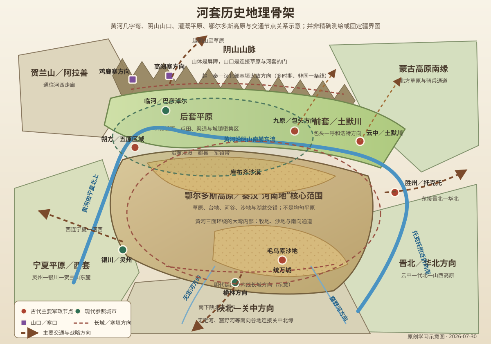
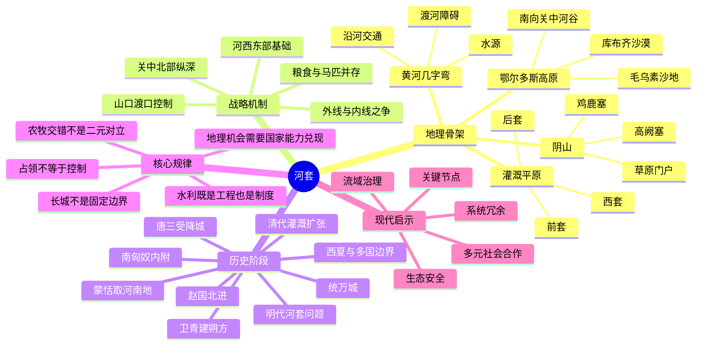

# 第十二章　河套

- **创建日期**：2026-07-30
- **状态**：初版，已配原创历史地理示意图与独立时间轴
- **关键词**：河套、河南地、阴山、黄河几字弯、鄂尔多斯高原、前套、后套、西套、云中、九原、五原、朔方、蒙恬、卫青、匈奴、北假、统万城、受降城、明代河套问题、引黄灌溉
- **章节性质**：围绕原书章节主题展开的原创历史地理学习指南，不逐段复述原书

## 章节概览

“河套”最直观的形态，是黄河在中国北方画出的巨大“几”字弯。然而，历史上的河套并不只是今天巴彦淖尔一带的灌溉平原，也不是一条边界清楚、含义始终不变的行政区。广义河套包括黄河从西、北、东三面环绕的鄂尔多斯高原及其外缘平原；狭义河套平原则多指阴山以南、黄河以北的后套和前套，有时还把宁夏平原称为西套。战国秦汉文献中的“河南地”，主要指黄河大弯内侧、即黄河以南的鄂尔多斯地区，其范围又与后世“河套”概念部分重合而不完全相同。

河套的重要性来自一种罕见的地理组合：北有阴山及山口，南有黄土高原和鄂尔多斯高原，内部有草原、沙地、河谷和可灌溉平原，黄河同时承担水源、交通障碍、军事屏障与资源通道四重角色。这里既适合骑马放牧，也能依靠引黄灌溉形成农业据点；既是北方草原进入关中、山西和华北的跳板，也是中原王朝把防线向阴山推进的前沿。

因此，河套历史不是简单的“农耕民族与游牧民族反复争夺”。更准确地说，它是一片生产方式可以转换、人口结构可以重组、军事边界可以前后移动的复合地带。国家是否能占领河套，取决于战役；是否能长期控制河套，则取决于移民、屯田、道路、郡县、市场、长城、山口、渡口和水利能否形成持续运转的网络。

本章的核心结论是：

> 河套不是一条固定的文明边界，而是一座可以向南或向北开启的战略铰链。控制黄河并不足够，必须同时组织阴山山口、河套平原、鄂尔多斯台地和南向交通线；占领土地也不足够，只有把水、粮、牧场、人口与道路结合起来，军事胜利才可能转化为长期秩序。

---

## 一、地理环境：黄河、阴山、草原与沙地共同塑造的战略铰链

### 1. “河套”究竟在哪里

河套有广义与狭义之分。广义河套是黄河从西、北、东三面环绕的巨大区域，主体为今天的鄂尔多斯高原，并包括外缘的宁夏平原、后套平原、前套平原及黄河东缘部分地区。狭义河套平原则通常指内蒙古西部阴山南麓、黄河沿岸的冲积平原，常分为后套和前套；宁夏平原因位于黄河大弯西侧，又有“西套”之称。

这一差别十分重要。秦汉史书所说“河南地”，重点是黄河大弯内侧、黄河以南的鄂尔多斯地区；现代农业地理中的“河套平原”，重点却常在黄河北岸的巴彦淖尔平原。若把两者完全等同，就会误判蒙恬、卫青等人争夺的方向，也会混淆古代郡县与现代城市的位置。

可以把河套理解为三个相互依存的空间层次：

| 空间层次 | 大致范围 | 主要地理功能 |
|---|---|---|
| 黄河大弯内部 | 鄂尔多斯高原、库布齐沙漠、毛乌素沙地及河谷 | 草原牧业、南北交通、接近关中北缘的战略纵深 |
| 黄河北岸平原 | 后套、前套、土默川等阴山南麓区域 | 引黄农业、城镇与屯田、东西向交通带 |
| 阴山及其以北 | 阴山山口、乌拉特草原、蒙古高原南缘 | 草原力量南下通道、预警与边防前沿 |

河套的战略价值正来自三层空间的联动，而不是任何单独一块平原。

### 2. 黄河“几字弯”：屏障也是通道

黄河从宁夏向北流动，进入内蒙古后受地形影响转向东流，在托克托附近又折向南，形成巨大弯曲。河流对军队既是障碍，也是路线：洪水期和凌汛期渡河困难，河道分汊、湿地和泥沙沉积会改变渡口；但在稳定河段，沿河又能获得水源、牧草、鱼盐和聚落补给。

黄河三面环绕鄂尔多斯，使大弯内部具有类似半岛的形态。控制主要渡口，可以限制大规模军队进出；但河流太长，不可能处处设防。地方势力只要掌握熟悉的浅滩、冰期渡口或支流谷地，仍可能穿透防线。

所以，黄河不是天然且绝对的国界。它只有与城塞、道路、烽燧、机动骑兵和山口控制结合时，才成为有效防线。

### 3. 阴山：河套北缘的屏风与门廊

阴山东西横亘于河套平原北侧，阻挡蒙古高原冷空气，也构成显著的地形分界。山体本身并非不可逾越，真正关键的是高阙、鸡鹿塞及若干谷口。山口把北方草原与黄河沿岸连接起来，是商旅、移民和军队反复使用的“门”。

对中原王朝而言，如果边防只停留在黄河，草原骑兵渡河后便可迅速进入河套内部；若能把防线推到阴山并控制山口，就能获得预警距离和机动作战空间。对北方草原政权而言，控制阴山南麓则意味着获得冬季牧场、黄河水源和继续南下的基地。

《敕勒歌》中“阴山下”的草原意象，反映的不是一条无人边界，而是山地、草原、农田和聚落长期交错的生活世界。

### 4. 鄂尔多斯高原：大弯内部不是均匀草原

鄂尔多斯高原内部有台地、河谷、草原、沙地和湖盆。北部库布齐沙漠沿黄河南岸延伸，南部毛乌素沙地与陕北高原相接，中西部较为干旱。不同季节、不同年代的降水变化，会使牧场承载力与农业边界明显摆动。

这意味着“夺取河南地”并不等于获得一块连续肥沃农田。军政力量必须抓住河谷、泉水、道路节点和适宜耕作区。若脱离黄河与支流水源，深入高原的部队仍会遭遇缺水与运输困难。

鄂尔多斯又不是隔绝空间。向南可经无定河、秃尾河、窟野河等谷地进入陕北，再威胁关中；向东可接山西北部；向西可达宁夏与河西走廊；向北则通过阴山山口连接蒙古高原。它是多方向交通的转接台。

### 5. 后套、前套与土默川：北纬四十度附近的灌溉绿带

阴山南麓地势较缓，黄河带来水源和沉积物，在干旱气候中形成可灌溉平原。后套大致位于今天巴彦淖尔地区，前套常指包头以东至土默川一带；不同历史时期的河道、湖泊和行政称呼会改变，不能用现代边界机械套入古代。

这里降水有限、蒸发强烈，天然农业受到约束，但只要建设引水渠道，就能形成高产农田。反过来，灌溉也带来排水、盐碱化、泥沙淤积和上下游分水问题。河套的富庶不是黄河自动赐予，而是长期水利组织的结果。

“黄河百害，唯富一套”的说法抓住了灌溉优势，却容易掩盖其维护成本：渠道需要清淤，河道会迁移，水权需要协调，过度开垦会削弱草地和湿地。河套既是“塞外粮仓”，也是高度依赖治理能力的人工生态系统。

### 6. 四向交通：河套为何成为北方十字路口

| 方向 | 主要联系区域 | 历史功能 |
|---|---|---|
| 南向 | 陕北、关中 | 北方力量南下关中的通道，也是秦汉补给河套的后方线 |
| 东向 | 云中、代北、晋北、华北 | 连接山西高原与华北边防，形成东西向军镇网络 |
| 西向 | 宁夏平原、贺兰山、河西走廊 | 连接西北交通与西域路线，是控制河西前必须稳定的前站 |
| 北向 | 阴山山口、蒙古高原 | 骑兵、牲畜、贸易和人口迁移的主要方向 |

河套并非交通尽头，而是从关中、华北通往草原和西北的转换节点。它可以把关中防御线向北推远，也可以让北方骑兵越过黄河后迅速接近秦晋腹地。

### 7. 农牧交错带：不是一条线，而是一片会移动的带

农业与牧业并不是由长城或某一条等雨量线完全分开。沿河灌溉区适合农耕，台地和山地草场适合放牧，许多社会同时经营粮食、牲畜、运输和贸易。气候变冷变干、战争破坏水利或人口撤离时，耕地可能退化为草地和沙地；移民增加、渠道恢复和市场扩大时，农业又会向外扩展。

因此，河套反复易手不应被解释为两种文明轮流覆盖同一块空白土地，而应理解为多种生产方式和政治网络重新组合。

### 8. 原创历史地理示意图

> 下图为学习用途的原创示意图，强调黄河大弯、阴山山口、鄂尔多斯高原、前套后套、主要军政节点和交通方向的关系，不是精确测绘地图；古河道、城址、长城和政区范围均随时代变化。

---

## 二、历史背景：秦汉以前的河套已是农牧互动与区域竞争地带

### 1. 史前人群与萨拉乌苏地区

鄂尔多斯南缘萨拉乌苏河流域发现旧石器时代人类活动遗存，说明河套及其外缘很早就是人群迁徙、狩猎和环境适应的重要区域。由于遗址年代、文化分期和“河套人”概念在学术史上经历多次修订，本章只强调一点：河套并非进入文字时代后才突然出现人类活动。

### 2. 朱开沟文化与复合生计

鄂尔多斯地区的朱开沟文化遗存显示，史前至早期青铜时代的当地社会已存在农业、畜牧和金属技术相结合的现象。河套由此成为中原北缘、北方草原和西北地区文化交流的重要接口。

这提醒我们：农牧复合不是帝国边疆政策的临时产物，而有更深的环境与社会基础。

### 3. 战国时期赵国向北经营

战国后期，赵武灵王推行胡服骑射，赵国势力进入云中、九原等北方地区，并修筑长城、设置军政据点。赵国的目的不仅是防守，还包括获取牧场、马匹、人口和北方交通资源。

赵国经验为秦提供了两项遗产：一是已经存在的北方郡县与城塞节点，二是骑兵和边地治理的重要性。秦统一六国后，接收赵地，使关中政权第一次有机会把北部防线系统推进到阴山—河套一带。

---

## 三、关键事件之一：蒙恬取河南地——秦把关中防线推向阴山

### 1. 公元前215年前后的北击匈奴

秦始皇三十二年前后，蒙恬率军北击匈奴，夺取“河南地”，并继续控制阴山一线。这里的“河南”不是今天河南省，而是黄河大弯内侧、黄河以南的地区。

这一行动改变了关中北部的安全距离。过去北方力量可以从河套南下陕北，接近关中；秦控制河南地后，前沿被推至黄河与阴山，关中获得更大纵深。

### 2. 长城不是一堵孤立的墙

秦在北方连接、利用并扩展战国时期秦、赵、燕的旧长城。长城体系的真实功能包括：

- 标示边防线与军政责任范围；
- 保护屯田、道路和居民点；
- 通过关塞控制大规模人畜通行；
- 配合烽燧传递情报；
- 为机动部队提供预警和集结时间。

若没有驻军、粮仓、道路和地方行政，墙体本身不能阻止所有小规模穿越。河套地形开阔，骑兵能够寻找薄弱点，因此长城必须嵌入更大的边防网络。

### 3. 九原、云中与直道

秦以九原、云中等北方节点组织边地，并修筑从关中北上的交通线。秦直道传统上被视为连接咸阳附近与九原方向的重要军事道路，其具体路线与分段仍有考古讨论，但战略目的明确：缩短中央与北疆之间的运输、通信和增援时间。

河套距离关中并不算极远，真正困难的是黄土高原沟壑、河谷、冬季严寒和沿途补给。道路建设把地形阻力转化为国家可计算的运输体系。

### 4. 移民与“新秦中”

秦把人口迁往北方，试图以农业定居、郡县和驻军巩固新占地区。后世“新秦中”的称呼，反映人们曾把河套部分地区视为可比关中的新农业区。

但这一工程需要长期投入。秦朝很快崩溃，戍边人口回流，郡县和补给网络失去稳定支持。匈奴重新进入河南地，说明边疆的持久控制依赖制度寿命，而不是一次远征。

### 5. 秦的经验与教训

蒙恬行动证明河套可以成为关中帝国的外层防线，也证明控制河套的成本很高：

> 战役决定谁暂时到达阴山，行政与后勤决定谁能在阴山脚下过冬。

---

## 四、关键事件之二：卫青收复河南地——汉武帝重建朔方体系

### 1. 汉初为何退守

秦末汉初战争破坏严重，中央无力维持遥远边地。匈奴在冒顿单于时期完成大规模政治整合，重新控制河套及其北方草原。汉朝早期主要通过和亲、边市和有限防御争取恢复时间。

这不是简单的“畏战”，而是国家能力与战略目标不匹配。河套若没有足够人口、马匹和粮食支撑，贸然推进可能重演秦末边防崩溃。

### 2. 公元前127年卫青出击

汉武帝元朔二年，卫青率军从云中等方向出击，重新夺取河南地。与深入漠北的远征相比，河套战役距离汉朝北方郡县较近，目标也更明确：切断匈奴利用鄂尔多斯南下关中的通道，并把防线推回黄河大弯外缘。

汉朝随后设置朔方郡、五原郡等军政区域，修复旧塞，建设城障，并迁徙人口。军事进展由此被转化为行政空间。

### 3. 朔方城与郡县网络

朔方不是一座孤城，而是郡县、城塞、农田、牧场、道路和黄河渡口构成的体系。中央通过官吏、士卒、移民和罪徒等多种人口来源增加边地密度，用屯田和灌溉降低从关中远距离输粮的压力。

河套的关键优势在于：只要能稳定引水，军粮可以部分就地生产；只要有城塞保护，农业人口就能持续存在；农业人口增加，又能支持更多驻军和道路维护。这形成正向循环。

### 4. 河套与河西走廊的战略衔接

夺取河南地后，汉朝关中北侧安全得到改善，军队可以更放心地向西经营河西走廊。公元前121年霍去病河西作战与公元前119年漠北大战，背后都离不开北方郡县、马匹、粮草和道路体系的扩张。

河套不是河西走廊的替代品，而是其东部安全基础。若匈奴牢牢占据河套，汉军西进时关中侧翼会承受更大压力。

### 5. 成本、反复与边疆社会

汉代河套并非从此永久稳定。匈奴战争、财政压力、自然灾害、人口迁移和朝廷政策变化，都会影响郡县控制强度。边地居民也不是单一来源，其中有内地移民、当地人群、归附部众、军人和商旅。

郡县化不是把草原社会清空后复制关中，而是在多族群、多生计环境中建立新的政治层级。

---

## 五、关键事件之三：从南匈奴内附到十六国——边界转化为内部政治

### 1. 南匈奴内附改变边疆结构

东汉时期，匈奴分裂，南匈奴进入汉朝边郡体系，在河套、并州等地活动。原本的外部边界问题逐渐转化为内部安置、部众管理、军役和地方权力问题。

内附并不意味着文化和组织立即消失。部众首领、牧业需求和军事能力仍然存在；中央强盛时，可以通过封号、互市和驻地管理维持秩序，中央衰弱时，这些力量可能重新组织政治空间。

### 2. 魏晋时期的多族群重组

魏晋以来，鲜卑、匈奴、羌、汉等人群在北方迁徙、结盟与冲突。河套的城镇、牧地和道路既是争夺对象，也是不同群体共同生活的场域。所谓“边疆”已不再位于清晰的帝国外部，而深入北方王朝内部。

### 3. 赫连勃勃与统万城

十六国时期，赫连勃勃建立夏国，并在河套南缘无定河流域营建统万城。统万城位于今天陕北靖边附近，控制毛乌素沙地南缘、无定河谷和通向关中的路线。

其选址说明大弯内部的政治中心不一定贴近黄河。只要能控制水源、牧场和南向通道，鄂尔多斯南缘同样可以支撑强大政权。统万城建筑坚固，却无法脱离更广阔的联盟和军事形势独立存在；北魏最终攻灭夏，城市也失去首都地位。

### 4. 北魏统一北方后的河套

北魏把草原军事传统与中原郡县制度结合，河套及阴山南北成为其统治核心的西部组成。北方王朝不应被简单视为“从草原进入中原后离开草原”，它们往往同时经营农田、牧场和边镇。

河套在这一阶段体现出新的意义：它不是两个固定国家之间的边界，而是一个跨生态帝国内部的交通与资源区。

---

## 六、隋唐时期：三受降城与黄河—阴山防御网络

### 1. 隋唐北疆的重新组织

隋唐统一后，关中再次成为全国政治中心，河套重新获得保护首都、联系河西和制约草原政权的价值。突厥势力强盛时，河套是南下关中的前进地；唐朝强盛时，则可作为北向出击与安置部众的基地。

### 2. 丰州、胜州与沿河军镇

唐代在河套及其外缘设置州县和军镇，丰州、胜州等节点承担驻军、交通、互市和农业生产功能。城市多位于河谷、渡口或山口附近，因为国家无须均匀占领每片沙地，只需控制人群和物资必须经过的节点。

### 3. 三受降城的战略逻辑

唐代景龙年间，张仁愿主持修筑东、中、西三座受降城，并配套烽候体系，以控制黄河以北和阴山南麓通道。三城具体城址及名称对应在学界存在讨论，本章强调其功能：把单一河防推进为城塞—烽燧—机动部队组成的纵深网络。

受降城减少突厥骑兵靠近黄河后突然渡河的机会，也保护沿线屯田和交通。它说明北疆防御的重点不只是“守河”，而是争夺河外的观察、集结和反击空间。

### 4. 军镇、互市与人口流动

边城不只有士兵。军需吸引农民、工匠、商人和牧民，互市交换马匹、牲畜、粮食、布帛与金属制品。战争与贸易常在同一组山口和渡口发生，因为双方争夺的正是连接能力。

### 5. 安史之乱后的收缩

安史之乱后，唐朝军政资源重新分配，吐蕃、回鹘及地方军镇力量变化，河套控制趋于复杂。边疆网络一旦失去稳定财政和中央协调，孤立城塞便容易衰落。

---

## 七、宋辽夏金元：河套成为多政权交界与西北枢纽

### 1. 西夏为何重视河套西部

西夏以宁夏平原为核心，向东联系鄂尔多斯，向西进入河西走廊。河套西部提供灌溉农业、牧场和连接东西的道路，是西夏国家同时经营农牧资源的重要区域。

宋朝难以直接控制河套大部，其北方战略受到辽、西夏和地形距离共同制约。河套由此不再只是中原王朝与草原政权的单线边界，而是多个国家之间的交叉地带。

### 2. 河套与西北贸易

马匹、盐、粮食、皮毛和金属制品沿河套—宁夏—河西网络流动。即使政治关系紧张，边市和民间交换仍可能继续。贸易不是战争的反面，而是同一地理连接的另一种表现。

### 3. 蒙古兴起与鄂尔多斯名称

蒙古帝国兴起后，黄河大弯内部进入更大范围的草原—农耕帝国网络。元代道路和驿站把河套与大都、关中、宁夏和蒙古高原连接起来。“鄂尔多斯”后来逐渐成为这一高原区域的重要名称，并与蒙古诸部的政治、祭祀和牧地组织相关。

### 4. 统一帝国并不会消除区域差异

元朝统一广阔区域后，河套不再是两个国家之间的前线，但水源分布、季节牧场、沙地和交通节点仍决定人口密度与行政方式。政治统一可以降低关卡，却不能消除地理成本。

---

## 八、明代“河套问题”：为什么复套与守边长期争论

### 1. 明初北进与后来的防线内缩

明初军队曾深入漠北并经营北方卫所，但随着蒙古诸部重组、军费压力上升和边地人口不足，明朝有效防线逐渐收缩。黄河大弯内部和阴山一带的稳定控制难以维持，长城与军镇更多依托陕北、山西北部等较易补给的内线。

### 2. 蒙古鄂尔多斯部进入河套

15—16世纪，蒙古诸部在河套活动增强，鄂尔多斯部逐渐以黄河大弯内部为重要牧地。对蒙古诸部而言，河套有冬季牧场、黄河水源，并可接近明朝边市与陕北；对明朝而言，这使北方骑兵获得靠近延绥、宁夏和关中的前进基地。

### 3. “复套”主张为何有吸引力

支持复套者认为，若重新占领河套并把防线推到黄河、阴山，便能扩大关中安全纵深，减少蒙古骑兵直接冲击长城内线。同时，河套具备屯田和牧马潜力，可能部分承担驻军成本。

这一逻辑与秦汉相似：最好的防守似乎是夺取外层缓冲区。

### 4. “弃套”或谨慎派担心什么

反对者则看到另一面：

- 明朝需要跨越陕北高原维持漫长运输；
- 河套地域广阔，城塞之间容易被绕过；
- 屯田恢复需要水利、人口和多年稳定；
- 军队深入后可能被切断退路；
- 占领会扩大边界长度，并不必然减少军费；
- 若没有持续骑兵优势，阴山外线难以守住。

于是，是否复套不是勇敢与怯懦之争，而是国家资源、军队结构和地理目标是否匹配的问题。

### 5. 长城内线的形成

明代延绥、宁夏、大同等军镇及长城体系，更强调依托可补给地区建立内线防御。它牺牲部分战略纵深，却缩短驻军与粮运距离。长城线的南移反映国家能力边界，而不是单纯的地图退让。

### 6. 互市与封贡改变安全结构

16世纪后期，明蒙之间通过封贡、互市等方式降低部分边境冲突。河套仍是军事敏感区，但市场使马匹、牲畜和内地商品获得更稳定的交换渠道。

这再次说明：边疆秩序不仅由墙与军队构成，也由价格、贸易规则和政治承认构成。

---

## 九、清代以来：灌溉扩张、移民社会与现代河套

### 1. 旗地、牧地与农业开发并存

清代在鄂尔多斯等地实行盟旗制度，同时限制和调节内地移民进入。随着人口压力、商业需求和政策变化，黄河沿岸农业逐步扩展，蒙汉等多族群在牧业、农耕、运输和贸易中形成复杂关系。

“走西口”等人口迁移把山西、陕西等地居民带入土默川与河套地区。移民并非只带来劳动力，也带来渠道技术、商业网络、庙会、语言和地方组织。

### 2. 清中后期渠道扩张

后套引黄灌溉在清中后期明显发展。地方开渠者、地商、农户、寺院、官府等多种力量参与水利建设，形成若干大型干渠及支渠网络。水利并非始终由中央国家单独规划，而常由地方资本、社会组织与官府协商推进。

### 3. 水权塑造地方权力

在干旱地区，谁控制渠首、分水和清淤，谁就掌握土地价值。渠道不仅是工程，也是一种社会制度：需要规定何时引水、如何分配、谁承担维修、发生争议时由谁裁决。

河套近代社会因此可被理解为“水—地—人口—武装—市场”相互绑定的地方结构。

### 4. 现代灌区与统一引水排水

20世纪以来，三盛公水利枢纽、总干渠和排水系统等工程逐步整合旧有渠道，扩大灌溉并改善管理。现代工程提高了供水稳定性，但也必须面对泥沙、盐碱化、地下水变化、乌梁素海生态和黄河流域总体用水约束。

2019年，河套灌区被国际灌排委员会列入世界灌溉工程遗产名录。其价值不只在于工程古老，更在于两千余年中灌溉布局、地方社会和黄河环境持续互动。

---

## 十、为什么地理如此重要：河套反复成为战略焦点的六个机制

### 1. 它是关中的北方门户

河套大弯内部通过陕北河谷接近关中。北方力量占据河套，可缩短南下距离；关中政权控制河套，则能把战场推离首都地区。秦汉与明代战略争论，都围绕这一纵深问题展开。

### 2. 它同时生产粮食与马匹

沿黄灌区可生产粮食，草原和台地可放牧马羊。传统国家最难同时获得的两类军事资源，在河套能够相互靠近。谁能协调农牧生产，谁就可能建立更持久的边疆军队。

### 3. 阴山山口决定南北转换

大范围山地不必全部占领，关键是控制高阙、鸡鹿塞等山口及道路。山口是军事“阀门”，决定草原骑兵是否能快速进入平原，也决定中原军队能否越过阴山继续北进。

### 4. 黄河提供水源，却不能自动成为国界

黄河可以阻挡军队，但漫长河段存在渡口、浅滩、冰期和河道变化。有效河防必须与城塞、巡逻和情报网络结合。把地图上的蓝线当作永久边界，会低估人的适应能力。

### 5. 占领容易，维持困难

河套的战略收益很大，维护成本也大。国家需要同时承担驻军、运粮、移民、水利、马政和道路维修。中央财政或政治秩序一旦崩溃，外线比内地更快收缩。

### 6. 生态变化会重写军事经济账本

降水、河道、植被和沙地变化影响牧草、耕地、渡口与渠道。生态环境不会直接决定王朝兴亡，却会改变每种战略的成本。相同的地图位置，在不同气候与治理条件下，价值并不相同。

---

## 十一、作者观点：河套是一部“边界移动史”

> **说明**：以下为依据本书以地理解释历史的整体方法，对本章主题进行的归纳性重构，并非原书逐字引文。

本章可归纳出三层观点。

第一，河套的核心意义不是“富饶”，而是“可转换”。它能在草原牧业、灌溉农业、军事前沿和贸易走廊之间切换。正因为用途多样，任何一方都难以忽视它。

第二，长城并不是文明世界的固定边缘。秦汉长城向阴山推进，明代防线又退到陕北和山西北部，说明边界位置是国家能力、军事技术、人口密度和后勤条件的结果。

第三，历史地理不能只看谁在地图上占有土地，还要看谁能持续组织水源、道路和人口。河套反复易手，真正变化的不是山河位置，而是连接这些山河的制度网络。

可以把本章的作者观点浓缩为一句话：

> 河套告诉我们，边疆不是帝国地图的末端，而是国家能力最先接受压力测试的地方。

---

## 十二、深度分析

### 1. 为什么河套不是简单的“农耕—游牧分界线”

分界线思维假设南方固定耕田、北方固定放牧，但河套实际呈现镶嵌结构：河边与渠道旁是农田，山麓和台地是牧场，沙地边缘可能季节性利用，城市居民从事手工业与贸易。同一政治集团也可能同时依赖粮食和牲畜。

更合适的概念是“农牧交错带”或“复合生计区”。其政治控制往往采用多层制度：核心城镇实行较直接行政，牧区依赖首领与联盟，交通节点由军镇把守，市场负责交换资源。

### 2. 为什么中原王朝总想把防线推到阴山

从关中看，陕北高原并非足够宽阔的安全区。若对手占据河套，便可在黄河大弯内集结，再沿河谷南下。推进到阴山后，关中与前线之间增加鄂尔多斯纵深，且阴山山口便于集中防守。

但外线防御只有在国家拥有高效道路、骑兵和本地粮源时才合理。秦汉强盛期可以尝试，明代中期则常难承担。地理优势必须与时代能力配对。

### 3. 为什么一次胜利不能解决河套问题

战场胜利可以迫使对手撤离，却不能自动建立人口和生产。河套稳定控制至少需要五步：

1. 控制渡口和山口；
2. 建城、修塞与建立通信；
3. 安置驻军和居民；
4. 发展屯田、牧场与市场；
5. 维持渠道、道路和政治合作。

任何一环中断，前线就会成为昂贵孤岛。蒙恬胜利后秦亡、唐受降城随国势变化而衰、明代复套议论难以落实，都体现这一规律。

### 4. 河套如何改变“长城”的含义

在河套历史中，长城至少有四种含义：

- 军事障碍：增加大规模人马通过的成本；
- 行政边界：区分不同军政责任区；
- 交通控制：把通行集中到关塞和市场；
- 聚落保护：为屯田与居民提供相对安全环境。

长城内外并非无人区与文明区的绝对区分。许多人口、商品和技术一直跨越长城流动。长城的作用更像调节流量的制度设施，而不是完全封闭的墙。

### 5. 水利为何既创造财富，也创造权力

灌溉把黄河水转化为土地收益，但渠首、分水和排水必须有人组织。水利越发达，社会越依赖共同规则。地方领袖可能凭开渠获得权威，官府可能通过水权扩大控制，农户也会通过渠社或村社维护利益。

所以，河套的农业史不仅是技术史，也是政治史。水从哪里进入、流经谁的土地、最后排向哪里，都会影响社会关系。

### 6. 环境退化能否解释王朝进退

沙地扩张、植被变化和河道迁移确实会影响河套，但不能把所有政治兴衰归因于“沙漠化”。战争破坏、人口撤离、水利废弃、过度放牧、气候波动和政策变化常相互作用。

合理解释应区分：自然变化提供约束，人类制度决定如何应对。相同干旱环境中，有的时期能够维持灌溉与牧业平衡，有的时期则因治理失效而快速退化。

### 7. 河套反复争夺是否只有冲突意义

战争记录最醒目，但长期历史中，贸易、通婚、移民、宗教、语言和技术交流可能比战役持续更久。马匹进入内地、粮食供应边地、渠道技术扩散、边民跨区谋生，都让河套成为多元社会融合地。

如果只把河套写成“谁打败谁”，就会忽略它作为共同生活空间的另一半历史。

---

## 十三、长期影响

### 1. 塑造中国北方边防的纵深观念

秦汉经营河套建立了“守关中须先争河南地、守黄河须兼控阴山”的战略思路。后世即使无法复制，也不断在外线与内线之间权衡。

### 2. 推动北方郡县、军镇与移民城市形成

云中、九原、五原、朔方、丰州、胜州等名称在不同时代反复出现，说明河套节点具有长期地理生命。王朝更替后，旧城可能废弃或迁移，但交通逻辑仍促使新城在附近形成。

### 3. 促进农牧技术与多族群交流

骑兵、马政、灌溉、冶金、皮毛贸易和粮食运输在河套相遇。不同人群不是单向同化，而是在共同生产和政治秩序中持续重组。

### 4. 影响关中、河西与华北的安全格局

河套连接三个大战略区：向南影响关中，向西支撑宁夏与河西，向东联系云中与代北。失去河套可能同时增加多个方向的压力，控制河套则可把这些方向连成网络。

### 5. 形成持续两千余年的灌溉文化

从秦汉屯田到清代渠道，再到现代灌区，河套水利不断重建。它不是一条工程连续不变，而是历代社会根据河道和制度重新组织的长期传统。

---

## 十四、现代启示

### 1. 战略缓冲区必须有真实支撑

现代组织也常追求更大“安全边界”，但范围扩大意味着管理成本增加。无论国家、企业还是软件系统，外延扩张都必须有人员、信息、基础设施和维护预算支撑。

### 2. 关键节点比平均铺开更重要

河套历史表明，控制山口、渡口、渠首和交通枢纽，往往比均匀控制大片空间更有效。现代物流、网络架构和城市规划同样需要识别高连接度节点及单点故障风险。

### 3. 水资源治理需要流域思维

一个地区扩大引水，可能影响下游生态；只重灌溉而忽视排水，会产生盐碱化。现代河套必须把农业、湿地、地下水、泥沙与黄河全流域配额一起考虑。

### 4. 不要把复合问题简化成二元对立

“农耕对游牧”“长城内对长城外”便于叙事，却不足以解释真实历史。现代区域治理也应避免把生态保护与经济发展、地方利益与流域利益简单对立，而要寻找可持续组合。

### 5. 韧性来自多套互补系统

河套能长期繁荣，依赖农业、牧业、贸易和交通互补。单一水源、单一产业或单一道路都容易在冲击中失效。现代区域发展需要保留冗余和多样性。

---

## 十五、古今地名对照

> 古代政区边界、城址和河道多次变化，下表为学习用途的近似对应，不应理解为古今行政区完全重合。

| 古称或历史概念 | 大致现代对应 | 说明 |
|---|---|---|
| 河套（广义） | 鄂尔多斯高原及宁夏、巴彦淖尔、包头、呼和浩特部分地区 | 黄河从西、北、东三面环绕的区域及外缘平原 |
| 河套平原（常用狭义） | 巴彦淖尔至包头、土默川一带 | 现代地理常重点指黄河北岸冲积平原 |
| 河南地 | 鄂尔多斯高原及黄河大弯内侧部分地区 | 秦汉“河南”意为黄河以南，不是今河南省 |
| 新秦中 | 秦汉经营的河套农业区 | 强调移民屯田后类似关中的农业潜力，范围并非固定 |
| 后套 | 今巴彦淖尔河套平原核心区 | 多指黄河北岸、阴山南麓西段平原 |
| 前套 | 今包头附近至土默川一带 | 历代和现代用法存在宽窄差异 |
| 西套 | 今宁夏平原 | 后世对黄河大弯西侧灌溉平原的称呼 |
| 云中郡 | 今呼和浩特、托克托及周边区域，历代有变 | 战国赵至秦汉北方重要郡治区域 |
| 九原郡／九原县 | 今包头及河套东部周边，具体治所随时代有考证 | 秦北方军政和交通节点 |
| 五原郡 | 今巴彦淖尔东部、包头西部一带，范围随时代变化 | 西汉北疆郡县体系组成部分 |
| 朔方郡 | 今鄂尔多斯西北、巴彦淖尔黄河沿岸部分地区 | 汉武帝收复河南地后设置的重要边郡 |
| 北假 | 阴山以南、黄河北部河曲附近区域，解释不一 | 匈奴及汉代文献中的地理概念，不能简单对应单一县市 |
| 高阙塞 | 今阴山西段山口区域，常联系乌拉特后旗一带 | 控制阴山南北交通的著名关塞，具体定位有考证差异 |
| 鸡鹿塞 | 今狼山一带山口，常联系磴口西北 | 汉代出入阴山的重要塞口之一 |
| 丰州 | 今呼和浩特、包头及河套东部相关区域，治所历代迁移 | 隋唐以后北方军政与互市节点 |
| 胜州 | 今鄂尔多斯东北、准格尔旗及黄河转折附近 | 控制黄河东缘与晋陕通道 |
| 三受降城 | 黄河以北、阴山南麓不同节点，具体城址有争议 | 唐代张仁愿主持修筑的东、中、西三城防御体系 |
| 统万城 | 今陕西靖边县白城则附近 | 十六国夏国都城，位于河套南缘无定河流域 |
| 鄂尔多斯 | 今内蒙古鄂尔多斯市及高原区域 | 蒙古语名称与部族、区域历史相关，近现代成为正式地名 |
| 土默川 | 今呼和浩特平原 | 阴山南麓前套东部的重要农业、牧业和城市区域 |
| 乌梁素海 | 今巴彦淖尔乌拉特前旗附近 | 河套灌区重要湿地与排水承纳水体 |

---

## 十六、章节时间轴

| 时间 | 事件 | 历史地理意义 |
|---|---|---|
| 旧石器时代 | 萨拉乌苏河流域有人类活动 | 河套南缘很早就是迁徙与环境适应区域 |
| 约前3千纪末至前2千纪 | 朱开沟文化发展 | 农业、畜牧与金属技术在鄂尔多斯交汇 |
| 前4—前3世纪 | 赵国经营云中、九原，推行胡服骑射 | 中原国家开始系统利用北方骑兵和边郡网络 |
| 前215年前后 | 蒙恬北击匈奴、取河南地 | 秦把关中外层防线推进至黄河—阴山 |
| 秦末汉初 | 戍边体系收缩，匈奴重新控制河套 | 一次军事占领因制度崩溃而难以持续 |
| 前127年 | 卫青收复河南地 | 汉朝阻断匈奴经鄂尔多斯南下关中的路线 |
| 前127年后 | 设置朔方、五原等郡，移民屯田 | 战役成果转化为郡县、农业与城塞网络 |
| 前121—前119年 | 汉朝继续经营河西并发动漠北大战 | 河套成为西进与北伐的后勤基础之一 |
| 1世纪 | 南匈奴内附并进入北方边郡体系 | 外部边界问题转化为帝国内部安置与治理问题 |
| 407年 | 赫连勃勃建立夏国 | 河套南缘成为十六国政治中心之一 |
| 413年前后 | 统万城建成 | 无定河谷与毛乌素南缘的战略价值制度化 |
| 427—439年 | 北魏攻取统万城并统一北方 | 河套纳入跨农牧区域的北方帝国 |
| 隋唐时期 | 丰州、胜州等军政节点发展 | 黄河沿线城镇连接关中、代北和草原 |
| 709年前后 | 张仁愿修筑三受降城 | 防线由守黄河推进为河外城塞与烽燧网络 |
| 10—13世纪 | 辽、宋、西夏、金等多政权并立 | 河套连接宁夏、河西、草原与华北的枢纽性增强 |
| 13世纪 | 蒙古帝国与元朝统合北方 | 河套进入更大驿路和草原—农耕帝国网络 |
| 15—16世纪 | 蒙古鄂尔多斯部加强在河套活动 | 明朝北方安全面临新的近边压力 |
| 16世纪 | 明廷长期争论复套、守套与内线防御 | 地理收益与后勤成本之间的矛盾集中显现 |
| 1571年后 | 明蒙封贡互市体系发展 | 市场与政治承认成为边疆安全的重要工具 |
| 清代 | 盟旗制度、移民与沿黄农业并存 | 河套形成多族群农牧贸易社会 |
| 19世纪 | 后套大型民间渠道快速发展 | 水权、土地和地方组织共同塑造灌溉社会 |
| 1902年前后 | 官府加强河套垦务与渠道管理 | 水利由多元地方开发进一步转向制度化管理 |
| 1961年后 | 三盛公枢纽等现代工程整合引水体系 | 河套灌区进入统一渠首与现代排灌阶段 |
| 2019年 | 河套灌区列入世界灌溉工程遗产名录 | 两千余年水利传统获得国际性历史工程认定 |

完整配套时间轴见：[河套历史地理时间轴](../Timeline/Chapter12_河套历史地理时间轴.md)。

---

## 十七、思维导图

---

## 十八、参考资料

### 1. 传统文献

1. 司马迁：《史记·秦始皇本纪》《史记·匈奴列传》。
2. 班固：《汉书·武帝纪》《汉书·匈奴传》《汉书·地理志》。
3. 范晔：《后汉书·南匈奴列传》。
4. 魏收：《魏书》相关纪传与地形志。
5. 刘昫等：《旧唐书》及欧阳修、宋祁等《新唐书》突厥、地理与边防相关记载。
6. 宋濂等：《元史》地理、兵制相关记载。
7. 张廷玉等：《明史·鞑靼传》《明史·地理志》《明史·兵志》。
8. 《资治通鉴》秦汉、十六国、隋唐相关卷次。

### 2. 现代研究与资料

1. 艾冲：《河套历史地理新探》，科学出版社，2016年。
2. 林睿：《“河南地”若干历史问题研究》，内蒙古大学博士学位论文，2024年。
3. 中国科学院地理科学与资源研究所：[河套平原](https://www.igsnrr.cas.cn/cbkx/kpyd/zgdl/cndm/202009/t20200910_5692358.html)。
4. 中国社会科学网：[寻找长城变迁之印记：秦简中的“故塞”与“故徼”](https://cssn.cn/lsx/lsx_zgs/202210/t20221024_5552579.shtml)。
5. 全国哲学社会科学工作办公室：[“鄂尔多斯高原历史地理研究”工作简报](https://www.nopss.gov.cn/n1/2017/0627/c360196-29366374.html)。
6. 宁夏水利厅：[河套地区在历史上的称谓](https://slt.nx.gov.cn/slxc/jswm/wxwh/202412/t20241218_4762180.html)。
7. International Commission on Irrigation and Drainage: [Hetao Irrigation District](https://icid-ciid.org/award/his_details/110)。
8. Cambridge University Press, *Environmental Foundations to the Rise of Early Civilisations in China*，其中有关河套平原与晋陕高原农牧交错区的讨论。
9. 关于三受降城、秦汉郡县治所、高阙塞和鸡鹿塞的具体位置，学界仍有不同考证，使用时应结合考古报告与历史地图集。

### 3. 阅读提示

- “河南地”不能望文生义为今天河南省。
- “河套”“鄂尔多斯”“河套平原”在不同时代和学科中的范围不同。
- 古代长城并非同一时期一次建成，也不是永不变化的一条线。
- 城址和塞口的现代对应常有争议，示意图应表达空间关系而非伪精确坐标。
- 研究农牧交错地带，应同时看战争、市场、移民、水利和生态，而不能只看政权归属。

---

## 十九、章节总结

河套的历史价值，首先来自黄河大弯创造的独特位置。它北靠阴山、南接关中外缘，西连宁夏与河西，东通云中与山西；沿河可以灌溉，台地可以放牧，山口和渡口又能控制大规模交通。这里既能成为草原力量南下的基地，也能成为中原王朝向北推进的外层防线。

赵国经营云中九原，开启了中原国家系统进入河套的先例；蒙恬夺河南地，把秦防线推到阴山，却因秦朝迅速崩溃而未能长久；卫青收复河南地后，汉朝通过朔方、五原等郡县、移民、屯田和城塞把战果制度化。十六国的统万城、唐代三受降城、西夏的农牧复合国家和明代复套争论，则从不同角度证明同一规律：河套的战略收益巨大，但只有具备持续后勤与地方治理能力的政权，才能承担其成本。

河套也不能只用战争解释。南匈奴内附、各族迁徙、边市贸易、走西口和清代渠道开发，使这里长期成为人口与文化重组之地。黄河灌溉创造财富，也创造水权、地方组织和生态责任。现代河套灌区延续的不是一条两千年从未改变的渠道，而是一种反复适应河流、沙地和社会变化的治理传统。

本章最终揭示的是：

> 地理不会命令历史必须怎样发生，却会不断提出同一道考题。河套的考题是：能否把黄河的水、阴山的门、草原的马、平原的粮和远方的道路组织成一个可持续系统。回答得好，它就是“新秦中”和塞外粮仓；回答不好，它就会成为漫长、昂贵而难以维持的边疆。