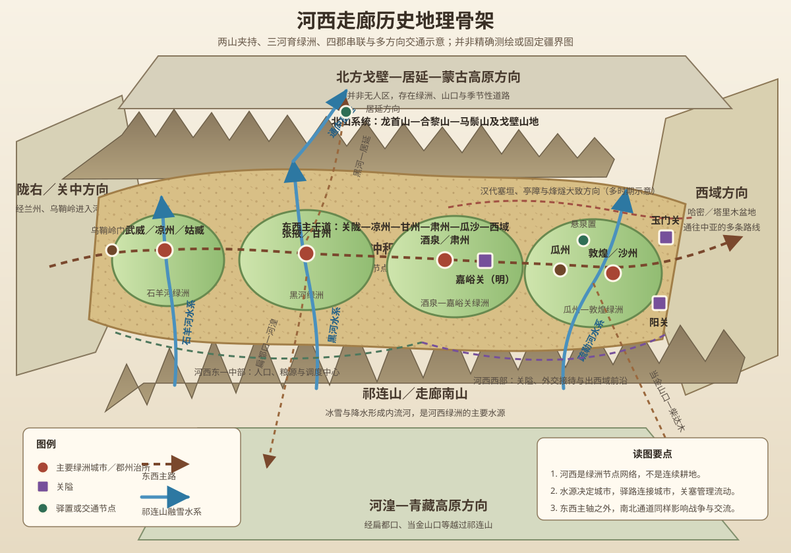

# 第十三章　河西走廊

- **创建日期**：2026-07-31
- **状态**：初版，已配原创历史地理示意图与独立时间轴
- **关键词**：河西走廊、祁连山、北山、乌鞘岭、石羊河、黑河、疏勒河、武威、张掖、酒泉、敦煌、河西四郡、玉门关、阳关、霍去病、张骞、屯田、烽燧、悬泉置、凉州、五凉、吐蕃、归义军、嘉峪关、丝绸之路
- **章节性质**：围绕原书章节主题展开的原创历史地理学习指南，不逐段复述原书

## 章节概览

河西走廊位于黄河以西，南倚祁连山与阿尔金山，北接龙首山、合黎山、马鬃山及广阔戈壁，是一条由山脉夹持、由内流河灌溉、由绿洲串联起来的狭长通道。它并不是一条从东到西连续铺开的肥沃平原，而更像一串被戈壁、沙漠和山口隔开的“绿洲珠链”：武威、张掖、酒泉、敦煌等城市是珠子，驿路、河流、烽燧和补给站则是连接珠子的线。

河西走廊之所以反复成为中国历史中的战略焦点，不只因为它“通往西域”，还因为它同时连接四个方向：向东进入陇右和关中，向西通往塔里木盆地与中亚，向南越过祁连山进入河湟与青藏高原，向北沿黑河、居延和戈壁道路进入蒙古高原。谁控制这条走廊，谁就更有可能保护关中西北侧翼、组织西域交通、调动马匹与粮食，并影响青藏高原和蒙古高原之间的联系。

但“占领河西”与“经营河西”是两件不同的事。军队可以在一个季节内穿过走廊，国家却必须长期解决融雪水分配、绿洲农业、移民安置、驿站维护、马匹饲养、城塞防御、戈壁补给和多族群协作。汉朝夺取河西之后设置郡县、建设塞防、迁徙人口和发展屯田，才把一次军事胜利转化为持续的交通能力。唐朝失去河西后，长安与西域的直接联系明显受限；张议潮重新打通部分走廊，归义军便能以敦煌为中心恢复地方秩序。明代修筑嘉峪关，也不是简单宣布“文明止于此”，而是以有限财政和军力重新选择可守的节点。

本章的核心结论是：

> 河西走廊不是一条天然畅通的道路，而是一套必须被持续维护的绿洲网络。山脉决定通道的大方向，融雪水决定城市能否存在，郡县、驿站、屯田和烽燧决定通道能否真正运转；控制走廊的本质，不是占有一条线，而是组织水源、节点、人口与信息。

---

## 一、地理环境：两山夹一廊，三河串绿洲

### 1. 河西走廊究竟从哪里到哪里

河西走廊的范围在不同地理和历史语境中并不完全一致。常见定义是东起乌鞘岭一带，西至敦煌、玉门关或更西的星星峡附近；南界为祁连山及阿尔金山，北界为龙首山、合黎山、马鬃山和戈壁荒漠。全长常被概括为九百至一千二百公里，宽度则从十余公里到数百公里不等。

这种差异不是错误，而是观察尺度不同：

| 观察尺度 | 重点范围 | 用途 |
|---|---|---|
| 自然地理 | 祁连山北麓多个内陆河盆地与山前平原 | 分析水系、绿洲与荒漠生态 |
| 历史交通 | 陇右西缘—武威—张掖—酒泉—敦煌—玉门、阳关 | 分析中原通往西域的道路网络 |
| 行政历史 | 汉代河西四郡、唐代凉甘肃瓜沙诸州、明代河西卫所 | 分析国家控制范围与城市体系 |
| 现代区域 | 甘肃河西五市及其周边 | 分析现代经济、交通与生态治理 |

因此，河西走廊不是一条边界固定的行政区，而是由山脉、水系、绿洲和交通共同塑造的历史地理单元。

### 2. 南山与北山：地形把交通压缩成“走廊”

走廊南侧的祁连山海拔高、冰雪和季节性积雪丰富，是河西绿洲的主要水源地。古代文献常把祁连山称作“南山”或“走廊南山”。南山不仅提供水，也是一道高大屏障；但扁都口、当金山口等隘口又使河西可以向南连接河湟、柴达木和青藏高原。

北侧的龙首山、合黎山、马鬃山等山地并不构成连续高墙，其间夹有戈壁、沙漠和通往居延、蒙古高原的道路。黑河向北流入居延地区，使张掖—居延方向成为重要的南北通道。河西因此不仅是东西大道，也是一处南北力量交会的十字路口。

南北两侧的山地和荒漠压缩了适宜大规模通行与定居的空间。军队、使者、商旅通常必须沿着山前冲积扇、河谷和绿洲移动，因而少数山口、渡口和水源点具有远超其面积的战略价值。

### 3. 三大内陆河系：城市不是建在“路上”，而是建在“水上”

河西走廊的主要河流大多发源于祁连山，向北流入内陆盆地，最终消失于湖泊、沼泽、沙地或地下水系统。自东向西可概括为石羊河、黑河和疏勒河三大水系。

| 水系 | 主要绿洲与城市 | 历史功能 |
|---|---|---|
| 石羊河水系 | 武威、民勤方向 | 支撑河西东部门户和凉州农业；下游生态对用水高度敏感 |
| 黑河水系 | 张掖、临泽、高台、居延方向 | 形成走廊中部最大绿洲之一，并沟通北方居延地区 |
| 疏勒河水系 | 酒泉、瓜州、敦煌及其周边 | 支撑走廊西部绿洲、关隘和出西域前的最后大型补给区 |

在干旱环境中，降水无法单独维持大面积农业。城市规模取决于雪水径流、渠道工程、地下水和土地盐碱化程度。上游过度引水会使下游湖泊萎缩，战争破坏渠道会使耕地迅速荒废，人口增加又会推动新的水利建设。因此，河西历史也是一部水资源治理史。

### 4. 绿洲珠链：为什么道路不能任意移动

河西不是一条连续绿带。绿洲之间常隔着数十至上百公里的戈壁，旅行者必须预先计算水、粮、草料和宿营点。道路会因河道迁移、泉水枯竭、沙漠扩张、政治安全和城市兴衰而改变，但不能完全脱离水源自由选择。

这种“节点式交通”具有三个结果：

1. **中心城市格外重要**：武威、张掖、酒泉、敦煌控制周边水源和道路，能够成为行政、贸易和军事中心。
2. **驿站具有国家基础设施属性**：悬泉置一类机构不仅接待使者，还承担传递文书、供应马匹、护送人员和调配物资等功能。
3. **断一处可影响全线**：某个绿洲或关口失守，整条东西交通可能被迫绕行、分段或中止。

### 5. 东部门户：乌鞘岭与武威

从关中、陇右进入河西，通常要经过陇山以西和乌鞘岭周边的高地。这里气候较冷、地势收束，是中原农业区与河西干旱区之间的重要门槛。武威位于石羊河绿洲，是进入走廊后的第一个大型中心，历史上称凉州或姑臧，既能控制东部入口，也能向南联系河湟、向北联系草原。

所以，凉州的意义不只是“河西第一城”。一个政权若无法稳定凉州，就难以向西连续控制张掖、酒泉和敦煌；反过来，控制凉州也能对关陇形成压力。

### 6. 中部枢纽：张掖、黑河与扁都口

张掖位于黑河绿洲，土地相对开阔，水源条件较好，是河西中部的农业和交通中心。向南可越扁都口进入青海，向北可沿黑河通往居延，向东、西则连接武威和酒泉。

张掖因此适合成为统筹全走廊的中间基地。明代把陕西行都司治所置于甘州，正是因为其位置居中、粮源较稳，能向东西两端调度军队和物资。

### 7. 西部锁钥：酒泉、嘉峪关、瓜州、敦煌

酒泉和嘉峪关位于走廊西部的重要收束地带。嘉峪关南北山地夹峙，局部通道狭窄，适合建设关城和长城体系。再向西是瓜州、敦煌绿洲，接近玉门关和阳关，是进入塔里木盆地、哈密与更远西域前的关键补给区。

敦煌不是“道路尽头”，而是路线分叉和信息汇集之地。从这里向西可选择北道、南道等不同方向，绕行塔克拉玛干沙漠边缘。敦煌的繁荣来自转运、接待、军事和宗教文化，而不是单靠本地农业。

### 8. 原创历史地理示意图

> 下图为学习用途的原创示意图，强调祁连山—北山夹持、三大内陆河、主要绿洲城市、两关、驿路和南北支线的关系，并非精确测绘或固定疆界图。

---

## 二、历史背景：河西并非无人空地，而是多族群、多生计的交会区

### 1. 史前农业、牧业与早期交流

早在秦汉以前，河西走廊已有人群长期活动。山前绿洲适合种植粟、黍、小麦等作物，山地和荒漠边缘适合放牧，玉石、金属技术、牲畜和作物可以沿欧亚内陆网络传播。河西的意义并不是汉朝到来后突然出现，而是原有地方社会被纳入更大国家与跨区域交通网络之后，功能显著放大。

### 2. 月氏、乌孙、羌与匈奴

战国秦汉之际，月氏、乌孙、羌、匈奴等多种政治和族群力量先后或同时活动于河西及周边。它们并非边界清楚、内部固定的现代民族国家，而是由部落、首领、牧地、盟约和贸易关系构成的政治共同体。

约在公元前二世纪前期，匈奴击败月氏并控制河西。月氏主体向西迁徙，后来进入中亚；部分人群留在祁连山和河湟附近。匈奴在河西设置右贤王系统下的力量，并以休屠王、浑邪王等部控制走廊。对匈奴而言，河西提供牧场、人口、牲畜和连接西域的通道；对汉朝而言，它使匈奴可以从西北侧威胁陇右，并切断汉与西域诸国的直接联系。

### 3. 汉朝为什么必须先解决河套，再争河西

汉初国力有限，主要通过和亲与边防争取恢复。到汉武帝时期，中央财政、骑兵、马匹和郡县动员能力增强。公元前127年卫青夺取河南地、建立朔方体系后，关中北侧获得更大安全纵深，汉朝才更有条件集中力量向西攻击河西匈奴。

河套与河西是相互衔接的战略空间：河套保护关中北面，河西保护关中西北侧翼并打开西域。若只夺河西而河套仍被匈奴牢固控制，汉军补给线和关中安全都会承受更大压力。

### 4. 张骞出使揭示了“通道价值”

公元前138年，汉武帝派张骞出使西域，目标是联络被匈奴驱逐的大月氏。张骞途中被匈奴扣留，历经多年才抵达中亚并返回。虽然军事同盟未能实现，他带回的地理、政治、物产和交通信息改变了汉朝对西方世界的认识。

张骞的经历说明：在汉朝控制河西之前，通往西域的人员必须穿越匈奴势力范围；外交不是单纯派出使者，还依赖道路安全、语言中介、补给点和边境秩序。所谓“凿空”，不仅是发现一条路，更是让国家开始系统理解并经营一张跨区域网络。

---

## 三、关键事件之一：公元前121年的河西之战

### 1. 汉军为何选择快速纵深突击

河西走廊狭长，匈奴部众分布于多个牧地和绿洲。若汉军沿道路缓慢推进，容易被提前转移人口和牲畜，也可能在戈壁中耗尽补给。霍去病采取高机动骑兵战法，利用春、夏两次远征穿插打击河西匈奴力量。

河西地形既限制大军，也奖励速度。掌握水源、熟悉路线并能保持骑兵机动的一方，可以越过部分城镇和营地直击政治中心；缺乏补给和向导的一方，即使兵力更多，也可能被荒漠拖垮。

### 2. 浑邪王归降与匈奴西部体系瓦解

河西战败后，匈奴内部问责加剧。浑邪王决定归汉，休屠王在过程中被杀，其部众随之纳入汉朝安置体系。汉朝不仅获得土地，也削弱了匈奴连接河西、西域与青藏高原北缘的能力。

这次变化的战略意义常被概括为“断匈奴右臂”，但应理解为网络性的变化：

- 匈奴失去河西牧地和人口；
- 汉朝获得通往西域的地理入口；
- 陇右西北侧威胁降低；
- 羌、匈奴及西域之间的联系更容易被汉朝监控；
- 汉朝可以把军事前沿推进到玉门、阳关方向。

### 3. 战役胜利并未自动产生稳定统治

河西之战结束后，汉朝仍面对广阔荒漠、稀疏人口和长距离运输。若没有后续郡县、移民、屯田和塞防，匈奴或其他地方力量仍可能重新进入。

因此，公元前121年是河西政治格局的转折点，却不是建设完成之日。真正改变历史的是此后数十年国家基础设施的持续铺设。

---

## 四、关键事件之二：河西四郡与两关——把军事走廊变成行政走廊

### 1. 四郡并非同一天同时设置

汉朝在夺取河西后，逐步建立武威、张掖、酒泉、敦煌四郡。不同史料和研究对各郡初置、分置和定名年份存在差异，较稳妥的说法是：从公元前121年到公元前111年前后，河西四郡体系逐步形成。

这一区分很重要。国家建立新边疆通常经历军管、属国安置、郡县划分和行政调整，不会在战役结束后立即形成后世熟悉的整齐地图。

### 2. 四郡的空间分工

| 汉代郡名 | 大致现代中心 | 主要地理角色 |
|---|---|---|
| 武威郡 | 武威一带 | 河西东部门户，连接陇右、关中与河湟 |
| 张掖郡 | 张掖一带 | 黑河绿洲中枢，兼顾东西调度与南北交通 |
| 酒泉郡 | 酒泉、嘉峪关一带 | 西部军政基地，控制绿洲和关隘前沿 |
| 敦煌郡 | 敦煌、瓜州一带 | 西域门户、路线分叉点和外交接待区 |

四郡不是四个孤立行政区，而是沿主干道排列的梯级系统。东部提供人口和粮源，中部承担调度，西部负责关隘与出境交通。任何一郡衰弱，都可能增加全线成本。

### 3. 玉门关与阳关：关不是墙，而是过滤器

玉门关、阳关常被想象成两扇孤立的大门。实际上，关塞体系包括城障、烽燧、长城、道路、亭燧和巡逻区。其功能不是完全阻止人员通过，而是识别、登记、许可、征发、接待和预警。

关的核心功能是“把流动变得可管理”：

- 使者需要符节和文书；
- 商旅需要在规定路线移动；
- 军情可由烽燧和驿站快速传递；
- 逃亡、走私与敌军行动更容易被发现；
- 出入西域的人马可以获得最后补给。

因此，两关代表的是国家控制交通的能力，而不只是边界象征。

### 4. 移民、屯田与灌溉

汉朝从内地迁入人口，安置降附部众，组织军人和农民开垦。屯田可以减少长途输粮，但它并不等于“士兵随便种地”。有效屯田需要渠道、种子、牲畜、仓储、土地登记和劳动力季节安排。

在绿洲环境中，水利比土地面积更重要。没有稳定水权，新增人口会加剧上下游冲突；没有城塞保护，农民无法持续耕作；没有市场和驿路，剩余粮食也无法转化为军政资源。

### 5. 长城、烽燧与驿置

汉代在河西和敦煌西北建立塞垣、烽燧与亭障。烽燧负责观察和传递警报，驿置负责文书、人员和马匹流转，郡县负责税粮、司法和人口管理。三者结合，形成“信息—补给—行政”网络。

悬泉置的考古材料尤其重要。它表明丝绸之路并非只靠勇敢商人穿越荒漠，而有大量官吏、驿卒、马匹、车具、食宿标准和文书制度支撑。宏大的跨文明交流，落在日常工作中，就是喂马、记账、发放口粮、安排住宿和核验身份。

---

## 五、关键事件之三：从汉代西域经营到魏晋“五凉”

### 1. 河西成为西域经营的后方基地

汉朝控制河西后，张骞再次出使乌孙，汉朝使者与商旅逐渐频繁往来。公元前60年西域都护设立于更西的西域地区，但其人员、文书和物资必须经过河西。河西四郡由此成为西域政治的后勤基础，而不是西域本身。

这一区分可以避免把“河西”“敦煌”“西域”混为一谈：敦煌是帝国西端的重要郡，玉门关、阳关以西才进入汉代通常所称的西域道路体系。

### 2. 东汉的恢复与班超时代

王莽末年和东汉初期，中央对西域控制减弱。后来汉军和班超等人重新经营西域，河西继续承担通行与补给。无论中央政策是积极西进还是暂时收缩，河西都必须维持基本秩序，否则任何远方战略都无法执行。

### 3. 凉州为何在汉末成为危机中心

东汉后期，河西与陇右的地方矛盾、羌汉关系、军役负担和豪强势力相互叠加。凉州边兵战斗经验丰富，地方军事集团也更容易在中央衰弱时独立行动。

这说明边疆军事化具有双重作用：强盛中央可以借边军保护通道；衰弱中央则可能被边军和地方首领反向影响。地理提供军事实力成长的环境，制度决定这种力量服务中央还是形成割据。

### 4. “五凉”与河西的区域政治中心

西晋末年至北魏统一北方前后，前凉、后凉、南凉、西凉、北凉等政权先后在河西或周边建立。姑臧、张掖、敦煌等城市成为政治和文化中心。

河西能够支撑多个地方政权，原因包括：

- 东西两端有山口和荒漠，可形成相对独立的防御空间；
- 绿洲农业能维持城市和军队；
- 丝路贸易与人口流动带来财富和技术；
- 中原战乱时，大量士人、僧侣和工匠进入河西；
- 多族群军事力量可被不同政权吸纳。

但绿洲分散也限制了统一。一个政权即使控制姑臧，也必须逐个争夺张掖、酒泉和敦煌；外部强权若掌握其中关键节点，整个网络便可能断裂。

### 5. 敦煌文化为何能在边地繁荣

河西并非文化的被动通道。佛教、艺术样式、文字、音乐和制度知识在这里被翻译、选择、重组并向东传播。敦煌石窟与文书的价值，正来自地方社会长期参与跨区域交流。

文化繁荣需要物质基础：稳定绿洲、商旅捐助、地方统治者支持、工匠流动和寺院组织。没有这些条件，单纯“位于丝绸之路”不会自动产生莫高窟。

---

## 六、关键事件之四：隋唐盛衰——凉州都会、吐蕃占领与归义军

### 1. 隋唐为什么重新重视河西

隋唐都城位于关中，向西经营必须先稳定陇右和河西。隋炀帝西巡张掖，显示中央试图直接展示对西北通道的控制。唐代强盛时期，凉州、甘州、肃州、瓜州、沙州等城市连接长安、西域和中亚，军队、使节、僧侣、商人和移民在此往来。

凉州尤其重要：它是东部门户、区域大都会和南北交通枢纽，既防范北方突厥，也关注南方吐谷浑、吐蕃方向。控制凉州，才能更有效组织整个河西。

### 2. 丝绸之路不是一条线，也不只运丝绸

唐代河西道路由多条主支线构成，运输物包括马匹、香料、药材、金银器、玻璃器、纸张、织物和粮食，人员包括使者、军人、僧侣、商人、乐工和移民。许多货物由不同商队分段转运，并非同一商人从长安走到地中海。

“丝绸之路”更准确的理解，是跨越多个政权、语言和生态区的交换网络。河西的作用是提供相对密集的绿洲和制度化服务，使长距离交换可以分段完成。

### 3. 安史之乱为何导致河西失守

755年安史之乱爆发后，唐朝把西北军力调往内地，河西与陇右防御减弱。吐蕃利用机会逐步占领走廊多地。这里体现出典型的帝国资源选择：当中央必须保护核心区时，远方走廊的驻军、粮饷和增援往往首先被削减。

河西失守不仅是领土缩小，还产生网络后果：

- 长安与西域之间的直接官方道路被切断或显著弱化；
- 河西各绿洲转入新的政治和文化体系；
- 唐朝对西域驻军的补给更加困难；
- 敦煌等地的语言、文书和宗教呈现更复杂的多元面貌。

### 4. 张议潮与归义军

九世纪中叶，吐蕃内部衰乱。848年，张议潮在沙州起事并逐步控制瓜、沙等地，随后联系唐朝。归义军以敦煌为中心，在唐、吐蕃余部、回鹘及周边地方势力之间维持区域秩序。

张议潮的成功不是简单“孤城复国”。它依赖吐蕃帝国内部崩解、地方豪族和寺院网络、绿洲粮源、城防以及对道路节点的逐步控制。归义军能够存在，也说明中央帝国即使无力直接治理，地方社会仍可借用唐朝名号、官职和文化传统建立合法性。

---

## 七、关键事件之五：西夏、元明清——走廊功能的重新组合

### 1. 西夏为何必须控制河西

西夏以宁夏平原为核心，若要连接西域贸易、获得河西农业和控制南北交通，就必须向西进入凉州、甘州、瓜州和沙州。十一世纪前后，归义军、甘州回鹘等地方力量先后被西夏控制，河西成为西夏国家的重要组成部分。

西夏的版图说明河套、宁夏和河西不是三个孤立区域，而是一条可互相支持的西北走廊体系：宁夏提供核心农业和政治中心，河套连接北方草原，河西连接西域与青藏高原北缘。

### 2. 蒙元时代的欧亚交通

蒙古灭西夏后，河西纳入更大欧亚帝国。统一的政治框架在部分时期降低了跨区域交通成本，使使者、商人和宗教人士能够在更广范围内移动。但“帝国统一”并不意味着旅行容易；戈壁、水源和距离仍然存在，驿站与地方供应依旧不可替代。

### 3. 明代嘉峪关：防线收缩还是制度重组

明军进入河西后建立卫所，1372年前后开始经营嘉峪关。关城位于祁连山与黑山之间的狭窄地带，适合控制主干道。明代也曾通过哈密卫等方式影响更西地区，但控制强度随国力、蒙古诸部和地方关系而变化。

嘉峪关常被误解为一条绝对文明边界。更准确地说，它是明朝在特定财政、军事和人口条件下选择的核心防御节点。关外仍有人群、贸易、使节与政治联系；关内也不是安全均匀的腹地。关城的意义在于把有限兵力集中到最容易过滤大规模通行的收束地形。

### 4. 清代重新连接新疆

清朝在十八世纪中叶建立对新疆的统治后，河西再次成为连接内地与新疆的军政、邮驿和移民通道。军粮、人员、文书和商业运输沿走廊西行。十九世纪左宗棠经营西北时，河西仍是恢复新疆秩序不可绕过的后方线。

近代铁路、公路和电信改变了速度，却没有改变基本轴线：现代兰新交通仍大体沿河西绿洲分布，因为山脉、荒漠和水源依然限制大规模城市与交通布局。

---

## 八、为什么地理如此重要：河西走廊的六个运行机制

### 机制一：通道压缩——宽广西北被压成少数可用路线

青藏高原、祁连山、戈壁和沙漠并非完全不可穿越，但大规模军队、商旅和移民需要稳定水源与草料。地形把流动压缩到河西及少数山口，令控制节点比占领荒漠更有效。

### 机制二：绿洲节点——国家控制呈“点线结构”

河西不适合均匀布置人口。政权通常控制城市、河流出口、驿站和关隘，再用道路连接。所谓“控制走廊”，实际是控制一系列点和点之间的线。

### 机制三：水权即政权——绿洲规模取决于组织能力

融雪水是公共资源。渠道建设、清淤、分水和排水都需要协调。地方政权若能稳定水利，就能扩大税基和驻军；水利崩溃，则人口流失、土地盐碱化和城市衰落可能同时发生。

### 机制四：补给半径——远征能力由最近的仓库决定

从长安出发的军队无法仅靠中央仓库一路供应到西域。武威、张掖、酒泉、敦煌构成分层补给基地，驿站把长距离拆成可管理的小段。帝国边界能推进多远，常取决于仓储和运输，而非地图上的雄心。

### 机制五：侧向通道——河西同时受南北压力

吐蕃可从祁连山南侧和河湟方向进入，北方草原力量可经居延和戈壁南下。河西防御不能只面向西方；它必须同时处理东西主轴与南北支线。

### 机制六：网络脆弱性——一个节点失灵会放大全线风险

绿洲彼此距离较远，替代路线有限。若凉州失守，东部入口被切断；若敦煌失守，西域交通受阻；若张掖或酒泉粮源不足，中段运输成本激增。河西的优势是集中，弱点也是集中。

---

## 九、作者观点：从“边塞风光”进入国家能力分析

> 本节不是对原书文字的逐句转述，而是依据本书一贯的地理解释方法，对“河西走廊”主题可提炼出的观点框架。

### 1. 地理不是背景板，而是历史行动的成本表

祁连山、戈壁和绿洲决定军队在哪里走、城市在哪里建、人口能有多少。历史人物的选择必须在这些成本条件下理解。霍去病的速度、汉朝的屯田、唐代的军镇、明代的嘉峪关，都是对同一地理约束的不同制度回答。

### 2. 丝绸之路的本质是基础设施网络

浪漫叙事常强调驼队和异域商品，却忽略道路背后的仓库、驿卒、翻译、文书、关检、治安和水利。没有这些“看不见的系统”，跨文明交流只能是偶发旅行，无法成为长期网络。

### 3. 河西的繁荣来自开放与秩序的平衡

完全封闭会失去贸易、人口和知识流动；完全没有管理又会增加抢掠、逃亡和补给风险。历史上繁荣的河西，通常既能吸收外来人群与文化，又能维持道路、市场和水源秩序。

### 4. 边疆不是文明边缘，而是制度创新前线

河西需要处理多语言、多宗教、多生计和远距离行政问题，因而发展出驿置、属国、屯田、互市、军镇等复合制度。许多国家能力不是先在中央设计完成再搬到边疆，而是在边疆压力中逐步形成。

---

## 十、深度分析：从一条走廊看帝国、市场与生态

### 1. 为什么汉代河西经营是“国家平台建设”

汉朝做的不只是修一条道路，而是建立兼容多种活动的平台：军队可以调动，使者可以通行，商人可以交换，移民可以定居，地方官可以征税，烽燧可以传警。平台一旦形成，不同使用者共享同一套基础设施，交通价值便快速增长。

这类似现代网络效应：城市、驿站和道路越稳定，越能吸引人口和贸易；人口与贸易越多，又越能支持道路维护和财政收入。但网络效应也可能逆转：战争造成一个重要节点衰败，商旅减少、税收下降、维护不足，整个系统会进入负循环。

### 2. “丝路繁荣”为什么并不等于地方普遍富裕

跨境贸易可能让城市、官府、寺院和大商人受益，却不保证普通农户和牧民同样获利。驿役、军粮、渠道劳役和战争征发可能加重地方负担。评价丝路繁荣，不能只看商品和使节数量，还要看水资源压力、赋役分配与地方社会承受能力。

### 3. 河西为何容易出现多元文化，也容易发生身份重组

人员通过走廊，不只是暂时路过。战争俘虏、驻军、商人、僧侣、工匠和移民可能长期定居，与当地社会通婚和合作。语言、宗教与政治身份因此不断变化。“汉”“胡”“羌”“吐蕃”“回鹘”等历史称谓都应放在具体时代理解，不能直接对应现代民族分类。

### 4. 控制河西为何不能只靠一座雄关

嘉峪关、玉门关和阳关都很有象征性，但任何关城都依赖后方粮食、沿线烽燧和机动部队。一座关可以过滤主干道，却无法覆盖所有山口和戈壁小路。有效控制必须是区域网络，而非建筑崇拜。

### 5. 气候变化为什么重要，但不能成为万能解释

气候变化会影响祁连山积雪、河流径流、草场和绿洲边界，进而改变人口承载力。然而王朝兴衰不能简单归因于“气候变干”。同样的水量条件下，不同水利制度、战争强度、人口规模和土地利用方式可能产生完全不同结果。

地理与气候提供约束，制度决定社会如何分配风险。

### 6. 河西与海上交通并非简单替代关系

海上贸易发展后，陆上丝路在全球贸易中的相对比重发生变化，但河西仍承担中国内地与新疆之间的军政、人口和市场联系。交通通道的功能会转型：从国际奢侈品贸易干线，转向国内统一、边疆治理、能源运输和区域发展轴线，而不是突然失去价值。

---

## 十一、长期影响

### 1. 形成稳定的西北城市轴线

武威、张掖、酒泉、敦煌等城市在不同朝代名称和等级多次变化，但其位置长期延续，因为城市依附的绿洲、水源和交通节点没有消失。现代城市格局仍能看出汉代郡县网络的深层影响。

### 2. 改变中原与西域的政治关系

汉朝控制河西后，西域不再只是通过匈奴间接接触的远方世界。使节、军事和贸易可以更直接展开，后来西域都护、唐代安西北庭等更西的制度才有可靠后方。

### 3. 推动多文明交流与本土创造

佛教传播、艺术、音乐、文字、作物和技术经河西流动。敦煌、凉州等地并非简单复制外来文化，而把不同传统重新组合，形成具有地方特色的艺术和知识体系。

### 4. 塑造中国西北边疆治理模式

郡县、属国、屯田、军镇、羁縻、互市和卫所等制度在河西反复组合。后世经营西北时，常继续面对相似问题：如何兼顾军事安全、地方生计、交通开放和多族群治理。

### 5. 留下生态治理的长期课题

历史农业扩张、渠道建设和人口增长塑造了绿洲，也可能造成下游缺水、湖泊萎缩、盐碱化和沙漠化。现代河西的发展仍必须在城市、农业、工业和生态用水之间寻找平衡。

---

## 十二、现代启示

### 1. 基础设施价值来自“连续可用”，不是单点豪华

一条高速公路、数据链路或供应链的能力，取决于最薄弱节点。河西驿路告诉我们：再强大的中心城市，也无法弥补中间补给站全部失效。现代系统应优先保证全链路可靠性、备份和维护，而非只建设标志性工程。

### 2. 资源治理必须考虑上下游

绿洲上游增加用水，成本可能由下游湿地和居民承担。现代水资源、能源网络和云计算容量都具有类似外部性。优化局部指标，可能破坏整体系统。

### 3. 开放通道需要规则，而不是在开放与封闭间二选一

汉代关塞既允许使者商旅通行，也进行身份核验和风险控制。现代跨境贸易、数字平台和组织协作同样需要可信身份、标准接口、审计和应急机制。

### 4. 地缘优势只有转化为组织能力才有价值

“位于交通要道”不会自动带来繁荣。若缺少教育、服务、法治、仓储和产业协作，流量只会经过而不会沉淀。河西城市兴衰说明，通道优势必须被制度和人力资本吸收。

### 5. 安全不应只理解为建墙

关城只是安全体系的一部分。预警、情报、后勤、地方支持、外交和经济联系往往更重要。现代网络安全、企业风险管理和国家安全也应采用多层防御，而非依赖单一屏障。

### 6. 文化交流不是单向传播

河西把外来文化带入中原，也把中原制度、技术和艺术带向西方；更重要的是，地方社会主动选择并改造这些元素。今天理解全球化，也应关注中间地区和普通参与者的创造作用。

---

## 十三、古今地名对照

> 古代行政范围随朝代频繁变化，下表仅用于建立空间概念，不能把古郡、古州与现代城市边界直接等同。

| 古代名称 | 主要时代 | 大致现代位置 | 说明 |
|---|---|---|---|
| 河西 | 秦汉以后常用 | 黄河以西、以今甘肃走廊为核心 | 不同时期可有广义与狭义用法 |
| 乌鞘岭 | 古今沿用 | 甘肃天祝附近 | 河西东部门槛，连接兰州、武威方向 |
| 姑臧 | 汉魏晋南北朝 | 今武威市附近 | 凉州重要治所，“五凉”时期核心城市之一 |
| 凉州 | 汉唐及后世 | 主要对应武威及河西东部 | 有时指州城，有时泛指更大区域 |
| 武威郡 | 西汉以后 | 今武威一带 | 河西四郡之一，设置年代与沿革有细节争议 |
| 张掖郡 | 西汉以后 | 今张掖一带 | 黑河绿洲中心；“张国臂掖”是传统解释 |
| 甘州 | 隋唐以后常见 | 今张掖市 | 明代陕西行都司治所所在 |
| 酒泉郡 | 西汉以后 | 今酒泉、嘉峪关周边 | 河西四郡之一；名称有传统传说解释 |
| 肃州 | 隋唐以后 | 今酒泉市肃州区附近 | 明代河西重要卫所与交通节点 |
| 敦煌郡 | 西汉以后 | 今敦煌、瓜州一带 | 河西四郡最西部，通往西域 |
| 沙州 | 唐宋时期常见 | 今敦煌一带 | 张议潮、归义军政治中心 |
| 瓜州 | 隋唐以后 | 今瓜州县及周边 | 酒泉—敦煌之间的重要绿洲节点 |
| 居延 | 汉代及后世 | 今内蒙古额济纳旗及黑河下游 | 张掖向北连接蒙古高原的通道与边塞区 |
| 玉门关 | 汉代 | 今敦煌西北一带，具体关址随时代有变化 | 通往西域北向道路的重要关塞体系 |
| 阳关 | 汉代 | 今敦煌西南一带 | 通往西域南向道路的重要关塞 |
| 悬泉置 | 汉代 | 今敦煌与瓜州之间 | 汉代驿置遗址，出土大量简牍 |
| 嘉峪关 | 明代以后 | 今嘉峪关市 | 明代河西重要关城，非汉代玉门关 |
| 扁都口 | 古今沿用或近似沿用 | 今张掖民乐与青海祁连之间 | 穿越祁连山的南北通道之一 |
| 河湟 | 历代 | 今青海东部、甘肃西南黄河—湟水地区 | 与河西通过山口联系，常为战略侧翼 |

### 常见误区

1. **嘉峪关不是玉门关**：两者时代、位置和制度背景不同。
2. **敦煌不等于整个西域**：敦煌是河西西端门户，汉代西域主要在两关以西。
3. **河西四郡并非同时一次设置**：其形成经历分置和调整。
4. **丝绸之路不是单一路面**：它由多条路线、多个政权和分段运输组成。
5. **古代族名不能直接套用现代民族**：同一名称在不同时代可能指政治联盟、地域群体或文化分类。

---

## 十四、时间轴

> 完整扩展版见：[《河西走廊历史地理时间轴》](../Timeline/Chapter13_河西走廊历史地理时间轴.md)

| 时间 | 事件 | 历史地理意义 |
|---|---|---|
| 秦汉以前 | 多种史前文化与农牧人群活动 | 河西早已是东西技术、作物与人群交流地带 |
| 约公元前2世纪前期 | 匈奴击败月氏并控制河西 | 匈奴掌握连接西域和陇右西北侧的战略通道 |
| 公元前138年 | 张骞第一次出使西域 | 汉朝开始系统获得中亚和西域地理信息 |
| 公元前127年 | 卫青夺河南地 | 河套稳定为河西进军提供北侧战略基础 |
| 公元前121年 | 霍去病两次河西作战，浑邪王归汉 | 匈奴河西体系瓦解，汉朝获得走廊入口 |
| 公元前121—前111年前后 | 河西四郡逐步形成 | 军事占领转化为郡县、移民与屯田网络 |
| 公元前2—前1世纪 | 玉门关、阳关、塞垣和驿置体系发展 | 国家开始制度化管理西域交通 |
| 公元前60年 | 西域都护设置 | 河西成为更西方行政与军事体系的后方 |
| 东汉 | 西域经营多次恢复与收缩 | 河西持续承担交通、补给和外交功能 |
| 4—5世纪 | “五凉”政权先后兴起 | 河西成为北方区域政治和文化中心 |
| 439年 | 北魏灭北凉 | 河西并入北魏统一北方的体系 |
| 609年 | 隋炀帝西巡张掖 | 中央展示对河西及西域交通的重视 |
| 7—8世纪前期 | 唐代凉州、甘州、沙州繁荣 | 河西成为帝国军镇与跨欧亚交流走廊 |
| 8世纪后半 | 吐蕃逐步占领河西多地 | 唐与西域直接联系受阻，走廊转入新政治体系 |
| 848年以后 | 张议潮起兵，归义军形成 | 敦煌地方力量重新组织瓜沙交通和区域秩序 |
| 11世纪前期 | 西夏控制河西主要地区 | 河套—宁夏—河西被纳入同一西北政权网络 |
| 1227年 | 蒙古灭西夏 | 河西进入蒙古—元的欧亚交通体系 |
| 1372年前后 | 明朝经营嘉峪关与河西卫所 | 防御重心集中于关城、卫所和绿洲节点 |
| 18世纪中叶以后 | 清朝经营新疆 | 河西成为内地连接新疆的军政与邮驿后方 |
| 19世纪后期 | 左宗棠西征与西北善后 | 河西再度发挥人员、军粮和交通走廊作用 |
| 20世纪至今 | 铁路、公路、能源和通信通道发展 | 技术改变速度，地理轴线仍沿绿洲走廊延续 |

---

## 十五、思维导图

---

## 十六、参考资料

### 传世史籍

1. 司马迁：《史记·匈奴列传》《史记·大宛列传》《史记·卫将军骠骑列传》。
2. 班固：《汉书·武帝纪》《汉书·地理志》《汉书·匈奴传》《汉书·西域传》《汉书·张骞李广利传》《汉书·卫青霍去病传》。
3. 范晔：《后汉书·西域传》《后汉书·班梁列传》。
4. 魏收：《魏书》有关凉州、北凉及西域材料。
5. 刘昫：《旧唐书·地理志》《旧唐书·吐蕃传》；欧阳修等：《新唐书》相关卷次。
6. 司马光：《资治通鉴》汉武帝河西战争、唐蕃河西争夺及张议潮相关纪事。

### 考古、历史地理与专题研究

1. 谭其骧主编：《中国历史地图集》，中国地图出版社。
2. 史念海：《河山集》及中国历史地理相关论文。
3. 李并成：河西走廊历史地理、绿洲变迁与人地关系研究。
4. 张德芳：悬泉汉简、汉代河西驿置与丝绸之路研究。
5. 荣新江：敦煌学、丝绸之路与中古中外交流研究。
6. 孟彦弘：隋唐时期凉州、农牧交错与南北交通研究。
7. 甘肃简牍博物馆、甘肃省文物考古研究所关于悬泉置、居延汉简和敦煌汉简的整理成果。

### 在线权威资料

1. [联合国教科文组织：丝绸之路——长安—天山廊道路网](https://whc.unesco.org/en/list/1442/)
2. [兰州大学西北少数民族研究中心：河西走廊历史上人地关系的演变](https://rcenw.lzu.edu.cn/c/202012/1000.html)
3. [河南大学《史学月刊》：游牧与农耕交错、东西与南北交通视野下的河西走廊](https://sxyk.henu.edu.cn/info/1014/2423.htm)
4. [全国哲学社会科学工作办公室：悬泉汉简的历史与学术价值](https://www.nopss.gov.cn/n1/2019/0213/c373410-30641642.html)
5. [国家林业和草原局：走进秘境祁连山](https://www.forestry.gov.cn/c/www/mlzgxczrbhd/149760.jhtml)
6. [嘉峪关市人民政府：嘉峪关历史沿革](https://www.jyg.gov.cn/zjjyg/jyggk/lsyg/art/2022/art_db6fcadfc7f74202bedf53d27639f4f8.html)

### 使用提醒

- 古代地名范围、河西四郡设置年代、两关与古道位置存在学术讨论，应根据具体时代和最新考古成果判断。
- 本章地图为原创教学示意，不用于精确定位、考古勘探或行政边界判断。
- “丝绸之路”是近代形成并广泛使用的概括性名称，讨论汉唐历史时应同时关注当时具体道路、制度和参与人群。

---

## 十七、章节总结

河西走廊的历史首先由水和山塑形。祁连山提供融雪水，北山与戈壁压缩交通，石羊河、黑河和疏勒河在荒漠中形成武威、张掖、酒泉、敦煌等绿洲节点。这些节点让中原与西域之间存在一条相对可行的道路，也使任何政权都必须逐城、逐站、逐水源经营，而不能只在地图上画出一条线。

汉武帝时期的河西战争改变了匈奴、汉朝和西域之间的力量网络，但军事胜利之所以产生长期影响，是因为汉朝随后建立四郡、两关、屯田、移民、烽燧和驿置。悬泉置简牍证明，丝绸之路的运行依靠大量日常行政，而不仅是传奇使者和商队。

魏晋“五凉”、唐蕃争夺、张议潮与归义军、西夏西进、明代嘉峪关和清代经营新疆，都在回答同一个问题：如何以有限资源维持一条脆弱却价值巨大的绿洲网络。不同朝代选择的边界和制度不同，但地理约束长期存在。

理解河西走廊，最重要的不是记住“丝路咽喉”四个字，而是看见咽喉如何工作：雪水变成渠道，渠道养活绿洲，绿洲支撑城市，城市连接驿路，驿路承载军队、商旅、文书和文化。河西的真正历史意义，正是把自然通道转化为可持续的人类网络。
