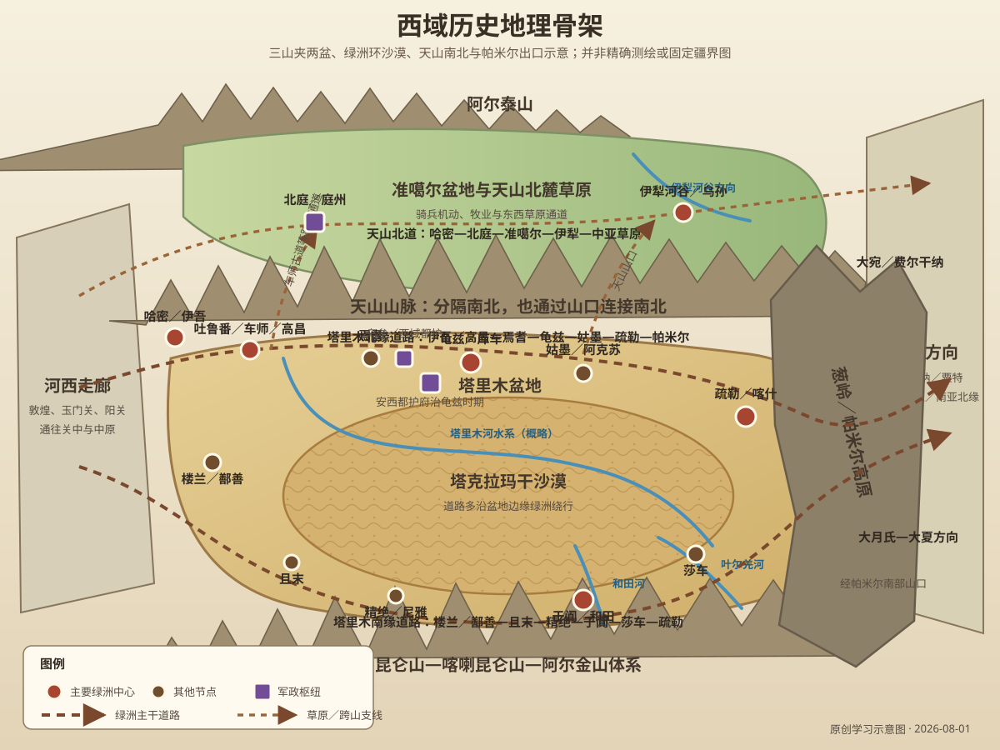
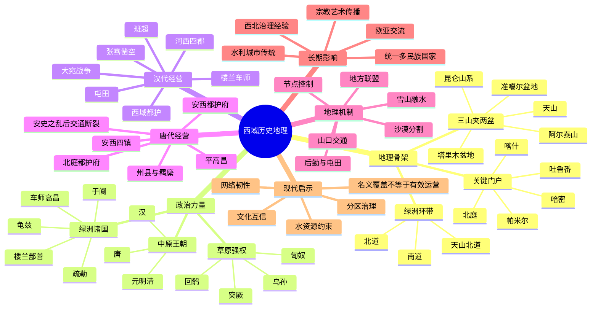

# 第十四章　西域

- **创建日期**：2026-08-01
- **状态**：初版，已配原创历史地理示意图与独立时间轴
- **关键词**：西域、天山、塔里木盆地、准噶尔盆地、塔克拉玛干沙漠、绿洲城邦、张骞、楼兰、车师、龟兹、于阗、疏勒、乌孙、大宛、西域都护、班超、安西都护府、北庭都护府、安西四镇、丝绸之路、葱岭、帕米尔高原
- **章节性质**：围绕原书章节主题展开的原创历史地理学习指南，不逐段复述原书

## 章节概览

“西域”并不是一个边界始终不变的现代行政区名。先秦至汉代，它常指玉门关、阳关以西的广大地区；在不同史书和时代中，其范围有时以塔里木盆地和天山南北为核心，有时又延伸到葱岭以西的中亚、西亚乃至更远地区。理解“西域”，首先要摆脱把它看成一块均质土地的想象：这里不是一整片可以自由穿越的平原，而是由高山、盆地、沙漠、草原、河谷和绿洲组成的巨大网络。

天山横贯中部，把区域分成南北两个不同世界。天山以南的塔里木盆地被昆仑山、帕米尔高原、天山和阿尔金山包围，中央是塔克拉玛干沙漠，人口和城市只能沿盆地边缘依靠冰雪融水形成的绿洲生存。天山以北的准噶尔盆地与伊犁河谷则更适合草原游牧和跨山迁徙。东部的哈密、吐鲁番是河西走廊进入西域的门户，西部的喀什、帕米尔与伊犁河谷则连接中亚。西域因此不是单一通道，而是多条道路在绿洲节点间不断分合的交通系统。

汉朝经营西域，表面上是与匈奴争夺远方诸国，实质上是争夺河西走廊以西的交通、马匹、情报和联盟网络。张骞“凿空”并非凭空创造道路，而是把此前分散的区域交通转化为中原王朝能够认识、组织和持续利用的跨区域网络。西域都护的设立，也不是简单地在地图上涂上一块颜色，而是通过印绶、使者、屯田、驻军、驿传和地方首领合作，把许多绿洲政权纳入一个层级不同、强弱有别的治理体系。

唐朝建立安西、北庭两大都护府，将天山南北分别组织起来，并借安西四镇控制塔里木盆地北缘及葱岭方向。然而，西域的控制从来高度依赖河西走廊、陇右、东天山与绿洲节点的连续安全。一旦中间的补给链被切断，即使远方城镇仍愿维持旧有关系，中央政权也很难长期输送军队、粮食、官员和信息。

本章的核心结论是：

> 西域不是一条路，而是一张由雪山水源、沙漠边缘、绿洲城镇、草原通道和山口共同组成的网络。谁能维护东部入口、关键绿洲、天山南北通道和帕米尔出口，谁才可能把短暂的军事抵达转化为长期的政治影响；而真正稳定的经营，始终依赖交通、屯田、地方合作与文化互信。

---

## 一、地理环境：三山夹两盆，沙海围绿洲

### 1. “西域”的范围为什么不断变化

“西域”是一个以中原视角命名的历史地理概念。“西”表示相对于关中、河西而言的方位，“域”则意味着多个地区与政治单元的集合，而不是边界清晰的单一国家。

| 时代或语境 | “西域”的常见核心范围 | 需要注意的问题 |
|---|---|---|
| 汉代 | 玉门、阳关以西，重点为天山南北和塔里木盆地诸国，也可延伸至葱岭以西 | 《汉书》所记诸国数量和范围随政治形势变化，不宜机械理解为固定“全国行政区” |
| 魏晋南北朝 | 河西以西、吐鲁番、塔里木盆地及中亚方向 | 高昌、柔然、嚈哒、突厥等力量交替，政治边界频繁变化 |
| 隋唐 | 伊州、西州、庭州、安西四镇、北庭及葱岭以西羁縻区域 | 唐朝直接州县、军镇控制与羁縻关系并存，控制强度并不相同 |
| 宋元明清 | 有时泛指今日新疆及中亚部分地区 | “西域”逐渐成为更宽泛的历史文化名词，不能直接等同于现代新疆全部范围 |

因此，学习西域历史时，应先说明时代，再讨论范围；不能把汉代的“西域”、唐代的“安西”与现代行政疆界完全重合。

### 2. 三山夹两盆：新疆地形的总骨架

从现代自然地理看，新疆常被概括为“三山夹两盆”：北部阿尔泰山，中部天山，南部昆仑山—喀喇昆仑山—阿尔金山体系；阿尔泰山与天山之间是准噶尔盆地，天山与昆仑山之间是塔里木盆地。

这一骨架直接影响古代政治与交通：

1. **天山是分界，也是桥梁**：它将南疆绿洲与北疆草原分开，却又通过铁门关、车师古道、伊塞克湖方向山口等通道把两侧连接起来。
2. **塔里木盆地适合绿洲城邦**：中央沙漠阻止大规模连续定居，城市集中在山前冲积扇和河流末端。
3. **准噶尔盆地和伊犁河谷适合游牧与骑兵机动**：草原力量能够沿天山北麓东西移动，并通过山口影响南疆。
4. **帕米尔高原控制西向出口**：它既是障碍，也是通往费尔干纳、巴克特里亚和南亚北缘的高地枢纽。

### 3. 东部门户：哈密、吐鲁番与东天山

从敦煌向西，最容易到达的第一组大型绿洲是哈密和吐鲁番。哈密古称伊吾一带，连接河西走廊、蒙古高原和天山南北；吐鲁番盆地则地势低、气候干热，却依赖天山融雪和坎儿井等水利系统形成稳定农业。

吐鲁番并非仅是“路边绿洲”。它北接天山山口，可通准噶尔盆地；西经焉耆、库尔勒进入塔里木北缘；东接哈密和敦煌。汉代车师、魏晋高昌、唐代西州，都说明东天山是经营西域的前进基地。一个中央政权若失去哈密—吐鲁番—北庭这一组节点，就很难稳定进入更西的塔里木盆地。

### 4. 塔里木盆地：沙漠中央不可穿，城市沿边成环

塔里木盆地面积巨大，中央是塔克拉玛干沙漠。古代道路通常不直接横穿沙漠腹地，而是沿盆地边缘的绿洲移动。

- **北缘道路**：大致沿吐鲁番、焉耆、库尔勒、库车、阿克苏、喀什一线，背靠天山南麓。水源相对较多，城镇密集，龟兹等国长期成为区域中心。
- **南缘道路**：大致沿若羌、且末、尼雅、于阗、叶城、莎车一线，依靠昆仑山北麓河流。路线更贴近荒漠，绿洲间距离常较长，但可连接青藏高原北缘、克什米尔和帕米尔南部。
- **盆地东部**：楼兰—鄯善地区曾控制罗布泊周边道路；水系和湖泊位置变化会导致城市与道路兴衰。
- **盆地西部**：喀什、莎车一带是南北道路汇合区，也是进入帕米尔和中亚前的重要补给中心。

古代所谓“南道”“北道”也并非永远固定。河道改道、湖泊萎缩、战争、治安、税费和政权更替都会使商旅改走其他支线。丝绸之路更准确的形态，是一张会随环境与政治变化而调整的路网。

### 5. 雪山水源：绿洲国家的生命线

西域许多城市降水稀少，真正支撑农业的是高山冰雪融水。天山、昆仑山和帕米尔高原的河流流出山口后，在冲积扇上分流，形成耕地、牧场和聚落；继续向沙漠流动时，水量逐渐蒸发、下渗，最终消失或汇入内流河。

这种水文结构造成几个历史后果：

- 城市必须靠近可控制的河渠，政治中心往往也是水利中心。
- 上游绿洲扩张可能减少下游水量，引起聚落迁移或冲突。
- 战争不必摧毁城墙，只要破坏渠道和田地，就能迅速削弱城市。
- 国家驻军必须屯田，否则从河西远距离运粮的成本极高。
- 绿洲人口承载力有限，大军长期驻扎会给水、粮、草带来巨大压力。

楼兰、尼雅等遗址的衰落不能简单归因于某一个事件，但河道变迁和水资源变化显然是理解其历史的重要条件。

### 6. 天山北麓：草原力量为什么能影响整个西域

准噶尔盆地、伊犁河谷和天山北麓拥有更广阔的牧场，适合骑马民族季节性移动。匈奴、乌孙、突厥、回鹘、准噶尔等政治力量都曾利用北疆草原形成较大规模的军事和联盟网络。

南疆绿洲城邦人口和资源有限，往往难以单独抵御北方骑兵集团。控制北疆的强权可以通过山口向南施压，征收贡赋、控制商路或扶植地方势力。因此，汉朝不能只经营塔里木南北道，还要处理乌孙、车师和匈奴的关系；唐朝也必须设置北庭，与安西共同构成天山南北体系。

### 7. 葱岭与帕米尔：西域的西门

古代“葱岭”通常指帕米尔高原及其周缘山系。这里海拔高、气候严酷，却连接多个方向：向西进入费尔干纳盆地和粟特地区，向南可达克什米尔与犍陀罗方向，向北联系伊塞克湖和七河流域，向东则回到喀什与塔里木盆地。

帕米尔不是一座只有单一出口的“墙”，而是一组高山谷地和季节性道路。通过它的人不只是商人，还有使者、军队、僧侣、工匠、翻译和移民。西域之所以成为文明交汇地，正是因为它位于东亚、南亚、中亚和西亚多个交通系统的连接处。

### 8. 原创历史地理示意图

> 下图为学习用途的原创示意图，强调三山两盆、塔里木盆地南北缘绿洲道路、天山北道、东部入口与帕米尔出口的关系，并非精确测绘或固定疆界图。

---

## 二、历史背景：绿洲诸国、草原强权与跨区域交流

### 1. 张骞以前，东西交流已经存在

张骞出使之前，欧亚大陆内部已经存在作物、金属技术、马匹、玉石和纺织品的长距离传播。河西走廊、天山通道和塔里木绿洲并不是无人涉足的空白地带。考古发现表明，西域长期存在多种人群、语言和生产方式，农业、畜牧业和手工业彼此交织。

张骞的历史意义，不在于“发现”一个此前不存在的世界，而在于他把中原王朝对西方的零散认识，转化为较系统的地理、政治和交通情报，并推动国家持续派遣使者、组织军事行动和建立制度化联系。

### 2. “西域三十六国”不是固定不变的三十六个现代国家

汉代文献常以“三十六国”概括西域诸国，后来又记五十余国。这里的“国”包括规模不同的绿洲政权、部族集团和城郭单位，有的只控制一个主要绿洲，有的则能影响多个城镇和道路。

它们具有几个共同特征：

- 人口通常集中在有限耕地和水源周围。
- 王权依赖贵族、城镇和灌溉系统，资源规模远小于中原帝国。
- 对外政策往往在汉、匈奴、乌孙、贵霜、突厥等大势力之间调整。
- 同一名称的政权可能迁徙、分裂或更换中心，不能用现代固定国界理解。

因此，“小国林立”并不代表当地社会简单落后，而是干旱绿洲环境下政治空间碎片化的结果。

### 3. 匈奴为何重视西域

匈奴控制河西和西域，不只是为了获得贡赋。西域可以提供马匹、农产品、手工业品和对外贸易收益，还能形成对汉朝西北边境的战略包围。匈奴通过设置僮仆都尉等方式影响诸国，使西域成为其军事、经济和外交体系的一部分。

对汉朝而言，如果匈奴同时控制河套、河西与西域，汉朝西北边境就会长期承压；若汉朝夺取河西并联络西域，则可以切断匈奴与羌人的联系，争取乌孙等盟友，并从侧翼削弱匈奴。

### 4. 河西走廊是经营西域的前提

汉朝在前121年前后重创河西匈奴，随后设置河西四郡，才获得稳定向西推进的基地。没有敦煌、酒泉等绿洲和仓储节点，汉使即使能偶尔穿越戈壁，也无法形成连续交通。

这揭示了一个基本规律：

> 远方政策的上限，取决于近方基础设施。西域战略看似发生在天山和帕米尔，真正的后勤根基却在关中、陇右与河西走廊。

---

## 三、关键事件：从张骞“凿空”到安西、北庭

### 1. 张骞两次出使：把未知空间变成可描述的世界

汉武帝最初派张骞西行，是希望联络被匈奴击败后西迁的大月氏夹击匈奴。张骞途中被匈奴扣留多年，逃出后到达大宛、康居和大月氏，最终未能实现军事联盟，却带回极其重要的西域情报。

他的贡献包括：

1. 说明大宛、康居、大月氏、大夏等地的方位、距离、物产和政治关系。
2. 发现汉朝西南商品可能经身毒流入中亚，扩大了对跨区域贸易的认识。
3. 使乌孙进入汉朝外交视野，为后来联姻与联盟奠定基础。
4. 推动汉使“相望于道”，形成持续的官方交通。

“凿空”不是把山挖开，而是突破知识、外交与政治隔绝，使一条条地方道路第一次被中原王朝纳入整体战略图景。

### 2. 楼兰、车师与大宛：交通节点为何引发战争

楼兰位于罗布泊附近，处在敦煌进入塔里木盆地南北道的分岔区域。它国力不大，却能影响汉使通行。汉与匈奴反复争夺楼兰，说明交通门户的价值往往大于其人口和土地面积。后来楼兰改称鄯善，政治中心和活动范围也随水系与局势变化。

车师位于吐鲁番及东天山一带，是南北交通要冲。控制车师，可以向南进入焉耆、龟兹方向，也可向北越天山进入草原。汉匈对车师的争夺，本质上是争夺东天山门户。

前104年至前101年的大宛战争，则显示汉朝对西域政策已从使者外交升级为远程军事行动。汗血马是著名动机，但战争也涉及国家威望、使者安全和通道控制。远征成功并不意味着汉朝直接统治大宛，而是强化了汉朝在西域诸国眼中的影响力。

### 3. 屯田与使者校尉：军事抵达如何变成常态经营

西域距离关中遥远，全部粮食依赖内地运输几乎不可能。汉朝在轮台、渠犁等地屯田，并设置使者校尉等官职，将军队、农业和交通保障结合起来。

屯田的作用包括：

- 为驻军与使团提供本地粮食。
- 保护道路与驿站。
- 示范或扩展灌溉农业。
- 形成可长期存在的国家节点。

它也有明显限制：可耕地和水量有限，驻军规模不能无限扩大；若河西通道被切断，屯田点也会孤立。

### 4. 前60年设西域都护：从多线交往到制度化统筹

匈奴内部发生变化、日逐王归汉后，汉宣帝时期设置西域都护，郑吉被任命为首任都护。都护驻乌垒附近，位置靠近塔里木北缘交通线，也便于联系车师和天山南北。

西域都护的治理并非把所有地方都改设为中原式郡县，而是通过多层方式发挥作用：

- 向地方首领颁发印绶，确认政治关系。
- 调解诸国冲突，维护使者与道路安全。
- 统筹屯田、驻军与军事行动。
- 监督重要节点，防止匈奴重新控制。
- 借助当地王侯、翻译和向导治理，而不是完全替代地方制度。

这种模式既有行政管辖，也保留地方自治和羁縻色彩，其实际控制强度随汉朝国力、道路安全和地方形势而波动。

### 5. 王莽时期断裂与班超经营：交通网络可以中断，也可以重建

西汉末至王莽时期，朝廷与西域关系恶化，匈奴势力回升，原有网络受到破坏。东汉初年因国内恢复和北方压力，不能立即全面经营西域。

73年起，班超随军进入西域，后以少量汉军和大量地方盟友长期活动。他善于判断绿洲诸国的利益，在外交、威慑和军事之间灵活转换，逐步恢复东汉影响。班超的成功说明：

- 西域经营不是单靠大军占领，而是依靠情报、信誉和联盟。
- 一个关键使者若能协调多个地方力量，可以放大有限资源。
- 远方治理必须让地方政权相信合作比倒向对手更安全。

但班超个人能力也说明制度的脆弱性：当中央支持不足、继任者能力有限或北方形势变化时，网络仍可能再次松动。东汉后来以西域长史等机构继续维持联系。

### 6. 魏晋南北朝：高昌兴起与多政权竞争

东汉以后，中原长期分裂，西域并未因此与东方完全隔绝。曹魏、西晋沿用戊己校尉、西域长史等制度；前凉在吐鲁番设置高昌郡，使郡县制进一步进入东天山绿洲。

此后，高昌地区先后出现多个地方政权，塔里木盆地则受到柔然、嚈哒、突厥等力量影响。佛教沿西域传播并形成龟兹、于阗、高昌等文化中心，粟特商人活跃于交通网络。这个时期的西域不是“失去管理后的空白”，而是多种政权、宗教、语言和商业网络并存的复杂世界。

### 7. 唐平高昌与安西都护府：先控制东门，再向西展开

640年，唐朝平定高昌，在吐鲁番设置西州，并设安西都护府。此举首先解决的是东天山门户问题：高昌位于河西通往塔里木和北疆的要冲，若这里不受控制，唐军与使者就难以继续西进。

安西都护府后来西迁至龟兹一带，更接近塔里木盆地中部和西向道路。唐朝又设置龟兹、于阗、疏勒、碎叶等军事重镇，通常称“安西四镇”；具体组合曾随形势调整，焉耆一度取代碎叶。

唐朝治理西域同样不是单一模式：

- 伊州、西州、庭州等汉民和农业人口较集中的地区采用州县制度。
- 其他地区设置羁縻府州，保留当地首领和习俗。
- 军镇、守捉、烽燧、驿站与屯田共同维持交通。
- 中央册封、官职、婚姻和贸易构成政治关系网络。

### 8. 北庭都护府：为什么经营南疆必须兼顾北疆

唐朝击败西突厥后，天山北麓的战略地位进一步上升。702年设置北庭都护府，后升为大都护府，与安西共同管理天山南北。

北庭所在的庭州地区位于今吉木萨尔附近，南面可经车师古道越天山，北面连接准噶尔草原，东面通哈密与河西，西面通伊犁和中亚。它的作用不是安西的简单重复，而是防止北方草原力量从侧翼压迫塔里木绿洲。

安西与北庭构成双枢纽：

- 安西重在塔里木盆地、葱岭和西向道路。
- 北庭重在天山北麓、草原交通和东天山安全。
- 两者共同依赖河西—伊州—西州这条东向生命线。

### 9. 怛罗斯、安史之乱与吐蕃扩张：远方控制的真正弱点在中间

751年怛罗斯之战常被描述为唐朝与阿拉伯帝国决定文明走向的大战，但其直接影响不宜夸大。唐朝在西域的根本转折，更与755年安史之乱后内地兵力东调、河西陇右防线削弱有关。

当吐蕃逐步控制河西、陇右和塔里木部分地区后，安西、北庭与唐朝本土的联系被切断。远方守军可能继续坚持，地方也可能延续唐制，但缺乏人员、军饷和命令补充，长期维持越来越困难。

这再次证明：

> 帝国的远方边界不一定先从最远端崩溃，往往先从连接核心与前线的中间走廊断裂。

### 10. 唐以后：多元政权延续西域网络

唐朝在西域的直接控制衰退后，吐蕃、回鹘、高昌回鹘、喀喇汗王朝、西辽、蒙古诸政权先后影响天山南北。贸易、佛教、摩尼教、景教和后来伊斯兰教继续传播，语言与族群结构也不断变化。

元代把西域纳入更广阔的蒙古帝国交通体系；明代通过哈密卫、册封和贡使关系维持西北联系；清代平定准噶尔、统一天山南北后，于1762年设伊犁将军，1884年正式建新疆省。现代新疆行政区的形成，是长期历史演变的结果，不能把任何一个古代“西域”范围直接投射到今天。

---

## 四、为什么地理如此重要

### 1. 沙漠把政治空间切成节点，而不是连续平面

在中原平原，军队可以沿大面积耕地推进，并在连续县城中获得补给；在塔里木盆地，沙漠将绿洲隔开，控制一个城市不等于控制整片区域。政权必须逐点维护水源、城镇、驿站和道路。

因此，西域的势力范围常呈现“点—线—网”结构：

- **点**：哈密、吐鲁番、龟兹、于阗、疏勒、北庭等关键绿洲。
- **线**：南道、北道、天山北道与跨山支线。
- **网**：由使者、地方王侯、商人、屯田军和驿站共同维持的关系体系。

地图上看似连续的控制区，实际可能只是若干节点之间可以通行；反过来，一个政权即使没有全面驻军，也可能通过联盟和交通控制产生广泛影响。

### 2. 东天山是“门轴”

河西走廊像通向西域的门廊，哈密—吐鲁番—北庭则像门轴。门轴稳定，南北道路都能转动；门轴失守，河西与西域便容易脱节。

汉代争夺车师、唐代平高昌并设置西州与北庭，都不是偶然。这里同时控制：

- 河西进入西域的第一批大型绿洲。
- 越天山连接南北疆的山口。
- 通往蒙古高原的支线。
- 向西进入焉耆、龟兹和伊犁的道路。

### 3. 北疆草原与南疆绿洲必须放在一起理解

如果只看塔里木盆地，会误以为西域史只是绿洲城邦史；如果只看草原，又会忽视城市、农业和商贸。实际上，北疆草原强权需要南疆农产品、手工业品和贸易税收，南疆绿洲又需要与草原力量谈判安全。

汉与匈奴、唐与突厥的竞争之所以覆盖天山南北，是因为两种生态区域彼此依赖又彼此制约。稳定经营西域，不能只占南道或北道，必须同时处理草原联盟、山口和绿洲政治。

### 4. 远距离统治的核心是后勤，而非地图距离

长安到龟兹的直线距离并不能说明治理难度。真正决定成本的是：途中有多少水源、多少驿站、多少可耕地、冬季能否越山、马匹在哪里更换、地方是否合作、敌对势力能否切断某个节点。

西域历史反复出现“少量军队影响广阔地区”和“大军远征却难以持久”的反差。原因在于：联盟、屯田和驿站能降低治理成本；单纯依靠远距离输送则成本迅速上升。

### 5. 生态变化会改写路线与城市等级

罗布泊水系变化、塔里木河改道、绿洲盐碱化、沙漠推进和渠系废弃，都可能使旧城衰落、新城兴起。地理不是静止背景，而是与人类用水、战争破坏和气候波动共同变化。

因此，古今地名对照只能表示大致地望，不能假设古城就位于现代城市中心，也不能把今天的河流和湖泊位置原样套用到两千年前。

---

## 五、作者观点：把“遥远边疆”还原成交通与节点系统

从本书一贯以地图解释历史的写法出发，本章可提炼出以下视角。这里是对章节方法的学习性概括，并非对原书文字的复述。

### 1. 西域并不只是“很远”

“远”是相对核心区而言的行政感受，地理上却存在明确的走廊、绿洲和山口。只要关键节点被组织起来，万里交通可以持续；若节点断裂，再近的地方也可能失联。

### 2. 丝绸之路不是一条浪漫商道

它既是贸易网络，也是外交路、军事路、宗教路和移民路。丝绸只是众多流通物之一。道路的开放依赖政治秩序与基础设施，也伴随战争、征税、竞争和风险。

### 3. 中央王朝的西域经营具有层级差异

郡县、都护府、军镇、屯田、羁縻府州、册封关系和外交联盟不能混为一谈。地图上的同一颜色，可能遮蔽各地控制强度的巨大差别。

### 4. 地理提供结构，人物与制度决定结果

张骞、郑吉、班超、苏定方等人物利用了既有道路和政治矛盾，但个人勇略只有与河西基地、国家财政、屯田制度和地方合作结合，才能产生长期效果。

---

## 六、深度分析

### 1. 西域治理是一种“网络型治理”

传统帝国的核心地区多采用郡县和户籍体系，行政权力可以逐级下达；西域距离远、族群语言多样、绿洲分散，完全复制内地制度成本过高。汉唐因而采用网络型治理：

- 在关键节点设置都护、长史、军镇和屯田。
- 承认地方王侯，由中央授予印绶和官号。
- 通过人质、婚姻、赏赐、贡使和互市维持关系。
- 在危机时调动多个绿洲国家共同出兵。
- 借翻译、商人和地方精英传递信息。

这种体系覆盖面可以很广，但稳定性取决于中心威望、道路安全和地方利益。一旦中央无法兑现保护与赏赐，节点便可能转向其他强权。

### 2. 为什么“控制交通”常比“占领土地”更重要

沙漠腹地本身缺少人口和产出，投入军队占领意义有限。真正有价值的是水源、城市和道路交叉口。控制龟兹，可以影响塔里木北缘中段；控制喀什，可以影响南北道汇合与帕米尔出口；控制北庭，可以影响天山北麓与南北穿越。

这是一种“枢纽优先”的战略。现代网络中的交换机、港口和数据中心也有类似特点：节点面积不大，却决定整体流动效率。

### 3. 汉朝与匈奴争夺西域，是两套生态体系的竞争

汉朝依靠农业税收、城邑、步骑混合军队和官僚体系；匈奴依靠草原牧业、骑兵机动和部族联盟。西域恰好位于农耕、绿洲和草原生态交界处。

汉朝的优势是能建设城塞、屯田和持续行政；弱点是距离远、运输成本高。匈奴的优势是骑兵机动和北疆草原联系；弱点是对绿洲农业和城镇的直接管理能力有限。双方都需要地方政权合作，因此战争之外，外交和威望极为重要。

### 4. “凿空”真正改变的是认知地图

国家只有在知道远方有哪些政权、道路多长、物产为何、谁与谁敌对之后，才能形成战略。张骞带回的情报使汉朝从“西边有若干部族”的模糊认识，转向一张包含大宛、康居、大月氏、大夏、乌孙和身毒等地的关系图。

认知地图一旦扩大，政策目标也随之改变：从防守边境，变成经营河西、联络乌孙、派使通商、控制楼兰车师、设置都护。地理知识本身就是国家能力。

### 5. 安西、北庭的双中心说明不能用单一首府治理所有生态区

天山南北的生产方式、道路方向和安全威胁不同。把全部军政任务集中在一个都护府，容易顾此失彼。唐朝建立安西与北庭两套中心，体现了对区域差异的制度回应。

这类似现代大型组织的区域架构：总部确定战略，不同区域中心根据本地网络和风险分工。统一不等于一切集中，真正有效的统一往往建立在合理分区之上。

### 6. 怛罗斯之战为何不应被神话

怛罗斯之战具有重要象征意义，反映唐朝、阿拔斯势力和中亚地方政治的交汇，但不能把唐朝后来退出西域完全归因于一次战败。唐军此后仍在安西活动，真正改变战略格局的是安史之乱造成的兵力内调，以及吐蕃对陇右、河西交通线的持续进攻。

历史解释应区分：

- **单次战役的直接结果**；
- **长期结构性变化**；
- **后世叙事赋予的象征意义**。

### 7. 文化交流不是单向“输入”或“输出”

佛教从印度和中亚经西域传入中原，龟兹乐舞、胡旋舞、乐器和艺术样式影响内地；同时，中原的汉字文书、官制、丝织技术、建筑和佛教制度也进入西域。粟特、于阗、龟兹、高昌等地既是中转站，也是主动创造文化的中心。

西域文化不应被写成东西文明简单相遇的“走廊”，它自身就是生产知识、宗教艺术和商业制度的区域。

---

## 七、长期影响

### 1. 扩展了中国古代的世界认知

张骞以后，中原史书开始更系统记载中亚、南亚和西亚。地理知识、物产信息和政治情报扩大了国家与社会的世界视野，也推动地图、使节制度和翻译活动发展。

### 2. 塑造统一多民族国家的西北治理经验

西域都护、长史、安西、北庭、羁縻府州、伊犁将军与建省制度，虽然时代不同，却都在探索如何治理距离遥远、族群多样、生态差异显著的西北区域。其长期经验包括分区治理、地方合作、交通建设、边防与民政结合。

### 3. 形成跨欧亚文化交流的重要平台

佛教、祆教、摩尼教、景教和伊斯兰教先后经西域传播；汉语、吐火罗语、粟特语、于阗语、突厥语等曾在不同地区使用。壁画、雕塑、音乐、服饰、饮食和工艺呈现多重文化融合。

### 4. 促成绿洲城市与水利传统的积累

长期屯田、灌溉和城市建设形成独特的绿洲治理经验。坎儿井、渠道、河渠分水和田地管理，使极端干旱环境中的城市得以延续。与此同时，过度用水也不断提醒后人：绿洲繁荣有严格生态上限。

### 5. 影响后世西北战略格局

无论汉唐还是清代，经营西域都必须同时考虑河西走廊、蒙古高原、青藏高原和中亚方向。西北从来不是单一边界，而是多个地理板块交会的战略体系。

---

## 八、现代启示

### 1. 基础设施的价值在于形成连续网络

一条公路、一个驿站或一座城市单独存在意义有限。只有能源、通信、仓储、交通和服务节点连续可靠，远距离联系才真正成立。汉唐西域交通的兴衰，说明系统可靠性取决于最脆弱的中间节点。

### 2. 水资源是干旱地区发展的硬约束

绿洲城市不能只追求扩张，还必须考虑上游与下游、农业与城市、当代与未来之间的水量分配。历史上城市因水系改变而迁移，现代技术虽能提高效率，却不能取消生态边界。

### 3. 多元地区需要分层、分区治理

统一规则有助于保持整体秩序，但不同生态、经济和文化区域需要适当的地方治理空间。安西与北庭的分工说明，复杂系统往往需要“统一目标＋区域自治＋节点协调”的架构。

### 4. 信任可以降低治理和交易成本

班超等人能以有限兵力产生影响，依靠的不只是威慑，还有长期信誉和对地方利益的理解。现代跨区域合作同样需要稳定规则、可靠承诺和文化沟通。

### 5. 不要把地图颜色当成实际能力

企业市场版图、国家影响范围或技术平台覆盖率，都可能在地图上显得完整，但真正能力取决于人员、供应链、现金流、服务节点与本地伙伴。西域史提醒我们：名义覆盖与有效运营是两回事。

### 6. 认知升级先于战略升级

张骞带回的不是立即可见的领土，而是一张更大的世界关系图。对现代个人与组织而言，深入调查、建立可靠信息网络和理解外部系统，往往是重大决策的第一步。

---

## 九、古今地名对照

> 古代地望常存在学术争议，政权中心也可能迁移。下表只给出便于学习的大致对应，不能视为精确边界。

| 古代名称 | 大致现代位置 | 历史地理说明 |
|---|---|---|
| 西域 | 以今日新疆天山南北为核心，并可延伸至中亚等地 | 不同时代范围不同，不能直接等同现代新疆 |
| 玉门关、阳关 | 甘肃敦煌西北、西南方向 | 河西进入西域的重要关口，具体道路随时代变化 |
| 伊吾 | 新疆哈密一带 | 河西进入东天山的重要门户，唐置伊州 |
| 车师前国 | 新疆吐鲁番盆地及交河一带 | 汉匈争夺的东天山要地；与后世高昌、西州地理相关但并非完全同一政权 |
| 高昌 | 新疆吐鲁番市东部高昌故城一带 | 魏晋至唐初的重要绿洲政权与郡县中心 |
| 北庭／庭州 | 新疆吉木萨尔北庭故城一带 | 唐代北庭都护府中心，控制天山北麓与车师古道 |
| 楼兰 | 罗布泊西北及周边区域 | 早期控制沙漠东缘交通，后改鄯善；城址与水系变化密切相关 |
| 鄯善 | 主要活动于罗布泊、若羌一带 | 汉代楼兰改名后使用；与现代鄯善县不是简单一一对应 |
| 焉耆 | 新疆焉耆盆地、博斯腾湖周边 | 塔里木北缘东段绿洲，连接吐鲁番与龟兹 |
| 乌垒 | 新疆轮台县境内或附近 | 西汉西域都护府早期治所地望，具体遗址仍需结合考古研究 |
| 轮台 | 汉代轮台国大致在今轮台县一带 | 唐诗中的“轮台”有时指北庭地区，不能一律等同现代轮台县 |
| 龟兹 | 新疆库车及周边 | 塔里木北缘大国、佛教和音乐中心，唐安西都护府重要治所 |
| 姑墨 | 新疆阿克苏一带 | 塔里木北缘西段绿洲政权 |
| 疏勒 | 新疆喀什、疏勒一带 | 南北道路汇合、通往帕米尔的重要枢纽 |
| 莎车 | 新疆莎车一带 | 塔里木西南缘重要绿洲，与南道和帕米尔交通有关 |
| 于阗 | 新疆和田及周边 | 昆仑山北麓大绿洲，以玉石、佛教和农业著名 |
| 精绝 | 新疆民丰尼雅遗址一带 | 南道绿洲政权，遗址保存大量文书和生活遗物 |
| 且末 | 新疆且末一带 | 塔里木南缘东段绿洲，连接若羌与于阗方向 |
| 大宛 | 今乌兹别克斯坦费尔干纳盆地一带 | 以良马与农业城市著名，汉武帝时发生大宛战争 |
| 康居 | 中亚锡尔河中下游及周边 | 范围与中心随时代变化，是中亚重要政治力量 |
| 乌孙 | 伊犁河谷、伊塞克湖及七河流域一带 | 汉代重要盟友与草原政权，不是固定现代国界 |
| 大月氏 | 西迁后主要在阿姆河流域及巴克特里亚方向 | 后与贵霜帝国形成相关 |
| 葱岭 | 帕米尔高原及周缘山系 | 塔里木盆地通往中亚、南亚的重要高地门户 |
| 碎叶 | 今吉尔吉斯斯坦托克马克附近楚河流域 | 唐安西四镇之一，位置远在今日中国国境以西 |
| 安西四镇 | 龟兹、于阗、疏勒、碎叶，部分时期以焉耆替换碎叶 | 是军事重镇组合，不是四个固定不变的省级行政区 |

---

## 十、时间轴

| 时间 | 事件 | 地理意义 |
|---|---|---|
| 公元前2千纪至前1千纪 | 西域各地形成农业、牧业和青铜文化交流网络 | 河西、天山、塔里木与中亚之间早已有人员和技术流动 |
| 前138—前126年 | 张骞第一次出使西域 | 中原王朝获得对大宛、康居、大月氏等地的系统情报 |
| 前121年前后 | 汉军控制河西走廊并逐步设置河西四郡 | 建立进入西域的东部后勤基地 |
| 前119—前115年 | 张骞第二次出使，重点联络乌孙 | 汉朝外交网络扩展至天山北麓和中亚方向 |
| 前108年前后 | 汉军攻击楼兰、车师 | 争夺塔里木东入口与东天山门户 |
| 前104—前101年 | 汉与大宛战争 | 展示远程军事能力，并提高汉朝在西域的政治威望 |
| 前101年后 | 汉在轮台、渠犁等地屯田 | 以本地粮源维持驻军和使者交通 |
| 前60年 | 西汉设置西域都护，郑吉任首任都护 | 对天山南北诸国的关系开始制度化统筹 |
| 73年起 | 班超进入西域并长期经营 | 以外交、联盟和有限军事力量恢复东汉影响 |
| 123年 | 东汉设置西域长史体系 | 在都护制变化后继续维持西域军政联系 |
| 327年前后 | 前凉在高昌设郡 | 郡县制进一步进入吐鲁番盆地 |
| 5—6世纪 | 高昌诸政权、柔然、嚈哒、突厥等并立 | 东天山与塔里木成为多政权竞争和文化交流区 |
| 640年 | 唐平高昌，设西州与安西都护府 | 控制东天山门户，建立向西经营的前进基地 |
| 657年 | 唐击败西突厥阿史那贺鲁势力 | 唐朝影响扩展至天山南北和中亚部分地区 |
| 7世纪中后期 | 安西都护府迁治龟兹，安西四镇体系逐渐形成 | 以塔里木北缘中心统筹南道、北道和葱岭交通 |
| 702年 | 唐设北庭都护府 | 安西、北庭分管天山南北，形成双中心体系 |
| 751年 | 怛罗斯之战 | 反映唐、阿拔斯与中亚地方力量竞争，但并非唐退出西域的唯一原因 |
| 755年后 | 安史之乱，西北兵力大量东调 | 河西、陇右防线削弱，远方都护府后勤链受损 |
| 8世纪后期 | 吐蕃逐步控制河西与西域部分地区 | 唐朝本土与安西、北庭交通被切断 |
| 9—13世纪 | 回鹘、高昌回鹘、喀喇汗、西辽等政权相继兴起 | 宗教、语言和族群结构持续变化，跨区域贸易延续 |
| 13世纪 | 蒙古帝国及其后继政权控制西域 | 西域纳入更广阔的欧亚驿路和帝国网络 |
| 1762年 | 清设伊犁将军 | 以伊犁为军政中心统筹天山南北 |
| 1884年 | 新疆建省 | 以行省制度加强行政一体化，现代新疆政区框架逐步形成 |
| 2014年 | “丝绸之路：长安—天山廊道的路网”列入世界遗产 | 古代跨国交通网络成为共同保护的文化遗产 |

更完整的分期和地理机制说明见：[第十四章独立时间轴](../Timeline/Chapter14_西域历史地理时间轴.md)。

---

## 十一、思维导图

---

## 十二、常见误区与辨析

### 误区一：“西域”就是现代新疆

西域在不同朝代范围不同，常以今日新疆为核心，但有时延伸到中亚、西亚。现代新疆是明确行政区，二者不能直接等同。

### 误区二：丝绸之路是一条固定直线

实际道路会沿绿洲分叉，因水源、战争和政权变化而改道。南道、北道和天山北道之间还有许多支线。

### 误区三：张骞开辟了此前完全不存在的道路

此前已有区域交流。张骞的重大贡献是打通官方认知和外交联系，把分散道路纳入汉朝可以持续经营的网络。

### 误区四：设置西域都护等于所有地方都改成郡县

西域都护代表制度化军政统筹，但大量地方仍由本地王侯管理。直接州县、驻军控制、羁縻与联盟关系并存。

### 误区五：唐朝因怛罗斯一战立即退出西域

怛罗斯并未立即终结唐朝在西域的存在。安史之乱、兵力东调以及河西陇右交通线被吐蕃切断，才是更深层的结构性原因。

### 误区六：古代轮台只有一个位置

汉代轮台与现代轮台县关系较近；唐诗中的“轮台”有时指北庭一带。阅读文献必须结合时代和上下文。

### 误区七：西域只是被动接受外来文化

龟兹、于阗、高昌和粟特商人等都是文化创造者。西域不仅转运宗教、艺术和商品，也产生独特的语言、音乐、绘画和制度实践。

---

## 十三、参考资料

### 传世文献

1. 司马迁：《史记·大宛列传》《史记·匈奴列传》。
2. 班固：《汉书·西域传》《汉书·张骞李广利传》《汉书·傅常郑甘陈段传》。
3. 范晔：《后汉书·西域传》《后汉书·班梁列传》。
4. 鱼豢撰、裴松之注引：《魏略·西戎传》。
5. 玄奘、辩机：《大唐西域记》。
6. 《旧唐书·西戎传》《旧唐书·地理志》。
7. 《新唐书·西域传》《新唐书·地理志》。
8. 司马光：《资治通鉴》汉武帝、汉宣帝、东汉班超及唐代安西相关卷次。

### 现代研究与工具书

1. 谭其骧主编：《中国历史地图集》，中国地图出版社。
2. 余太山：《西域通史》，中州古籍出版社。
3. 芮传明：《古代西域交通与法显印度巡礼》，上海古籍出版社。
4. 荣新江：《中古中国与外来文明》，生活·读书·新知三联书店。
5. 王炳华：《新疆历史文物》，文物出版社。
6. 张弛：《汉唐时期环塔里木盆地文化地理研究》，商务印书馆。
7. 罗帅：《丝绸之路南道的历史变迁：塔里木盆地南缘绿洲史地考索》，甘肃教育出版社。
8. 新疆维吾尔自治区文物考古研究所及北京大学考古文博学院有关卓尔库特古城、西域都护府遗址群的考古报告与论文。

### 在线核对资料

1. 国家民族事务委员会：《西域都护府：开创中央王朝有效管理西域的先河》。
2. 国务院新闻办公室：《新疆的历史与发展》《新疆的若干历史问题》。
3. 国家文物局、文化和旅游部：“丝绸之路：长安—天山廊道的路网”世界遗产资料。
4. 全国哲学社会科学工作办公室：《如何确定汉代西域都护府的大体位置》。
5. 新疆及巴音郭楞蒙古自治州有关卓尔库特古城、西域都护府博物馆的考古与保护资料。

> 使用提示：古代里程、国名地望、都护府治所和道路走向存在不同学术意见。学习时应优先比较传世文献、出土文书、考古年代和自然地理条件，避免只凭现代地名作简单对应。

---

## 十四、章节总结

西域的历史首先是一部由地理塑造的网络史。天山把区域分为南北，塔克拉玛干沙漠迫使城市沿盆地边缘分布，昆仑山和天山融雪创造绿洲，东天山控制进入门户，帕米尔连接中亚与南亚。道路不是固定直线，而是在水源、城镇和政治安全之间不断选择的多层路网。

汉朝在夺取河西走廊后，借张骞获得知识，以外交和战争争夺楼兰、车师等节点，通过屯田降低后勤成本，最终设置西域都护统筹诸国。东汉班超的经历说明，远方影响力既依靠军力，也依靠信誉、联盟和地方合作。唐朝则通过西州、安西、安西四镇和北庭构建天山南北双中心体系，但其稳定仍依赖河西、陇右与东天山的连续交通。

西域最重要的历史启示，不是“谁曾经到过最远”，而是谁能长期维护水源、绿洲、驿站、军镇、地方关系与信息网络。地理决定通道与成本，制度决定能否把通道组织起来，文化互信决定网络是否愿意持续合作。

> 看懂西域，就要把视线从地图上的大片颜色移到一座座绿洲、一道道山口和一条条补给线上：真正支撑历史的，往往不是辽阔的空白，而是连接空白之间的节点。