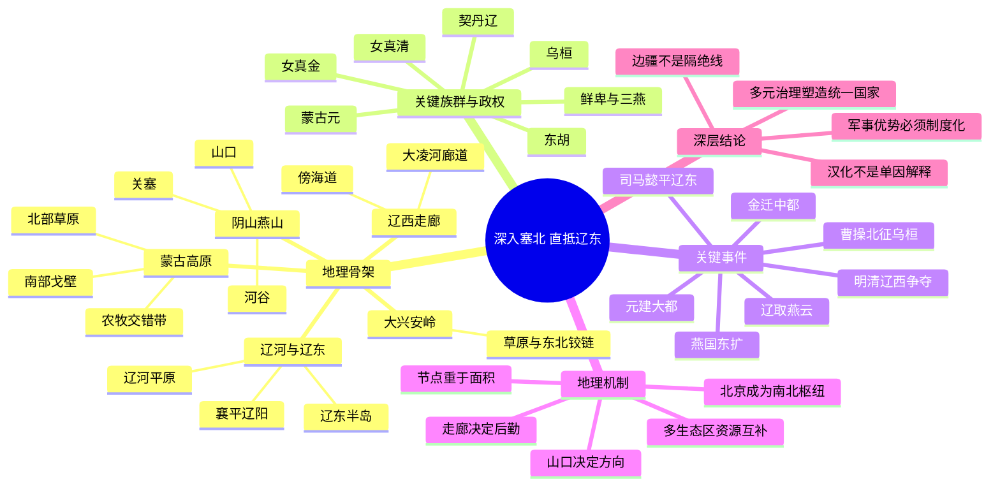

# 第十五章　深入塞北，直抵辽东

- **创建日期**：2026-08-02
- **状态**：初版，已配原创历史地理示意图与独立时间轴
- **关键词**：塞北、蒙古高原、大漠、阴山、燕山、大兴安岭、辽西走廊、大凌河、辽河平原、辽东、乌桓、鲜卑、契丹、女真、蒙古、曹操北征、白狼山、柳城、辽金元清
- **章节性质**：围绕原书章节主题展开的原创历史地理学习指南，不逐段复述原书

## 章节概览

“深入塞北，直抵辽东”出自后世文学叙事中曹操自述征战经历的豪迈表达，最直接的历史背景，是建安十二年（207年）曹操为消灭袁氏残余势力并击破三郡乌桓，越过燕山北部的旧塞和山地通道，突袭白狼山、进抵柳城。这个事件像一把钥匙，把华北北缘、蒙古高原东南部、辽西走廊和辽河流域连成了一幅完整的历史地理图。

从更长时段看，中国北方并不是“长城内外”两个彼此隔绝的世界。长城沿线恰恰位于农耕、游牧、半农半牧与渔猎经济交错的地带。阴山—燕山—大兴安岭并非绝对封闭的墙，而是由山口、河谷、盆地、草原和走廊组成的过滤带。人口、马匹、粮食、皮毛、盐铁、技术、宗教与政治制度，长期通过这些节点双向流动。

蒙古高原与东北平原之间，也并非被大兴安岭完全切断。大兴安岭南段海拔和坡度相对可通，西拉木伦河、老哈河、大凌河等河谷把草原腹地与辽西相连；再向东，辽河平原和辽东半岛连接松辽平原、鸭绿江流域、朝鲜半岛北部与黄渤海海域。正因为如此，东胡、乌桓、鲜卑、契丹、女真、蒙古等不同政治力量，都曾在“草原—辽西—辽东—华北”之间迁徙、联盟、战争和建国。

本章并不把北方历史简化为“游牧民族不断南下”。真正关键的是三种能力：第一，能否在草原和山地形成高机动的联盟；第二，能否控制燕山山口、辽西走廊和辽河节点；第三，进入农耕区后，能否把军事优势转化为税收、城市、粮运、官僚与多族群合作。辽、金、元、清的兴起，都不是单靠骑兵冲锋，而是依靠对多种生态区和多套制度资源的整合。

本章的核心结论是：

> 塞北与辽东不是边缘的尽头，而是连接蒙古高原、东北亚和华北平原的巨大铰链。决定历史的，不是某一条静止的边界，而是谁能控制山口、走廊、河谷、牧场和粮运，并把跨生态区的军事动员转化为可持续的国家治理。

---

## 一、地理环境：从阴山、燕山到辽河平原

### 1. “塞北”不是固定行政区

“塞北”是相对于中原和边塞而言的方位概念，通常指长城、关塞以北的地区，但其具体范围随时代而变化。汉代语境中的塞北，常偏向阴山以北和漠南、漠北；魏晋以后，它也可泛指燕山以北、蒙古高原及东北西部草原。不能把“塞北”直接等同于今天某一个省区，更不能把古代长城视为永远不变的国界。

长城本身也不是一条单纯墙体。不同王朝修筑的长城位置、结构和目的并不相同，其体系通常包括墙垣、壕堑、烽燧、关堡、军镇、道路、驿站和屯田区。它既用于预警和延缓突袭，也服务于交通管理、市场贸易、人口控制和军粮运输。

### 2. 蒙古高原：南部干旱带与北部草原

蒙古高原西起阿尔泰山，东至大兴安岭，南缘接阴山、燕山和河套—鄂尔多斯一带。高原内部并非一望无际、条件相同的草地：

- **南部戈壁与荒漠草原**降水较少，水源分散，是天然的缓冲带，也使大军远征高度依赖季节、向导和补给点。
- **中北部草原**牧草条件较好，适合马、羊、牛等畜群移动，能够支撑分散部落在战争时期快速集结。
- **河谷与山前地带**拥有相对稳定的泉水和冬营地，往往成为政治中心、交通节点和贸易场所。
- **东南缘农牧交错带**降水和地形变化大，既可放牧，也可在部分河谷耕作，是草原政治力量与华北政权反复争夺、融合最深的地区。

草原军事机动性很强，但政治组织并不因此天然稳定。游牧联盟通常要持续分配牧场、战利品、贸易收益和政治荣誉；一旦对外扩张受阻、继承失衡或生态灾害加剧，联盟也可能迅速分裂。

### 3. 阴山—燕山：屏障，更是通道集合

阴山横亘河套以北，燕山环绕华北平原北缘。山脉能够限制大规模队伍的行进方向，却无法完全阻断交通。真正决定通行的，是山口、河谷和盆地。

- 阴山南麓连接河套灌区，北侧通往漠南草原。
- 太行山北端与燕山之间的大同—宣化盆地，是华北通往草原的重要阶梯。
- 居庸关、古北口、喜峰口、卢龙塞等关口，分别连接北京平原、滦河上游、承德盆地与辽西地区。
- 山区道路狭窄、坡陡、水源有限，适合伏击和封锁；但熟悉地形者也可避开正面关口，利用旧道实施战略迂回。

曹操北征乌桓之所以成为经典案例，正因为常规滨海道路在夏季积水泥泞、敌军又据守要点，曹军遂在田畴引导下转走久已荒废的卢龙塞旧道，凿山填谷，绕向平冈和白狼山。地理障碍没有消失，而是被情报、工程和突然性暂时克服。

### 4. 大兴安岭：草原与东北的铰链

大兴安岭是蒙古高原东缘的重要山系，西侧偏向草原与高原，东侧进入松辽平原和东北森林地带。它既形成气候、植被和水系分界，也通过南北多条河谷保持联系。

尤其在南段，西拉木伦河—老哈河流域可向东南进入辽西，大凌河流域则进一步通往朝阳、锦州和渤海。历史上的东胡、乌桓、鲜卑、契丹等群体，常在这一过渡地带活动。这里不是单纯“草原民族”或“农耕民族”的专属空间，而是农耕、牧业、狩猎、采集和贸易长期叠加的复合区域。

### 5. 辽西走廊：两条主轴，不是一条细线

广义辽西走廊连接华北平原、蒙古高原东南部和辽河平原。其内部至少有两条重要交通轴：

1. **大凌河廊道**：由燕山山口经承德、凌源、朝阳，沿大凌河方向进入锦州。形成较早，能连接草原东南缘与辽西腹地，但山地起伏较大。
2. **傍海道**：大致由山海关、绥中、兴城、葫芦岛至锦州，北倚燕山余脉，南临渤海。路面相对平缓，却易受河流、海潮、沼泽、夏季降雨和沿线关城影响。辽金以后，特别是明清时期，这条道路的战略和运输地位愈加突出。

因此，“进入辽东”并非只要穿过山海关。山海关建于明代，此前各时代使用的关口、道路和海岸线条件并不完全相同。古代军队可能走山地内线，也可能走滨海通道，还可能利用海运配合陆路。

### 6. 辽河平原与辽东半岛

辽河平原由辽河及其支流冲积形成，地势较低平，农业潜力较大，但历史上也有湿地、沼泽和河道摆动问题。辽河上游通向西辽河流域和蒙古高原东部，中下游连接沈阳、辽阳和辽东湾；向东越过山地，可达鸭绿江流域；向南进入辽东半岛，可控制黄海、渤海之间的海上通道。

辽阳古称襄平一带，长期是辽东行政和军事中心。它向西联系辽西，向北联系松辽平原，向东通高句丽和鸭绿江方向，向南连接辽东半岛港口。谁控制辽阳及其交通网络，谁就更容易把“抵达辽东”变成持续经营。

### 7. 气候与季节：北方战争的隐形指挥官

北方战争高度受季节影响：

- 春季牧草未丰，畜群和战马恢复较慢。
- 夏季燕山与辽西可能多雨，滨海低地泥泞，河流暴涨。
- 秋季牧草成熟、农作物收获，常适合大规模行动，但时间窗口有限。
- 冬季河流结冰有时便利通行，却带来严寒、冻伤、饲草和粮食压力。

古代军队必须同时计算人粮、马草、饮水、道路、天气和敌情。地图上的直线距离，往往远小于真实行军成本。

---

## 二、历史背景：农耕、游牧与渔猎世界的长期交汇

### 1. 史前文明并非从中原单向扩散

辽西地区在新石器时代已有复杂社会发展。红山文化及牛河梁遗址说明，西辽河—大凌河流域很早就是东北亚文明互动的重要区域。后来的夏家店下层、上层文化，也反映出农业、畜牧、城址和青铜技术在不同环境中的组合。

这意味着辽西并不是等待中原“开发”的空白地带，而是拥有自身长期文化序列，并与华北、草原和东北腹地持续交流。理解后来的燕、秦、汉扩张，必须先承认这里原有的社会网络和区域中心。

### 2. 燕国东扩与辽东郡县

战国后期，燕国向东北扩张，设置上谷、渔阳、右北平、辽西、辽东等郡，并修筑北方长城。燕的推进依托燕山山口、滦河—大凌河通道和辽河平原节点，而非均匀覆盖整个东北。

秦统一后沿用并调整相关郡县体系。西汉在辽东、辽西经营城邑、道路和边防，并通过郡县、属国、校尉等不同制度处理农耕人口与乌桓、鲜卑等群体的关系。这里的“控制”有强弱层次：核心城址和交通线较稳定，远离道路的草原、山地和森林区域则往往依赖联盟、互市、册封和羁縻。

### 3. 东胡、匈奴、乌桓与鲜卑

秦汉之际，匈奴击破东胡。东胡余部中的乌桓、鲜卑逐渐形成不同政治群体。东汉时期，部分乌桓南迁至缘边诸郡，与汉地人口杂居，也被纳入边防和骑兵体系；留在塞外和辽西一带的部众，则在中原政局动荡时重新壮大。

东汉末年，辽西、辽东属国和右北平等地的乌桓势力与袁绍集团结盟。袁绍败亡后，袁尚、袁熙投奔乌桓，使辽西成为曹操统一北方必须解决的最后战略方向之一。

---

## 三、关键事件：从曹操北征到北方王朝兴起

### 1. 207年曹操北征乌桓

曹操已经控制河北大部，但袁氏残余与蹋顿领导的乌桓联盟仍可能从东北方向反攻。远征的最大困难不是战场本身，而是距离、道路和粮运。

曹操此前开凿平虏渠、泉州渠，尝试改善河北北部水运。大军到达无终附近后，恰逢雨季，滨海道路积水，乌桓又据守正面通道。田畴熟悉北方旧道，建议从卢龙塞出发，越过久已废弃的山路，经平冈方向直取柳城。

曹军舍弃部分辎重，隐蔽快速推进，在白狼山附近与仓促集结的乌桓军遭遇。曹操观察到对方阵势不整，命张辽等出击，斩蹋顿，乌桓联盟崩溃。袁尚、袁熙逃往辽东，后被公孙康杀死。曹操由此清除了袁氏残余，基本完成北方统一。

这场战役的地理意义有四点：

1. **正面通道受阻时，旧道和地方知识可以改变战略。**
2. **轻装突袭提高速度，却也放大补给和遭遇风险。**
3. **白狼山—柳城是草原、辽西和辽东之间的节点，不只是偏远战场。**
4. **军事胜利之后，曹操通过迁徙、编军和政治安置吸收乌桓力量，才把胜利转化为统治资源。**

### 2. 238年司马懿平辽东

曹魏时期，辽东公孙氏长期具有较强自主性。公孙渊反叛后，司马懿率军远征襄平。战役同样受到辽河水系、夏季暴雨和城池粮储影响。司马懿没有被一时洪水迫退，而是围困襄平，最终消灭公孙氏政权。

辽东的地方割据说明：距离中央遥远、交通线漫长、周边外交关系复杂，会给边疆行政中心带来自主空间；但辽阳—襄平这样的城市又依赖辽西通道和区域粮源，一旦被持续封锁，也难以无限支撑。

### 3. 慕容鲜卑与“三燕”

曹操迁徙乌桓部众后，辽西部分地区出现新的权力空间。慕容鲜卑逐渐进入大凌河流域，并在魏晋十六国时期建立前燕、后燕、北燕等政权，龙城（今辽宁朝阳一带）成为重要都城。

“三燕”历史表明，辽西走廊不仅是军队穿过的道路，也能孕育政治中心。这里可以同时吸收草原骑兵、华北农耕人口、辽东物产和中原制度文化。鲜卑政权的成长，正是跨生态区资源组合的结果。

### 4. 契丹辽：双重核心与多元治理

契丹兴起于西辽河流域，既接近蒙古高原东缘，又能进入辽西和东北平原。辽朝建立后，并未简单把所有地区纳入同一种制度，而是以多京体系、南北面官等方式处理不同生产方式和社会传统。

辽的地理优势在于：向西可联系草原，向东进入东北森林和渔猎区，向南通过辽西与燕云地区接触华北农业区。取得燕云十六州后，辽获得人口、城市、农田和关隘，也把政治重心进一步推向农牧交错带。

### 5. 女真金：从森林河谷到华北平原

女真兴起于东北东部的森林与河流地带。完颜部整合诸部后，利用骑兵、步战、联盟和对辽制度的吸收迅速扩张。灭辽后，金又南下占领北宋都城和华北大部。

金朝面临的难题，是如何同时治理东北旧地、草原边缘和人口密集的华北。迁都中都（今北京）有利于控制华北财政与交通，却也使国家更依赖南部农业税收和复杂官僚体系。金后期在蒙古高原方向修筑界壕，说明占据中原并不会自动消除北方边患；新的政治中心一旦南移，原先的北方腹地也可能转化为防御前线。

### 6. 蒙古元：把草原机动与大运河财政结合

蒙古帝国从蒙古高原形成超大规模军事联盟，随后占领华北、东北和欧亚广大地区。元朝定都大都（今北京），其地理意义非常突出：北京北通草原，东北连辽西和辽东，南接华北平原，并可通过运河和海运获得江南粮食。

元朝的统治不是“拒绝一切汉地制度”，而是在不同区域采取多层治理，并大量使用中原税收、城市、工匠、文书和交通系统。真正的挑战在于，如何在广阔帝国内维持政治继承、财政转运、地方合作和多族群精英联盟。

### 7. 女真再兴与清朝入关

明代东北存在卫所、部落联盟、互市和朝贡等多重关系。建州女真在辽东东部崛起后，逐步整合女真各部，并通过八旗制度组织军事、人口与生产。努尔哈赤、皇太极夺取辽东城镇后，明朝依赖山海关—宁远—锦州一线维持关外防御。

明清战争再次证明辽西走廊的“节点效应”：宁远、锦州、山海关不是孤立城堡，而是相互支撑的补给链。任何一处失守或被绕过，都会改变整个系统。清军最终入关后，又依靠北京、华北税粮、运河体系和原有官僚网络建立全国统治。

---

## 四、为什么地理如此重要

### 1. 北方不是一条边界，而是三层生态梯度

从南向北大致可见：华北农耕核心区、长城沿线农牧交错带、蒙古高原草原与荒漠区；向东又加入辽河农业区和东北森林—河流区。不同区域提供不同资源：

| 生态区 | 主要资源与能力 | 政治限制 |
|---|---|---|
| 华北平原 | 粮食、人口、城市、税收、工匠 | 防守线漫长，依赖稳定行政与运输 |
| 农牧交错带 | 马匹、耕地、山口、军镇、互市 | 气候波动大，族群与政权关系复杂 |
| 蒙古高原 | 骑兵机动、畜群、远距离联盟 | 粮食和城市资源有限，联盟维系成本高 |
| 辽西—辽河流域 | 走廊、农业、牧业、海陆交通 | 易成为多方争夺的战略铰链 |
| 东北森林河流区 | 毛皮、渔猎、林产、河运与骑步混合力量 | 人口分散，向外扩张需整合其他生态区 |

强大王朝往往不是只占据其中一层，而是能够把多层资源组合起来。

### 2. 走廊控制比面积占领更重要

古代地图容易给人一种错觉：疆域颜色覆盖某地，就代表均匀而稳定的统治。实际上，边疆控制首先表现为对道路、渡口、河谷、城镇和市场的掌握。

在辽西与辽东，山海关、锦州、朝阳、辽阳等节点的价值远大于其面积。掌握节点可以调兵、运粮、传递命令、征税和组织贸易；失去节点，则大片土地可能在名义上属于某政权，实际上却无法有效到达。

### 3. 军事机动必须转换成财政与制度

草原联盟常能在短期内形成惊人的军事速度，但占领农耕区后，国家必须回答新的问题：谁来征税？如何保护耕作？怎样修河渠和道路？如何处理城市人口、地方士族、宗教组织与不同法律传统？

辽、金、元、清之所以能够建立大范围王朝，关键不在于保持一种“纯粹草原生活”，而在于建立跨区域制度。它们都在不同程度上保留本族组织，同时吸收中原官僚、文字、财政和城市治理经验。

### 4. 北京为何成为南北整合中心

北京位于华北平原北缘，西北有居庸关通向宣化、大同与草原，东北经古北口、喜峰口和山海关联系辽西、辽东，向南拥有广阔农业腹地，并能通过运河与江南相连。

这种位置使北京既是边缘，也是中心：对以中原为核心的王朝，它是北方前线；对从草原或东北兴起的王朝，它是进入华北后最合适的枢纽之一。辽南京、金中都、元大都、明清北京的连续发展，是中国政治重心长期向农牧交错带靠近的重要表现。

---

## 五、作者观点与辨析

### 1. 可提炼的作者视角

根据原书章节标题、全书方法及公开音频梗概，本章的主要思路可以概括为：

- 蒙古高原与东北平原通过大兴安岭南段和辽西地区彼此连通。
- 北方草原和东北诸族能够沿这一地理弧线进入华北。
- 辽、金、元、清等王朝的兴起，与北方地理优势和南北资源差异密切相关。
- 北方政权进入中原后，生活方式、组织结构和战斗力会发生变化。

这一观察抓住了“跨生态区迁移”和“征服后的制度转型”两个关键问题。

### 2. 需要深化的地方

把王朝衰落简单归因于“进入中原后贪图安逸”或“汉化导致战斗力下降”，容易落入文化本质主义。更可靠的分析应包括：

1. **军事财政变化**：扩张时期靠战利品和动员，统治时期要靠常态税收与驻防。
2. **继承与派系问题**：草原联盟的权力分配方式，进入帝国治理后可能与官僚体系冲突。
3. **人口与空间尺度**：少数征服集团要治理数量远多于自身的人口，必须吸收地方精英。
4. **边疆重心转移**：政权南迁后，旧腹地可能失去资源投入，新的北方力量由此兴起。
5. **气候、疫病与灾荒**：生态波动会同时影响畜牧、农业和军粮，不能只用道德解释。
6. **制度适应能力**：所谓“汉化”并非单向同化，而是多种制度相互调整、重组和创新。

因此，真正的问题不是“是否汉化”，而是一个跨区域王朝能否形成稳定、被多数群体接受并可持续供给的政治秩序。

---

## 六、深度分析：北方王朝的地理—制度模型

### 1. 第一阶段：在边缘地带整合多种资源

许多北方政权并非直接诞生于最干旱的草原腹地，而是在草原、森林、河谷和农耕区交界处成长。契丹位于西辽河流域，女真兴起于东北河流森林区，慕容鲜卑经营辽西，都是因为交界地带更容易同时获得畜牧、农业、贸易和人口资源。

### 2. 第二阶段：控制走廊与门户

向南扩张必须经过可供大军行动的通道。辽西走廊、燕山山口、大同—宣化盆地和河套都是关键门槛。突破门槛后，还要留下军镇和补给线，否则一次远征难以变成稳定占领。

### 3. 第三阶段：夺取农业财政核心

占领燕云、河北或更广阔华北后，北方政权获得粮食、城市和人口，但也被迫改变治理方式。军事联盟必须转化为国家财政体系，首领与贵族的私人分配要与官僚税收协调。

### 4. 第四阶段：建立双重或多重治理

辽的南北面官、金的多族群官僚结构、元的行省和驿站体系、清的八旗与州县并行，都可以理解为跨生态区国家的制度回应。它们并非完美，也各有等级和矛盾，但说明统一并不等于把所有地区强行变成同一种社会。

### 5. 第五阶段：中心南移后的新边疆问题

当政权将首都和财政重心移向北京或更南地区，旧有草原、森林腹地往往从“龙兴之地”变成需要重新治理的边疆。金防蒙古、明防蒙古与女真、清处理蒙古和东北边务，都体现了同一结构：昨日的后方，可能成为明日的前线。

---

## 七、长期影响

### 1. 中华文明多元一体格局在北方走廊中形成

辽西走廊和长城地带长期发生人口迁徙、通婚、贸易、战争和制度交流。乌桓、鲜卑、契丹、女真、蒙古、汉人、高句丽人、渤海人等不同群体，在这里不断重组。所谓“中原”与“边疆”并非永恒不变的两种身份，而是在历史互动中共同塑造。

### 2. 中国政治中心向东北方向移动

秦汉都城偏在关中、洛阳；魏晋以后，北方政治重心逐渐更多关注河北和燕山一线。辽金元明清时期，北京持续成为全国或北方政权的核心，体现了连接草原、东北、华北与江南运输网络的综合优势。

### 3. 东北亚交流网络不断扩大

辽东和辽西不仅联系中原与东北，也通向朝鲜半岛、日本海方向和黄渤海海运。陆路、草原路和海路在此汇合，使该地区长期具有外交、贸易和军事价值。

### 4. 长城从“分界线”转化为共同历史遗产

历代修筑长城的政权并不限于汉族王朝，北魏、北齐、隋、辽、金、明等均建设过不同形式的边防设施。长城更适合被理解为多民族共同参与、不断调整的历史空间，而不是简单的文明隔绝线。

---

## 八、现代启示

### 1. 基础设施的价值来自网络，而非单点

一座关城、一条铁路或一个港口，只有嵌入完整网络才有战略价值。现代京哈铁路、高速公路和辽西港口群仍大体沿用山海之间的通道逻辑，说明自然地形会长期塑造交通成本。

### 2. 边缘地区往往是创新与融合前沿

生态和文化交界处不只是冲突地带，也更容易产生新的组织形式。辽、金、元、清的制度创新，很多正是为了处理多种生产方式、语言和政治传统。

### 3. 不能用单一文化标签解释国家兴衰

“尚武”“安逸”“汉化”“游牧性格”等词可以描述部分现象，却不能替代制度、财政、人口、技术和国际环境分析。历史学习应避免把复杂变化归因于某个族群的固定天性。

### 4. 战略纵深必须与后勤能力匹配

曹操能够突袭白狼山，不代表任何远征都可依靠冒险取胜。真正可持续的安全，需要道路、仓储、通信、地方合作和稳定财政共同支撑。现代组织管理同样如此：突破只是开始，运营能力才决定成果能否保留。

---

## 九、古今地名对照

| 古代名称 | 大致现代位置 | 历史意义与注意事项 |
|---|---|---|
| 塞北 | 长城及古代关塞以北的广泛地区 | 方位概念，范围随时代变化，不能视为固定行政区 |
| 大漠、瀚海 | 蒙古高原南部戈壁、荒漠及更广草原空间 | 古文用法不一，“瀚海”在不同时代也可能指不同水域或荒漠 |
| 阴山 | 今内蒙古中部阴山山脉 | 河套北部屏障与南北交通门槛 |
| 燕山 | 今北京北部、河北北部至辽西西缘山地 | 华北与蒙古高原东南、辽西之间的重要山系 |
| 卢龙塞 | 大致在今河北北部燕山通道，具体古道范围有讨论 | 曹操北征乌桓所走旧塞道路的重要标志 |
| 无终 | 今天津蓟州及周边说法较常见 | 曹军北征时受雨季和道路阻碍的区域 |
| 平冈 | 大致在今辽宁喀左一带，地望仍有讨论 | 卢龙旧道通向白狼山、柳城的节点 |
| 白狼山 | 多指今辽宁喀左附近大阳山一带 | 207年曹操与乌桓决战地点，具体比定仍应保留学术谨慎 |
| 柳城 | 多认为在今辽宁朝阳一带 | 三郡乌桓政治中心之一，古城具体位置有不同研究 |
| 龙城 | 今辽宁朝阳一带 | 前燕、后燕、北燕的重要都城 |
| 辽西郡 | 大致涵盖今辽宁西部及河北东北部分地区，治所历有变动 | 古郡边界与现代辽西概念并不完全相同 |
| 辽东郡 | 辽河以东为核心，范围随时代变化 | 秦汉至魏晋东北行政军事重区 |
| 襄平 | 今辽宁辽阳一带 | 辽东郡重要治所，公孙氏政权中心 |
| 燕云十六州 | 今北京、天津北部、河北北部、山西北部部分地区 | 五代以后辽宋长期战略争夺核心，不等同于现代单一行政区 |
| 南京析津府 | 今北京城区及周边 | 辽朝五京之一 |
| 中都 | 今北京 | 金朝中后期都城 |
| 大都 | 今北京 | 元朝都城和草原—华北—江南运输枢纽 |
| 宁远 | 今辽宁兴城 | 明清辽西防线重要城镇 |
| 锦州 | 今辽宁锦州 | 辽西走廊东端与辽河平原西入口关键节点 |
| 山海关 | 今河北秦皇岛山海关区 | 明代建关后成为关内外著名门户，不能反推为所有古代的固定起点 |

---

## 十、章节时间轴

| 时间 | 事件 | 地理意义 |
|---|---|---|
| 距今约6000—5000年 | 红山文化及牛河梁遗址发展 | 辽西—西辽河流域形成早期复杂社会和跨区域交流中心 |
| 战国后期 | 燕国向东北扩张，设置辽西、辽东等郡并修筑长城 | 燕山山口、辽西通道和辽河节点进入郡县经营体系 |
| 秦汉时期 | 延续辽西、辽东郡县与边防交通 | 城址、烽燧、道路和属国制度共同组织边疆 |
| 东汉时期 | 乌桓部分南迁，鲜卑势力发展 | 农牧交错带出现多族群杂居和军事合作 |
| 207年 | 曹操越卢龙旧道，白狼山击破乌桓，进抵柳城 | 以情报、工程和迂回突破燕山—辽西交通障碍 |
| 238年 | 司马懿围攻襄平，灭公孙渊 | 曹魏重新控制辽东行政与交通中心 |
| 4世纪 | 慕容鲜卑建立前燕等政权，龙城兴起 | 辽西由通道发展为跨生态区政权核心 |
| 5世纪 | 北魏统一北方 | 草原—山西—华北的整合进一步扩大 |
| 916年 | 耶律阿保机建立契丹政权，后称辽 | 西辽河流域成为连接草原、东北和华北的帝国中心 |
| 936年后 | 辽取得燕云十六州 | 获得农业、城市和燕山关隘，南北资源结合加深 |
| 1115年 | 完颜阿骨打建立金 | 东北森林河流区政治力量向辽河与华北扩张 |
| 1153年 | 金迁都中都 | 北京作为农牧区整合中心的地位显著提升 |
| 13世纪初 | 蒙古统一草原并灭金 | 蒙古高原军事联盟取得华北财政核心 |
| 1271—1272年 | 元朝建立并以大都为都城 | 北京连接草原、东北、华北与江南粮运 |
| 14世纪后期 | 明朝控制华北并经营辽东 | 山海关—宁远—锦州—辽阳形成重要军镇链 |
| 1616年 | 努尔哈赤建立后金 | 建州女真完成更大规模组织整合，向辽东扩张 |
| 1621年 | 后金夺取沈阳、辽阳 | 明朝辽东防线重心退向辽西走廊 |
| 1644年 | 清军入关 | 东北政治力量经山海关进入华北，随后建立全国统治 |
| 近现代 | 京哈铁路、公路和港口体系形成 | 现代交通继续沿用辽西走廊的山海通道结构 |

完整扩展版见：[第十五章独立时间轴](../Timeline/Chapter15_塞北辽东历史地理时间轴.md)。

---

## 十一、思维导图

---

## 十二、参考资料

### 正史与古典文献

1. 陈寿：《三国志·魏书·武帝纪》《乌丸鲜卑东夷传》。
2. 裴松之注：《三国志注》。
3. 范晔：《后汉书·乌桓鲜卑列传》。
4. 司马迁：《史记·匈奴列传》。
5. 班固：《汉书·地理志》《匈奴传》。
6. 魏收：《魏书》。
7. 脱脱等：《辽史》《金史》《宋史》。
8. 宋濂等：《元史》。
9. 张廷玉等：《明史》。
10. 赵尔巽等：《清史稿》。
11. 郦道元：《水经注》。

### 现代研究与工具书

12. 谭其骧主编：《中国历史地图集》。
13. 史念海：《中国的运河》《河山集》等历史地理研究。
14. 葛剑雄：《统一与分裂：中国历史的启示》。
15. 侯仁之相关北京历史地理研究。
16. 崔向东：《“辽西走廊”与中国古代文明的起源发展》。
17. 郭禹卿：《两汉时期辽东地区城址的考古地理研究》。
18. 中国社会科学院历史研究所：中国历史自然区域、行政区划与文化区域关系研究。
19. 中国历史研究院：曹操北征乌桓及辽西历史地理相关文章。
20. 辽宁省博物馆、葫芦岛市博物馆“山海路行远——辽西走廊上的葫芦岛”展览资料。
21. 中国国家地理、中华遗产有关辽西走廊与东北燕秦汉长城的专题研究。
22. 李不白：《透过地理看历史》，第十五章“深入塞北，直抵辽东”。

### 阅读提示

- 白狼山、柳城、平冈、碣石等古地名存在不同地望观点，本章采用较常见说法，同时保留争议说明。
- 古代民族名称是特定历史时期的政治与文化分类，不能与现代民族身份简单一一对应。
- “辽西走廊”既可指山海关—锦州的狭义傍海通道，也可指包括大凌河廊道在内的广义路网，阅读时须先辨明语境。
- 原书与公开音频梗概提供叙事线索；本学习指南在此基础上加入考古地理、制度史和多民族互动视角，并不替代原书。

---

## 十三、章节总结

1. **塞北不是固定地区**：它是随关塞和政治视角变化的历史方位概念。
2. **蒙古高原与东北相通**：大兴安岭是分界，也是由河谷和南段通道连接的铰链。
3. **辽西走廊是路网**：大凌河廊道与傍海道共同连接华北、草原和辽河平原。
4. **曹操胜在地理组织**：北征乌桓依靠地方情报、旧道迂回、工程开路、轻装突袭与战后整合。
5. **辽东重在节点**：襄平—辽阳、锦州、朝阳等城市控制交通和区域资源，面积并非唯一标准。
6. **北方王朝依靠资源组合**：辽、金、元、清都把草原或东北军事组织与华北农业、城市和官僚体系结合起来。
7. **“汉化致衰”过于简单**：王朝兴衰更应从财政、继承、人口、后勤、生态和制度适应分析。
8. **北京成为长期枢纽**：其位置连接草原、东北、华北与江南粮运，是南北整合的地理结果。
9. **长城地带是交流带**：战争之外，贸易、迁徙、通婚和制度借鉴同样塑造了中国历史。
10. **最终结论**：塞北—辽东的历史，不是中心对边缘的单向扩张史，而是多个生态区、族群和政治传统长期重组并共同形成统一国家的历史。
