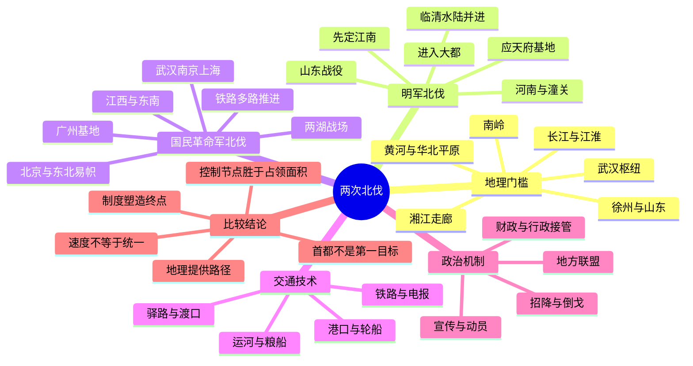

# 第十六章　两次北伐

- **创建日期**：2026-08-03
- **状态**：初版，已配原创历史地理示意图与独立时间轴
- **关键词**：朱元璋、徐达、常遇春、明军北伐、国民革命军北伐、广州、南京、武汉、山东、河南、运河、长江、铁路、政治动员、国家统一
- **章节性质**：围绕原书章节主题展开的原创历史地理学习指南，不逐段复述原书

## 章节概览

中国历史上，“北伐”往往不只是军队从南向北移动，而是南方政治力量试图突破中国地理结构中的多重门槛：南岭与江南丘陵、长江天堑、淮河平原、黄河与华北平原，以及北方政权掌握的骑兵、城镇和交通网络。本章选择两次最具有比较价值的北伐：一是1367—1368年朱元璋命徐达、常遇春率军由江淮北进，攻取山东、河南、河北并进入元大都；二是1926—1928年国民革命军从广州出师，经湖南、湖北、江西、福建、浙江和长江下游北上，最终进入北京，并以东北易帜实现形式上的全国统一。

两次北伐相隔五百余年，战争技术、国家结构、交通工具和国际环境完全不同。明军依靠水师、运河、河道、驿路、粮船和传统城池体系；国民革命军则面对铁路、电报、轮船、近代城市、租界、报刊、工农组织和列强干预。但二者仍呈现出若干相似规律：

1. 北伐之前，南方政权必须先建立稳定根据地，并解决内部竞争者。
2. 长江中下游和江淮地区不是简单的“后方”，而是财政、粮食、兵员和交通的核心。
3. 山东、河南、徐州、武汉、南京等节点的价值远大于地图上的面积。
4. 成功北伐依赖的不只是战场胜利，还包括招降、联盟、政治宣传、地方合作和对交通系统的接管。
5. 进入北方首都不等于完成统一；真正困难的是把军事推进转化为制度、财政和行政秩序。

本章的核心结论是：

> 北伐的本质不是“逆着地图向上走”，而是南方政权以财政、交通、组织和政治联盟为支撑，逐段夺取中国南北之间的战略节点。地理决定推进的成本与方向，制度决定胜利能否变成统一。

---

## 一、地理环境：南方力量北进必须跨越的五道门槛

### 1. 岭南：安全基地，也是封闭盆地

岭南北有南岭，南临海洋，珠江三角洲内部水网密集。它具有两个相反特征：一方面，山地和海洋使外部大军不易直接深入，适合建立相对安全的政治与军事基地；另一方面，从广州向北必须穿过有限的山口和河谷，运输成本很高。

近代粤汉铁路在1926年尚未全线贯通，广州至韶关方向的铁路只能承担部分运输。越过南岭之后，大量军需仍需要依靠公路、河运、挑夫和地方征集。国民革命军能够迅速进入湖南，并不意味着南岭已经失去作用，而是政治动员、地方响应和敌军内部矛盾降低了地理阻力。

### 2. 湖南—湖北：湘江走廊与武汉枢纽

从岭南北上，最自然的方向之一是沿北江、湘江水系进入湖南，再沿湘江谷地向长沙、岳阳推进。湖南中部虽有丘陵，但湘江形成连续南北走廊。长沙控制湘中政治与交通，岳阳位于洞庭湖出口，连接湘江与长江。

武汉三镇位于长江与汉江交汇处，是中国内陆最重要的水陆枢纽之一：

- 武昌位于长江南岸，控制鄂东与江西方向；
- 汉口是商业港口，联系长江航运与内陆市场；
- 汉阳位于汉江入江处，扼守两水交汇。

1926年北伐军攻取武汉，不只是占领三座城市，而是取得了一个能够向河南、江西、安徽和四川辐射的全国性枢纽。武汉既是军事转运站，也是政治中心和工人运动中心。

### 3. 长江下游与江淮：南北转换的核心平台

南京坐落于长江下游南岸，背靠江南财赋区，北望江淮。它不是纯粹的南方城市，而是一个天然的南北转换站。由南京向北，可通过浦口进入津浦交通轴；向东可到上海和海运系统；向西可联系武汉；向南可进入太湖流域与浙江。

朱元璋的政权以应天府为中心，掌握江南粮税、手工业和长江运输后，才有能力持续供养大军。国民革命军在1927年取得南京、上海之后，也获得了更强的财政、工业、金融、港口和国际联系能力。两次北伐都说明：控制长江下游不仅提供财富，更提供把财富转化为北进能力的交通网络。

### 4. 淮河—徐州—山东：南北战争的“铰链地带”

淮河流域地势比江南开阔，但河道多变、湖泊湿地众多，历史上又常受黄河改道影响。徐州位于华北平原、淮河流域、山东丘陵和中原之间，是传统陆路与近代铁路的共同节点。

在明初北伐中，徐州、济宁、东平、临清等地连接江淮粮运、山东平原与运河水系。徐达不是直接从南京一路冲向大都，而是先夺山东，再取河南、潼关，最后沿临清—德州—直沽一线北上。这种路线看似绕行，实质是先拆除大都的外部支撑。

在1928年继续北伐时，津浦铁路把南京浦口、蚌埠、徐州、济南、德州、天津连接起来，成为现代版的南北运输轴。铁路提高了速度，也使桥梁、车站、机车、煤水补给和枢纽城市成为新的战略要点。

### 5. 黄河与华北平原：最后一道大门

黄河既是障碍，也是通道。古代大军渡河需要船只、浮桥和稳定渡口，水位变化可能决定战役时机；进入华北平原后，道路变得开阔，骑兵和大兵团更容易机动，但补给线也更容易暴露。

1368年明军在完成山东、河南与潼关方向的部署后，从临清、德州继续北进，利用运河和水陆运输逼近大都。1928年国民革命军则沿津浦、京汉、陇海和正太等铁路轴线协同推进。两次北伐都必须解决同一个问题：如何在跨越黄河后继续保持补给、通信和政治协调。

---

## 二、历史背景：为什么南方政权能够发起北伐

### 1. 元末：北方王朝失去全国整合能力

元末政治腐败、财政困难、灾害与社会冲突叠加，各地起义和地方武装迅速扩张。元廷仍控制大都及北方部分地区，却难以有效整合江南财赋区，也无法协调各支元军和地方势力。

朱元璋并非一开始就把全部力量用于北伐。他先后完成了几个关键步骤：

- 以集庆—应天为核心建立稳定根据地；
- 在鄱阳湖之战中击败陈友谅，控制长江中游；
- 消灭张士诚，取得富庶的江浙地区；
- 平定方国珍等沿海力量，稳定东南；
- 建立较完整的军政、赋税、屯田和粮运体系。

换言之，北伐成功的前提，是南方主要竞争者已经被消除，长江中下游的财政与交通被整合。

### 2. 1920年代：北洋体系分裂，南方革命基地形成

辛亥革命后，中国并未形成稳定统一的中央权力。北洋体系内部不断分裂，直系、皖系、奉系及各省军事集团相互战争。北京政府名义上代表国家，实际控制力有限。

广州国民政府能够发动北伐，也经历了长期准备：

- 国民党改组，建立党、政、军结合的组织系统；
- 国共第一次合作形成，政治动员能力扩大；
- 黄埔军校培养新式军官和政治工作人员；
- 广东革命根据地经过东征、平定商团与统一两广而相对稳固；
- 苏联提供一定军事顾问与物资支持；
- 工会、农会、学生组织和宣传网络为军队提供情报、运输与政治配合。

北伐军面对的并不是一个统一北方国家，而是吴佩孚、孙传芳、张作霖等势力构成的松散体系。这种分裂为“各个击破”和争取倒戈创造了条件。

### 3. 两次北伐共同的战略窗口

两次北伐都发生在北方中心权威下降、地方势力分裂，而南方出现相对集中政权的时刻。地理条件并未突然改变，改变的是组织能力和政治结构。

因此，不能把北伐成功简单解释为“南方经济富裕”或“北方政权腐败”。经济资源只有经过财政征收、交通运输、军队组织和政治合法性转换，才会形成真实力量。

---

## 三、第一次北伐：明军由江淮进入大都

### 1. 先定江南，再图中原

1367年，朱元璋消灭张士诚后，基本掌握江南最重要的财赋区。同年冬，徐达任征虏大将军，常遇春任副将军，率军北进。北伐并非孤注一掷，而是建立在长江中下游已被整合的基础上。

朱元璋给出的总体方略强调稳步推进，不轻率直捣大都。核心思路是先取山东，再取河南，控制潼关，切断元廷与西北、关中、山东之间的联系，最后北上大都。这是一种“先剪枝、后伐干”的战略。

### 2. 山东战役：夺取运河东侧与齐鲁腹地

明军从江淮北上后，分兵攻取沂州、峄州、莒州、密州、海州等地，再进益都、济南、东昌、济宁、东平和登莱。山东的意义有三层：

1. 山东位于江淮与华北之间，是大都的东南屏障；
2. 济宁、临清等地靠近运河，是北运粮道的关键节点；
3. 控制山东可防止元军从东侧威胁明军侧翼，并获得人口、粮食和地方投降力量。

徐达在山东大量使用招降与分兵接管，减少了逐城强攻的成本。这说明北伐推进速度不仅取决于军队战斗力，也取决于原政权是否失去地方支持。

### 3. 河南与潼关：切断大都的西部支援

1368年，明军由济宁方向进取汴梁，再过虎牢关攻洛阳，并控制嵩、陕、陈、汝等地，继而夺取潼关。河南是中原交通中心，潼关则扼守关中与中原之间的门户。

如果不先控制河南和潼关，大都仍可能获得关中、山西和西北元军的支援。朱元璋、徐达选择先向西完成战略隔离，再转向北方首都，体现了对全国交通网络的整体判断。

### 4. 临清—德州—直沽—通州：水陆并进

完成山东、河南部署后，徐达率军会于临清。临清处在运河与卫河体系的重要节点，明军一面开通陆路，一面疏理河道，使步骑与舟师并进。随后经德州、长芦，控制直沽，渡河后在河西务击败元军，进抵通州。

这条路线不是简单沿平原直线行军，而是最大限度利用水运。古代陆路运输一石粮食的成本会随距离迅速增加，水运则能显著降低大规模军队的补给压力。明军能够在华北持续推进，关键不只是攻城，也在于恢复和控制河道、码头、渡口与粮船。

### 5. 进入大都：军事胜利与秩序接管

元顺帝离开大都北走后，徐达于1368年进入城内。明军封存府库、登记图籍、约束士卒，尽量维持城市秩序。此举具有重要政治意义：占领首都不仅要展示武力，还要证明新政权有能力保护财产、接管行政和维持市场。

但大都陷落并不等于北方完全平定。此后明军仍需经营山西、陕西、甘肃和漠南，并长期面对北元。第一次北伐完成的是王朝中心的转移和中原基本控制，而非一劳永逸地消除北方问题。

---

## 四、第二次北伐：国民革命军由广州推进至北京

### 1. 1926年出师：先击吴佩孚

1926年7月，国民革命军从广州正式出师。初期主攻方向是湖南、湖北，因为吴佩孚的主力控制两湖，并威胁广东北部。

北伐军沿湘江走廊推进，先后经过衡阳、长沙、岳阳方向，在汀泗桥、贺胜桥等战斗中突破防线，随后攻取武汉三镇。两湖战场的胜利使广州根据地与长江中游连成一体，也切断了吴佩孚南方力量与北方基地的联系。

### 2. 江西与东南战场：击败孙传芳

取得武汉后，北伐军转向江西，并从福建、浙江方向展开东路作战。南昌、九江控制赣江—鄱阳湖—长江通道；福建和浙江方向则关系到东南沿海、上海与南京。

1927年3月，上海工人起义配合北伐形势，北伐军进入上海；南京也被占领。至此，国民革命军掌握长江下游最重要的政治、财政和交通中心。

### 3. 从广州到武汉，再到南京：政治中心的北移

北伐并非只有军队在移动，政治中心也随之变化。广州是革命根据地，武汉在两湖胜利后成为重要政治中心，南京则在控制长江下游后成为新的国民政府中心。

这种政治中心迁移反映了地理权力的变化：

- 广州适合建立南方基地，却远离全国腹地；
- 武汉控制长江中游，适合向多方向扩张；
- 南京拥有江南财赋、长江航运、上海金融和江北铁路入口，更适合作为全国政权中心。

### 4. 革命阵营分裂：地理推进不等于政治统一

1927年，国民党内部发生严重分裂，国共合作破裂，武汉与南京之间也一度对立。北伐军虽然在地图上迅速扩张，但联盟结构发生瓦解。

这提醒我们：军事战线和政治战线并不重合。占领城市可以很快，建立统一的权力体系却更难。北伐过程中大量吸收地方军队、争取军阀倒戈，有助于快速推进，却也使新政权内部保留了许多半独立军事集团。

### 5. 1928年继续北进：铁路轴线上的多路协同

1928年北伐重新展开后，国民革命军及其盟军分多路向华北推进：

- 津浦铁路方向由南京、徐州、济南趋向天津；
- 京汉铁路方向由武汉、郑州向北平推进；
- 陇海铁路连接徐州、郑州、西安，为东西协同提供条件；
- 山西方向的力量经正太铁路等通道进入华北。

现代铁路使军队能够更快运输人员、武器和物资，但也造成高度“节点化”的战争：徐州、郑州、济南、石家庄、天津等城市一旦易手，整条战线就可能重组。

### 6. 济南事件与列强因素

北伐军进入山东时，日本出兵济南和胶济铁路沿线，发生严重冲突。近代中国的交通和主权空间并不完整，铁路、港口和租界常受到外国势力影响。

这与明初北伐形成鲜明差异。徐达面对的是元朝及地方军事力量；国民革命军除了面对国内军阀，还必须处理列强军舰、驻军、租界、铁路权益和外交压力。地理节点往往同时是国际利益节点。

### 7. 进入北京与东北易帜

1928年6月，北伐军及其盟军进入北京、天津，北洋政府统治结束。张作霖撤离北京后在皇姑屯事件中死亡。12月，张学良宣布东北易帜，接受南京国民政府旗帜与名义领导。

这标志着全国形式上的统一，但统一程度有限。各地军事集团仍保留相当实力，财政、军队和行政并未完全一体化。第二次北伐取得的是“名义统一和中央重建”，而不是像明初那样迅速建立高度集中的王朝统治。

---

## 五、关键事件对照

| 维度 | 明军北伐（1367—1368） | 国民革命军北伐（1926—1928） |
|---|---|---|
| 南方基地 | 应天府及长江中下游 | 广州及广东革命根据地 |
| 出发前准备 | 消灭陈友谅、张士诚，整合江南 | 统一广东、改组国民党、建立黄埔军校与国共合作 |
| 第一战略门槛 | 江淮—山东 | 南岭—湖南 |
| 中央枢纽 | 济宁、临清、汴梁 | 武汉、南昌、南京、上海 |
| 主要运输工具 | 粮船、河运、驿路、畜力 | 铁路、轮船、公路、电报与传统运输并用 |
| 北方主要对手 | 元廷及各地元军 | 吴佩孚、孙传芳、张作霖及地方军阀 |
| 推进方式 | 先山东、河南、潼关，后直趋大都 | 先两湖，再江西与东南，后沿铁路多路北上 |
| 政治手段 | 招降、接管府库、建立新王朝秩序 | 宣传动员、党军体系、工农组织、收编与联盟 |
| 外部环境 | 王朝内战与政权更替 | 列强、租界、铁路权益与国际外交介入 |
| 首都结果 | 攻入大都，元廷北迁 | 进入北京，北洋政府结束 |
| 统一性质 | 建立明朝高度集权的王朝统治 | 形成南京国民政府下的名义统一 |

---

## 六、为什么地理如此重要

### 1. 南方财富必须通过交通网络转化为军力

江南和珠江三角洲的富庶并不会自动产生北伐能力。粮食、税收、兵员和武器只有通过河道、运河、铁路、港口和仓储系统，才能持续送到前线。

明军的关键是长江—运河—卫河等水运体系；国民革命军的关键是长江航运与粤汉、京汉、津浦、陇海等铁路轴线。两次北伐都体现了“交通能力就是国家能力”。

### 2. 首都不是第一个目标，而是网络最终节点

直接攻击大都或北京看似最有象征意义，却可能让进攻军陷入孤军深入。徐达先取山东、河南与潼关，削弱大都外援；国民革命军先控制武汉、南昌、上海、南京和徐州，再进入华北。

这说明成熟战略不是追逐最醒目的城市，而是先控制支撑首都的网络。

### 3. 河流与铁路塑造不同的战争节奏

河运承载量大但受水位、季节和河道影响；铁路速度快，却依赖轨道、桥梁、机车和车站。古代军队常围绕渡口、码头、粮仓行动，近代军队则围绕车站、铁路枢纽、港口和电报线展开。

技术改变了“关键地形”的表现形式，但没有消除地理。山口仍是山口，河流仍需跨越，只是工程和交通技术重新定义了成本。

### 4. 地理节点也是政治节点

武汉、南京、上海、济南、北京既是交通中心，也是人口、商业、舆论和行政中心。占领这些城市会改变地方官僚、商人、工人、学生和军事集团的选择。

因此，北伐不是一条纯军事路线，而是一连串政治网络的重新连接。

---

## 七、作者观点：从“南征北战”转向“网络整合”

本章所采用的历史地理视角，不把两次北伐解释为某位统帅个人勇武的结果，也不把南北差异简化为“南方富、北方强”。更准确的理解是：

1. 地理为不同地区提供不同资源组合；
2. 交通技术决定资源可以被调动到多远；
3. 政治组织决定资源能否持续集中；
4. 联盟与合法性决定敌方是否会抵抗到底；
5. 占领后的治理决定统一是否稳定。

徐达的价值不只在于能战，而在于能按照全国尺度安排山东、河南、潼关和大都之间的先后关系。1920年代北伐的意义也不只在于军队推进快，而在于它把党组织、军事学校、宣传系统、群众运动和近代交通结合起来。

同时，两次北伐的结局差异说明：相似地理路线不会自动产生相同政治结果。明初形成了较强的中央集权，1928年则更多是军事集团和区域力量在南京政府名义下重新组合。地理提供路径，但制度塑造终点。

---

## 八、深度分析

### 1. 为什么成功北伐往往先从长江中下游或岭南建立基地

中国南方多山多水，不利于北方大规模骑兵直接展开，却适合地方政权积累力量。长江、珠江及其支流既能形成防御纵深，也能支持内部运输。南方政权只要控制一个大型流域，就可能在相对安全的环境中训练军队、积累财政、建设制度。

但南方地形破碎也会造成区域分割。因此，北伐前的真正任务是先统一南方内部。朱元璋先解决陈友谅、张士诚；广州国民政府先平定广东并整合两广。没有内部统一，北伐就会变成多个地方集团的短期冒险。

### 2. 为什么山东和河南反复成为北伐的决胜区

山东既靠近运河和海岸，又位于华北平原东侧；河南则连接关中、华北、江淮和长江中游。二者共同构成北方首都的南部与西南部屏障。

1368年控制山东和河南后，大都失去主要南方粮源与西部支援。1928年控制徐州、郑州、济南后，北京—天津地区也面临多方向压力。无论运输工具是粮船还是铁路，这一空间结构都相当稳定。

### 3. “快速推进”背后的敌军瓦解

两次北伐都大量利用招降、倒戈和地方合作。速度并不完全来自正面战斗，而是来自对方政治体系崩解。

- 元末地方守将看到元廷衰弱，常选择投降以保全自身；
- 1920年代军阀部队忠诚度不稳定，收编和改旗易帜十分常见；
- 地方民众、商人和组织的态度，会影响粮食、情报与城市接管。

这表明军事地图上的箭头，实际由许多政治选择共同构成。

### 4. 统一的三个层次

可以把北伐后的统一分为三个层次：

1. **象征统一**：首都易手、旗帜改变、中央政府获得名义承认；
2. **军事统一**：地方军队接受中央指挥，武装力量不再独立；
3. **财政行政统一**：税收、司法、官员任免、交通与货币体系由中央稳定控制。

明初在较长战争后逐步接近第三层次；1928年的中国主要完成第一层次，并部分完成第二层次，第三层次仍很不充分。

### 5. 现代技术并未让统一更容易

铁路、电报和轮船提高了军队速度，却也扩大了战争规模，增加了对工业品、燃料、金融和国际贸易的依赖。列强控制的租界、港口和铁路权益，又使国家空间被多重主权切割。

所以，1920年代北伐虽然移动更快，政治统一却未必比1368年更彻底。技术提高了连接能力，也增加了系统复杂性。

### 6. 南京的双重角色

南京在两次北伐中都扮演重要角色，但性质不同：

- 对朱元璋而言，应天府是已经成熟的王朝基地，是向北输出军队、粮食和制度的中心；
- 对国民政府而言，南京是北伐中途获得并重新建设的中央首都，其权威仍需在各地军政集团之间协调。

同一座城市在不同制度环境中，会产生不同政治效果。地理位置稳定，政治功能却会变化。

---

## 九、长期影响

### 1. 明代：南方财政与北方首都的长期结合

明初虽由南京建国，后来首都迁往北京，但全国财政重心仍长期位于江南。由此形成“政治中心在北、财赋重心在南”的结构，大运河成为维持国家运行的重要命脉。

徐达北伐建立的南北控制框架，为此后明朝经营华北、山西、陕西和北部边疆奠定基础。它也使南京—北京之间的交通与制度联系成为王朝核心问题。

### 2. 近代：南京政府与名义统一

1928年以后，南京国民政府获得国际上更广泛承认，并尝试推动财政、关税、法律、交通和行政建设。北伐结束了北洋政府时代，却没有彻底消除地方军事势力。

这种“名义统一强于实际整合”的状态，影响了之后的中原大战、地方财政、军队国家化和抗日战争时期的全国动员。

### 3. 中国空间结构的持续性

两次北伐共同强化了若干长期地理轴线：

- 广州—长沙—武汉轴线；
- 武汉—郑州—北京轴线；
- 南京—徐州—济南—天津—北京轴线；
- 长江下游—运河—华北平原轴线；
- 上海—南京—武汉的长江经济与交通带。

这些轴线在现代铁路、高速公路和城市群体系中仍然可见，只是运输速度和城市规模发生了巨大变化。

---

## 十、现代启示

### 1. 战略目标应分解为网络节点

大型项目或组织变革不能只盯着最终目标。徐达先取山东、河南与潼关，北伐军先取武汉、南昌、南京和上海，都说明应先控制支撑最终目标的关键节点。

在现代管理中，这相当于先解决数据、流程、人才、资金和基础设施，再推进最终平台或组织整合。

### 2. 速度不等于完成度

军事推进快，不代表治理已经完成；软件上线快，也不代表系统稳定；企业扩张快，也不代表组织整合成功。真正的完成标准应包括规则统一、责任清晰、资源可持续和风险可控制。

### 3. 基础设施会改变竞争方式

运河使古代战争围绕水路节点展开，铁路使近代战争围绕车站和枢纽展开，数字网络则使现代竞争围绕数据中心、云平台、通信链路与标准展开。每一代技术都会产生新的“战略地形”。

### 4. 联盟可以加速扩张，也会增加治理成本

两次北伐都通过吸纳地方力量加快推进。联盟能降低初期阻力，但如果权责、财政和指挥体系没有及时整合，胜利后就可能产生长期摩擦。

### 5. 地理不是宿命，而是成本函数

山河不会直接决定胜负，但会改变每一种选择的成本。优秀战略不是否认地理，而是利用交通、工程、信息和联盟，降低自己的成本，提高对手的成本。

---

## 十一、古今地名对照

| 古称或历史称呼 | 大致对应今地 | 历史地理意义 |
|---|---|---|
| 应天府 | 江苏南京 | 朱元璋政权中心，长江下游北伐基地 |
| 集庆 | 江苏南京 | 元末南京旧称，朱元璋早期根据地 |
| 龙江 | 南京长江沿岸一带 | 明军出师与水运相关区域 |
| 下邳 | 江苏邳州、睢宁一带 | 江淮通向山东的传统节点 |
| 沂州 | 山东临沂 | 进入鲁南的重要门户 |
| 益都 | 山东青州 | 山东中部政治与交通中心 |
| 东昌 | 山东聊城 | 运河沿线节点 |
| 济宁 | 山东济宁 | 运河、湖泊与鲁西南交通中心 |
| 临清 | 山东临清 | 运河与卫河体系枢纽 |
| 汴梁 | 河南开封 | 中原中心与黄河交通节点 |
| 虎牢关 | 河南荥阳、巩义之间 | 洛阳东部门户 |
| 潼关 | 陕西潼关 | 关中与中原之间的战略关口 |
| 长芦 | 河北沧州一带 | 华北东部水陆交通节点 |
| 直沽 | 天津市区附近 | 海河水系与渤海门户 |
| 河西务 | 天津武清 | 运河北段重要渡口与战场 |
| 通州 | 北京通州 | 大都东部水陆门户、运河北端 |
| 大都 | 北京 | 元朝首都，1368年明军进入 |
| 广州 | 广东广州 | 1926年北伐出发基地 |
| 韶关 | 广东韶关 | 越过南岭的北上门户 |
| 汀泗桥 | 湖北咸宁 | 1926年两湖战场关键节点 |
| 贺胜桥 | 湖北咸宁 | 武汉南部通道上的关键战场 |
| 武昌、汉口、汉阳 | 湖北武汉 | 长江与汉江交汇的全国枢纽 |
| 南昌 | 江西南昌 | 赣江—鄱阳湖交通中心 |
| 九江 | 江西九江 | 长江与鄱阳湖出口节点 |
| 浦口 | 江苏南京江北 | 津浦铁路南端、长江渡口 |
| 北平 | 北京 | 1928年后北京一度改称北平 |
| 奉天 | 辽宁沈阳 | 奉系政治中心，东北易帜核心地区 |
| 京汉铁路 | 北京—汉口，今京广铁路北段 | 华中进入华北的纵向交通轴 |
| 粤汉铁路 | 广州—汉口，今京广铁路南段 | 岭南连接长江中游的交通轴 |
| 津浦铁路 | 天津—浦口，今京沪铁路重要前身 | 南京至华北的纵向铁路轴 |
| 陇海铁路 | 连云港—郑州—西安—兰州 | 东西向战略铁路 |

> 注：古代地名辖区和治所常随时代变化，表中仅提供便于理解的近似对应，不能把古今行政边界完全重合。

---

## 十二、时间轴

### 明军北伐

| 时间 | 事件 | 地理意义 |
|---|---|---|
| 1356年 | 朱元璋占领集庆，改为应天府 | 建立长江下游核心基地 |
| 1363年 | 鄱阳湖之战，陈友谅集团失败 | 控制长江中游，解除西向威胁 |
| 1367年 | 张士诚政权灭亡 | 获得江浙财赋与东南交通 |
| 1367年冬 | 徐达、常遇春率军北伐 | 从江淮进入鲁南 |
| 1367—1368年 | 明军平定山东主要地区 | 控制运河东侧与大都东南屏障 |
| 1368年春 | 攻取汴梁、洛阳，控制潼关 | 切断大都与关中、西北联系 |
| 1368年夏 | 临清会师，水陆并进 | 利用运河与卫河体系北上 |
| 1368年8月 | 明军进入大都 | 元廷北迁，明朝取得中原首都 |
| 1369—1370年 | 明军继续经营山西、陕西、甘肃 | 将首都胜利扩展为北方区域控制 |

### 国民革命军北伐

| 时间 | 事件 | 地理意义 |
|---|---|---|
| 1924年 | 国民党改组、黄埔军校建立 | 形成党军与政治动员基础 |
| 1925—1926年 | 广州国民政府统一广东、整合两广 | 稳定岭南北伐基地 |
| 1926年7月9日 | 国民革命军从广州出师 | 北伐正式开始 |
| 1926年8—10月 | 汀泗桥、贺胜桥战斗，攻取武汉 | 打通湘江—长江轴线，击败吴佩孚主力 |
| 1926年11月 | 进入九江、南昌 | 控制赣江—鄱阳湖—长江通道 |
| 1927年3月 | 上海、南京相继易手 | 掌握长江下游金融、港口与政治中心 |
| 1927年4—7月 | 国共合作破裂，宁汉分裂与重组 | 军事推进遭遇政治联盟危机 |
| 1928年4月 | 北伐重新展开 | 多路沿铁路向华北推进 |
| 1928年5月 | 济南事件 | 山东铁路节点与列强干预交织 |
| 1928年6月 | 北伐军及盟军进入北京、天津 | 北洋政府统治结束 |
| 1928年12月29日 | 东北易帜 | 全国实现形式上的统一 |

---

## 十三、思维导图

---

## 十四、参考资料

### 传统史料与历史地图

1. 《明太祖实录》有关至正二十七年至洪武元年北伐记载。
2. 张廷玉等：《明史·徐达传》《明史·常遇春传》。
3. 谭其骧主编：《中国历史地图集》第七册，元、明时期相关图幅。
4. 顾祖禹：《读史方舆纪要》，江淮、山东、河南、北直隶相关条目。
5. 《中国近代史资料丛刊·北伐战争》。

### 现代研究

6. Donald A. Jordan, *The Northern Expedition: China’s National Revolution of 1926–1928*, University Press of Hawai‘i, 1976。
7. C. Martin Wilbur, *The Nationalist Revolution in China, 1923–1928*, Cambridge University Press, 1983。
8. Lloyd E. Eastman, *The Abortive Revolution: China under Nationalist Rule, 1927–1937*, Harvard University Press, 1974。
9. Edward L. Dreyer, *Early Ming China: A Political History, 1355–1435*, Stanford University Press, 1982。
10. 牟复礼、崔瑞德编：《剑桥中国明代史》相关章节。
11. 中国历史地理学与交通史研究中有关大运河、津浦铁路、京汉铁路及长江航运的专题成果。

### 使用说明

本章为原创学习指南。地图为历史地理关系示意图，用于呈现交通轴线与战略节点，不作为精确测绘图；不同史料在军队人数、具体日期、古地名位置和战役细节上可能存在差异，学习时应结合多种史料相互校核。

---

## 十五、章节总结

两次北伐的共同点，是南方政权先在相对安全的流域或沿海区域积累力量，再沿中国南北交通轴线逐段夺取关键节点。朱元璋依靠长江下游财赋、运河水运和稳步孤立大都的战略，完成王朝更替；国民革命军依靠党军体系、政治动员、铁路与长江航运，从广州推进至武汉、南京和北京，结束北洋政府统治。

二者的差别同样重要。明军面对的是传统王朝崩溃后的政权替代，胜利后建立了较强的中央集权；1920年代北伐则处在军阀政治、列强介入和现代政党竞争的环境中，最终形成的是名义统一，地方军政力量仍相当强大。

因此，本章最值得记住的不是两条北进路线，而是一条更普遍的历史规律：

> 一个政权真正的力量，不在于它控制多少地图面积，而在于它能否把财政中心、交通走廊、战略城市、地方联盟和行政制度连接成一个可持续运行的网络。北伐可以夺取首都，只有治理才能完成统一。
