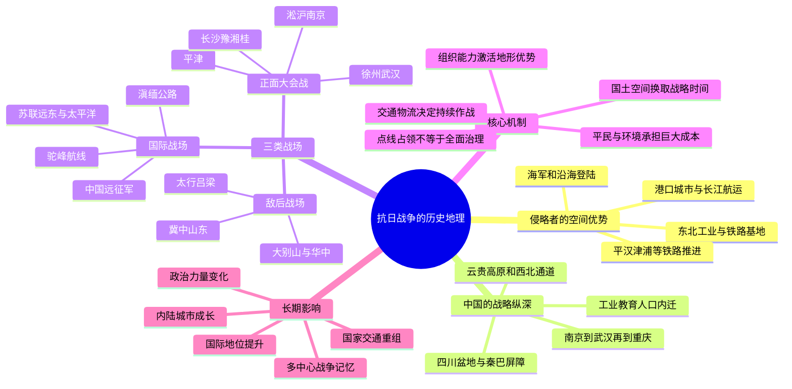

# 第十七章　抗日战争：沿海失守、纵深抵抗与总体战

- **创建日期**：2026-08-04
- **状态**：初版，已配原创历史地理示意图与独立时间轴
- **关键词**：九一八事变、七七事变、平津、淞沪会战、南京、徐州、武汉、重庆、大后方、工业内迁、铁路、长江、敌后根据地、滇缅公路、驼峰航线、豫湘桂会战
- **章节性质**：围绕原书章节主题展开的原创历史地理学习指南，不逐段复述原书

> 配套资料：[抗日战争历史地理骨架图](../Maps/Chapter17_抗日战争历史地理骨架.svg)｜[抗日战争历史地理时间轴](../Timeline/Chapter17_抗日战争历史地理时间轴.md)

## 章节概览

抗日战争是近代中国规模最大、地域最广、持续时间最长的总体战争之一。若只按战役顺序阅读，很容易把它理解为平津、淞沪、徐州、武汉、长沙、滇缅等一系列互不相连的军事事件；但从地理角度看，这些战役共同围绕几个结构性问题展开：日本如何利用海军、港口、铁路和东北工业基地向中国腹地推进；中国如何依靠广阔国土、山地屏障、人口纵深和内河交通维持抵抗；沿海工业与教育机构如何向西南、西北迁移；外援又如何通过新疆、越南、缅甸和喜马拉雅山上空进入中国。

本章采用“十四年抗战”与“八年全面抗战”两个相互补充的时间尺度：1931年九一八事变后，东北率先遭受侵略并出现持续抵抗；1937年七七事变后，战争扩大为全国性全面战争。1937—1938年，日本军队沿华北铁路、长江下游和东南沿海快速推进，先后占领北平、天津、上海、南京、武汉和广州等重要节点，却未能迫使中国停止抵抗。中国的政治、工业、教育和人口重心向重庆、成都、昆明、贵阳、西安等内陆城市转移，战争由争夺沿海中心城市，转化为围绕国土纵深、交通线、农村社会和国际补给的长期消耗。

本章的核心结论是：

> 抗日战争的历史地理本质，是海洋强国依托港口、铁路和工业优势，试图以“点—线”控制迅速摧毁中国国家中枢；中国则通过国土纵深、人口迁移、工业内迁、山地与乡村网络、国际交通线和持续政治动员，把短期决战改造成对侵略者不利的长期总体战。空间能够换取时间，但只有组织、生产、交通与社会承受力能够把时间转化为抵抗能力。

---

## 一、地理环境：一场被海岸、铁路、河流与国土纵深塑造的战争

### 1. 东亚的海陆不对称

20世纪30年代，日本已形成较强的近代工业、海军和远洋运输能力，并控制朝鲜半岛、台湾及南满铁路沿线的重要据点。中国拥有广阔国土和庞大人口，却存在工业集中于沿海与少数城市、铁路网络稀疏、地区发展不均衡等问题。

这种不对称决定了双方最初的空间策略：

- 日本希望从海上和东北方向同时施压，夺取港口、铁路、首都和工业城市；
- 中国难以在沿海与华北平原长期进行装备对等的阵地决战，只能在保卫核心城市的同时准备向内陆转移；
- 日本能够迅速控制许多交通节点，却难以仅凭有限兵力长期覆盖中国广大的县乡、山地和交通支线。

因此，战争地图必须至少分成三层观察：城市与港口的占领、铁路与河流交通线的控制、广大乡村与山地社会的实际治理。三层地图并不重合。

### 2. 东北：工业基地、资源区与大陆门户

东北平原土地开阔，铁路较早成网，煤炭、铁矿、森林和农业资源丰富，又与朝鲜半岛、苏联远东、蒙古高原及华北相连。南满铁路及其支线把大连、旅顺、沈阳、长春、哈尔滨等城市串联起来，使日本能够把海运、铁路、驻军和殖民经济结合为一套扩张体系。

1931年九一八事变后，日本迅速扩大对东北的占领。东北的失陷不只是领土损失，还意味着中国失去一个重要工业和资源区域，日本则获得了继续进攻华北的大陆基地。此后热河、察哈尔和冀东等地成为东北与华北之间的过渡带。

但东北并非在1931年后就完全“沉默”。东北义勇军、抗日游击力量及东北抗日联军在严酷环境中持续活动，说明铁路城市的控制并不等于对森林、山地和边远地区的全面治理。

### 3. 华北平原：铁路决定进攻方向

华北平原地势开阔，人口稠密，传统驿路、近代铁路和城市密集。平汉铁路连接北平、石家庄、郑州、武汉；津浦铁路连接天津、济南、徐州、南京浦口；陇海铁路横贯徐州、郑州、西安、兰州方向。铁路提高了军队和物资移动速度，也使桥梁、车站、机车修理厂和交叉枢纽成为战役中心。

卢沟桥和宛平城位于北平西南，接近铁路与道路节点。1937年七七事变后，平津迅速成为全面战争的起点。日本军队由北向南沿平汉、津浦等交通轴推进，试图控制华北平原；中国军队则在山西、河北、山东和河南等地组织正面防御与敌后抵抗。

华北战争呈现典型的“线状占领”特征：日军较容易控制铁路干线和大城市，却必须不断投入兵力保护沿线据点、桥梁和仓库；铁路以外的山地、乡村和县际道路则为敌后力量提供活动空间。

### 4. 长江轴线：从上海门户到重庆纵深

长江连接上海、南京、武汉、宜昌和重庆，是中国最重要的东西向内河交通轴。日本若控制长江下游港口并向上游推进，就可以威胁中国的经济中心、政治中心与中部交通枢纽。

1937年淞沪会战发生在长江入海口附近。上海是全国最大的港口、工业和金融城市，又与国际租界及海上交通相连。中国投入主力防守上海，既有军事考虑，也希望向国际社会显示抵抗决心。上海失守后，战线沿沪宁交通轴转向南京；南京失守后，国民政府继续向武汉、重庆转移。

1938年武汉会战围绕长江中游展开。武汉三镇位于长江与汉江交汇处，既连接华北、华中和华南，又是铁路、航运和工业中心。武汉失守并未结束战争，因为国家中枢已进一步西迁，长江上游的三峡、四川盆地和重庆成为新的战略纵深。

### 5. 山地与高原：敌后空间和内陆屏障

中国东部并非完整平原。太行山、吕梁山、燕山、大别山、沂蒙山等山地穿插于华北、华中交通网之间，为小部队分散活动、建立根据地和联系乡村社会提供条件。山地不自动产生游击战；它必须与地方组织、群众支持、情报网络、粮食供应和政治动员结合，才能形成持久抵抗空间。

秦岭、大巴山和巫山构成华中通往四川盆地的重要屏障。四川盆地入口有限，长江三峡险要，陆路交通困难，使重庆不易遭受大规模地面进攻。但盆地并非绝对安全：长江航运能力有限，公路基础薄弱，城市还长期面临空袭和物资紧张。

云贵高原地形破碎、山高谷深，阻碍大兵团快速推进，却也增加公路建设和运输成本。昆明、贵阳因远离东部主要战线而成为工业、教育、航空和国际运输的重要节点。

### 6. 海岸线：日本的优势，也是兵力分散的来源

中国海岸线漫长，北起辽东、山东，经长江三角洲、福建、广东至北部湾。日本海军可以选择登陆地点，支援沿海作战，并通过封锁削弱中国对外贸易。上海、杭州湾、广州、海南岛及东南沿海港口的争夺，都体现了制海权对陆战的巨大影响。

然而，沿海占领越广，守备港口、城市、铁路和航道所需兵力越多。海军优势能够帮助日本夺取“入口”，却不能自动解决内陆治理、山区交通和广大人口控制问题。

### 7. 西南与西北：被重新制造出来的大后方

四川、云南、贵州、陕西、甘肃、新疆并不是天然完备的现代后方。它们远离沿海战场，却普遍面临交通不便、工业薄弱、财政承载有限等问题。大后方的形成依靠一系列人为重组：

- 政府机关、学校、工厂和技术人员西迁；
- 长江上游、公路、驿运和航空网络扩建；
- 重庆、成都、昆明、贵阳、西安、兰州等城市功能迅速扩张；
- 西南各省承担粮食、兵员、税收和运输任务；
- 国际援助通过新疆、滇越铁路、滇缅公路和驼峰航线输入。

所谓“后方”不是地图上远离前线的空白，而是一套重新组织人口、生产、交通与行政的空间工程。

---

## 二、历史背景：从东北危机到全面战争

### 1. 近代东亚力量格局的变化

甲午战争后，日本取得台湾，并在朝鲜半岛和中国东北不断扩大影响。日俄战争后，日本继承俄国在南满的部分权益，南满铁路及附属地逐渐成为其政治、经济和军事扩张工具。

中国在20世纪初经历帝制终结、军阀割据和中央权威重建。南京国民政府成立后，虽在名义上完成统一，但地方军政力量仍强，财政、关税、铁路和军队体系尚未完全整合。这使国家面对外部侵略时既拥有一定现代组织能力，又保留明显的区域分裂和基础设施短板。

### 2. 1931—1936年：战争已开始，但尚未全面化

1931年九一八事变后，东北迅速失陷。1932年上海发生一·二八事变，说明日本不仅从东北陆路施压，也能利用海军直接威胁长江三角洲。1933年热河失守和长城抗战后，日本势力逼近华北核心区。

此后华北出现一系列政治与军事危机。中国内部仍在进行统一、剿共和地方关系调整。1936年西安事变和平解决后，国共双方逐步形成共同抗日的政治条件。全面战争前的中国，事实上处于“外敌步步推进、内部整合尚未完成”的双重压力之下。

### 3. 工业和交通的空间弱点

战前中国现代工业主要集中于上海、南京、武汉、天津、青岛、广州等沿海沿江城市。铁路总长度有限，多数线路以港口和区域中心为终点，尚未形成高密度全国网络。西南、西北的工业基础和现代交通更弱。

这意味着日本一旦夺取沿海和铁路枢纽，就能迅速破坏中国的财政、工业和交通体系；但同样意味着中国的广大内陆仍未被铁路完全穿透，日本若要继续推进，就必须离开最熟悉的海运与铁路保障范围。

### 4. 国家生存战略的形成

全面战争爆发后，中国战略逐渐形成几个相互依赖的层面：

1. 在平津、上海、徐州、武汉等方向组织大会战，迟滞日军并消耗其兵力；
2. 将中央政府、工业、学校和技术力量向西迁移，保存国家核心能力；
3. 在华北、华中和华南敌后建立多种形式的抗日力量，牵制占领军；
4. 维持西北、西南国际交通，争取外援；
5. 把中国战场与世界反法西斯战争连接起来，等待国际力量对比变化。

这不是一开始就完美设计的方案，而是在不断失地、迁徙、调整和试错中逐步形成的国家生存体系。

---

## 三、关键事件：战争空间如何一步步向内陆展开

### 1. 九一八事变：东北成为侵华基地

1931年9月18日，日本关东军制造事端并扩大军事行动，随后占领东北主要城市和铁路。1932年伪满洲国成立，长春被改称“新京”。日本借助东北铁路、资源和工业，建立向华北及苏联远东方向施压的大陆基地。

东北失陷说明，近代战争中铁路沿线的驻军、警备、通信和城市控制能够在短期内形成巨大优势。但东北长期存在的抵抗活动也表明，行政中心和铁路被控制后，山林、边境和乡村仍可能形成另一套政治空间。

### 2. 七七事变与平津失守：全面战争爆发

1937年7月7日，卢沟桥附近冲突升级。北平、天津位于华北铁路和海运体系的交汇处，一旦失守，日军便可沿平汉铁路南下、沿津浦铁路向山东与徐州推进。

平津战事的地理含义不只是两座城市易手，而是华北北部的门户被打开。此后正面战场沿铁路干线向河北、山西、山东和河南扩展，敌后力量则在太行山、吕梁山、燕山和冀中平原等地逐步发展。

### 3. 淞沪会战与南京失守：长江门户之战

1937年8月至11月，淞沪会战在上海及周边展开。上海临海、临江，日本可持续获得海军火力和海运补给；中国则需从全国各地经铁路、公路和水路调兵。战争持续数月，打破了日本以短期压力迫使中国屈服的预期，但中国精锐部队也承受重大损失。

上海失守后，日军沿沪宁线和太湖南北方向逼近南京。1937年12月南京失守，并发生严重战争暴行。国民政府此前已开始向武汉、重庆转移，说明政治中心可以移动，国家却必须同时处理军队撤退、居民疏散、档案设备运输和行政重建。

### 4. 徐州会战、台儿庄与黄河决口：华北—华中的铰链

徐州位于津浦与陇海铁路交会处，连接山东、河南、安徽和江苏。1938年春，台儿庄战役发生在徐州东北侧的运河与铁路通道附近，中国军队取得重要胜利，显示复杂水网、城镇和多路协同可以限制机械化部队的优势。

随后日军继续向徐州和中原推进。1938年6月，为迟滞日军西进，国民政府下令在郑州花园口一带掘开黄河堤防。洪水改变了豫东、皖北和苏北大片地区的水系与交通，确实增加了日军推进困难，却未能决定性阻止武汉会战，并给当地居民、农业和生态造成长期灾难。

这一事件提醒我们：改变自然地理可以产生军事效果，但其社会代价可能远超短期战术收益。历史地理分析不能只看战线，也必须把人口、环境与伦理成本纳入判断。

### 5. 武汉会战与广州失守：战争进入持久阶段

1938年，武汉成为全国军事、政治、工业、宣传和交通中心。日军从长江、赣北、皖西和大别山周边多路推进。中国通过大范围会战继续争取时间，同时将机构和资源向西南转移。

1938年10月武汉失守；广州也在同月失守，粤汉交通和华南海上入口受到严重影响。然而，重庆政府并未停止抵抗。至此，日本占领中国大部分沿海、华北铁路和长江中下游重要城市，却仍未摧毁中国中央政权。战争从快速推进转为长期对峙。

### 6. 长沙会战与多层战场：前线并未固定

1939—1942年间，日军多次进攻长沙。长沙位于粤汉铁路、湘江和洞庭湖以南，是武汉通往华南、西南的重要节点。中国军队利用河流、丘陵、交通破坏和纵深部署，多次挫败日军攻势。

与此同时，华北、华中敌后战场持续发展。敌后根据地并不是与正面战场相互隔离的另一场战争，而是在日军占领区内部形成的牵制网络。正面战场承担大会战和主要城市防御，敌后战场则攻击交通、扩大组织、维持乡村抵抗，两者共同增加占领成本。

### 7. 工业、学校与人口内迁：国家功能向西重组

随着沿海和长江中下游失守，大量工矿设备、技术人员、学校和文化机构向四川、云南、贵州、陕西等地迁移。工厂拆装、船运、陆运和重新投产极其困难，但内迁保存了部分工业与教育能力。

重庆成为战时首都，成都发展为重要工业和教育中心，昆明成为西南交通、航空和高校节点，西安与兰州连接西北路线。西南联合大学等机构的形成，说明教育与知识生产也具有可迁移的空间组织能力。

内迁并非简单“从东搬到西”，而是改变了中国城市体系：原本边缘的内陆城市被推到全国网络中心，人口、资本、技术和国家机关重新组合。

### 8. 国际交通线：战争生命线不断转移

中国长期抵抗需要武器、燃料、车辆、药品和工业原料。沿海被封锁后，对外交通转向四条主要线路：

- **西北路线**：援助经苏联中亚、新疆、河西走廊和兰州进入内地；
- **滇越铁路**：物资由海防经河内进入昆明，1940年前具有重要作用；
- **滇缅公路**：由缅甸腊戍经山地进入云南昆明，1938年底后成为关键通道；
- **驼峰航线**：1942年缅甸失守后，盟军飞机从印度阿萨姆越过喜马拉雅山东段向昆明运输物资。

这些路线都受地形、季风、道路质量、车辆、燃料和国际政治影响。交通线不是地图上的一条线，而是港口、铁路、公路、机场、仓库、维修、司机和气象信息组成的系统。

### 9. 中国远征军与中印缅战场

为了保卫滇缅通道并配合盟军作战，中国远征军进入缅甸。初期作战受指挥协调、交通和补给困难影响。此后部分部队退入印度整训，另一部分返回滇西。

1944年，中国军队从滇西和印度方向展开反攻，逐步打通中印公路体系。中印缅战场说明，中国抗战并不局限于国境内，它与印度洋港口、缅甸山地、喜马拉雅航空线和盟军全球战略紧密相连。

### 10. 豫湘桂会战：日本试图打通大陆交通线

1944年，日军发动大规模豫湘桂作战，目的包括打通从华北经武汉、长沙、衡阳、桂林、柳州至法属印度支那方向的大陆交通，并压制中国东南部盟军航空基地。

战线沿平汉、粤汉、湘桂等铁路方向推进，郑州、长沙、衡阳、桂林、柳州等节点相继成为战场。日军在地图上打通了较长的交通走廊，却未能逆转整个太平洋战争的战略态势；其占领线更长、守备压力更大，而美国对日本本土与海上交通的压力持续上升。

### 11. 1945年胜利：全球战争与中国长期抵抗汇合

1945年，盟军在太平洋方向不断逼近日本本土；苏联于8月对日宣战并进入东北；美国投下原子弹；日本最终宣布接受投降。中国战场的胜利由多重因素共同形成：长期抵抗牵制了大量日军，盟军的海空战削弱日本战争能力，苏联进攻改变东北局势，日本国内资源与运输体系也已接近崩溃。

因此，不能把胜利归结为单一战役或单一力量。中国以巨大代价维持了持续作战的国家存在，并把本国战场坚持到国际力量对比发生根本变化。

---

## 四、为什么地理如此重要：八个决定战争进程的机制

### 1. 制海权决定了沿海城市的脆弱性

日本可利用舰队在上海、杭州湾、华南等方向选择登陆并提供补给。中国沿海工业和港口因此难以长期作为安全后方。

### 2. 铁路把战争变成“节点竞争”

平汉、津浦、陇海、粤汉、湘桂等铁路塑造了进攻方向。控制一座铁路枢纽，往往比占领周围大片土地更能改变战场态势。

### 3. 长江既是进攻通道，也是战略转移轴

日军沿长江由上海向南京、武汉推进；中国则沿同一水系向宜昌、重庆转移人员和设备。同一条河流可被双方用于不同战略。

### 4. 国土纵深破坏了“占领首都即结束战争”的逻辑

南京失守后，武汉、重庆继续承担国家中枢功能。广阔国土使政治中心和生产能力可以迁移，迫使日本不断延长战线。

### 5. 山地与乡村限制了点线占领

占领军控制铁路和城市，却难以完全覆盖太行山、吕梁山、大别山、沂蒙山及广大乡村。地方组织把地形优势转化为持续抵抗。

### 6. 大后方需要被建设，而不是被发现

四川盆地、云贵高原和西北并非天然现代工业区。工厂、学校、交通和行政内迁，才使它们成为战时国家的支撑空间。

### 7. 国际补给受地缘政治和自然环境双重制约

苏联政策、法国与英国在亚洲的处境、缅甸战局、美国参战及喜马拉雅气象，都直接影响中国获得外援的数量与路径。

### 8. 人口和社会网络是地图上最容易被忽略的基础设施

军队需要兵员、粮食、情报、运输和医疗；城市需要居民维持生产；难民迁移又会改变劳动力和社会结构。战争不是空白地图上的箭头，而是数以亿计人口被迫重组生活空间的过程。

---

## 五、作者观点：从“地图上的失地”转向“国家空间的重组”

> 本节是依据全书“以地理解读历史”的方法所作的观点重构，并非对原书文字的逐句转述。

### 1. 抗战不能只按首都和大城市的得失判断

若只看1938年底的城市地图，日本已经控制东北、华北、长江中下游和多数沿海港口，似乎拥有压倒性优势。但中国中央政府仍在重庆运转，西南、西北保持联系，敌后力量在占领区内部活动。城市占领图不能代表全部政治控制图。

### 2. 日本控制的是“点和线”，中国保存的是“面与纵深”

日本最强的空间形态是港口—铁路—城市—据点网络；中国最重要的资源则是广阔纵深、庞大人口和复杂地形。双方优势并不位于同一尺度上。日本若要把点线优势扩展为全面治理，就必须付出越来越高的守备与运输成本。

### 3. “以空间换时间”不是自动成功的公式

放弃部分地区只能获得时间，不能自动带来胜利。时间必须用于迁移工业、重建行政、训练军队、维持财政、争取国际援助和组织敌后社会。若没有这些工作，后退只会变成失地。

### 4. 重庆和昆明的战略价值来自网络，而非位置本身

重庆位于四川盆地和长江上游，昆明位于云贵高原和国际通道交汇处。但城市只有接入政府、工业、航空、公路、教育和人口网络，才能成为真正的大后方枢纽。

### 5. 抗战把中国重新连接起来

战争造成巨大破坏，却也迫使东部人口、技术、教育和工业深入西南、西北，推动内陆城市进入全国体系。国家对边疆、交通和区域资源的认识因此发生深刻变化。

---

## 六、深度分析：理解抗战空间结构的七个关键问题

### 1. 为什么日本能迅速占领大片地区，却不能迅速结束战争

日本的工业、海军、航空兵和铁路运输具有局部优势，因此能在沿海和平原取得快速进展。但占领面积扩大后，它必须同时保护港口、铁路、城市、矿山、仓库和行政机构。中国地形复杂、人口庞大，敌后抵抗又不断破坏交通与治理，使占领收益被守备成本抵消。

这是典型的“战术速度快于政治控制”的问题：军队可以沿铁路前进数百公里，行政、治安、税收和社会合作却不能以同样速度建立。

### 2. 为什么上海必须守，重庆又必须退守

保卫上海有政治、外交与军事目的：上海连接国际社会，防守可以展示中国抵抗意志，并牵制日军。但上海临海，日军海运和火力优势明显，长期守住极为困难。

迁都重庆则利用国土纵深保存国家中枢。上海与重庆并非互相否定的选择，而是同一战略的两个阶段：前者争取时间和国际注意，后者保存长期战争能力。

### 3. 正面战场与敌后战场为什么必须放在同一张图上

正面大会战能够迟滞日军、守卫区域中心并维持国际承认；敌后根据地则深入占领区，迫使日军分散兵力保护交通和据点。只画正面战线会低估占领区内部的抵抗，只画敌后根据地则会忽略大会战和国家军队承担的主要压力。

更准确的地图应同时显示：正面战线、日军交通线、国民政府控制区、共产党领导的敌后根据地、地方抗日武装、国际补给线及人口迁移方向。

### 4. 工业内迁为何比一场战役更能体现国家能力

工厂内迁需要清点设备、拆卸运输、跨越封锁、寻找厂址、恢复电力和原料供应，还要安置工人与家属。它是一场涉及交通、工程、金融和行政的复杂行动。

内迁工业规模无法完全弥补沿海损失，却保存了军工、机械、纺织、教育和技术人才的一部分核心能力。对长期战争而言，保存“再生产能力”比保存某一座建筑更重要。

### 5. 黄河决口为何是历史地理研究的警示案例

花园口决堤展示了国家可以把自然环境武器化，但也说明军事决策会产生跨区域、跨年份的社会后果。河道改向、泥沙淤积、村镇迁移、农业破坏和灾民流动，远远超出一次战役的时间尺度。

评价这种决策时，不能只问“是否迟滞敌军”，还必须问：是否存在替代方案、信息是否充分、平民是否得到保护、长期环境成本由谁承担。

### 6. 国际通道为什么始终是中国抗战的脆弱环节

西北公路距离遥远，滇越铁路受法国殖民当局和日本压力影响，滇缅公路受缅甸战局影响，驼峰航线受高山气象、机场和运输机数量限制。每条通道都可能因一个港口、一段铁路或一国政策变化而中断。

这说明战略韧性来自多路线并存。没有任何一条生命线能够单独保证安全，冗余和替代能力才是关键。

### 7. 抗战胜利应如何避免单因解释

抗战胜利至少包含六个相互作用的因素：

1. 中国长期抵抗使日本无法低成本结束战争；
2. 正面与敌后战场不断消耗占领军；
3. 工业、政府和教育内迁保存国家能力；
4. 国际援助维持部分军事与运输资源；
5. 美国等盟军在太平洋的海空战摧毁日本外部运输和工业能力；
6. 苏联出兵东北及日本最终投降改变战争终局。

地理将这些因素联系起来：大陆纵深使中国能够坚持，海洋战争切断日本资源，东北又在终战时成为苏军进攻与战后政治竞争的关键区域。

---

## 七、长期影响：战争如何改变中国空间格局

### 1. 人口大迁移与区域社会重组

大量居民、学生、工人、商人和政府人员由沿海、华北和长江中下游迁入西南、西北。迁移给内陆城市带来人才与产业，也造成住房、物资、卫生和社会融合压力。

### 2. 内陆工业与教育中心成长

重庆、成都、昆明、西安、兰州、贵阳等城市在战争中获得新的全国性功能。部分内迁机构战后返回东部，部分则留在内陆，成为区域工业和高等教育发展的基础。

### 3. 国家交通观念转向纵深与边疆

战争暴露了铁路偏重沿海、南北联络不足和西南交通薄弱的问题。滇缅公路、机场、公路和内河运输的建设，使边疆不再只是行政地图的外围，而成为国家安全体系的一部分。

### 4. 政治力量格局重组

国民政府承担全国正面作战和战时行政，付出巨大财政与军事成本；共产党领导的敌后力量在华北、华中扩大组织和基层影响。战争结束时，两种政治力量的空间基础均发生变化，为战后国内冲突埋下条件。

### 5. 中国国际地位上升

中国成为世界反法西斯同盟的重要成员，并在战后国际秩序中获得联合国安理会常任理事国席位。近代以来列强在华部分特权也在战争过程中被调整或取消。国际地位的提升建立在长期抵抗和巨大牺牲之上。

### 6. 战争记忆形成多中心地理

东北抗联遗址、卢沟桥、上海四行仓库、南京、台儿庄、武汉、重庆、长沙、滇西和南洋交通线等地共同构成抗战记忆。抗战没有单一中心，其公共记忆也应覆盖正面战场、敌后战场、国际战场、大后方和普通民众的经历。

---

## 八、现代启示：从抗战地理理解系统韧性

### 1. 关键系统不能只有一个中心

政治、工业、数据、能源和交通若过度集中于少数节点，一旦节点失效，整个系统都会受到冲击。现代国家和企业都需要异地备份、分布式能力和清晰的迁移方案。

### 2. 冗余不是浪费，而是危机中的生存能力

多条国际通道、多种运输方式和多个生产中心在和平时期可能显得低效，危机时却能提供替代路线。效率与韧性必须平衡。

### 3. 基础设施的价值来自完整链条

修建一条公路或机场并不等于建立运输能力，还需要车辆、燃料、仓储、维修、人员、气象和调度系统。现代供应链、云计算和应急管理同样如此。

### 4. 地形优势必须由组织能力激活

山地、纵深和人口不会自动转化为抵抗力。只有地方治理、社会信任、训练、信息和后勤体系能够把潜在资源变成真实能力。

### 5. 战略决策必须计算平民与环境成本

花园口决堤说明，单纯追求军事延迟可能造成长期社会灾难。现代安全决策必须设置伦理约束、透明评估和民众保护机制。

### 6. 地图必须分层阅读

一张行政控制图、一张铁路图和一张人口流动图会讲述不同故事。面对复杂问题，应同时观察节点、网络、资源、人口和时间，而不是只看边界颜色。

---

## 九、古今地名与交通名称对照

| 战时名称或历史称呼 | 大致现代对应 | 历史地理说明 |
|---|---|---|
| 北平 | 北京市 | 1928—1949年北京多称北平；卢沟桥、宛平位于今北京西南部 |
| 天津／津沽 | 天津市 | 华北港口、海河与铁路枢纽 |
| 奉天 | 辽宁省沈阳市 | 东北南部工业与铁路中心，后恢复沈阳名称 |
| 新京 | 吉林省长春市 | 伪满洲国时期使用的名称 |
| 满洲国 | 今中国东北大部 | 日本扶植的傀儡政权，并非合法国家主权代表 |
| 热河省 | 今河北北部、辽宁西部及内蒙古东南部一带 | 东北通往华北与蒙古高原的过渡区域 |
| 察哈尔省 | 今河北西北部、内蒙古中部等地 | 北平西北屏障，连接草原与华北 |
| 绥远省 | 今内蒙古自治区中西部 | 河套、阴山与华北西北侧的重要区域 |
| 汉口、汉阳、武昌 | 湖北省武汉市三镇 | 长江与汉江交汇的全国性交通枢纽 |
| 重庆市（战时首都） | 今重庆直辖市 | 位于长江上游和四川盆地东缘，战时国家中枢 |
| 云南府／昆明 | 云南省昆明市 | 战时西南航空、教育和国际运输中心；民国时期已普遍称昆明 |
| 腊戍 | 今缅甸掸邦腊戍 | 滇缅公路缅甸一端的重要铁路与公路节点 |
| 仰光 | 今缅甸仰光 | 印度洋港口，物资由此经铁路运往腊戍 |
| 海防—河内—昆明线 | 今越南海防、河内至中国昆明 | 滇越铁路国际运输轴，1940年前为重要援华通道 |
| 平汉铁路 | 京广铁路北京—武汉段的大致前身 | 华北南下武汉的主要南北铁路轴 |
| 粤汉铁路 | 京广铁路武汉—广州段的大致前身 | 连接武汉、长沙、衡阳和广州 |
| 津浦铁路 | 今京沪铁路天津—南京方向的重要前身 | 连接天津、济南、徐州和南京浦口 |
| 湘桂铁路 | 今湖南衡阳至广西方向铁路体系 | 豫湘桂会战的重要进攻轴 |
| 滇缅公路 | 昆明—畹町—缅甸腊戍历史公路 | 抗战时期国际援助生命线之一 |
| 中印公路／史迪威公路 | 印度东北经缅北至云南的历史公路体系 | 1945年前后与滇缅公路衔接恢复陆路运输 |

---

## 十、核心时间轴

| 时间 | 事件 | 地理意义 |
|---|---|---|
| 1931年9月18日 | 九一八事变 | 日本以南满铁路和驻军体系为支点控制东北 |
| 1932年 | 一·二八事变、伪满洲国成立 | 海上威胁上海，东北殖民统治制度化 |
| 1933年 | 热河失守、长城抗战 | 东北占领区向华北边缘推进 |
| 1936年12月 | 西安事变和平解决 | 西北政治节点推动全国抗日合作条件形成 |
| 1937年7月7日 | 七七事变 | 北平西南铁路与道路门户成为全面战争起点 |
| 1937年8—11月 | 淞沪会战 | 长江入海口、全国最大工业港口成为决战场 |
| 1937年12月 | 南京失守 | 国民政府中枢继续向武汉、重庆转移 |
| 1938年3—4月 | 台儿庄战役 | 运河、铁路与城镇地形限制日军推进 |
| 1938年6月 | 花园口黄河决堤 | 改变黄淮水系，迟滞推进但造成长期灾难 |
| 1938年6—10月 | 武汉会战 | 长江中游枢纽争夺，战争转入长期阶段 |
| 1938年10月 | 广州、武汉相继失守 | 沿海和长江中游受控，国家重心转向西南 |
| 1938—1940年 | 工业、学校和机构大规模内迁 | 重庆、成都、昆明、西安等内陆中心成长 |
| 1938年底 | 滇缅公路基本建成通车 | 西南陆路外援通道形成 |
| 1939—1942年 | 多次长沙会战 | 粤汉铁路和湘江走廊长期成为攻防焦点 |
| 1940年 | 百团大战；滇越运输受阻 | 华北交通线遭袭，外援线路进一步收缩 |
| 1941年12月 | 太平洋战争爆发 | 中国战场正式纳入全球盟军体系 |
| 1942年 | 缅甸失守，驼峰航线加强 | 陆路中断，国际补给转为空运 |
| 1942—1944年 | 中国远征军及驻印军作战 | 战争空间扩展至缅甸、印度和滇西 |
| 1944年 | 豫湘桂会战 | 日军试图沿铁路打通华北至印度支那大陆走廊 |
| 1945年初 | 中印公路交通恢复 | 西南国际陆路再次接通 |
| 1945年8月 | 苏联出兵东北，日本宣布投降 | 东北与太平洋战局共同推动战争终结 |
| 1945年9月 | 中国战区受降 | 抗战胜利，战后接收与政治重组开始 |

完整时间轴见：[第十七章配套时间轴](../Timeline/Chapter17_抗日战争历史地理时间轴.md)。

---

## 十一、思维导图

---

## 十二、参考资料

### 原书与综合研究

1. 李不白：《透过地理看历史》，台海出版社，2019年。
2. Lloyd E. Eastman, “Nationalist China during the Sino-Japanese War, 1937–1945,” in *The Cambridge History of China, Volume 13: Republican China 1912–1949, Part 2*.
3. Rana Mitter, *Forgotten Ally: China’s World War II, 1937–1945*, Houghton Mifflin Harcourt, 2013.
4. Hans van de Ven, *China at War: Triumph and Tragedy in the Emergence of the New China, 1937–1952*, Harvard University Press, 2017.
5. Diana Lary, *The Chinese People at War: Human Suffering and Social Transformation, 1937–1945*, Cambridge University Press, 2010.
6. Mark Peattie, Edward Drea and Hans van de Ven, eds., *The Battle for China: Essays on the Military History of the Sino-Japanese War of 1937–1945*, Stanford University Press, 2011.
7. Stephen R. MacKinnon, *Wuhan, 1938: War, Refugees, and the Making of Modern China*, University of California Press, 2008.

### 交通、外交与原始文献

8. U.S. Department of State, *Foreign Relations of the United States*, 1939—1943年中国与远东卷，关于滇缅公路、租借援助和驼峰运输的外交文件。
9. 中国第二历史档案馆编藏的国民政府抗战时期档案与交通、工业内迁资料。
10. 中国人民抗日战争纪念馆、中国国家博物馆及各地抗战遗址公开资料。
11. 联合国教科文组织及中国相关文博机构关于南京、重庆、滇西与抗战交通遗产的研究资料。

### 阅读提示

- 战争死亡与损失数字因统计口径不同而存在差异，应优先说明口径而非追求单一数字。
- 正面战场、敌后战场与国际战场应结合阅读，避免把任何一个层面视为全部抗战。
- 历史地图通常把控制区涂成连续色块，但实际控制常沿铁路、城市和据点呈不连续分布。

---

## 十三、章节总结

1. 抗日战争应同时从1931年东北局部抗战和1937年全面抗战两个尺度理解。
2. 日本的初期优势来自海军、工业、铁路和东北大陆基地，而非单纯兵力数量。
3. 华北铁路、长江航道和沿海港口决定了主要进攻方向。
4. 中国通过南京—武汉—重庆的中枢转移，打破了“攻占首都即结束战争”的预期。
5. 正面战场与敌后战场共同形成多层抵抗，迫使占领军长期分散兵力。
6. 工业、学校、政府和人口内迁，把四川、云南、贵州、陕西、甘肃重新组织为大后方。
7. 西北路线、滇越铁路、滇缅公路和驼峰航线说明国际援助首先是物流问题。
8. 豫湘桂会战体现铁路时代的大陆走廊争夺，却未能扭转全球战争大势。
9. 抗战胜利来自中国长期坚持、盟军海空战、国际援助、苏联出兵及日本整体战争能力崩溃的共同作用。
10. 地理提供纵深、屏障和通道，真正决定这些条件能否发挥作用的，是组织、生产、交通、政治动员与社会承受力。

### 本章一句话

> 日本试图用港口、铁路和城市组成的“点线网络”迅速征服中国；中国则把广阔国土重新组织成前线、敌后、大后方与国际通道相互支撑的总体抵抗空间。

### 思考题

1. 如果没有工业和教育内迁，单纯迁都重庆能否维持长期战争？
2. 为什么日军占领铁路沿线城市后，仍需要不断进行“扫荡”和交通保护？
3. 将花园口决堤放入军事地图、人口地图和环境地图中，会得到哪些不同评价？
4. 滇缅公路与驼峰航线说明现代国家安全为何需要多条冗余供应链？
5. 抗战时期形成的西南、西北城市网络，对战后中国发展产生了哪些持续影响？