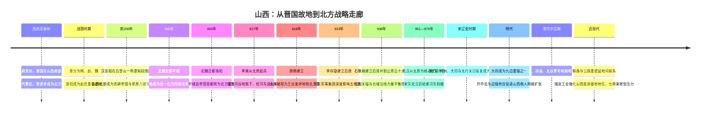

# 第四章配套：山西历史地理时间轴

> 本时间轴用于配合《第四章　人说山西好风光》阅读。年代采用常见纪年；古代行政区和地名范围随时代变化，不应直接等同于现代省界。

## 时间轴图

## 关键节点表

| 时期 | 关键地点 | 历史事件 | 地理意义 |
|---|---|---|---|
| 西周—春秋 | 晋南、汾河下游 | 晋国形成并扩张 | 农业盆地、盐池和通向中原的道路共同支撑诸侯国成长 |
| 战国 | 晋阳、上党 | 韩赵魏竞争，赵氏经营晋阳 | 山西中部可作为整军蓄势基地，上党则控制太行山内外通道 |
| 西汉初 | 平城、白登 | 汉匈冲突 | 大同盆地是草原南缘与中原北门之间的接触区 |
| 北魏 | 平城 | 定都、营建云冈 | 北方政权利用盆地、边疆骑兵资源和南下通道整合华北 |
| 隋唐 | 太原、河东 | 李渊起兵，太原成为北都之一 | 汾河走廊可南接关中，北控边塞，东越太行 |
| 五代 | 太原、晋北 | 沙陀集团和河东军镇崛起 | 边疆军事资源与盆地防御结合，产生强大区域政权 |
| 宋辽金 | 雁门、代州、大同 | 长期边防竞争 | 山口、长城和盆地决定防线层次及后勤方向 |
| 明代 | 大同、长城沿线 | 九边防务、边贸与军需 | 边镇供应催生跨区域贸易和商人组织 |
| 清代 | 平遥、祁县、太谷 | 晋商、票号发展 | 交通节点和长期商业网络把内陆地区接入全国金融体系 |
| 近现代 | 太原—大同—临汾—运城 | 铁路、煤炭工业与城市化 | 旧有南北盆地走廊被现代交通强化，资源结构影响区域发展 |

## 阅读提示

1. 山西历史不能只沿朝代阅读，还要同时观察“北部边疆—中部太原—南部河东”三个区域的功能变化。
2. 太原、大同、上党和晋南并非始终属于同一战略系统；政权强弱和交通技术会改变它们之间的联系。
3. 山地不是绝对屏障。真正重要的是山口、河谷、盆地出口和谁有能力维护道路及补给。
4. “边疆”并不等于封闭地区。军需、互市、移民和族群交流常使边疆成为商业与文化流动最活跃的地带之一。
