# 第五章配套：燕赵历史地理时间轴

> 本时间轴用于配合《第五章　燕赵多慷慨悲歌之士》阅读。历史上的燕、赵、幽州、河北、燕云等范围随时代变化，不应直接等同于现代河北省或京津冀行政边界。

## 时间轴图

```mermaid
timeline
    title 燕赵：从战国边疆到全国首都圈
    西周初 : 召公奭受封于北燕
           : 周王朝在华北北缘建立政治据点
    春秋战国之际 : 韩赵魏三家分晋
                 : 赵氏以晋阳、代地和上党为早期基础
    战国前期 : 赵国迁都邯郸
             : 国家重心由山西高地延伸到河北平原
    前307年前后 : 赵武灵王推行胡服骑射
                : 以骑兵改革适应燕、三胡、秦、韩等多方向边疆
    战国中期 : 燕昭王招贤，乐毅率联军伐齐
             : 燕国以人才和联盟弥补人口与资源限制
    战国中后期 : 赵国持续进攻中山
               : 打通太行山内外和南北疆域联系
    前260年 : 长平之战
            : 上党高地和太行南部通道成为秦赵国力决战区
    战国后期 : 李牧驻代、雁门防备匈奴
             : 以烽火、侦察、训练和后勤构成系统边防
    前227年 : 荆轲由易水出发刺秦
            : 弱国以个人高风险行动试图改变国家力量差距
    前222—前221年 : 秦灭燕、赵残余势力并统一天下
                  : 燕赵诸侯空间转为统一帝国郡县与边防体系
    秦汉时期 : 幽州、代郡、渔阳、上谷、右北平等成为北部边郡
             : 河北平原粮源与燕山长城前线被纳入同一国家网络
    东汉末—三国 : 袁绍据冀州，曹操争夺河北
                 : 河北平原成为统一北方的农业与人口基础
    北朝时期 : 邺城、幽州等多次成为北方政权重要节点
             : 太行山口、华北平原和东北交通持续影响政权中心
    隋唐时期 : 大运河和幽州边防体系加强
             : 华北北缘军镇通过平原走廊与中原财政相连
    755年 : 安禄山自范阳起兵
          : 边镇军力沿河北平原快速南下，反噬中央
    中唐以后 : 河北藩镇长期具有较强独立性
             : 韩愈借“燕赵感慨悲歌之士”讨论古代士风与现实秩序
    936年 : 石敬瑭割让燕云十六州
          : 燕山、长城与山西北部关键关口控制权改变
    辽代 : 幽州建为南京
         : 北京地区成为草原政权管理南部农业区的重要中心
    1153年 : 金海陵王迁都中都
           : 北京由区域中心进一步升级为王朝首都
    1267年后 : 元朝营建大都
             : 北方政治中心依靠运河、海运和全国财政维持
    1421年 : 明朝正式迁都北京
           : 首都、北边防和江南粮运合并为国家核心系统
    明代 : 居庸关、蓟镇、宣府、大同、山海关构成多层北防
         : 京师安全依赖长城关口、边军与大运河后勤
    1644年 : 山海关局势影响明清鼎革
           : 辽西走廊西口成为东北、北京和关内多方力量交会点
    清代 : 北京继续作为多区域帝国中心
         : 东北、蒙古、华北与江南运输网络在此汇合
    近现代 : 京汉、京奉等铁路及天津、秦皇岛港口发展
           : 旧山口和河谷通道被现代铁路与海港网络强化
    当代 : 京津冀协同发展与综合交通建设
         : 历史枢纽优势与水资源、生态和基础设施集中风险并存
```

## 关键节点表

| 时期 | 关键地点 | 历史事件 | 地理意义 |
|---|---|---|---|
| 西周—春秋 | 蓟城及燕山南麓 | 北燕形成并长期存在 | 华北平原北缘可同时联系中原、草原和辽西 |
| 战国前期 | 晋阳、代地、邯郸 | 赵国形成并迁都 | 赵国跨越太行山内外，兼具边疆骑兵与平原农业资源 |
| 战国中期 | 蓟城、齐燕边界 | 燕昭王招贤、乐毅伐齐 | 边缘国家通过人才和联盟暂时突破资源限制 |
| 战国中后期 | 中山、常山、太行东麓 | 赵国兼并中山 | 消除内部空间阻隔，改善山西基地与河北平原联系 |
| 前260年 | 上党、长平 | 秦赵大战 | 山地高地与有限通道迫使两国投入巨大后勤和兵力 |
| 战国后期 | 代、雁门 | 李牧守边 | 成熟边防依赖预警、训练、人口保护和选择战机 |
| 前227年 | 易水—咸阳路线 | 荆轲刺秦 | 燕国实力不足，个人行动被赋予改变国家命运的期待 |
| 秦汉 | 幽州、渔阳、上谷、右北平 | 帝国边郡和长城体系 | 平原粮运、山口控制和骑兵防务组成国家北门 |
| 东汉末—三国 | 冀州、邺城 | 袁曹争夺河北 | 河北人口和农业是统一北方的重要国家基础 |
| 唐代 | 幽州、范阳 | 东北边防军镇坐大，安史之乱爆发 | 为守边而集中的军事资源可沿平原走廊反向威胁中央 |
| 五代—辽宋 | 燕云十六州、河北北缘 | 山口控制权改变 | 北宋缺少完整燕山屏障，辽可依托山地和平原北缘建立优势 |
| 辽金 | 燕京、金中都 | 北京成为陪都和首都 | 草原—东北—华北接口转化为王朝政治中心 |
| 元代 | 大都、大运河、通州 | 全国首都建设 | 首都战略位置依靠远距离粮运和全国财政补足资源约束 |
| 明代 | 北京、居庸关、蓟镇、山海关 | 迁都与长城防务 | 政治中心靠近前线，运河供应与多层关口防御必须同步运行 |
| 明清之际 | 山海关、辽西走廊 | 多方军政力量交会 | 燕山东端与渤海之间的狭窄走廊放大关口决策影响 |
| 近现代 | 北京、天津、石家庄、秦皇岛 | 铁路、港口与城市化 | 历史节点被现代网络重构，区域中心性继续增强 |

## “燕赵士风”形成链条

## 阅读提示

1. 把“燕赵”理解为历史区域网络，而不是固定现代省界。
2. 同时观察燕山北防、太行山口、河北平原和渤海—辽西走廊四套系统。
3. 荆轲等个人英雄故事不能替代对国家实力、联盟、后勤和制度的分析。
4. 赵武灵王和李牧都说明，边疆压力只有经过技术、训练、组织和政治信任，才能转化为国家能力。
5. 北京的长期首都地位不是单纯自然优势，而是山前位置、东北联系、大运河粮运和数百年制度投资共同形成。
6. “燕赵士风”是史书和文学选择出来的文化记忆，不应被当成所有当地居民的先天性格。