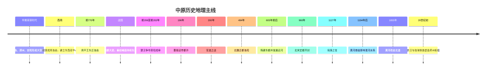

# 第六章配套：中原历史地理时间轴

- **主题**：中原从早期都邑中心、王朝争夺核心到全国交通枢纽的演变
- **范围**：以河洛、郑州—开封平原、豫北、豫中、豫东及其与关中、河北、山东、江淮、荆襄的联系为主
- **说明**：年代较早的考古文化不能与文献王朝简单一一对应；古代地名、河道与行政边界均随时代变化

## 一、青铜时代以前与早期国家形成

| 时间 | 事件 | 地理意义 |
|---|---|---|
| 约公元前3000—前2000年 | 黄河中下游多种新石器文化持续交流、竞争与融合 | 中原逐渐形成聚落密集、道路交会和区域互动频繁的复杂社会网络 |
| 约公元前二千纪前期 | 二里头文化在河洛地区发展，出现大型宫殿、道路、手工业作坊与高等级遗存 | 洛阳盆地显示出早期都邑中心的组织能力；是否直接对应夏王朝仍需区分考古事实与文献解释 |
| 约公元前1600年前后起 | 郑州商城、偃师商城等早商都邑兴起 | 郑州—洛阳之间的交通带成为政治与青铜手工业核心 |
| 约公元前1300年以后 | 商晚期都城位于殷，即今安阳附近 | 太行山东麓、黄河北方与华北平原交界成为王朝中心，便于联系晋南、河北、山东与河南 |

## 二、西周与东周：河洛成为“天下之中”

| 时间 | 事件 | 地理意义 |
|---|---|---|
| 约公元前1046年 | 周灭商，建立西周 | 关中成为王朝根基，但东方控制成为长期战略问题 |
| 西周初期 | 周经营洛邑、成周 | 建立关中—洛阳东西双中心；洛阳更接近东方诸侯与交通网络 |
| 前770年 | 周平王东迁洛邑，东周开始 | 洛阳成为政治与礼制中心，但王室军事资源不足，周边诸侯竞争加剧 |
| 春秋时期 | 郑、宋、卫、陈等国在中原竞争 | 交通便利带来经济和外交机会，也使小国长期遭受多方向压力 |
| 前606年左右 | 楚庄王北上并“问鼎” | “鼎”与洛阳王畿联系，说明控制中原象征与争夺天下权威相互结合 |

## 三、战国：中原成为多国压缩竞争区

| 时间 | 事件 | 地理意义 |
|---|---|---|
| 前403年 | 韩、赵、魏被正式承认为诸侯 | 晋南、河北与中原之间形成新的权力格局 |
| 前364年 | 魏惠王迁都大梁 | 魏国更靠近东方平原、水运与商业区，同时失去部分山河纵深 |
| 前293年 | 伊阙之战，秦军击败韩魏联军 | 伊阙控制洛阳南部门户，秦进一步削弱中原诸国 |
| 战国后期 | 秦持续越过函谷关向河洛、韩魏地区推进 | 关中安全后方与中原高价值前线形成“核心—扩张区”结构 |
| 前225年 | 秦攻破大梁 | 平原都城面对水攻和多向包围时的脆弱性集中显现 |
| 前221年 | 秦完成统一 | 中原被纳入以关中为政治核心的全国行政网络 |

## 四、秦末楚汉：荥阳—成皋成为天下铰链

| 时间 | 事件 | 地理意义 |
|---|---|---|
| 前209年 | 秦末起义爆发 | 中央控制崩溃后，各地军政集团向中原和关中汇集 |
| 前206年 | 秦亡，楚汉竞争开始 | 项羽控制东方，刘邦占有关中；中原成为两套资源系统的交会战场 |
| 前205年 | 彭城之战后刘邦退守荥阳方向 | 刘邦虽遭重创，仍可依靠关中补给恢复战线 |
| 前204—前203年 | 荥阳、成皋、广武反复争夺 | 这一带控制黄河、粮仓和关中东出通道，是战争持续能力的关键 |
| 同期 | 韩信经营河北、齐地，彭越在梁地袭扰楚军 | 中原主战场与外围战区联动，项羽后勤和集中兵力能力被削弱 |
| 前202年 | 刘邦最终战胜项羽，建立汉朝 | 胜负来自关中后方、中原牵制与多方向联盟的系统组合 |

## 五、两汉与三国：许昌、官渡与北方重组

| 时间 | 事件 | 地理意义 |
|---|---|---|
| 西汉时期 | 洛阳、荥阳、陈留、颍川等地继续发展 | 中原是连接长安与东方郡国的重要交通和人口区 |
| 25年 | 刘秀建立东汉，后定都洛阳 | 洛阳兼具旧都正统、河洛交通和接近东方人口区的优势 |
| 190年 | 董卓迁都长安并焚毁洛阳 | 都城设施与人口遭破坏，显示政治组织崩溃可迅速摧毁地理积累 |
| 196年 | 曹操迎汉献帝都许 | 许昌位于中原南北东西通道交会处，便于控制兖豫并面向荆州 |
| 200年 | 官渡之战 | 袁绍从河北跨黄河南下，补给线成为关键；曹操在核心区附近集中防御 |
| 220年 | 曹魏建立，以洛阳为都 | 河洛再次成为北方统一政权的政治中心 |

## 六、魏晋南北朝：旧都象征与人口迁徙

| 时间 | 事件 | 地理意义 |
|---|---|---|
| 265年 | 西晋建立，以洛阳为都 | 统一王朝再次利用河洛的中心性与都城传统 |
| 311年 | 永嘉之乱，洛阳陷落 | 中原开放性和政权内部失序叠加，导致都城与人口体系遭受重创 |
| 4—5世纪 | 北方多政权争夺洛阳、邺城和中原 | 控制旧都可宣示正统，但长期统治仍依赖军政和农业恢复 |
| 493—494年 | 北魏孝文帝迁都洛阳 | 北方边疆政权进入中原旧都，以礼制、行政和人口整合农业帝国 |
| 534年后 | 北魏分裂，洛阳失去统一中心地位 | 都城迁移无法自动解决军事集团、财政和社会矛盾 |

## 七、隋唐：洛阳、运河与东西双中心

| 时间 | 事件 | 地理意义 |
|---|---|---|
| 581年 | 隋朝建立 | 关中仍为政治根基，但东方粮食与交通日益重要 |
| 605年前后 | 隋营建东都洛阳，并推进大运河体系 | 洛阳通过运河连接江淮，成为全国资源汇流和再分配节点 |
| 618年 | 唐朝建立 | 长安为首都，洛阳继续承担东都和漕运中心功能 |
| 7世纪后期 | 唐高宗、武则天时期频繁驻洛阳 | 关中粮食压力和东方财政使洛阳现实价值上升 |
| 755—763年 | 安史之乱 | 洛阳和黄河—运河交通线成为反复争夺对象；全国运输体系受重创 |
| 9世纪后期 | 唐朝财政和军事中心进一步向东南与藩镇转移 | 中原仍是战场和交通中心，但长安对全国资源的控制能力下降 |

## 八、五代北宋：开封与运输型首都

| 时间 | 事件 | 地理意义 |
|---|---|---|
| 907年后 | 五代多朝以开封为都 | 政治中心从关中—洛阳山河型格局转向豫东平原与运输网络 |
| 960年 | 赵匡胤在陈桥兵变后建立北宋，定都东京开封 | 开封接近漕运、商业和人口网络，能够低成本组织全国资源 |
| 10—11世纪 | 汴河、蔡河、五丈河等水运与城市体系发展 | 首都规模和繁荣高度依赖江淮、江南粮食及持续河道维护 |
| 1004年 | 澶渊之盟前后宋辽在河北—黄河以北对峙 | 开封安全依赖北方外线防御，而非首都周围天然险阻 |
| 1127年 | 靖康之变，北宋灭亡 | 外线军防、决策和组织崩溃后，平原首都缺乏战略纵深的弱点暴露 |

## 九、金元明清：河道变化与区域重组

| 时间 | 事件 | 地理意义 |
|---|---|---|
| 1127年后 | 金控制中原，南宋立足江南 | 中原仍是北方政权农业和交通核心，但全国经济中心进一步南移 |
| 1194年后 | 黄河长期改走南道并侵夺淮河水系 | 豫东、苏北、皖北水系和农业受到深远影响，治河与漕运相互牵制 |
| 1234年 | 金朝灭亡 | 河南长期战争造成城市、人口和农业损失 |
| 元代 | 全国政治中心北移大都，运河重构 | 中原由首都核心更多转为南北运输中段与农业区 |
| 1368年后 | 明朝建立并重建中原行政、屯田和水利 | 河南继续承担南北交通和人口恢复功能 |
| 1642年 | 开封在战争中遭遇黄河水灾，城市严重受损 | 军事决策、堤防与自然风险叠加，可造成系统性城市灾难 |
| 1855年 | 黄河铜瓦厢决口后改走北道入渤海 | 黄河下游重新北移，河南、山东水系与治河体系发生重大变化 |

## 十、近现代：铁路重新激活中原枢纽

| 时间 | 事件 | 地理意义 |
|---|---|---|
| 1906年 | 京汉铁路全线通车 | 郑州成为南北铁路轴线的重要站点 |
| 20世纪前期 | 陇海铁路逐步东西延伸，并与京汉铁路在郑州交会 | 古代河洛—平原门户被铁路技术重新塑造成全国级十字枢纽 |
| 1938年 | 花园口决堤 | 战争决策造成大范围洪灾、人口迁徙与农业破坏，显示水利系统可被军事化 |
| 1949年后 | 河南交通、水利、工业和城市体系重建 | 郑州枢纽功能加强，洛阳、开封、安阳等城市形成不同产业与文化定位 |
| 21世纪 | 高速铁路、高速公路、航空与物流网络快速发展 | 中原“连接四方”的传统结构延续，但竞争优势依赖现代基础设施、产业和组织效率 |

---

## 十一、四条长期变化主线

### 1. 从本地生产中心到全国交换中心

早期中原的重要性更多来自本地农业、人口和都邑；隋唐以后，江淮和江南粮食通过运河进入洛阳、开封，中原的价值越来越体现为全国资源交换与行政组织能力。

### 2. 从洛阳盆地型首都到开封平原型首都

洛阳强调山河门槛与东西交通，开封强调漕运效率和商业网络。首都模式的变化反映经济重心、运输技术和主要安全威胁的改变。

### 3. 黄河既创造中心，也不断破坏中心

冲积平原支持人口与农业，泥沙和决口又使同一地区承担巨大治理成本。中原历史不能只讲战争和都城，也必须讲堤防、河务、灾民和土地恢复。

### 4. 中心位置不会自动带来统治能力

周王室、东汉末年、北宋末年等案例都说明，政治象征和地理中心无法替代财政、军队、行政和维护体系。中心只能放大已有组织能力。

---

## 十二、时间轴速记

## 十三、配套阅读

- [第六章：中原逐鹿，谁主沉浮](../Chapters/Chapter06_中原逐鹿_谁主沉浮.md)
- [原创地图：中原地理骨架与逐鹿通道](../Maps/Chapter06_中原地理骨架.svg)

> 阅读建议：先在地图上找出洛阳、荥阳、开封、许昌、官渡和南阳，再沿时间轴观察政治中心如何随粮运、河道和技术变化。