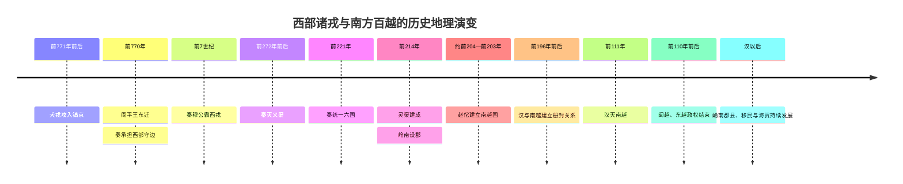

# 第九章配套时间轴：西部诸戎与南方百越

> 本时间轴用于配合《第九章　西和诸戎，南征百越》阅读。年代、政区和族群范围在学界可能存在不同解释，表中以便于理解历史地理机制为主。

## 一、先秦西部边疆

| 时间 | 事件 | 历史地理意义 |
|---|---|---|
| 商周之际 | 周人长期经营关中西部并与周边集团互动 | 关中并非孤立农业核心，而是连接陇山、陇西与草原边缘的区域 |
| 前771年前后 | 犬戎攻入镐京，西周结束 | 边疆力量与王朝内部危机结合，可直接改变政治中心 |
| 前770年 | 周平王东迁，秦襄公因护送与守边获得封赏 | 秦取得经营关中西部的政治合法性 |
| 前659—前621年 | 秦穆公在位，向西扩展并“霸西戎” | 秦逐步控制西部通道、人口与马匹资源，扩大安全纵深 |
| 战国中期 | 秦设置陇西、北地等郡县体系 | 西部边疆开始从结盟与战争空间转化为行政和军事基地 |
| 前272年前后 | 秦消灭义渠 | 关中北部压力下降，秦可把更多力量用于东方战争 |

## 二、长江下游与东南沿海的越人世界

| 时间 | 事件 | 历史地理意义 |
|---|---|---|
| 春秋时期 | 吴、越在长江下游和浙江地区兴起 | 水网、湖泊、沿海交通与舟师成为国家竞争的重要条件 |
| 前473年 | 越灭吴 | 越国控制长江下游部分地区，区域力量重新组合 |
| 前334—前306年间 | 越国衰亡，地方越人集团分散 | 东瓯、闽越等区域政治力量逐渐显现 |
| 战国时期 | 楚国沿长江、湘江及江南地区扩展 | 秦南征以前，江南已存在长期的政治整合与交通基础 |

## 三、秦朝南征与灵渠

| 时间 | 事件 | 历史地理意义 |
|---|---|---|
| 前221年 | 秦统一六国 | 北方形成的郡县、道路和动员体系开始向岭南延伸 |
| 前219—前214年间 | 秦多路南下，与西瓯等地方集团长期作战 | 山岭、湿热环境与粮道使战争成为后勤竞争 |
| 前214年 | 灵渠建成，连接湘江与漓江 | 长江与珠江两大水系形成运输接口，大宗粮运成本下降 |
| 前214年前后 | 秦设置南海、桂林、象等郡 | 岭南在行政名义上纳入帝国，但实际控制集中于交通节点与城邑 |
| 秦代 | 大量军人、官吏和移民进入岭南 | 郡县制度与本地社会开始长期融合 |

## 四、南越国与汉朝

| 时间 | 事件 | 历史地理意义 |
|---|---|---|
| 前207年前后 | 秦朝崩溃，岭南与中原联系减弱 | 距离与南岭使地方官员获得高度自主空间 |
| 约前204—前203年 | 赵佗建立南越国 | 秦代郡县、移民与越人社会重组为区域政权 |
| 前196年前后 | 汉高祖遣陆贾与南越建立册封关系 | 汉初以外交和名义秩序降低直接远征成本 |
| 前2世纪前期 | 南越在汉朝与岭南地方社会之间维持自主 | 番禺、珠江水系和南岭通道构成政权骨架 |
| 前111年 | 汉武帝灭南越 | 中央直接控制珠江流域主要城邑、河道与海上门户 |
| 前110年前后 | 汉朝处理闽越、东越 | 东南沿海进一步纳入郡县与人口迁徙体系 |
| 西汉以后 | 合浦、番禺等港口与内地交通持续发展 | 岭南由军事边疆逐渐转为海上贸易和区域经济门户 |

## 五、长期演变

## 六、按机制复习

1. **西部机制**：边疆压力 → 军事与行政能力增强 → 关中后方扩大 → 秦向东方集中力量。
2. **南部机制**：山岭阻隔 → 粮道困难 → 灵渠连接水系 → 军事通道转为行政与经济网络。
3. **治理机制**：军事占领 → 设置郡县 → 移民与地方合作 → 市场和身份逐步重组。
4. **边疆机制**：旧边疆成为腹地后，新边疆继续向更远山地、海岸和河谷移动。
5. **国家形成机制**：统一不是一次完成的事件，而是跨越不同生态区的长期运营过程。
