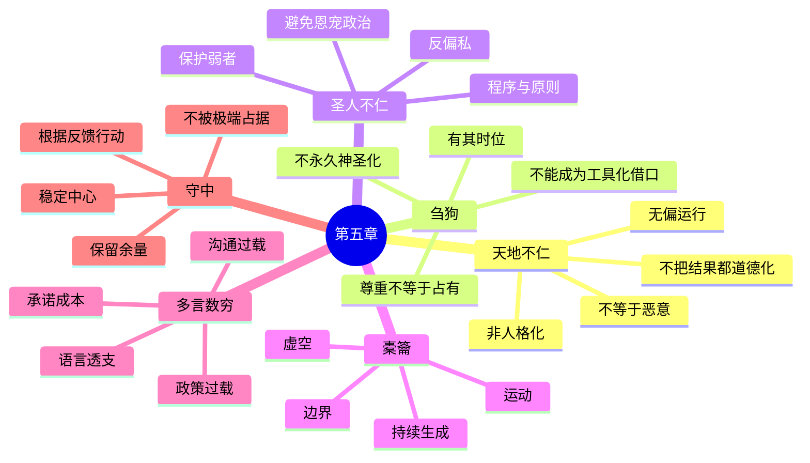

# 《道德经》第五章：天地不仁，以万物为刍狗

> 第四章以“道冲”说明：真正深层的生成力量并不靠占满、炫耀或强制维持。第五章进一步把这一思想推向一个容易令人不安的结论：天地运行并不围绕人的愿望展开，圣人的治理也不能被私人好恶支配。老子不是赞美冷酷，而是在区分两种完全不同的东西——**普遍、无偏的秩序**与**以自我为中心的偏爱**。本章随后以“橐籥”比喻天地：正因为内部是空的，才可以持续发生作用；最后以“多言数穷，不如守中”提醒人们，过度言说、命令和干预往往会耗尽系统，真正有效的行动需要保留中心、余地与沉静。

## 一、原文

> 天地不仁，以万物为刍狗。
>
> 圣人不仁，以百姓为刍狗。
>
> 天地之间，其犹橐籥乎？
>
> 虚而不屈，动而愈出。
>
> 多言数穷，不如守中。

## 二、白话翻译

天地并不以人类式的偏爱来运行；在天地的自然秩序中，万物都依其条件生长、变化和消逝，并没有哪一种存在被保证永远受到特殊照顾。

圣人治理天下，也不应以私人恩怨、亲疏爱憎或一时情绪决定公共事务；面对百姓，应尽量超越偏私，让制度和原则对所有人都适用。

天地之间，难道不像风箱吗？它的内部看似空虚，却不会因使用而枯竭；一旦运行，就不断产生新的气流和作用。

过度发表言论、不断发号施令，往往更快使自己陷入困境和耗竭；不如守住内在的中心，保持虚静、分寸与持续回应现实的能力。

## 三、文本说明与核心问题

本章篇幅很短，却集中出现了《道德经》中最容易被断章取义的句子。“天地不仁”“圣人不仁”常被误读为天地残酷、统治者可以无情；“以百姓为刍狗”又容易被现代读者理解成把人当作一次性工具。若直接以今天的词义套入古文，就会把老子的反偏私思想变成冷酷主义。

本章需要回答七个核心问题：

1. “仁”在这里为什么不是简单的善良或同情？
2. “不仁”究竟是无情、无偏，还是超越人格化意志？
3. “刍狗”在古代礼仪中是什么，它为什么适合用来说明天地与万物的关系？
4. 圣人若“不仁”，如何避免走向专制和对人的工具化？
5. “橐籥”为什么能够说明“虚”的生成力量？
6. “多言数穷”批评的是说话本身，还是脱离现实的过度承诺与干预？
7. “守中”是折中主义、儒家的中庸，还是保持系统中心与内在空处？

本章的核心不是“世界残酷，所以人也应残酷”，而是：

> 世界没有义务围绕个人愿望运行；成熟的人必须承认这种无偏的现实，同时在人的共同生活中建立更可靠、更少偏私的秩序。

## 四、“天地不仁”：天地不是人格化的道德主体

### 1. 先理解古代语境中的“仁”

在先秦思想中，“仁”通常与亲爱、关怀、人际伦理和有差等的情感关系有关。人会爱父母、亲近朋友、同情受苦者，也会因关系远近而产生不同程度的责任。这样的仁是人类社会不可缺少的伦理能力。

但天地不是一个巨大的人格，也不是一位按照人的功过即时分配奖惩的统治者。春夏秋冬不会因为某个人善良就停止严寒，洪水不会先检查沿岸居民的品德，疾病、衰老和死亡也不会只降临在“坏人”身上。

因此，“天地不仁”首先是在解除一种投射：人不能把自己的情感和公平期待直接投射到自然运行之上。

### 2. “不仁”不是主动残害

天地不特别偏爱某物，不等于天地怀有恶意。地震没有仇恨，暴雨没有复仇心，时间也不是为了惩罚谁才使生命衰老。自然过程会带来生长，也会带来毁灭；会成就一种生命，也可能使另一种生命失去条件。

把非人格化的过程称作“残忍”，虽然能够表达人的痛苦，却不能准确说明过程本身。老子要求我们区分：

- **痛苦是真实的**；
- **自然却未必具有伤害人的主观意图**；
- **承认无意图，不等于否定受害者的感受**。

这一点很重要。老子的思想不能被用来对遭遇不幸的人说“天地本来就不仁，你不该难过”。理解自然的无偏，是为了减少错误归因和怨恨，不是为了取消悲伤、救助与责任。

### 3. 天地的无偏使共同世界成为可能

如果自然规律会因个人身份随时改变，世界反而无法理解和合作。火对所有人都能取暖，也都可能灼伤；重力不会因为权势而暂停；种植需要季节、土壤和劳动，不会只凭身份自动丰收。

正因为基本规律不围绕个人改变，人们才能学习、预测、协作和承担后果。天地的“不仁”从人的感情看似冷淡，从秩序角度却意味着一种普遍性。

### 4. 不要把自然秩序误写成道德正义

人们常说“善有善报”“天道酬勤”，这些话可以激励行为，却不能当作每一件具体事件的机械定律。努力通常提高成功概率，却不保证每次成功；善良有助于建立信任，却不保证永远免受伤害。

如果把所有结果都解释成道德报应，就会出现严重问题：成功者容易把幸运全部归功于自己，受苦者又可能被反过来指责“不够努力”或“必有过错”。

“天地不仁”打断了这种简单化：世界包含规律、概率、偶然、结构和他人的选择，不能把每个结果都道德化。

## 五、“以万物为刍狗”：不是蔑视，而是不永久占有

### 1. 什么是“刍狗”

“刍”是草。刍狗通常被理解为古代祭祀中用草扎成的狗形祭物。在仪式进行之前和进行之时，它具有特定的礼仪功能；仪式结束以后，它便失去该功能，回归普通草物。

这个意象的重点，不一定是“卑贱”，而是：

- 它在适当时刻被使用；
- 使用时受到相应对待；
- 功能完成后不被永久神圣化；
- 它没有因一时被尊崇，就获得永恒不变的地位。

### 2. 万物都有时位，却没有永久特权

春天适合萌发，秋天适合成熟，冬天则使许多生命进入休藏。某一种状态在一个阶段必要，到了另一个阶段可能就应退出。天地让万物发生，却不保证任何具体形式永远维持。

“以万物为刍狗”因此可以理解为：天地使万物各得其时、各行其化，却不以占有的方式把任何一种形态固定为永恒中心。

### 3. 尊重存在，不等于承诺永恒

现代人常把尊重与永久保留混为一谈。实际上，真正尊重一个过程，也包括允许它完成、转化和结束：

- 一个项目有价值，不代表它必须永久存在；
- 一个职位曾经重要，不代表组织永远不能调整；
- 一种习惯曾经保护过自己，不代表以后仍然适合；
- 一段关系值得珍惜，也不代表可以通过控制使它停止变化。

老子的刍狗意象提醒我们：价值往往与时位相连。不能因为事物终会结束，就否定它曾经的意义；也不能因为它曾经有意义，就拒绝一切结束。

### 4. 这句话不能成为工具化他人的借口

把“刍狗”解释成可随意牺牲的工具，是危险的误读。天地不是一个负有现代人权责任的政府，但圣人治理的是人类共同体。公共权力一旦把百姓仅仅当作数字、资源或耗材，就会破坏老子一贯反对的强制、争夺和过度统治。

所以，从“天地无偏”过渡到“圣人无偏”时，必须保留一个关键区分：

> 圣人可以不徇私，却不能不把人当人；可以避免情绪化偏爱，却不能取消人的尊严、痛苦与基本需要。

## 六、“圣人不仁”：公共治理不能被私人偏爱支配

### 1. 圣人的“不仁”首先是反偏私

人在私人生活中可以有亲疏，但公共权力不能只服务亲近者。法令若对不同身份任意变化，资源若只流向关系网络，奖惩若取决于统治者喜怒，那么所谓“仁爱”很快会变成恩宠政治。

老子担心的不是关怀，而是以关怀之名进行选择性施予。今天可以偏爱这一群人，明天也可以因情绪改变而抛弃他们。建立在个人恩惠上的安全感，远不如建立在稳定规则上的安全感。

### 2. 无偏原则比表演性仁慈更可靠

一个管理者公开表达温情，却长期拖欠工资；一个机构不断宣传关怀，却没有透明程序；一个领导喜欢亲自“特批”个案，却不修复造成问题的制度。这些做法看似有人情味，实际上把所有人置于对权力好恶的依赖中。

真正可靠的治理更接近：

- 基本规则清楚；
- 程序对所有人可预期；
- 弱者有制度化保护，而不只等待恩赐；
- 权力受到约束；
- 决策者不把私人情绪当作公共标准。

### 3. “无偏”不等于机械地对所有人一模一样

公平并不总是把相同资源平均分配。儿童、老人、病人和残障者可能需要不同支持；遭受灾害的地区需要优先救援；处于不同起点的人，也可能需要不同条件才能获得真正机会。

无偏的意思，是差别待遇必须有可说明、可检验、与公共目标相关的理由，而不是依据亲疏、身份崇拜或个人情绪。

### 4. 圣人不是冷酷的技术官僚

只强调数据而看不见人的处境，也是一种偏狭。数据模型可能遗漏弱势群体，效率指标可能把无法量化的痛苦排除在外，统一规则也可能在现实中产生不平等后果。

所以圣人的“不仁”需要与倾听、反馈和谦逊结合：不凭私人偏爱治理，也不把抽象制度变成新的偶像。

### 5. 领导者应减少“我在拯救你”的姿态

过度仁慈的自我形象，常隐藏控制欲。领导者若总把团队成员看成等待自己拯救的人，就容易扩大干预、削弱自主性，并要求被帮助者以服从和感激作为回报。

老子的圣人更接近创造条件、减少障碍、让人能够自行生活与成长。帮助不必转化为占有，关怀也不必制造依附。

## 七、天地像“橐籥”：虚空为什么具有生产力

### 1. “橐籥”是什么

“橐籥”通常解释为古代风箱一类的鼓风装置。“橐”可指皮囊式风具，“籥”可指管道或与鼓风相关的部件。无论具体器形如何，本章所抓住的结构十分清楚：风箱内部必须留有空腔，才能通过开合运动推动空气。

如果内部被完全塞满，风箱便失去功能。它的力量不只来自材料，更来自空处、边界和运动的配合。

### 2. “虚而不屈”：空而不竭

这里的“屈”可以理解为穷尽、衰竭或被压折。“虚而不屈”不是说空无永远静止，而是说它因为没有被固定内容占满，反而能够持续响应。

第四章说“道冲，而用之或不盈”，第五章的风箱把这一点变得更具体：

- 空，提供容纳；
- 边界，形成结构；
- 运动，产生作用；
- 不占满，使作用可以反复发生。

### 3. “动而愈出”：行动激发潜能

风箱静止时，看起来只是一个空容器；一旦运动，气流不断涌出。老子不是把虚静与行动对立起来，而是在说明：优质行动来自未被僵化的中心。

真正的“虚”不是逃避行动，而是不让行动被成见、恐惧和自我证明完全占据。因为内部留有余地，行动才可以根据反馈调整。

### 4. 空与结构必须同时存在

没有空腔，风箱不能鼓风；没有外壳和阀门，空气也无法被有效推动。因此老子的“虚”绝不是无组织状态。

可以把橐籥理解成一个系统模型：

| 要素 | 风箱中的作用 | 对组织与个人的启示 |
|---|---|---|
| 空腔 | 容纳空气 | 保留资源、时间和认知余量 |
| 外壳 | 形成边界 | 清晰责任、规则和安全范围 |
| 开合 | 产生运动 | 行动、反馈、迭代 |
| 管道 | 引导气流 | 目标、流程和沟通路径 |
| 不塞满 | 可反复工作 | 避免过载与僵化 |

### 5. “越满越强”是常见误区

团队把每个人的时间排满，服务器长期保持百分之百负载，医院床位没有缓冲，家庭预算没有应急资金，个人日程没有休息，看起来都很“高效”。但一旦出现波动，系统就没有能力吸收冲击。

橐籥的启示是：**空余不是浪费，而是系统产生持续能力的组成部分。**

## 八、“多言数穷”：为什么过度表达会耗尽力量

### 1. “多言”不只是说话多

老子并非反对语言本身。《道德经》正是通过语言传达思想。“多言”更接近不断解释、承诺、命令、辩护和制造口号，以语言取代对现实的观察与行动。

一个人若每次都急于证明自己正确，就没有空间听见新信息；一个组织若不断发布宏大口号，却缺少落实能力，语言便会透支信任。

### 2. “数穷”的可能含义

“数”可理解为屡次、频繁，也可带有迅速趋向的意思；“穷”则是困窘、穷尽、无路可进。整句可以理解为：言辞过多，往往反复使人陷入困境，或更快耗尽自身。

语言会带来承诺成本。每多宣布一个目标，就增加一次需要兑现的责任；每多作一次绝对判断，就缩小未来调整的空间；每多发一道指令，就增加协调、解释和冲突的成本。

### 3. 过度政策会制造反作用

公共治理中，问题一出现就增加规定，规定之间又相互冲突，于是继续增加解释文件和例外条款，最终形成人人都难以理解的制度迷宫。

这并不意味着规则越少越好，而是规则应当：

- 针对真正关键的问题；
- 保持一致和可执行；
- 为现实差异保留反馈机制；
- 定期删除失效规定；
- 不以文件数量代替治理质量。

### 4. 组织中的“沟通过载”

会议、即时消息、邮件、汇报和状态更新原本用于协作，但当沟通本身占据主要工作时间，组织就可能陷入“关于工作的工作”。信息越多，真正重要的信息反而越难被识别。

减少多言并不是让团队沉默，而是提高信息密度：谁需要知道、何时需要知道、需要做什么、什么情况下重新讨论。

### 5. 个人生活中的解释冲动

人在焦虑时常不断解释自己，希望通过更多语言控制他人的评价。但解释越多，可能越显得防御，也更容易产生新的矛盾。

有些时候，最有力量的回应不是继续辩论，而是：

- 清楚表达一次事实和边界；
- 承认自己不知道的部分；
- 用后续行动证明；
- 接受并非所有人都会理解。

## 九、“不如守中”：守住生成行动的中心

### 1. “中”不是简单折中

“守中”不能直接等同于凡事取平均、避免立场或讨好双方。面对明显伤害时，机械折中反而可能纵容伤害。

这里的“中”更接近风箱内部的空处、事物运行的枢纽，以及不被极端情绪和过度言说占满的中心状态。

### 2. 守中是守住分辨能力

人在愤怒、恐惧、兴奋或自负达到极点时，注意力会被单一叙事占据。守中不是没有情绪，而是不让任何一种情绪完全接管判断。

它包括：

- 先区分事实、解释与感受；
- 留意自己最想立刻证明什么；
- 给新证据进入的空间；
- 在行动前确认边界和后果；
- 行动后根据反馈修正。

### 3. 守中也是守住资源余量

没有睡眠、现金、时间、人员或信誉余量，所谓自由选择就会迅速缩小。守中因此具有非常现实的一面：不要把所有能力都押在单一方向，不要让短期效率耗尽长期恢复力。

### 4. 守中不等于永远不行动

风箱的中心是虚的，却要通过运动产生气流。守中不是退缩，而是在行动时不失去中心：可以坚定，却不被敌意驱动；可以快速，却保留停止与转向的能力；可以承担责任，却不把结果全部当作自我价值。

### 5. “中”与“冲”的连续性

第四章的“道冲”与第五章的“守中”互相呼应。道的空不是边缘的空洞，而是核心处不被占满；守中，就是在人与组织内部保留这种核心空处，使行动能够不断更新，而不被一次成功、一次失败或一种身份永久锁死。

## 十、本章最容易出现的六种误读

### 误读一：天地不仁，所以世界只讲弱肉强食

天地无偏不等于社会应取消伦理。自然界没有公共医疗和司法制度，但人类可以通过合作减少不必要的痛苦。承认自然不会自动保护我们，反而说明人类更需要相互照顾。

### 误读二：圣人不仁，所以领导者可以冷酷

圣人不徇私，并不等于可以把百姓当耗材。真正的反偏私要求稳定规则、权力约束和普遍尊重，而不是任意牺牲弱者。

### 误读三：刍狗就是垃圾

刍狗在仪式中有其时位和功能。重点是事物不会因暂时受到尊崇而获得永久特权，而不是说万物毫无价值。

### 误读四：虚就是躺平和什么都不做

风箱的虚是有结构、可运动、能产生作用的空。它更接近准备状态和容量，而不是消极停滞。

### 误读五：多言数穷，所以知识和沟通无用

老子反对的是语言膨胀和言行脱节，不是反对准确说明、教学和必要沟通。少言的标准不是字数，而是语言是否增加理解和行动能力。

### 误读六：守中就是没有原则

守中不是在正义与伤害之间平均分配立场，而是避免被极端情绪和自我证明夺走判断力。它能够支持更稳定、更有原则的行动。

## 十一、与前四章的思想连接

### 与第一章：“名可名，非常名”

第一章提醒语言不能完全覆盖真实；第五章说“多言数穷”，进一步说明语言一旦无限膨胀，不仅不能穷尽真实，还可能耗尽行动能力。

### 与第二章：对立关系的生成

第二章指出美丑、善恶常在比较中共同生成。第五章的天地不仁，则要求我们不要把自然变化简单塞进“奖励我／惩罚我”的二元叙事。

### 与第三章：不尚贤、不贵难得之货

第三章反对用单一评价刺激争夺；第五章把这一点扩展到治理：圣人不应根据私人偏爱制造恩宠等级，而要减少对名位和奖赏的操纵。

### 与第四章：道冲而用之或不盈

第四章说明空而不竭，第五章用橐籥展示空如何工作。两章共同建立了老子的“生成性虚空”思想：能力不只来自占有，也来自不被占满。

## 十二、现代应用一：心理学与人生观

### 1. 不把所有遭遇解释成针对自己

项目失败、天气破坏计划、市场下跌或身体生病，很容易被体验为“世界在针对我”。天地不仁提醒我们，许多事件来自复杂条件，不具有针对个人的意图。

这不是否定责任。若失败来自自己的选择，应当复盘；若来自他人伤害，应当维权；若来自随机事件，则应处理损失。关键是不要额外制造“宇宙为什么专门惩罚我”的痛苦。

### 2. 接受无常，同时珍惜当下

刍狗意象说明事物有其时位。知道关系、健康、职业和生命都会变化，并不必然让人悲观；它也能使人减少理所当然，更认真地使用当下。

### 3. 建立内在风箱

一个人需要心理空腔：没有被日程、信息和评价全部塞满的时间。散步、安静阅读、睡眠、写日记和无目的观察，都可能恢复这种空间。空处不是停止成长，而是让经验被消化。

### 4. 对情绪保持无偏观察

“不仁”也可转化为一种观察能力：不因喜欢某种感受就永远抓住，也不因厌恶某种感受就立刻压制。情绪出现时先看见它、理解它的信号，再决定行动，而不是让它直接成为命令。

## 十三、现代应用二：领导、组织与公共治理

### 1. 从个人恩宠转向制度可靠

成熟组织不应让员工的基本待遇取决于能否得到某位领导喜欢。招聘、晋升、绩效、申诉和资源分配应有相对清楚的程序，也应允许纠错。

### 2. 保留容量，不追求永久满载

团队需要替补和交叉训练，关键系统需要冗余，项目计划需要缓冲，预算需要应急空间。把所有资源长期压到极限，会使小故障迅速升级。

### 3. 减少政策与会议的堆积

每增加一条规则或会议，应回答：它解决什么问题？谁负责执行？如何知道有效？何时复审或删除？若没有答案，“多言”就可能成为管理焦虑的外化。

### 4. 公平需要原则，也需要反馈

无偏制度不能只看形式相同，还要观察实际结果。若同一流程持续排除某些群体，就应检查数据、假设和执行环境。守中意味着既不因个案情绪任意破坏规则，也不因迷信规则拒绝修正。

### 5. 领导者为团队留出自主空间

好的管理不是对每一步发指令，而是明确目标、边界和资源，让接近问题的人能够行动。管理者应在关键风险上介入，在普通执行上减少控制。

## 十四、现代应用三：软件架构与技术系统

### 1. 风箱模型与系统容量

一个系统若持续运行在最大吞吐量附近，就没有空间吸收突发流量。CPU、内存、连接池、数据库写入、消息队列和网络带宽都需要安全余量。

“虚而不屈”可以转化为架构原则：

- 容量规划预留峰值空间；
- 使用限流、背压与熔断；
- 避免无限队列掩盖拥塞；
- 让系统在降级状态下仍能提供核心功能；
- 定期进行故障演练，确认余量真实可用。

### 2. 少言与接口设计

接口越多、参数越多、隐含承诺越多，长期兼容成本越高。良好 API 不是功能堆积，而是边界清楚、语义稳定、默认行为合理。

“多言数穷”对应技术债：每个没有必要的抽象和配置项，都可能成为未来必须解释和维护的承诺。

### 3. 守中与架构核心

系统需要稳定核心，也需要可替换边缘。把业务规则与基础设施耦合在一起，会使每次变化牵动全局。守中可以理解为识别真正应长期稳定的领域模型和契约，同时让实现细节保持可演进。

### 4. 自动化不能取消人的尊严

算法治理若只优化成本和效率，可能把人变成“刍狗式”数据点。高风险自动化应提供可解释性、申诉渠道、人工复核和偏差检测。无偏不是没有人性，而是减少任意偏见并保护每个人的基本权利。

## 十五、现代应用四：投资与风险管理

### 1. 市场不认识你的成本价

市场不会因为你买入后下跌就“欠你一个反弹”，也不会因为你研究努力就保证获利。价格由供需、盈利预期、流动性、情绪和新信息共同作用，并不围绕个人持仓运行。

接受市场的“不仁”，可以减少报复性交易和把亏损个人化。

### 2. 不把成功永久神圣化

一家公司、行业或策略曾经成功，不代表永远有效。刍狗的时位观提醒投资者：尊重过去贡献，但持续检查竞争格局、估值、技术变化和资本回报。

### 3. 现金与仓位是投资的空腔

满仓能够提高上涨时收益，也会削弱面对回调和新机会的选择权。适度现金、分散和仓位边界不是“浪费”，而是橐籥式能力：平时看似空，变化发生时才显示价值。

### 4. 少预测，多设条件

不断发表确定性预测容易把自己困在叙事中。更稳健的方法是明确：什么事实支持当前判断，什么指标会使判断失效，在不同情景下如何行动。

投资中的守中，不是永远中性，而是不让贪婪、恐惧或自尊完全控制仓位。

## 十六、一个可操作的“守中”决策框架

面对重要问题时，可以使用五步：

### 第一步：去人格化不必要的归因

问：这是有人主观针对我，还是系统、概率、限制和偶然共同造成？不要把两者混为一谈。

### 第二步：识别偏私

问：我的决定是否因为亲疏、面子、既有投入或个人好恶而改变标准？若需要差别处理，理由能否公开说明？

### 第三步：检查系统空腔

问：是否保留了时间、资金、人力、注意力和退出路径？如果一点余量都没有，系统将如何面对波动？

### 第四步：减少无效言说

问：哪些解释、会议、承诺或规则真正必要？能否用一个清楚原则和一次明确行动替代反复表态？

### 第五步：回到中心

问：这件事最核心的目标、边界和责任是什么？在情绪平稳后，我仍会选择同样行动吗？

## 十七、本章思维导图

## 十八、五分钟复习

1. “天地不仁”不是说天地邪恶，而是说自然不是按人的亲疏和道德期待运行。
2. “不仁”在本章主要反对人格化偏爱，不等于取消人的同情与伦理责任。
3. “刍狗”是有特定时位和礼仪功能的草制祭物，重点是万物不会被永久神圣化。
4. “圣人不仁”要求公共治理减少徇私和恩宠政治，不能被解释为把百姓当耗材。
5. “橐籥”以风箱说明：内部空处、外部结构与运动共同产生持续能力。
6. “虚而不屈”表示空而不竭；“动而愈出”表示保有空处的系统越能持续响应。
7. “多言数穷”批评过度承诺、命令和解释造成的耗竭，不是反对一切语言。
8. “守中”不是机械折中，而是守住判断中心、资源余量和可修正能力。
9. 对个人而言，不必把所有不幸解释成世界针对自己；对组织而言，应以制度可靠代替个人恩宠。
10. 本章最重要的现代模型是：**无偏原则＋生成性空余＋克制的干预。**

## 十九、思考题

1. “天地不仁”如何帮助人面对随机灾难，又如何避免被用来淡化受害者痛苦？
2. 公共治理中的“无偏”与私人生活中的亲情、友情是否冲突？两者边界在哪里？
3. 差别待遇在什么情况下是合理照顾，什么情况下是徇私？
4. 你的日程、财务、工作系统或技术架构中，哪里已经被塞得没有“风箱空腔”？
5. 最近一次争论中，你说了哪些真正必要的话，哪些话只是为了证明自己？
6. 面对明显的不公，“守中”如何避免沦为中立和逃避？
7. 组织如何同时做到规则稳定与对特殊处境保持敏感？
8. 在投资中，哪些持仓或叙事曾被你“永久神圣化”？什么证据会使你重新评估？

## 二十、参考资料与延伸阅读

### 古典文本与注本

1. 王弼注《老子道德经注》。理解“天地任自然”“不以仁恩干预万物”的经典注释传统。
2. 河上公章句《老子道德经河上公章句》。可比较其在养生、治身与治国层面的解释。
3. 马王堆帛书《老子》甲、乙本。可用于观察传世文本以前的字句与篇章形态。
4. 北大汉简《老子》。可与传世本、帛书本对读，理解经典文本的流动性。

### 现代研究与通识注释

1. 陈鼓应：《老子今注今译》。适合了解现代中文语境中的哲学解释与异文讨论。
2. 高明：《帛书老子校注》。适合进一步研究帛书本的文字与版本问题。
3. 楼宇烈：《老子道德经注校释》。以王弼注为核心，便于进入魏晋玄学解释传统。
4. 刘笑敢：《老子古今》。可用于理解《老子》概念在古代与现代诠释中的变化。

### 阅读提示

阅读不同注本时，应特别比较三处：

- “不仁”被解释为冷酷、无偏，还是顺其自然；
- “刍狗”强调被弃置，还是强调随时位而用；
- “守中”被理解为守虚、守枢纽、守内在，还是一般性的中道。

不同解释未必只能选一个，但必须检验它是否与本章的橐籥意象、前后章节及《道德经》整体反强制、重虚静的方向相协调。

## 本章结语

第五章最令人震动的地方，是它拒绝给人一种以自我为中心的宇宙安慰。天地不会因为我们认为自己重要，就暂停变化；市场、疾病、时间和自然也不会自动按人的道德剧本运行。接受这一点，可能令人失落，却也能使人更成熟：不再把每次挫折都理解为惩罚，不再把每次成功都理解为天命。

但老子并没有因此把人推向冷酷。恰恰相反，既然天地不会替我们保证公平，人类共同体就更需要减少偏私、限制任意权力、建立可靠制度，并在制度中保留对具体痛苦的感受力。圣人的“不仁”应当是一种不徇私的公共精神，而不是取消仁爱。

橐籥的比喻则给出了积极方向：持续力量来自中心的空处。个人需要注意力和情绪余量，组织需要人员与资源余量，技术系统需要容量和故障余量，投资需要现金和风险余量。空不是无用，而是未来能够进入的地方。

所以本章最值得记住的，不是“天地冷酷”，而是：

> 不要求世界偏爱自己，不用偏爱扭曲公共判断，不用言辞填满所有空间；守住中心与余量，才能在无常的世界中持续行动，并对他人保持清醒而可靠的关怀。
