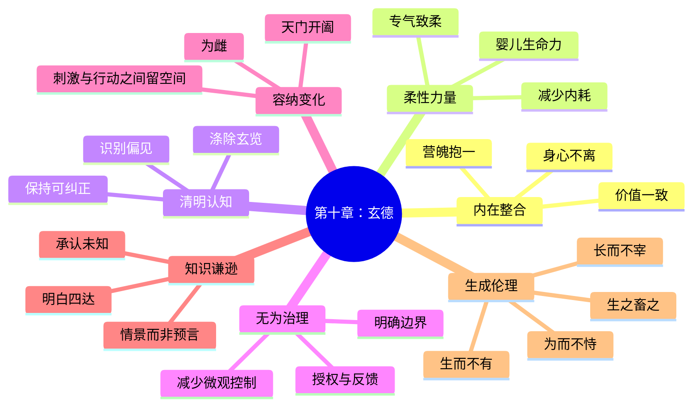

# 《道德经》第十章：载营魄抱一，能无离乎

> 第九章讨论“知止”：当财富、能力、权力和成就已经接近饱和时，怎样避免继续加码所造成的脆弱。第十章转向更内在、也更困难的问题：一个人能否在行动、治理、认知和创造之中保持完整，而不被欲望、知识、权力与自我功劳撕裂？老子连续提出六个问题，最后以“玄德”收束。它不是要求人退回无知、无能或不作为，而是训练一种更高阶的能力：身体与精神相合，力量柔而不僵，心镜清而不执，治理有效却不过度控制，开放变化却不争夺主导，理解广泛却不把知识变成傲慢。

## 一、原文

> 载营魄抱一，能无离乎？
>
> 专气致柔，能婴儿乎？
>
> 涤除玄览，能无疵乎？
>
> 爱民治国，能无为乎？
>
> 天门开阖，能为雌乎？
>
> 明白四达，能无知乎？
>
> 生之，畜之。
>
> 生而不有，为而不恃，长而不宰，是谓玄德。

## 二、白话翻译

让精神与身体相互守护、抱持为一，能够不彼此分离吗？

使生命之气专一而柔和，能够像婴儿那样自然、松弛而充满生机吗？

清洗内在那面幽深的镜子，能够不留下偏见、欲望与成见的污点吗？

爱护人民、治理国家，能够不靠过度干预和强制控制吗？

面对生命、感官与局势的开启和闭合，能够保持接纳、柔顺而不急于争夺主导吗？

即使明白通达四方，能够不以“我知道”自居，不让知识变成僵化控制吗？

使万物生长，并给予养育。

使它生长却不据为己有，有所作为却不依仗功劳，帮助成长却不支配控制，这就叫作深厚而幽微的德。

## 三、文本说明与全章结构

### 1. 本章不是六条命令，而是六个自我检验问题

原文连续使用“能……乎”，语气不是宣判，而是追问。老子没有说一个人必须立刻达到完美状态，而是让读者不断检查：

```text
我是否完整？
我是否柔和？
我是否清明？
我是否少控？
我是否能接纳变化？
我是否被自己的知识绑住？
```

六问分别涉及身体、生命能量、认知、政治、变化与智慧，最后汇入同一个核心：**创造而不占有，帮助而不控制。**

### 2. “载营魄”存在古文字与版本解释差异

“营魄”常被解释为魂魄、精神与形体，也有学者从古文字角度讨论“载”“营”“魄”的具体含义。不同版本的字词和断句略有差异，但本章的基本方向较清楚：人的意识、情绪、身体和生命活动不应彼此分裂，而应“抱一”。

这里不必把“魂”“魄”理解为现代意义上的两个实体。更适合今天的理解是：

- 思想与身体感受能否协调；
- 理性目标与真实情绪能否相容；
- 公开角色与内在价值能否一致；
- 工作输出与生命承载力能否保持连接。

### 3. “无为”与“无知”在不同传本中有异文

通行本常见“爱民治国，能无为乎；明白四达，能无知乎”。某些古本和整理本在相关字句上存在差异。无论采用哪一种文本，都不宜把“无为”理解为完全不行动，也不宜把“无知”理解为拒绝学习。

在本章结构中：

- “无为”强调治理不过度干预，不用个人意志替代系统自身秩序；
- “无知”强调不被“我已经完全知道”的自信绑架，保留开放与修正能力。

### 4. 六问与“玄德”的关系

本章不是从个人修养突然跳到政治治理。它有一条清晰链条：

```text
身心不分裂
    ↓
力量柔和而可持续
    ↓
认知清明而少偏见
    ↓
行动不靠过度控制
    ↓
面对变化保持接纳
    ↓
知识通达却不自满
    ↓
创造、养育、赋能
    ↓
不占有、不居功、不支配
    ↓
玄德
```

真正的“德”不是道德表演，而是一个人或系统能够支持生命发展，却不把被支持者变成自己的附属物。

## 四、“抱一”：完整不是单一，而是不分裂

### 1. “一”不是把复杂性压成一种声音

“抱一”容易被误解为思想统一、情绪消失或凡事只剩一个目标。老子的“一”更接近一种内在协调：复杂的部分仍然存在，但不互相撕裂。

一个人可以同时：

- 有雄心，也知道身体需要休息；
- 承担责任，也允许自己感到疲惫；
- 使用理性，也听见情绪传递的信息；
- 追求成果，也不把成果等同于全部自我；
- 担任领导，也不把职位当作人格价值。

完整并不是没有冲突，而是能够看见冲突、容纳冲突，并做出不背叛核心价值的选择。

### 2. 现代人的常见分裂

| 外在表现 | 内在分裂 |
|---|---|
| 工作上持续高产 | 身体已经长期疲劳 |
| 对外表现镇定 | 内心充满焦虑却不允许承认 |
| 强调理性客观 | 实际决定被恐惧或虚荣推动 |
| 追求家庭责任 | 同时积累怨气却不沟通 |
| 展示专业自信 | 害怕暴露不知道的部分 |
| 强调长期主义 | 每天被短期价格和评价牵动 |

长期分裂会增加心理和组织成本。一个人必须不断消耗能量，维持“我应该是什么样”与“我真实是什么状态”之间的距离。

### 3. 抱一不是自我放纵

承认真实状态，不等于服从每一种冲动。抱一包含两步：

1. **不否认**：看见身体、情绪、欲望、恐惧与价值冲突；
2. **不盲从**：在看见之后，由更完整的长期判断决定行动。

压抑会让被否认部分从暗处控制行为；放纵则让即时冲动替代整体选择。抱一位于两者之间：既不割裂，也不失去方向。

### 4. 一个可操作的“抱一检查”

面对重要决定时，可以依次问：

- 我的身体正在发出什么信号？
- 我的情绪在保护什么、害怕什么？
- 我的理性判断依据是什么？
- 这件事与我的长期价值是否一致？
- 我是否为了维护形象而忽略事实？
- 这个决定能否被未来的自己继续承受？

当这些维度能够被放在同一张桌上，决定才更接近“抱一”。

## 五、“专气致柔”：真正稳定的力量为什么不是僵硬

### 1. “专气”不是紧绷用力

“专”可以理解为集中、纯一；“气”可以理解为生命活动、呼吸与整体状态。专气不是把身体锁紧，而是减少分散和内耗，让力量从统一状态中产生。

很多人把力量等同于：

- 肌肉持续紧绷；
- 语气永远强硬；
- 每件事都立刻反击；
- 时间安排没有空隙；
- 系统运行没有冗余；
- 投资仓位没有现金缓冲。

这些状态看似强，实际上高度依赖环境稳定。一旦出现意外，它们缺乏调整空间。

### 2. “致柔”不是弱，而是保持可变形能力

柔具有三种重要能力：

- **吸收冲击**：不因一次外部压力立即断裂；
- **调整形态**：环境变化时能够改变方法；
- **恢复原状**：压力过去后仍能回到稳定状态。

僵硬结构通常在小范围内效率很高，却容易在超出设计条件时突然失效。柔性结构可能牺牲部分短期极限，却获得更强的长期适应性。

### 3. “能婴儿乎”强调生命力，而非幼稚

婴儿并不拥有成熟知识和社会能力，但具有几个象征性特征：

- 呼吸自然；
- 身体柔软；
- 情绪来去直接；
- 不需要维持复杂身份；
- 对环境保持感受力；
- 生长潜力远大于当前能力。

老子不是要求成年人失去判断，而是问：在知识、身份和经验不断增加后，人还能否保留基本生命感受、学习能力与恢复能力。

### 4. 从“更用力”转向“减少阻力”

很多问题不能靠继续增加力量解决：

```text
输出不足
不一定需要更长工时
也可能需要减少会议、切换和返工

团队缓慢
不一定需要更多命令
也可能需要更清楚边界和更短反馈回路

投资回报焦虑
不一定需要更多交易
也可能需要更合理仓位和更长时间
```

“专气致柔”提醒我们：先消除内耗，再增加力量；先恢复流动，再追求速度。

## 六、“涤除玄览”：清明不是知道更多，而是减少镜面的污点

### 1. “玄览”可以理解为幽深的内在观照

人并不是直接看见世界，而是通过自己的经验、欲望、恐惧、身份与语言理解世界。心就像一面镜子，但镜面可能受到污染：

- 只寻找支持自己立场的信息；
- 把过去成功经验套到所有新问题；
- 因为喜欢某个人而忽略风险；
- 因为害怕损失而夸大坏消息；
- 把职位、学历或财富当作判断正确的证据；
- 先决定结论，再寻找理由。

“涤除”不是把所有主观性消灭，而是不断清洁认知过程。

### 2. “无疵”不是追求绝对无误

没有人能够完全没有偏见。“无疵”更适合作为持续实践：

- 能否发现自己的假设；
- 能否区分事实、解释和情绪；
- 能否主动寻找反例；
- 能否在新证据出现时修改判断；
- 能否承认不知道；
- 能否让不同角色提供反馈。

真正危险的不是有认知瑕疵，而是不允许别人指出瑕疵。

### 3. 心智清洁的四层方法

| 层次 | 问题 | 实践 |
|---|---|---|
| 事实 | 实际发生了什么 | 写出可验证信息 |
| 解释 | 我如何理解它 | 列出至少两种解释 |
| 情绪 | 我希望或害怕什么 | 明确情绪对判断的影响 |
| 行动 | 现在最小可逆步骤是什么 | 先试验，再扩大 |

这个方法不会保证永远正确，却能降低把偏见直接变成重大行动的概率。

### 4. 信息过载也会污染“玄览”

现代人常以为输入越多，理解越深。但过量信息会带来：

- 注意力碎片化；
- 结论不断被最新消息重置；
- 对噪声作出过度反应；
- 失去长期比较基准；
- 用“看过很多”代替真正思考。

涤除有时不是再增加一个信息源，而是停止输入，整理已有证据，恢复判断的内部结构。

## 七、“爱民治国，能无为乎”：治理的最高能力是让系统不依赖不断干预

### 1. 爱民不等于替人民决定一切

治理者可能以“为了你好”为理由扩大控制。问题在于，越多决策集中到少数人手中，越容易出现：

- 信息距离过远；
- 反馈被层层过滤；
- 地方差异被忽略；
- 执行者只对命令负责，不对结果负责；
- 被治理者失去自主能力；
- 系统必须依靠持续命令才能运转。

真正的爱护，应当提升人的生活能力、判断能力和参与能力，而不是让人永久依赖管理者。

### 2. 无为治理不是缺席，而是设计正确的环境

无为可以包含大量前期工作：

- 明确少数关键规则；
- 建立公平边界；
- 提供基础设施；
- 保护弱者免受强者侵害；
- 让信息能够向上反馈；
- 允许地方在边界内自行调整；
- 只在系统无法自行纠正时介入。

好的治理常常“看起来没有发生很多事”，因为问题在早期被规则、信任和能力吸收，而不是等到危机后依靠英雄救火。

### 3. 管理中的“过度控制陷阱”

管理者越不放心，越增加审批；审批越多，团队越不敢负责；团队越不负责，管理者越不放心。最终形成：

```text
不信任
  ↓
微观管理
  ↓
主动性下降
  ↓
错误上报减少
  ↓
管理者更加不信任
```

打破循环，需要从“我替你做决定”转向“我提供边界、资源与反馈”。

### 4. 无为仍然需要问责

少干预不等于没有标准。健康的无为治理通常同时具备：

- 目标清楚；
- 权限清楚；
- 后果清楚；
- 信息透明；
- 反馈及时；
- 纠错可执行。

没有边界的放任不是无为，而是失职。

## 八、“天门开阖，能为雌乎”：面对变化，能否接纳而不争夺控制

### 1. “天门”不必神秘化

“天门开阖”有多种解释，可以关联感官、呼吸、生命活动、阴阳变化或人与世界之间的门户。就本章整体而言，它强调的是：外部世界不断开启与关闭，机会、关系、情绪和局势都在变化，人能否在变化中保持接纳能力。

### 2. “为雌”是容纳性力量

在《道德经》中，“雌”常象征：

- 接纳；
- 保持低位；
- 不抢先支配；
- 允许事物显现；
- 以柔和方式持续影响；
- 通过空间而非压迫产生作用。

这不是把性别角色固定化，也不是说女性应当顺从。它是一种哲学象征：与主动征服相对的，是保留空间、聆听反馈和等待成熟时机。

### 3. 开阖之间最难的是不立即反应

当机会出现，人容易立刻占有；当门关闭，人容易立刻焦虑；当别人提出不同意见，人容易立刻防卫。为雌意味着在刺激与行动之间保留空间：

```text
刺激 → 停顿 → 感受 → 判断 → 行动
```

没有停顿，人的行为只是条件反射；有了停顿，才可能出现选择。

### 4. 领导者的容纳空间

一个团队若所有问题都必须由领导者先说答案，成员就会停止独立思考。容纳型领导可以：

- 最后发言，而不是最先定调；
- 先问事实，再给判断；
- 允许不同方案并存一段时间；
- 区分探索阶段与执行阶段；
- 不把质疑视为不忠；
- 在方向明确后才集中资源。

“为雌”不是永远不决策，而是在决策前让真实情况充分进入系统。

## 九、“明白四达，能无知乎”：知道很多以后，能否不被知识占有

### 1. “无知”不是反智

老子并不要求人放弃学习。这里的危险不是知识本身，而是知识形成身份以后，产生三种封闭：

- **结论封闭**：认为问题已经没有其他解释；
- **地位封闭**：认为专家不应承认不知道；
- **方法封闭**：认为过去有效的方法永远有效。

真正通达的人，往往更清楚知识的边界。

### 2. 知识有三个层次

| 层次 | 表现 | 风险 |
|---|---|---|
| 信息 | 记得事实和概念 | 把数量当深度 |
| 模型 | 能解释因果关系 | 把模型当现实本身 |
| 智慧 | 知道何时适用、何时失效 | 仍需持续校正 |

“明白四达”若没有“无知”的开放，就会从智慧退化为自信过度。

### 3. 专业人士最需要保留“可被纠正性”

经验越多，模式识别越快，但也越容易过早关闭问题。可被纠正性包括：

- 明确判断的置信度；
- 记录可能推翻判断的证据；
- 让不同专业背景的人审查；
- 区分熟悉感与真正理解；
- 在高风险决策中设置复核；
- 对罕见但严重的结果保留缓冲。

### 4. “不知道”可以是一种高级能力

成熟的“不知道”不是空白，而是：

```text
我知道目前证据支持什么；
我知道哪些部分仍不确定；
我知道下一步怎样降低不确定；
我不会为了维持形象而假装确定。
```

这种无知反而比武断更接近真正的“明白四达”。

## 十、“生之，畜之”：创造之后，还要提供成长条件

### 1. 生与畜是两个阶段

“生”是使事物出现，“畜”是养育、积蓄、保护，使其继续发展。很多人擅长启动，却不擅长养育：

- 创建项目，却没有维护机制；
- 招聘人才，却不给成长空间；
- 提出战略，却没有资源配置；
- 购买资产，却没有风险治理；
- 生育子女，却只要求服从，不培养独立能力。

真正的创造必须包含后续承载。

### 2. 养育不是替代成长

养育的目标不是让被养育者永远依赖，而是逐渐形成自身能力。健康的支持会随着成长改变：

| 阶段 | 支持方式 |
|---|---|
| 初生 | 提供安全和基础资源 |
| 学习 | 示范、解释与反馈 |
| 尝试 | 允许在可控范围内犯错 |
| 成熟 | 下放权力和责任 |
| 独立 | 保持联系但不持续控制 |

若支持永远停留在第一阶段，就会从保护变成束缚。

## 十一、“生而不有”：创造不等于所有权

### 1. 人容易把创造物当作自我延伸

因为投入时间、心血和风险，人会自然地产生“这是我的”感觉。问题是，一旦创造物被当作自我，任何修改、独立或离开都会被体验为背叛。

常见表现包括：

- 创始人不允许公司形成不同于自己的制度；
- 父母把子女的人生选择视为自己的成败；
- 架构师不允许系统采用后来更合适的设计；
- 领导者把团队成果全部归于个人；
- 投资者因为曾经研究过某家公司而拒绝承认逻辑变化。

### 2. “不有”不是放弃责任

不占有意味着：

- 承认其他参与者的贡献；
- 允许事物发展出自己的方向；
- 把控制权与责任逐步匹配；
- 不用恩情要求永久服从；
- 不把过去投入当作未来继续控制的许可证。

你可以爱护、维护和负责，却不必把对方变成所有物。

## 十二、“为而不恃”：做成事情，却不把功劳变成权力债券

### 1. “恃”是依仗

完成一件重要事情后，人可能依靠功劳要求：

- 永久的特殊待遇；
- 不受质疑的权威；
- 对后续决策的垄断；
- 他人的持续感恩；
- 对错误的豁免。

这样，过去的贡献就变成未来权力的债券。

### 2. 功劳若不能退出，会阻碍下一轮成长

团队曾经需要英雄，但成熟组织不能永久依赖英雄。否则会出现：

- 决策集中；
- 接班人无法成长；
- 知识不能复制；
- 老方法因功劳光环而无法淘汰；
- 所有人等待关键人物救火。

“为而不恃”要求把个人成功转化为系统能力。

### 3. 最好的贡献是降低对贡献者的依赖

对领导者、工程师、教师和父母而言，一个重要检验是：

> 因为我的帮助，对方是否越来越能独立运行；还是越来越离不开我？

前者是赋能，后者可能只是控制以帮助的形式出现。

## 十三、“长而不宰”：帮助成长，却不成为永久主宰

### 1. “长”是促进成长，“宰”是支配

二者表面相近，内在方向相反：

- 长：让对方的能力增加；
- 宰：让对方的服从增加；
- 长：让系统拥有更多自我调节；
- 宰：让系统依赖中央命令；
- 长：接受成长后会出现不同意见；
- 宰：只接受按照原计划成长。

### 2. 支配为什么常伪装成关心

控制者可能真心相信自己更有经验、更懂风险。因此，“为了你好”很容易成为越界理由。判断关心是否变成支配，可以看三个问题：

1. 对方是否拥有真实选择？
2. 对方能否表达不同意见而不受惩罚？
3. 支持是否随着对方能力增长而逐渐退出？

若答案长期是否定的，关心很可能已经变成控制。

### 3. “不宰”不等于没有领导

领导仍需在危机中决断，在边界被破坏时介入，在责任不清时重新分配。区别在于：

- 支配型领导把控制本身当作目标；
- 生成型领导把系统成熟当作目标。

前者需要自己永远不可替代，后者努力让组织即使没有自己也能继续运转。

## 十四、什么是“玄德”

### 1. “玄”表示深、幽微、不容易被表面看见

玄德不像奖杯和头衔那样容易展示。它常表现为：

- 事情顺利，但没人感到被强迫；
- 团队成长，但领导者没有垄断功劳；
- 子女独立，但父母没有索取回报；
- 系统稳定，但架构师不需要天天救火；
- 财富增长，但投资者没有被短期波动控制；
- 知识增加，但人仍愿意承认未知。

玄德的成果明显，控制者的痕迹却不突出。

### 2. 玄德的四层结构

```text
生之：创造机会
畜之：提供成长资源
不有：不占为私产
不宰：不把成长者变成附属
```

中间的“为而不恃”说明，行动是必要的，但行动不能成为索取服从的理由。

### 3. 玄德不是自我消失

不占有、不居功、不支配，不等于：

- 否认自己的劳动；
- 放弃合理报酬；
- 不保护合法权益；
- 任由别人掠夺成果；
- 在责任岗位上拒绝决策；
- 对伤害和不公保持沉默。

玄德处理的是**权力如何使用**，不是要求有贡献的人没有边界。

## 十五、心理学应用：从自我控制转向自我整合

### 1. 情绪不是敌人，而是信息

抱一意味着不把情绪驱逐出决策。焦虑可能提示不确定性，愤怒可能提示边界受损，悲伤可能提示失去，嫉妒可能提示未被承认的愿望。

成熟做法不是让情绪直接指挥行动，而是：

```text
感受情绪
→ 识别需求
→ 检查事实
→ 选择符合长期价值的行为
```

### 2. 柔和比长期紧绷更有恢复力

一个人若只能在高压和自我批评中行动，短期可能高产，长期容易耗竭。可以建立柔性节奏：

- 集中工作后安排恢复；
- 在任务间保留切换空间；
- 允许计划根据真实状态调整；
- 用稳定习惯代替情绪性冲刺；
- 在出现失误时先纠正系统，而不是攻击人格。

### 3. 清洁心镜的日常练习

每天选一个强烈判断，写下：

- 我观察到的事实；
- 我的解释；
- 我的情绪；
- 我可能忽略的信息；
- 什么证据会让我改变看法。

这个练习能把“我认为如此”与“事实必然如此”分开。

## 十六、领导与组织应用：从个人英雄到生成型系统

### 1. 领导者的六问

| 原文 | 组织问题 |
|---|---|
| 抱一 | 战略、文化、激励是否互相矛盾 |
| 致柔 | 组织是否有冗余、学习和调整空间 |
| 涤除玄览 | 坏消息能否到达决策层 |
| 爱民治国而无为 | 团队能否在边界内自主行动 |
| 天门开阖而为雌 | 领导者能否先听取事实再定调 |
| 明白四达而无知 | 专家和高层能否承认不确定性 |

### 2. 生成型领导的工作

生成型领导不是少做事，而是把精力放在高杠杆位置：

- 选择方向；
- 建立规则；
- 配置资源；
- 发展人才；
- 保护反馈；
- 处理系统无法自行解决的冲突；
- 在组织成熟后逐步退出具体控制。

### 3. 判断组织是否被过度控制

可以观察：

- 决策是否必须逐级向上；
- 人们是否只做被明确要求的事；
- 错误是否被隐藏；
- 关键人员休假时系统是否停摆；
- 接班人是否永远“还没准备好”；
- 领导不在场时会议是否无法形成结论。

若多数答案为是，组织需要的可能不是更多命令，而是更清晰的边界与能力下放。

## 十七、软件架构应用：好的系统“生而不有，为而不恃”

### 1. 架构师不应把系统变成个人作品展

软件系统的目标是长期支持业务，而不是证明某位架构师的聪明。危险信号包括：

- 设计只有作者本人能解释；
- 使用复杂技术只是为了先进感；
- 反对修改被视为挑战权威；
- 文档、测试和知识转移不足；
- 团队必须依赖单一专家处理故障。

“生而不有”意味着系统一旦进入团队，就应成为共同维护的公共能力。

### 2. 柔性来自清晰边界，而不是无限兼容

好的柔性包括：

- 模块职责清楚；
- 接口稳定但可演进；
- 失败能够隔离；
- 容量留有余量；
- 变更可以小步验证；
- 关键知识不集中在一个人身上。

无限接受需求、无限向后兼容并不是柔，而是失去边界。

### 3. “为而不恃”对应可替代性

高水平工程师的贡献，不是让所有人永远依赖自己，而是：

- 自动化重复工作；
- 写清运行手册；
- 建立监控和告警；
- 设计可恢复机制；
- 培养其他维护者；
- 让系统在自己离开后仍能运行。

### 4. “无知”对应架构谦逊

任何架构都基于假设。应明确：

- 当前规模假设；
- 一致性要求；
- 延迟目标；
- 失败模型；
- 成本边界；
- 未来可能推翻设计的条件。

架构谦逊不是没有观点，而是让观点可验证、可修改、可替代。

## 十八、投资应用：保持统一、柔性与不占有

### 1. 抱一：投资必须服务于整体人生目标

投资组合不能只追求最高理论回报，还要与以下因素一致：

- 年龄和退休时间；
- 家庭现金流；
- 风险承受能力；
- 睡眠与心理压力；
- 税务账户结构；
- 未来重大支出；
- 对流动性的需要。

若组合在数学上可能最优，却让投资者无法坚持，它就没有真正“抱一”。

### 2. 致柔：保留现金、分散和再平衡能力

柔性来自选择权：

- 不使用无法承受的杠杆；
- 不把全部资金压在单一叙事；
- 保留应急现金；
- 让核心资产与高增长资产分层；
- 在估值过高时允许等待；
- 在判断错误时能够退出而不致整体崩溃。

### 3. 涤除玄览：区分公司、股票与自我身份

喜欢一家公司的产品或长期故事，不代表任何价格都值得买。需要持续检查：

- 原始投资逻辑是否仍成立；
- 当前价格已经反映多少乐观预期；
- 现金流和竞争优势是否支持估值；
- 自己是否因持仓而选择性看信息；
- 卖出是否被误解为承认自己失败。

投资者拥有股票，但不应被股票拥有。

### 4. 明白四达而无知：使用情景，而不是单点预言

与其断言未来一定如何，不如建立：

- 基准情景；
- 乐观情景；
- 悲观情景；
- 每种情景的关键证据；
- 仓位在各情景下的可承受结果。

承认未知并不会削弱决策，反而能改善仓位管理。

### 5. 生而不有：让复利运行，不频繁干预

建立合理组合后，投资者的工作往往是维护规则，而不是每天证明自己：

- 定期而非情绪性检查；
- 用再平衡代替追涨杀跌；
- 让优质资产有时间复利；
- 不把每次短期波动都解释为需要行动；
- 不因一笔成功投资而永久依赖同一方法。

## 十九、家庭与教育应用：爱而不有，长而不宰

### 1. 亲子关系中的“生而不有”

子女由父母养育，却不是父母的作品或财产。父母可以提供价值观、资源和边界，但不能要求子女复制自己的人生。

健康目标是：

- 从安全依赖走向独立；
- 从替代决策走向共同讨论；
- 从结果控制走向能力培养；
- 从服从评价走向责任承担。

### 2. 帮助家人时避免制造永久依赖

提供帮助前可以问：

- 这是短期支持，还是无期限替代？
- 对方是否同时增加能力和责任？
- 帮助是否有清晰边界？
- 我是否用帮助换取控制或感恩？
- 支持退出后，对方能否继续运行？

### 3. 家庭中的无为不是冷漠

无为式家庭支持包含：

- 在真正危险时介入；
- 在一般选择上允许试错；
- 明确共同责任；
- 不用情绪威胁替代沟通；
- 不把每个问题都上升为人格判断；
- 在成员成熟后重新调整权力边界。

## 二十、本章最容易被误解的地方

### 误解一：抱一就是压制差异

不是。抱一是协调差异，而不是消灭差异。没有真实信息的表面一致，只是隐藏冲突。

### 误解二：致柔就是不设边界

不是。真正的柔性需要稳定结构。没有边界的系统无法恢复，只会被不断消耗。

### 误解三：无为就是不管理

不是。无为强调减少不必要干预，把工作放在规则、能力、反馈和环境设计上。

### 误解四：无知就是反对知识

不是。它反对的是知识傲慢、过早确定和不可纠正性。

### 误解五：不有就是不能拥有财产和成果

不是。它要求不把拥有转化为对他人的人格支配，不让合法权益变成永久控制权。

### 误解六：不宰就是领导者不作决定

不是。领导者仍需承担最终责任，但目标是促进系统成熟，而不是维持个人不可替代。

## 二十一、六问实践法

每周选择一个重要问题，依次完成以下检查：

### 第一问：能无离乎

- 我的目标、身体、情绪和长期价值是否一致？
- 哪一部分正在被我忽略？

### 第二问：能婴儿乎

- 我是否过度紧绷？
- 能否通过减少内耗，而不是继续加力来改善？

### 第三问：能无疵乎

- 我的判断里有哪些欲望、恐惧和身份偏见？
- 什么证据可能推翻我？

### 第四问：能无为乎

- 这件事是否真的需要我直接控制？
- 能否通过边界、规则和授权解决？

### 第五问：能为雌乎

- 我是否给现实和他人留下表达空间？
- 我能否稍后发言、先听反馈？

### 第六问：能无知乎

- 哪些事情我其实并不确定？
- 下一步最小、可逆、能增加信息的行动是什么？

最后再问：

> 我的行动是在增强对方和系统的独立能力，还是在增加它们对我的依赖？

## 二十二、与前九章的联系

| 章节 | 核心主题 | 与第十章的联系 |
|---|---|---|
| 第一章 | 名称不能穷尽真实 | 无知要求不把概念当成全部现实 |
| 第二章 | 对立相生 | 抱一是在差异中保持整体 |
| 第三章 | 减少欲望刺激 | 涤除玄览需要降低比较与争夺 |
| 第四章 | 道冲而不盈 | 玄德通过空间而非占满产生作用 |
| 第五章 | 天地不仁、守中 | 不以私人好恶过度干预系统 |
| 第六章 | 谷神与生成 | 生之畜之延续生成性力量 |
| 第七章 | 不自生而长生 | 不占有、不居功反而更可持续 |
| 第八章 | 上善若水 | 致柔、为雌与水的柔性相通 |
| 第九章 | 知止、功遂身退 | 为而不恃、长而不宰是更深的退出 |

第十章把前九章的原则聚合成一个完整人格与治理模型：内在不分裂，行动不僵硬，认知不自满，权力不占有，创造不支配。

## 二十三、本章思维导图



## 二十四、五分钟复习

1. 本章以六个“能……乎”构成自我检验，而不是给出僵硬命令。
2. “抱一”不是消灭复杂性，而是让身体、情绪、理性与价值不彼此分裂。
3. “专气致柔”说明可持续力量来自集中、柔韧、恢复和调整能力。
4. “婴儿”象征生命力、感受力和生长潜能，不是幼稚或无责任。
5. “涤除玄览”要求不断清洁欲望、恐惧、身份和经验造成的认知偏差。
6. “无为治理”不是缺席，而是通过规则、边界、能力和反馈减少过度干预。
7. “为雌”象征容纳、聆听和不争夺主导，不是性别顺从。
8. “无知”不是反智，而是在知识增长后仍保留可被纠正性。
9. “生之畜之”说明创造之后还要提供成长条件。
10. “生而不有，为而不恃，长而不宰”要求帮助对方成长，而不是把贡献变成占有、功劳债券或永久支配。
11. “玄德”是一种成果明显、控制痕迹很少的生成性力量。
12. 本章可以应用于心理整合、领导授权、软件可维护性、投资风险管理和亲子边界。

## 二十五、思考题

1. 你的工作、家庭角色和身体状态之间，当前最大的“不抱一”是什么？
2. 你在哪些问题上习惯通过继续用力，而不是减少阻力来解决？
3. 最近一个强烈判断中，哪些部分是事实，哪些部分是情绪和解释？
4. 你管理的人或系统，是越来越能够独立运行，还是越来越依赖你？
5. 在你的专业领域，什么证据会让你修改一个长期坚持的观点？
6. 你是否曾用过去的贡献要求特殊待遇或不受质疑？
7. 父母、领导者和投资者分别怎样做到“不有”而又不放弃责任？
8. 一个组织如何区分“无为治理”与管理层失职？
9. 柔性、冗余和效率之间应如何平衡？
10. 当你帮助别人时，怎样设计一个能够逐步退出的支持机制？

## 二十六、延伸阅读

### 经典文本

1. 王弼注本《老子》第十章。
2. 河上公章句本《老子》第十章。
3. 马王堆帛书《老子》甲、乙本相关章节。
4. 郭店楚简《老子》相关材料，用于理解早期道家文本传统。

### 现代研究与解释

1. 陈鼓应：《老子今注今译》。
2. 楼宇烈：《老子道德经注校释》。
3. 高明：《帛书老子校注》。
4. 刘笑敢：《老子古今》。

阅读不同版本时，应注意文字、断句和章节次序可能不同。学习重点不是用单一版本消灭所有差异，而是比较差异怎样影响理解。

## 本章结语

第十章表面上在谈养生、修心和治国，深层却在回答同一个问题：**力量怎样在不占有、不僵化和不过度控制的条件下持续产生？**

一个人若身心分裂，能力越强，内耗可能越大；一个领导者若认知不清，权力越大，偏见的后果越严重；一个系统若依赖持续命令，规模越大，脆弱性越高；一份爱若必须换取服从，投入越多，关系越容易失去自由。

老子提出的道路不是退出世界，而是改变参与世界的方式：抱持完整而行动，保持柔性而承担，清洁心镜而判断，建立秩序而少控，理解广泛而不自满，创造生命而不把生命据为己有。

所以，本章最值得保留的一句话是：

> 最高级的创造，不是让一切都属于我，而是让一切因我的参与更能成为它自己。