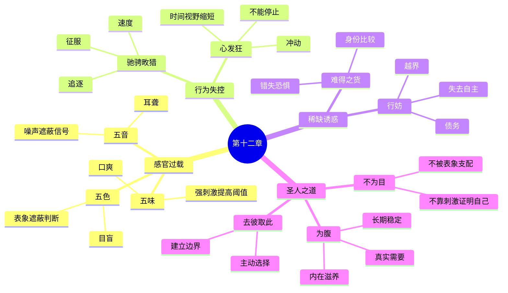

# 《道德经》第十二章：五色令人目盲，五音令人耳聋

> 第十一章讨论“有”与“无”的配合：结构提供条件，空位提供用途。第十二章把视线转向人的感官、欲望与注意力。老子并不反对颜色、音乐、美味、运动或财富本身，而是警告：当刺激不断升级、欲望失去尺度、外部对象持续争夺注意力时，原本帮助我们认识世界的感官，反而会变得迟钝；原本服务生命的资源，反而会支配生命。全章最终落到“为腹不为目”：以真实需要、内在稳定和长期生命为中心，而不是让眼前刺激、比较欲和稀缺幻觉决定行动。

## 一、原文

> 五色令人目盲；
>
> 五音令人耳聋；
>
> 五味令人口爽；
>
> 驰骋畋猎，令人心发狂；
>
> 难得之货，令人行妨。
>
> 是以圣人为腹不为目，故去彼取此。

## 二、白话翻译

缤纷耀眼的色彩如果被过度追逐，会使人的视觉失去真正的分辨能力；繁复强烈的声音如果不断刺激，会使人的听觉变得迟钝；浓烈多变的滋味如果没有节制，会使人的味觉失去正常判断。

纵马奔驰、沉迷围猎一类追求强烈兴奋的活动，会使人的内心躁动失控；稀有昂贵的物品，会诱发争夺、攀比和越界行为，妨碍人走正当而安稳的道路。

因此，圣人重视能够滋养生命的实际需要，而不把人生交给外在刺激和视觉欲望；所以舍弃那种使人被欲望牵引的生活方式，选择朴实、稳定、真正有益于生命的道路。

## 三、全章结构：从感官过载到价值选择

本章的论证可以分成三层：

```text
第一层：感官刺激
五色、五音、五味
        ↓
过度刺激使感官失去分辨能力

第二层：行为刺激
驰骋畋猎、追逐难得之货
        ↓
兴奋升级、攀比争夺、行为越界

第三层：价值选择
为腹不为目
        ↓
从外部刺激中心转向生命需要中心
```

老子先说感官，再说行动，最后说价值原则。问题的发展路径是：

1. 外界刺激越来越强；
2. 感官逐渐适应并变得迟钝；
3. 人需要更强刺激才能获得同样满足；
4. 兴奋与欲望开始支配行动；
5. 行动偏离真实需要和长期利益；
6. 人看似拥有更多，实际却失去自主。

因此，本章不是一份简单的禁欲清单，而是一套关于**刺激、适应、欲望、注意力和自主性**的完整诊断。

## 四、关键词辨析

### 1. “五色”

“五色”通常指青、赤、黄、白、黑，也可以泛指绚丽多样的视觉对象。老子不是说颜色本身有害，而是借“五色”象征被设计来吸引、占据和刺激目光的一切外在景象。

当视觉世界越来越华丽时，人可能出现两种相反结果：

- 看见的东西更多；
- 真正看清的东西更少。

“看见”只是感官接收，“看清”则需要判断、比较、停顿和理解。过度刺激会让目光不断移动，却不给心智留下形成认识的时间。

### 2. “目盲”

“目盲”不必只按生理失明理解。这里更接近：

- 被耀眼表象遮蔽；
- 失去细微分辨；
- 只追逐显眼之物；
- 无法看见普通事物的价值；
- 把注意力交给外界操控。

一个人可以视力正常，却在价值判断上“目盲”：只看价格，不看用途；只看流量，不看内容；只看短期涨幅，不看长期风险；只看别人展示的生活，不看自己的真实处境。

### 3. “五音”

“五音”通常指宫、商、角、徵、羽，也泛指丰富多变的声音和音乐。音乐本来可以调和情绪、形成秩序，但当声音持续、强烈、密集，听觉便可能失去安静和辨别细节的能力。

“耳聋”的深意包括：

- 听不见微弱信号；
- 听不进不同意见；
- 不能忍受沉默；
- 只对强烈声音有反应；
- 把响亮误认为重要。

### 4. “五味”与“口爽”

“五味”通常指酸、苦、甘、辛、咸。“爽”在现代汉语里常表示舒服痛快，但在这里不宜按“爽快”理解。古义更接近差失、败坏、失去正常功能。

“口爽”可以理解为味觉被浓烈滋味扰乱，以至于：

- 清淡食物变得无味；
- 需要更重口味才能满足；
- 饱腹之后仍继续追求刺激；
- 把味觉快感误当成身体需要。

老子指出的是感官适应的悖论：刺激越浓，感受不一定越丰富，反而可能越来越粗糙。

### 5. “驰骋畋猎”

“驰骋”是纵马快速奔驰；“畋猎”是田猎、围猎。在古代，狩猎既可能是生存活动，也可能是贵族军事训练和炫耀性娱乐。本章所批评的重点，是沉迷速度、追逐、征服和强烈兴奋。

它象征一类行为模式：

- 必须不断寻找更大场面；
- 以速度压过思考；
- 以竞争制造自我价值；
- 以征服感掩盖内心空虚；
- 以危险和刺激确认“我还活着”。

### 6. “心发狂”

“狂”不是简单指精神疾病，而是心神失去常度、欲望被兴奋推高、判断被速度压制。

其表现可能是：

- 冲动增加；
- 风险感下降；
- 不能等待；
- 把强烈感觉当成正确判断；
- 把不停行动当成生命充实。

“心发狂”的核心不是活动本身，而是心被活动牵着走，无法自主停止。

### 7. “难得之货”

“难得之货”指稀少、珍贵、昂贵、难以取得的物品。它的危险不只在于价格高，而在于稀缺性会被转化为身份、权力和比较优势。

一件物品可能同时具有三种价值：

| 价值类型 | 含义 | 例子 |
|---|---|---|
| 使用价值 | 实际解决什么问题 | 衣服保暖、工具工作 |
| 审美价值 | 带来形式与文化体验 | 工艺、设计、艺术 |
| 地位价值 | 用来区分人与人 | 限量、稀缺、炫耀 |

老子主要警惕第三种价值无限扩张。当物品的主要作用从“使用”变成“证明我高于别人”，竞争就很难停止。

### 8. “行妨”

“妨”有阻碍、损害之意。“令人行妨”可以理解为珍稀之物诱导人越过正当边界，使行为受阻、受害或偏离正路。

它可能表现为：

- 为获得物品而负担过度债务；
- 为保持地位而牺牲诚信；
- 因攀比破坏关系；
- 因投机放弃风险边界；
- 因占有欲失去自由。

真正妨碍人的，往往不是物品本身，而是物品被赋予了过量的自我价值。

### 9. “为腹不为目”

“腹”首先关联饮食和生命的基本供养，也可以引申为内在、实质、根本需要；“目”关联视觉吸引、外在表象和不断追逐。

“为腹不为目”不是说人只要吃饱，不需要审美；也不是贬低眼睛。它是在区分两种生活中心：

| 为腹 | 为目 |
|---|---|
| 满足真实需要 | 追逐可见刺激 |
| 重视内在稳定 | 重视外部展示 |
| 以够用为尺度 | 以比较为尺度 |
| 关注长期滋养 | 关注即时兴奋 |
| 自己决定节奏 | 被对象牵引节奏 |

“腹”代表生命需要，“目”代表欲望窗口。圣人不是摧毁欲望，而是不让欲望取得统治权。

### 10. “去彼取此”

“彼”是前文描述的感官过载、兴奋追逐和稀缺崇拜；“此”是朴实、适度、内在充足和生命优先。

“去彼取此”表明老子并非停留在抽象批评，而是要求做出选择。哲学若不能转化为注意力分配、消费方式、行动节奏和价值排序，就仍然只是观念。

## 五、第一层警告：感官越忙，认识可能越弱

### 1. 感官不是无限容量的窗口

人容易把感官理解成被动接收器：颜色越多，获得的信息越多；声音越多，体验越丰富；味道越浓，享受越充分。

但感官并非无限容量。刺激之间会竞争注意力，强刺激会遮蔽弱刺激，新刺激会覆盖旧刺激。结果可能是：

```text
信息增加 ≠ 理解增加
刺激增加 ≠ 感受增加
选择增加 ≠ 自由增加
```

当刺激超过处理能力时，心智会依赖更快、更粗糙的判断：显眼等于重要，流行等于正确，昂贵等于优质，紧急等于必须处理。

### 2. 强刺激会提高感受阈值

人对重复刺激会逐渐适应。第一次令人兴奋的事，重复之后会变得普通，于是人倾向寻找更强、更新、更快的版本。

这会形成循环：

```text
获得刺激
   ↓
短暂兴奋
   ↓
逐渐适应
   ↓
原有刺激失效
   ↓
寻找更强刺激
```

循环的问题不在于快乐，而在于快乐越来越依赖升级。当满足只能来自升级，生活便从享受事物变成追逐下一个刺激。

### 3. 分辨力比刺激量更重要

真正成熟的感官，不是需要越来越强烈的输入，而是能够分辨越来越细微的差异：

- 能在安静中听见层次；
- 能在清淡中品出本味；
- 能在朴素中看见结构；
- 能在缓慢中察觉变化；
- 能在普通生活中感受充实。

所以，老子的目标不是把感官关掉，而是把感官从刺激依赖中解放出来。

## 六、第二层警告：兴奋会伪装成意义

### 1. “驰骋”为什么令人难以停下

速度会压缩反思时间。人在高速运动、激烈竞争或连续决策中，容易获得一种“我正在做重要事情”的感觉。

然而，忙碌、速度和重要性不是同一回事：

- 快速回复不等于问题解决；
- 交易频繁不等于投资成功；
- 会议密集不等于组织有效；
- 行程丰富不等于体验深刻；
- 情绪强烈不等于关系真实。

速度的危险，是让人没有机会问：“我为什么要继续？”

### 2. “畋猎”中的追逐结构

狩猎的兴奋来自目标出现、追逐、接近、捕获。现代生活中许多系统也采用相似结构：

```text
发现目标 → 产生期待 → 追逐目标 → 获得奖励 → 寻找新目标
```

购物、游戏、短视频、热点新闻、市场交易、排行榜和社交反馈，都可能把人放入连续追逐模式。

问题不是所有奖励都不好，而是当整个生活被设计成“下一个目标”，现在这一刻就永远只是通往下一次奖励的过渡。

### 3. 竞争容易把手段变成身份

适度竞争可以激发能力，但沉迷竞争会让“赢”变成自我存在的证明。此时，目标不再是做好事情，而是不能输给别人。

于是会出现：

- 明知不需要仍要购买；
- 明知风险过高仍要加码；
- 明知精疲力竭仍不肯停止；
- 明知关系受损仍要证明正确；
- 明知已经足够仍要继续占有。

“心发狂”就是尺度被竞争夺走。

## 七、第三层警告：稀缺物品如何控制行为

### 1. 稀缺会制造注意力放大

越是标明“限量”“唯一”“即将售罄”，越容易让人暂时停止比较真实价值。稀缺信息会把问题从“我需要吗”改写成“我会不会错过”。

两个问题看似相近，实际完全不同：

- “我需要吗？”以自身需要为中心；
- “我会不会错过？”以外部稀缺为中心。

一旦决策中心转移，行动就更容易被他人设计。

### 2. 地位商品没有自然终点

基本需要通常有饱和点：吃饱、保暖、住所安全之后，边际改善会下降。但地位比较没有固定终点，因为比较对象会不断变化。

```text
使用需要：达到够用 → 可以停止
地位需要：超过一人 → 又出现另一人
```

所以，若消费主要服务比较，收入增加也未必带来自由，反而可能扩大维持身份的成本。

### 3. 占有越多，自主未必越多

物品带来能力，也带来维护、保险、存放、选择和担忧。资源越多，管理复杂度越高。

一个重要判断是：

> 这件东西是在为我服务，还是我开始为它服务？

当拥有某物要求持续牺牲时间、诚信、健康或财务安全时，“难得之货”便开始“令人行妨”。

## 八、“为腹不为目”：需要与欲望的治理

### 1. 需要不是最低限度，而是生命真实

“为腹”常被误解为只求温饱、拒绝文明。更准确的理解是：把生命的真实需要放在决策中心。

真实需要包括：

- 身体健康；
- 安全与休息；
- 有意义的工作；
- 稳定关系；
- 学习和创造；
- 可承受的财务结构；
- 内心不被持续刺激占领。

这些需要并不低级。它们恰恰构成长期自由的基础。

### 2. 欲望不是敌人，但需要被排序

老子没有要求彻底消灭欲望。完全没有愿望，人也无法行动。问题在于欲望之间需要层级：

```text
底层：生存、安全、健康
中层：关系、能力、创造
高层：意义、责任、超越
外层诱惑：炫耀、攀比、即时刺激
```

外层诱惑并非永远不能享受，但不应反过来破坏底层和中层需要。

例如，为炫耀消费而背负不可承受债务，就是“目”损害“腹”；为了短期市场刺激而破坏退休计划，也是“目”损害“腹”。

### 3. “够”是一种主动判断

“够”不是贫乏，也不是无奈，而是经过判断后确定边界：

- 这个功能已经满足；
- 这个收益不值得额外风险；
- 这个信息不会改善决策；
- 这个物品不会增加真实生活质量；
- 这个任务不值得占用更多生命时间。

不会判断“够”，就无法真正拥有“多”。因为任何数量都会迅速变成新的起点。

## 九、老子不是反审美、反音乐、反美食

### 1. 批评的是失去尺度，不是感官本身

若把本章读成“颜色有害、音乐有害、美食有害”，就会把老子的关系思维变成机械禁令。

本章真正区分的是：

| 有尺度的体验 | 无尺度的追逐 |
|---|---|
| 欣赏色彩 | 被视觉奇观控制 |
| 聆听音乐 | 不能忍受安静 |
| 品尝食物 | 依赖不断加重口味 |
| 参与运动 | 沉迷危险与征服 |
| 使用财富 | 用财富证明身份 |

老子反对的不是丰富，而是丰富失去中心；不是享受，而是享受变成依赖。

### 2. 简朴不等于粗糙

简朴不是把生活变得丑陋、单调，而是去除不必要的刺激，使真正重要的部分更清楚。

一段好的音乐需要停顿；一幅好的画需要留白；一道好菜需要本味；一个好房间需要空间；一个好人生也需要不被填满的时间。

第十一章的“无之以为用”与第十二章的“为腹不为目”在这里相接：

- 第十一章要求给空间留空；
- 第十二章要求给感官降噪；
- 前者防止物理系统被填满；
- 后者防止心理系统被填满。

## 十、心理学视角：注意力为何会被劫持

### 1. 注意力是有限资源

人在同一时间只能深度处理少量对象。每一个通知、广告、标题、价格波动和社交反馈，都在争夺同一份注意力。

当注意力不断切换时，常见后果包括：

- 理解停留在表面；
- 工作记忆负担增加；
- 情绪更易波动；
- 决策更依赖直觉；
- 长期目标更难保持。

所以，注意力管理不是效率技巧，而是自我治理。

### 2. 新奇性会制造短期奖励

新信息比旧信息更容易吸引注意。平台、媒体和商业系统因此不断提供“最新”“突发”“猜你喜欢”。

新奇本身并不等于价值。可以用三个问题过滤：

1. 这条信息会改变我的决策吗？
2. 它与我的长期目标有关吗？
3. 一周后我还会认为它重要吗？

若答案都是否定的，它可能只是“五色”中的又一道闪光。

### 3. 情绪唤醒会缩短时间视野

强烈兴奋、愤怒、恐惧和贪婪，会让人更关注立即行动，较少考虑长期后果。

因此，在“心发狂”状态下，最重要的不是做出更聪明的决定，而是延迟决定：

- 不在极度兴奋时加码；
- 不在愤怒时发送重要信息；
- 不在恐惧时清空长期资产；
- 不在稀缺倒计时下做大额购买。

恢复时间尺度，本身就是恢复理性。

## 十一、注意力经济：现代“五色五音”

### 1. 现代系统争夺的不是眼球，而是行为

许多数字产品表面提供内容，实际竞争的是停留时间、点击率、交易频率和购买转化。

它们常用的机制包括：

- 无限滚动；
- 自动播放；
- 红色通知标记；
- 个性化推荐；
- 热点排行；
- 限时优惠；
- 变动奖励；
- 社交比较数字。

这些机制并不一定恶意，但其目标通常不是帮助用户适时停止。因此，停止必须由用户主动设计。

### 2. 信息丰富可能造成判断贫困

当信息无限时，稀缺的就不再是资料，而是：

- 可信来源；
- 连续阅读时间；
- 形成判断的安静；
- 放弃无关信息的能力。

现代人的“目盲”常不是因为看不到，而是因为看到太多，无法形成优先级。

### 3. 数字节制不是拒绝技术

更合理的做法不是彻底离线，而是把技术重新变成工具：

- 关闭非必要通知；
- 规定信息检查时间；
- 把高价值内容放在主动搜索中；
- 不让推荐流决定全部阅读；
- 在重要工作时使用单任务环境；
- 给一天保留无输入时段。

这就是数字时代的“为腹不为目”：让工具服务真实任务，而不是让注意力服务平台目标。

## 十二、管理与组织：不要用刺激代替治理

### 1. 指标越多，不代表管理越清楚

组织容易用仪表盘、排行榜、警报和实时数字制造“可见性”。但可见性过多也会产生噪声。

如果每个指标都显示为紧急，真正关键的信号就会消失。管理者需要区分：

- 结果指标与过程指标；
- 异常信号与正常波动；
- 可行动信息与装饰性信息；
- 长期能力与短期表现。

“五色令人目盲”在组织中，就是仪表盘越来越华丽，实际判断越来越依赖表面数字。

### 2. 激励过强会扭曲行为

奖金、排名、竞赛可以提高短期产出，但若单一指标奖励过强，员工会围绕指标优化，甚至牺牲无法量化的价值。

例如：

- 只奖励销售额，可能增加不合适销售；
- 只奖励代码数量，可能降低可维护性；
- 只奖励响应速度，可能牺牲问题解决质量；
- 只奖励季度利润，可能透支长期研发。

激励如同“五味”：适量可以调动行为，过量则会“口爽”，使组织失去综合判断。

### 3. 优秀领导者降低不必要兴奋

成熟领导并不靠持续制造危机感来证明存在，而是：

- 让优先级稳定；
- 让团队知道什么可以忽略；
- 降低无意义汇报；
- 对正常波动保持镇定；
- 在真正异常时才升级响应。

组织若长期处于高唤醒状态，短期看起来充满战斗力，长期则会疲劳、麻木并失去真实警报能力。

## 十三、软件与系统架构：从告警风暴到可观测性

### 1. 数据越多，不等于可观测性越强

系统可以生成海量日志、指标和追踪信息，但若没有清楚层级，工程师会在异常时被信息淹没。

```text
遥测数量增加
      ↓
噪声增加
      ↓
关键异常被遮蔽
      ↓
响应者注意力分散
      ↓
平均修复时间上升
```

这正是技术系统中的“五色令人目盲、五音令人耳聋”。

### 2. 告警必须对应行动

一个实用原则是：每个高优先级告警都应回答：

1. 发生了什么？
2. 对用户有什么影响？
3. 谁负责处理？
4. 接下来应做什么？
5. 若暂不处理会怎样？

不能触发明确行动的告警，应降级、聚合或移除。否则，长期误报会训练团队忽略真正危险。

### 3. 界面设计应帮助用户完成任务

产品界面若不断使用弹窗、徽标、动画、推荐和促销，可能提高短期互动，却损害长期信任。

“为腹不为目”的产品设计意味着：

- 首先解决用户核心任务；
- 把重要信息置于清楚层级；
- 不用视觉刺激掩盖功能不足；
- 让用户容易停止、退出和关闭；
- 不把注意力消耗当成唯一成功指标。

真正好的界面不是让用户一直看，而是让用户顺利完成事情。

## 十四、投资：市场如何令人“心发狂”

### 1. 价格跳动是金融世界的“五色”

实时行情、涨跌颜色、新闻标题、分析师目标价和社交媒体观点，会把长期资产变成连续刺激源。

投资者容易从“企业长期创造什么价值”转向“下一分钟价格会怎样”。一旦时间尺度缩短，波动就会被误认为信息。

### 2. 热门资产具有“难得之货”的结构

当某项资产被描述为稀缺、唯一、错过不再时，人更容易忽略估值、仓位和流动性。

判断一项投资，不应只问“它是否优秀”，还要问：

- 当前价格包含了多少乐观预期？
- 仓位失败时能否承受？
- 资产与现有组合是否高度相关？
- 是否因为别人获利而急于进入？
- 投资逻辑是否需要不断上涨才能成立？

优秀资产也可能在错误价格上成为“难得之货”的陷阱。

### 3. 高频关注会诱发高频行动

每天查看多次账户，并不会自动提高收益，却会增加被短期波动触发的机会。

可以建立“为腹”的投资结构：

- 先明确退休、现金流和风险承受目标；
- 用核心资产承担长期增长；
- 用仓位上限限制主题投资；
- 保留流动性与再平衡规则；
- 按计划复核，而非按情绪交易；
- 把“睡得着”视为组合质量的一部分。

投资的核心不是获得最多刺激，而是在可承受风险下实现长期目标。

## 十五、消费与财富：从拥有更多到需要更少证明

### 1. 购买前区分四种动机

在购买非必需品前，可以问：

1. **功能动机**：它解决什么实际问题？
2. **体验动机**：它会带来持续体验还是短暂兴奋？
3. **身份动机**：我是否希望借它证明自己？
4. **情绪动机**：我是否正在用购买缓解焦虑、无聊或失落？

同一件物品可能同时包含四种动机。看清动机，不等于禁止购买，而是恢复选择权。

### 2. 总成本不仅是价格

一件物品的真实成本包括：

```text
购买价格
+ 维护成本
+ 存放空间
+ 学习时间
+ 选择负担
+ 升级诱惑
+ 机会成本
```

当总成本超过实际使用价值，物品就可能从资产变成负担。

### 3. 财富自由包含“不必展示”

真正的财务自由，不只是有能力购买，也包括有能力不购买；不只是拥有稀缺物，也包括不需要借物品证明身份。

“为腹不为目”不是贫穷哲学，而是一种更高层次的财富观：资源服务生命，生命不服务展示。

## 十六、教育：保护孩子的感受力与延迟满足

### 1. 过度安排也可能是“五色”

课程、活动、比赛和设备越多，不一定等于成长越充分。若孩子的时间被持续安排，可能缺少：

- 自主游戏；
- 无聊后产生创造；
- 深度专注；
- 与身体节奏连接；
- 形成自己兴趣的空间。

教育不是不断增加刺激，而是帮助孩子形成选择、坚持和分辨能力。

### 2. 奖励不能替代兴趣

如果每项学习都依赖即时奖励，孩子可能逐渐只为奖励行动。适当鼓励有必要，但还应让他体验：

- 做懂一件事本身的满足；
- 长期练习后的能力增长；
- 对问题的真实好奇；
- 不被排名定义的自我价值。

### 3. 延迟满足不是压抑

延迟满足的本质，是让较小的即时欲望服从较大的长期目标。它需要的不是羞耻，而是清楚选择：

> 我不是不能要，而是决定在更合适的时间、以更合适的方式要。

这正是“去彼取此”的主动性。

## 十七、家庭与关系：不要把爱变成展示

### 1. 关系中的“五色”

社交平台让人更容易比较旅行、住房、礼物、庆祝方式和孩子成绩。关系因此可能从共同生活变成共同展示。

当“看起来幸福”压过“真实相处”，家庭就会为目而不为腹。

### 2. 强烈情绪不等于深厚感情

争吵、戏剧化和反复和好会制造强烈体验，但稳定、尊重、可靠和长期照顾通常更能滋养关系。

健康关系的价值常存在于不显眼之处：

- 守约；
- 倾听；
- 日常分担；
- 尊重边界；
- 在困难时保持可靠。

这些不一定“好看”，却真正“养腹”。

### 3. 给关系留出低刺激时间

共同散步、做饭、安静阅读、没有设备的谈话，看似平淡，却能恢复细微感受。关系若只在旅行、宴会和重大事件中才有内容，日常就容易显得空洞。

## 十八、个人修养：如何恢复感官与心的主权

### 1. 练习“减弱刺激”而非“消灭快乐”

可以有意识地安排低刺激时段：

- 一餐吃得简单，重新感受食材本味；
- 一段路不听任何内容，观察环境；
- 一小时关闭通知，完成单一任务；
- 一天不看账户价格；
- 一次购物延迟二十四小时；
- 一次谈话不急着给答案。

目标不是惩罚自己，而是降低阈值，恢复感受力。

### 2. 建立“刺激审计”

每周可以检查：

| 领域 | 主要刺激源 | 它带来什么 | 它拿走什么 |
|---|---|---|---|
| 手机 | 通知、短视频 | 新鲜感 | 专注时间 |
| 工作 | 会议、告警 | 参与感 | 深度思考 |
| 投资 | 实时行情 | 控制感 | 情绪稳定 |
| 消费 | 推荐与促销 | 短暂期待 | 财务余量 |
| 社交 | 比较与展示 | 归属感 | 自我满足 |

审计的目的，是找出哪些刺激真正服务生命，哪些只是占用生命。

### 3. 在行动前加入停顿

一个简单实践是“四问停顿”：

1. 我现在真正需要什么？
2. 是什么刺激触发了我？
3. 这件事的短期奖励是什么？
4. 它会不会损害长期目标？

停顿几分钟，就可能把“心发狂”的自动反应转化为有意识选择。

## 十九、三种常见误读

### 误读一：老子主张禁欲

老子反对的是欲望失去尺度，不是所有欲望。吃饭、审美、音乐、游戏、财富都可以成为生活组成部分，只要它们不夺取主导权。

### 误读二：清淡等于没有追求

“为腹”并非降低一切目标，而是把目标建立在真实生命和长期秩序上。一个人可以有雄心，但不必靠持续刺激和外部比较维持雄心。

### 误读三：只要减少物品就能获得自由

物品少不自动等于内心自由。一个人即使生活简朴，也可能强烈执着于名声、正确、道德优越或他人认可。

真正需要减少的，是被对象控制的程度，而不只是对象数量。

## 二十、与前后章节的关系

### 1. 与第九章“持而盈之”的关系

第九章讨论不断填满、不断磨锐的风险；第十二章说明刺激不断加码，同样会让感官和心失去正常功能。

二者共同指出：

> 超过适当尺度之后，增加可能转化为损害。

### 2. 与第十一章“有之以为利，无之以为用”的关系

第十一章讲外部空间需要留空；第十二章讲内部注意力需要留白。

- 房间被物品填满，就难以居住；
- 日程被任务填满，就难以应变；
- 感官被刺激填满，就难以分辨；
- 心被欲望填满，就难以自主。

### 3. 与第十三章“宠辱若惊”的关系

第十二章关注物与刺激如何控制人；第十三章将进一步讨论评价、荣辱和患得患失如何控制人。

从第十二章到第十三章，老子的分析由“我追逐什么”推进到“我害怕别人如何看我”。前者是物欲治理，后者是身份治理。

## 二十一、现代案例分析

### 案例一：不断刷新市场行情

某投资者原本制定了五年以上计划，但每天多次查看价格。上涨时害怕错过而追买，下跌时害怕继续亏损而卖出。长期目标没有变化，行动却被屏幕颜色持续改变。

**问题本质**：五色令人目盲，价格刺激遮蔽企业价值和组合目标。

**改进方式**：降低查看频率，提前制定再平衡条件，以仓位和估值规则替代即时情绪。

### 案例二：告警太多的生产系统

某团队每天收到大量低价值告警，久而久之形成麻木。真正严重故障出现时，工程师仍把它当作普通噪声。

**问题本质**：五音令人耳聋，过量信号破坏警报功能。

**改进方式**：删除不可行动告警，按用户影响分级，聚合同类事件，并为高等级告警建立明确响应手册。

### 案例三：消费升级停不下来

一个家庭收入逐年提高，但住房、汽车、旅行和社交支出同步升级，储蓄率没有改善，压力反而增加。

**问题本质**：难得之货令人行妨，地位消费把收入增长转化为固定负担。

**改进方式**：先确定家庭长期目标与安全边际，再决定可自由消费额度；用真实使用频率而非他人标准评价购买。

### 案例四：学习内容过多却没有积累

某人订阅大量课程、播客和资讯，每天接触很多新观点，却很少做笔记、练习和复盘。

**问题本质**：信息摄入取代了知识形成。

**改进方式**：减少输入渠道，围绕少数主题连续学习；每次输入后安排输出、实践和回顾。

## 二十二、实践框架：从“为目”转向“为腹”

### 第一步：识别真实需要

写下当前最重要的五项长期需要，例如健康、家庭、专业能力、财务安全、精神安定。

### 第二步：识别高刺激来源

列出最容易让自己失去时间和尺度的对象，例如短视频、市场行情、购物推荐、工作通知或社交比较。

### 第三步：建立边界

边界必须具体：

- 何时看；
- 看多久；
- 花多少；
- 仓位多大；
- 什么情况下停止；
- 谁可以打断规则。

### 第四步：恢复低刺激能力

每周安排无屏幕散步、简单饮食、单任务工作、安静阅读或不消费日。低刺激能力越强，外部诱惑的控制力越弱。

### 第五步：按长期结果复盘

不要只问“当时爽不爽”，而要问：

- 它是否改善了睡眠？
- 是否提高了专注？
- 是否增进了关系？
- 是否增强了财务安全？
- 是否让行动更接近长期目标？

这就是从即时感受转向生命结果。

## 二十三、本章思维导图



## 二十四、反思问题

1. 我生活中最强的“五色”“五音”和“五味”分别是什么？
2. 哪些活动结束后让我更安定，哪些活动结束后让我还想要更强刺激？
3. 我最近一次冲动购买、追涨或情绪行动，是被什么触发的？
4. 我有哪些消费主要满足使用价值，哪些主要满足身份比较？
5. 我的日程、手机、工作系统和投资账户中，哪些信息其实不会改善决策？
6. 我是否还能享受清淡、安静、缓慢和普通？
7. 对我而言，“为腹”最重要的三项长期需要是什么？
8. 有什么东西表面增加了拥有，实际减少了自由？
9. 我可以在哪一个领域建立明确的“够”的标准？
10. 本周我能删除哪一种不必要刺激，而不是再增加一种自律任务？

## 二十五、七日实践计划

### 第一天：通知清理

关闭所有不需要立即处理的通知，只保留真正影响安全、家人或关键工作的项目。

### 第二天：单一饮食体验

选择一餐不过度调味，慢慢吃，观察自己是否还能感受食物本身的味道和饱腹信号。

### 第三天：无输入散步

散步二十至三十分钟，不听音乐、播客或电话，让感官重新接触环境中的细微信息。

### 第四天：购物延迟

所有非必需购买延迟二十四小时，并写下功能、总成本与购买动机。

### 第五天：信息断流

设定连续九十分钟不看消息、新闻或行情，完成一个需要深度思考的任务。

### 第六天：低刺激陪伴

与家人进行一项不以消费和拍照为中心的活动，例如散步、做饭或长谈。

### 第七天：需要复盘

回顾一周，写下三件真正滋养生命的事，以及三件只制造短暂兴奋的事。下一周保留前者，减少后者。

## 二十六、参考与延伸阅读

### 经典文本

1. 王弼注《老子道德经注》。
2. 河上公章句《老子道德经章句》。
3. 帛书《老子》甲本、乙本相关校勘资料。
4. 郭店楚简《老子》相关研究资料。

### 延伸主题

- 感官适应与刺激阈值；
- 注意力经济与数字产品设计；
- 稀缺心理与错失恐惧；
- 行为激励与指标异化；
- 消费社会中的身份竞争；
- 投资中的过度交易与情绪决策；
- 简朴生活、留白与内在自由。

> 不同传本在个别用字、断句和次序上可能存在差异。本章采用通行本章句，并将重点放在全章思想结构，而不把单一字词解释视为唯一结论。

## 二十七、章节总结

第十二章揭示了一个容易被忽略的反常识：感官刺激越多，感受力未必越强；选择越多，自主性未必越大；物品越稀缺，价值未必越真实；行动越兴奋，人生未必越有意义。

“五色”“五音”“五味”代表外界对感官的持续占领；“驰骋畋猎”代表对速度、竞争和强烈体验的沉迷；“难得之货”代表稀缺、身份和比较对行为的控制。它们共同把人从真实需要带向无尽追逐，使眼、耳、口、心和行动逐渐失去正常尺度。

老子给出的答案不是关闭感官、拒绝文明或消灭欲望，而是“为腹不为目”：让外在资源服务内在生命，让审美服务感受，让技术服务任务，让财富服务安全与创造，让行动服务长期目标。

本章最重要的现代提醒可以概括为：

> **不要把刺激误认为丰富，不要把兴奋误认为意义，不要把稀缺误认为价值。真正的自由，不是拥有无限对象，而是仍能决定什么值得进入自己的眼、耳、口、心与人生。**
