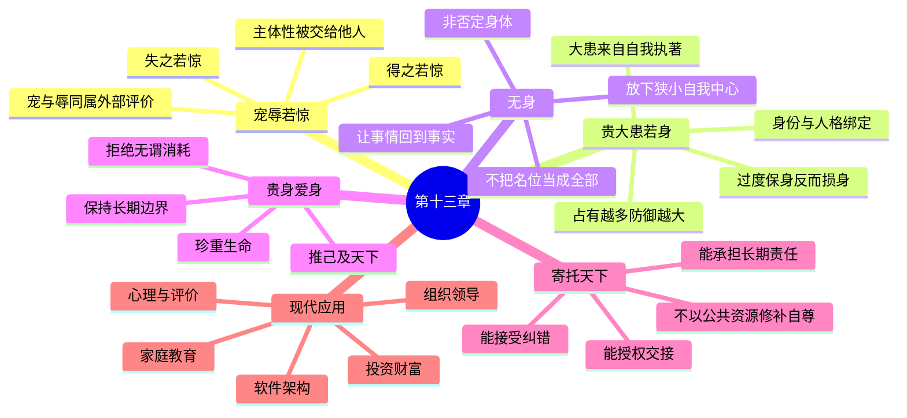

# 《道德经》第十三章：宠辱若惊，贵大患若身

> 第十二章讨论感官刺激如何夺走人的判断与自主，第十三章进一步追问：当一个人的自我价值依赖外部评价、职位宠信、成败得失与身份高低时，为什么“得宠”也会像“受辱”一样令人不安？老子并不否定身体、生命或社会责任，而是要人摆脱对狭小自我的过度执著，既不拿荣宠交换自身，也不因保护私利而忘记天下。全章从“宠辱若惊”进入“吾所以有大患者，为吾有身”，最后落在“贵以身为天下、爱以身为天下”：真正能承担公共责任的人，首先懂得生命不可被权力、名位和欲望随意消耗。

## 一、原文

> 宠辱若惊，贵大患若身。
>
> 何谓宠辱若惊？
>
> 宠为下，得之若惊，失之若惊，是谓宠辱若惊。
>
> 何谓贵大患若身？
>
> 吾所以有大患者，为吾有身；及吾无身，吾有何患？
>
> 故贵以身为天下，若可寄天下；爱以身为天下，若可托天下。

## 二、白话翻译

受到宠爱与遭受屈辱，都会使人心神震动；应当像重视自身一样，认真看待由身份、欲望与自我执著带来的重大祸患。

为什么说宠爱与屈辱都会使人惊惧？因为受宠本身意味着把自己的价值放在别人手中，处于依附和不自主的位置。得到宠爱时，担心不能长久；失去宠爱时，又害怕地位下降，因此无论得到还是失去，内心都不得安宁。

为什么说要像重视自身一样看待大患？我之所以会被许多祸患牢牢困住，是因为把这个有限的“我”看得过重，把身体、身份、名誉、得失都当成必须守住的私人所有。假如不再执著于狭小的自我中心，又有什么外在得失能够完全支配我呢？

所以，真正珍重生命，并愿意把生命用于天下的人，天下才可以寄予他；真正爱护生命，也能像爱护自身一样爱护天下的人，天下才可以托付给他。

## 三、全章结构：从外部评价到公共责任

本章可以分为三层：

```text
第一层：宠辱若惊
外部评价进入内心
        ↓
得到怕失去，失去怕下降
        ↓
人被名位与他人的眼光控制

第二层：贵大患若身
大患不仅来自外界，也来自自我执著
        ↓
把身体、身份、利益绝对化
        ↓
一切变化都被体验为威胁

第三层：贵身、爱身而任天下
不轻贱生命，也不把生命只用于私利
        ↓
能守住边界，又能超越自我中心
        ↓
才有资格承担公共责任
```

这三层形成一个完整的思想转折：

1. 先看见人为什么被评价体系牵动；
2. 再看见评价焦虑背后的自我执著；
3. 最后把“保全自己”提升为“承担天下”。

因此，本章既不是教人逃离社会，也不是鼓励消灭自我，而是要求建立一种更稳固的主体性：**不因荣宠而失去自己，不因私我而拒绝责任。**

## 四、文本与关键词辨析

### 1. “宠辱”

“宠”是被上位者喜爱、赏识、提拔或优待；“辱”是被贬低、排斥、羞辱或降位。在等级社会里，宠与辱看似相反，实际上都依赖同一套外部权力结构：

- 宠，是别人把你抬高；
- 辱，是别人把你压低；
- 两者都把价值判断权交给外部。

如果一个人必须靠他人的认可确认自身价值，那么宠与辱虽然方向相反，却会产生相似的心理结果：警觉、焦虑、猜测和不稳定。

### 2. “若惊”

“惊”不是普通的高兴或失望，而是内在秩序被突然撼动。其核心不是事件有多大，而是心缺少稳定的尺度。

“若惊”可能表现为：

- 得到表扬后急于证明自己配得上；
- 获得职位后害怕被替代；
- 受到批评后把一次失败理解为整体否定；
- 因流量、排名、奖金或股价波动改变自我判断；
- 不断猜测掌权者、客户、同事或公众的态度。

真正的问题不是人有情绪，而是情绪的开关完全掌握在外界手中。

### 3. “宠为下”

通行本多作“宠为下”，但古本中也有“辱为下”或“宠为上，辱为下”等异文。无论采用哪一种校读，本章的中心都不是简单判断“宠好还是辱坏”，而是揭示：一旦人把上与下、得与失、宠与辱当成自我价值的根基，心便会被外部秩序控制。

按通行本“宠为下”理解，可以有三层意思：

1. **受宠意味着依附**：宠爱来自别人，不由自己掌握；
2. **受宠隐藏着降落风险**：被抬得越高，越害怕失去；
3. **以宠为荣本身就是降低主体性**：用他人的偏爱代替自己的尺度。

因此，“宠为下”并不是否认赞赏的价值，而是提醒：任何依赖他人恩赐的荣耀，都不应成为人格的基础。

### 4. “得之若惊，失之若惊”

一般人以为只有失去才会害怕，老子却把“得到”也列入惊惧之中。

得到之后，常出现新的负担：

- 要维持已有位置；
- 要继续满足给予者的期待；
- 要防止竞争者取代自己；
- 要解释为什么自己值得；
- 要承担失去后的心理落差。

于是，获得不再只是获得，而变成了必须防守的领地。人看似拥有了更多，实际上也可能被拥有之物反过来占有。

### 5. “贵大患若身”

“贵”可以理解为重视、看重；“大患”不是普通麻烦，而是足以损害生命秩序、人格独立和公共责任的根本风险。

这一句至少有两种互补读法：

- **像重视自身一样重视大患**：不要轻视权力、名位和自我执著带来的风险；
- **把大患看作与身体相连的问题**：许多恐惧之所以巨大，是因为人把有限身体和私人身份当成绝对中心。

两种读法共同指向：祸患不仅来自外部事件，也来自人如何理解“我”。

### 6. “吾所以有大患者，为吾有身”

这里的“身”不只指生理身体，也包含围绕身体建立起来的私人自我：我的身份、我的名誉、我的职位、我的财产、我的观点、我的胜负。

老子不是说身体本身错误，更不是要求伤害或否定生命。相反，本章结尾明确要求“贵身”“爱身”。真正需要放下的，是对狭小自我的绝对化：

```text
有身体       ≠ 必然有大患
把身体绝对化  → 一切变化都成为威胁
有身份       ≠ 必然焦虑
把身份当成全部 → 每次评价都像人格审判
```

### 7. “无身”

“无身”不能理解为消灭身体，而应理解为不再被狭小自我中心完全支配。它更接近：

- 不把个人得失视为世界的全部；
- 不把职位、名誉、财富等同于生命价值；
- 不让“我的”遮蔽真实情况；
- 在行动中减少自我表演；
- 能从更大的关系和整体利益思考。

“无身”不是没有人格，而是人格不再被占有欲和防御心封闭。

### 8. “贵以身为天下”

这句话并非鼓励自私保身，而是说：一个人若真正知道生命珍贵，就不会为了短期权力、虚荣或冲动随意消耗自己；同时，他会把对生命的珍重推广到天下。

可以区分两种“贵身”：

| 私我式贵身 | 道家式贵身 |
|---|---|
| 只求个人安全 | 不轻易牺牲任何生命 |
| 逃避一切责任 | 拒绝无谓消耗，承担必要责任 |
| 把利益抓得更紧 | 把生命用于长期公共价值 |
| 害怕失去位置 | 不拿位置交换人格 |

真正的贵身，既有边界，也有担当。

### 9. “爱以身为天下”

“爱身”不是纵容自己，而是理解生命需要养护、节制、休息、诚实和长期秩序。能够善待自己的人，才更可能避免把他人当成耗材。

“爱以身为天下”意味着：

- 以照顾自身的认真程度照顾公共事务；
- 以保护生命的尺度设计制度；
- 不用宏大目标掩盖对具体人的伤害；
- 不把组织、家庭或国家当成满足个人野心的工具。

### 10. “寄天下”与“托天下”

“寄”与“托”都包含交付、委任之意。天下不是奖品，而是责任。老子把能否治理天下的标准，从口号、能力和权势，转向一个更深的问题：

> 这个人会不会为了自己的宠辱得失，牺牲公共利益？

若一个人过度依赖荣宠，他就可能迎合权力；若过度执著私我，他就可能把公共资源变成个人防御工具。只有不被宠辱控制、又真正贵身爱身的人，才可能被长期信任。

## 五、第一重困境：为什么“得宠”也会令人不安

### 1. 宠爱是一种不稳定资产

能力、品格和经验虽然也会变化，但主要可以通过长期实践积累；宠爱则取决于他人的偏好、权力关系和环境变化。

它具有三个特点：

1. **来源在外部**：你不能单方面决定别人继续喜欢你；
2. **规则不透明**：宠爱常混合情感、利益与偶然性；
3. **可被撤回**：今天的偏爱不构成明天的保证。

把自我价值建立在这种资产上，必然导致高波动。

### 2. 地位越高，防守成本可能越大

一个人得到更多关注、职位或财富后，可能产生新的维护任务：

```text
获得位置
   ↓
形成身份认同
   ↓
害怕身份下降
   ↓
增加控制与防御
   ↓
判断开始服务于保位
```

这就是“得之若惊”的深层机制。荣宠并未被真正享用，而被转化为持续警戒。

### 3. 外部认可容易变成无限任务

外部认可没有自然终点。一次成功会提高下一次期待，一次晋升会产生更高位置，一次高回报会诱导更高目标。

若内在没有“够”的尺度，认可就会形成无限升级：

- 已经优秀，还要证明不可替代；
- 已经富足，还要证明领先；
- 已经被喜爱，还要确保永不失宠；
- 已经成功，还要控制别人如何叙述成功。

老子不是反对进步，而是反对把进步变成自我存在的唯一证明。

## 六、第二重困境：大患为何与“身”相连

### 1. 事件本身与自我解释不同

同一件事对不同的人影响不同，关键往往不只在事件，还在它触碰了什么自我认同。

例如，一次项目失败可能被解释为：

- “这个方案需要修正”；
- “我的职业判断全部失败”；
- “别人将不再尊重我”；
- “我的位置可能不保”；
- “我必须立刻证明自己”。

第一种解释针对问题，后几种解释把问题升级为身份危机。大患由此扩大。

### 2. “我的”越多，防御面越大

当人把越来越多对象纳入自我：我的观点、我的团队、我的公司、我的投资、我的孩子、我的声誉，任何对象的变化都可能被体验为“我受到了攻击”。

```text
占有范围扩大
    ↓
自我边界扩大
    ↓
潜在威胁增加
    ↓
控制欲与焦虑上升
```

“无身”就是适度缩小这种虚构的控制边界，让事物回到事物本身。

### 3. 过度保身反而损身

一个人越想绝对避免损失，越可能做出损害长期生命秩序的选择：

- 为保职位长期迎合；
- 为保面子拒绝承认错误；
- 为保资产承担更大集中风险；
- 为保控制权不肯授权；
- 为保形象隐藏真实问题。

这揭示了一个悖论：**把自己抓得过紧，反而更容易失去自己。**

## 七、“无身”与“贵身”是否矛盾

表面看，本章先说“及吾无身，吾有何患”，后说“贵以身”“爱以身”，似乎一边要忘身，一边又要重身。其实两者针对不同层次：

- “无身”针对的是自我执著；
- “贵身、爱身”针对的是生命价值。

可以用三层结构理解：

| 层次 | 应当放下什么 | 应当保存什么 |
|---|---|---|
| 身份层 | 对名位、标签、评价的执著 | 角色中的真实责任 |
| 心理层 | 过度防御、占有与比较 | 稳定、诚实与自主 |
| 生命层 | 把身体当成私欲工具 | 对生命本身的珍重 |

所以，老子不是从爱身走向弃身，而是从**自私地抓住身体**走向**清醒地珍重生命**。

真正的无身，使人不为私欲牺牲原则；真正的贵身，使人不为口号牺牲生命。二者结合，才构成可托天下的人格。

## 八、权力与领导：谁可以被托付

### 1. 最危险的领导者，往往最依赖荣宠

依赖认可的领导者容易出现以下行为：

- 把不同意见当成不忠；
- 用宣传代替真实反馈；
- 追求可见成果，忽略基础治理；
- 把继任者视为威胁；
- 在坏消息出现时惩罚传递者；
- 为维护形象延迟承认风险。

其根源是：组织问题已经与个人宠辱绑定。

### 2. 能承担天下的人，必须区分角色与自我

成熟领导者知道：

```text
职位属于组织，不属于人格
决策可以被批评，人格不必因此崩溃
权力用于处理公共问题，不用于修补自尊
```

当角色与自我被区分，领导者才能：

- 接受数据纠正判断；
- 允许别人比自己更专业；
- 在必要时交接权力；
- 不用组织资源维护个人神话；
- 把长期系统健康置于短期声望之前。

### 3. “贵身”意味着反对无谓牺牲

组织常把过劳包装成忠诚，把缺乏边界包装成担当。道家的贵身提醒管理者：长期消耗员工、依赖英雄式救火、把休息视为软弱，最终会损害组织本身。

好的系统不是要求每个人不断牺牲，而是通过流程、冗余、自动化和清晰责任，减少不必要的牺牲。

## 九、软件架构与工程管理：从“宠辱”到系统可靠性

### 1. 不要让系统依赖个人英雄

如果一个系统只有某位核心开发者能修复，他会得到组织“宠爱”，但这种宠爱同时意味着：

- 他难以休息；
- 团队害怕失去他；
- 知识无法流动；
- 决策缺少复核；
- 系统形成单点故障。

这正是“得之若惊”：被视为不可替代，看似荣耀，实际可能成为束缚。

更健康的做法是：

- 文档化关键知识；
- 建立代码评审和共同所有权；
- 自动化部署与回滚；
- 培养第二负责人；
- 把英雄能力转化为组织能力。

### 2. 不把架构观点等同于自我

资深工程师容易把长期维护的设计视为人格延伸。当新证据出现时，若承认设计需要变化被体验为“我失败了”，技术讨论就会变成身份防御。

“无身”的工程实践是：

- 让事实挑战方案，而不是挑战人格；
- 记录决策当时的条件；
- 接受旧方案在新条件下失效；
- 主动设计可替换、可迁移、可回滚的结构；
- 以系统长期价值高于个人作者身份。

### 3. 可托付的系统必须“贵身”

系统的“身”可以类比为它的核心运行能力。珍重系统，不是拒绝变化，而是不让它为短期指标承受不可逆损伤。

例如：

| 短期荣宠 | 潜在大患 |
|---|---|
| 追求发布速度 | 跳过测试与回滚设计 |
| 追求资源利用率 | 没有容量余量 |
| 追求成本最低 | 形成关键单点依赖 |
| 追求功能数量 | 复杂度失控 |
| 追求管理层好评 | 隐藏真实风险 |

工程上的“宠辱不惊”，就是不因一次成功发布过度自信，也不因一次故障寻找替罪者，而是持续建设可观察、可恢复、可学习的系统。

## 十、投资与财富：不把净值当成自我价值

### 1. 市场评价是一种外部评价

市场价格每天变化，类似不断更新的外部评分。若投资者把净值与人格绑定，就容易出现：

- 上涨时高估能力；
- 下跌时否定自己；
- 因别人获利而追高；
- 因害怕承认错误而拒绝调整；
- 用更大风险恢复受损自尊。

“宠辱若惊”在投资中的表现，就是账户波动直接控制情绪和身份。

### 2. 得之若惊：盈利也会制造风险

亏损会令人恐惧，但大幅盈利同样可能带来危险：

- 把运气误认为稳定能力；
- 提高集中度；
- 放弃估值纪律；
- 扩大杠杆；
- 把未实现收益当作永久财富。

真正成熟的投资者，不只会处理亏损，也会处理成功。

### 3. 贵身高于逐利

财富本应服务生命，而不是要求生命为财富持续焦虑。投资决策需要首先保护：

- 基本生活安全；
- 睡眠与健康；
- 家庭关系；
- 长期选择权；
- 不被迫在坏时点出售的能力。

这不是拒绝收益，而是把收益放回正确位置：资产是工具，不是主人；市场是信息系统，不是人格裁判。

## 十一、心理与日常生活：建立不被评价绑架的自我

### 1. 从“别人怎么看”转向“事情真实吗”

面对表扬或批评，可以依次问：

1. 其中有哪些具体事实？
2. 哪些只是对方的偏好或情绪？
3. 哪些部分值得学习？
4. 即使评价改变，我的长期原则是否改变？

这样做不是拒绝反馈，而是把反馈从人格审判还原为信息。

### 2. 练习承受普通

很多焦虑来自必须持续特别、领先、被看见。承受普通意味着：

- 有些工作不会被公开表扬；
- 有些进步只有自己知道；
- 有些阶段需要积累而非展示；
- 有些正确决定短期并不讨好；
- 有些价值无法用排名表达。

能承受普通，才能减少对宠爱的依赖。

### 3. 建立多层身份

不要让单一角色承载全部自我价值。一个人可以同时是学习者、家人、朋友、专业人员、公民和兴趣实践者。

当某个角色受挫时，其他层面仍能提供稳定。多层身份不是分散注意力，而是避免把全部生命押在一张外部评分表上。

### 4. 给成功设置边界

在追求目标之前，先定义：

- 为此最多投入多少时间；
- 哪些健康和家庭边界不能突破；
- 什么条件下停止；
- 哪些手段即使有效也不采用；
- 成功之后如何交接和回归常态。

没有边界的成功，容易从荣宠转化为大患。

## 十二、家庭与教育：爱不是把孩子变成自己的延伸

父母容易把孩子的成绩、学校、职业和行为看成自身身份的一部分。孩子成功，父母得宠；孩子受挫，父母受辱。这样会让关心变成控制。

“无身”的家庭关系不是冷漠，而是承认：

- 孩子不是父母的作品；
- 伴侣不是自我价值的证明；
- 家人的选择不应完全服务于家庭面子；
- 爱的目标是帮助对方形成自主，而不是长期依附。

“爱以身为天下”在家庭中的最小实践，就是像珍重自己一样珍重家人的主体性。

## 十三、与其他思想传统的对话

### 1. 与儒家“修身”的关系

儒家强调修身、正心与担当天下；道家则提醒，修身若变成名望工程，仍可能落入宠辱体系。

两者可以互补：

- 儒家强调承担角色责任；
- 道家强调不被角色占有；
- 儒家重视成德；
- 道家警惕以德自居。

成熟人格既不逃避责任，也不把责任变成自我夸耀。

### 2. 与佛家“无我”的相近与差异

二者都警惕把固定自我视为绝对实体，也都强调减少执著。但《道德经》本章更直接连接政治责任：忘却狭小自我之后，不是离开天下，而是更有资格受托天下。

### 3. 与斯多葛主义的相近之处

斯多葛主义区分可控制与不可控制之事，强调不把幸福交给外部名誉和命运。《道德经》则进一步指出，荣宠本身会造成依附，并把内在自由与公共治理联系起来。

共同点是：外部评价可以参考，但不能成为灵魂的统治者。

## 十四、常见误解

### 误解一：老子反对一切表扬和认可

不是。表扬可以传递反馈、表达感谢。问题在于把认可变成人格唯一来源，或用宠爱制造依附。

### 误解二：“无身”就是不爱惜身体

恰恰相反。本章最后明确说“贵身”“爱身”。“无身”是放下狭小自我执著，不是否定生命。

### 误解三：不在乎宠辱就是不接受批评

真正不被宠辱控制的人，反而更能听取批评，因为他不必先保护脆弱的身份。

### 误解四：贵身就是只顾自己

老子说的是“贵以身为天下”，将贵身与天下连接。只顾私利而拒绝公共责任，不是本章所称的贵身。

### 误解五：能托天下的人必须牺牲自己

本章反对把生命当作权力与虚荣的燃料。承担责任不等于无限消耗；长期可持续的担当，必须包含对生命的保护。

## 十五、实践方法：宠辱不惊的七步训练

### 第一步：识别评价触发点

记录哪些评价最容易使自己失衡：上级态度、社交反馈、收入排名、专业声望、家庭期待，还是投资表现。

### 第二步：把评价拆成事实与解释

例如：

```text
事实：方案未被采用
解释A：当前约束不适合
解释B：我没有能力
解释C：别人故意否定我
```

先确认事实，再审视解释。

### 第三步：建立内部计分板

内部计分板可以包括：

- 是否诚实面对事实；
- 是否遵守长期原则；
- 是否在能力范围内尽责；
- 是否从错误中学习；
- 是否保护了不可替代的生命与关系。

### 第四步：给荣宠设置隔离层

得到表扬、晋升或高收益时，不立刻扩大承诺和风险。给自己一个冷却期，让情绪回落后再决策。

### 第五步：主动练习可替代性

分享知识、授权他人、培养继任者。真正的能力不是让所有人永远依赖自己，而是让系统离开自己也能运行。

### 第六步：定期审视“我的”

问自己：我是否把某个项目、观点、角色或资产看成了人格的一部分？如果它改变，我还能保持原则和生活秩序吗？

### 第七步：把贵身扩大为贵天下

保护自己的同时，也检查决策是否把风险和消耗转嫁给别人。真正的爱身，最终会发展为对共同生命条件的爱护。

## 十六、思维模型

### 模型一：外部评价波动率

```text
自我价值越依赖外部评价
        ↓
心理波动率越高
        ↓
决策越容易短期化
        ↓
更依赖下一次认可修复自己
```

降低波动率的方法不是消灭评价，而是提高内部价值来源的比例。

### 模型二：身份杠杆

身份杠杆类似金融杠杆：少量外部变化，会被放大为巨大心理变化。

```text
角色重要性 × 自我绑定程度 = 身份杠杆
```

职位可以重要，但不必与人格完全绑定。降低绑定程度，就能保留判断空间。

### 模型三：可托付性

一个人的可托付性，不只取决于能力，还取决于他如何处理自身得失：

```text
可托付性
= 能力
× 情绪稳定
× 边界意识
× 公共责任
÷ 私欲对决策的干扰
```

能力强但高度依赖荣宠的人，仍可能在关键时刻牺牲系统利益。

## 十七、本章思维导图



## 十八、反思题

1. 我最容易在哪一种评价面前“得之若惊，失之若惊”？
2. 我是否把职位、资产、专业观点或家庭角色当成了全部自我？
3. 最近一次受到表扬后，我是否承担了不必要的风险或承诺？
4. 最近一次受到批评后，我是在处理事实，还是在保护身份？
5. 我的工作、系统或家庭是否因过度依赖我而形成单点故障？
6. 我所谓的“爱惜自己”，是长期保护生命，还是逃避必要责任？
7. 我能否像珍重自己一样，珍重受我决策影响的人？

## 十九、参考与延伸阅读

1. 《老子》通行本第十三章。
2. 王弼《老子道德经注》，重点参看“不以宠辱荣患损易其身”的解释。
3. 河上公《老子道德经章句》第十三章，参看“宠辱”异文传统。
4. 马王堆帛书《老子》甲、乙本，用于比较“宠／龙”“寄／托”等文字差异。
5. 中国哲学书电子化计划（Chinese Text Project），《道德经》第十三章及平行版本资料。
6. 陈鼓应：《老子今注今译》，关于“无身”“贵身”与政治责任的现代阐释。
7. 楼宇烈：《老子道德经注校释》，用于理解王弼注本与文本异文。

## 二十、章节总结

第十三章讨论的不是如何变得冷漠，而是如何取回自我价值的决定权。

宠与辱看似相反，却都来自外部评价。若人依赖他人的偏爱确认自己，得到时害怕失去，失去时害怕下降，内心便长期处于“若惊”。这种焦虑进一步暴露出“大患”的根源：人把身体、身份、名誉、职位和利益构成的狭小自我看成绝对中心，于是一切变化都成为威胁。

“无身”不是否定身体，而是放下对私我边界的过度执著；“贵身”“爱身”则是珍重真实生命，不让它被权力、虚荣和无谓竞争消耗。能把对自身生命的珍重推广到天下，既守住人格边界，又承担公共责任的人，才真正值得托付。

本章可以浓缩为一句话：

> 不把自己的价值寄托于宠辱，才有可能让天下的责任寄托于自己。
