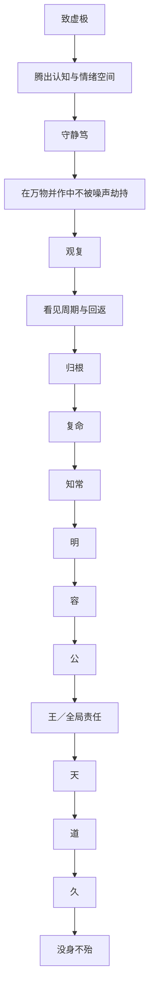

# 《道德经》第十六章：致虚极，守静笃

> 第十五章描绘体道者如何在浑浊中“静之徐清”、在停滞中“动之徐生”；第十六章进一步说明，为什么虚静能够产生这种判断力。老子不是要人逃离万物，而是要人在“万物并作”之中保留一个不被喧嚣占满的观察位置，由此看见繁盛背后的回返、变化背后的节律、行动背后的边界。本章从个人修养展开，最终推向“容—公—王—天—道—久”的公共尺度：真正的静，不是缩小世界，而是扩大承载世界的能力；真正的明，不是预言每一次波动，而是识别万物盛衰往复的长期结构。

## 一、原文

> 致虚极，守静笃。
>
> 万物并作，吾以观复。
>
> 夫物芸芸，各复归其根。
>
> 归根曰静，是谓复命。
>
> 复命曰常，知常曰明。
>
> 不知常，妄作凶。
>
> 知常容，容乃公，
>
> 公乃王，王乃天，
>
> 天乃道，道乃久，
>
> 没身不殆。

## 二、白话翻译

让内在的空明达到极处，让安静而不妄动的状态守得深厚坚定。

万物同时生长、活动、兴起，我借由虚静来观察它们如何回返。万物纷繁茂盛，各自最终回到使它得以生长的根本。回到根本叫作静，静就是回归自身生命的根源与尺度。回归生命本然的尺度叫作“常”，能够认识这种恒常规律叫作“明”。

不认识事物的常理，却凭一时欲望、恐惧或冲动任意行动，就容易招致危险。认识“常”，便能够容纳差异与变化；能够容纳，才可能超越私见而公平；能够公平周遍，才有资格承担统摄全局的责任；这样的尺度逐渐接近天的无私，进而合于道。合于道，才可能长久；即使经历一生，也不容易陷入根本性的危殆。

## 三、本章总览：在最繁盛处看见回返

本章不是一篇单纯的静坐口诀，而是一套完整的认识论、修养论与治理论。它的逻辑可以压缩为六步：

```text
致虚、守静
    ↓
在“万物并作”中保持观察位置
    ↓
看见“芸芸”终将“归根”
    ↓
由“复命”理解“常”
    ↓
由“知常”生出明、容、公与全局尺度
    ↓
合天、合道，因而长久而不殆
```

其中最关键的张力是：

```text
外部：万物并作，纷繁、增长、竞争、变化
内部：虚而能受，静而能观，不被即时刺激拖走
```

老子并不要求外部世界先安静下来。恰恰相反，只有在万物同时兴作时，虚静才显示出价值：它使人不被局部事件绑架，不把高峰当成永恒，不把低谷当成终局，也不把自己的短期愿望误认为世界的长期规律。

本章也不是鼓励“什么都不做”。“吾以观复”本身就是一种高度主动的认知活动：观察周期、辨认根本、等待证据、校正行动。静，是为了不妄作；虚，是为了让真实进入；复，是为了看见变化不是直线；常，是为了在变化中把握可重复的结构。

## 四、版本提示与文本辨析

《道德经》有传世本、帛书本、郭店楚简本等不同文本系统。本章在关键字句上存在异文，这些差异并不只是字形问题，也会改变解释重点。

### 1. “致虚极”与“至虚极”

常见传世本作“致虚极”，部分古本作“至虚极”。

- **致**：强调主动抵达、使之达到。修养者需要不断清理成见、欲望与噪声；
- **至**：强调虚的极致状态，像是在描述一种已达到的境界。

两者可以互补：虚静既是需要练习的过程，也是不断逼近的状态。

### 2. “守静笃”及其异文

传世本多作“守静笃”，帛书材料中可见与“静”“情”“督”等相关的异文，郭店楚简也呈现不同字形。古文字的通假、抄写和语义层次，使这一句不能只按现代字面机械理解。

本章采用“守静笃”的通行读法：

- **守**不是一次进入，而是持续保持；
- **静**不是身体不动，而是心不被妄念和外物牵着跑；
- **笃**是深厚、坚定、落实，不是短暂的情绪平静。

因此，“致虚”偏向腾出空间，“守静”偏向维持稳定；一开一守，构成本章的基本功。

### 3. “万物并作”与“万物旁作／方作”

“作”不是人为造作，而是发生、生长、兴起、运行。异文中的“并”“旁”“方”，都强化一种景象：万物不是排队出现，而是在同一世界中多线并发。

这对现代人尤其重要。现实从来不是单变量实验：市场、技术、组织、人际、身体、情绪和环境往往同时变化。若没有虚静，认知就会被最响亮的信号占据。

### 4. “吾以观复”与“吾以观其复”

有无“其”字，对大意影响不大，却能提示“复”的对象：

- 无“其”：更像观察普遍的回返法则；
- 有“其”：更像观察万物各自的回返过程。

前者偏向规律，后者偏向具体生命。成熟的认识需要两者同时成立：既理解一般周期，也尊重每个系统不同的节奏。

### 5. “夫物芸芸”与“天物云云”

“芸芸”通常解释为繁多、茂盛、纷纭。它不是贬义，不表示万物的丰富本身有错。问题只在于观察者是否把繁盛表象当成最终真实。

“各复归其根”也不是说所有事物回到同一个可见地点，而是各自返回其成立条件、生命尺度和生成来源。树木归根、制度归信任、技术归需求、投资归现金流、学习归理解，形式不同，结构相通。

### 6. “公乃王”与“公乃全”

不同传本、校本中可见“王”与“全”等读法。

- **王**：可理解为承担统摄、治理与公共责任的能力；
- **全**：强调周遍、完整、不偏于局部。

二者并非互相排斥。真正的“王”不是权位本身，而是能够从整体出发；真正的“全”也不是面面俱到的控制，而是不让私人偏好垄断公共尺度。

### 7. “没身不殆”

“没身”可理解为终身、直到生命结束；“不殆”不是保证人生没有任何困难，而是说不因违背根本规律、任意妄作而陷入根本性危险。

老子提供的不是免灾咒语，而是一条风险原则：越能看见边界、周期与根本条件，越不容易在高峰时失控，在低谷时自毁，在复杂时用单一意志强推世界。

## 五、核心概念一：虚——不是空无，而是可接收、可校正

现代语境中，“虚”常被误解成空洞、消极或没有主见。老子的“虚”更接近一种开放容量。

### 1. 虚是认知上的留白

一个被答案填满的人，很难再听见证据。一个被身份填满的人，很难承认错误。一个被计划填满的组织，很难响应变化。

“致虚”意味着主动为以下事物留下位置：

- 尚未出现的新事实；
- 与自己不同的解释；
- 失败暴露出的系统问题；
- 长期趋势中的反转可能；
- 他人的真实处境；
- 自己尚不知道的部分。

虚不是没有模型，而是不把模型当成现实本身。

### 2. 虚是情绪上的缓冲区

刺激与反应之间若没有空间，人就只能被情绪自动驾驶。致虚并不是压抑情绪，而是让情绪成为信息，而不是命令。

```text
事件发生
  ↓
情绪升起
  ↓
看见情绪，而非立刻服从情绪
  ↓
检查事实、边界与长期后果
  ↓
选择行动
```

这一小段间隔，就是“虚”在日常生活中的实际形态。

### 3. 虚是系统中的余量

没有余量的系统，看似效率最高，实际上最脆弱：

- CPU 长期满载，突发流量一来就雪崩；
- 团队排期百分之百占满，任何故障都会打乱全部计划；
- 家庭预算没有储备，轻微意外就变成危机；
- 投资组合没有流动性，只能在最坏时点被迫卖出；
- 日程没有空档，思考只能被会议切碎。

第十一章说“无之以为用”，第十六章进一步说明：只有保留虚位，系统才有能力观察、恢复和回返。

## 六、核心概念二：静——不是停滞，而是不被噪声劫持

### 1. 静与不动不同

水静下来，杂质才会沉淀；但河流若完全停滞，也会失去生机。第十五章已经提出“浊以静之徐清，安以久动之徐生”，说明老子的静与动不是二元对立。

“守静”指的是：

- 行动中不慌乱；
- 变化中不失根本；
- 成功时不膨胀；
- 失败时不自乱；
- 信息不足时不假装确定；
- 必须决断时不因恐惧逃避。

真正的静，是内在秩序，不是外在姿势。

### 2. 静让时间参与判断

许多问题并不缺聪明，而是缺时间。过早结论会把暂时波动误判为长期趋势，把一次失误解释为人格定论，把短期热度当成永久需求。

守静使人愿意问：

- 这个现象持续多久了？
- 它是趋势、周期，还是噪声？
- 哪些变量尚未充分展开？
- 等待会增加信息，还是只会逃避责任？
- 何时必须行动，何时应让系统自行显形？

静不是拖延，而是让行动与信息成熟度相匹配。

## 七、“万物并作，吾以观复”：复杂世界中的观察方法

### 1. “并作”意味着并发，而非单因果

现实中的结果通常来自多个因素共同作用。一个产品增长，可能同时受到需求、渠道、价格、技术成熟度、竞争和宏观环境影响。一个人感到疲惫，也可能是睡眠、压力、节奏、环境与情绪叠加。

若只抓住最显眼的因素，就容易把故事当成解释。

“吾以观复”要求观察者从事件退后一步，寻找：

```text
表象：现在发生了什么？
结构：哪些关系反复产生这种结果？
根本：这个系统靠什么维持？
周期：它如何兴起、扩张、饱和、衰退、恢复？
边界：什么条件一变，原有规律就不再适用？
```

### 2. “观复”不是预测每一个拐点

知道四季循环，不等于能精确预测每一片叶子落下的时刻。理解商业周期，也不等于能准确交易每一次市场波动。

“知常”的价值在于提高方向感与风险意识，而不是制造全能幻觉：

- 知道增长不能永久高于承载能力；
- 知道注意力长期透支会降低判断质量；
- 知道组织信任破坏后，制度成本会上升；
- 知道技术优势若不能转化为用户价值，难以长久；
- 知道高估值需要未来兑现，而不是只靠叙事维持。

观复让人减少妄作，却不会消除不确定性。

### 3. 观察者也在系统之中

“吾以观复”容易被误解为站在世界之外冷眼旁观。实际上，观察者的欲望、恐惧、利益和身份都会影响所见。

因此，致虚守静首先是校准观察者：

- 我是否只寻找支持自己的证据？
- 我是否因为已经投入而拒绝退出？
- 我是否把喜欢的人说的话看得更可信？
- 我是否因短期损失而否定长期逻辑？
- 我是否把职位权力误认为认知正确？

不清理自身偏差，就很难真正“观复”。

## 八、“归根曰静，是谓复命”：回到生成条件

### 1. 根不是表面起点，而是持续供养之源

根不只是“最早发生什么”，更是“现在仍靠什么存在”。

例如：

| 对象 | 表面表现 | 其“根”可能是什么 |
|---|---|---|
| 学习 | 分数、证书 | 理解力、好奇心、基本功与反馈 |
| 企业 | 收入、股价 | 客户价值、现金流、组织能力与资本纪律 |
| 软件系统 | 功能数量 | 清晰边界、数据正确性、可维护性与用户需求 |
| 领导力 | 职位、命令 | 信任、判断、责任与一致性 |
| 家庭关系 | 日常安排 | 尊重、安全感、沟通与共同承担 |
| 身心状态 | 短期兴奋 | 睡眠、节律、恢复与长期平衡 |

“归根”不是退回原始状态，而是回到真正维持生命的条件。

### 2. 静是回根后的重新校准

当一个系统偏离根本时，会出现表面繁荣与内部空心并存：

- 功能越来越多，系统却越来越难维护；
- 营收增长很快，现金流和客户留存却恶化；
- 日程越来越满，真正重要的工作反而没有推进；
- 交流越来越频繁，理解却越来越少；
- 学习材料越来越多，基本概念却没有打牢。

归根之后的静，是暂停无效扩张，重新检查“为何存在、靠什么成立、什么不可丢失”。

### 3. 复命不是宿命论

“命”在这里不宜简单理解为不可改变的命运。它更接近生命的内在尺度、所受条件和生成秩序。

复命意味着尊重事物的限度：

- 幼苗不能靠拉扯迅速长高；
- 团队能力不能只靠口号瞬间提升；
- 信任破裂后不能用一次道歉自动恢复；
- 复杂系统不能在没有测试和回滚方案时任意改动；
- 长期财富不能靠一次冒险稳定建立。

尊重尺度，不等于拒绝成长；恰恰是让成长不以毁坏根基为代价。

## 九、“复命曰常，知常曰明”：在变化中认识恒常

### 1. 常不是静止不变

《道德经》的“常”并不是说世界表面永远一样。四季之所以“常”，正因为它不断变化；呼吸之所以维持生命，也在一出一入之间。

因此，“常”更接近：

- 反复出现的结构；
- 变化中的稳定关系；
- 事物不可长期违背的边界；
- 盛衰、张弛、得失之间的节律；
- 生命与系统得以持续的基本条件。

真正的常，往往通过变表现出来。

### 2. 明不是信息多，而是结构清楚

一个人可以接收海量信息，却仍然不明。因为“明”不等于知道每条新闻，而是能区分：

```text
重要与紧急
信号与噪声
趋势与波动
事实与解释
能力与运气
原则与习惯
可逆决策与不可逆决策
```

“知常曰明”意味着：判断力来自对长期结构的理解，而不是被最新、最大声、最刺激的信息牵引。

### 3. 明包含对自身无知的认识

如果把“知常”理解成掌握了世界的终极公式，便又陷入自满。真正的明会同时知道：

- 哪些规律相对稳定；
- 哪些结论只在特定条件下成立；
- 哪些变量无法控制；
- 哪些风险不能被模型消除；
- 哪些判断必须随证据更新。

明不是绝对确定，而是在不确定中保持诚实、尺度与方向。

## 十、“不知常，妄作凶”：为何聪明人也会犯大错

“妄作”不是所有行动，而是不理解规律、边界和后果的强行作为。

### 1. 把短期成功当成永久能力

一次成功可能来自能力，也可能来自环境、周期与运气。若把顺风期的结果全部归功于自己，就容易在环境变化后继续加码。

```text
成功
  ↓
过度归因于个人能力
  ↓
风险承受提高、边界感下降
  ↓
在周期反转时遭受放大损失
```

知常的人会在成功时追问：哪些条件不会永久存在？

### 2. 用线性外推理解非线性世界

增长初期看似每一步都带来同样回报，但规模扩大后，复杂度、协调成本、监管、竞争和资源约束会改变系统行为。

软件项目尤其如此：代码量增加一倍，维护难度可能远不止一倍；团队人数增加，沟通路径会迅速增加。若只按线性思维扩张，就会“妄作”。

### 3. 把控制感误认为控制力

计划、指标和仪表盘能够提升可见性，却不能消除现实的不确定性。控制感过强时，人会忽视：

- 模型之外的变量；
- 数据质量问题；
- 人的适应与反应；
- 二阶效应；
- 极端但可能发生的情形。

“守静”不是放弃控制，而是不让控制欲替代真实控制能力。

### 4. 在情绪高点做不可逆决定

兴奋、恐惧、愤怒和羞耻都会压缩时间视野。妄作常见于“我现在必须立刻证明什么”。

老子的风险纪律可以概括为：

```text
情绪越强烈，
决策越不可逆，
越需要致虚守静，
扩大信息与时间缓冲。
```

## 十一、“知常容，容乃公”：从个人清明走向公共伦理

本章最容易被忽略的部分，是它没有停在个人内心平静，而是从“知常”推向“容”和“公”。

### 1. 为什么知常会使人更能容纳？

看见周期，就不会把一个人的暂时状态当成全部；理解条件，就不容易只用道德标签解释复杂结果；认识自己的有限，就不必通过压制异议来保护自尊。

“容”不是没有原则，而是能够同时容纳：

- 多个视角；
- 暂时的不确定；
- 人的成长过程；
- 系统中的局部矛盾；
- 与自己不同但有证据支持的意见。

容的基础不是软弱，而是认知空间。

### 2. 为什么容会走向公？

一个不能容纳差异的人，往往只能把私人经验当作普遍尺度。容使人看到：自己的利益、情绪和偏好只是整体中的一部分。

“公”因此不是抽象口号，而是三个能力：

1. **去私蔽**：知道自己的立场会造成盲区；
2. **看整体**：评估行动对不同群体与长期系统的影响；
3. **守一致**：相同原则不因对象亲疏而任意改变。

### 3. “公”不等于平均主义

公平不一定是每个人得到完全相同的东西，而是标准透明、理由可说明、差异有正当依据，并愿意接受检验。

在组织中，“公”可能表现为：

- 决策依据不因职位高低而改变；
- 奖励与责任相匹配；
- 错误复盘聚焦系统改进，不只寻找替罪者；
- 资源配置考虑长期价值，而非只满足声音最大的人；
- 领导者也受规则约束。

## 十二、“公乃王，王乃天，天乃道”：领导力的尺度升级

### 1. 王：不是占有权力，而是承担整体

“王”在这里可理解为能够统摄全局的领导能力。一个人若仍被个人得失完全支配，即使拥有职位，也难以真正承担公共责任。

从“容”到“公”再到“王”，说明领导力不是先有权力再学公平，而是先扩大认知与责任，才配得上权力。

### 2. 天：无私而普遍的运行尺度

“天”不是人格化命令者，而更接近不偏私地覆盖万物的自然秩序。天不会因为喜欢某棵树就取消季节，也不会因讨厌某条河就改变重力。

领导者接近“天”的尺度，不是变得冷酷，而是：

- 不把个人情绪当制度；
- 不把亲疏关系当规则；
- 不把短期掌声当长期正确；
- 不因一次挫折就任意改变原则；
- 给不同生命留下成长空间。

### 3. 道：让整体能够自发运行

到“道”的层面，治理不再依赖领导者时时亲自干预。好的制度让信息流动、责任清晰、反馈及时、错误可修复，使系统在较少强制下保持秩序。

这与“无为”相通：不是领导者无所事事，而是不把自己的存在变成系统唯一支点。

```text
差的治理：所有问题都必须等最高层拍板
好的治理：原则、边界与反馈机制使多数问题就地解决
```

系统若离开某个人就停止，说明那个人可能很重要，却未必建立了长久之道。

## 十三、“道乃久，没身不殆”：长久来自可持续，而非僵硬

### 1. 久不是永远保持同一形态

能够长久的系统，通常不是从不改变，而是能在不丢根本的前提下不断更新：

- 树每年落叶，根与生命延续；
- 软件版本不断变化，核心契约保持清晰；
- 企业调整产品，用户价值与资本纪律不能丢；
- 家庭成员成长变化，尊重与信任仍是根基；
- 个人职业会转换，学习与责任感可以持续。

长久依靠的是可恢复性、适应性与根本一致，而不是冻结。

### 2. 不殆不是没有风险

没有任何哲学能保证人避开疾病、意外、损失或时代冲击。“不殆”更合理的理解是：不因持续违背规律而把自己推向可避免的危险。

它强调三种安全边际：

- **认知边际**：承认不知道；
- **行动边际**：避免一次押上全部；
- **恢复边际**：为错误、波动和意外保留修复能力。

### 3. 最高级的稳定是能够回返

脆弱系统只能维持一种理想状态；有韧性的系统即使偏离，也能发现偏离并返回根本。

这正是“复”的实践意义：

```text
不是永不犯错，
而是能识错、停错、改错、复归。
```

## 十四、现代应用一：心理与注意力

### 1. 把注意力从刺激中收回

现代信息环境不断制造“万物并作”：通知、短视频、新闻、聊天、任务和比较同时争夺注意力。致虚守静不是隔绝世界，而是重新建立注意力主权。

可采用一个简单练习：

```text
每天选择一个十分钟时段
关闭非必要通知
只观察呼吸、身体感受和念头变化
不追逐，也不压制
结束后写下：什么反复出现？它靠什么触发？
```

重点不是追求“脑中一片空白”，而是训练“念头出现，但不立即服从”。

### 2. 情绪回根

遇到强烈情绪时，可以依次问：

1. 表面事件是什么？
2. 我真正害怕失去什么？
3. 这个担忧中，哪些是事实，哪些是推测？
4. 我的根本需要是什么：安全、尊重、控制、理解，还是休息？
5. 哪个行动既回应根本需要，又不制造更大后果？

这就是从“芸芸”回到“根”。

### 3. 不把暂时状态永久化

“我现在做不好”不等于“我永远不行”；“今天很焦虑”不等于“人生没有希望”；“一次争执”不等于“关系全部失败”。

观复让人看见状态会变化，关键是识别触发条件、恢复路径与可以长期培养的根本能力。

## 十五、现代应用二：学习与知识体系

### 1. 从材料堆积回到基本概念

学习容易出现一种假繁荣：收藏很多资料、观看很多课程、做很多笔记，却不能解释核心概念。

归根式学习可以这样进行：

```text
我能否不用术语解释这个概念？
我能否举出反例和边界？
我能否说明它与其他概念的关系？
我能否在新情境中使用它？
我能否指出自己仍不理解的部分？
```

真正的“明”不是熟悉页面，而是形成可迁移的结构理解。

### 2. 给知识留出沉淀时间

连续输入会制造“懂了”的错觉。守静要求在输入之后安排：

- 回忆；
- 重述；
- 间隔复习；
- 解决问题；
- 错误分析；
- 与旧知识连接。

知识不是被塞进大脑，而是在反复提取与校正中“复归其根”。

## 十六、现代应用三：组织与领导

### 1. 会议中的致虚

领导者若最先给出结论，团队往往只会围绕结论提供支持。更好的做法是先提出问题，让不同角色独立表达证据，再形成判断。

```text
先收集事实
再区分事实与解释
再听取相反意见
最后形成可检验的决定
```

这不是降低效率，而是减少因权威偏差造成的妄作。

### 2. 组织的“根”

每个组织都应反复检查：

- 我们为谁创造什么价值？
- 哪些能力是不可替代的？
- 哪些指标只是代理变量？
- 哪些流程已经从服务目标变成维护自身？
- 如果资源减少一半，什么必须保留？
- 如果规模扩大十倍，什么会先崩溃？

归根不是怀旧，而是防止组织被表面增长掏空。

### 3. 领导者的“容—公—王”

优秀领导者不需要同意所有意见，但必须让真实信息能够抵达决策层。若团队只报告好消息，说明系统失去“容”；若规则因人而异，说明失去“公”；若所有事情依赖个人救火，说明尚未形成真正的“王”与“道”。

## 十七、现代应用四：软件架构与系统运行

### 1. 虚：容量与边界余量

系统设计中的“虚”包括：

- CPU、内存、连接池和队列的余量；
- 可回滚的部署策略；
- 明确而不被过度占用的接口；
- 给未来变化预留的扩展点；
- 值班人员的恢复时间；
- 项目计划中的风险缓冲。

追求百分之百利用率，常会牺牲韧性。

### 2. 静：故障中的稳定观察

事故发生时，最危险的不一定是第一处故障，而是恐慌导致连续误操作。可以把“致虚守静”翻译成事件响应纪律：

```text
确认影响范围
冻结非必要变更
保留日志与证据
建立单一指挥通道
先恢复服务，再追根因
每一步都准备回滚
```

静不是慢，而是避免用混乱放大故障。

### 3. 观复：从单次事故看到重复结构

复盘不能只回答“这次是谁做错了”，而要问：

- 为什么一个人的错误能够穿透多层防线？
- 为什么告警没有及时出现？
- 为什么回滚如此困难？
- 为什么同类问题反复发生？
- 哪些组织激励鼓励了冒险或隐瞒？

看见复，才能修根；只惩罚表面行为，系统还会以另一种形式重演。

### 4. 归根：回到不变量

复杂系统中最值得保护的通常不是每个实现细节，而是核心不变量：

- 数据不能丢失或重复计费；
- 权限必须最小化；
- 接口契约必须明确；
- 状态变化必须可追踪；
- 故障必须可隔离；
- 关键操作必须可审计。

技术会更新，不变量提供“常”。

## 十八、现代应用五：人工智能与决策系统

### 1. 模型输出不是“明”

AI 可以快速生成答案，但速度、流畅和自信并不等于正确。使用者需要保留“虚”的位置，检查：

- 数据来源是否可靠？
- 结论是否超出证据？
- 是否遗漏反例？
- 是否把相关性当因果？
- 是否存在过时信息？
- 哪些场景必须由人承担最终责任？

真正的明包括知道模型何时不可靠。

### 2. 静是避免自动化偏见

当系统给出分数、排名或建议时，人容易把机器输出当成客观真理。守静意味着暂停自动服从，检查目标函数、训练数据、误差分布和受影响群体。

“容乃公”对 AI 治理尤其重要：模型必须容纳现实多样性，评估标准必须可解释、可申诉，并避免把少数群体的数据不足转化为制度性不公。

### 3. 观复是持续监测

AI 系统上线不是终点。数据分布、用户行为和外部环境会变化，模型性能也会漂移。长期可靠依赖：

- 监测；
- 反馈；
- 偏差评估；
- 版本管理；
- 人工复核；
- 退出与降级机制。

“道乃久”在技术上表现为可持续治理，而不是一次性准确率。

## 十九、现代应用六：投资与风险

### 1. 市场的“芸芸”与企业的“根”

股价、新闻和情绪每天变化，而企业长期价值仍要回到：

- 产品是否解决真实需求；
- 客户是否愿意持续付费；
- 收入质量如何；
- 现金流是否支持扩张；
- 管理层如何配置资本；
- 竞争优势是否可维持；
- 估值是否已经透支未来。

观复不是忽略价格，而是不让价格取代价值分析。

### 2. 知常不是精确择时

投资中的“常”包括周期、均值回归、竞争侵蚀、资本成本与估值约束。但这些规律不能提供精确日期。

因此，知常更适合转化为纪律：

- 不因连续上涨而假设风险消失；
- 不因短期下跌而自动否定优质资产；
- 不把单一公司当作无风险存款；
- 不用借来的确定性掩盖真实不确定；
- 保留流动性和分散度；
- 为自己可能判断错误预留空间。

### 3. 妄作的典型形式

```text
追逐热点而不理解业务
因为害怕错过而集中押注
用短期价格证明长期逻辑
亏损后不断加码只为证明自己没错
盈利后扩大风险却没有更新基本面
```

致虚守静并不会让投资者永远正确，却能减少因自我膨胀与情绪驱动造成的致命错误。

## 二十、现代应用七：家庭与人际关系

### 1. 给对方留下表达空间

争执中，人常忙着准备反驳，而不是理解。致虚意味着暂时放下“我必须赢”，先确认：

- 对方真正担心什么？
- 哪一句是事实，哪一句是情绪？
- 双方是否在讨论不同层次的问题？
- 关系的根本目标是什么？

容不是无条件让步，而是让完整信息进入关系。

### 2. 从事件回到关系之根

家务、时间、金钱和语气常是表面事件，深层可能涉及公平、被重视、边界和安全感。只解决表面安排，冲突可能反复出现；回到根本需要，才可能建立长久规则。

### 3. 不用一次表现定义一个人

“观复”提醒我们看长期模式，也提醒我们给人修正与成长的机会。既不能因为一次好表现就忽略持续问题，也不能因一次错误就否定一个人的全部。

## 二十一、七个常见误读

### 误读一：虚就是脑中什么都没有

纠正：虚是开放、可接收、可校正，不是认知停摆。

### 误读二：静就是不行动

纠正：静是行动不被冲动劫持。该行动时仍要行动。

### 误读三：复就是历史机械重复

纠正：复是结构与节律的回返，具体形式可以变化。

### 误读四：归根就是退回过去

纠正：归根是回到生成条件，不是复古。回根后可以产生新形态。

### 误读五：知常就是掌握永恒公式

纠正：知常包括理解规律的适用条件与自己的无知边界。

### 误读六：容就是没有原则

纠正：容纳差异不等于取消判断；真正的容以事实、边界和公共尺度为基础。

### 误读七：不殆就是不会遭遇困难

纠正：不殆是减少因妄作造成的根本危险，并提高偏离后的恢复能力。

## 二十二、与《道德经》其他章节的互证

### 1. 与第十一章：“无之以为用”

第十一章说明空位产生功能，第十六章说明空明产生观察。一个是器物与系统的空间，一个是心智与治理的空间。

### 2. 与第十五章：“浊以静之徐清”

第十五章展示静的过程性，第十六章把这种过程提升为认识万物回返的基础。静不是冻结浊水，而是让真实结构逐渐显现。

### 3. 与第二十五章：“人法地，地法天，天法道，道法自然”

第十六章的“王乃天，天乃道”与第二十五章相呼应：人的公共秩序要不断扩大尺度，最终服从比个人意志更深的自然与整体规律。

### 4. 与第四十章：“反者道之动”

“观复”与“反者道之动”共同揭示：道的运动常以回返、反转、复归表现。极盛之中已经包含转向，柔弱之中也可能孕育新生。

### 5. 与第五十二章：“既得其母，以知其子；既知其子，复守其母”

“归根”与“守母”都要求从具体事物返回生成来源。看见万物，还要知道它们依赖什么；理解枝叶，还要守住根本。

## 二十三、实践框架：一套“致虚—观复—归根”决策法

面对复杂问题时，可以使用以下九步：

```text
1. 停：暂停立即反应
2. 空：写下已有假设，承认未知
3. 分：区分事实、解释、情绪与利益
4. 观：查看时间序列，而非只看单点
5. 复：寻找反复出现的模式
6. 根：识别系统赖以成立的关键条件
7. 常：判断哪些关系较稳定，哪些只是暂时
8. 作：选择最小必要、可验证、可回退的行动
9. 回：观察结果，及时复归与修正
```

这套方法既可用于个人决定，也可用于故障处理、项目治理、投资分析与关系沟通。

## 二十四、思考题与练习

### 练习一：观察一个“并作”的场景

选择一个复杂场景，例如团队项目、家庭安排、学习压力或市场波动，列出至少五个同时作用的变量。然后回答：哪一个变量最响亮？哪一个变量最根本？两者是否相同？

### 练习二：寻找一个反复模式

回顾最近三次相似问题，写下：

- 每次问题出现前有什么共同信号？
- 自己通常如何反应？
- 哪种反应会放大问题？
- 哪个更早的节点可以改变结果？

### 练习三：给系统找根

选择一个你重视的系统——工作、学习、家庭、健康习惯或软件项目——写出它的三个根本条件。再检查目前的时间和资源是否真正投入在这些根本上。

### 练习四：区分静与拖延

针对一个尚未决定的问题，回答：

- 继续等待会带来什么新信息？
- 最迟何时必须决定？
- 是否存在可逆的小步试验？
- 我是在守静，还是在逃避不适？

### 练习五：从容走向公

回想一次你不同意他人的情形，尝试准确复述对方最有力的理由，再说明自己的判断标准。能公平表述反方，是“容乃公”的基本训练。

## 二十五、本章心智模型



## 二十六、章节总结

第十六章的核心，不是“把世界关掉，独自安静”，而是建立一种能够面对复杂世界的深层稳定。

- **致虚**：不让成见、欲望和噪声占满心智；
- **守静**：在变化中维持判断秩序；
- **观复**：从单点事件看到周期与结构；
- **归根**：返回事物持续成立的生成条件；
- **复命**：尊重生命与系统的内在尺度；
- **知常**：在变化中认识较稳定的规律与边界；
- **明**：区分信号与噪声，并承认未知；
- **容**：为差异、复杂和修正留下空间；
- **公**：超越私见，以整体和长期为尺度；
- **王、天、道、久**：让个人判断上升为可持续的公共秩序；
- **不殆**：不是没有风险，而是不因妄作摧毁根本，并保有回返能力。

本章最值得带走的一句话可以写成：

> 静，不是世界停止变化；静是当万物同时变化时，你仍能看见它们从哪里来、靠什么存在、又将向哪里回返。

## 参考资料

1. 中国哲学书电子化计划：《道德经》第十六章及平行文本，包含传世本与出土文本异文对照。
2. 王弼：《老子道德经注》第十六章，重点解释“以虚静观其反复”“复命曰常”与“知常容”。
3. 高明：《帛书老子校注》，中华书局。
4. 陈鼓应：《老子今注今译》，商务印书馆。
5. 楼宇烈校释：《王弼集校释》，中华书局。
6. Stanford Encyclopedia of Philosophy, “Laozi”，关于“无”、虚静、自然与无为的哲学解释。
