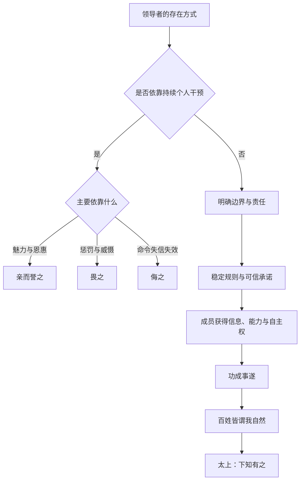

# 《道德经》第十七章：太上，下知有之

> 第十六章从“致虚极，守静笃”讲到“知常容，容乃公”，说明一个人只有不被局部欲望和短期波动占满，才可能形成公共尺度。第十七章随即把这一尺度带入治理与领导：最好的统治，不是让人时时感受到权力的存在，而是让制度、秩序和共同体自然运转，使百姓在事情完成之后说：“本来就是这样，我们自己做成了。”本章不是赞美隐身的权术，而是在讨论权力如何克制自己、信用如何成为治理基础，以及领导者怎样把个人意志转化为社会的自我组织能力。

## 一、原文

> 太上，下知有之。
>
> 其次，亲而誉之。
>
> 其次，畏之。
>
> 其次，侮之。
>
> 信不足焉，有不信焉。
>
> 悠兮，其贵言。
>
> 功成事遂，百姓皆谓我自然。

## 二、白话翻译

最高明的治理者，下面的人只知道有这样一位领导者存在，却很少感到他处处干预。

次一等的治理者，人民亲近他、赞美他；再差一等的治理者，人民畏惧他；最差一等的治理者，人民轻侮他、不再把他的命令当回事。

统治者自身缺乏信用，社会就会出现普遍的不信任。最高明的治理者从容审慎，珍惜自己的言语，不轻易发布命令，也不随意作出承诺。

等到事业完成、事情顺利办成，百姓都说：“这是我们自己如此完成的，本来就应当如此。”

## 三、本章总览：最高级的领导，是让共同体拥有自己的力量

本章表面上是在给统治者分级，实质上讨论了三个相互连接的问题：

1. **权力以什么方式出现，才不会压倒社会自身的能力？**
2. **领导者怎样建立足以支撑长期合作的信用？**
3. **为什么最好的成果，不应被解释为某个英雄个人的独占功劳？**

老子给出的答案可以压缩为一条完整链路：

```text
领导者克制存在感
        ↓
少许诺、少扰动、重信用
        ↓
规则清晰而稳定，成员形成自主行动
        ↓
事情完成而不依赖持续强制
        ↓
共同体把成果理解为“我自然”
```

这不是把领导者变成可有可无的人。恰恰相反，只有具备更高判断力、更强制度能力和更深自我克制的人，才敢不把自己放在舞台中央。

普通领导常通过“我说了什么、我决定了什么、我推动了什么”证明存在；成熟领导则通过“系统是否能够在没有持续催促时仍然正确运行”检验成效。前者制造依赖，后者培养能力；前者追求被看见，后者追求事情真正完成。

## 四、版本提示与文本辨析

《道德经》在传世本、帛书本及其他古本中存在若干异文。理解这些差异，有助于避免把本章简化成一句现代管理口号。

### 1. “太上”与“大上”

传世本多作“太上”，帛书系统可见“大上”。“太”与“大”在古文字与传抄中关系密切。

这里的“太上”不是神秘等级，也不必解释为具体帝号，而是说治理方式中的最高层次。它评价的不是统治者身份有多尊贵，而是其治理结果是否最大限度地保存了人民与社会的主体性。

### 2. “下知有之”

“下”指居下者、百姓、组织中的普通成员；“知有之”是只知道他存在。

这一句最容易被误读成“最好让人民不知道领导是谁”。老子并非主张秘密权力，也不是鼓励逃避责任。真正的重点是：

- 人们知道责任主体存在；
- 基本秩序有人维护；
- 关键时刻有人承担；
- 但权力不必渗入每一个细节；
- 社会不因领导者的情绪、偏好和即兴命令而反复震荡。

因此，“有之”保留了责任，“下知”限制了干预。

### 3. “亲而誉之”为什么只是第二等

能够得到人民亲近和赞誉，显然比让人民恐惧更好。但老子仍把它放在第二层，因为“被爱戴”仍然可能形成对个人魅力的依赖。

当治理主要依靠个人恩惠、个人魅力或个人英明时，社会会出现几个隐患：

- 成员把制度信任转化为个人崇拜；
- 好政策难以在领导者离开后延续；
- 赞誉反过来诱使领导者表演政绩；
- 群体不再发展独立判断，而是等待“好领导”解决问题。

老子不是否定亲近，而是提醒：个人好感不能替代可持续的公共秩序。

### 4. “畏之”与“侮之”

“畏”表示命令仍有效，但主要依靠惩罚和威慑；“侮”表示权威已经失去实际分量，人们表面应付、暗中规避，甚至公开轻慢。

二者并非完全分离。长期依赖恐惧的治理，常会逐渐滑向轻侮：当人们发现规则反复、处罚选择性执行、领导言而无信时，恐惧会转化为犬儒——大家不再相信共同目标，只研究如何躲避责任。

### 5. “信不足焉，有不信焉”

“信”既可指领导者的诚信，也可指社会成员对制度和命令的信任。两者互为因果：领导者言行不一致，成员便不再相信；成员普遍不信，领导者又会增加监督、惩罚和口号，最终形成更深的不信任循环。

```text
承诺反复或规则多变
        ↓
成员降低信任，转向自我保护
        ↓
领导者增加控制和检查
        ↓
真实信息更少、表面服从更多
        ↓
决策质量下降，进一步损害信用
```

因此，“有不信焉”不是人民天生难以管理，而是治理信用不足的结构性后果。

### 6. “悠兮”与“犹兮”

不同版本中可见“悠兮”“犹兮”等文字。通行解释通常强调从容、审慎、不轻易发言。

“贵言”不是故作深沉，也不是永远沉默，而是把公共语言当成稀缺资源：

- 不轻许无法兑现之诺；
- 不用朝令夕改制造混乱；
- 不以口号替代制度；
- 不在事实不足时装作确定；
- 一旦作出承诺，就让行动与之匹配。

语言越有后果，越应谨慎使用。

### 7. “我自然”

“自然”不是现代意义上与“人工”相对的自然界，也不等于毫无规则的放任。“自”是自己，“然”是如此，“自然”即“自己如此”“由其自身成为这样”。

“百姓皆谓我自然”表达的是：好的治理让人感到成果来自共同体自身的能力，而不是外在权力的强制塑形。

## 五、四种治理层级：存在、爱戴、恐惧与轻侮

本章用四个层级描绘权力与社会的关系。

| 层级 | 百姓的感受 | 权力主要依靠什么 | 短期表现 | 长期风险 |
|---|---|---|---|---|
| 太上：下知有之 | 知道其存在，但少受打扰 | 稳定规则、信用、边界、制度 | 秩序自然运行 | 对领导者制度能力要求极高 |
| 其次：亲而誉之 | 亲近并赞美领导者 | 恩惠、德望、人格魅力 | 凝聚力强、响应快 | 容易个人化、接班困难 |
| 其次：畏之 | 因惩罚而服从 | 威慑、监控、强制 | 表面执行迅速 | 信息失真、创新受抑、怨气积累 |
| 其次：侮之 | 轻视、应付、规避 | 权威残余或形式命令 | 制度空转 | 犬儒化、规则失效、组织瓦解 |

这四层不是静止标签，而可能相互转化：

- 一个被爱戴的领导者若不断强化个人崇拜，可能在继任后迅速失去秩序；
- 一个依靠恐惧的组织，可能因惩罚失去可信度而进入普遍轻侮；
- 一个制度成熟的组织，若长期朝令夕改，也会从“下知有之”退化为“畏之”甚至“侮之”。

老子的排序标准不是“领导者受不受欢迎”，而是共同体是否仍有自主能力。

## 六、为什么最高级的治理只是“知道有他”

### 1. 好治理降低权力摩擦

如果每一件小事都需要领导批准，组织表面上权力集中，实际却极度低效。成员不再解决问题，只负责向上请示；领导者被细节淹没，真正重要的风险反而无人处理。

“下知有之”意味着：

- 方向清楚；
- 边界清楚；
- 责任清楚；
- 升级机制清楚；
- 日常行动无需不断等待个人指令。

权力并未消失，而是从频繁干预转化为结构设计。

### 2. 好领导不垄断解释权

低水平领导往往希望所有成果都被归因于自己，所有问题都由自己定义。久而久之，成员学会揣摩上意，而不是观察现实。

最高级治理让事实、规则和共同目标拥有比个人偏好更高的地位。领导者可以作出最终决定，但必须允许真实信息从下向上流动，允许专业判断修正权力判断。

### 3. 好领导培养可替代性

真正成熟的领导并不以“没有我就不行”为荣。若一个系统离开某个人就停摆，那通常说明知识、权限和责任没有被组织化。

“功成事遂”要求领导者完成两种建设：

- **成果建设**：具体事情办成；
- **能力建设**：团队以后还能继续办成。

只留下成果而不留下能力，功劳属于一次性英雄；既留下成果又留下能力，才接近老子所说的“自然”。

## 七、“信不足”——治理失败往往先从语言贬值开始

信用不是抽象美德，而是一种公共基础设施。它降低合作成本，使人们敢于规划未来、分享信息、承担责任。

### 1. 信用由可预测性构成

一个人偶尔判断错误，不一定失信；真正损害信用的是规则与承诺缺乏稳定边界，例如：

- 今天强调长期价值，明天只按短期数字处罚；
- 承诺允许试错，失败后却寻找替罪羊；
- 公开要求坦诚，私下惩罚说真话的人；
- 频繁改变目标，却仍要求下属为旧目标负责；
- 领导者自己不遵守要求他人遵守的规则。

信用的核心不是永远正确，而是让别人知道：你将依据什么原则行动，错误发生时又会怎样纠正。

### 2. 不信任会产生隐性税收

当信用不足时，所有合作都要付出额外成本：

- 更多审批；
- 更多监控；
- 更多会议；
- 更多防御性文档；
- 更多责任切割；
- 更少真实反馈；
- 更慢的决策速度。

这些成本看似在“加强管理”，实际是在为信用缺失缴税。

### 3. 恢复信用必须先于扩大控制

面对执行不力，很多领导的第一反应是增加命令。但若根本问题是规则反复或承诺落空，增加命令只会进一步稀释语言价值。

恢复信用需要：

1. 承认过去的不一致；
2. 缩小承诺范围；
3. 让规则保持足够长时间；
4. 对例外情况给出公开理由；
5. 用可观察的行动兑现承诺；
6. 允许别人验证，而不是只要求相信。

## 八、“贵言”——少说不是技巧，而是对公共后果负责

### 1. 语言是治理动作

普通谈话可以修改、补充或反悔；公共命令、组织承诺和政策表态却会引发大量资源调整。领导者一句未经思考的话，可能改变团队优先级、市场预期和成员心理安全。

因此，“贵言”首先是一种后果意识：说话之前，先看这句话会让多少人采取行动。

### 2. 贵言不等于信息封闭

老子反对的是轻率发令，不是透明沟通。成熟领导应当区分：

- **事实通报**：尽量及时透明；
- **判断说明**：明确证据与不确定性；
- **正式承诺**：谨慎、可兑现；
- **行动命令**：少而清楚；
- **价值原则**：长期一致。

真正的贵言，是减少噪声，增加有效信息。

### 3. 言少而行动足

“贵言”的检验标准不是字数，而是言行比率：

```text
承诺数量越多，不一定越有领导力；
兑现比例越高，语言才越有重量。
```

当领导者每次发言都可靠，成员不需要反复猜测“这次是不是又会变”。这正是“信”与“贵言”的连接。

## 九、“功成事遂”——完成事情，而不是制造领导者形象

“功成”强调结果，“事遂”强调过程顺利完成并达到应有状态。两者合在一起，说明老子并不轻视绩效。

但他重新定义了功绩归属：

- 不是“我亲自解决了所有问题”；
- 不是“所有人都知道这是我的功劳”；
- 而是“系统已经具备完成事情的条件”。

### 1. 结果不能靠持续高压维持

如果一个项目只有领导每天催促才推进，一旦催促停止就停滞，那么它尚未真正“事遂”。高压可以带来短期冲刺，却可能掩盖流程、能力和责任结构的问题。

### 2. 功成之后要让权力退出

很多治理失败发生在成功之后：临时机制因曾经有效而被永久保留，紧急权力不愿归还，英雄叙事继续要求社会维持动员状态。

老子的“功成事遂”隐含一个重要边界：事情完成以后，领导者不应继续扩大干预，只为维持自己的中心位置。

### 3. 把功劳还给参与者

成员真正拥有成果，才会维护成果。若所有成功都归于上级、所有失败都归于下级，组织会迅速失去主动性。

“百姓皆谓我自然”并不是领导者没有贡献，而是领导者把贡献转化成了他人的能力、信心和共同所有感。

## 十、“自然”不是放任：无为治理的四个前提

把“自然”理解为“不管”，是对本章最大的误读。共同体能够自我运转，通常需要长期而精细的基础建设。

### 前提一：边界明确

成员必须知道什么可以自主决定，什么必须升级，什么绝对不能做。没有边界的授权，只会造成责任模糊。

### 前提二：信息可达

人们只有获得必要信息，才可能自主判断。领导者若垄断信息，却要求下面“自觉”，那不是无为，而是推卸责任。

### 前提三：能力足够

自主需要训练、经验、工具和资源。不给能力与资源，只给自由，往往会把失败风险转嫁给执行者。

### 前提四：反馈有效

自然运行并不意味着永不纠偏。成熟系统必须能够发现偏差、及时修正，并在重大风险出现时启动明确的干预机制。

因此，老子的“无为”更接近：

```text
少做替代成员主体性的事，
多做使成员能够正确行动的基础建设。
```

## 十一、与《道德经》其他章节的贯通

### 1. 与第二章“功成而弗居”

第二章说“为而不恃，功成而弗居”。第十七章把这一原则扩展到公共治理：不居功，不只是个人谦虚，而是避免共同体把能力重新交还给英雄个人。

### 2. 与第三章“为无为，则无不治”

第三章强调减少诱发争夺的制度刺激；第十七章进一步说明，无为并非没有治理，而是让治理不依赖不断可见的强制。

### 3. 与第十章“爱民治国，能无为乎”

第十章已经提出治理者能否不以自我意志强行塑造人民。第十七章给出结果指标：百姓是否能够说“我自然”。

### 4. 与第十一章“无之以为用”

车毂、器皿、房间因“无”而有用；领导空间也一样。领导者若占满所有决策空间，团队便没有形成能力的空处。

### 5. 与第十六章“知常容，容乃公”

只有知常、能容、能公，领导者才不会因个人焦虑而过度干预。第十七章是第十六章公共尺度的实际展开。

## 十二、现代应用一：组织领导与团队管理

### 1. 从“审批者”转向“系统设计者”

低效管理把领导者放在所有流程中央；高效管理则让标准化事项自动流动，只把真正例外的问题升级。

可以采用三层结构：

```text
第一层：明确原则，团队自主决定
第二层：触发阈值，跨团队协商
第三层：重大风险，领导承担最终责任
```

这种结构使领导“有之”但不必处处出现。

### 2. 用决策记录建立信用

组织中最常见的不信任，来自“为什么这次和上次不一样”。领导者可以通过简洁的决策记录说明：

- 问题是什么；
- 使用了哪些事实；
- 哪些原则不变；
- 哪些条件发生变化；
- 何时重新评估。

透明并不要求公开所有敏感信息，但必须让规则变化有可理解的理由。

### 3. 奖励发现问题的人

如果说真话会受罚，组织就会从“亲而誉之”迅速滑向“畏之”。表面一片赞同，实际信息系统已经失灵。

最高级领导不是要求所有人证明自己正确，而是让系统尽早发现自己哪里可能错。

## 十三、现代应用二：软件架构与平台工程

本章对软件系统有非常直接的启发。

### 1. 最好的基础设施“下知有之”

优秀平台通常不需要开发者每天关注。身份认证、日志、部署、监控、容错在后台稳定工作，使用者知道它存在，却不被它反复打断。

当基础设施频繁要求人工干预时，就像治理者不断发令：存在感很强，系统成熟度却很低。

### 2. API 契约就是“信”

一个接口最重要的品质不是功能多，而是契约可信：

- 输入输出稳定；
- 错误语义清楚；
- 版本变化可预测；
- 弃用有过渡期；
- 文档与实现一致。

API 若朝令夕改，调用方就会建立大量防御代码，这正是“信不足”产生的技术税。

### 3. 自动化的目标是“功成事遂”

真正的自动化不是把复杂性藏在一个脆弱脚本后面，而是让流程可观察、可恢复、可审计，并在正常情况下无需持续人为推动。

一个成熟系统完成任务后，使用者只感到“它自然完成了”；这与“百姓皆谓我自然”高度同构。

## 十四、现代应用三：人工智能与算法治理

### 1. AI 不应成为无所不在的命令者

好的 AI 助手应降低人的认知负担、提供选项和证据，而不是用看似确定的答案替代人的判断。它的价值越大，越需要保持边界：

- 明确不确定性；
- 允许追溯来源；
- 保留人工复核；
- 不诱导盲从；
- 在高风险场景中谨慎行动。

### 2. 模型信用来自一致表现，而非自信语气

当模型无法区分“知道”与“猜测”，就会产生“信不足”。恢复信任不能靠更强烈的语气，而要靠：

- 更准确的事实依据；
- 更清楚的置信边界；
- 更稳定的行为规则；
- 可验证的工具调用；
- 对错误的明确修正。

### 3. 最佳自动化保留人的主体性

自动化的最高目标不是让人变得无能，而是把机械负担交给系统，使人能够处理价值判断、例外情况和创造性工作。

这同样是在追求“我自然”：工具帮助人完成事情，却不把人的判断能力据为己有。

## 十五、现代应用四：家庭教育与个人关系

### 1. 父母的目标不是永远被需要

孩子年幼时需要直接保护；随着能力增长，父母应逐渐从命令者转为边界提供者、资源支持者和关键时刻的承担者。

最成功的教育，不是孩子不断说“都是父母替我安排好的”，而是他能够说：“我知道怎样判断，也愿意承担结果。”

### 2. 亲而誉之也可能形成依赖

父母若只通过赞美换取服从，孩子可能过度依赖外部评价。老子的层级提醒我们：爱与认可很重要，但教育的终点仍是内在尺度与自主能力。

### 3. 贵言适用于冲突

在亲密关系中，情绪高涨时的承诺、威胁和绝对化判断，会长期损害信任。贵言意味着：

- 不用“你总是”“你从不”概括对方；
- 不以离开、断绝等极端话语控制局面；
- 不在事实不清时定性；
- 说出自己能够承担并兑现的请求。

## 十六、现代应用五：投资与风险管理

### 1. 市场不奖励持续发言

投资者常误以为每天都必须形成强烈观点。实际上，频繁预测会使判断语言贬值。贵言在投资中表现为：

- 只有在证据充分时提高确信度；
- 清楚区分事实、假设和情绪；
- 少作无法验证的宏大预测；
- 预先写下何种证据会推翻观点。

### 2. 好系统让纪律“自然”发生

投资纪律不能只依靠意志。通过资产配置、仓位上限、再平衡规则和现金缓冲，把正确行为嵌入结构，才能减少恐惧和贪婪时的临时决策。

最好的投资流程，像最好的治理：平时存在感低，关键时刻却能阻止灾难性错误。

### 3. 信用也适用于自己的计划

如果一个人不断违反自己制定的规则，他会逐渐不再相信自己的计划。恢复自我信用，同样需要缩小承诺、减少规则数量，并长期兑现。

## 十七、常见误读

### 误读一：最好的领导什么也不做

本章要求的是不替代共同体行动，而不是放弃方向、资源、边界和风险责任。没有基础建设的“放手”，只是失职。

### 误读二：人民不知道领导者才是最高境界

原文说“知有之”，并非完全不知。责任必须可识别，权力必须可追问，只是不应让个人意志覆盖所有生活空间。

### 误读三：受人爱戴是不好的

“亲而誉之”并非坏治理，只是尚未达到最稳定的层次。老子警惕的是对个人魅力的过度依赖，而不是否定温情和尊重。

### 误读四：贵言就是少沟通

真正的贵言减少轻率命令，却要求事实信息更加透明。沉默若使人无法判断，只会损害信用。

### 误读五：自然意味着不要制度

“我自然”往往是优良制度长期运转后的体验。真正自然的秩序，背后通常有清晰边界、稳定规则、能力培养与反馈机制。

## 十八、实践框架：如何从“畏之”走向“下知有之”

可用以下六步检查一个团队、家庭或个人系统。

### 第一步：识别过度干预点

列出哪些事项必须反复请示、哪些会议只是为了让领导安心、哪些流程因不信任而重复检查。

### 第二步：明确不可让渡的责任

领导者必须保留方向、重大风险、资源分配与伦理边界，不能把“无为”当作逃避责任。

### 第三步：建立可自主执行的规则

规则要少、清楚、稳定，并给成员足够的信息与工具。

### 第四步：减少语言通货膨胀

停止发布无法兑现的承诺，把正式指令限制在真正需要协调行动的事项上。

### 第五步：让功劳回到执行者

公开说明团队如何完成事情，避免把所有成果包装成领导者个人英明。

### 第六步：检验离场能力

问一个最直接的问题：

> 当领导者暂时不在场时，系统还能否按原则运行、发现偏差并正确升级？

若答案是否定的，说明“功”也许已成，但“事”尚未真正遂。

## 十九、案例推演：一次生产事故中的四种领导方式

假设一个线上系统发生严重故障。

### 1. “侮之”型

领导者过去反复改变优先级，事故发生后只寻找替罪羊。团队表面汇报，实际隐瞒信息，命令无人真正相信。

### 2. “畏之”型

领导者以处罚推动响应。短期内所有人迅速行动，但没人敢暴露不确定性，也没人敢提出可能与领导判断相反的根因。

### 3. “亲而誉之”型

领导者亲自指挥、安抚团队并成功恢复系统，成员高度赞赏。但所有关键判断都集中在他一人身上，下次仍需等待他出现。

### 4. “下知有之”型

团队依据预先建立的事故机制自主响应：值班人员止损，相关服务负责人协同，重大风险按阈值升级。领导者确保资源、移除阻碍、承担对外责任，不在细节上抢夺指挥。事故结束后，复盘改进系统，功劳归于团队与机制。

最终成员会说：“我们按照机制把事情处理好了。”这正是“功成事遂，百姓皆谓我自然”的现代形态。

## 二十、心智模型



也可以把全章压缩为一个领导公式：

```text
最高级领导力
= 清楚的责任
+ 克制的权力
+ 稳定的信用
+ 稀缺而可信的语言
+ 可持续的成员能力
- 对个人崇拜与持续控制的依赖
```

## 二十一、思考练习

1. 在你所在的组织中，哪些流程真正需要领导决定，哪些只是因为不信任而被集中审批？
2. 你最近一次没有兑现的承诺是什么？它怎样影响了别人对你之后言语的判断？
3. 你的团队成功时，成员更常说“领导带得好”，还是“我们掌握了完成事情的方法”？两者各说明什么？
4. 哪些规则频繁改变，已经造成了“信不足焉”？如何缩小承诺并重新建立稳定性？
5. 当你不在场时，家庭、团队或项目是否还能正常运转？若不能，缺少的是边界、信息、能力还是反馈？
6. 你是否用大量发言来缓解自己的不安？哪些话可以不说，哪些信息反而应该更透明？
7. 在一次冲突中，怎样做到不靠恐惧维持权威，又不逃避应承担的决定？

## 二十二、本章小结

第十七章提出了一套极具穿透力的领导哲学。

第一，治理有层级：最高者让人只知其存在，其次让人亲近赞美，再次使人畏惧，最差则被人轻侮。这个排序不是按领导者的曝光度和受欢迎程度，而是按共同体保留了多少自主能力。

第二，信用是治理的根基。“信不足焉，有不信焉”说明，普遍不信任往往不是成员品德突然恶化，而是规则反复、承诺落空和言行不一造成的结构性结果。

第三，“贵言”要求领导者珍惜语言。少发轻率命令，少许无法兑现之诺，让每一次正式表达都有清晰含义和实际后果。

第四，“功成事遂”不是不要结果，而是要求结果不依赖领导者持续高压推动。真正完成的事业，会沉淀为制度、能力与共同所有感。

第五，“百姓皆谓我自然”不是放任，而是治理的最高成果：权力完成必要建设后退到边界位置，社会成员能够凭借自身能力把事情做好，并把成果视为自己的实践。

本章最终提醒我们：

> 最强的领导，不是让所有人时时看见自己，而是让所有人在没有被强迫、没有被夺走主体性的情况下，仍能把共同的事情做好。

下一章将进入《道德经》第十八章“**大道废，有仁义**”。老子将进一步追问：为什么当根本秩序失落之后，仁义、智慧、孝慈与忠臣反而会以更响亮的名义出现？