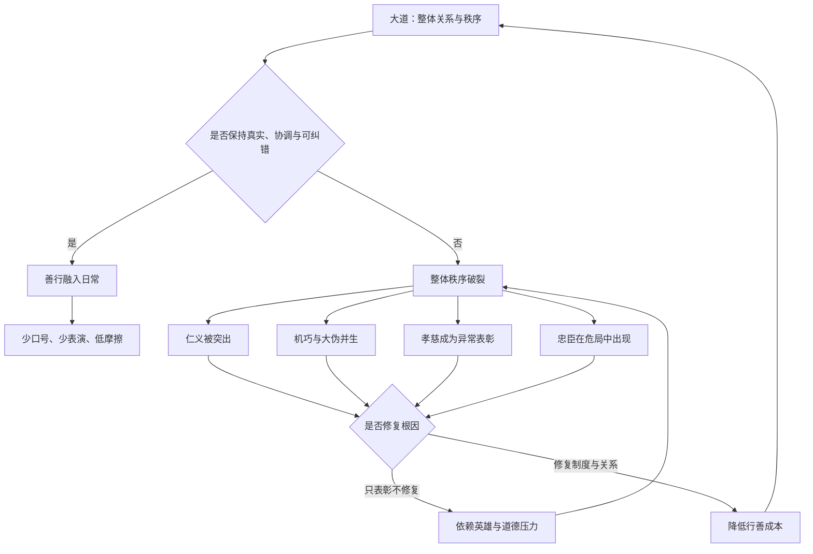

# 《道德经》第十八章：大道废，有仁义

> 第十七章讨论最高级的治理如何让权力退居背景，使百姓在“功成事遂”之后说“我自然”。第十八章把视线转向另一面：当一个共同体不断高喊仁义、智慧、孝慈与忠诚时，这些美德当然可能是真诚而可贵的，但它们也可能暴露出更深层的秩序已经破裂。老子不是要取消道德，而是在追问：为什么社会常在失去真实关系以后，才开始用响亮名词补救？为什么制度越失信，口号越密集？为什么家庭越疏离，越需要表演孝道？本章是一篇关于“症状与病因”“德目与结构”“真诚与伪饰”的深层诊断。

## 一、原文

> 大道废，有仁义。
>
> 智慧出，有大伪。
>
> 六亲不和，有孝慈。
>
> 国家昏乱，有忠臣。

## 二、白话翻译

当顺乎大道的整体秩序被废弃以后，社会才特别强调仁与义。

当机巧分别、聪明算计被推到前台以后，巨大的虚伪也随之出现。

当家庭亲属之间失去和睦以后，孝与慈才被突出表彰。

当国家政治昏乱失序以后，忠臣才以异常鲜明的形象出现。

这里的“有”不是说这些德目从此才第一次存在，而是说它们在秩序破裂之后被单独命名、反复强调，成为补救危机的显著标志。仁义、孝慈、忠臣本身并非邪恶；问题在于，当人们只歌颂补救者，却不再追问为何需要补救，就可能把病征误当成健康。

## 三、本章总览：美德为何会成为失序的证据

本章只有四句，却以同一结构连续推进：

```text
原本完整的关系或秩序受损
            ↓
某种局部德目被特别命名和突出
            ↓
德目承担修补功能
            ↓
若只表彰德目而不修复结构
            ↓
口号、表演与伪饰不断增加
```

四句分别对应四个层面：

| 层面 | 原本应有的整体状态 | 破裂后的显著德目或现象 | 老子追问的深层问题 |
|---|---|---|---|
| 社会秩序 | 大道自然运行 | 仁义被高调强调 | 为什么人与人已不能自然相待？ |
| 认知与政治技术 | 质朴、真实、少机心 | 聪明术数与“大伪”并生 | 为什么知识变成操控工具？ |
| 家庭关系 | 六亲和睦、彼此自然照料 | 孝与慈被单独表彰 | 为什么日常亲情需要道德表演？ |
| 国家治理 | 政治清明、职责正常履行 | 忠臣在危局中凸显 | 为什么忠诚必须以牺牲对抗昏乱？ |

老子的重点不是“不要仁义、不要孝慈、不要忠臣”，而是提醒我们区分两个层次：

1. **危机中的美德仍然值得尊敬。** 在混乱时代坚持正直、照顾亲人、承担公共责任，当然可贵。
2. **真正高明的治理不能满足于制造英雄。** 它应减少必须靠英雄牺牲才能维持的危机，恢复使普通人也能自然行善的环境。

因此，本章既赞美真实德行，又警惕德行被当作失序制度的装饰。

## 四、版本提示与关键词辨析

### 1. “大道废”不是大道真正消失

在《道德经》中，“道”不是一项可以由某个统治者发布或废止的政策。所谓“大道废”，更适合理解为：人们背离了顺应万物、少私寡欲、不过度干预的原则，使社会不再按照较为自然、可信和协调的方式运行。

“废”描述的是人的实践状态，而不是宇宙本体发生了变化。大道仍在，但人的制度、欲望与行为不再与之相应。

### 2. “有仁义”的“有”

“有”在这里带有“于是凸显出来”“因此被特别提出”的意味。仁义并非在大道废弃后才凭空诞生，而是从整体生活中被抽离出来，变成需要不断申说的德目。

自然和睦时，人们未必时时宣称自己仁义；正如真正信任的朋友无需每分钟强调“你要相信我”。越需要频繁保证，往往越说明关系中已经存在裂缝。

### 3. “智慧出”还是“慧智出”

传世本常见“智慧出”，帛书等古本系统可见不同字序或写法。这里的“智慧”不能简单等同于今天所说的知识、科学、学习能力或真正的洞见。

结合“大伪”来看，它更接近：

- 炫耀聪明；
- 精巧算计；
- 以术数操纵他人；
- 利用信息差包装私利；
- 把语言和知识变成掩饰真实动机的工具。

老子反对的不是清明智慧，而是脱离真实、服务争夺的机巧。真正的智慧使复杂问题更清楚；伪智则使简单事实被层层包装。

### 4. “大伪”为什么与聪明相伴

欺骗需要认知能力。一个高度复杂的组织若缺乏诚信，聪明人越多，可能制造越精致的报表、话术、指标和责任转移机制。

“大伪”不是普通的小谎言，而是系统性的虚假：

- 人人知道数字不真实，却继续围绕数字表演；
- 人人知道目标不合理，却把失败包装成成功；
- 人人知道规则被选择性执行，却仍以规则名义惩罚弱者；
- 人人知道口号与行动分离，却继续增加口号。

技术越高，若方向错误，伪饰也可能越庞大。

### 5. “六亲”指什么

“六亲”在古代文献中有不同解释，可泛指父子、兄弟、夫妇等家庭亲属关系，不必拘泥于唯一名单。本章关注的是亲属共同体内部的基本信任与照料。

“六亲不和，有孝慈”并非贬低孝顺与慈爱，而是在说：当家庭关系整体失衡时，某个孝子或慈亲会格外显眼。个体美德之所以成为新闻，恰恰因为正常关系已不再普遍。

### 6. “国家昏乱”

“昏”既有认知不明，也有政治判断混乱之意；“乱”则指秩序、名分、职责和制度失效。国家昏乱并不只是出现坏人，还包括：

- 决策与事实脱节；
- 规则反复改变；
- 赏罚失去一致性；
- 忠言难以上达；
- 私人关系凌驾公共职责；
- 危机不断被拖延，最终需要极端牺牲。

### 7. “忠臣”不是顺从者

这里的忠臣不是无条件服从权力的人。若国家已经“昏乱”，真正的忠往往表现为坚持公共原则、纠正错误、冒险进谏，甚至拒绝迎合君主。

把顺从等同于忠诚，会让“忠臣”退化为权力的附庸；把守护共同体的长期利益视为忠，才接近本章的深意。

## 五、四句的共同逻辑：补救性美德与原生性秩序

可以把本章区分为两类善：

### 1. 原生性秩序

所谓原生性秩序，不是理想化地认为社会没有冲突，而是说基本关系仍有稳定基础：

- 人们不必靠持续监控才履行承诺；
- 家庭照料融入日常，而非只在仪式中展示；
- 官员尽责是常态，而非必须以生命对抗制度；
- 知识用于理解事实，而非掩盖事实；
- 规则帮助合作，而非只为控制弱者。

这种状态接近“道”：许多善行发生了，却未必需要被高调命名。

### 2. 补救性美德

当整体结构破裂，个体仍可用仁义、孝慈、忠诚进行修补。这些行为很重要，但成本更高：

- 仁者要对抗普遍冷漠；
- 孝子要承担失衡家庭的额外负担；
- 忠臣要冒险纠正失序政治；
- 诚实者要在“大伪”环境中付出信誉或职业代价。

补救性美德像急救。急救值得尊敬，但一个社会不能以“拥有很多急救英雄”为健康指标。真正的目标应是减少事故、恢复制度、降低普通人行善的成本。

## 六、老子是否反对仁义

这是本章最常见的误读。答案是：老子反对的不是仁义本身，而是三种情况。

### 1. 用仁义名词替代真实关系

当一个人不断宣称自己仁慈，却在具体关系中控制、羞辱和利用他人，“仁”就变成自我包装。当组织反复高喊价值观，却在晋升、资源和责任分配上奖励相反行为，“义”就变成装饰。

老子要求从名词回到行动，从声明回到关系结构。

### 2. 用道德表彰掩盖制度责任

若一个系统长期依赖少数人超额奉献才能维持，管理者很容易赞美“敬业英雄”，却不修复人员配置、流程设计和风险控制。

例如：

- 医疗系统缺人，却只赞美医护无休奉献；
- 软件系统长期脆弱，却只赞美工程师通宵救火；
- 家庭照护资源不足，却只要求某个成员无限牺牲；
- 公共制度失效，却只等待“清官”解决问题。

表彰并非错误；错误在于让表彰成为拒绝改革的借口。

### 3. 把局部德目绝对化

“忠”若脱离事实与公共利益，可能变成盲从；“孝”若取消个人边界，可能变成压迫；“义”若脱离宽容与情境，可能变成道德审判；“智”若脱离诚实，可能变成操控。

大道代表整体平衡。局部德目一旦脱离整体，就可能从善转化为伤害。

## 七、从“大道”到“德目”：为什么整体一破，标签就增多

在完整系统中，行为由关系、习惯、制度和价值共同支持。系统破裂以后，人们往往试图通过增加分类和口号恢复控制。

```text
真实关系弱化
    ↓
信任下降
    ↓
增加道德标签与考核指标
    ↓
成员开始迎合标签
    ↓
表演增加，真实信息减少
    ↓
信任进一步下降
```

这与第十七章“信不足焉，有不信焉”直接相连。信用不足时，命令会增加；大道废弃时，德目会增加。两者都说明：外在表达越强，不一定意味着内在秩序越强。

### 一个重要判断

**不要只问一个组织宣称什么，要观察它在没有监督时奖励什么、容忍什么、惩罚什么。**

真正的价值观写在资源流向、晋升标准、错误处理和权力边界中，而不只写在墙上。

## 八、“智慧出，有大伪”：知识为何可能制造虚假

### 1. 知识本身不是问题，动机与结构才是关键

知识可以揭示真相，也可以制造烟幕。决定方向的不是智力高低，而是：

- 是否允许坏消息上报；
- 是否奖励诚实；
- 是否能承认不确定性；
- 是否把短期指标置于真实价值之上；
- 是否存在独立验证和纠错机制。

一个只奖励“漂亮答案”的系统，会逼迫聪明人生产漂亮谎言。

### 2. 指标如何变成“大伪”

指标本来是观察现实的工具，但当指标直接决定奖惩时，人们会优化指标，而不再优化现实。

例如：

- 客服追求缩短通话时间，却牺牲问题解决率；
- 学校追求考试排名，却压缩真正理解与探索；
- 企业追求季度数字，却透支产品质量和客户信任；
- 工程团队追求“零事故”，于是隐瞒小事故和近失事件；
- AI系统追求单一基准分数，却忽略偏差、鲁棒性和真实使用风险。

这不是指标无用，而是指标脱离整体目的后，聪明才智开始服务于伪装。

### 3. 真智慧的三个检验

真正的智慧至少应经得起三个问题：

1. **它是否使事实更清楚，而不是更难验证？**
2. **它是否让普通人更有能力，而不是更依赖专家权威？**
3. **它是否保留纠错通道，而不是把质疑者变成敌人？**

若答案是否定的，所谓智慧可能只是更精致的权术。

## 九、“六亲不和，有孝慈”：家庭中的自然照料与道德压力

### 1. 健康家庭不需要持续证明爱

在健康关系中，关怀体现在许多小事：倾听、分担、尊重边界、诚实沟通、允许差异。它未必戏剧化，也不一定被外人看见。

当家庭失和时，人们可能转向标签：谁孝、谁不孝，谁慈爱、谁自私。标签有时能指出责任，但也可能掩盖更复杂的问题：长期偏爱、财务不公、情感控制、代际创伤或照护资源不足。

### 2. 孝慈必须是双向关系

“孝”与“慈”并列非常重要。子女有照料与尊敬父母的责任，父母也有慈爱、保护和成全子女的责任。若只要求孝而不要求慈，家庭伦理会变成单向服从。

老子的句式暗示：真正和睦不靠一方无限牺牲，而靠关系双方共同维护。

### 3. 从道德审判转向结构修复

遇到家庭冲突时，可依次追问：

- 具体责任是否清楚？
- 照护负担是否公平分配？
- 财务和信息是否透明？
- 每个人是否拥有表达和拒绝的边界？
- 是否把长期积累的问题简化为某个人“没良心”？

这不是取消个人责任，而是避免只靠羞耻和标签解决系统性矛盾。

## 十、“国家昏乱，有忠臣”：为什么危局制造英雄

### 1. 忠臣的出现既是希望，也是警报

在昏乱中坚持原则的人值得尊敬，因为他们保存了共同体的最低信用。但忠臣越需要以极端方式出现，越说明正常纠错机制已经失效。

一个清明政治不应要求每次纠错都靠个人冒死进谏；一个成熟组织不应要求每次事故都靠某位英雄越级救火。

### 2. 真忠诚指向使命，不只指向上级

现代组织中，忠诚可区分为：

| 忠诚对象 | 健康表现 | 失衡风险 |
|---|---|---|
| 对个人上级 | 尊重职责、诚实协作 | 迎合、隐瞒、个人依附 |
| 对团队 | 互助、共同承担 | 小团体主义、排斥外部事实 |
| 对组织使命 | 守护长期价值与客户利益 | 使命口号被管理层垄断解释 |
| 对公共原则 | 遵守法律、伦理与专业标准 | 若缺乏情境判断，可能僵化 |

成熟忠诚不是“上级永远正确”，而是在尊重职责的同时，敢于把坏消息、风险和不同意见带入决策。

### 3. 最好的制度使忠言成为日常信息

避免“国家昏乱”不能只期待忠臣，还要建立：

- 可验证的数据；
- 不惩罚坏消息的汇报文化；
- 独立审计与复盘；
- 清晰的权责边界；
- 对重大决定的反方论证；
- 领导者公开修正错误的能力。

当纠错成为制度，忠诚就不必总以悲剧形式出现。

## 十一、系统思维：不要把英雄当作系统健康的证明

本章可以转化为一个系统诊断框架。

### 1. 症状层

组织开始大量出现：

- 价值观口号；
- 英雄表彰；
- 忠诚测试；
- 道德指责；
- 复杂汇报；
- 过度承诺；
- 选择性展示的成功案例。

这些现象不一定有问题，但应触发进一步观察。

### 2. 结构层

追问症状背后的结构：

- 是否目标互相冲突？
- 是否资源不足却要求无限奉献？
- 是否权责不对等？
- 是否说真话的成本过高？
- 是否短期指标压倒长期价值？
- 是否只有少数人掌握关键信息和权限？

### 3. 根因层

更深处往往是：

- 信任损耗；
- 权力过度集中；
- 激励与使命脱节；
- 反馈回路被切断；
- 个体边界不被尊重；
- 系统依赖英雄而非能力建设。

### 4. 修复层

修复不是撤掉所有德目，而是让德目重新嵌入结构：

```text
仁义 → 公平规则、真实关怀、可持续互助
智慧 → 事实透明、独立验证、承认不确定性
孝慈 → 双向责任、合理边界、照护资源
忠诚 → 对使命负责、允许异议、制度化纠错
```

## 十二、现代应用一：组织领导

### 1. 警惕“价值观越响，现实越反向”

领导者应比较两套系统：

- **宣称的价值观**：网站、会议、口号中说什么；
- **实际的激励结构**：谁被晋升，谁被惩罚，什么行为获得资源。

若公司宣称“客户第一”，却只奖励短期销售；宣称“坦诚”，却惩罚提出风险的人；宣称“团队合作”，却把所有绩效设计成内部竞争，那么“大伪”不是员工个人道德问题，而是制度主动生产的结果。

### 2. 少歌颂救火，多消除火源

对救火者应感谢，但复盘必须继续：

- 为什么监控没有提前发现？
- 为什么单点知识集中在一个人身上？
- 为什么变更缺乏回滚方案？
- 为什么风险多次上报仍未处理？
- 为什么夜间紧急响应成为常态？

英雄主义若没有结构改进，会把下一次灾难合理化。

### 3. 领导者的“反伪”责任

高层最重要的工作之一，是降低说真话的风险。可采取：

- 决策前先邀请反对意见；
- 区分“报告问题”与“制造问题”；
- 公开记录假设与不确定性；
- 重大指标同时配置反指标；
- 奖励提前暴露风险的人；
- 复盘时先检视系统，再讨论个人责任。

## 十三、现代应用二：软件架构与工程治理

本章对软件系统尤其有启发。

### 1. “大道废”对应架构原则失效

当系统缺乏清晰边界、可观测性和演进原则时，团队会不断增加临时流程、审批、补丁与英雄值班。表面制度越来越多，底层秩序却越来越弱。

```text
架构边界模糊
    ↓
故障与耦合增加
    ↓
增加人工检查和紧急审批
    ↓
交付更慢，绕流程行为增加
    ↓
系统进一步依赖少数专家
```

真正的修复不是再加一层口号式规范，而是恢复基础能力：接口契约、自动化测试、可观测性、容量规划、故障隔离和可回滚发布。

### 2. “智慧出，有大伪”对应指标游戏

工程团队可能出现：

- 用关闭工单数量代替问题解决质量；
- 用代码行数衡量产出；
- 用单一覆盖率掩盖测试无效；
- 用平均可用性隐藏关键客户受损；
- 用模型基准分数替代真实场景评估。

聪明工程师会迅速学会优化任何被考核的数字。架构治理必须让指标回到目的，并保留人工判断与多维验证。

### 3. 从“英雄工程师”转向可持续系统

若只有一个人知道如何恢复数据库、部署生产或解释核心代码，这个人值得感谢，但系统并不健康。应把个人能力转化为共同资产：

- 运行手册；
- 自动化脚本；
- 交叉培训；
- 演练与复盘；
- 权限备份；
- 清晰升级路径。

这正是从“有忠臣”回到“正常秩序”。

## 十四、现代应用三：人工智能与信息社会

### 1. 生成能力越强，验证机制越重要

人工智能能够快速生成流畅文本、图像、代码和分析。表达越像真的，“大伪”的风险越高。问题不在于生成技术本身，而在于社会是否同时建设：

- 来源追踪；
- 事实核验；
- 权限控制；
- 风险分级；
- 人类复核；
- 错误反馈与纠正机制。

没有验证基础设施的智能扩张，会让“看起来可信”取代“可以证实”。

### 2. 不把复杂话术当作深度

AI和人类都可能用专业术语掩盖不知道。真正可靠的回答应明确区分：

- 已知事实；
- 合理推断；
- 尚未验证的假设；
- 价值判断；
- 不确定或缺失的信息。

能清楚说“不知道”，往往比流畅制造答案更接近智慧。

### 3. AI治理不能只靠伦理口号

“负责任AI”若没有具体机制，容易成为现代版的“有仁义”。有效治理需要把价值写入：

- 数据采集边界；
- 模型评估标准；
- 上线审批；
- 滥用监测；
- 用户申诉；
- 事件通报；
- 责任归属。

伦理必须进入工程与制度，不能只停留在宣言。

## 十五、现代应用四：投资与商业判断

### 1. 警惕叙事强于现金流

企业越需要反复强调宏大愿景、忠诚文化和独特指标，投资者越应回到基础事实：

- 收入是否真实增长？
- 现金流质量如何？
- 客户是否持续付费？
- 资本开支能否产生回报？
- 管理层承诺是否兑现？
- 会计口径是否频繁调整？

这不是拒绝愿景，而是不让愿景替代验证。

### 2. “忠臣”式管理层并不能替代好制度

一家公司可能依赖一位极强创始人或核心高管度过危机，但长期价值取决于：

- 决策是否可复制；
- 接班机制是否清楚；
- 信息是否透明；
- 董事会是否真正监督；
- 风险是否被分散；
- 组织是否能在关键人物离开后继续运行。

英雄可以创造转折，制度才能保存成果。

### 3. 投资者也要防止“智慧出，有大伪”

复杂模型可能制造精确幻觉。预测越精确，不代表越可靠。更好的做法是：

- 使用区间而非单点预测；
- 明确关键假设；
- 进行反向情景测试；
- 区分好公司与好价格；
- 给不可知风险留出安全边际；
- 用实际结果持续校正叙事。

## 十六、现代应用五：个人心理与日常生活

### 1. 不用道德标签逃避真实感受

人容易用“我应该善良”“我必须孝顺”“我应该忠诚”压住疲惫、愤怒和边界需求。长期压抑并不会自动产生德行，反而可能积累怨恨与伪装。

成熟做法是同时承认：

- 我愿意承担责任；
- 我也有能力和边界；
- 关系需要双向调整；
- 真诚比表面顺从更有利于长期信任。

### 2. 少证明自己是好人，多解决具体问题

当冲突发生时，不必先争论谁更仁义。可以问：

- 事实是什么？
- 谁受到什么影响？
- 哪项责任没有履行？
- 什么边界需要重建？
- 什么补偿或改变可以发生？

道德身份争夺常让问题扩大；具体责任则让修复成为可能。

### 3. 观察自己的“表演性美德”

每天可做一个简短反省：

- 我今天有没有为了被看作善良而答应不该答应的事？
- 我有没有用复杂解释掩饰一个简单错误？
- 我有没有要求别人忠诚，却没有先提供可信的承诺？
- 我有没有赞美某人的牺牲，却回避造成牺牲的结构？

这种反省不是自责，而是从“名”回到“实”。

## 十七、常见误读

### 误读一：老子认为仁义都是虚伪

纠正：本章说的是仁义在大道废弃后被特别凸显，不等于所有仁义行为都虚假。真正的仁义仍能在危机中保护人，只是不应替代对根本秩序的修复。

### 误读二：聪明和知识必然导致欺骗

纠正：老子批评的是机巧与伪饰结合，而不是求知本身。能够识别谎言、承认无知、建立验证机制，也是智慧。

### 误读三：家庭和睦就不需要孝慈

纠正：和睦家庭当然包含孝慈，只是这些品质融入日常，不必作为对抗失和的异常表演。

### 误读四：国家越乱，越能证明忠臣伟大，所以乱也有价值

纠正：忠臣可贵，不代表昏乱值得。不能因为危机产生英雄，就把危机合理化。

### 误读五：最高境界是不讲道德、不设制度

纠正：老子主张减少矫饰和过度控制，不是取消底线。自然秩序需要可信关系、适当规则和自我克制，而不是任意放纵。

## 十八、实践框架：从表彰美德走向修复系统

面对任何“英雄、美德、忠诚、牺牲”叙事，可使用五步法：

### 第一步：承认真实贡献

不要因分析结构，就否定个体善行。先感谢承担责任、保护他人、说出真话的人。

### 第二步：识别异常成本

问：为什么这件正常职责需要如此大的牺牲？为什么只有少数人能完成？

### 第三步：追溯结构原因

检查资源、权限、流程、激励、信息和反馈机制。

### 第四步：把个人经验制度化

将英雄的隐性知识转化为文档、流程、培训、规则和共同能力。

### 第五步：检验是否降低了下一次牺牲

真正的改进应使未来问题更少、更早暴露、更容易由普通成员处理。

可以把这五步压缩为一句话：

> 尊敬补救者，但不要依赖补救；表彰美德，更要恢复使美德不必悲壮的秩序。

## 十九、思考练习

1. 你所在的家庭或组织，是否有某种价值被反复强调，却与实际激励相反？
2. 最近一次“英雄救火”背后，哪个基础流程或结构没有被修复？
3. 你是否曾把顺从误认为忠诚，把牺牲误认为孝，把复杂话术误认为智慧？
4. 在你的工作中，哪些指标已经从观察工具变成了行为目标？它们产生了什么失真？
5. 如何建立一个让坏消息更容易上报、让错误更容易被承认的环境？
6. 面对AI生成内容，你有哪些方法区分流畅表达与可验证事实？
7. 你能否找到一件需要从“赞美个人”转向“改进系统”的具体事情，并设计下一步行动？

## 二十、心智模型



## 二十一、与其他章节的互文

- **第十七章“信不足焉，有不信焉”**：信用不足会制造更多控制；大道废弃会制造更多德目。两章共同揭示外在强化可能来自内在虚弱。
- **第十九章“绝圣弃智”**：下一章将继续讨论如何从被夸大的圣智、仁义和巧利返回朴素生活。第十八章偏重诊断，第十九章偏重处方。
- **第三十八章“失道而后德，失德而后仁”**：第三十八章会把本章的退化链条展开得更完整，从道、德、仁、义一路分析到礼。
- **第五十七章“法令滋彰，盗贼多有”**：规则和禁令的增多可能与失序同步，正如德目增多可能与大道废弃同步。
- **第五十八章“其政闷闷，其民淳淳”**：过度精细而苛察的治理，可能推动人民转向机巧与规避。

这些互文说明，老子不是偶然反感几个名词，而是在持续建立一种系统哲学：**当整体生命被切碎，人们会用越来越多的局部技术补救；真正的治理应从补丁返回根本。**

## 二十二、本章总结

第十八章以四组强烈对照，揭示了一个容易被忽略的事实：社会最响亮的美德语言，有时并不是健康的证明，而是失序的回声。

“大道废，有仁义”提醒我们，仁义可能是大道破裂后的补救；“智慧出，有大伪”提醒我们，智力若脱离真实与诚信，会把欺骗变得更精致；“六亲不和，有孝慈”提醒我们，孝慈应存在于双向、日常和有边界的关系中；“国家昏乱，有忠臣”提醒我们，忠臣值得尊敬，但成熟制度不应长期依赖悲壮忠诚才能纠错。

本章最重要的实践原则是：

> 不要因为补救者伟大，就忘记追问破坏从何而来；不要因为口号正确，就忽略结构是否相反；不要只培养愿意牺牲的好人，更要建设不必依靠牺牲才能运行的好系统。

第十九章将进一步提出更激进的处方：“绝圣弃智，民利百倍；绝仁弃义，民复孝慈。”理解下一章的前提，正是先看清本章的诊断——老子要舍弃的不是人类真正的智慧与关爱，而是脱离生活、制造等级、服务争夺的圣智与名义。