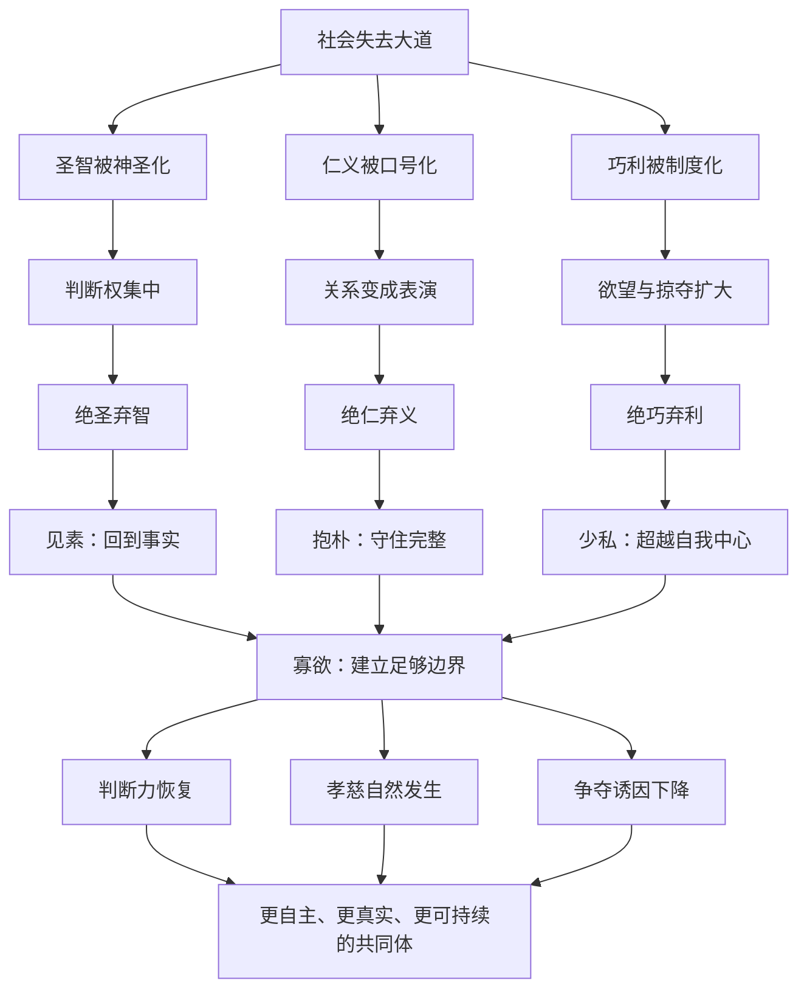

# 《道德经》第十九章：绝圣弃智，民利百倍

> 第十八章指出：当大道废弛，仁义、智慧、孝慈与忠臣会作为补救性德目被突出。第十九章进一步追问：若一个社会已经被名号、机巧、利益竞争和道德表演层层包围，应当怎样回到更真实、更稳定的秩序？老子给出的答案不是简单摧毁知识、伦理与技术，而是“绝”去那些脱离真实、制造等级、服务争夺的圣智之名、仁义之饰与巧利之术，再让生活重新归属于“素”“朴”“少私”“寡欲”。本章的核心，是从不断增加口号与规则，转向减少诱因、降低伪饰、恢复人的本真与共同体的自发合作。

## 一、原文

> 绝圣弃智，民利百倍。
>
> 绝仁弃义，民复孝慈。
>
> 绝巧弃利，盗贼无有。
>
> 此三者以为文不足，故令有所属：
>
> 见素抱朴，少私寡欲。

## 二、白话翻译

断绝被神圣化的权威与用于争胜、操控的机巧之智，百姓反而能够得到更多实际利益。

放下被外在化、口号化的仁义名目，人与人之间自然的孝慈关系才可能恢复。

去除炫巧逐利、以稀缺和诱惑刺激争夺的制度环境，盗窃与掠夺便会失去滋生的条件。

不过，只说这三条否定性的原则，仍然只是外在文字，不足以成为完整的生活道路，所以还必须让人的行为有所归属、有所扎根：

看见未经染饰的本色，守住未经雕琢的质朴，减少以自我为中心的私心，节制不断扩张的欲望。

这里的“绝”不是把人的思考能力、真实关爱、正当技术与合理交换一概取消，而是切断它们被名位、权力、虚荣和无限欲望劫持的方式。老子所要减去的是异化，不是生命能力本身。

## 三、本章总览：三重“减法”与一个正面归宿

本章可以分为两大部分：

```text
第一部分：三重去除

圣智之名  → 制造权威崇拜与认知依赖
仁义之饰  → 以道德口号替代真实关系
巧利之术  → 以诱惑、稀缺和逐利放大争夺

第二部分：四重归宿

见素  → 看见真实
抱朴  → 守住完整
少私  → 减少自我中心
寡欲  → 降低欲望膨胀
```

三重“绝弃”只是清理环境，四重“归属”才给出建设方向。

| 层次 | 老子要去除的东西 | 并非要取消 | 正面目标 |
|---|---|---|---|
| 认知与政治 | 神圣化权威、卖弄机智、以知识操控 | 学习、判断、真正智慧 | 事实清明、人人有判断力 |
| 伦理与关系 | 道德口号、身份表演、以仁义压人 | 关爱、责任、公平 | 孝慈从真实关系中自然发生 |
| 经济与技术 | 炫巧、奇货、逐利诱因、信息不对称 | 工艺、创造、正当交换 | 技术服务生活，财富不制造掠夺 |
| 个体修养 | 私心扩张、欲望无穷 | 合理需要、个人边界 | 素朴、节制、内在稳定 |

本章不是反文明宣言，而是一套“去异化”的文明诊断：当制度越复杂、知识越精巧、道德话语越宏大，却让普通人越来越依赖、焦虑和争夺，就应当重新审视文明究竟服务了谁。

## 四、版本提示：出土文本让本章更加开放

### 1. “智”与“知”

传世本常作“绝圣弃智”，一些古本写作“知”。先秦语境中，“知”与“智”常可相通。这里不宜把“智”直接等同于现代意义上的科学知识、教育或理性能力。

结合全章，它更接近三类被异化的聪明：

- 以知识制造地位差距；
- 以术数隐藏真实目的；
- 以复杂话语使普通人失去判断自信。

真正的智慧使人更接近事实；机巧之智则让事实被权威、包装与利益遮蔽。

### 2. 郭店楚简的显著差异

郭店楚简相关段落常释作“绝智弃辩”“绝巧弃利”“绝伪弃虑”，与传世本“绝圣弃智”“绝仁弃义”“绝巧弃利”并不完全相同。

这一差异非常重要。它提示我们：早期文本批评的对象可能更明确地指向辩说、伪饰和过度思虑，而不是笼统否定圣人、智慧、仁爱与正义。即使采用传世本，也应把“绝圣弃智”理解为对被权力化、表演化的圣智系统进行批判，而不是反对人的清明能力。

### 3. “绝学无忧”的篇章归属

帛书等文本系统中，“绝学无忧”常与本段相连；传世八十一章结构通常把它作为第二十章开头。本项目依照常见八十一章分章方式，将“绝学无忧”留在第二十章讨论。

这种分章差异也提醒读者：《道德经》的章界是后世整理的结果。理解思想时应关注句群之间的连续性，不必把每一章看成完全封闭的单元。

### 4. “见素”与“视素”

传世本多作“见素抱朴”，郭店楚简常见“视素保朴”的释读。“见”与“视”都指向对本色的直接看见；“抱”与“保”都强调持守、不丢失。

因此，这句话的精神非常稳定：不要只在外部增加规范，还要恢复对真实、朴素和完整生命的感受能力。

## 五、关键词精讲

### 1. “绝”：不是暴力消灭，而是切断支配关系

“绝”容易被理解成彻底摧毁。若机械照字面执行，就会把本章变成反知识、反道德、反技术的极端主张。

更合理的理解是：

- 断开某种错误连接；
- 停止让名号支配真实；
- 不再给异化机制持续供能；
- 让被扭曲的能力回到原本用途。

例如，“绝巧”不是禁止工匠精进，而是停止用炫技制造无穷消费欲；“弃智”不是放弃思考，而是放弃以聪明压制别人；“绝仁弃义”不是取消关爱与公正，而是不让道德名词取代真实责任。

### 2. “圣”：被神圣化的权威身份

在《道德经》中，“圣人”经常是理想治理者，本章却说“绝圣”。如果把两个“圣”完全等同，就会出现明显张力。

这里的“圣”更适合指：

- 被塑造成不可质疑的权威；
- 借“圣明”名号垄断解释权的人；
- 让百姓放弃自身判断的英雄崇拜；
- 以伟大身份遮蔽制度缺陷的个人中心治理。

真正的圣人“不自见”“不自是”“不自伐”“不自矜”，不会要求社会围绕自己的神圣形象运转。需要被“绝”的，是圣人名号的权力化，而不是谦下、清明、无为的圣人之道。

### 3. “仁义”：关系现实与道德标签的区别

仁与义在中国思想中通常是重要德目。老子的锋芒指向的不是实际关怀，而是仁义从生活中抽离后变成：

- 宣传口号；
- 身份认证；
- 道德优越感；
- 对他人的单向要求；
- 掩饰制度不公的装饰。

真实的孝慈发生在照料、倾听、边界、公平分工与长期责任中。若家庭成员每天高喊孝道，却把照护责任全部推给一个人，仁义之名反而掩盖了关系的不义。

### 4. “巧”：技术、技巧与炫巧

“巧”有双重面向。技术可以减轻劳动、改善健康、促进交流，也可以制造依赖、操纵注意力、扩大不平等。

老子批评的“巧”更接近：

- 为炫耀而复杂；
- 为逐利而制造虚假需求；
- 为控制而隐藏规则；
- 为套利而放大信息不对称；
- 为指标而牺牲真实价值。

判断一项技术是否合道，不在于它是否先进，而在于它是否让人更自主、更清明、更少被操纵。

### 5. “利”：正当利益与无限逐利

“民利百倍”中的“利”是百姓得到的实际好处；“弃利”中的“利”则偏向以利益为唯一尺度的逐利机制。可见老子并非否定一切利益，而是在区分：

- **利民**：让生活更安全、稳定、有尊严；
- **逐利**：为了占有更多而制造稀缺、诱惑和竞争。

利益若服务生命，就是工具；生命若服务利益，就发生了倒置。

### 6. “文不足”：口号与条文不能替代生活结构

“文”可以理解为外在文饰、条文或表达形式。“此三者以为文不足”说明：只提出“绝圣、绝仁、绝巧”三条口号还不够。

为什么不够？因为新的口号仍可能变成新的表演。一个组织可以高喊“反官僚”，却产生更强的官僚主义；可以宣传“保持简单”，却用复杂考核检查谁最简单；可以要求“少私寡欲”，却让权力者保留全部特权。

所以，减法必须落到人的感知、制度诱因和日常实践。

### 7. “属”：让生命重新有所归依

“属”含有归属、隶属、连接、依循之意。人不可能只靠否定生活。拆除虚假权威后，需要归属于事实；放下道德表演后，需要归属于真实关系；减少逐利后，需要归属于足够、共享与长期价值。

没有正面归宿的“绝弃”容易滑向虚无。老子因此立刻给出“见素抱朴，少私寡欲”。

### 8. “素”与“朴”

“素”原指未经染色的丝，“朴”原指未经雕琢的木。二者都不是粗陋，而是尚未被外在目的过度塑形的完整状态。

- 素：真实、不染饰、看见本色；
- 朴：完整、有潜能、不被切割成单一工具。

一个人若只以职位定义自己，就失去“朴”的多面生命；一项技术若只以变现定义价值，就失去服务人的完整可能；一个孩子若只以分数被衡量，也会从完整的人被雕刻成单一指标。

### 9. “少私”不等于取消个人

“私”主要指把自我利益绝对化，而不是合理的个人需要、隐私、边界和自由。

少私意味着：

- 决策不只考虑自己是否获利；
- 不把公共资源变成私人特权；
- 不用信息优势长期剥夺别人；
- 能看见系统整体和他人处境。

真正的少私反而需要健康边界。没有边界的人容易以牺牲换取认可，表面无私，内心却积累怨恨。

### 10. “寡欲”不等于没有愿望

欲望是生命动力的一部分。老子要减少的是被比较、广告、名位与恐惧不断放大的欲望，而不是消灭创造、学习、亲情和理想。

可以区分三类欲望：

| 类型 | 特征 | 结果 |
|---|---|---|
| 基本需要 | 有边界、可满足 | 支持生命 |
| 成长愿望 | 与能力、意义相连 | 推动创造 |
| 膨胀欲望 | 依赖比较、永无止境 | 制造焦虑与争夺 |

“寡欲”不是使生命枯萎，而是把能量从无穷比较中释放出来。

## 六、第一重减法：绝圣弃智——把判断力还给普通人

一个共同体若把所有判断都交给“圣明人物”或少数专家，短期可能显得高效，长期却会出现三种风险。

### 1. 权威不可纠错

当某人被神圣化，反对他就被解释为反对真理。错误因此无法及时暴露，只能累积到危机。

健康系统应当区分：

- 尊重专业，不等于取消质疑；
- 信任领导，不等于隐藏信息；
- 需要决断，不等于制造个人崇拜。

### 2. 普通人丧失判断能力

如果所有问题都必须等待权威答案，人们会逐渐放弃观察、经验与责任。最后，领导者越来越忙，基层越来越被动，整个系统依赖少数人的持续正确。

老子的“民利百倍”可以理解为：当知识和判断不再被垄断，百姓能够根据真实处境行动，社会便获得大量分布式智慧。

### 3. 聪明变成复杂性的生产者

有些“智”不是解决问题，而是证明自己不可替代。规则被写得只有专家看得懂，流程被设计得必须经过层层审批，报告充满术语却不回答核心问题。

真正的智慧通常带来简化：

```text
看清问题
→ 删除不必要步骤
→ 让责任靠近现场
→ 让事实容易验证
→ 让普通人能够行动
```

因此，“弃智”可以转化为现代原则：不要奖励制造复杂性的人，要奖励消除不必要复杂性的人。

## 七、第二重减法：绝仁弃义——从道德表演回到真实关怀

### 1. 德目越响亮，不代表关系越健康

组织可以把“关爱员工”写进海报，却用长期过载和不透明晋升伤害员工；家庭可以强调“孝”，却不允许成员表达疲惫；公共机构可以宣传“服务”，却让人陷入无尽手续。

老子提醒：不要只听价值声明，要观察资源、权力和责任如何分配。

### 2. 强制美德会制造伪善

当人们必须不断证明自己仁义，最擅长表演的人往往比真正承担责任的人更占优势。于是出现：

- 公开场合慷慨，私下推卸成本；
- 用正确语言获取地位，却不改变行为；
- 以道德审判迫使弱者承担更多；
- 把复杂问题简化为“谁不够善良”。

真正的仁慈不需要持续展示，真正的正义也不能只靠个人善意。

### 3. “民复孝慈”是恢复关系能力

“复”说明孝慈并非由政令创造，而是在人不被过度争夺、恐惧和名位压迫时自然恢复。

恢复孝慈需要现实条件：

- 有时间照顾亲人；
- 有公平的照护分工；
- 有表达不同意见的安全感；
- 有尊重个人边界的家庭文化；
- 有社会支持减少单个家庭的极端负担。

道德不是只在心里，它也依赖可持续的生活结构。

## 八、第三重减法：绝巧弃利——从治理盗贼转向治理诱因

### 1. 盗贼不只是个人品德问题

“绝巧弃利，盗贼无有”当然不能机械理解为只要取消技术和商业，犯罪就会完全消失。老子关注的是犯罪背后的诱因结构：

- 奇货被不断展示；
- 财富差距被作为荣耀；
- 规则奖励投机；
- 权贵能够合法掠夺；
- 普通人被刺激去追逐超出需要的占有。

当社会一边制造强烈欲望，一边只在末端惩罚盗贼，就忽略了上游机制。

### 2. “巧利”如何制造系统性掠夺

现代社会中的“盗”未必都以直接偷窃出现，也可能表现为：

- 隐藏费用与误导性合同；
- 利用用户不理解的复杂规则获利；
- 诱导成瘾式消费；
- 把风险转给公众，把收益留给少数人；
- 用数据与算法操纵注意力，却不承担后果。

这类行为可能在形式上合法，却违背“利民”的方向。

### 3. 好制度不是要求人人成为圣人

高质量制度不会假设每个人都毫无私心，而是让诚实合作比欺骗掠夺更容易、更稳定。

可以用四个问题检查制度：

1. 它奖励创造真实价值，还是奖励信息不对称？
2. 它让规则更透明，还是更依赖内幕？
3. 它让弱者能够退出，还是被锁定？
4. 它把长期成本计入决策，还是转嫁给未来？

“盗贼无有”的现实方向，不是幻想人性突然完美，而是减少制度持续生产掠夺机会。

## 九、“此三者以为文不足”：老子为什么反对只靠口号改革

三条“绝弃”若只被写成标语，会产生新的悖论：

- 反智口号可能成为新的权威；
- 反道德表演可能成为新的道德优越；
- 反逐利政策可能被特权者利用；
- 反复杂运动可能增加更多检查表和会议。

因此，真正改革至少需要四个层面同时改变：

| 层面 | 需要改变什么 |
|---|---|
| 语言 | 少用宏大名词，多说明事实与责任 |
| 制度 | 调整奖励、权限、透明度和退出机制 |
| 关系 | 恢复信任、倾听、公平分工与边界 |
| 内在 | 觉察私心、比较欲与身份焦虑 |

只改语言不改诱因，是包装；只改制度不改关系，是机械；只谈内心不改权力，是把系统责任推给个人。

## 十、见素抱朴：从真实与完整重新开始

### 1. 见素：先看未经包装的事实

“见素”要求把解释之前的事实看清楚。

在组织中，可以问：

- 用户真正遇到了什么问题？
- 系统实际故障在哪里？
- 指标上升是否代表价值上升？
- 员工沉默是认同，还是不敢表达？

在个人生活中，可以问：

- 我真正需要什么？
- 这个愿望来自内心，还是来自比较？
- 我是在解决问题，还是维护形象？

见素不是拒绝分析，而是让分析扎根于事实。

### 2. 抱朴：不要把人和事过早雕刻成单一工具

“朴”包含尚未被切割的完整可能。抱朴意味着：

- 不只以成绩定义孩子；
- 不只以产出定义员工；
- 不只以价格定义自然；
- 不只以收益定义投资；
- 不只以标签定义自己。

雕刻并非永远错误。技能训练、角色分工和制度规范都必要。但雕刻必须服务完整生命，而不能把生命耗尽在单一用途上。

### 3. 素与朴的结合

“素”偏向真实呈现，“朴”偏向完整潜能。

```text
见素：我看见事情本来的样子
抱朴：我不急于把它加工成满足私欲的工具
```

这两步共同抵抗现代生活中的包装、标签、过度优化与工具化。

## 十一、少私寡欲：建立可持续的内在秩序

### 1. 少私：从“我赢”转向“系统能否长久”

少私不是自我否定，而是扩大决策视野。

个人决策可从四个圆圈思考：

```text
我是否受益？
团队是否受益？
系统是否可持续？
未来是否承担隐藏成本？
```

只有第一个圆圈的成功，常把代价推给别人；能同时照顾多个圆圈，才接近“道”的整体性。

### 2. 寡欲：给“足够”设定边界

欲望最危险的地方不是强烈，而是没有终点。若成功只意味着“比别人更多”，任何成就都不能带来稳定。

寡欲可以通过三个边界实践：

- **数量边界**：多少已经足够？
- **时间边界**：为获得更多，我愿意投入多久？
- **代价边界**：哪些健康、关系与原则不能交换？

边界使愿望成为选择；没有边界，愿望就会变成支配。

### 3. 少私与寡欲相互支持

私心使人不断比较，欲望又强化私心。二者形成循环：

```text
身份不安
→ 通过占有证明自己
→ 比较加剧
→ 欲望扩大
→ 更依赖外部认可
→ 身份更加不安
```

“见素抱朴”先恢复真实自我，“少私寡欲”再切断比较循环。

## 十二、与《道德经》其他章节的连接

### 1. 与第三章：“不贵难得之货”

第三章指出，若社会不断抬高稀缺物品的地位，就会刺激争夺。第十九章的“绝巧弃利”延续这一思路：治理不应只在盗窃发生后惩罚，还应减少炫耀性稀缺和逐利诱因。

### 2. 与第十八章：“大道废，有仁义”

第十八章诊断补救性德目为何出现；第十九章提出进一步的减法：放下被外在化的德目，恢复使孝慈能够自然发生的关系基础。

### 3. 与第二十章：“绝学无忧”

第二十章将继续讨论被社会评价体系塑造的学习、分别与焦虑。第十九章清理圣智、仁义、巧利，第二十章则转向个体如何面对众人价值与自身生命感受之间的张力。

### 4. 与第四十八章：“为学日益，为道日损”

“日损”不是知识越来越少，而是不断减去妄执、冗余和控制冲动。第十九章是政治与社会层面的“日损”：减去神圣化、道德化和逐利化的支配机制。

### 5. 与第五十七章：“我无欲，而民自朴”

第五十七章把统治者的欲望与百姓生活直接联系起来。上层若不断追逐奇货、权势与功名，下层很难保持朴素。寡欲不只是私人修养，也是公共治理条件。

## 十三、现代应用

### 1. 组织领导：从英雄组织走向可持续系统

低成熟度组织依赖“圣人型领导”：

- 所有决策都等最高负责人；
- 成功归功于领袖英明；
- 失败由基层承担；
- 信息逐级美化；
- 领导离开，系统立即失灵。

“绝圣弃智”的组织实践是：

- 让决策权限靠近信息现场；
- 记录理由，使判断可复盘；
- 允许异议，不把质疑视为不忠；
- 用清楚原则代替个人揣摩；
- 让系统不依赖某个英雄持续救火。

最高级领导不是证明自己无所不知，而是让更多人能够看见事实、承担责任。

### 2. 软件架构：删除聪明设计，保留可理解性

软件工程里最危险的“巧”，常是只有作者自己理解的精妙设计。

符合本章的架构原则包括：

- 优先简单、可观察、可回滚的方案；
- 不为假想需求提前制造抽象层；
- 让失败模式清楚，而非被框架隐藏；
- 用自动化减少重复劳动，不用自动化掩盖责任；
- 评估总体维护成本，而非只看首次实现速度。

可以用一句工程化表达概括：

> 好架构不是展示设计者多聪明，而是让后来者不必依赖设计者仍能正确工作。

### 3. 人工智能：从“神谕模型”回到辅助判断

AI容易被塑造成新的“圣智”：输出流畅、知识广泛，于是用户把概率性答案误当成权威结论。

本章对AI治理的启发是：

- 明确模型的不确定性与边界；
- 重要判断保留人类责任；
- 让来源和推理依据可检查；
- 防止复杂界面制造虚假可靠感；
- 不以用户沉迷和注意力占用作为唯一成功指标；
- 技术应增强人的判断力，而不是替代人的判断力。

真正“利民”的AI，会让普通人更能理解和行动，而不是更依赖不可质疑的黑箱。

### 4. 投资：绝巧弃利不是拒绝收益，而是拒绝被收益诱惑

投资中的“巧利”常表现为：

- 过度复杂的产品包装；
- 只展示高收益，不展示风险；
- 频繁交易制造掌控感；
- 用内幕叙事替代基本事实；
- 因比较而追逐不适合自己的机会。

“见素抱朴”的投资方式是回到：

- 资产究竟创造什么现金流或价值；
- 风险来自哪里；
- 自己是否真正理解；
- 时间是否站在自己一边；
- 即使判断错误，是否仍能承受。

“寡欲”不是不要回报，而是不让回报目标无限膨胀，最终迫使自己承担无法承受的风险。

### 5. 教育：不要把孩子雕刻成单一指标

教育若被“圣智”与“巧利”支配，就会出现：

- 只崇拜少数标准答案；
- 把成绩等同于人格价值；
- 用竞赛和排名制造长期焦虑；
- 学习变成换取身份与收入的单一工具。

“抱朴”不是反对训练，而是保留孩子的好奇、节奏、情感和多重可能。教育应帮助人形成判断力，而不是只训练服从权威答案。

### 6. 家庭关系：少用道德要求，多做责任分配

家庭冲突中，人们容易说“你应该孝顺”“你应该体谅”“你应该无私”。这些话可能正确，却常把具体问题隐藏起来。

可以把道德语言转换为可行动问题：

- 谁承担了多少照护时间？
- 谁拥有决策权？
- 资源如何分担？
- 每个人的边界是什么？
- 哪些期待从未被明确表达？

当责任与边界更公平，孝慈才不必依赖羞耻和牺牲来维持。

### 7. 个人生活：从形象管理回到真实需要

现代人常把大量精力用于“看起来成功”：

- 购买不是因为需要，而是为了身份；
- 学习不是因为好奇，而是为了证明；
- 工作不是为了创造，而是无法停止比较；
- 表达善意不是为了帮助，而是为了被看见。

本章邀请我们每天做一个小练习：

```text
这件事若无人看见，我还会做吗？
这项选择若不能证明身份，我还需要吗？
这个目标达到后，什么才算足够？
```

## 十四、常见误读

### 误读一：老子反对知识和教育

问题不在知识本身，而在知识是否被用来垄断权力、制造依赖和掩饰事实。郭店楚简“绝智弃辩”“绝伪弃虑”的异文，更能帮助我们避免简单反智解释。

### 误读二：老子反对仁爱与正义

老子反对的是被口号化的仁义，不是真实的照料与公平。传世本说“民复孝慈”，目标本身仍然是关系中的关爱。

### 误读三：老子主张取消技术与商业

技术和交换并非天然有害。问题在于技术是否服务炫耀与操控，商业是否把逐利置于生命之上。

### 误读四：少私寡欲就是贫困和自我压抑

寡欲关注欲望的边界，不要求拒绝合理生活。强迫压抑可能制造反弹；真正的节制来自看清什么足够、什么值得。

### 误读五：回归朴素就是回到原始社会

“朴”首先是一种关系原则：不被过度加工、不被单一目的工具化。现代城市、科学与数字技术同样可以追求透明、简单、节制与以人为本。

### 误读六：只要个人修养好，制度问题就会消失

本章同时讨论圣智、仁义、巧利等公共结构。少私寡欲既是个人功夫，也要求领导者、制度和技术平台减少制造贪欲与依赖的诱因。

## 十五、一个可操作的“素朴决策框架”

面对复杂决策，可依次询问：

### 第一步：见素——事实是什么

- 去掉宣传、身份和情绪后，还剩哪些可验证事实？
- 谁提供信息，谁从这种叙事中获利？
- 哪些关键数据缺失？

### 第二步：辨巧——复杂性是否必要

- 这套复杂设计解决真实问题，还是展示专业性？
- 能否用更少步骤、更透明规则完成？
- 谁因复杂而依赖谁？

### 第三步：辨利——激励把人推向哪里

- 当前机制奖励长期价值还是短期套利？
- 风险由谁承担，收益由谁获得？
- 是否利用了信息差、退出困难或注意力弱点？

### 第四步：抱朴——保护什么完整性

- 是否把人当成单一指标或工具？
- 是否破坏健康、关系、信任或长期能力？
- 哪些不可逆损失必须避免？

### 第五步：少私——扩大观察范围

- 除了我，还有谁受影响？
- 是否把成本转嫁给弱者或未来？
- 若角色互换，我是否仍认为公平？

### 第六步：寡欲——定义足够

- 达到什么程度就停止？
- 多得到一点，需要牺牲什么？
- 目标是否因比较而不断移动？

这个框架不保证每次都得到完美答案，但能显著降低被权威、包装、逐利和欲望牵引的概率。

## 十六、七日实践

### 第一天：删除一个不必要的复杂步骤

从工作或生活中找出一个只为惯例存在的流程，确认风险后将其简化。

### 第二天：把一个价值口号翻译成具体行为

例如，不说“我们重视质量”，改成“上线前必须完成哪些验证，故障后由谁复盘”。

### 第三天：观察一次身份性消费

记录自己想购买某物时，真实需要、比较心理和被看见的愿望分别占多少。

### 第四天：把一个权威判断还原为证据

不急于接受或反对，先列出事实、假设、不确定性和可验证方式。

### 第五天：重新分配一项家庭责任

不以“谁更有爱心”讨论，而以时间、能力、资源和边界公平分配。

### 第六天：定义一个“足够”标准

为工作时间、储蓄目标、设备购买或社交媒体使用设定停止线。

### 第七天：保留一段未经优化的时间

不追求产出，不展示成果，散步、阅读、整理或与家人相处，体会“朴”并非无用，而是恢复完整性的空间。

## 十七、心智模型



## 十八、思考题

1. 你所在的组织是否依赖某个“不可替代”的人？这是真能力，还是系统设计失败？
2. 哪些道德口号在现实资源分配中并未得到支持？
3. 你使用的技术中，哪些增强了判断力，哪些制造了依赖？
4. 哪些消费愿望来自真实需要，哪些来自比较和身份焦虑？
5. 你是否曾用“为大家好”包装自己的控制欲？
6. 在家庭责任中，谁被默认承担了最多“无私”？
7. 你当前最重要的目标，什么状态才算“足够”？
8. 若删除一个复杂规则，系统会更危险，还是更清楚？
9. 如何既尊重专业，又避免专家权威不可质疑？
10. “见素抱朴”对你的职业、家庭和投资分别意味着什么？

## 十九、本章要义

第十九章不是反知识、反伦理、反技术，而是反对三种异化：知识变成支配，伦理变成表演，技术与利益变成欲望机器。

老子的完整路径是：

```text
绝圣弃智
→ 把判断力从神圣权威手中释放出来

绝仁弃义
→ 把关爱从道德口号带回真实关系

绝巧弃利
→ 把技术和经济从无限逐利带回生活需要

此三者以为文不足
→ 拒绝把减法再次变成空洞口号

见素抱朴
→ 回到事实、本色与完整生命

少私寡欲
→ 减少自我中心，为欲望设定边界
```

本章最深的提醒是：一个健康社会不应依赖人人崇拜圣人、表演仁义或追逐奇利才能运转。真正高明的秩序，会让普通人保有判断力，让真实关怀自然发生，让技术服务需要，让利益受到边界约束。

> 文明的成熟，不只体现在能够增加多少知识、规范与技术，也体现在是否知道何时停止增加，何时删去伪饰，何时把人重新还给真实、朴素与完整的生活。

## 二十、延伸阅读

- 《道德经》第三章：不尚贤，使民不争
- 《道德经》第十八章：大道废，有仁义
- 《道德经》第二十章：绝学无忧
- 《道德经》第四十八章：为学日益，为道日损
- 《道德经》第五十七章：我无为而民自化
- 王弼《老子道德经注》
- 河上公《老子章句》
- 马王堆帛书《老子》甲、乙本
- 郭店楚简《老子》甲本
