# 《道德经》第二十章：绝学无忧

> 第十九章以“见素抱朴，少私寡欲”收束了对圣智、仁义、巧利之异化形式的批判。第二十章继续把问题推进到人的内在世界：即使外部制度减少了诱惑和名目，人仍可能被比较、评价、社会期待与“大家都这样”的压力牵着走。老子因此不再只谈治理，而是把镜头转向一个与众不同的人：众人熙熙，他独泊；俗人昭昭，他独昏昏；众人皆有以，他独顽且鄙。表面看来，这个人像是“不合群”“不聪明”“没用”，但最后一句揭示了整章的方向——“我独异于人，而贵食母”。所谓异，不是为了标新立异，而是拒绝把生命交给外部评价系统，重新从根源、从“道”获得滋养。

## 一、原文

> 绝学无忧。
>
> 唯之与阿，相去几何？
>
> 善之与恶，相去若何？
>
> 人之所畏，不可不畏。
>
> 荒兮其未央哉！
>
> 众人熙熙，如享太牢，如春登台。
>
> 我独泊兮其未兆，如婴儿之未孩；儽儽兮若无所归。
>
> 众人皆有余，而我独若遗。
>
> 我愚人之心也哉！沌沌兮。
>
> 俗人昭昭，我独昏昏；俗人察察，我独闷闷。
>
> 澹兮其若海，飂兮若无止。
>
> 众人皆有以，而我独顽且鄙。
>
> 我独异于人，而贵食母。

## 二、白话翻译

放下那种以名位、比较、争胜和外部认可为目的的“学”，就能减少许多由评价体系制造出来的忧虑。

恭敬地回答“唯”和随意地回答“阿”，究竟相差多少？被社会判定为“善”与“恶”的东西，在具体情境中又究竟相差多远？语言、礼俗和评价会划出边界，但这些边界并不总等同于生命本身的真实。

别人普遍畏惧的事，也不能完全不顾。真正的超脱不是鲁莽地否认现实规则，而是看见规则、理解规则，却不让规则成为自己的全部。

世间的评价、欲望和追逐无边无际，仿佛没有尽头。

众人兴高采烈，像参加盛大的祭宴，又像春天登上高台游赏；大家都知道什么值得追、什么值得炫耀、什么叫成功。

只有我安静得像还没有显出征兆，像婴儿尚未学会笑；松松散散，好像没有固定归宿。

众人仿佛样样有余，而我却像什么都缺少、什么都没有积攒。

我难道真有一颗愚人的心吗？混混沌沌，不急着把世界切割得清清楚楚。

世俗之人明明白白，我却好像昏昏；世俗之人精于察辨，我却宁可显得闷闷，不让自己陷入处处计较、事事判断。

我的心境广大得像海，流动得像风，仿佛没有僵硬的停驻点。

众人都有明确的用途、专长、立场和所求，而我偏偏显得笨拙、质朴，甚至有点不入流。

我与众人的不同只有一个根本理由：我珍视从“母”那里得到滋养——从万物的根源、从道、从生命本身，而不是只从外部奖赏中确认自己。

## 三、本章总览：从“外部评价”退出，回到生命根源

第二十章乍读非常个人化，甚至带有孤独感。它不像前几章那样直接讨论政治秩序，而是通过“众人”与“我”的连续对照，描绘一个人退出主流比较系统后的心理状态。

整章可以看成五步：

```text
绝学
  ↓
看见社会评价的相对性
“唯 / 阿”“善 / 恶”
  ↓
承认现实规范仍有约束力
“人之所畏，不可不畏”
  ↓
从群体热闹与成功模板中撤出
“众人熙熙 / 我独泊兮”
  ↓
接受暂时的无名、无用、愚钝与不确定
“昏昏 / 闷闷 / 顽且鄙”
  ↓
从根源重新获得稳定
“贵食母”
```

这并不是鼓励一个人故意反社会、拒绝学习或拒绝合作。老子真正讨论的是：**当社会把“知道得更多、反应得更快、判断得更准、表现得更亮眼、拥有得更多”当成唯一价值时，人是否还保有不被这一套尺度完全定义的空间？**

本章的核心张力如下：

| 外部世界 | 老子的“我” | 深层问题 |
|---|---|---|
| 唯 / 阿：礼貌等级 | 相去几何 | 名称差异是否等于本质差异 |
| 善 / 恶：价值分类 | 相去若何 | 判断是否过早冻结了复杂现实 |
| 众人熙熙 | 我独泊兮 | 热闹是否等于充实 |
| 众人皆有余 | 我独若遗 | 拥有是否等于丰盛 |
| 俗人昭昭 | 我独昏昏 | 清晰是否可能只是过度简化 |
| 俗人察察 | 我独闷闷 | 精明是否可能损失宽容与整体感 |
| 众人皆有以 | 我独顽且鄙 | 有用是否是生命唯一价值 |
| 外部奖赏 | 贵食母 | 人究竟靠什么获得稳定感 |

因此，第二十章是一篇关于**认知谦逊、社会比较、身份焦虑与精神根源**的文本。

## 四、章界与版本提示：为什么“绝学无忧”特别重要

### 1. “绝学无忧”可能与第十九章原本相连

传世八十一章本把“绝学无忧”放在第二十章开头，但古代注家与后世校勘者长期注意到，它在语义上与第十九章“三绝”关系非常紧密：

```text
绝圣弃智
绝仁弃义
绝巧弃利
……
见素抱朴
少私寡欲
绝学无忧
```

从这个角度看，“绝学无忧”像是第十九章减法原则的最后一步：不仅减少外部的名目、道德表演和巧利，也减少内心对那套评价体系的依附。

本项目仍采用常见八十一章分章法，因此将它保留在第二十章；但阅读时应把第十九、二十章看成连续的一组思想。

### 2. “学”不是一切学习

如果把“绝学”直接翻译成“不学习”，就会与《道德经》本身的观察、反省与智慧传统冲突，也会使整章变得非常浅薄。

这里更值得警惕的是一种“社会化的学”：

- 学怎样得到认可；
- 学怎样显得比别人聪明；
- 学怎样在等级中占据更高位置；
- 学怎样用标准答案替代亲身观察；
- 学怎样把复杂生命压缩成标签。

现代人可以学历很高，却仍然被“别人怎么看”完全支配；也可以不断读书，却越来越无法独立判断。老子所要“绝”的，更接近这种把学习变成身份竞争和焦虑生产线的机制。

### 3. “善”与“美”的异文

传世本常见“善之与恶”，出土文本及一些古本系统可见“美与恶”的形式。若读作“美 / 恶”，它与第二章“天下皆知美之为美，斯恶已”的相对性结构更加接近；若读作“善 / 恶”，则更突出社会价值判断的区分。

两种读法虽然侧重点不同，却都指向同一问题：**一旦命名发生，人就很容易把名称当成本体。**

老子并不是说善恶完全没有差别，更不是取消伦理底线；他是在提醒：许多现实判断存在语境、程度、时间与立场，不能因为贴上标签，就停止观察事实。

### 4. “唯”与“阿”

“唯”常被理解为恭敬、顺从的应答；“阿”可理解为较随意甚至不那么恭顺的应声。二者声音和功能相近，却因礼制和身份关系而被赋予不同价值。

老子借这个很小的语言差异提醒我们：社会秩序经常依靠无数细小符号维持——称呼、语气、服饰、头衔、座次、证书、徽章、职位。它们不是完全无意义，但如果人只剩这些符号，就会失去对真实能力与真实关系的感受。

### 5. “我独泊兮”中的“泊”

“泊”有安静、淡泊、停驻而不显发之意。这里不是抑郁式的生命撤退，而更像一种尚未被外界刺激立即点燃的状态。

众人一看到奖励就兴奋，一看到潮流就跟随，一看到别人成功就焦虑；“我独泊兮”则意味着在刺激和反应之间留出距离。

这段距离，是自由的起点。

### 6. “食母”是全章钥匙

“母”在《道德经》中反复出现：第一章有“有名万物之母”，第二十五章有“可以为天下母”，第五十二章又说“天下有始，以为天下母”。“母”不是指具体生理母亲，而是生成、滋养、使万物得以存在的根源性力量。

所以“贵食母”可以理解为：

> 不把精神营养只交给掌声、头衔、财富、排名和社会比较，而是回到更深的生命来源。

这是整章从“孤独”转向“安定”的关键。如果只读前半章，会觉得老子只是与众不同；读到最后才知道，他不是没有归属，而是把归属放在更深的地方。

## 五、关键词精讲

### 1. “无忧”：不是没有问题，而是不再被二手标准无限驱动

人生当然仍有现实困难：疾病、责任、工作、关系、风险都不会因为一句“绝学”自动消失。

“无忧”更接近减少一种特殊的忧：

- 我是不是比同龄人慢？
- 别人是不是觉得我不够成功？
- 我为什么没有那个头衔？
- 为什么别人懂得比我多？
- 我是不是错过了所有机会？

这类忧虑很大一部分不是来自真实危险，而来自不断比较。

因此可以写成：

```text
现实问题 ≠ 比较性忧虑

现实问题需要行动；
比较性忧虑需要看见它的评价来源。
```

### 2. “畏”：道家不是鲁莽主义

“人之所畏，不可不畏”非常重要，因为它阻止我们把“独异于人”读成任性。

社会有法律、边界、因果和他人的合理需求。真正的自由不是“别人怕什么我偏不怕”，而是：

1. 知道共同规则为什么存在；
2. 尊重真实后果；
3. 不把群体恐惧自动升级为绝对真理；
4. 在事实允许时保留独立判断。

换句话说：**不盲从，也不逞强。**

### 3. “熙熙”：集体兴奋

“熙熙”写的不只是快乐，也是一种大家一起被某个目标点燃的状态。

群体兴奋本身没有错。节庆、体育、共同成就都可以带来连接感。问题在于，当集体热情变成唯一价值时，人会失去问一句“我真的需要吗？”的能力。

现代生活中的“熙熙”可以表现为：

- 每个人都在追同一个热门专业；
- 每家公司都在追同一个技术热点；
- 每个投资者都在追同一类资产；
- 每个人都在展示同一种成功生活；
- 每个团队都在复制行业流行框架。

老子不是反对参与，而是保留退出“自动跟随”的能力。

### 4. “未孩”：还没有被完全社会化的婴儿意象

“孩”可理解为婴儿笑、发声或显露社会反应。“如婴儿之未孩”强调一种尚未被训练成固定反应模式的状态。

婴儿当然不是哲学意义上的完人。老子借婴儿意象，是为了表达：

- 没有预设太多身份；
- 不急着证明自己；
- 感受先于评价；
- 对世界仍有开放性；
- 能够在关系中被滋养。

这与“贵食母”首尾呼应。

### 5. “儽儽”：没有稳定身份支架的感觉

当一个人退出主流评价体系，最先得到的未必是自由，往往是失重。

你不再用职位定义自己，不再用收入排名定义自己，不再用“别人都这样”指导自己，就会出现一个问题：

> 那我到底是谁？

“儽儽兮若无所归”准确写出了这种过渡状态。旧身份已经松动，新根基尚未建立。

所以，道家的减法不是轻松的。它需要穿过一段“没有现成答案”的时期。

### 6. “愚”：不是智力不足，而是不炫耀聪明

老子多次赞赏看似“愚”的状态。这里的“愚”至少包含三层：

- 不急于表现自己知道；
- 不把局部判断包装成绝对真理；
- 愿意保留“我可能还没看清”的空间。

这种“愚”恰恰需要较高的认知成熟度。

真正危险的不是不知道，而是不知道自己不知道。

### 7. “沌沌”：拒绝过早切割世界

“沌沌”令人想到混沌、未分。

现代思维强调分类，这是科学、工程与管理不可缺少的能力。但分类也会带来副作用：

- 把连续谱切成二元对立；
- 把复杂人变成标签；
- 把概率判断说成确定结论；
- 把暂时状态变成永久身份。

“沌沌”不是拒绝分析，而是分析之前先承认整体，分析之后仍记得分类只是模型。

### 8. “昭昭”与“昏昏”

“昭昭”是明亮清楚；“昏昏”像是不那么清晰。

社会很奖励“立即有答案的人”。会议上最快发言、最坚定表态、最能给出数字的人，往往显得最有能力。

但复杂系统中，过快清晰可能只是把未知删除了。

所以“我独昏昏”可以转化为一种认知纪律：

> 在证据不足时，不用虚假的确定性换取权威感。

### 9. “察察”与“闷闷”

“察察”是精细辨察，也容易发展成苛察：处处找差错，处处算得失。

“闷闷”不是拒绝质量，而是不让精细判断吞噬整体关系。

管理中，察察型领导可能知道每个员工迟到了几分钟，却不知道团队为什么失去信任；投资中，察察型人可能每天看几十个指标，却不知道自己的核心假设是什么；家庭中，察察型相处可能把每句话都判分，却忘了关系本身需要宽容。

### 10. “海”与“风”：开放而不凝固

“澹兮其若海，飂兮若无止”把前面的“昏”“闷”突然打开成巨大空间。

这说明老子的目标不是缩小自己，而是解除僵硬结构后恢复更大的容纳力。

海的特征是：

- 接纳百川；
- 深而不显；
- 表面变化，整体仍在；
- 不因一滴水决定自身。

风的特征是：

- 流动；
- 不固着；
- 顺势而行；
- 不以固定形状证明存在。

### 11. “有以”：每个人都必须证明“我有什么用”

“众人皆有以”可以理解为众人都有所凭借、有所用、有所作为。

现代社会尤其容易把“有用”变成唯一尺度：

- 这门知识能赚钱吗？
- 这个爱好能变现吗？
- 这段关系能给我什么资源？
- 这项技术能提高多少效率？
- 这个人有什么价值？

效率很重要，但如果所有存在都必须先通过效用审查，生命就会变成永久绩效考核。

### 12. “顽且鄙”：允许自己不闪亮

“顽”有质朴、不灵巧之意；“鄙”有粗朴、不高雅之感。

老子故意使用世俗评价里的负面词来描述自己，因为真正的自由包含一个能力：

> 可以在别人眼里暂时“不够厉害”，而不急着修复形象。

这不是放弃成长，而是不让成长沦为形象工程。

## 六、哲学深层：老子为什么要主动站到“众人”的反面

### 1. 不是反社会，而是反“单一社会尺度”

人必须生活在群体中，因此不可能完全脱离社会标准。语言、法律、职业规范、合作礼仪都有必要。

真正的问题是：一个社会是否只剩一套成功尺度？

当财富、学历、职位、曝光度、速度、效率成为唯一标准，人就会把所有东西都拿来比较。

老子的“我独”是一种精神上的多样性保护机制：

```text
社会需要共同规则
        +
个人需要内部尺度
        =
既能合作，又不被同质化
```

### 2. 比较系统会把欲望变成无限游戏

现实需要通常有上限，比较欲望却几乎没有上限。

你需要一间安全住房，可能很快满足；但如果目标变成“不能比别人差”，住房就没有终点。

你需要足够收入，可能有范围；但如果目标是排名，任何数字都可能不够。

因此：

```text
需要（need）通常可满足
比较（comparison）通常无终点

需要 + 比较 = 欲望持续膨胀
```

“荒兮其未央哉”可以理解为这种无限扩张的社会心理景观。

### 3. 人最难放下的不是东西，而是身份解释权

物品可以送掉，身份却很难放。

“我是专家”“我是成功人士”“我是好父亲”“我是最懂技术的人”“我是理性投资者”——这些身份一旦变成自我核心，我们就会不断寻找证据维护它们。

于是学习不再为了理解，而为了证明“我懂”；帮助别人不再为了关系，而为了证明“我是好人”；投资不再为了长期目标，而为了证明“我判断正确”。

“绝学”最深层的减法，是停止用知识维持身份。

### 4. “不知道”是一种高级能力

复杂系统中，最重要的判断往往不是知道答案，而是知道答案的可靠程度。

可以用四层来理解：

```text
第一层：不知道，但以为自己知道
第二层：知道一些，但过度自信
第三层：知道自己不知道什么
第四层：建立能够持续修正的判断系统
```

“我独昏昏”接近第三、第四层。它不是永久模糊，而是拒绝在证据不足时假装清晰。

### 5. “食母”解决了虚无主义问题

如果只否定社会评价，人容易走向另一个极端：什么都无所谓。

老子没有停在那里。他给出“母”作为更深的价值来源。

这意味着，道家的自由不是：

> 我不在乎任何东西。

而是：

> 我不把最深的价值交给那些随时变化的外部评价；我把它放在更稳定、更根本的生命原则上。

这一区别决定了“淡泊”是成熟还是逃避。

## 七、与前后章节的思想链条

第十八至二十章可以组成一条完整的诊断链：

### 第十八章：症状出现

```text
大道废 → 仁义显
智慧出 → 大伪生
六亲不和 → 孝慈显
国家昏乱 → 忠臣显
```

当自然关系失灵，补救性标签变得突出。

### 第十九章：减少异化机制

```text
绝圣弃智
绝仁弃义
绝巧弃利
↓
见素抱朴
少私寡欲
```

从制度和文化层面减少名位、表演与逐利。

### 第二十章：处理内在依附

```text
绝学无忧
↓
看见评价差异的相对性
↓
退出群体比较
↓
承受“无所归”的过渡期
↓
贵食母
```

真正的改变必须进入人的心理结构，否则旧制度消失后，人仍会重新制造新的排名、身份和焦虑。

## 八、现代心理学视角：社会比较、认知负荷与内在尺度

这一部分不是说老子在两千多年前已经提出现代心理学，而是用现代概念帮助我们理解他的洞见。

### 1. 社会比较

人天然会通过别人判断自己。这种机制有现实功能：我们需要知道自己是否符合群体规则、技能是否足够、资源是否安全。

但当比较频率过高时，就会出现三个问题：

- 参照对象不断上移；
- 自我价值依赖外部反馈；
- 注意力从真实目标转向排名。

“众人皆有余，而我独若遗”可以视为一种反比较练习：允许别人看起来拥有更多，而不立即把这种差异解释成自己的失败。

### 2. 信息过载

现代人面对的“学”不仅是学校教育，还有全天候信息流。

不断获取信息会制造一种错觉：

> 我只要再看一点，就会更确定。

但很多领域恰恰相反。信息越多，如果没有清晰的问题、模型和边界，噪声也越多。

“绝学”在今天可以转化为：**停止无目的摄取，恢复有问题意识的学习。**

### 3. 评价焦虑

外部评分有助于协调，但当一切都被量化，人很容易把指标当成本体。

例如：

- 阅读数量替代理解；
- 提交次数替代软件质量；
- 会议时长替代协作；
- 粉丝数量替代真实影响；
- 每日涨跌替代长期投资逻辑。

老子的提醒是：指标是地图，不是土地。

### 4. 内在尺度

“贵食母”可以对应一种更稳定的内在尺度：

- 我是否更接近事实？
- 我是否减少不必要的伤害？
- 我是否让系统更稳健？
- 我是否保留选择自由？
- 我是否仍能感受简单事物的价值？

这些尺度不会完全取代外部反馈，但可以防止人被外部反馈吞没。

## 九、组织领导：为什么最危险的是“所有人都很清楚”

### 1. 组织中的“昭昭陷阱”

成熟组织经常喜欢清晰：清晰目标、清晰责任、清晰指标。这当然重要。

但复杂环境中，一种危险信号是所有人对一个不确定问题都异常确定。

可能的原因包括：

- 上级已经表态，没人愿意提出异议；
- 指标给出了虚假的精确感；
- 团队把未知当成能力不足，不敢承认；
- 过去成功经验被机械套用。

此时领导者需要创造“我独昏昏”的合法空间：

> 哪些事情我们其实还不知道？

### 2. “察察”管理与微观控制

管理越细，不一定越好。

如果每个步骤都要审批、每个小时都要汇报、每个偏差都被追责，员工会自然优化“看起来没问题”，而不是解决真实问题。

老子的“闷闷”可以转化为组织原则：

- 对结果清晰；
- 对路径留余地；
- 对小偏差容忍；
- 对根本风险敏感。

### 3. 不把明星员工变成新的“圣”

第十九章已经警惕“圣智”的权力化，第二十章进一步提醒个人也不要把自己锁进“必须永远聪明”的角色。

一个团队如果依赖“最聪明的人”，短期可能很快，长期却脆弱：

- 其他人停止判断；
- 知识集中在个人；
- 明星不敢承认错误；
- 组织无法继承经验。

更健康的系统，是让知识进入文档、流程、测试和共同讨论。

### 4. 领导者的“贵食母”

组织的“母”可以理解为使命、真实用户价值和基本约束。

当指标冲突时，回到三个问题：

1. 我们真正服务谁？
2. 系统最重要的约束是什么？
3. 如果取消所有表面指标，什么结果仍然值得做？

这就是组织版的“食母”。

## 十、软件架构与工程：不要把复杂性误认成能力

### 1. “众人皆有以”：每个工具都想证明自己有用

技术生态不断产生新框架、新数据库、新平台、新模式。它们都可能有价值，但团队很容易从解决问题变成收集技术。

```text
真正问题 → 选择最小足够工具

而不是：

热门工具 → 寻找一个理由使用它
```

“绝学”不是不学习新技术，而是停止为了技术身份而学习。

### 2. 架构师尤其需要“昏昏”

优秀架构师不应该永远第一时间给答案。

面对新系统，更专业的反应常常是：

- 先确认业务约束；
- 先区分已知与未知；
- 先识别容量和故障模型；
- 先问哪些决策不可逆；
- 先做小规模验证。

表面上，这比“立刻画出宏大架构图”慢；实际上，它降低了错误确定性的成本。

### 3. “察察”与过度工程

过度工程常来自一个心理需求：证明设计足够高级。

典型症状：

- 为尚未出现的规模问题提前设计十层抽象；
- 为极低概率场景引入巨大运维复杂度；
- 为了“最佳实践”牺牲团队实际能力；
- 每个组件都有理论理由，却没有人能解释整体为什么这么复杂。

道家的工程原则可以概括为：

> 复杂性必须由真实约束支付，而不是由审美和身份支付。

### 4. 软件系统的“食母”

工程里的“母”是第一性需求：

```text
正确性
可恢复性
可观察性
安全边界
用户价值
可维护性
```

当框架、模式和流行术语发生冲突时，回到这些根源。

## 十一、人工智能：知识越多，为什么越需要“知不知”

### 1. 信息量不等于判断质量

AI能够快速汇总大量信息，这使“学”的成本大幅下降。但信息越容易获得，真正稀缺的反而变成：

- 问什么问题；
- 哪些来源可信；
- 哪些结论只是概率性的；
- 哪些未知必须通过实验确认；
- 哪些决定需要人承担责任。

因此，AI时代的“绝学”不是拒绝AI，而是停止把“生成了很多内容”误认为“已经理解”。

### 2. “昭昭”是生成式系统的典型风险

语言系统很容易给出流畅、明确、结构完整的答案。形式上的昭昭，可能掩盖证据上的昏昏。

健康的使用方式是把两者分开：

```text
表达可以清楚
证据必须标明强弱
未知必须保留未知
```

### 3. 不让AI成为新的外部尺度

如果一个人遇到任何问题都先问系统“我该怎么想”，久而久之可能失去自己的判断训练。

更好的使用方式是：

1. 自己先形成问题；
2. 用AI扩大选项与反例；
3. 回到事实验证；
4. 最终决定仍由人承担。

这与“贵食母”一致：工具可以帮助取水，但不能替代水源本身。

## 十二、投资与决策：从“众人熙熙”到独立假设

### 1. 市场天然制造“熙熙”

市场上涨时，最容易出现“如享太牢，如春登台”的氛围：

- 新闻越来越乐观；
- 价格上涨被当成正确性的证据；
- 新故事不断解释为什么“这次不一样”；
- 没参与的人开始觉得自己落后。

这时“我独泊兮”不是反向下注，而是保持决策节奏不被群体情绪接管。

### 2. 独立不等于反共识

很多人把独立思考误解为“别人买我就卖”。这仍然被别人控制，只是方向相反。

真正独立是：

- 共识正确时可以加入；
- 共识错误时可以离开；
- 没有证据时可以等待。

所以，道家的“独”不是反群体，而是不把群体本身当作证据。

### 3. “若遗”：允许自己错过

投资焦虑的核心之一是害怕错过。

“众人皆有余，而我独若遗”提供一个极有价值的心理训练：

> 允许别人赚到我没有赚到的钱。

只有接受错过，人才能坚持能力圈、估值纪律和仓位边界。

### 4. 投资的“食母”

投资中的“母”不是某只股票，而是长期原则：

- 现金流与真实盈利能力；
- 资产负债表；
- 竞争优势；
- 估值与预期；
- 风险承受能力；
- 时间跨度。

价格情绪不断变化，“母”是帮助判断重新落地的根源。

## 十三、家庭与教育：不要把孩子训练成评价机器

### 1. 学习与“绝学”并不矛盾

教育当然需要学习知识与技能。但如果学习主要用于排名，就会发生异化：

```text
学习 → 认识世界
变成
学习 → 证明我比别人好
```

前者扩大生命，后者容易制造持续焦虑。

### 2. 允许孩子有“泊兮”的时间

不是每一段时间都必须产生成果。

发呆、阅读无用之书、散步、反复做一件喜欢的小事，可能并不立即产生可展示的结果，却是形成内部兴趣和自我感的重要空间。

### 3. 不用“别人家孩子”作为主要动力

比较可以短期刺激行为，但长期代价可能是：

- 对失败高度敏感；
- 把价值建立在领先上；
- 难以合作；
- 失去内在兴趣。

更好的问题不是“你比别人怎么样”，而是：

> 你比上一次更理解什么？

## 十四、日常实践：如何把“绝学无忧”变成生活方法

### 练习一：七天“比较来源记录”

每天记录一次焦虑出现的瞬间，并标记来源：

| 事件 | 我担心什么 | 真实风险 | 比较成分 | 下一步 |
|---|---|---|---|---|
| 看到别人升职 | 我是不是落后 | 职业发展需评估 | 很高 | 回到自己的五年目标 |
| 看到热门技术 | 我是不是过时 | 需判断是否相关 | 中等 | 用一个小实验验证 |
| 看到市场上涨 | 我是不是错过 | 机会成本存在 | 很高 | 检查原有估值与仓位 |

目标不是消灭比较，而是把“事实”和“比较”分开。

### 练习二：给每个结论加置信度

遇到复杂问题，不只写结论，还写：

```text
结论：我目前认为 A 更可能。
置信度：65%。
关键证据：X、Y。
最大未知：Z。
什么情况会让我改变观点：W。
```

这是现代版的“我独昏昏”：不把有限证据包装成绝对确定。

### 练习三：一周一次“无用时间”

安排一段不追求产出的时间：

- 散步；
- 听音乐；
- 阅读非工作内容；
- 做饭；
- 看树、云、街道；
- 与家人聊天。

重点是不给它追加“必须提高效率”的任务。

### 练习四：信息断食

选择一个固定时段，不看：

- 新闻推送；
- 社交媒体；
- 行情；
- 工作群；
- 推荐流。

不是永久逃离信息，而是重新训练“刺激不必立即得到反应”。

### 练习五：写下自己的“母”

回答五个问题：

1. 如果没有人知道，我仍愿意做什么？
2. 如果没有排名，我仍认为哪些事情重要？
3. 什么原则即使短期吃亏，我也不愿放弃？
4. 哪些关系本身就有价值，而不是因为能交换资源？
5. 当所有外部声音都很吵时，我靠什么重新稳定？

这些答案构成个人版的“食母”。

## 十五、常见误读

### 误读一：“绝学”就是反教育

不对。

老子反对的不是理解世界的能力，而是被名位、争胜和外部认可劫持的学习。真正符合本章精神的学习，反而更重视观察、体验、验证和独立判断。

### 误读二：“善恶相去若何”就是善恶不分

不对。

社会生活必须有伦理边界。老子是在提醒我们，语言标签不能自动替代情境判断。对明确伤害应有边界，对复杂事件则应避免过早绝对化。

### 误读三：“我独异于人”鼓励故意唱反调

不对。

为了与众不同而与众不同，仍然把“众人”当作自己的参照中心。

真正的“独”是不必追随，也不必反对；只按事实和根本原则行动。

### 误读四：“顽且鄙”就是拒绝进步

不对。

它批评的是表演性聪明，不是能力提升。一个人可以技术非常高，同时不以复杂、炫耀和压人来证明自己。

### 误读五：“无忧”就是没有责任

不对。

“人之所畏，不可不畏”恰恰说明，道家没有取消现实后果。减少比较焦虑，是为了更清楚地承担真实责任。

### 误读六：“食母”是回归原始生活

不必如此理解。

“母”是价值与生命的根源。现代人可以使用先进技术、生活在城市、参与复杂组织，同时仍然保有根本尺度。

## 十六、一个可操作的“道家决策框架”

面对重大选择，可以按下面六步检查：

### 第一步：事实

发生了什么？哪些是可验证事实？

### 第二步：标签

我使用了哪些“成功 / 失败、先进 / 落后、好 / 坏”的标签？

### 第三步：比较

如果别人没有做这件事，我还会想做吗？

### 第四步：恐惧

这是现实风险，还是主要来自“别人怎么看”？

### 第五步：留白

我有哪些关键未知？是否可以等待、试验或分阶段决定？

### 第六步：食母

这件事与我的长期原则、真实需求和根本价值是否一致？

可以压缩成一个公式：

```text
好决策
= 事实
- 标签绑架
- 群体冲动
+ 不确定性意识
+ 根本原则
```

## 十七、与儒家学习观的对话

把“绝学无忧”理解为反教育，会人为制造老子与儒家的简单对立。

儒家强调“学而时习之”，重视通过学习形成德性、礼仪和社会责任；老子则警惕学习一旦被名位、智巧与外部评价绑架，会让人离本真越来越远。

二者真正的张力不是“学 / 不学”，而是：

- 学习是否让人更真实？
- 学习是否让人更能承担责任？
- 学习是否产生谦逊，还是产生优越感？
- 学习是否帮助理解世界，还是只帮助赢得比较？

因此，一个成熟的中国哲学学习者不必在“儒家好学”和“道家绝学”之间二选一，而应追问：**什么样的学值得学，什么样的学应当绝？**

## 十八、心智模型

```mermaid
flowchart TD
    A[外部评价体系] --> B[唯 / 阿]
    A --> C[善 / 恶]
    A --> D[有余 / 若遗]
    A --> E[昭昭 / 昏昏]
    A --> F[察察 / 闷闷]
    B --> G[比较与身份焦虑]
    C --> G
    D --> G
    E --> G
    F --> G
    G --> H[绝学：停止把评价当成本体]
    H --> I[承认现实规则：不可不畏]
    I --> J[退出自动跟随：我独泊兮]
    J --> K[承受无所归与不确定]
    K --> L[海一样容纳，风一样流动]
    L --> M[不以“有用”证明存在]
    M --> N[贵食母：回到根源]
```



另一种更简洁的表达是：

```text
外部评价 → 比较 → 焦虑 → 表演 → 更依赖评价
                     ↑              ↓
                     └──────────────┘

打断点：绝学
稳定点：食母
```

## 十九、本章思考题

1. 你最近一次明显焦虑，是来自真实危险，还是来自与他人比较？
2. 哪一种“学”让你更自由？哪一种“学”让你更依赖别人认可？
3. 你有哪些结论其实只是因为“大家都这么说”？
4. 在工作中，你是否敢公开说“这个问题我现在还不知道”？
5. 你是否曾因为害怕显得不聪明，而把一个不确定判断说得过于确定？
6. 你的生活中有哪些“如享太牢，如春登台”的群体兴奋？
7. 如果允许自己错过某些机会，你会获得什么自由？
8. 你有哪些活动，即使不能变现、不能展示，仍愿意长期做？
9. 你的职业身份、财富、学历、家庭角色之外，还剩下什么？
10. 对你而言，什么是“食母”——最稳定、最根本的精神来源？

## 二十、参考与延伸阅读

- 《道德经》传世本第二十章。
- 《老子道德经校释》第二十章相关校勘材料。
- 中国哲学书电子化计划（Chinese Text Project）《道德经》及相关异文、影印与注释资料。
- 马王堆帛书《老子》甲、乙本相关章段，可与传世本“善 / 美”“唯 / 呵”“人之所畏”等异文对读。
- 阅读第十九章时同时观察“绝学无忧”的章界问题，有助于理解“绝圣弃智—见素抱朴—绝学无忧”之间的连续性。

> 版本阅读原则：本项目正文采用常见传世八十一章系统，异文用于打开解释空间，而不以某一单一版本轻率宣布“唯一正确原文”。

## 二十一、本章总结

第二十章不是一篇“反学习宣言”，而是一场对外部评价系统的深度撤退。

老子先用“唯 / 阿”“善 / 恶”提醒我们：社会世界依靠无数命名、礼俗和价值分类运行，但名称与真实之间始终存在距离。接着，他没有鼓励鲁莽反叛，而是加上一句“人之所畏，不可不畏”——现实规则与真实后果仍要尊重。

真正的转折发生在“众人”与“我”的对照中。众人熙熙、皆有余、昭昭、察察、皆有以；老子的“我”却泊、若遗、沌沌、昏昏、闷闷、顽且鄙。所有主流成功指标似乎都站在众人一边。

如果只看到这里，老子像是在歌颂孤独和失败。

但最后一句“我独异于人，而贵食母”改变了全章。这个“我”并非没有来源，也不是没有价值，而是不再主要靠外部尺度喂养自己。他回到“母”——回到生成生命、滋养万物的根源。

所以，本章真正教我们的不是“不要学”，而是：

> 学习，但不要把学习变成身份；
>
> 判断，但不要把标签当成事实；
>
> 合群，但不要失去独立；
>
> 清晰，但不要伪装确定；
>
> 有用，但不要把效用当成存在的全部理由；
>
> 面对热闹，仍能安静；面对比较，仍能回到自己的根。

第二十章最终给出一种极难的自由：**我可以看见世界的标准、使用世界的规则，却不把自己的全部生命交给它们。**
