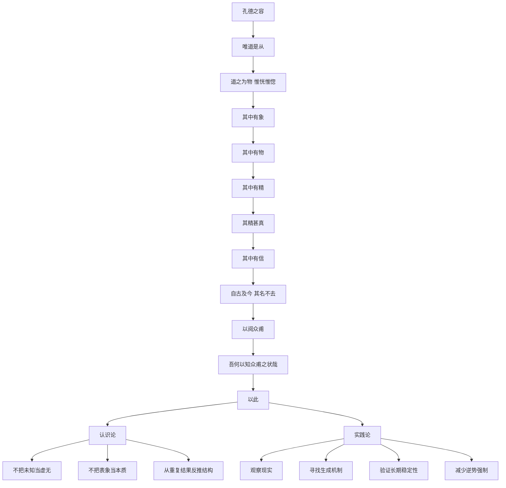

# 《道德经》第二十一章：孔德之容，唯道是从

> 第二十章以“我独异于人，而贵食母”结束：真正的稳定，不来自外部评价，而来自对生命根源的重新依归。第二十一章立即追问一个更深的问题：这个被称为“母”、被称为“道”的根源，究竟如何被认识？老子的回答极具张力——道本身“恍惚”“窈冥”，不能像普通对象那样被清楚抓住；但它又不是虚无，因为其中“有象”“有物”“有精”“有信”，并且从古至今都能通过万物的生成与秩序留下可验证的踪迹。于是，本章把《道德经》的讨论从伦理与生活态度推进到一套非常成熟的认识论：**真正重要的根本规律，往往不能被直接占有，却可以通过持续、稳定、可重复的现象被间接认识。**

## 一、原文

> 孔德之容，唯道是从。
>
> 道之为物，惟恍惟惚。
>
> 惚兮恍，其中有象；
>
> 恍兮惚，其中有物。
>
> 窈兮冥，其中有精；
>
> 其精甚真，其中有信。
>
> 自古及今，其名不去，以阅众甫。
>
> 吾何以知众甫之状哉？
>
> 以此。

## 二、白话翻译

真正盛大的“德”呈现出来的样子，是只顺从于“道”，而不是顺从个人的欲望、偏见和一时风潮。

道若要被说成某种“存在”，它总是恍恍惚惚，无法像桌椅器物那样被固定地指认。

然而，就在这恍惚之中，仿佛又存在着可以呈现出来的“象”；在那若有若无的状态中，又确实孕含着能够形成具体事物的东西。

它幽深而难以直接看见，但其中又有一种最根本的精微结构与生成力量；这种“精”并非虚假想象，而是真切有效的，其中包含着可以被反复验证的可靠性。

从古至今，道的作用和它所指向的根本规律没有消失。通过它，我们能够观察万物的生成、起点与基本形态。

我凭什么知道万物之初、万物生成的大体情状呢？

就是凭这些持续呈现出来的迹象与规律。

## 三、本章总览：从“不可见”走向“可验证”

第二十一章最重要的地方，不在于它再次强调“道很玄”，而在于老子同时完成了两个动作：

1. 拒绝把“道”变成一个可以轻易定义、占有的对象；
2. 又拒绝把“道”变成什么都可以解释、因此什么都不能检验的空洞神秘主义。

整章的逻辑可以压缩为一条非常清晰的链条：

```text
孔德之容
   ↓
唯道是从
   ↓
道不可被直接固定
“惟恍惟惚”
   ↓
但并非空无
“其中有象 / 有物”
   ↓
更深层存在生成结构
“其中有精”
   ↓
这种结构能够稳定地产生结果
“其中有信”
   ↓
跨越时间仍然成立
“自古及今，其名不去”
   ↓
因此可以由万物反推其根源
“吾何以知众甫之状哉？以此”
```

这是一种非常重要的思想方法：

> **不要因为一个根本规律不能被直接看见，就断定它不存在；也不要因为它难以直接看见，就允许自己任意幻想。真正的判断要回到它是否能够持续产生可观察、可比较、可验证的结果。**

换成现代语言，本章讨论的是“看不见的结构，如何通过看得见的结果被认识”。

## 四、关键词精讲

### 1. “孔德之容”：不是外表华丽，而是德如何显现

“孔”在古汉语中可以表示“大”“甚”“盛”。古代注家也有不同解释，有的强调“盛大”，有的从“空”与虚静的方向理解。就本章整体语义而言，把“孔德”理解为“深厚、盛大的德”最容易与下文连接。

“容”这里也不宜只理解成“包容”。它更接近“容貌、呈现出来的样子、外在形态”。

因此，“孔德之容”可以理解为：

> 一个真正深厚的德，呈现出来是什么样子？

老子的回答并不是“更仁慈”“更强大”“更有威严”，而是：

> **唯道是从。**

也就是说，真正的德不是自我风格的强化，而是个人逐渐减少自己的任性，让行动越来越符合更大的规律。

这与第十七章“功成事遂，百姓皆谓我自然”相互呼应：最高层次的领导，不是把自己的意志印在所有人身上，而是让系统本身顺畅运行。

### 2. “唯道是从”：不是消极服从，而是把现实置于自我之前

“从道”常被误解成一种神秘的宗教服从。其实在《道德经》的整体语境中，“道”更接近万物生成、变化、循环的根本方式。

因此，“唯道是从”意味着：

- 不因为自己喜欢，就假装事实不存在；
- 不因为已经投入很多，就拒绝改变方向；
- 不因为身份需要，就扭曲现实；
- 不因为短期利益，就破坏长期结构；
- 不因为能够控制，就认为应该控制。

这是一种极严格的现实主义。

真正“从道”的人，不是最固执地坚持原则口号的人，而是最愿意让自己的认知被事实修正的人。

### 3. “道之为物”：道为什么又被说成“物”？

第一章已经说“道可道，非常道”，说明道不能被普通概念完全捕捉。这里却出现“道之为物”，似乎把道又说成了一个“东西”。

这正是本章的哲学难点。

这里的“物”不必理解成现代意义上的具体物质对象。更合适的理解是：当我们不得不用语言谈论“道”如何呈现时，它具有某种“存在的样态”，但这种存在并不像普通对象那样边界清楚。

所以老子马上补上一句：

> 惟恍惟惚。

也就是说：

> 你可以说它“存在”，但不要以为自己已经把它抓住了。

### 4. “恍惚”：不是混乱，而是边界尚未固定

今天说一个人“精神恍惚”，通常带有注意力不集中、神志模糊的意思。但在本章里，“恍惚”更接近一种尚未被固定成清晰形状的状态。

它的重要特征不是“什么都没有”，而是：

- 还没有完全分化；
- 还不能被明确命名；
- 可能性仍然很多；
- 结果尚未定型；
- 但某些结构已经开始出现。

这与种子发芽之前、一个想法成形之前、一个社会趋势刚出现时很像。

真正成熟的判断力，往往不是等到一切完全清晰以后才理解，而是能够在“恍惚”阶段辨认方向，同时又不把早期迹象误当成确定结论。

### 5. “其中有象”：最早出现的是模式

“象”可以理解成形象、迹象、模式、可被感知的轮廓。

在一个事物真正成形以前，往往先出现“象”。例如：

- 一个组织开始失去活力，最初不是财务报表崩溃，而是会议越来越多、决策越来越慢、优秀的人开始沉默；
- 一个软件系统开始老化，最初不是全面宕机，而是改一个小功能需要碰越来越多模块；
- 一个人长期疲惫，最初可能不是明确疾病，而是睡眠、注意力、情绪和恢复能力同时出现小变化。

“象”不是最终事实，却是结构变化最早留下的影子。

老子提醒我们：**看懂世界，要学会看“象”，但不能停在“象”。**

### 6. “其中有物”：模式背后有真实结构

如果“象”只是表面迹象，那么“物”意味着这些迹象并非纯粹幻觉，它们背后有能够形成具体结果的结构。

可以用一个现代类比理解：

```text
迹象（象）
  ↓
结构（物）
  ↓
机制（精）
  ↓
稳定结果（信）
```

例如，一个公司连续多个季度出现客户流失，这只是“象”；进一步研究可能发现产品体验下降、成本结构失衡、组织激励错位，这才接近“物”。

真正的分析不能停在图表，也不能停在新闻标题，而要追问：

> 这些现象背后，究竟有什么实际结构正在运作？

### 7. “窈兮冥”：越接近根本，越不容易直接观察

“窈”有幽深、深远之意；“冥”有幽暗、不可清楚看见之意。

老子在这里非常准确地描述了一个普遍规律：

> 表层结果容易看见，深层原因往往难以直接看见。

我们看到树叶，却看不见根系；看到价格，却看不见所有参与者的预期；看到系统输出，却未必看见内部状态；看到一个人的行为，却未必知道长期形成这一行为的经验与心理结构。

因此，越接近根本问题，越需要谦逊。

“窈冥”不是邀请人停止思考，而是提醒我们：**不要把容易看见的东西误认为最重要的东西。**

### 8. “其中有精”：精不是神秘物质，而是生成的核心机制

“精”在古代思想中有精微、精粹、生命生成要素等含义。

在本章中，可以把“精”理解为：

> 使一个结构能够持续生成结果的最核心因素。

如果说“物”是已经存在的结构，那么“精”就更接近结构背后的生成能力。

例如：

- 企业真正的“精”不只是办公楼和现金，而可能是人才密度、技术积累、文化与客户信任；
- 软件系统真正的“精”不只是代码行数，而是清晰边界、稳定协议、可观察性与可恢复性；
- 教育真正的“精”不只是课程数量，而是好奇心、理解力、反馈与持续学习能力。

“精”越接近根本，就越不能只用表面数量来衡量。

### 9. “其精甚真”：真正的深层结构会在现实中留下后果

老子说“其精甚真”，非常重要。

如果“恍惚”“窈冥”只是为了制造神秘感，那么这一句没有必要出现。

“甚真”说明：

> 虽然无法直接抓住，但它并不是随便想象出来的。

这为理解老子的“玄”提供了边界。

真正的“玄”，不是反事实、反逻辑、反经验；恰恰相反，它要求我们承认：世界存在比直接观察更深的层次，但这些深层结构最终必须通过现实结果显现出来。

### 10. “其中有信”：本章最现代的一句话

“信”在这里不只是“相信”。它更接近可信、可靠、可验证、不会欺骗。

因此“其中有信”可以理解成：

> 这个深层机制具有稳定性，它不是今天这样、明天完全相反；它能够反复通过结果显示自己的存在。

这与现代认识论、科学方法甚至工程思维都非常接近。

我们不能直接看见“重力”，但可以反复观察重力效果；不能直接看见一个分布式系统的所有状态，但可以通过日志、指标、错误模式和延迟行为判断系统结构；不能直接知道一个人的全部动机，但可以通过长期行为判断其可信度。

所以本章提供了一条极有价值的原则：

> **不要只问“我能不能看见它”，还要问“它是否持续产生一致的结果”。**

### 11. “自古及今，其名不去”：跨时间的稳定性

一个短期有效的技巧，不一定是“道”。

一个真正接近根本的规律，往往具有跨时间的稳定性。

比如：

- 过度扩张会增加脆弱性；
- 权力过度集中会使信息越来越失真；
- 资源长期透支会降低系统恢复能力；
- 激励机制会持续塑造行为；
- 复杂系统需要冗余与反馈；
- 人的欲望会在比较中不断膨胀。

这些规律在不同年代会换一种表面形式，但深层结构长期存在。

“其名不去”不是说一个文字标签几千年不变，而是说被这个名字指向的根本现象持续存在。

### 12. “众甫”：万物的开端与生成者

“甫”在古文本中有起始、父、男子等多重关联。出土文本中也可见“众父”等异文，因此这里的解释长期存在讨论。

无论采用“众甫”还是“众父”的方向，整句的重点都指向：

> 万物从哪里开始？什么使它们得以生成？

因此“以阅众甫”可以理解为：借由“道”的持续作用，观察万物的起点与生成模式。

这里再次显示老子的兴趣并不只是“世界是什么”，而是：

> **世界是怎样不断成为它现在这个样子的？**

### 13. “吾何以知……？以此”：老子的证据意识

这一问一答极其值得注意。

老子没有说：

- 因为圣人告诉我；
- 因为古书这样写；
- 因为我有特殊启示；
- 因为这是不可质疑的真理。

他问：

> 我凭什么知道？

然后回答：

> 以此。

“此”指向前面整条证据链：象、物、精、真、信，以及它跨越时间的持续呈现。

这说明老子的认识方式不是简单的权威主义，而更接近一种**从现象反推结构、从长期结果验证根本规律的推理方式**。

## 五、文本与版本辨析

第二十一章在不同传世本与出土文本中存在若干值得注意的异文。理解这些差异，不是为了追求“唯一正确版本”，而是帮助我们看见古文本在长期传抄中的层次。

### 1. “惟 / 唯”

不同版本中“惟”与“唯”常有互见。在本章语义中差别并不大，主要表达“独、只是”或句中语气。

本项目原文采用常见通行写法：

> 唯道是从；惟恍惟惚。

### 2. “恍 / 惚 / 忽 / 怳”

传世本、敦煌本及不同注本中，“恍”“惚”“忽”“怳”等字存在互见。这类字本身都与模糊、若有若无、难以固定把握有关。

因此，字形虽有不同，整体思想并未改变：

> 道不是一个边界清楚、可以被完全对象化的实体。

### 3. “自古及今”与“自今及古”

马王堆帛书系统可见“自今及古”一类次序，与传世本“自古及今”方向相反。

两种表达实际上都强化同一个意思：

> 无论顺着时间向前看，还是从当下向过去追溯，被称为“道”的根本结构都持续可见。

### 4. “众甫 / 众父”

出土文本中可见“众父”的形式，传世本多作“众甫”。“父”更容易让人联想到生成者、源头；“甫”则可以与开始、初始相关联。

这使本章最后的“众甫”与第一章“万物之母”、第二十章“贵食母”形成了很有意思的呼应：

```text
母 —— 生成与滋养
父 / 甫 —— 起点与开端
道 —— 超越具体父母概念的生成根源
```

这里不必把它神话化，更重要的是理解老子反复关心“生成”而不是静止实体。

## 六、哲学主线一：道不是对象，而是生成关系

现代人习惯问：

> “道到底是什么东西？”

但这个问题本身可能已经把我们带偏。

因为一旦问“是什么东西”，我们就会期待：

- 一个定义；
- 一个边界；
- 一个可以摆在面前观察的对象；
- 一个与其他对象并列的实体。

而老子一直在暗示，道不是“宇宙中某一个最大的东西”，而更接近：

> 使万物得以生成、变化、互相作用并返回的根本关系与过程。

所以它无法像物体一样被抓住，却可以通过万物的行为被辨认。

这就像：

- 规则不等于棋子，却通过棋子的行动显现；
- 协议不等于数据包，却通过系统通信显现；
- 语法不等于任何一句话，却通过无数句子显现；
- 生态规律不等于任何一棵树，却通过整个生态系统显现。

类比当然不等于“道”本身，但它们帮助我们理解：

> **最重要的结构，有时并不是一个对象，而是一套关系。**

## 七、哲学主线二：真正的智慧是“从结果反推结构”

本章最值得训练的能力，是从“象”走向“精”。

很多错误判断都发生在这里：

```text
看到一个现象
   ↓
立即给出结论
   ↓
把结论当成事实
   ↓
忽略背后的结构
```

老子的路径更慢：

```text
看到“象”
   ↓
确认是否有真实的“物”
   ↓
寻找持续生成结果的“精”
   ↓
检查它是否“甚真”
   ↓
观察是否“有信”——能否重复验证
   ↓
再判断是否接近长期规律
```

这是一套非常强大的分析框架。

### 例：公司突然高速增长

表面“象”：

- 收入增长很快；
- 用户增长很快；
- 市场讨论热烈。

不能马上得出“这是一家伟大的公司”。

还要继续问：

**物：**增长由什么结构产生？

- 一次性补贴？
- 行业周期？
- 真正的产品优势？
- 渠道垄断？

**精：**最核心的可持续能力是什么？

- 技术？
- 网络效应？
- 品牌？
- 成本优势？
- 组织能力？

**信：**这些能力能否跨多个周期重复产生结果？

这时，我们才从“看热闹”进入“看结构”。

## 八、哲学主线三：模糊不等于无知，清晰也不等于真实

现代社会高度奖励“快速清晰”：

- 30秒给观点；
- 一句话总结复杂问题；
- 立刻选边；
- 立即预测结果。

但复杂世界常常处于“恍惚”状态。

新技术刚出现时，我们不知道它最终会成为基础设施还是泡沫；一个孩子成长时，我们无法在十岁就确定其终身职业；一个重大疾病在早期可能只有非特异性信号；一个国家的长期变化也不可能被单一事件完全解释。

因此，成熟思维必须容纳两件事同时成立：

1. **目前还不够清楚；**
2. **但已经有一些值得追踪的真实迹象。**

这正是“惟恍惟惚，其中有象”的现代意义。

真正危险的不是“不确定”，而是：

> 为了摆脱不确定带来的不舒服，过早制造一个确定答案。

## 九、与前文的深层连接

### 1. 与第一章：“无名天地之始，有名万物之母”

第一章讲的是：概念化之前存在更根本的生成过程。

第二十一章进一步解释：我们虽然不能直接抓住那个“无名”的层次，却能通过“象、物、精、信”看到它的作用。

### 2. 与第十四章：“视之不见名曰夷”

第十四章强调道超越普通感官对象：视之不见、听之不闻、搏之不得。

第二十一章补上关键一半：

> 看不见，不等于没有证据。

第十四章强调“不可直接对象化”，第二十一章强调“可以通过生成结果间接认识”。

### 3. 与第十六章：“观复”

第十六章说“万物并作，吾以观复”。

“观复”本质上也是一种长期观察：不是只看一次事件，而是看循环、回返与重复模式。

第二十一章的“其中有信”正好解释为什么长期观察有意义——因为深层结构会反复留下痕迹。

### 4. 与第二十章：“贵食母”

第二十章最后说“贵食母”，第二十一章就开始说明这个“母”为什么值得信任。

不是因为它被权威宣布为真，而是因为：

- 其中有象；
- 其中有物；
- 其中有精；
- 其精甚真；
- 其中有信。

所以第二十、二十一章可以连读为：

```text
第二十章：我把生命重新连接到根源
第二十一章：我如何知道这个根源不是幻想？
```

## 十、现代应用一：组织领导——不要管理表象，要管理生成机制

一个管理者如果只看结果指标，很容易不断处理“象”，却从不修复“精”。

例如：

### 表面问题

项目总是延期。

### 常见反应

- 加会议；
- 加日报；
- 加审批；
- 要求员工更努力；
- 强化问责。

这些措施可能暂时改变“象”，却未必改变结构。

按照本章的方法，应继续往下追：

```text
象：项目延期
↓
物：跨团队依赖过多、需求不断变化
↓
精：职责边界不清、决策权与责任不匹配
↓
信：几乎每个项目都重复出现同样问题
↓
结论：问题不是“某个人不努力”，而是系统结构持续生成延期
```

这就是“以此知众甫”：从重复出现的结果反推生成它的源头。

## 十一、现代应用二：软件架构——代码是“象”，边界才接近“精”

软件工程师最容易看到的是代码，但一个大型系统真正决定长期质量的东西，往往不在某一段代码中。

可以套用本章结构：

| 老子概念 | 软件架构类比 |
|---|---|
| 象 | 错误日志、延迟、故障、代码异味 |
| 物 | 服务、数据库、队列、依赖关系 |
| 精 | 边界设计、数据所有权、协议、故障隔离机制 |
| 真 | 是否真实决定系统行为 |
| 信 | 在不同负载和故障条件下是否重复表现一致 |

一个系统经常出现超时，最差的做法是不断把 timeout 从30秒调成60秒、再调成120秒。

这只是处理“象”。

更深的分析要问：

- 为什么请求链这么长？
- 哪个组件拥有最终一致性责任？
- 是否存在隐藏的同步依赖？
- 是否把高延迟操作放在关键路径？
- 故障是否能够局部化？

好的架构师不是知道所有代码细节的人，而是能从大量表象中识别稳定结构的人。

## 十二、现代应用三：AI——模型输出不是智慧本身

AI时代尤其需要第二十一章这种认识论。

一个模型可以生成非常流畅的回答，这只是“象”。

还需要继续问：

- 它是否真的掌握了对应事实？
- 输出是否可以被来源验证？
- 在相似问题上是否保持一致？
- 在边界案例中是否会崩溃？
- 它的推断依赖哪些输入、训练分布与工具？

流畅性不等于真实性。

“其中有信”提供了一个非常好的AI使用原则：

> **重要判断不能因为回答看起来像真的就接受，而要检查它是否能够被独立证据支持。**

AI越强，这个原则越重要。

## 十三、现代应用四：投资——价格是“象”，企业能力才接近“精”

市场价格每天变化，最容易吸引注意力，但价格本身往往只是大量因素汇合后的表层信号。

本章可以帮助建立一个更稳健的观察顺序：

```text
价格变化
  ↓
经营事实
  ↓
产业结构
  ↓
企业核心能力
  ↓
长期可重复性
```

例如，一家公司股价短期上涨，并不能证明企业价值永久提升；同样，短期下跌也不能自动证明企业失去竞争力。

真正值得研究的是：

- 产品需求是否真实；
- 毛利和现金流是否有结构性支撑；
- 技术优势是否可以持续；
- 客户是否愿意重复购买；
- 竞争对手是否容易复制；
- 管理层资本配置是否长期一致。

这些才更接近“精”与“信”。

本章并不提供买卖技巧，而是在训练一种更根本的习惯：

> 不被最显眼的变量绑架。

## 十四、现代应用五：学习——从记住答案转向识别结构

真正高水平的学习，不是积累越来越多孤立知识点，而是从大量例子中抽取稳定模式。

一个学生如果只记答案，会拥有很多“象”；

如果能够理解：

- 为什么这个公式成立；
- 哪些条件改变后它会失效；
- 不同问题为何共享同一个结构；
- 怎样从第一原则重新推出结论；

才开始接近“精”。

所以学习可以分成四层：

```text
记事实
↓
看模式
↓
懂机制
↓
能迁移
```

“能迁移”就是一种“有信”：换一个场景，理解依然有效。

## 十五、现代应用六：家庭与教育——不要过早定义一个人

孩子、伴侣或家人处在变化过程中时，最危险的做法之一，是把阶段性表现固定成身份：

- “他就是懒”；
- “她就是不擅长数学”；
- “这个孩子没有领导力”；
- “他性格就是这样，改不了。”

这等于把“象”直接当成了“本质”。

第二十一章提醒我们，很多生命状态仍然处在“恍惚”阶段：

- 能力尚未成熟；
- 兴趣尚未形成；
- 环境可能不匹配；
- 当前行为可能只是压力反应。

更好的观察方式是：

> 看长期模式，而不是用一次表现给一个人定型。

这也是“德”的一种表现：给真实成长留下空间。

## 十六、三个常见误读

### 误读一：道既然“恍惚”，那就什么都可以说

错误。

如果什么解释都可以成立，“其中有信”就没有意义。

老子允许根本结构难以直接描述，但不允许它脱离现实结果。

### 误读二：老子反对清晰、逻辑和知识

也不准确。

老子反对的是把有限概念当成全部现实。

他并不是说“不需要判断”，而是在要求判断更有层次：

- 承认未知；
- 观察迹象；
- 寻找结构；
- 检查重复性；
- 再形成结论。

这比简单贴标签更严格，而不是更松散。

### 误读三：“从道”就是听天由命

“唯道是从”不是放弃行动，而是减少逆着结构硬做的行动。

农民顺应季节，不等于什么都不做；工程师尊重系统约束，也不等于停止设计。

真正的“从”包含：

- 观察；
- 适应；
- 调整；
- 借力；
- 避免无效强制。

它更接近高水平行动，而不是消极等待。

## 十七、实战框架：从“象”追到“信”

遇到复杂问题时，可以用下面七问：

### 第一步：象——我到底看到了什么？

只记录事实，不急着解释。

### 第二步：物——这些现象背后有什么实际结构？

找出角色、资源、依赖、流程、约束。

### 第三步：精——什么因素真正持续生成结果？

区分相关性与生成机制。

### 第四步：真——这个机制是真实存在，还是我编出的故事？

寻找反例和替代解释。

### 第五步：信——它能否重复？

在不同时间、不同情境下检查。

### 第六步：久——它是否跨周期仍然成立？

区分短期偶然与长期结构。

### 第七步：从——如果这就是现实结构，我该怎样顺势行动？

调整行为，而不是要求世界配合自己的想象。

可以记成：

> **见象 → 察物 → 求精 → 验真 → 取信 → 观久 → 从道。**

## 十八、案例推演：为什么一个系统总在“救火”

假设一个技术团队每个月都发生生产事故。

### 第一层：象

- 告警频繁；
- 夜间紧急处理；
- 用户投诉；
- 负责人不断协调。

### 第二层：物

检查系统结构后发现：

- 多个服务共享同一个数据库；
- 发布依赖人工步骤；
- 没有清晰回滚机制；
- 监控只看CPU和内存，不看业务失败率。

### 第三层：精

真正持续制造事故的，不是“某个人粗心”，而是：

> 系统缺乏隔离、自动化和可观察性。

### 第四层：信

过去六个月的事故虽然表面原因不同，却几乎都经过同一条故障传播路径。

这就说明已经找到一个具有“信”的深层结构。

### 第五层：从道

解决方案不再是“以后大家小心一点”，而是：

- 拆分故障域；
- 自动化发布；
- 设计回滚；
- 建立业务级SLO；
- 用系统改变行为。

这就是第二十一章的现代版本：

> 不被每一次“象”牵着跑，而是找到生成这些“象”的“精”。

## 十九、心智模型



## 二十、一页大师课

如果只记住本章十句话，可以记这十句：

1. **真正的德，不是强化自我，而是减少自我对现实的扭曲。**
2. **道不能被完全对象化，但可以通过结果被认识。**
3. **恍惚不是虚无，而是尚未完全定型。**
4. **象是迹象，物是结构，精是生成机制。**
5. **深层结构越重要，往往越不容易直接看见。**
6. **“甚真”要求我们区分真实机制与漂亮故事。**
7. **“有信”意味着真正的规律能够重复留下证据。**
8. **短期技巧不等于长期规律。**
9. **成熟判断不是最快给答案，而是最能从结果反推结构。**
10. **知“道”的目的不是炫耀认识，而是调整行动，使自己少一点逆势、多一点顺势。**

## 二十一、思考练习

### 练习一：象与精

选一个你最近遇到的问题，分别写出：

- 表面现象是什么？
- 背后的结构是什么？
- 最核心的生成机制是什么？
- 有什么重复证据支持？

### 练习二：寻找“有信”的东西

列出三件你曾经相信、后来发现只是短期现象的事情，再列出三条经过多年仍然成立的规律。

问自己：

> 我过去是否经常把“新鲜”误认为“真实”？

### 练习三：给不确定留空间

面对一个目前无法确定的问题，尝试不用“是 / 否”立刻结束，而是写下：

```text
已经知道什么？
还不知道什么？
哪些迹象值得继续观察？
什么证据出现后，我会改变判断？
```

这就是把“惟恍惟惚”变成一种严谨，而不是一种含糊。

## 二十二、参考与延伸阅读

### 古典文本

- 《老子》通行本第二十一章。
- 王弼《老子注》相关章节。
- 河上公《老子章句》第二十一章。
- 马王堆帛书《老子》甲本、乙本相关章段。
- 唐宋以来《道德经》诸家注本中关于“孔德”“恍惚”“众甫”的解释。

### 数字文本核对

- Chinese Text Project（中国哲学书电子化计划）：《道德经》第二十一章及平行文本。
- Chinese Text Project：马王堆《老子》甲本第二十一章平行文本。

### 阅读提示

阅读古本异文时，应重点关注思想结构，而不要把每一个字形差异都扩大成完全不同的哲学体系。本章几个版本虽然在“惟 / 唯”“恍 / 忽”“众甫 / 众父”“自古及今 / 自今及古”等处有差异，但共同保留了最重要的逻辑：

> 道难以直接把握，却通过万物生成所呈现的稳定结构而可被认识。

## 二十三、本章总结

第二十一章是《道德经》中最值得用“认识论”来读的一章之一。

它从“孔德之容，唯道是从”出发，说明真正的德并不是自我意志的扩张，而是让自身越来越符合更大的现实结构。随后，老子把“道”描述为“惟恍惟惚”“窈兮冥”——它不能像普通对象那样被直接抓住。

但老子并没有因此滑向虚无。

恰恰相反，他连续说：

```text
其中有象
其中有物
其中有精
其精甚真
其中有信
```

这五层构成了全章最重要的证据阶梯。

我们先看到迹象，再确认真实结构，再寻找生成机制，再检验它是否真实，最后观察它能否稳定重复。正因为这种结构“有信”，所以老子才敢说“自古及今，其名不去”，并进一步回答：“吾何以知众甫之状哉？以此。”

因此，本章真正教给我们的，不是如何谈论玄妙，而是如何面对复杂世界：

> **看见表象，但不被表象困住；承认未知，但不把未知变成幻想；寻找深层结构，并用长期、重复、可靠的结果检验它。**

第二十章让我们“贵食母”，重新回到根源；第二十一章则进一步告诉我们，为什么可以信任这个根源——因为它并非只存在于语言中，而是不断在万物的生成、变化与重复规律中留下痕迹。

这也为第二十二章“曲则全，枉则直”做好准备：一旦认识到世界不是靠僵硬直线运行，而是依照更深的生成规律变化，我们就能够理解老子为什么会把“曲、枉、洼、敝、少”这些看似不利的状态，重新解释为转化与成全的条件。